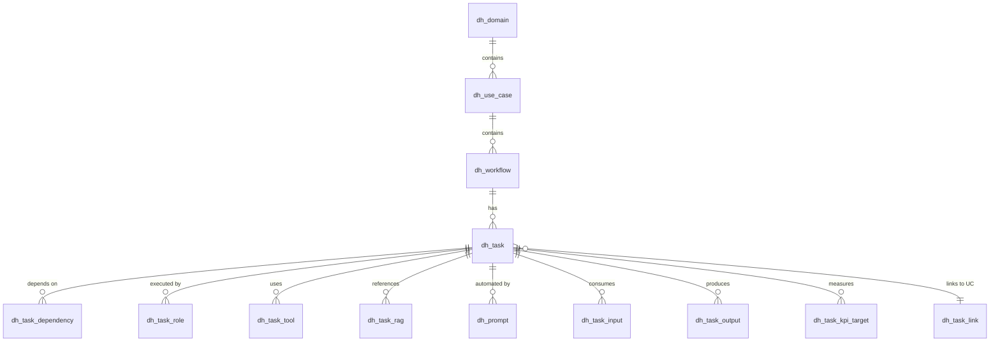

# 🧭 Digital Health Workflow Data Architecture (Supabase / Postgres)

## 1. Objective
To create a unified data model that represents **digital health workflows** end-to-end — connecting domains, use cases, workflows, and granular tasks.  
This model supports both business intelligence and AI workflow orchestration.

---

## 2. Conceptual Layers

```
Domain → Use Case → Workflow → Task → Task Metadata
```

| Level | Purpose | Example |
|-------|----------|---------|
| **Domain** | Business area | Clinical Development |
| **Use Case** | End-to-end process | UC_CD_003 – RCT Design |
| **Workflow** | Logical grouping of tasks | “RCT Design Workflow” |
| **Task** | Smallest executable unit | “Sample Size Calculation” |

Each **Task** may include:
- Assigned **Agents/Roles**
- Required **Tools**
- Referenced **RAG sources**
- One or more **AI Prompts**
- **Inputs** and **Outputs**
- **Dependencies** on other tasks
- Optional **KPIs**

---

## 3. Data Model Overview

### 3.1. Core Entities

| Table | Description |
|-------|--------------|
| `dh_domain` | Top-level functional domain (CD, RA, MA, PD, EG) |
| `dh_use_case` | Represents a business use case within a domain |
| `dh_workflow` | Group of tasks forming a process |
| `dh_task` | Atomic step of execution |
| `dh_task_dependency` | Defines dependency graph between tasks |

---

### 3.2. Task Metadata Entities

| Table | Description |
|-------|-------------|
| `dh_role` | Human or AI agents available in organization |
| `dh_task_role` | Assignment of roles to tasks (Lead, Reviewer, etc.) |
| `dh_tool` | Approved software or system |
| `dh_task_tool` | Tools linked to tasks |
| `dh_rag_source` | Trusted external knowledge bases |
| `dh_task_rag` | Links RAG sources to tasks |
| `dh_prompt` | Prompt definitions for AI use |
| `dh_prompt_version` | Version history of each prompt |
| `dh_prompt_eval` | Evaluation results from test runs |
| `dh_task_input` | Artifacts required to execute task |
| `dh_task_output` | Artifacts produced by task |
| `dh_kpi` | Defined KPIs for performance tracking |
| `dh_task_kpi_target` | Target KPI values per task |
| `dh_task_link` | Cross-use-case references |

---

### 3.3. Relationship Diagram (simplified)



---

## 4. Functional Logic

### 4.1. Dependencies

Tasks form a **Directed Acyclic Graph (DAG)**:

* `dh_task_dependency` stores parent–child relationships
* Dependency order defines workflow execution sequence

### 4.2. Role Assignment

Each task can have one or more roles:

* `Lead` = accountable owner
* `Reviewer` = quality/peer check
* `Approver` = sign-off authority

### 4.3. Tools Integration

Tools provide functional context — e.g., R for stats, Figma for UX, TreeAge for BIM.
Used to auto-load context when running a task in an orchestration layer.

### 4.4. RAG & Prompts

Each task can reference external validated documents or datasets.
AI prompts use those sources for retrieval-augmented reasoning.

### 4.5. Inputs / Outputs Traceability

* Inputs may be generated by upstream tasks or uploaded externally.
* Outputs become traceable artifacts (document links, datasets, dashboards).

### 4.6. KPIs

KPI targets quantify success (time, quality, acceptance rate).
Can be aggregated across workflows for analytics.

---

## 5. Implementation Roadmap

| Phase                         | Description                            | Deliverable             |
| ----------------------------- | -------------------------------------- | ----------------------- |
| **1. Schema Setup**           | Create tables, enums, constraints      | SQL migration           |
| **2. Data Seeding**           | Load domains, sample use cases         | Initial dataset         |
| **3. JSON Ingestion**         | Use case definitions → Postgres JSONB  | Populated workflows     |
| **4. API Layer**              | Supabase auto-generated REST endpoints | Programmatic access     |
| **5. Frontend / Dashboard**   | Visualize tasks, dependencies, agents  | Retool or Next.js       |
| **6. Automation / LLM Layer** | Execute AI prompts per task            | Task-runner integration |

---

## 6. Example Relationships (Business View)

### Example 1 — UC_CD_003 : RCT Design

```
Domain: Clinical Development
Use Case: UC_CD_003 – RCT Design
Workflow: “RCT Design Workflow”

T1 – Define Objectives
   ↳ Output: Study Objectives Doc
T2 – Comparator & Blinding
   ↳ Depends on: T1
   ↳ Tools: FDA guidance, internal precedent library
T5 – Sample Size Calculation
   ↳ Depends on: T1, T2
   ↳ Agents: Biostatistician
   ↳ Tools: R, TreeAge
   ↳ Output: Sample Size Justification Report
```

### Example 2 — UC_MA_006 : Budget Impact Model

```
Domain: Market Access
Use Case: UC_MA_006 – Budget Impact Model
Workflow: “BIM Development Workflow”

T1 – Define Population & Eligibility
T5 – Compute PMPM & Scenarios
   ↳ Depends on: T1–T4
   ↳ Agents: HEOR Analyst
   ↳ Tools: Excel, TreeAge
   ↳ Output: PMPM Table
T6 – Sensitivity Analysis
   ↳ Depends on: T5
   ↳ Output: Tornado Chart, Scenario Summary
```

---

## 7. JSON Data Template

Each workflow is represented as a JSON object with nested tasks.

```json
{
  "domain": "Clinical Development",
  "use_case": {
    "code": "UC_CD_003",
    "title": "DTx RCT Design",
    "summary": "Design FDA-acceptable randomized controlled trial",
    "workflows": [
      {
        "name": "RCT Design Workflow",
        "tasks": [
          {
            "code": "T1",
            "title": "Define Objectives and Hypotheses",
            "objective": "Specify primary and secondary study hypotheses",
            "agents": ["P01_CMO", "P04_BIOSTAT"],
            "tools": ["EDC", "MS Word"],
            "dependencies": [],
            "inputs": ["Endpoint Selection Report"],
            "outputs": ["Study Objective Document"]
          }
        ]
      }
    ]
  }
}
```

---

## 8. Business Benefits

* Cross-functional transparency between teams
* Standardized metadata for every process
* Foundation for AI-assisted workflow execution
* Regulatory and audit readiness
* Seamless integration into Supabase dashboards and automation tools

