# Value View Architecture - Visual Diagrams

**Last Updated**: December 1, 2025

---

## 1. System Architecture Overview

---

## 2. Ontology Layer Relationships

---

## 3. Cascading Filter Flow

---

## 4. Data Flow: Query Execution Path

---

## 5. Materialized View Refresh Schedule

```mermaid
gantt
    title Materialized View Refresh Schedule
    dateFormat HH:mm
    axisFormat %H:%M

    section Daily
    Strategic Alignment (Weekly)   :milestone, 01:00, 0m
    ODI Heatmap                     :crit, 02:00, 5m
    Persona Dashboard               :crit, 03:00, 1m
    Workflow Analytics              :crit, 04:00, 3m
    Value Realization               :crit, 05:00, 2m

    section Hourly
    JTBD Summary                    :active, 00:00, 1m
    JTBD Summary                    :active, 01:00, 1m
    JTBD Summary                    :active, 02:00, 1m
    JTBD Summary                    :active, 03:00, 1m
    JTBD Summary                    :active, 04:00, 1m
    JTBD Summary                    :active, 05:00, 1m
```

---

## 6. ODI Scoring Calculation

---

## 7. MECE Persona Framework

---

## 8. Service Layer Routing

---

## 9. Value Realization Tracking

---

## 10. Database Partitioning Strategy

---

## 11. Caching Strategy (3-Tier)

---

## 12. Performance Optimization Layers

---

**Last Updated**: December 1, 2025
**Maintained By**: VITAL Data Strategist Agent
