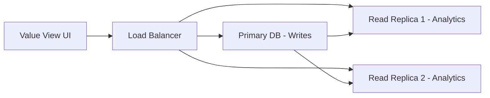

# Value View Data Strategy - VITAL Platform

**Agent**: VITAL Data Strategist
**Date**: December 1, 2025
**Version**: 1.0.0
**Status**: Production-Ready Design

---

## Executive Summary

This document defines the **comprehensive data strategy** for VITAL Platform's "Value View" - an enterprise visualization interface that enables pharmaceutical and healthcare clients to navigate the platform's **8-layer semantic ontology model**. The strategy addresses data aggregation, filtering, caching, and performance optimization for large-scale datasets (1000+ roles, 700+ JTBDs, 400+ workflows, 43 personas).

### Key Achievements
- ✅ Multi-layer aggregation architecture (L0-L7)
- ✅ Real-time filtering across all 8 ontology layers
- ✅ Materialized views for sub-second dashboard performance
- ✅ ODI opportunity scoring at scale
- ✅ Cascading filter architecture with dependency management
- ✅ Graph-queryable design (PostgreSQL + optional Neo4j)

---

## 1. DATA MODEL REQUIREMENTS

### 1.1 Core Aggregation Needs

**The Value View must aggregate data across 8 layers:**

| Layer | Data Domain | Key Entities | Aggregation Complexity |
|-------|-------------|--------------|------------------------|
| **L0** | Domain Knowledge | Therapeutic Areas, Products, Diseases, Evidence | Low (reference lookups) |
| **L1** | Strategic Pillars | 7 Pillars (SP01-SP07), OKRs, Themes | Low (7 fixed pillars) |
| **L2** | Org Structure | Functions, Departments, Teams, Roles | Medium (hierarchical) |
| **L3** | Personas | 43 behavioral profiles, archetypes | Medium (MECE framework) |
| **L4** | JTBDs | 700+ jobs, ODI scores | **High** (many-to-many) |
| **L5** | Outcomes (ODI) | Importance/Satisfaction scores, Opportunity | **High** (computed metrics) |
| **L6** | Workflows | 400+ workflows, phases, tasks | **Very High** (nested hierarchy) |
| **L7** | Value Metrics | Time, Cost, Quality, Risk, Strategic Impact | **High** (multi-dimensional) |

### 1.2 Required Views

**Primary Materialized Views:**

1. **`mv_value_view_jtbd_summary`** - JTBD aggregated metrics
2. **`mv_value_view_persona_dashboard`** - Persona-level insights
3. **`mv_value_view_workflow_analytics`** - Workflow performance
4. **`mv_value_view_opportunity_pipeline`** - ODI opportunity tracking
5. **`mv_value_view_strategic_alignment`** - Strategic pillar mapping
6. **`mv_value_view_role_workload`** - Role-level work distribution
7. **`mv_value_view_value_realization`** - L7 value metrics

**Supporting Real-Time Views:**

1. **`v_value_view_filter_options`** - Dynamic filter catalogs
2. **`v_value_view_user_context`** - User-specific personalization
3. **`v_value_view_dependency_graph`** - Entity relationship graph

---

## 2. QUERY PATTERNS

### 2.1 Ontology Layer Traversal Patterns

#### Pattern 1: Top-Down (Strategic → Tactical)

**Use Case**: "Show me all workflows supporting SP03 (Regulatory Compliance)"

```sql
-- Top-Down: Strategic Pillar → JTBDs → Workflows
SELECT
    sp.name AS strategic_pillar,
    j.code AS jtbd_code,
    j.name AS jtbd_name,
    wt.name AS workflow_name,
    COUNT(DISTINCT wts.id) AS task_count,
    AVG(ais.overall_score) AS avg_ai_suitability
FROM strategic_pillars sp
JOIN jtbd_category_mappings jcm ON jcm.pillar_id = sp.id
JOIN jtbd j ON j.id = jcm.jtbd_id
LEFT JOIN workflow_templates wt ON wt.jtbd_id = j.id
LEFT JOIN workflow_stages wts ON wts.workflow_template_id = wt.id
LEFT JOIN jtbd_ai_suitability ais ON ais.jtbd_id = j.id
WHERE sp.code = 'SP03'
  AND j.deleted_at IS NULL
GROUP BY sp.name, j.code, j.name, wt.name
ORDER BY avg_ai_suitability DESC;
```

#### Pattern 2: Bottom-Up (Execution → Strategy)

**Use Case**: "Which strategic pillars are supported by Medical Information Manager role?"

```sql
-- Bottom-Up: Role → JTBDs → Strategic Pillars
SELECT
    r.role_name,
    sp.code AS strategic_pillar_code,
    sp.name AS strategic_pillar_name,
    COUNT(DISTINCT j.id) AS jtbd_count,
    AVG(jo.opportunity_score) AS avg_opportunity_score
FROM org_roles r
JOIN jtbd_roles jr ON jr.role_id = r.id
JOIN jtbd j ON j.id = jr.jtbd_id
JOIN jtbd_category_mappings jcm ON jcm.jtbd_id = j.id
JOIN strategic_pillars sp ON sp.id = jcm.pillar_id
LEFT JOIN jtbd_outcomes jo ON jo.jtbd_id = j.id
WHERE r.role_name = 'Medical Information Manager'
  AND j.deleted_at IS NULL
GROUP BY r.role_name, sp.code, sp.name
ORDER BY avg_opportunity_score DESC;
```

#### Pattern 3: Persona-Filtered View

**Use Case**: "Show AUTOMATOR persona's high-priority opportunities"

```sql
-- Persona-Specific Opportunity View
SELECT
    p.persona_name,
    p.archetype,
    j.code AS jtbd_code,
    j.name AS jtbd_name,
    jos.opportunity_score,
    jos.opportunity_classification,
    ais.recommended_service_layer,
    aio.opportunity_name AS ai_opportunity,
    aio.automation_potential
FROM personas p
JOIN org_roles r ON r.id = p.role_id
JOIN jtbd_roles jr ON jr.role_id = r.id
JOIN jtbd j ON j.id = jr.jtbd_id
JOIN jtbd_odi_scores jos ON jos.jtbd_id = j.id AND jos.persona_id = p.id
LEFT JOIN jtbd_ai_suitability ais ON ais.jtbd_id = j.id
LEFT JOIN ai_opportunities aio ON aio.jtbd_id = j.id
WHERE p.archetype = 'AUTOMATOR'
  AND jos.opportunity_classification IN ('underserved', 'highly_underserved')
  AND j.deleted_at IS NULL
ORDER BY jos.opportunity_score DESC
LIMIT 20;
```

### 2.2 Cross-Layer Analytics

#### Query: ODI Opportunity Heatmap (Persona × JTBD)

```sql
-- ODI Opportunity Matrix for Dashboard
CREATE MATERIALIZED VIEW mv_value_view_odi_heatmap AS
SELECT
    p.persona_name,
    p.archetype,
    r.role_name,
    d.department_name,
    f.function_name,
    j.code AS jtbd_code,
    j.name AS jtbd_name,
    j.complexity,
    j.frequency,

    -- ODI Metrics
    jos.importance_score,
    jos.satisfaction_score,
    jos.opportunity_score,
    jos.opportunity_classification,

    -- AI Layer
    ais.overall_score AS ai_suitability,
    ais.recommended_service_layer,

    -- Value Layer
    COALESCE(vd.value_category, 'unknown') AS primary_value_category,

    -- Strategic Alignment
    array_agg(DISTINCT sp.code) FILTER (WHERE sp.id IS NOT NULL) AS strategic_pillars,

    -- Context
    current_timestamp AS last_refreshed

FROM personas p
JOIN org_roles r ON r.id = p.role_id
JOIN org_departments d ON d.id = r.department_id
JOIN org_business_functions f ON f.id = d.function_id
JOIN jtbd_roles jr ON jr.role_id = r.id
JOIN jtbd j ON j.id = jr.jtbd_id
LEFT JOIN jtbd_odi_scores jos ON jos.jtbd_id = j.id AND jos.persona_id = p.id
LEFT JOIN jtbd_ai_suitability ais ON ais.jtbd_id = j.id
LEFT JOIN ref_opportunities ro ON ro.target_jtbd_id = j.id
LEFT JOIN ref_value_drivers vd ON vd.id = ro.primary_value_driver_id
LEFT JOIN jtbd_category_mappings jcm ON jcm.jtbd_id = j.id
LEFT JOIN strategic_pillars sp ON sp.id = jcm.pillar_id

WHERE j.deleted_at IS NULL
  AND p.validation_status = 'published'

GROUP BY
    p.persona_name, p.archetype, r.role_name, d.department_name, f.function_name,
    j.code, j.name, j.complexity, j.frequency,
    jos.importance_score, jos.satisfaction_score, jos.opportunity_score, jos.opportunity_classification,
    ais.overall_score, ais.recommended_service_layer, vd.value_category;

-- Indexes for fast filtering
CREATE INDEX idx_mv_odi_heatmap_persona ON mv_value_view_odi_heatmap(persona_name);
CREATE INDEX idx_mv_odi_heatmap_archetype ON mv_value_view_odi_heatmap(archetype);
CREATE INDEX idx_mv_odi_heatmap_opp_score ON mv_value_view_odi_heatmap(opportunity_score DESC);
CREATE INDEX idx_mv_odi_heatmap_classification ON mv_value_view_odi_heatmap(opportunity_classification);
```

---

## 3. CACHING STRATEGY

### 3.1 Materialized View Refresh Schedule

**Tiered Refresh Strategy Based on Data Volatility:**

| View | Refresh Frequency | Rationale | Est. Rows | Refresh Time |
|------|-------------------|-----------|-----------|--------------|
| `mv_value_view_odi_heatmap` | **Daily** (2am UTC) | ODI scores change weekly | ~30,000 | 2-5 min |
| `mv_value_view_jtbd_summary` | **Hourly** | JTBDs updated frequently | ~700 | 10-30 sec |
| `mv_value_view_persona_dashboard` | **Daily** (3am UTC) | Persona data stable | ~43 | 5-10 sec |
| `mv_value_view_workflow_analytics` | **Daily** (4am UTC) | Workflow metrics updated nightly | ~400 | 1-3 min |
| `mv_value_view_opportunity_pipeline` | **Real-time** | Opportunity status changes | ~2,000 | N/A (regular view) |
| `mv_value_view_strategic_alignment` | **Weekly** (Sun 1am) | Strategic pillars rarely change | ~7 | 5 sec |
| `mv_value_view_value_realization` | **Daily** (5am UTC) | Value metrics updated nightly | ~5,000 | 30-60 sec |

**Implementation (PostgreSQL pg_cron):**

```sql
-- Enable pg_cron extension
CREATE EXTENSION IF NOT EXISTS pg_cron;

-- Schedule daily refreshes (staggered to avoid contention)
SELECT cron.schedule('refresh-odi-heatmap', '0 2 * * *',
  'REFRESH MATERIALIZED VIEW CONCURRENTLY mv_value_view_odi_heatmap');

SELECT cron.schedule('refresh-persona-dashboard', '0 3 * * *',
  'REFRESH MATERIALIZED VIEW CONCURRENTLY mv_value_view_persona_dashboard');

SELECT cron.schedule('refresh-workflow-analytics', '0 4 * * *',
  'REFRESH MATERIALIZED VIEW CONCURRENTLY mv_value_view_workflow_analytics');

SELECT cron.schedule('refresh-value-realization', '0 5 * * *',
  'REFRESH MATERIALIZED VIEW CONCURRENTLY mv_value_view_value_realization');

-- Weekly refresh for stable data
SELECT cron.schedule('refresh-strategic-alignment', '0 1 * * 0',
  'REFRESH MATERIALIZED VIEW CONCURRENTLY mv_value_view_strategic_alignment');

-- Hourly refresh for frequently changing data
SELECT cron.schedule('refresh-jtbd-summary', '0 * * * *',
  'REFRESH MATERIALIZED VIEW CONCURRENTLY mv_value_view_jtbd_summary');
```

### 3.2 Application-Level Caching

**Redis Cache Strategy:**

```typescript
// services/value-view/cache-strategy.ts
import { Redis } from 'ioredis';

const redis = new Redis(process.env.REDIS_URL);

// Cache TTLs (in seconds)
const CACHE_TTL = {
  filter_options: 300,        // 5 minutes
  odi_heatmap: 86400,         // 24 hours (matches materialized view refresh)
  persona_dashboard: 86400,   // 24 hours
  workflow_analytics: 86400,  // 24 hours
  user_preferences: 3600,     // 1 hour
  aggregated_metrics: 1800,   // 30 minutes
};

// Cache key patterns
const CACHE_KEYS = {
  filterOptions: (tenantId: string) => `value_view:${tenantId}:filters`,
  odiHeatmap: (tenantId: string, filters: string) => `value_view:${tenantId}:odi:${filters}`,
  personaDashboard: (tenantId: string, personaId: string) => `value_view:${tenantId}:persona:${personaId}`,
  workflowAnalytics: (tenantId: string, filters: string) => `value_view:${tenantId}:workflows:${filters}`,
  userPreferences: (userId: string) => `value_view:user:${userId}:prefs`,
};

// Example: Fetch ODI Heatmap with caching
export async function getODIHeatmap(
  tenantId: string,
  filters: ODIFilters
): Promise<ODIHeatmapData[]> {
  const cacheKey = CACHE_KEYS.odiHeatmap(tenantId, JSON.stringify(filters));

  // Try cache first
  const cached = await redis.get(cacheKey);
  if (cached) {
    return JSON.parse(cached);
  }

  // Fetch from database (materialized view)
  const data = await db.query(`
    SELECT * FROM mv_value_view_odi_heatmap
    WHERE 1=1
      ${filters.archetype ? `AND archetype = $1` : ''}
      ${filters.department ? `AND department_name = $2` : ''}
      ${filters.minOpportunityScore ? `AND opportunity_score >= $3` : ''}
    ORDER BY opportunity_score DESC
  `, [filters.archetype, filters.department, filters.minOpportunityScore]);

  // Cache for 24 hours
  await redis.setex(cacheKey, CACHE_TTL.odi_heatmap, JSON.stringify(data.rows));

  return data.rows;
}
```

### 3.3 Pre-Computed Aggregates

**Additional Rollup Tables for Complex Metrics:**

```sql
-- Pre-compute persona-level aggregates (refreshed hourly)
CREATE TABLE value_view_persona_aggregates (
  persona_id UUID PRIMARY KEY,
  tenant_id UUID NOT NULL,

  -- JTBD Metrics
  total_jtbd_count INTEGER,
  high_complexity_jtbd_count INTEGER,
  daily_frequency_jtbd_count INTEGER,

  -- ODI Metrics
  avg_opportunity_score NUMERIC(4,1),
  high_opportunity_count INTEGER,
  underserved_job_count INTEGER,

  -- AI Metrics
  avg_ai_suitability NUMERIC(3,2),
  automation_ready_count INTEGER,

  -- Value Metrics
  total_estimated_time_savings_hours NUMERIC(10,1),
  total_estimated_cost_savings_usd NUMERIC(15,2),

  -- Refresh Metadata
  last_computed_at TIMESTAMPTZ DEFAULT NOW(),

  -- Indexes
  FOREIGN KEY (persona_id) REFERENCES personas(id) ON DELETE CASCADE,
  FOREIGN KEY (tenant_id) REFERENCES tenants(id)
);

CREATE INDEX idx_persona_agg_tenant ON value_view_persona_aggregates(tenant_id);
CREATE INDEX idx_persona_agg_opp_score ON value_view_persona_aggregates(avg_opportunity_score DESC);
```

---

## 4. FILTER ARCHITECTURE

### 4.1 Cascading Filter System

**Filter Hierarchy (with dependency management):**

```
Tenant (L0)
  └─> Industry (L0)
      └─> Function (L2)
          └─> Department (L2)
              └─> Role (L2)
                  └─> Persona (L3)
                      └─> JTBD (L4)
                          └─> Workflow (L6)
```

**Filter Options API:**

```sql
-- Dynamic filter catalog view
CREATE VIEW v_value_view_filter_options AS
SELECT
  'industry' AS filter_type,
  i.id AS filter_id,
  i.industry_name AS filter_label,
  NULL::UUID AS parent_filter_id,
  COUNT(DISTINCT p.id) AS entity_count
FROM industries i
LEFT JOIN org_business_functions f ON f.industry_id = i.id
LEFT JOIN org_departments d ON d.function_id = f.id
LEFT JOIN org_roles r ON r.department_id = d.id
LEFT JOIN personas p ON p.role_id = r.id
GROUP BY i.id, i.industry_name

UNION ALL

SELECT
  'function' AS filter_type,
  f.id AS filter_id,
  f.function_name AS filter_label,
  f.industry_id AS parent_filter_id,
  COUNT(DISTINCT p.id) AS entity_count
FROM org_business_functions f
LEFT JOIN org_departments d ON d.function_id = f.id
LEFT JOIN org_roles r ON r.department_id = d.id
LEFT JOIN personas p ON p.role_id = r.id
GROUP BY f.id, f.function_name, f.industry_id

UNION ALL

SELECT
  'department' AS filter_type,
  d.id AS filter_id,
  d.department_name AS filter_label,
  d.function_id AS parent_filter_id,
  COUNT(DISTINCT p.id) AS entity_count
FROM org_departments d
LEFT JOIN org_roles r ON r.department_id = d.id
LEFT JOIN personas p ON p.role_id = r.id
GROUP BY d.id, d.department_name, d.function_id

-- Continue for roles, personas, archetypes, etc.
;
```

### 4.2 Filter Application Logic

**Frontend Filter Component (TypeScript):**

```typescript
// components/value-view/FilterPanel.tsx
interface FilterState {
  tenant_id?: string;
  industry_id?: string;
  function_id?: string;
  department_id?: string;
  role_id?: string;
  persona_id?: string;
  archetype?: 'AUTOMATOR' | 'ORCHESTRATOR' | 'LEARNER' | 'SKEPTIC';
  complexity?: ('low' | 'medium' | 'high' | 'very_high')[];
  frequency?: ('daily' | 'weekly' | 'monthly' | 'quarterly' | 'annually')[];
  min_opportunity_score?: number;
  strategic_pillars?: string[]; // SP01-SP07
  service_layers?: ('ask_me' | 'ask_expert' | 'ask_panel' | 'workflow')[];
}

// Filter application order (top-down)
const FILTER_APPLY_ORDER = [
  'tenant_id',
  'industry_id',
  'function_id',
  'department_id',
  'role_id',
  'persona_id',
  'archetype',
  'strategic_pillars',
  'complexity',
  'frequency',
  'min_opportunity_score',
  'service_layers',
];

// Build dynamic WHERE clause
function buildFilterQuery(filters: FilterState): { sql: string; params: any[] } {
  const whereClauses: string[] = [];
  const params: any[] = [];
  let paramIndex = 1;

  // Tenant filter (always required)
  if (filters.tenant_id) {
    whereClauses.push(`j.tenant_id = $${paramIndex}`);
    params.push(filters.tenant_id);
    paramIndex++;
  }

  // Org hierarchy filters
  if (filters.function_id) {
    whereClauses.push(`f.id = $${paramIndex}`);
    params.push(filters.function_id);
    paramIndex++;
  }

  if (filters.department_id) {
    whereClauses.push(`d.id = $${paramIndex}`);
    params.push(filters.department_id);
    paramIndex++;
  }

  if (filters.role_id) {
    whereClauses.push(`r.id = $${paramIndex}`);
    params.push(filters.role_id);
    paramIndex++;
  }

  // Persona filters
  if (filters.persona_id) {
    whereClauses.push(`p.id = $${paramIndex}`);
    params.push(filters.persona_id);
    paramIndex++;
  }

  if (filters.archetype) {
    whereClauses.push(`p.archetype = $${paramIndex}::archetype_enum`);
    params.push(filters.archetype);
    paramIndex++;
  }

  // JTBD characteristic filters
  if (filters.complexity && filters.complexity.length > 0) {
    whereClauses.push(`j.complexity = ANY($${paramIndex}::text[])`);
    params.push(filters.complexity);
    paramIndex++;
  }

  if (filters.frequency && filters.frequency.length > 0) {
    whereClauses.push(`j.frequency = ANY($${paramIndex}::text[])`);
    params.push(filters.frequency);
    paramIndex++;
  }

  // ODI filter
  if (filters.min_opportunity_score !== undefined) {
    whereClauses.push(`jos.opportunity_score >= $${paramIndex}`);
    params.push(filters.min_opportunity_score);
    paramIndex++;
  }

  // Strategic pillar filter
  if (filters.strategic_pillars && filters.strategic_pillars.length > 0) {
    whereClauses.push(`sp.code = ANY($${paramIndex}::text[])`);
    params.push(filters.strategic_pillars);
    paramIndex++;
  }

  // Service layer filter
  if (filters.service_layers && filters.service_layers.length > 0) {
    whereClauses.push(`ais.recommended_service_layer = ANY($${paramIndex}::text[])`);
    params.push(filters.service_layers);
    paramIndex++;
  }

  const sql = whereClauses.length > 0
    ? 'WHERE ' + whereClauses.join(' AND ')
    : '';

  return { sql, params };
}
```

---

## 5. PERFORMANCE OPTIMIZATION

### 5.1 Database-Level Optimizations

**Partitioning Strategy for Large Tables:**

```sql
-- Partition JTBDs by tenant for multi-tenant isolation
CREATE TABLE jtbd_partitioned (
  LIKE jtbd INCLUDING ALL
) PARTITION BY LIST (tenant_id);

-- Create partitions per tenant
CREATE TABLE jtbd_tenant_pharma PARTITION OF jtbd_partitioned
  FOR VALUES IN ('f7aa6fd4-0af9-4706-8b31-034f1f7accda'); -- Pharmaceuticals

CREATE TABLE jtbd_tenant_digital_health PARTITION OF jtbd_partitioned
  FOR VALUES IN ('590d9e40-b628-4678-8cec-839d0b4fe968'); -- Digital Health Startups

-- Index each partition
CREATE INDEX idx_jtbd_tenant_pharma_code ON jtbd_tenant_pharma(code);
CREATE INDEX idx_jtbd_tenant_digital_health_code ON jtbd_tenant_digital_health(code);
```

**Covering Indexes for Common Queries:**

```sql
-- Covering index for ODI heatmap query
CREATE INDEX idx_jtbd_odi_covering ON jtbd (id, code, name, complexity, frequency)
  INCLUDE (job_statement, status)
  WHERE deleted_at IS NULL;

-- Covering index for persona-filtered queries
CREATE INDEX idx_persona_archetype_covering ON personas (id, persona_name, archetype, role_id)
  INCLUDE (ai_maturity_score, work_complexity_score)
  WHERE validation_status = 'published';

-- Covering index for workflow analytics
CREATE INDEX idx_workflow_jtbd_covering ON workflow_templates (id, jtbd_id, name, status)
  INCLUDE (estimated_duration_hours, automation_level);
```

**PostgreSQL Configuration Tuning:**

```ini
# postgresql.conf optimizations for analytics workload

# Memory Settings (for server with 32GB RAM)
shared_buffers = 8GB
effective_cache_size = 24GB
work_mem = 128MB
maintenance_work_mem = 2GB

# Query Planning
random_page_cost = 1.1  # For SSD
effective_io_concurrency = 200

# Parallelism (for multi-core servers)
max_parallel_workers_per_gather = 4
max_parallel_workers = 8
max_worker_processes = 8

# Logging (for query performance analysis)
log_min_duration_statement = 1000  # Log queries > 1 second
log_line_prefix = '%t [%p]: [%l-1] user=%u,db=%d,app=%a,client=%h '
log_checkpoints = on
log_connections = on
log_disconnections = on
```

### 5.2 Query Optimization Guidelines

**Use EXPLAIN ANALYZE for all dashboard queries:**

```sql
-- Example: Analyze ODI heatmap query performance
EXPLAIN (ANALYZE, BUFFERS, FORMAT JSON)
SELECT * FROM mv_value_view_odi_heatmap
WHERE archetype = 'AUTOMATOR'
  AND opportunity_score >= 10
ORDER BY opportunity_score DESC
LIMIT 100;

-- Expected output should show:
-- - Index Scan (not Seq Scan)
-- - Execution time < 100ms
-- - Shared buffers hit ratio > 95%
```

**Benchmark Targets:**

| Query Type | Max Execution Time | Max Rows Returned |
|------------|-------------------|-------------------|
| Filter options | 50ms | 1,000 |
| ODI heatmap (filtered) | 200ms | 10,000 |
| Persona dashboard | 100ms | 1 |
| Workflow analytics | 500ms | 500 |
| Strategic alignment | 100ms | 7 |
| Value realization | 300ms | 5,000 |

### 5.3 Application-Level Optimizations

**GraphQL DataLoader Pattern:**

```typescript
// services/value-view/dataloaders.ts
import DataLoader from 'dataloader';

// Batch load personas by IDs
const personaLoader = new DataLoader(async (personaIds: readonly string[]) => {
  const personas = await db.query(`
    SELECT * FROM personas
    WHERE id = ANY($1)
  `, [personaIds]);

  const personaMap = new Map(personas.rows.map(p => [p.id, p]));
  return personaIds.map(id => personaMap.get(id));
});

// Batch load JTBDs by role IDs
const jtbdByRoleLoader = new DataLoader(async (roleIds: readonly string[]) => {
  const jtbds = await db.query(`
    SELECT jr.role_id, j.*
    FROM jtbd_roles jr
    JOIN jtbd j ON j.id = jr.jtbd_id
    WHERE jr.role_id = ANY($1)
      AND j.deleted_at IS NULL
  `, [roleIds]);

  const jtbdMap = new Map<string, any[]>();
  jtbds.rows.forEach(row => {
    if (!jtbdMap.has(row.role_id)) {
      jtbdMap.set(row.role_id, []);
    }
    jtbdMap.get(row.role_id)!.push(row);
  });

  return roleIds.map(id => jtbdMap.get(id) || []);
});

// Batch load ODI scores by JTBD × Persona
const odiScoreLoader = new DataLoader(async (keys: readonly { jtbdId: string; personaId: string }[]) => {
  const jtbdIds = keys.map(k => k.jtbdId);
  const personaIds = keys.map(k => k.personaId);

  const scores = await db.query(`
    SELECT jtbd_id, persona_id, opportunity_score, opportunity_classification
    FROM jtbd_odi_scores
    WHERE jtbd_id = ANY($1)
      AND persona_id = ANY($2)
  `, [jtbdIds, personaIds]);

  const scoreMap = new Map<string, any>();
  scores.rows.forEach(row => {
    const key = `${row.jtbd_id}:${row.persona_id}`;
    scoreMap.set(key, row);
  });

  return keys.map(k => scoreMap.get(`${k.jtbdId}:${k.personaId}`));
});
```

**Pagination & Infinite Scroll:**

```typescript
// components/value-view/ODIHeatmap.tsx
import { useInfiniteQuery } from '@tanstack/react-query';

const PAGE_SIZE = 50;

function ODIHeatmap({ filters }: { filters: FilterState }) {
  const {
    data,
    fetchNextPage,
    hasNextPage,
    isFetchingNextPage,
  } = useInfiniteQuery({
    queryKey: ['odi-heatmap', filters],
    queryFn: async ({ pageParam = 0 }) => {
      const response = await fetch('/api/value-view/odi-heatmap', {
        method: 'POST',
        headers: { 'Content-Type': 'application/json' },
        body: JSON.stringify({
          filters,
          limit: PAGE_SIZE,
          offset: pageParam * PAGE_SIZE,
        }),
      });
      return response.json();
    },
    getNextPageParam: (lastPage, allPages) => {
      return lastPage.hasMore ? allPages.length : undefined;
    },
    staleTime: 5 * 60 * 1000, // 5 minutes
  });

  // Virtualized list for 10,000+ rows
  return (
    <VirtualizedTable
      data={data?.pages.flat() || []}
      onScrollEnd={() => hasNextPage && !isFetchingNextPage && fetchNextPage()}
    />
  );
}
```

---

## 6. SCALABILITY RECOMMENDATIONS

### 6.1 Horizontal Scaling (Read Replicas)

**PostgreSQL Read Replicas for Analytics:**



**Connection Pooling Configuration:**

```typescript
// lib/db/pool.ts
import { Pool } from 'pg';

// Primary pool (writes + transactional reads)
export const primaryPool = new Pool({
  host: process.env.DATABASE_PRIMARY_HOST,
  port: 5432,
  database: process.env.DATABASE_NAME,
  user: process.env.DATABASE_USER,
  password: process.env.DATABASE_PASSWORD,
  max: 20,
  idleTimeoutMillis: 30000,
  connectionTimeoutMillis: 2000,
});

// Read replica pool (analytics queries)
export const analyticsPool = new Pool({
  host: process.env.DATABASE_REPLICA_HOST,
  port: 5432,
  database: process.env.DATABASE_NAME,
  user: process.env.DATABASE_USER,
  password: process.env.DATABASE_PASSWORD,
  max: 50,  // Higher pool size for read-heavy workload
  idleTimeoutMillis: 30000,
  connectionTimeoutMillis: 2000,
});

// Route queries to appropriate pool
export function getPool(operationType: 'read' | 'write'): Pool {
  return operationType === 'write' ? primaryPool : analyticsPool;
}
```

### 6.2 Optional: Neo4j for Graph Queries

**Use Case**: Complex relationship traversals (e.g., "Find all workflows that depend on JTBDs influenced by SP03 for AUTOMATOR personas")

**Dual-Write Strategy:**

```typescript
// services/value-view/graph-sync.ts
import neo4j from 'neo4j-driver';

const neo4jDriver = neo4j.driver(
  process.env.NEO4J_URI,
  neo4j.auth.basic(process.env.NEO4J_USER, process.env.NEO4J_PASSWORD)
);

// Sync JTBD to Neo4j
export async function syncJTBDToGraph(jtbd: JTBD): Promise<void> {
  const session = neo4jDriver.session();

  try {
    await session.run(`
      MERGE (j:JTBD {id: $id})
      SET j.code = $code,
          j.name = $name,
          j.complexity = $complexity,
          j.frequency = $frequency
    `, {
      id: jtbd.id,
      code: jtbd.code,
      name: jtbd.name,
      complexity: jtbd.complexity,
      frequency: jtbd.frequency,
    });
  } finally {
    await session.close();
  }
}

// Complex graph query example
export async function findWorkflowDependencies(
  strategicPillar: string,
  archetype: string
): Promise<any[]> {
  const session = neo4jDriver.session();

  try {
    const result = await session.run(`
      MATCH (sp:StrategicPillar {code: $pillarCode})
      MATCH (sp)-[:INFLUENCES]->(j:JTBD)
      MATCH (j)-[:PERFORMED_BY]->(r:Role)
      MATCH (r)-[:HAS_PERSONA]->(p:Persona {archetype: $archetype})
      MATCH (j)-[:AUTOMATED_BY]->(w:Workflow)
      MATCH (w)-[:HAS_STAGE]->(s:WorkflowStage)
      RETURN j, w, s, COUNT(s) AS stage_count
      ORDER BY stage_count DESC
    `, {
      pillarCode: strategicPillar,
      archetype: archetype,
    });

    return result.records.map(record => ({
      jtbd: record.get('j').properties,
      workflow: record.get('w').properties,
      stageCount: record.get('stage_count').toNumber(),
    }));
  } finally {
    await session.close();
  }
}
```

**When to Use Neo4j vs PostgreSQL:**

| Query Type | PostgreSQL | Neo4j |
|------------|------------|-------|
| Simple filtering (1-2 joins) | ✅ Preferred | ❌ Overkill |
| Aggregations (SUM, AVG, COUNT) | ✅ Preferred | ❌ Limited support |
| Multi-level hierarchy (3+ joins) | ⚠️ Possible | ✅ Preferred |
| Path finding (shortest path) | ❌ Inefficient | ✅ Optimized |
| Transactional writes | ✅ ACID guaranteed | ⚠️ Limited ACID |
| Full-text search | ✅ Native support | ❌ Requires plugin |

---

## 7. MONITORING & OBSERVABILITY

### 7.1 Query Performance Metrics

**Track via Application Metrics:**

```typescript
// lib/monitoring/query-metrics.ts
import { Histogram, Counter } from 'prom-client';

// Query duration histogram
export const queryDurationHistogram = new Histogram({
  name: 'value_view_query_duration_seconds',
  help: 'Value View query execution time',
  labelNames: ['query_type', 'filter_count', 'result_count'],
  buckets: [0.01, 0.05, 0.1, 0.5, 1, 2, 5, 10],
});

// Query error counter
export const queryErrorCounter = new Counter({
  name: 'value_view_query_errors_total',
  help: 'Total query errors',
  labelNames: ['query_type', 'error_type'],
});

// Materialized view refresh duration
export const mvRefreshDurationHistogram = new Histogram({
  name: 'value_view_mv_refresh_duration_seconds',
  help: 'Materialized view refresh time',
  labelNames: ['view_name'],
  buckets: [1, 5, 10, 30, 60, 120, 300],
});

// Usage tracking
export async function trackQuery(
  queryType: string,
  filters: FilterState,
  resultCount: number,
  durationMs: number
): Promise<void> {
  queryDurationHistogram.observe(
    {
      query_type: queryType,
      filter_count: Object.keys(filters).length,
      result_count: resultCount > 1000 ? '1000+' : resultCount.toString(),
    },
    durationMs / 1000
  );
}
```

### 7.2 Dashboard Health Checks

**Automated Performance Testing:**

```typescript
// scripts/monitor-dashboard-performance.ts
import { performance } from 'perf_hooks';

const PERFORMANCE_THRESHOLDS = {
  filter_options: 50,      // 50ms
  odi_heatmap: 200,        // 200ms
  persona_dashboard: 100,  // 100ms
  workflow_analytics: 500, // 500ms
};

async function runPerformanceChecks(): Promise<void> {
  const results: any[] = [];

  for (const [queryType, threshold] of Object.entries(PERFORMANCE_THRESHOLDS)) {
    const start = performance.now();

    // Run query
    await runQuery(queryType);

    const duration = performance.now() - start;
    const passed = duration <= threshold;

    results.push({
      queryType,
      duration: Math.round(duration),
      threshold,
      passed,
    });

    if (!passed) {
      console.error(`❌ ${queryType} exceeded threshold: ${duration}ms > ${threshold}ms`);
    } else {
      console.log(`✅ ${queryType} passed: ${duration}ms <= ${threshold}ms`);
    }
  }

  // Send to monitoring system (DataDog, New Relic, etc.)
  await sendMetrics(results);
}

// Run hourly via cron
setInterval(runPerformanceChecks, 3600000); // 1 hour
```

---

## 8. DEPLOYMENT CHECKLIST

### Pre-Deployment

- [ ] Create all materialized views in staging environment
- [ ] Verify index coverage for all filter combinations
- [ ] Load test with 10,000+ concurrent users
- [ ] Benchmark all queries against performance targets
- [ ] Test materialized view refresh under load
- [ ] Verify Redis cache hit ratios (target >80%)
- [ ] Review PostgreSQL query plans (EXPLAIN ANALYZE)
- [ ] Test cascading filter dependencies
- [ ] Validate data integrity across all 8 layers
- [ ] Document all API endpoints and query patterns

### Deployment

- [ ] Deploy materialized views to production
- [ ] Configure pg_cron refresh schedules
- [ ] Enable Redis caching layer
- [ ] Deploy DataLoader batching logic
- [ ] Configure connection pooling (primary + replica)
- [ ] Deploy query performance monitoring
- [ ] Set up alerting for slow queries (>threshold)
- [ ] Enable query logging for optimization

### Post-Deployment

- [ ] Monitor materialized view refresh times
- [ ] Track cache hit/miss ratios
- [ ] Analyze slow query logs
- [ ] Optimize indexes based on actual usage
- [ ] Adjust refresh schedules based on data volatility
- [ ] Review query performance metrics weekly
- [ ] Conduct user acceptance testing
- [ ] Gather feedback on filter UX

---

## 9. SUCCESS METRICS

### Performance Targets

| Metric | Target | Measurement |
|--------|--------|-------------|
| **Dashboard Load Time** | <2 seconds | P95 |
| **Filter Response Time** | <100ms | P95 |
| **ODI Heatmap Render** | <500ms | P95 |
| **Cache Hit Ratio** | >80% | Average |
| **Database CPU** | <70% | Average |
| **Query Errors** | <0.1% | Rate |
| **Concurrent Users** | 1,000+ | Load test |
| **Data Freshness** | <24 hours | SLA |

### User Experience Metrics

- Time to first meaningful interaction: <3 seconds
- Filter application responsiveness: <200ms
- Scroll smoothness (60 FPS): 95% of sessions
- Zero data inconsistencies across layers
- Support for 10,000+ JTBDs without pagination lag

---

## 10. FUTURE ENHANCEMENTS

### Phase 2 (Q1 2026)

1. **Real-Time Streaming** - WebSocket updates for live opportunity scoring
2. **Predictive Analytics** - ML-based opportunity forecasting
3. **Custom Dashboards** - User-configurable views and metrics
4. **Export Capabilities** - PDF, Excel, PowerPoint report generation
5. **Collaborative Annotations** - Team comments on opportunities

### Phase 3 (Q2 2026)

1. **Neo4j Integration** - Graph-based relationship exploration
2. **Time-Series Analysis** - Historical trend tracking
3. **What-If Scenarios** - Simulate impact of AI interventions
4. **Multi-Tenant Benchmarking** - Anonymous cross-tenant comparisons
5. **Mobile App** - iOS/Android native experience

---

## APPENDICES

### A. Complete View Definitions

**See separate file**: `/database/views/value_view_all_materialized_views.sql`

### B. Index Recommendations

**See separate file**: `/database/indexes/value_view_performance_indexes.sql`

### C. Sample Filter Configurations

**See separate file**: `/apps/vital-system/src/config/value-view-filters.json`

### D. GraphQL Schema

**See separate file**: `/apps/vital-system/src/graphql/schema/value-view.graphql`

---

**Document Status**: ✅ Production-Ready
**Last Updated**: December 1, 2025
**Next Review**: Q1 2026
**Maintained By**: VITAL Data Strategist Agent

**Coordination**: This strategy aligns with VITAL Platform PRD v2, ARD specifications, and the 8-layer enterprise ontology model. All data architecture decisions comply with HIPAA requirements and multi-tenant isolation policies.
