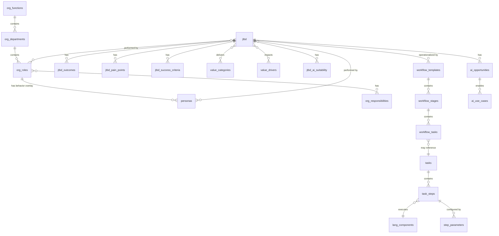

# Gold-Standard Final Gaps & Remediation Plan

**Last Updated**: 2025-11-21  
**Status**: Planning  
**Related Files**: All schema normalization files  
**Golden Rules**: Zero JSONB for queryable data, no arrays except simple lists, complete normalization

---

## Executive Summary

Based on comprehensive review, the system is **~95% complete** with world-class org structure, roles, personas, JTBDs, and workflow normalization. The remaining 5% involves:

1. **Unifying dual table concepts** (jtbd vs jtbd_core, multiple persona-jtbd mappings)
2. **Completing array→table migrations** (finishing what was started)
3. **Consolidating workflow systems** (3 systems → 1 canonical)
4. **Final JSONB cleanup** (runtime vs ontology separation)
5. **Documentation & validation** (ERDs, examples, verification)

---

## Part 1: Critical Structural Unification

### Issue 1.1: Dual JTBD Master Tables (`jtbd` vs `jtbd_core`)

**Current State:**
- `jtbd` (241 rows) - fully normalized, all child tables reference this
- `jtbd_core` (unknown rows) - has `job_statement`, `when_situation`, `tags ARRAY`
- `persona_jtbd` references `jtbd_core.id`
- All other mappings reference `jtbd.id`

**Target State:**
- Single canonical `jtbd` table
- `persona_jtbd` references `jtbd.id`
- Optional: `jtbd_core` becomes a view or library table

**Migration Strategy:**

**Option A: Merge jtbd_core into jtbd**
```sql
-- 1. Add missing columns to jtbd
ALTER TABLE jtbd 
  ADD COLUMN IF NOT EXISTS job_statement TEXT,
  ADD COLUMN IF NOT EXISTS when_situation TEXT;

-- 2. Migrate data from jtbd_core to jtbd (match on code or name)
UPDATE jtbd j
SET 
  job_statement = jc.job_statement,
  when_situation = jc.when_situation
FROM jtbd_core jc
WHERE j.code = jc.code OR j.name = jc.name;

-- 3. Create ID mapping table for persona_jtbd migration
CREATE TABLE jtbd_core_to_jtbd_mapping AS
SELECT jc.id as jtbd_core_id, j.id as jtbd_id
FROM jtbd_core jc
JOIN jtbd j ON (j.code = jc.code OR j.name = jc.name);

-- 4. Update persona_jtbd to reference jtbd
ALTER TABLE persona_jtbd DROP CONSTRAINT IF EXISTS persona_jtbd_jtbd_id_fkey;
UPDATE persona_jtbd pj
SET jtbd_id = m.jtbd_id
FROM jtbd_core_to_jtbd_mapping m
WHERE pj.jtbd_id = m.jtbd_core_id;
ALTER TABLE persona_jtbd 
  ADD CONSTRAINT persona_jtbd_jtbd_id_fkey 
  FOREIGN KEY (jtbd_id) REFERENCES jtbd(id);

-- 5. Migrate tags array from jtbd_core
INSERT INTO jtbd_tags (jtbd_id, tag, tenant_id)
SELECT m.jtbd_id, unnest(jc.tags), jc.tenant_id
FROM jtbd_core jc
JOIN jtbd_core_to_jtbd_mapping m ON jc.id = m.jtbd_core_id
WHERE jc.tags IS NOT NULL AND array_length(jc.tags, 1) > 0
ON CONFLICT DO NOTHING;

-- 6. Rename jtbd_core to jtbd_core_deprecated
ALTER TABLE jtbd_core RENAME TO jtbd_core_deprecated;
COMMENT ON TABLE jtbd_core_deprecated IS 'DEPRECATED: Merged into jtbd table. Will be removed in v2.0';
```

**Option B: Make jtbd_core a library, jtbd as tenant instances**
- Keep `jtbd_core` as universal job catalog
- `jtbd` becomes tenant-specific instantiations with `jtbd_core_id FK`
- All mappings go through `jtbd`, but jobs are defined in `jtbd_core`

**Recommendation:** **Option A** - simpler, cleaner, aligns with current usage patterns.

---

### Issue 1.2: Dual Persona↔JTBD Mapping (`jtbd_personas` vs `persona_jtbd`)

**Current State:**
- `jtbd_personas` (0 rows): `jtbd_id → personas.id` referencing `jtbd`
- `persona_jtbd` (?? rows): `persona_id → jtbd_id` referencing `jtbd_core`
- Two tables doing the same job with different FK targets

**Target State:**
- Single canonical junction table
- References unified `jtbd` table

**Migration Strategy:**

**Option A: Consolidate into persona_jtbd**
```sql
-- After Issue 1.1 is resolved and persona_jtbd references jtbd:
-- 1. Migrate any data from jtbd_personas into persona_jtbd
INSERT INTO persona_jtbd (
  persona_id, jtbd_id, relevance_score, importance, 
  frequency, context, tenant_id, created_at
)
SELECT 
  jp.persona_id, jp.jtbd_id, jp.relevance_score, 
  jp.importance, jp.frequency, jp.context, 
  jp.tenant_id, jp.created_at
FROM jtbd_personas jp
WHERE NOT EXISTS (
  SELECT 1 FROM persona_jtbd pj 
  WHERE pj.persona_id = jp.persona_id 
    AND pj.jtbd_id = jp.jtbd_id
)
ON CONFLICT (persona_id, jtbd_id) DO NOTHING;

-- 2. Drop jtbd_personas
DROP TABLE jtbd_personas CASCADE;

-- 3. Create view for backward compatibility if needed
CREATE OR REPLACE VIEW jtbd_personas AS
SELECT 
  id, jtbd_id, persona_id, relevance_score, 
  importance, frequency, context, tenant_id, 
  created_at, updated_at
FROM persona_jtbd;
```

**Recommendation:** **Option A** - `persona_jtbd` is more intuitive naming (persona owns the relationship).

---

### Issue 1.3: Capabilities Denormalization

**Current State:**
- `capabilities` has direct columns: `function_id`, `function_name`, `department_id`, `department_name`, `role_id`, `role_name`
- Already have `capability_jtbd_mapping` junction table

**Target State:**
- Junction tables for all relationships
- Names as cached/computed fields only

**Migration Strategy:**
```sql
-- 1. Create capability_functions junction
CREATE TABLE IF NOT EXISTS capability_functions (
  id UUID PRIMARY KEY DEFAULT gen_random_uuid(),
  capability_id UUID NOT NULL REFERENCES capabilities(id) ON DELETE CASCADE,
  function_id UUID NOT NULL REFERENCES org_functions(id) ON DELETE CASCADE,
  function_name TEXT, -- cached
  relevance_score NUMERIC(3,2),
  is_primary BOOLEAN DEFAULT false,
  created_at TIMESTAMPTZ DEFAULT NOW(),
  UNIQUE(capability_id, function_id)
);

-- 2. Create capability_departments junction
CREATE TABLE IF NOT EXISTS capability_departments (
  id UUID PRIMARY KEY DEFAULT gen_random_uuid(),
  capability_id UUID NOT NULL REFERENCES capabilities(id) ON DELETE CASCADE,
  department_id UUID NOT NULL REFERENCES org_departments(id) ON DELETE CASCADE,
  department_name TEXT, -- cached
  relevance_score NUMERIC(3,2),
  is_primary BOOLEAN DEFAULT false,
  created_at TIMESTAMPTZ DEFAULT NOW(),
  UNIQUE(capability_id, department_id)
);

-- 3. Create capability_roles junction
CREATE TABLE IF NOT EXISTS capability_roles (
  id UUID PRIMARY KEY DEFAULT gen_random_uuid(),
  capability_id UUID NOT NULL REFERENCES capabilities(id) ON DELETE CASCADE,
  role_id UUID NOT NULL REFERENCES org_roles(id) ON DELETE CASCADE,
  role_name TEXT, -- cached
  proficiency_required TEXT, -- basic/intermediate/advanced/expert
  is_core_capability BOOLEAN DEFAULT false,
  created_at TIMESTAMPTZ DEFAULT NOW(),
  UNIQUE(capability_id, role_id)
);

-- 4. Migrate data from capabilities direct columns
INSERT INTO capability_functions (capability_id, function_id, function_name, is_primary)
SELECT id, function_id, function_name, true
FROM capabilities
WHERE function_id IS NOT NULL
ON CONFLICT DO NOTHING;

INSERT INTO capability_departments (capability_id, department_id, department_name, is_primary)
SELECT id, department_id, department_name, true
FROM capabilities
WHERE department_id IS NOT NULL
ON CONFLICT DO NOTHING;

INSERT INTO capability_roles (capability_id, role_id, role_name, is_core_capability)
SELECT id, role_id, role_name, true
FROM capabilities
WHERE role_id IS NOT NULL
ON CONFLICT DO NOTHING;

-- 5. Create name sync triggers (same pattern as jtbd_roles)
-- [Trigger functions omitted for brevity - follow jtbd_roles pattern]

-- 6. Add columns as deprecated markers
COMMENT ON COLUMN capabilities.function_id IS 'DEPRECATED: Use capability_functions junction table';
COMMENT ON COLUMN capabilities.role_id IS 'DEPRECATED: Use capability_roles junction table';
```

---

## Part 2: Complete Array→Table Migrations

### Issue 2.1: org_roles.product_lifecycle_stages ARRAY

**Current State:**
- `org_roles.product_lifecycle_stages ARRAY` (legacy)
- `role_product_lifecycle_stages` junction table (normalized)

**Migration:**
```sql
-- 1. Backfill missing data from array to junction table
INSERT INTO role_product_lifecycle_stages (role_id, lifecycle_stage)
SELECT r.id, unnest(r.product_lifecycle_stages)
FROM org_roles r
WHERE r.product_lifecycle_stages IS NOT NULL 
  AND array_length(r.product_lifecycle_stages, 1) > 0
  AND NOT EXISTS (
    SELECT 1 FROM role_product_lifecycle_stages rpls
    WHERE rpls.role_id = r.id
  )
ON CONFLICT DO NOTHING;

-- 2. Drop array column
ALTER TABLE org_roles DROP COLUMN IF EXISTS product_lifecycle_stages CASCADE;
```

### Issue 2.2: personas multi-valued fields

**Current State:**
- `personas.key_responsibilities ARRAY` (have `persona_responsibilities`)
- `personas.preferred_tools ARRAY` (have `persona_tools`)
- `personas.tags ARRAY` (have `persona_tags`)
- `personas.allowed_tenants ARRAY` (have `persona_tenants`)
- `personas.gen_ai_barriers ARRAY` (have `persona_gen_ai_barriers`)
- `personas.gen_ai_enablers ARRAY` (have `persona_gen_ai_enablers`)
- `personas.metadata JSONB` (various child tables exist)

**Migration:**
```sql
DO $$
BEGIN
  -- Migrate key_responsibilities array
  IF EXISTS (SELECT 1 FROM information_schema.columns 
             WHERE table_name='personas' AND column_name='key_responsibilities') THEN
    INSERT INTO persona_responsibilities (persona_id, responsibility, tenant_id)
    SELECT id, unnest(key_responsibilities), tenant_id
    FROM personas
    WHERE key_responsibilities IS NOT NULL 
      AND array_length(key_responsibilities, 1) > 0
    ON CONFLICT DO NOTHING;
    
    ALTER TABLE personas DROP COLUMN key_responsibilities CASCADE;
  END IF;
  
  -- Migrate preferred_tools array
  IF EXISTS (SELECT 1 FROM information_schema.columns 
             WHERE table_name='personas' AND column_name='preferred_tools') THEN
    INSERT INTO persona_tools (persona_id, tool_name, tenant_id)
    SELECT id, unnest(preferred_tools), tenant_id
    FROM personas
    WHERE preferred_tools IS NOT NULL 
      AND array_length(preferred_tools, 1) > 0
    ON CONFLICT DO NOTHING;
    
    ALTER TABLE personas DROP COLUMN preferred_tools CASCADE;
  END IF;
  
  -- Migrate tags array
  IF EXISTS (SELECT 1 FROM information_schema.columns 
             WHERE table_name='personas' AND column_name='tags') THEN
    INSERT INTO persona_tags (persona_id, tag, tenant_id)
    SELECT id, unnest(tags), tenant_id
    FROM personas
    WHERE tags IS NOT NULL 
      AND array_length(tags, 1) > 0
    ON CONFLICT DO NOTHING;
    
    ALTER TABLE personas DROP COLUMN tags CASCADE;
  END IF;
  
  -- Migrate allowed_tenants array
  IF EXISTS (SELECT 1 FROM information_schema.columns 
             WHERE table_name='personas' AND column_name='allowed_tenants') THEN
    INSERT INTO persona_tenants (persona_id, tenant_id)
    SELECT id, unnest(allowed_tenants)
    FROM personas
    WHERE allowed_tenants IS NOT NULL 
      AND array_length(allowed_tenants, 1) > 0
    ON CONFLICT DO NOTHING;
    
    ALTER TABLE personas DROP COLUMN allowed_tenants CASCADE;
  END IF;
  
  -- Migrate gen_ai_barriers array
  IF EXISTS (SELECT 1 FROM information_schema.columns 
             WHERE table_name='personas' AND column_name='gen_ai_barriers') THEN
    INSERT INTO persona_gen_ai_barriers (persona_id, barrier, tenant_id)
    SELECT id, unnest(gen_ai_barriers), tenant_id
    FROM personas
    WHERE gen_ai_barriers IS NOT NULL 
      AND array_length(gen_ai_barriers, 1) > 0
    ON CONFLICT DO NOTHING;
    
    ALTER TABLE personas DROP COLUMN gen_ai_barriers CASCADE;
  END IF;
  
  -- Migrate gen_ai_enablers array
  IF EXISTS (SELECT 1 FROM information_schema.columns 
             WHERE table_name='personas' AND column_name='gen_ai_enablers') THEN
    INSERT INTO persona_gen_ai_enablers (persona_id, enabler, tenant_id)
    SELECT id, unnest(gen_ai_enablers), tenant_id
    FROM personas
    WHERE gen_ai_enablers IS NOT NULL 
      AND array_length(gen_ai_enablers, 1) > 0
    ON CONFLICT DO NOTHING;
    
    ALTER TABLE personas DROP COLUMN gen_ai_enablers CASCADE;
  END IF;
  
  -- Drop metadata JSONB (already have rich normalized tables)
  IF EXISTS (SELECT 1 FROM information_schema.columns 
             WHERE table_name='personas' AND column_name='metadata') THEN
    ALTER TABLE personas DROP COLUMN metadata CASCADE;
  END IF;
END $$;
```

### Issue 2.3: JTBD competitive alternatives arrays

**Current State:**
- `jtbd_competitive_alternatives` has `strengths ARRAY`, `weaknesses ARRAY`
- Already have `alternative_strengths` and `alternative_weaknesses` tables

**Migration:**
```sql
-- 1. Migrate strengths array
INSERT INTO alternative_strengths (alternative_id, strength, tenant_id)
SELECT id, unnest(strengths), tenant_id
FROM jtbd_competitive_alternatives
WHERE strengths IS NOT NULL 
  AND array_length(strengths, 1) > 0
ON CONFLICT DO NOTHING;

-- 2. Migrate weaknesses array
INSERT INTO alternative_weaknesses (alternative_id, weakness, tenant_id)
SELECT id, unnest(weaknesses), tenant_id
FROM jtbd_competitive_alternatives
WHERE weaknesses IS NOT NULL 
  AND array_length(weaknesses, 1) > 0
ON CONFLICT DO NOTHING;

-- 3. Drop array columns
ALTER TABLE jtbd_competitive_alternatives 
  DROP COLUMN IF EXISTS strengths CASCADE,
  DROP COLUMN IF EXISTS weaknesses CASCADE;
```

### Issue 2.4: JTBD workflow arrays

**Current State:**
- `jtbd_workflow_stages`: `key_activities ARRAY`, `pain_points ARRAY`
- `jtbd_workflow_activities`: `required_skills ARRAY`, `required_tools ARRAY`, `required_data ARRAY`
- Already have normalized: `jtbd_stage_key_activities`, `jtbd_stage_pain_points`, `jtbd_activity_tools`, etc.

**Strategy:**
- These tables will be deprecated in favor of `workflow_templates` (see Part 3)
- Mark as legacy but don't spend effort migrating arrays since entire model is being replaced

```sql
-- Mark legacy tables
COMMENT ON TABLE jtbd_workflow_stages IS 'LEGACY: Use workflow_templates instead. Scheduled for deprecation.';
COMMENT ON TABLE jtbd_workflow_activities IS 'LEGACY: Use workflow_templates → workflow_stages → workflow_tasks instead.';
```

---

## Part 3: Workflow System Consolidation

### Current State: Three Workflow Systems

1. **Template Model** (NEW, TARGET) ✅
   - `workflow_templates` (with work_mode, binding_type)
   - `workflow_stages`
   - `workflow_tasks`
   - `workflow_task_*` normalized children
   - `tasks` (with work_mode)
   - `task_steps` (with component_id)
   - `step_parameters`
   - `lang_components`

2. **JTBD-specific Model** (LEGACY)
   - `jtbd_workflow_stages` (9 rows)
   - `jtbd_workflow_activities` (6 rows)
   - Array-based, JTBD-only

3. **UI/Graph Model** (RUNTIME/VISUAL)
   - `workflows` (JSONB heavy)
   - `workflow_steps`
   - `workflow_step_definitions`
   - `workflow_step_connections`
   - Plus execution tables: `workflow_executions`, `workflow_execution_steps`, `workflow_logs`

### Target Architecture

**Canonical Execution Layer:**
```
workflow_templates (work_mode, binding_type)
  ↓
workflow_stages
  ↓
workflow_tasks (task_type, depends_on_task_id)
  ↓ (optionally references)
tasks (generic reusable tasks with work_mode)
  ↓
task_steps (component_id → lang_components)
  ↓
step_parameters (name/value/type bindings)
```

**UI/Visual Layer** (references execution layer):
```
workflows (UI metadata, references workflow_templates.id)
workflow_step_definitions (UI node, references task_steps.id or lang_components.id)
workflow_step_connections (UI edges)
```

**Runtime Layer** (captures execution state):
```
workflow_executions (references workflow_templates.id)
workflow_execution_steps (references task_steps.id)
workflow_logs (JSONB acceptable for logs/errors)
```

### Migration Plan

**Phase 3.1: Migrate JTBD Workflows into workflow_templates**

```sql
-- For each jtbd_workflow_stages row:
-- 1. Create workflow_template if JTBD doesn't have one
INSERT INTO workflow_templates (
  jtbd_id, code, name, workflow_type, work_mode, 
  binding_type, status, created_at
)
SELECT 
  jws.jtbd_id,
  j.code || '_workflow',
  j.name || ' - Workflow',
  'standard',
  CASE 
    WHEN j.frequency IN ('daily','weekly','monthly') THEN 'routine'
    WHEN j.frequency = 'adhoc' THEN 'adhoc'
    ELSE 'project'
  END,
  'standalone',
  'draft',
  NOW()
FROM jtbd_workflow_stages jws
JOIN jtbd j ON jws.jtbd_id = j.id
WHERE NOT EXISTS (
  SELECT 1 FROM workflow_templates wt 
  WHERE wt.jtbd_id = jws.jtbd_id
)
GROUP BY jws.jtbd_id, j.code, j.name, j.frequency
ON CONFLICT DO NOTHING;

-- 2. Create workflow_stages from jtbd_workflow_stages
INSERT INTO workflow_stages (
  template_id, stage_number, stage_name, stage_description,
  is_mandatory, created_at
)
SELECT 
  wt.id,
  jws.stage_number,
  jws.stage_name,
  jws.stage_description,
  true,
  NOW()
FROM jtbd_workflow_stages jws
JOIN workflow_templates wt ON jws.jtbd_id = wt.jtbd_id
ON CONFLICT DO NOTHING;

-- 3. Create workflow_tasks from jtbd_workflow_activities
INSERT INTO workflow_tasks (
  stage_id, task_number, task_name, task_description, 
  task_type, estimated_duration_minutes, created_at
)
SELECT 
  ws.id,
  jwa.sequence_order,
  jwa.activity_name,
  jwa.activity_description,
  jwa.activity_type,
  EXTRACT(EPOCH FROM jwa.typical_duration)/60,
  NOW()
FROM jtbd_workflow_activities jwa
JOIN jtbd_workflow_stages jws ON jwa.stage_id = jws.id
JOIN workflow_templates wt ON jws.jtbd_id = wt.jtbd_id
JOIN workflow_stages ws ON ws.template_id = wt.id 
  AND ws.stage_number = jws.stage_number
ON CONFLICT DO NOTHING;

-- 4. Migrate normalized child data (skills, tools, data requirements)
-- [Similar pattern for workflow_task_skills, workflow_task_tools, etc.]
```

**Phase 3.2: Refactor UI/Graph Model to Reference Execution Layer**

```sql
-- 1. Add FK to workflow_templates
ALTER TABLE workflows 
  ADD COLUMN IF NOT EXISTS template_id UUID REFERENCES workflow_templates(id);

-- 2. Add FK to task_steps and lang_components
ALTER TABLE workflow_step_definitions
  ADD COLUMN IF NOT EXISTS task_step_id UUID REFERENCES task_steps(id),
  ADD COLUMN IF NOT EXISTS component_id UUID REFERENCES lang_components(id);

-- 3. Migrate configuration from JSONB to references
-- This is a complex data migration requiring case-by-case analysis
-- Recommendation: Do this incrementally as you build new workflows

-- 4. Mark JSONB columns as deprecated
COMMENT ON COLUMN workflows.configuration IS 'DEPRECATED: Migrate to workflow_templates fields';
COMMENT ON COLUMN workflow_step_definitions.config IS 'DEPRECATED: Use task_step_id or component_id + step_parameters';
```

**Phase 3.3: Backfill work_mode Data**

```sql
-- Classify existing workflows based on usage patterns
UPDATE workflow_templates SET work_mode = 'routine'
WHERE code ILIKE '%daily%' OR code ILIKE '%weekly%' OR code ILIKE '%monthly%'
   OR binding_type = 'process';

UPDATE workflow_templates SET work_mode = 'project'
WHERE binding_type = 'project' OR code ILIKE '%project%';

UPDATE workflow_templates SET work_mode = 'adhoc'
WHERE work_mode IS NULL;

-- Classify tasks
UPDATE tasks SET work_mode = 'routine', typical_frequency = 'daily'
WHERE name ILIKE '%review%' OR name ILIKE '%monitor%' OR name ILIKE '%update%';

UPDATE tasks SET work_mode = 'project'
WHERE name ILIKE '%analyze%' OR name ILIKE '%design%' OR name ILIKE '%implement%';

UPDATE tasks SET work_mode = 'both'
WHERE work_mode IS NULL;

-- Classify processes
UPDATE processes SET work_mode = 'routine';

-- Classify projects
UPDATE projects SET work_mode = 'project';
```

---

## Part 4: Final JSONB Cleanup Strategy

### Philosophy: Ontology vs Runtime Separation

**Zero JSONB for Ontology/Queryable Data** ✅
- org_functions, org_departments, org_roles: **Clean**
- personas: Arrays being removed (Part 2)
- jtbd: **Clean**
- workflow_templates, workflow_stages, workflow_tasks: **Clean**
- tasks, task_steps, step_parameters: **Clean**

**JSONB Acceptable for:**
1. **Developer Tooling** (code generation schemas)
   - `lang_components.input_schema`, `output_schema`, `config_schema`
   - These define Python interfaces, not business data
   
2. **Runtime/Logs** (ephemeral execution state)
   - `workflow_executions.input_data`, `output_data`
   - `workflow_execution_steps.input_data`, `output_data`, `error_details`
   - `workflow_logs.log_data`
   - These are execution artifacts, not canonical data

3. **UI Metadata** (visual layout, not business logic)
   - `workflows.definition` (graph layout JSON for visual editor)
   - Can be acceptable if it's purely presentational

### Optional: Normalize lang_components Schemas

If you want **absolute zero JSONB**, create:

```sql
CREATE TABLE lang_component_input_fields (
  id UUID PRIMARY KEY DEFAULT gen_random_uuid(),
  component_id UUID NOT NULL REFERENCES lang_components(id) ON DELETE CASCADE,
  field_name TEXT NOT NULL,
  field_type TEXT NOT NULL, -- string/number/boolean/object/array
  is_required BOOLEAN DEFAULT true,
  default_value TEXT,
  description TEXT,
  validation_rule TEXT,
  created_at TIMESTAMPTZ DEFAULT NOW(),
  UNIQUE(component_id, field_name)
);

CREATE TABLE lang_component_output_fields (
  id UUID PRIMARY KEY DEFAULT gen_random_uuid(),
  component_id UUID NOT NULL REFERENCES lang_components(id) ON DELETE CASCADE,
  field_name TEXT NOT NULL,
  field_type TEXT NOT NULL,
  description TEXT,
  created_at TIMESTAMPTZ DEFAULT NOW(),
  UNIQUE(component_id, field_name)
);

-- Migrate from JSONB
-- [Complex JSONB→row migration omitted]

-- Drop JSONB
ALTER TABLE lang_components 
  DROP COLUMN input_schema,
  DROP COLUMN output_schema,
  DROP COLUMN config_schema;
```

**Recommendation:** Keep JSONB in `lang_components` for developer ergonomics unless you have a strong requirement for it.

---

## Part 5: Documentation & Validation

### Deliverable 5.1: Unified ERD (Mermaid)

Create `.vital-docs/vital-expert-docs/11-data-schema/FINAL_UNIFIED_ERD.md`:



### Deliverable 5.2: LangGraph Builder Example

Create `.vital-docs/vital-expert-docs/11-data-schema/workflows/LANGGRAPH_BUILDER_EXAMPLE.md`:

```python
from langgraph.graph import StateGraph, END
from typing import TypedDict
import importlib

class WorkflowBuilder:
    """Build executable LangGraph from workflow_templates schema"""
    
    def __init__(self, supabase_client):
        self.db = supabase_client
    
    def build_graph(self, template_id: str) -> StateGraph:
        # 1. Load template
        template = self.db.table('workflow_templates').select('*').eq('id', template_id).single()
        
        # 2. Load stages and tasks
        stages = self.db.table('workflow_stages')\
            .select('*, workflow_tasks(*)')\
            .eq('template_id', template_id)\
            .order('stage_number').execute()
        
        # 3. Build graph
        graph = StateGraph(WorkflowState)
        
        for stage in stages:
            for task in stage['workflow_tasks']:
                # Load task steps
                steps = self.db.table('task_steps')\
                    .select('*, lang_components(*), step_parameters(*)')\
                    .eq('task_id', task['task_id'] or task['id'])\
                    .order('sequence_order').execute()
                
                # Build node from steps
                node_fn = self._build_node_from_steps(steps)
                graph.add_node(task['task_name'], node_fn)
        
        # 4. Add edges from dependencies
        # [Edge logic based on depends_on_task_id]
        
        return graph.compile()
    
    def _build_node_from_steps(self, steps):
        """Convert task_steps + lang_components into executable function"""
        def node_function(state: WorkflowState):
            for step in steps:
                # Load component
                component = step['lang_components']
                module = importlib.import_module(component['python_module'])
                callable_fn = getattr(module, component['callable_name'])
                
                # Build parameters from step_parameters
                params = {p['parameter_name']: self._resolve_param(p, state) 
                         for p in step['step_parameters']}
                
                # Execute
                result = callable_fn(**params)
                
                # Store in state
                state[step['step_type']] = result
            
            return state
        
        return node_function
```

### Deliverable 5.3: Complete Verification Suite

Create `.vital-docs/vital-expert-docs/11-data-schema/07-utilities/verification/final_gold_standard_verification.sql`:

```sql
-- ==========================================
-- GOLD STANDARD VERIFICATION
-- ==========================================

-- 1. Zero JSONB in Ontology Tables
SELECT 
  table_name,
  column_name,
  data_type
FROM information_schema.columns
WHERE table_schema = 'public'
  AND table_name IN (
    'jtbd', 'org_roles', 'org_functions', 'org_departments',
    'personas', 'workflow_templates', 'workflow_stages', 
    'workflow_tasks', 'tasks', 'task_steps'
  )
  AND data_type = 'jsonb';
-- Expected: 0 rows

-- 2. Zero Arrays (except simple tags/enums)
SELECT 
  table_name,
  column_name,
  udt_name
FROM information_schema.columns
WHERE table_schema = 'public'
  AND table_name IN (
    'jtbd', 'org_roles', 'personas', 
    'workflow_templates', 'tasks'
  )
  AND data_type = 'ARRAY';
-- Expected: 0 rows or only simple enum arrays

-- 3. All Junction Tables Have ID + NAME Pattern
SELECT 
  'jtbd_roles' as table_name,
  COUNT(*) as total,
  COUNT(role_name) as with_name,
  COUNT(*) - COUNT(role_name) as missing_name
FROM jtbd_roles
UNION ALL
SELECT 'jtbd_functions', COUNT(*), COUNT(function_name), COUNT(*) - COUNT(function_name)
FROM jtbd_functions
UNION ALL
SELECT 'jtbd_departments', COUNT(*), COUNT(department_name), COUNT(*) - COUNT(department_name)
FROM jtbd_departments;
-- Expected: missing_name = 0 for all

-- 4. Workflow System Consolidation
SELECT 
  'workflow_templates' as source,
  COUNT(*) as count,
  COUNT(DISTINCT work_mode) as work_modes,
  COUNT(DISTINCT jtbd_id) as linked_jtbds
FROM workflow_templates
UNION ALL
SELECT 
  'jtbd_workflow_stages (legacy)',
  COUNT(*),
  0,
  COUNT(DISTINCT jtbd_id)
FROM jtbd_workflow_stages;

-- 5. Persona-JTBD Unified Mapping
SELECT 
  COUNT(*) as persona_jtbd_mappings,
  COUNT(DISTINCT persona_id) as personas_with_jtbds,
  COUNT(DISTINCT jtbd_id) as jtbds_with_personas
FROM persona_jtbd;

-- 6. Lang Components Registered
SELECT 
  component_type,
  COUNT(*) as count,
  COUNT(DISTINCT python_module) as modules
FROM lang_components
GROUP BY component_type;
```

---

## Implementation Phases

### Phase 1: Critical Unification (Week 1)
- **Priority: CRITICAL**
- Merge `jtbd_core` into `jtbd`
- Consolidate `jtbd_personas` and `persona_jtbd`
- Verify all mappings work

### Phase 2: Array Cleanup (Week 1-2)
- **Priority: HIGH**
- Complete all array→table migrations in Part 2
- Drop deprecated array columns
- Verify data integrity

### Phase 3: Workflow Consolidation (Week 2-3)
- **Priority: HIGH**
- Migrate JTBD workflows to `workflow_templates`
- Mark legacy tables as deprecated
- Backfill `work_mode` data
- Refactor UI layer to reference execution layer

### Phase 4: Capability Normalization (Week 3)
- **Priority: MEDIUM**
- Create capability junction tables
- Migrate data
- Update queries

### Phase 5: Final JSONB Decision (Week 3-4)
- **Priority: LOW**
- Decide on `lang_components` JSONB normalization
- Optionally normalize if required
- Document ontology vs runtime boundaries

### Phase 6: Documentation & Validation (Week 4)
- **Priority: HIGH**
- Create unified ERD
- Write LangGraph builder example
- Run complete verification suite
- Update all READMEs

---

## Success Criteria

✅ **Single canonical table for:**
- JTBDs (`jtbd` only)
- Persona-JTBD mappings (`persona_jtbd` only)
- Workflows (`workflow_templates` only for execution)

✅ **Zero arrays in:**
- `org_roles`
- `personas`
- `jtbd`
- `workflow_templates`
- `tasks`

✅ **All junction tables follow "ID + NAME" pattern**

✅ **Three workflow layers clearly separated:**
- Execution: `workflow_templates` → `workflow_tasks` → `task_steps` → `lang_components`
- Visual: `workflows` → `workflow_step_definitions` (references execution)
- Runtime: `workflow_executions` → `workflow_execution_steps` (logs)

✅ **JSONB only in:**
- `lang_components` (developer tooling - acceptable)
- `workflow_executions` (runtime logs - acceptable)
- `workflow_logs` (logs - acceptable)

✅ **work_mode present and backfilled in:**
- `workflow_templates`
- `tasks`
- `processes`
- `projects`

✅ **Documentation complete:**
- Unified ERD created
- LangGraph builder example working
- All verification queries passing

---

## Files to Create/Update

**New Files:**
1. `.vital-docs/vital-expert-docs/11-data-schema/06-migrations/phase5_unify_jtbd_tables.sql`
2. `.vital-docs/vital-expert-docs/11-data-schema/06-migrations/phase6_complete_array_cleanup.sql`
3. `.vital-docs/vital-expert-docs/11-data-schema/06-migrations/phase7_workflow_consolidation.sql`
4. `.vital-docs/vital-expert-docs/11-data-schema/06-migrations/phase8_capability_normalization.sql`
5. `.vital-docs/vital-expert-docs/11-data-schema/FINAL_UNIFIED_ERD.md`
6. `.vital-docs/vital-expert-docs/11-data-schema/workflows/LANGGRAPH_BUILDER_EXAMPLE.md`
7. `.vital-docs/vital-expert-docs/11-data-schema/workflows/WORKFLOW_CONSOLIDATION_GUIDE.md`
8. `.vital-docs/vital-expert-docs/11-data-schema/07-utilities/verification/final_gold_standard_verification.sql`

**Updated Files:**
1. `.vital-docs/vital-expert-docs/11-data-schema/README.md` - Add Phase 5-8
2. `.vital-docs/vital-expert-docs/11-data-schema/06-migrations/README.md` - Document new phases
3. `.vital-docs/vital-expert-docs/11-data-schema/jtbds/COMPLETE_JTBD_ARCHITECTURE.md` - Update for unified table
4. `.vital-docs/vital-expert-docs/11-data-schema/jtbds/DATA_OWNERSHIP_GUIDE.md` - Clarify final boundaries

---

## Next Steps

1. **Review & Approve Plan** - Confirm priorities and approach
2. **Execute Phase 1** - Critical unification (jtbd tables, persona mappings)
3. **Test & Verify** - Run verification queries after each phase
4. **Build LangGraph Example** - Prove the ontology is executable
5. **Final Documentation** - Create ERD and complete guides

