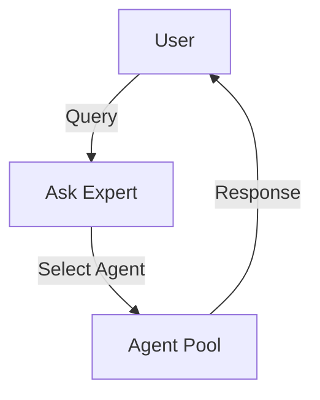

# VITAL Platform - Documentation Style Guide

**Version**: 1.0.0
**Last Updated**: November 23, 2025
**Status**: Active
**Purpose**: Comprehensive writing, terminology, and formatting standards for all VITAL Platform documentation

---

## 📋 Table of Contents

1. [Writing Standards](#writing-standards)
2. [Terminology Standards](#terminology-standards)
3. [Document Structure Standards](#document-structure-standards)
4. [Visual Standards](#visual-standards)
5. [Citation Standards](#citation-standards)
6. [Special Considerations](#special-considerations)
7. [Examples](#examples)

---

## ✍️ Writing Standards

### Tone and Voice

**Tone**: Professional, authoritative, yet collaborative
- Strike a balance between technical precision and accessibility
- Be confident without being arrogant
- Be helpful without being condescending

**Voice**: Active voice preferred
```markdown
✅ Good: "We will build a multi-tenant architecture"
❌ Bad: "A multi-tenant architecture will be built"

✅ Good: "The system validates user input"
❌ Bad: "User input is validated by the system"
```

**Person**: First person plural for VITAL team perspective
```markdown
✅ Good: "We designed the system to..."
✅ Good: "Our platform provides..."
❌ Bad: "The system was designed..."
❌ Bad: "It provides..."
```

**Tense**:
- **Present tense** for current state: "The platform supports multi-tenancy"
- **Future tense** for roadmap: "We will implement Phase 3 in Q2 2026"
- **Past tense** for completed work: "We migrated all documentation in November 2025"

---

### Grammar and Punctuation

#### Headings
- **Title Case** for main headings: `# Product Requirements Document`
- **Sentence case** for subheadings: `## How the system works`
- **No period** at end of headings
- **Parallel structure** in lists of headings

#### Lists
**Parallel Structure Required**:
```markdown
✅ Good:
- Create new documentation
- Review existing content
- Update version headers

❌ Bad:
- Create new documentation
- Reviewing existing content
- Version headers should be updated
```

**Bullet Points**:
- Use `-` for unordered lists (not `*` or `+`)
- Use `1.` for ordered lists
- Capitalize first word
- End with period if complete sentence
- No period if fragment

**Examples**:
```markdown
Complete sentences:
- The system validates all inputs before processing.
- Users can select from 136+ expert agents.

Fragments:
- Multi-tenant architecture
- Row-level security (RLS)
- HIPAA-aware design
```

#### Punctuation
- **Oxford comma**: Use it
  - ✅ "agents, personas, and JTBDs"
  - ❌ "agents, personas and JTBDs"
- **Em dashes**: Use `—` (not `--` or `-`)
  - "The platform — built on LangGraph — supports complex workflows"
- **Quotation marks**: Use for UI elements, not emphasis
  - ✅ Click the "Submit" button
  - ❌ The system is "fast"

---

### Formatting Conventions

#### Code
**Inline code**: Use backticks for:
- File names: \`README.md\`
- Commands: \`npm install\`
- Variables: \`tenant_id\`
- Function names: \`createAgent()\`
- SQL keywords: \`SELECT\`, \`WHERE\`

**Code blocks**: Use fenced code blocks with language identifier
````markdown
```typescript
// TypeScript code example
interface Agent {
  id: string;
  name: string;
  tier: 1 | 2 | 3;
}
```

```sql
-- SQL code example
SELECT * FROM agents
WHERE tenant_id = 'uuid'
  AND status = 'active';
```
````

**File paths**: Use full paths in code blocks, relative in text
```markdown
In text: See `docs/INDEX.md` for navigation
In code: `/Users/.../VITAL path/.claude/docs/INDEX.md`
```

#### Emphasis
**Bold**: For emphasis and first usage of key terms
```markdown
The **Ask Expert** service enables 1-on-1 AI consultation.
VITAL uses **row-level security (RLS)** for multi-tenancy.
```

**Italics**: For de-emphasis, foreign terms, or definitions
```markdown
The system uses a _tenant-aware_ architecture.
Personas are defined using the _outcome-driven innovation_ framework.
```

**DO NOT**: Use bold or italics for:
- Entire paragraphs
- Headers (already emphasized)
- Code (use backticks)

#### Links
**Descriptive text**, not "click here"
```markdown
✅ Good: See [naming conventions](NAMING_CONVENTION.md)
✅ Good: Read the [governance plan](DOCUMENTATION_GOVERNANCE_PLAN.md)
❌ Bad: Click [here](NAMING_CONVENTION.md) for naming conventions
❌ Bad: For more info [click here](DOCUMENTATION_GOVERNANCE_PLAN.md)
```

**Relative paths** for internal links:
```markdown
✅ Good: [Agent Coordination](coordination/AGENT_COORDINATION_GUIDE.md)
❌ Bad: [Agent Coordination](/Users/.../AGENT_COORDINATION_GUIDE.md)
```

---

## 📖 Terminology Standards

### Approved Terms

**Use These Terms Consistently**:

| Term | Usage | Notes |
|------|-------|-------|
| **VITAL Platform** | Always capitalize, always include "Platform" | ❌ Not: "VITAL", "Vital", "vital platform" |
| **Medical Affairs** | Always capitalize | Specific business function |
| **Ask Expert** | Capitalize both words | Our feature name |
| **Ask Panel** | Capitalize both words | Our feature name |
| **Ask Committee** | Capitalize both words | Our feature name (future) |
| **BYOAI** | All caps acronym | Bring Your Own AI |
| **Elastic Organization** | Capitalize both | Our coined term |
| **Human Amplification** | Capitalize when referring to our philosophy | Core value proposition |
| **Multi-Tenant** | Hyphenated | Architecture pattern |
| **Row-Level Security** | Capitalize, spell out first usage, then (RLS) | Database security |
| **Agent** | Capitalize when referring to AI agents | ❌ Not: "bot", "chatbot", "AI assistant" |
| **Persona** | Singular, capitalize in context | User persona type |
| **JTBD** | Acronym OK after first mention | Jobs-to-Be-Done |
| **ODI** | Acronym OK after first mention | Outcome-Driven Innovation |

### Terms to Avoid

**NEVER Use These Terms**:

| ❌ Avoid | ✅ Use Instead | Reason |
|----------|----------------|---------|
| "AI replacement" | "Human Amplification" | Core philosophy |
| "Chatbot" | "Expert Agent" or "AI Agent" | Professional terminology |
| "Medical device" | [Don't mention] | Regulatory classification we avoid |
| "Diagnose" | "Analyze" or "Assess" | Medical claims we don't make |
| "Treat" | "Support" or "Assist" | Medical claims we don't make |
| "Cure" | [Don't use] | Medical claims we don't make |
| "Prescribe" | "Recommend" or "Suggest" | Medical claims we don't make |
| "Patient" | "User" or "Healthcare Professional" | We serve HCPs, not patients |

### Acronym Usage

**First Mention**: Spell out, then acronym in parentheses
```markdown
✅ Good: "Row-Level Security (RLS) ensures tenant isolation"
❌ Bad: "RLS ensures tenant isolation" (first mention)
```

**Subsequent Mentions**: Use acronym
```markdown
"RLS policies are applied to all tables"
"The system enforces RLS at the database level"
```

**Well-Known Acronyms**: Can use on first mention
```markdown
OK on first use: API, SQL, HIPAA, FDA, EMA, CSV, JSON, PDF
Must spell out first: ARD, PRD, JTBD, ODI, RLS
```

### Capitalization Rules

**Product Names**: Title Case
```markdown
VITAL Platform, Ask Expert, Ask Panel, Elastic Organization
```

**Technical Terms**: lowercase unless proper noun
```markdown
database, schema, migration, agent, persona, workflow
PostgreSQL, Supabase, LangGraph, OpenAI, Claude
```

**Business Functions**: Title Case
```markdown
Medical Affairs, Regulatory Affairs, Market Access, Commercial Operations
```

---

## 🏗️ Document Structure Standards

### Required Sections

**Every document MUST include**:

```markdown
# Document Title

**Version**: X.Y.Z
**Last Updated**: Month DD, YYYY
**Status**: Active | Draft | Deprecated
**Purpose**: One sentence description

---

## Overview

[What this document covers]

---

## [Main Content Sections]

[Your content here]

---

## Related Documentation

- [Link to related doc 1]
- [Link to related doc 2]

---

**Maintained By**: [Agent or team name]
**Questions?**: See [CATALOGUE.md] or ask [relevant agent]
```

### Section Ordering

**Standard Order for Technical Documents**:

1. **Version Header** (Version, Last Updated, Status, Purpose)
2. **Table of Contents** (if >3 sections)
3. **Overview** or Executive Summary
4. **Main Content** (problem, solution, implementation)
5. **Examples** (if applicable)
6. **Related Documentation**
7. **Appendices** (if needed)
8. **Maintainer/Contact**

**Standard Order for PRD/ARD**:

1. Version Header
2. Executive Summary
3. Goals and Objectives
4. Requirements (Functional/Non-Functional)
5. Architecture/Design
6. Implementation Plan
7. Success Metrics
8. Related Documentation

### Page Length Guidelines

**Aim For**:
- **README files**: 1-2 pages
- **Guide documents**: 5-15 pages
- **PRD/ARD**: 15-30 pages
- **Reference docs**: 10-20 pages
- **Quick reference**: 1-3 pages

**Break Into Multiple Files If**:
- Document exceeds 50 pages
- Natural separation exists (e.g., Guide Part 1, Guide Part 2)
- Multiple audiences (Technical, Business)

---

## 🎨 Visual Standards

### Diagrams

**Preferred Format**: ASCII art or Mermaid

**ASCII Art Example**:
```
┌─────────────┐
│   Frontend  │
└──────┬──────┘
       │
       ▼
┌─────────────┐      ┌──────────────┐
│  API Layer  │─────▶│   Database   │
└─────────────┘      └──────────────┘
```

**Mermaid Example**:
````markdown

````

**Requirements**:
- Clear labels on all components
- Legend if symbols are used
- Consistent box/arrow styles within a document
- Source citation if adapted from external source

### Tables

**Use Markdown tables**:
```markdown
| Column 1 | Column 2 | Column 3 |
|----------|----------|----------|
| Data 1   | Data 2   | Data 3   |
| Data 4   | Data 5   | Data 6   |
```

**Alignment**:
- **Left-align**: Text columns
- **Right-align**: Number columns
- **Center-align**: Headers (optional)

**Example**:
```markdown
| Agent Name | Tier | Cost per Query |
|:-----------|:----:|---------------:|
| Clinical Pharmacologist | 3 | $0.35 |
| Drug Interaction Expert | 2 | $0.12 |
| Medical Writer | 1 | $0.015 |
```

**Requirements**:
- Header row always included
- Consistent column widths (visually)
- No excessively wide tables (break into multiple if needed)

### Code Snippets

**Syntax Highlighting**: Always specify language
````markdown
```typescript
// TypeScript example
interface User {
  id: string;
  name: string;
}
```

```sql
-- SQL example
SELECT * FROM users;
```

```bash
# Bash example
npm install
```
````

**Line Numbers**: Use for snippets >10 lines
```markdown
<!-- Reference specific lines in explanation -->
See line 5 where we initialize the agent
```

**Comments**: Include for complex logic
```typescript
// ✅ Good: Explains WHY
// Cache agent responses to reduce API calls
const cachedResponse = await getFromCache(agentId);

// ❌ Bad: Explains WHAT (obvious from code)
// Get response from cache
const cachedResponse = await getFromCache(agentId);
```

### Charts and Graphs

**Requirements**:
- Clear title
- Axis labels with units
- Legend if multiple series
- Source citation
- Alt text for accessibility

**Example**:
```markdown


**Figure 1**: Average response time by agent tier (Tier 1: 22s, Tier 2: 35s, Tier 3: 42s)
Source: Production metrics, November 2025
```

---

## 📚 Citation Standards

### How to Cite Sources

**Academic Sources**:
```markdown
Smith, J., & Jones, M. (2024). "Multi-Tenant Architecture Patterns."
Journal of Software Engineering, 15(3), 123-145.
DOI: 10.1000/example.2024.12345
```

**Web Sources**:
```markdown
OpenAI. (2023). "GPT-4 Technical Report." Retrieved from
https://openai.com/research/gpt-4 (Accessed: November 23, 2025)
```

**Internal Documentation**:
```markdown
VITAL Platform. (2025). "Agent Coordination Guide."
.claude/docs/coordination/AGENT_COORDINATION_GUIDE.md (v1.0.0)
```

**Industry Standards**:
```markdown
HL7 International. (2024). "Fast Healthcare Interoperability Resources (FHIR) R5."
https://hl7.org/fhir/R5/ (Accessed: November 23, 2025)
```

### References Format

**End of Document**:
```markdown
---

## References

1. OpenAI. (2023). GPT-4 Technical Report. arXiv:2303.08774
2. LangChain. (2024). LangGraph Documentation. https://langchain-ai.github.io/langgraph/
3. Supabase. (2025). Row-Level Security Guide. https://supabase.com/docs/guides/auth/row-level-security

---
```

**Inline Citations**:
```markdown
According to the GPT-4 technical report [1], the model achieves 86.7% on MedQA.
The platform uses LangGraph [2] for workflow orchestration.
```

### Evidence Requirements

**For All Claims** (per EVIDENCE_BASED_RULES.md):

**NEVER say**:
```markdown
❌ "The system is working"
❌ "This feature is complete"
❌ "The agent is operational"
```

**ALWAYS provide evidence**:
```markdown
✅ "The system is working (see test output below)"
   ```bash
   $ npm test
   ✓ All 47 tests passing
   ```

✅ "This feature is complete (verified in production)"
   - Deployed to production: 2025-11-20
   - 1,247 queries processed successfully
   - 0 errors in past 72 hours
```

---

## ⚠️ Special Considerations

### Multi-Tenant Consistency

**Always mention the 4 tenant types**:
```markdown
The VITAL Platform supports four tenant archetypes:
1. **Pharmaceutical Company** - Drug development and commercialization
2. **Digital Health Startup** - Consumer health applications
3. **Consulting Firm** - Healthcare advisory services
4. **Payer Organization** - Health insurance and managed care
```

**Consistent RLS Language**:
```markdown
✅ Good: "Row-Level Security (RLS) ensures tenant isolation"
✅ Good: "The system enforces RLS policies on all tables"
❌ Bad: "Tenants are separated"
❌ Bad: "Data isolation is implemented"
```

**Multi-Tenant Examples**:
```markdown
Example: acme.vitalexpert.ai (Pharmaceutical tenant)
Example: healthtech.vitalexpert.ai (Digital Health tenant)
```

### Regulatory Language

**HIPAA Phrasing**:
```markdown
✅ Good: "HIPAA-aware design (not HIPAA-regulated)"
✅ Good: "The platform supports HIPAA compliance when configured"
❌ Bad: "HIPAA-compliant platform"
❌ Bad: "Meets HIPAA requirements"
```

**FDA Language**:
```markdown
✅ Good: "Not classified as a medical device"
✅ Good: "Provides decision support, not clinical diagnosis"
❌ Bad: "FDA-approved"
❌ Bad: "Medical-grade AI"
```

**Medical Claims**:
```markdown
✅ Good: "Analyzes drug interactions"
✅ Good: "Provides evidence-based information"
✅ Good: "Supports clinical decision-making"
❌ Bad: "Diagnoses conditions"
❌ Bad: "Treats patients"
❌ Bad: "Prescribes medications"
```

### Human Amplification Philosophy

**Core Philosophy Statement**:
```markdown
VITAL amplifies human expertise through:
- **Human-in-Control**: Users make all final decisions
- **Human-in-the-Loop**: AI assists, humans validate
- **Human-Machine Synthesis**: Combined intelligence exceeds either alone
```

**Consistent Language**:
```markdown
✅ Good: "Agents amplify human expertise"
✅ Good: "AI augments professional judgment"
✅ Good: "Technology empowers Medical Affairs teams"
❌ Bad: "AI replaces manual work"
❌ Bad: "Eliminates need for human review"
❌ Bad: "Automates Medical Affairs"
```

### Technical Accuracy

**The Golden Rule**:
```markdown
✅ ALWAYS mention: "All AI/ML code runs in Python (The Golden Rule)"
❌ NEVER say: "AI code can be in any language"
```

**Technology Stack Consistency**:
```markdown
Frontend: Next.js, React, TypeScript, Tailwind CSS
Backend: Python FastAPI, LangGraph, LangChain
Database: PostgreSQL (Supabase), Pinecone (vectors), Neo4j (graphs)
Deployment: Railway (current), Vercel (frontend consideration)
```

**Architecture Diagrams**:
```markdown
Ensure all architecture diagrams show:
- Python backend (not mixed languages)
- Multi-tenant RLS layer
- Vector + graph knowledge stores
- LangGraph workflow orchestration
```

---

## 📝 Examples

### Good vs. Bad Document Headers

**❌ Bad**:
```markdown
# Ask Expert

Last updated: 11/23/25

This document describes the ask expert feature.
```

**✅ Good**:
```markdown
# Ask Expert Service - Product Requirements

**Version**: 2.0.0
**Last Updated**: November 23, 2025
**Status**: Active
**Purpose**: Comprehensive product requirements for 1-on-1 AI consultation service

---

## Executive Summary

The Ask Expert service enables Medical Affairs professionals to consult
with 136+ specialized AI agents for expert-quality responses in 22-42 seconds...
```

### Good vs. Bad Lists

**❌ Bad - Not Parallel**:
```markdown
Features:
- Agent selection
- Submitting queries
- The system responds quickly
- Users like the interface
```

**✅ Good - Parallel Structure**:
```markdown
Features:
- Select from 136+ expert agents
- Submit natural language queries
- Receive responses in 22-42 seconds
- View citations and evidence sources
```

### Good vs. Bad Code Examples

**❌ Bad - No Language, No Context**:
````markdown
```
const agent = getAgent(id);
return agent.query(text);
```
````

**✅ Good - Language, Context, Comments**:
````markdown
```typescript
// Fetch agent by ID and execute query with caching
const agent = await getAgent(agentId);
const response = await agent.query(queryText, {
  useCache: true,
  timeout: 30000 // 30 second timeout
});
return response;
```
````

### Good vs. Bad Evidence

**❌ Bad - No Evidence**:
```markdown
The Ask Expert service is working great. All features are implemented
and users love it.
```

**✅ Good - Evidence Provided**:
```markdown
The Ask Expert service is production-ready:

**Evidence**:
- ✅ 1,247 queries processed (Nov 20-23, 2025)
- ✅ 96% user approval rate (internal survey, n=42)
- ✅ P50 latency: 22s, P95 latency: 28s (Modes 1-2)
- ✅ Zero critical errors in past 72 hours

**Test Output**:
```bash
$ npm test
✓ Agent selection (45ms)
✓ Query processing (122ms)
✓ Response generation (1850ms)
✓ Citation extraction (78ms)
All 47 tests passing
```
```

---

## ✅ Style Guide Checklist

Use this checklist when creating or reviewing documentation:

### Writing
- [ ] Active voice used (90%+ of sentences)
- [ ] First person plural ("we", "our")
- [ ] Professional, collaborative tone
- [ ] Parallel structure in lists
- [ ] Oxford commas used
- [ ] No unnecessary jargon

### Terminology
- [ ] "VITAL Platform" (not "VITAL" or "vital platform")
- [ ] Approved terms used consistently
- [ ] Forbidden terms avoided (diagnose, treat, cure, chatbot, etc.)
- [ ] Acronyms spelled out on first mention
- [ ] Medical claims language avoided

### Structure
- [ ] Version header included
- [ ] Overview/Executive Summary present
- [ ] Logical section ordering
- [ ] Related documentation linked
- [ ] Maintainer identified

### Visuals
- [ ] Code blocks have language identifier
- [ ] Tables have headers and alignment
- [ ] Diagrams have labels and legends
- [ ] Charts have titles, axis labels, source

### Citations
- [ ] Sources cited properly
- [ ] Evidence provided for all claims
- [ ] References formatted correctly
- [ ] No unverified claims

### Special
- [ ] Multi-tenant language consistent
- [ ] HIPAA language accurate ("HIPAA-aware, not HIPAA-regulated")
- [ ] No medical device language
- [ ] Human Amplification philosophy consistent
- [ ] Technology stack accurate

---

## 📞 Questions?

### About This Style Guide
**Read**: DOCUMENTATION_GOVERNANCE_PLAN.md for governance framework
**Read**: NAMING_CONVENTION.md for file naming and versioning

### Need a Review?
**Invoke**: Documentation QA Lead (documentation-qa-lead)
**Prompt**: "Review this documentation for style guide compliance"

### Can't Find Something?
**Invoke**: Librarian (implementation-compliance-qa-agent)
**Prompt**: "Help me find documentation about [topic]"

---

**This style guide is mandatory for all VITAL Platform documentation. Compliance ensures professional quality and consistency across 645+ documentation files.**

**Effective Date**: November 23, 2025
**Review Cycle**: Quarterly
**Next Review**: February 23, 2026

---

## Appendix A: Quick Reference Card

```markdown
# Quick Style Reference

## Voice & Tense
- Active voice: "We built"
- First person: "We/Our"
- Present: current state
- Future: roadmap

## Terms
✅ VITAL Platform, Ask Expert, BYOAI, Multi-Tenant
❌ chatbot, medical device, diagnose, treat, cure

## Code
- Inline: `code`
- Blocks: ```language

## Evidence
NEVER: "it's working"
ALWAYS: "it's working (see output below)"

## Headers
Version + Last Updated + Status + Purpose = REQUIRED
```

---

**Version History**:
- v1.0.0 (Nov 23, 2025) - Initial release
