# Ask Panel Type 2: Open Panel - Mermaid Workflow Diagrams

**Panel Type**: Open Panel - Visual Workflow Documentation  
**Version**: 1.0  
**Date**: November 11, 2025  
**Status**: Production Ready  
**Document Type**: Visual Architecture & Flows

---

## 📋 DOCUMENT OVERVIEW

This document provides comprehensive Mermaid diagrams illustrating the complete end-to-end workflow for **Ask Panel Type 2: Open Panel**. Each phase of execution is visualized with detailed state transitions, decision points, and data flows.

**What's Included:**
- ✅ High-level orchestration flow
- ✅ Phase-by-phase detailed diagrams  
- ✅ State machine visualization
- ✅ Data flow diagrams
- ✅ Integration patterns
- ✅ Error handling flows

---

## 🔄 DIAGRAM 1: HIGH-LEVEL ORCHESTRATION FLOW


---

## 🚀 DIAGRAM 2: PHASE 0 - INITIALIZATION


---

## 🎤 DIAGRAM 3: PHASE 1 - OPENING ROUND


---

## 💬 DIAGRAM 4: PHASE 2 - FREE DIALOGUE FLOW


---

## 🧩 DIAGRAM 5: PHASE 3 - THEME CLUSTERING


---

## 🎯 DIAGRAM 6: PHASE 4 & 5 - SYNTHESIS


---

## 🔄 DIAGRAM 7: LANGGRAPH STATE MACHINE


---

## 📡 DIAGRAM 8: STREAMING ARCHITECTURE (SSE)


---

## 🔐 DIAGRAM 9: MULTI-TENANT SECURITY FLOW

```mermaid
graph TB
    subgraph "Multi-Tenant Security Validation"
        Request([API Request]) --> Layer1{Layer 1:<br/>API Gateway}
        
        Layer1 -->|Missing Header| Reject1[403: X-Tenant-ID Required]
        Layer1 -->|Present| Layer2{Layer 2:<br/>Application Layer}
        
        Layer2 --> ValidateTenant[(Query Supabase:<br/>SELECT * FROM tenants<br/>WHERE id = tenant_id<br/>AND status = 'active')]
        
        ValidateTenant -->|Not Found| Reject2[403: Invalid Tenant]
        ValidateTenant -->|Inactive| Reject3[403: Tenant Inactive]
        ValidateTenant -->|Valid| SetContext[Set Tenant Context:<br/>ContextVar tenant_id]
        
        SetContext --> Layer3{Layer 3:<br/>Domain Layer}
        
        Layer3 --> CheckOwnership[Verify Resource Ownership:<br/>panel.tenant_id == context.tenant_id]
        
        CheckOwnership -->|Mismatch| Reject4[403: Cross-Tenant Access Denied]
        CheckOwnership -->|Match| Layer4{Layer 4:<br/>Database Layer}
        
        Layer4 --> RLS[Row-Level Security:<br/>Automatic Tenant Filtering]
        
        RLS --> PolicyCheck[Check RLS Policy:<br/>CREATE POLICY tenant_isolation<br/>USING tenant_id = current_user_tenant()]
        
        PolicyCheck -->|Fail| Reject5[403: RLS Policy Violation]
        PolicyCheck -->|Pass| AllowAccess[✓ Access Granted]
        
        AllowAccess --> AuditLog[(Audit Log:<br/>INSERT INTO audit_logs<br/>tenant_id, action, timestamp)]
        
        AuditLog --> ProcessRequest[Process Request<br/>with Tenant Context]
        
        ProcessRequest --> Success([✓ Successful Response<br/>Tenant Data Only])
    end
    
    style Request fill:#e1f5e1
    style Success fill:#e1f5e1
    style Reject1 fill:#ffebee
    style Reject2 fill:#ffebee
    style Reject3 fill:#ffebee
    style Reject4 fill:#ffebee
    style Reject5 fill:#ffebee
```

---

## ⚠️ DIAGRAM 10: ERROR HANDLING & RECOVERY

```mermaid
graph TB
    subgraph "Error Handling Flows"
        Execute([Panel Execution]) --> TryExec{Try<br/>Execute}
        
        TryExec -->|Success| Continue[Continue Execution]
        TryExec -->|Error| ErrorType{Error<br/>Type?}
        
        ErrorType -->|Timeout| TimeoutHandler[Timeout Handler]
        ErrorType -->|LLM Failure| LLMHandler[LLM Failure Handler]
        ErrorType -->|Database Error| DBHandler[Database Error Handler]
        ErrorType -->|Network Error| NetworkHandler[Network Error Handler]
        ErrorType -->|Validation Error| ValidationHandler[Validation Error Handler]
        
        TimeoutHandler --> CheckRetries{Retries<br/>< Max?}
        CheckRetries -->|Yes| RetryExec[Retry with<br/>Exponential Backoff]
        CheckRetries -->|No| FailPanel[Mark Panel as Failed]
        
        RetryExec --> TryExec
        
        LLMHandler --> CheckLLMRetries{LLM Retries<br/>< 3?}
        CheckLLMRetries -->|Yes| SwitchProvider[Try Alternative Provider:<br/>OpenAI ↔ Anthropic]
        CheckLLMRetries -->|No| FailPanel
        
        SwitchProvider --> TryExec
        
        DBHandler --> CheckDBHealth{Database<br/>Healthy?}
        CheckDBHealth -->|No| WaitAndRetry[Wait 5s, Retry]
        CheckDBHealth -->|Yes| CheckQuery[Review Query]
        
        WaitAndRetry --> TryExec
        CheckQuery --> FailPanel
        
        NetworkHandler --> RetryNetwork[Retry with<br/>Circuit Breaker]
        RetryNetwork --> TryExec
        
        ValidationHandler --> LogError[Log Validation Error]
        LogError --> ReturnBadRequest[Return 400<br/>Bad Request]
        
        FailPanel --> SaveError[(Save Error to DB:<br/>panel_errors table)]
        SaveError --> NotifyUser[Stream Error Event:<br/>panel_failed]
        NotifyUser --> CleanupResources[Cleanup Resources:<br/>Close connections<br/>Clear cache]
        
        CleanupResources --> ErrorComplete([Error Handled:<br/>User Notified])
        
        Continue --> Success([✓ Execution<br/>Successful])
    end
    
    style Execute fill:#e3f2fd
    style Success fill:#e1f5e1
    style ErrorComplete fill:#fff9c4
    style FailPanel fill:#ffebee
```



---

## 🔗 DIAGRAM 11: INTEGRATION WITH OTHER SERVICES


---

## 📊 DIAGRAM 12: DATA FLOW ARCHITECTURE


---

## 📈 DIAGRAM 13: CONSENSUS CALCULATION FLOW


---

## 🎯 DIAGRAM 14: REAL-TIME PROGRESS TRACKING


---

## 💡 DIAGRAM 15: IDEA GENERATION FLOW

```mermaid
graph LR
    subgraph "Idea Generation & Cross-Pollination"
        Opening[Opening Statements] --> Ideas1[Initial Ideas:<br/>25-35 units]
        
        Ideas1 --> Expert1Turn[Expert 1 Dialogue Turn]
        Expert1Turn --> NewIdea1[New Idea:<br/>"Ambient Therapy"]
        
        NewIdea1 --> Expert2Turn[Expert 2 Builds On It]
        Expert2Turn --> ExpandedIdea[Expanded Idea:<br/>"Micro-moment Interventions"]
        
        ExpandedIdea --> Expert3Turn[Expert 3 Adds Layer]
        Expert3Turn --> ConnectedIdea[Connected Idea:<br/>"Context-aware Support"]
        
        ConnectedIdea --> Expert4Turn[Expert 4 New Angle]
        Expert4Turn --> NewIdea2[New Idea:<br/>"Peer Community"]
        
        NewIdea2 --> Expert5Turn[Expert 5 Builds]
        Expert5Turn --> ExpandedIdea2[Expanded:<br/>"AI-moderated Community"]
        
        ExpandedIdea2 --> Expert6Turn[Expert 6 Connects]
        Expert6Turn --> Synthesis1[Synthesis:<br/>"Ambient + Community"]
        
        Synthesis1 --> MoreTurns[Additional Turns<br/>12-18 total]
        
        MoreTurns --> FinalIdeas[Final Idea Count:<br/>40-50 units<br/>15-20 clusters]
    end
    
    style Opening fill:#fff4e6
    style FinalIdeas fill:#e1f5e1
```

---

## 🔄 DIAGRAM 16: PANEL TYPE COMPARISON

```mermaid
graph TB
    subgraph "Panel Type Selection Decision Tree"
        Query([User Query]) --> DecisionType{What Type<br/>of Decision?}
        
        DecisionType -->|Explore Options| Exploratory{How Many<br/>Valid Paths?}
        DecisionType -->|Need Consensus| Consensus[Use Delphi Panel]
        DecisionType -->|Evaluate Risk| Risk[Use Adversarial Panel]
        DecisionType -->|Deep Analysis| Analysis[Use Socratic Panel]
        DecisionType -->|Regulatory| Regulatory[Use Structured Panel]
        
        Exploratory -->|Many Unknown| OpenPanel[✓ Use Open Panel<br/>Type 2]
        Exploratory -->|Few Known Options| Structured[Use Structured Panel]
        
        OpenPanel --> Characteristics1[Characteristics:<br/>• 5-8 experts<br/>• 5-10 minutes<br/>• Parallel exploration<br/>• Multiple perspectives]
        
        Characteristics1 --> UseCases1[Best For:<br/>• Innovation brainstorming<br/>• Strategy exploration<br/>• Technology assessment<br/>• Opportunity identification]
        
        UseCases1 --> Output1[Output:<br/>• 40-50 ideas<br/>• 4-6 innovation clusters<br/>• Multiple viable paths<br/>• Innovation map]
    end
    
    style OpenPanel fill:#e3f2fd
    style Characteristics1 fill:#e1f5e1
    style UseCases1 fill:#fff9c4
```



---

## 📝 IMPLEMENTATION NOTES

### Mermaid Rendering

All diagrams in this document use Mermaid syntax and can be:
- **Rendered in GitHub**: Automatically displayed in GitHub markdown
- **Used in Documentation Sites**: Supported by most modern doc platforms
- **Converted to Images**: Use Mermaid CLI or online tools
- **Embedded in Presentations**: Export as PNG/SVG

### Diagram Update Workflow

1. **Code Changes**: When implementation changes, update corresponding diagram
2. **Version Control**: Track diagram changes alongside code changes
3. **Documentation Sync**: Keep diagrams synchronized with architecture docs
4. **Review Process**: Include diagram reviews in PR process

### Interactive Diagrams

For production deployments, consider:
- **Interactive Flowcharts**: Use D3.js or Cytoscape.js for clickable diagrams
- **Real-time Status**: Overlay actual execution data on state diagrams
- **Performance Metrics**: Add timing data to sequence diagrams
- **User Journey Maps**: Create interactive panel execution visualizations

---

## 🎬 CONCLUSION

These Mermaid diagrams provide comprehensive visual documentation of the Ask Panel Type 2 (Open Panel) orchestration workflow. Each diagram serves a specific purpose:

**For Developers:**
- Understand system architecture
- Implement state machines correctly
- Debug execution flows
- Design integrations

**For Product Managers:**
- Visualize user experience flow
- Understand timing and phases
- Plan feature roadmaps
- Communicate with stakeholders

**For Operations:**
- Monitor execution progress
- Identify bottlenecks
- Troubleshoot issues
- Optimize performance

**Next Steps:**
1. Review diagrams alongside code implementation
2. Use state machine diagram to build LangGraph workflow
3. Implement SSE streaming per architecture diagram
4. Validate multi-tenant security flows
5. Test error handling scenarios

---

**Document Version**: 1.0  
**Last Updated**: November 11, 2025  
**Status**: Production Ready  
**Format**: Mermaid Markdown  
**Maintainer**: VITAL Platform Team

**Related Documents**:
- [ASK_PANEL_TYPE2_OPEN_WORKFLOW_COMPLETE.md]
- [ASK_PANEL_TYPE2_LANGGRAPH_ARCHITECTURE.md]
- [ASK_PANEL_COMPREHENSIVE_DOCUMENTATION.md]
