# Ask Panel Type 3: Socratic Panel - Complete Mermaid Workflow Diagrams

**Version**: 1.0  
**Date**: November 11, 2025  
**Panel Type**: Socratic Questioning Methodology  
**Status**: Production Ready

---

## 📋 DOCUMENT OVERVIEW

This document provides **18 comprehensive Mermaid diagrams** for Ask Panel Type 3 (Socratic Panel) - the iterative questioning methodology designed for deep analysis, assumption testing, and systematic knowledge extraction through rigorous intellectual examination.

**What's Included:**
- ✅ High-level orchestration flow
- ✅ Detailed questioning cycles (3-5 rounds)
- ✅ Assumption testing algorithms
- ✅ Convergence detection logic
- ✅ Insight extraction mechanisms
- ✅ Database schema for Socratic panels
- ✅ API endpoint workflows
- ✅ Real-time streaming (SSE) patterns
- ✅ Error handling and recovery
- ✅ Multi-tenant security validation

---

## 🎯 SOCRATIC PANEL CHARACTERISTICS

### Core Attributes
- **Pattern**: Iterative questioning methodology
- **Duration**: 15-20 minutes
- **Experts**: 3-4 domain specialists
- **Rounds**: 3-5 questioning cycles
- **Lead Role**: Socratic moderator (master questioner)
- **Use Cases**: Deep analysis, assumption testing, root cause investigation

### Key Features
- 🔍 **Multi-level Assumption Testing**: 5-7 layers deep
- 🎯 **Systematic Questioning**: 6 question types (clarification, assumption, reason, evidence, perspective, implication)
- 🧠 **Convergence Detection**: Monitors insight depth and stability
- 💡 **Blind Spot Discovery**: Identifies hidden risks and unstated assumptions
- 📊 **Evidence Mapping**: Tracks reasoning chains and logical dependencies

### Question Types
1. **Clarification**: "What exactly do you mean by..."
2. **Assumption**: "What are you assuming when..."
3. **Reason**: "Why do you think that..."
4. **Evidence**: "What evidence supports..."
5. **Perspective**: "What would X say about..."
6. **Implication**: "What are the consequences of..."

---

## 📊 DIAGRAM 1: HIGH-LEVEL SOCRATIC PANEL ORCHESTRATION


**Diagram Purpose**: Shows the complete Socratic panel flow with iterative questioning cycles, convergence checks, and insight extraction.

---

## 🔄 DIAGRAM 2: QUESTIONING ROUND CYCLE (DETAILED)


**Diagram Purpose**: Details a single questioning round with question formulation, expert responses, analysis, and convergence checking.

---

## 🧠 DIAGRAM 3: ASSUMPTION TESTING ALGORITHM


**Diagram Purpose**: Shows the systematic process of testing assumptions through 5+ layers of questioning.

---

## 🎯 DIAGRAM 4: CONVERGENCE DETECTION LOGIC


**Diagram Purpose**: Shows the multi-dimensional convergence detection algorithm used to determine when questioning can stop.

---

## 💡 DIAGRAM 5: INSIGHT EXTRACTION PROCESS


**Diagram Purpose**: Shows the systematic extraction of insights, assumptions, risks, and recommendations after convergence.

---

## 🔗 DIAGRAM 6: EVIDENCE CHAIN MAPPING


**Diagram Purpose**: Shows how claims are traced back through assumptions to evidence sources with strength assessment.

---

## 📈 DIAGRAM 7: QUESTIONING STRATEGY SELECTOR


**Diagram Purpose**: Shows how the Socratic moderator selects appropriate question types based on round number and response quality.

---

## 🗄️ DIAGRAM 8: DATABASE SCHEMA FOR SOCRATIC PANELS


**Diagram Purpose**: Shows the database structure for storing Socratic panel questioning rounds, assumptions, and evidence chains.

---

## 🔌 DIAGRAM 9: API ENDPOINT WORKFLOW - CREATE SOCRATIC PANEL


**Diagram Purpose**: Shows the API flow for creating a new Socratic panel with expert selection and moderator assignment.

---

## 📡 DIAGRAM 10: STREAMING WORKFLOW (SSE) - SOCRATIC PANEL EXECUTION


**Diagram Purpose**: Shows the real-time streaming flow for Socratic panel execution with event types for each phase.

---

## 🛡️ DIAGRAM 11: MULTI-TENANT SECURITY VALIDATION

```mermaid
flowchart TD
    Request([API Request Received]) --> Layer1[Layer 1: API Gateway]
    
    Layer1 --> ValidateJWT{JWT<br/>Valid?}
    ValidateJWT -->|No| Reject1[❌ 401 Unauthorized]
    ValidateJWT -->|Yes| ExtractTenant[Extract tenant_id from JWT]
    
    ExtractTenant --> ValidateHeader{X-Tenant-ID<br/>Header?}
    ValidateHeader -->|Missing| Reject2[❌ 400 Bad Request]
    ValidateHeader -->|Present| CompareIDs{JWT tenant_id<br/>= Header?}
    
    CompareIDs -->|No| Reject3[❌ 403 Forbidden]
    CompareIDs -->|Yes| Layer2[Layer 2: Application Service]
    
    Layer2 --> CheckPanelOwner{Panel belongs<br/>to tenant?}
    CheckPanelOwner -->|No| Reject4[❌ 403 Forbidden]
    CheckPanelOwner -->|Yes| Layer3[Layer 3: Domain Layer]
    
    Layer3 --> InjectContext[Inject tenant_id into context]
    InjectContext --> ValidateDomain{Domain rules<br/>allow?}
    ValidateDomain -->|No| Reject5[❌ 422 Validation Error]
    ValidateDomain -->|Yes| Layer4[Layer 4: Database]
    
    Layer4 --> ApplyRLS[Apply Row-Level Security]
    ApplyRLS --> QueryDB[Execute Query with tenant_id filter]
    QueryDB --> VerifyResults{Results match<br/>tenant_id?}
    
    VerifyResults -->|No| Reject6[❌ 500 Data Integrity Error]
    VerifyResults -->|Yes| LogAccess[Log Access to Audit Trail]
    
    LogAccess --> AllowAccess[✓ Access Granted]
    AllowAccess --> ProcessRequest[Process Socratic Panel]
    ProcessRequest --> Complete([Request Complete])
    
    Reject1 --> Log1[Log Security Event]
    Reject2 --> Log1
    Reject3 --> Log1
    Reject4 --> Log1
    Reject5 --> Log1
    Reject6 --> Log1
    
    Log1 --> ReturnError([Return Error Response])
    
    style Request fill:#e1f5e1
    style Complete fill:#e1f5e1
    style AllowAccess fill:#d1e7dd
    style Reject1 fill:#f8d7da
    style Reject2 fill:#f8d7da
    style Reject3 fill:#f8d7da
    style Reject4 fill:#f8d7da
    style Reject5 fill:#f8d7da
    style Reject6 fill:#f8d7da
```



**Diagram Purpose**: Shows the 4-layer security validation for multi-tenant isolation in Socratic panel operations.

---

## ⚠️ DIAGRAM 12: ERROR HANDLING & RECOVERY


**Diagram Purpose**: Shows comprehensive error handling with retries, fallbacks, and graceful degradation strategies.

---

## 🎨 DIAGRAM 13: MODERATOR AI DECISION TREE


**Diagram Purpose**: Shows how the Socratic moderator AI decides which question type to use based on panel state.

---

## 📊 DIAGRAM 14: RESPONSE QUALITY ASSESSMENT


**Diagram Purpose**: Shows the algorithm for assessing expert response quality across content, evidence, and logic dimensions.

---

## 🔄 DIAGRAM 15: PARALLEL EXPERT RESPONSE COLLECTION


**Diagram Purpose**: Shows how expert responses are collected in parallel to optimize time efficiency (9s vs 29s sequential).

---

## 🧩 DIAGRAM 16: ASSUMPTION HIERARCHY MAPPING

```mermaid
graph TD
    Query[Query: Should we pursue indication expansion?]
    
    Query --> L1A[L1: Regulatory pathway is feasible]
    Query --> L1B[L1: Market is accessible]
    Query --> L1C[L1: Clinical evidence is sufficient]
    
    L1A --> L2A1[L2: FDA will accept extrapolation]
    L1A --> L2A2[L2: Timeline is acceptable]
    
    L2A1 --> L3A1[L3: Mechanism of action is similar]
    L2A1 --> L3A2[L3: Patient population is comparable]
    
    L3A1 --> L4A1[L4: MOA research is complete]
    L3A2 --> L4A2[L4: Epidemiology is well understood]
    
    L1B --> L2B1[L2: Payers will reimburse]
    L1B --> L2B2[L2: Market size is sufficient]
    
    L2B1 --> L3B1[L3: Cost-effectiveness is favorable]
    L2B2 --> L3B2[L3: Unmet need exists]
    
    L3B1 --> L4B1[L4: ICER threshold is met]
    L3B2 --> L4B2[L4: Treatment gaps are documented]
    
    L1C --> L2C1[L2: Efficacy is demonstrated]
    L1C --> L2C2[L2: Safety is acceptable]
    
    L2C1 --> L3C1[L3: Endpoints are relevant]
    L2C2 --> L3C2[L3: Risk profile is manageable]
    
    L3C1 --> L4C1[L4: FDA guidance is followed]
    L3C2 --> L4C2[L4: Benefit-risk is positive]
    
    L4A1 --> V1[✓ VALIDATED]
    L4A2 --> V2[✓ VALIDATED]
    L4B1 --> U1[? UNPROVEN]
    L4B2 --> V3[✓ VALIDATED]
    L4C1 --> V4[✓ VALIDATED]
    L4C2 --> I1[✗ INVALIDATED]
    
    style Query fill:#e1f5e1
    style V1 fill:#d1e7dd
    style V2 fill:#d1e7dd
    style V3 fill:#d1e7dd
    style V4 fill:#d1e7dd
    style U1 fill:#fff3cd
    style I1 fill:#f8d7da
```



**Diagram Purpose**: Shows a hierarchical assumption tree with validation status for each layer (4 levels deep).

---

## 📋 DIAGRAM 17: FINAL REPORT GENERATION


**Diagram Purpose**: Shows the structured 8-section report generation process with all key components.

---

## 🔀 DIAGRAM 18: LANGGRAPH STATE TRANSITIONS


**Diagram Purpose**: Shows the complete LangGraph state machine with all possible transitions between questioning rounds.

---

## 📖 USAGE GUIDE

### When to Use These Diagrams

**For Development:**
1. **Diagram 1** - Understand overall flow
2. **Diagram 2** - Implement questioning cycle
3. **Diagram 3** - Build assumption testing
4. **Diagram 4** - Implement convergence detection
5. **Diagram 18** - Build LangGraph state machine

**For System Design:**
1. **Diagram 8** - Design database schema
2. **Diagram 9** - Plan API endpoints
3. **Diagram 10** - Implement SSE streaming
4. **Diagram 11** - Ensure security

**For Operations:**
1. **Diagram 12** - Handle errors
2. **Diagram 14** - Monitor quality
3. **Diagram 17** - Generate reports

### How to Render These Diagrams

**Option 1: Mermaid Live Editor**
```bash
Visit: https://mermaid.live
Copy any diagram code
Paste and view instantly
Export as PNG/SVG/PDF
```

**Option 2: VS Code Extension**
```bash
Install: "Markdown Preview Mermaid Support"
Open this .md file
View diagrams inline
```

**Option 3: Command Line**
```bash
npm install -g @mermaid-js/mermaid-cli
mmdc -i diagram.mmd -o diagram.png
```

**Option 4: Documentation Sites**
- Embedded in GitHub markdown (native support)
- Rendered in Notion (with code blocks)
- Integrated in Confluence (Mermaid plugin)

---

## 🎯 KEY DIFFERENCES: SOCRATIC vs OTHER PANEL TYPES

### Socratic Panel (Type 3)
- ✅ **Iterative Questioning**: 3-5 rounds of deeper questions
- ✅ **Assumption Testing**: 5+ layer depth analysis
- ✅ **Convergence-Based**: Stops when insights stabilize
- ✅ **Master Questioner**: Socratic moderator leads
- ✅ **Deep Analysis**: Root cause and blind spot discovery
- ✅ **3-4 Experts**: Smaller for focused questioning
- ✅ **15-20 Minutes**: Longer for thorough exploration

### Structured Panel (Type 1)
- ⚪ **Moderated Rounds**: 3-4 formal discussion rounds
- ⚪ **Consensus Building**: Goal is agreement >75%
- ⚪ **Sequential Protocol**: Ordered expert responses
- ⚪ **FDA Ready**: Regulatory documentation focus
- ⚪ **3-5 Experts**: Small formal panel
- ⚪ **10-15 Minutes**: Moderate duration

### Open Panel (Type 2)
- ⚪ **Free Dialogue**: Natural conversation flow
- ⚪ **Exploration**: Diverse ideas generation
- ⚪ **Parallel Discussion**: Dynamic turn-taking
- ⚪ **Innovation Focus**: Novel solutions
- ⚪ **5-8 Experts**: Larger for diversity
- ⚪ **5-10 Minutes**: Faster for ideation

---

## 🚀 IMPLEMENTATION CHECKLIST

Using these diagrams, you should be able to implement:

### Backend (Python + LangGraph)
- [ ] Socratic panel orchestration service
- [ ] Questioning round state machine
- [ ] Assumption testing algorithm
- [ ] Convergence detection logic
- [ ] Evidence chain mapping
- [ ] Response quality assessment
- [ ] Insight extraction process
- [ ] Report generation pipeline

### Database (Supabase + PostgreSQL)
- [ ] Panels table with socratic type
- [ ] Questioning rounds table
- [ ] Questions table with types
- [ ] Expert responses table
- [ ] Assumptions table with layers
- [ ] Evidence table with strength
- [ ] Validations table with status
- [ ] Row-level security policies

### API (FastAPI + SSE)
- [ ] POST /api/v1/panels/socratic - Create panel
- [ ] POST /api/v1/panels/{id}/stream - Execute with streaming
- [ ] GET /api/v1/panels/{id} - Get results
- [ ] GET /api/v1/panels/{id}/assumptions - Get assumption map
- [ ] GET /api/v1/panels/{id}/report - Get final report
- [ ] Multi-tenant security middleware

### Frontend (Next.js + React)
- [ ] Socratic panel creation form
- [ ] Real-time questioning display
- [ ] Assumption hierarchy visualization
- [ ] Convergence progress indicator
- [ ] Evidence chain explorer
- [ ] Final report viewer
- [ ] Export functionality

### Testing
- [ ] Unit tests for questioning logic
- [ ] Integration tests for API endpoints
- [ ] E2E tests for full panel execution
- [ ] Security tests for tenant isolation
- [ ] Performance tests for convergence speed
- [ ] Load tests for concurrent panels

---

## 📚 RELATED DOCUMENTATION

**Core References:**
- `ASK_PANEL_TYPE3_SOCRATIC_WORKFLOW_COMPLETE.md` - Detailed workflow documentation
- `ASK_PANEL_TYPE3_LANGGRAPH_ARCHITECTURE.md` - Complete LangGraph implementation
- `ASK_PANEL_COMPREHENSIVE_DOCUMENTATION.md` - Full service documentation
- `VITAL_BACKEND_ENHANCED_ARCHITECTURE.md` - Overall architecture patterns

**Implementation Guides:**
- `PHASE_1_MULTI_TENANT_FOUNDATION.md` - Multi-tenant setup
- `PHASE_2_TENANT_AWARE_INFRASTRUCTURE.md` - Tenant infrastructure
- `03_PHASE_3_SHARED_BACKEND_SERVICES.md` - Backend service patterns

**Related Panel Types:**
- `ASK_PANEL_TYPE1_MERMAID_WORKFLOWS.md` - Structured panel diagrams
- `ASK_PANEL_TYPE2_MERMAID_WORKFLOWS.md` - Open panel diagrams

---

## 🎬 CONCLUSION

These 18 comprehensive Mermaid diagrams provide **complete visual documentation** of the Ask Panel Type 3 (Socratic Panel) orchestration workflow. Each diagram serves specific purposes for different stakeholders:

**For Developers:**
- Understand iterative questioning flow
- Implement assumption testing algorithms
- Build convergence detection logic
- Design evidence mapping systems
- Handle multi-round orchestration

**For Product Managers:**
- Visualize questioning methodology
- Understand insight extraction process
- Plan user experience flows
- Communicate with stakeholders
- Design report formats

**For Analysts:**
- Understand assumption hierarchy
- Review validation methodology
- Assess evidence requirements
- Validate convergence criteria
- Plan research strategies

**For Operations:**
- Monitor panel execution progress
- Track convergence achievement rates
- Optimize round timing
- Troubleshoot questioning issues
- Measure quality metrics

---

## ✨ NEXT STEPS

With these diagrams, you have everything needed to:

1. **Understand** Socratic Panel Type 3 conceptually
2. **Design** the questioning methodology
3. **Implement** the state machine workflow
4. **Build** the assumption testing algorithm
5. **Deploy** with confidence to production

**Suggested Implementation Order:**
1. Review workflow diagrams to understand questioning flow
2. Study assumption testing algorithm for validation logic
3. Implement convergence detection for stopping criteria
4. Build evidence mapping for reasoning chains
5. Create insight extraction for report generation
6. Add error handling for robustness
7. Implement streaming for real-time updates
8. Add security validation for multi-tenancy
9. Build report generation for deliverables
10. Deploy to Modal.com for production use

---

**Document Version**: 1.0  
**Last Updated**: November 11, 2025  
**Status**: Production Ready  
**Total Diagrams**: 18

**Author**: VITAL AI Architecture Team  
**Purpose**: Complete visual documentation for Socratic Panel implementation  
**License**: Proprietary - VITAL Healthcare AI Platform
