# Ask Panel Type 5: Delphi Panel - Mermaid Workflow Diagrams

**Panel Type**: Delphi Panel - Visual Workflow Documentation  
**Version**: 1.0  
**Date**: November 17, 2025  
**Status**: Production Ready  
**Document Type**: Visual Architecture & Flows

---

## 📋 DOCUMENT OVERVIEW

This document provides comprehensive Mermaid diagrams illustrating the complete end-to-end workflow for **Ask Panel Type 5: Delphi Panel**. Each round of the anonymous iterative consensus process is visualized with detailed state transitions, statistical feedback mechanisms, and convergence algorithms.

**What's Included:**
- ✅ High-level orchestration flow
- ✅ Round-by-round detailed diagrams
- ✅ Anonymous submission mechanism
- ✅ Statistical aggregation patterns
- ✅ Convergence tracking algorithms
- ✅ Outlier handling flows
- ✅ Consensus measurement systems
- ✅ Integration patterns

---

## 🎯 DIAGRAM INDEX

### Core Workflows
1. **High-Level Orchestration** - Overall Delphi execution flow
2. **Round 1: Initial Estimates** - Anonymous expert submissions
3. **Statistical Analysis** - Aggregation and feedback preparation
4. **Round 2: Informed Revision** - Adjustment based on group statistics
5. **Round 3: Final Convergence** - Consensus achievement
6. **Convergence Decision** - When to stop iterating
7. **Minority Opinion Preservation** - Documenting dissent

### Supporting Diagrams
8. **State Machine** - Complete LangGraph state transitions
9. **Anonymity Management** - Expert identity protection
10. **Statistical Feedback Generator** - IQR, median, distribution
11. **Convergence Metrics** - Multiple consensus measures
12. **Outlier Rationale System** - Extreme position justification
13. **Confidence Interval Tracking** - Uncertainty quantification
14. **Streaming Architecture** - Real-time round updates
15. **Multi-Tenant Security** - Anonymous isolation
16. **Error Handling** - Round recovery scenarios
17. **Decision Tree** - When to use Delphi Panel

---

## 📊 DIAGRAM 1: HIGH-LEVEL ORCHESTRATION FLOW


---

## 📊 DIAGRAM 2: ROUND 1 - INITIAL ESTIMATES

```mermaid
graph TB
    StartRound1([Round 1 Start]) --> BroadcastQuery[Broadcast Query to All Experts]
    
    BroadcastQuery --> ParallelEstimates[Parallel Independent Estimation]
    
    ParallelEstimates --> Expert1[Expert A:<br/>Private Workspace]
    ParallelEstimates --> Expert2[Expert B:<br/>Private Workspace]
    ParallelEstimates --> Expert3[Expert C:<br/>Private Workspace]
    ParallelEstimates --> ExpertN[Expert N:<br/>Private Workspace]
    
    Expert1 --> Est1[Generate Estimate]
    Expert2 --> Est2[Generate Estimate]
    Expert3 --> Est3[Generate Estimate]
    ExpertN --> EstN[Generate Estimate]
    
    Est1 --> Format1[Format Response:<br/>- Point Estimate<br/>- Confidence Interval<br/>- Rationale<br/>- Evidence]
    Est2 --> Format2[Format Response:<br/>- Point Estimate<br/>- Confidence Interval<br/>- Rationale<br/>- Evidence]
    Est3 --> Format3[Format Response:<br/>- Point Estimate<br/>- Confidence Interval<br/>- Rationale<br/>- Evidence]
    EstN --> FormatN[Format Response:<br/>- Point Estimate<br/>- Confidence Interval<br/>- Rationale<br/>- Evidence]
    
    Format1 --> Encrypt1[Encrypt & Anonymize]
    Format2 --> Encrypt2[Encrypt & Anonymize]
    Format3 --> Encrypt3[Encrypt & Anonymize]
    FormatN --> EncryptN[Encrypt & Anonymize]
    
    Encrypt1 --> Collector
    Encrypt2 --> Collector
    Encrypt3 --> Collector
    EncryptN --> Collector[Central Collection Point]
    
    Collector --> Validate{All Experts<br/>Submitted?}
    Validate -->|No| WaitTimeout[Wait with Timeout]
    WaitTimeout --> CheckAgain{Check Again}
    CheckAgain -->|Still Missing| UseDefaults[Use Defaults for Missing]
    CheckAgain -->|Complete| ProcessData
    
    Validate -->|Yes| ProcessData[Process Submissions]
    UseDefaults --> ProcessData
    
    ProcessData --> CalculateStats[Calculate Statistics:<br/>Mean: μ<br/>Median: M<br/>Mode: Mo<br/>StdDev: σ<br/>IQR: Q3-Q1<br/>Range: Max-Min]
    
    CalculateStats --> IdentifyOutliers[Identify Outliers:<br/>|x - M| > 1.5×IQR]
    
    IdentifyOutliers --> ExtractRationales[Extract Outlier Rationales:<br/>For Feedback]
    
    ExtractRationales --> EndRound1([Round 1 Complete])
    
    style StartRound1 fill:#e1f5e1
    style EndRound1 fill:#ffe1e1
    style Validate fill:#fff9e1
```

---

## 📊 DIAGRAM 3: STATISTICAL ANALYSIS ENGINE

```mermaid
graph TB
    StartAnalysis([Statistical Analysis]) --> LoadEstimates[Load All Estimates]
    
    LoadEstimates --> BasicStats[Calculate Basic Statistics]
    
    BasicStats --> CalcMean[Mean = Σx/n]
    BasicStats --> CalcMedian[Median = Middle Value]
    BasicStats --> CalcMode[Mode = Most Frequent]
    
    CalcMean --> DistributionAnalysis
    CalcMedian --> DistributionAnalysis
    CalcMode --> DistributionAnalysis[Distribution Analysis]
    
    DistributionAnalysis --> CalcVariance[Variance = Σ(x-μ)²/n]
    CalcVariance --> CalcStdDev[StdDev = √Variance]
    
    DistributionAnalysis --> CalcQuartiles[Calculate Quartiles:<br/>Q1, Q2, Q3]
    CalcQuartiles --> CalcIQR[IQR = Q3 - Q1]
    
    CalcStdDev --> CalcCV[Coefficient of Variation:<br/>CV = σ/μ]
    
    CalcIQR --> OutlierDetection[Outlier Detection]
    OutlierDetection --> LowerBound[Lower = Q1 - 1.5×IQR]
    OutlierDetection --> UpperBound[Upper = Q3 + 1.5×IQR]
    
    LowerBound --> ClassifyOutliers
    UpperBound --> ClassifyOutliers[Classify Each Estimate]
    
    ClassifyOutliers --> NormalRange[Normal Range:<br/>Within Bounds]
    ClassifyOutliers --> MildOutlier[Mild Outlier:<br/>1.5-3×IQR]
    ClassifyOutliers --> ExtremeOutlier[Extreme Outlier:<br/>>3×IQR]
    
    NormalRange --> ConsensusMetrics
    MildOutlier --> ConsensusMetrics
    ExtremeOutlier --> ConsensusMetrics[Calculate Consensus Metrics]
    
    ConsensusMetrics --> CalcKendallW[Kendall's W:<br/>Agreement Coefficient]
    ConsensusMetrics --> CalcEntropy[Shannon Entropy:<br/>Uncertainty Measure]
    ConsensusMetrics --> CalcGini[Gini Coefficient:<br/>Inequality Measure]
    
    CalcKendallW --> ConvergenceScore
    CalcEntropy --> ConvergenceScore
    CalcGini --> ConvergenceScore[Overall Convergence Score]
    
    CalcCV --> ConvergenceScore
    CalcIQR --> ConvergenceScore
    
    ConvergenceScore --> InterpretScore{Interpret<br/>Score}
    
    InterpretScore -->|W > 0.7| StrongConsensus[Strong Consensus]
    InterpretScore -->|0.5 < W < 0.7| ModerateConsensus[Moderate Consensus]
    InterpretScore -->|0.3 < W < 0.5| WeakConsensus[Weak Consensus]
    InterpretScore -->|W < 0.3| NoConsensus[No Consensus]
    
    StrongConsensus --> PrepareReport
    ModerateConsensus --> PrepareReport
    WeakConsensus --> PrepareReport
    NoConsensus --> PrepareReport[Prepare Statistical Report]
    
    PrepareReport --> EndAnalysis([Analysis Complete])
    
    style StartAnalysis fill:#e1f5e1
    style EndAnalysis fill:#ffe1e1
    style InterpretScore fill:#fff9e1
```

---

## 📊 DIAGRAM 4: ROUND 2 - INFORMED REVISION


---

## 📊 DIAGRAM 5: CONVERGENCE DECISION ENGINE

```mermaid
graph TB
    StartConvergence([Check Convergence]) --> LoadMetrics[Load All Metrics]
    
    LoadMetrics --> PrimaryCheck[Primary Convergence Check]
    
    PrimaryCheck --> CheckIQR{IQR < Threshold?}
    CheckIQR -->|Yes| IQRPass[✓ IQR Converged]
    CheckIQR -->|No| IQRFail[✗ IQR Not Converged]
    
    PrimaryCheck --> CheckCV{CV < 0.15?}
    CheckCV -->|Yes| CVPass[✓ CV Converged]
    CheckCV -->|No| CVFail[✗ CV Not Converged]
    
    PrimaryCheck --> CheckKendall{Kendall's W > 0.7?}
    CheckKendall -->|Yes| KendallPass[✓ Strong Agreement]
    CheckKendall -->|No| KendallFail[✗ Weak Agreement]
    
    IQRPass --> SecondaryCheck
    IQRFail --> SecondaryCheck
    CVPass --> SecondaryCheck
    CVFail --> SecondaryCheck
    KendallPass --> SecondaryCheck
    KendallFail --> SecondaryCheck[Secondary Checks]
    
    SecondaryCheck --> CheckStagnation{Movement<br/>Stagnant?}
    CheckStagnation -->|Yes| StagnationDetected[Δ < 5% between rounds]
    CheckStagnation -->|No| StillMoving[Δ > 5% between rounds]
    
    SecondaryCheck --> CheckRounds{Max Rounds<br/>Reached?}
    CheckRounds -->|Yes| MaxRoundsReached[Round 5 Reached]
    CheckRounds -->|No| RoundsAvailable[Rounds < 5]
    
    SecondaryCheck --> CheckBimodal{Distribution<br/>Bimodal?}
    CheckBimodal -->|Yes| BimodalDetected[Two Distinct Camps]
    CheckBimodal -->|No| UnimodalDist[Single Distribution]
    
    StagnationDetected --> Decision
    StillMoving --> Decision
    MaxRoundsReached --> Decision
    RoundsAvailable --> Decision
    BimodalDetected --> Decision
    UnimodalDist --> Decision[Make Decision]
    
    Decision --> EvaluateAll{Evaluate<br/>All Factors}
    
    EvaluateAll -->|2+ Primary Met| StopIterating[Stop: Consensus Achieved]
    EvaluateAll -->|Stagnation + Max| StopIterating
    EvaluateAll -->|Bimodal + Stagnant| DocumentSplit[Stop: Document Split]
    EvaluateAll -->|Still Converging| ContinueRounds[Continue: Next Round]
    
    StopIterating --> FinalizeConsensus[Finalize Consensus:<br/>Use Current Statistics]
    
    DocumentSplit --> PreserveBoth[Preserve Both Positions:<br/>Report Bimodal Result]
    
    ContinueRounds --> NextRound[Initiate Next Round]
    
    FinalizeConsensus --> EndConvergence([Convergence Complete])
    PreserveBoth --> EndConvergence
    NextRound --> EndConvergence
    
    style StartConvergence fill:#e1f5e1
    style EndConvergence fill:#ffe1e1
    style EvaluateAll fill:#fff9e1
    style Decision fill:#e1e9ff
```



---

## 📊 DIAGRAM 6: MINORITY OPINION PRESERVATION


---

## 📊 DIAGRAM 7: LANGGRAPH STATE MACHINE


---

## 📊 DIAGRAM 8: REAL-TIME STREAMING (SSE)

```mermaid
sequenceDiagram
    participant Client
    participant API
    participant Orchestrator
    participant ExpertPool
    participant StatsEngine
    participant Database
    
    Client->>API: POST /panels/delphi/create
    API->>Orchestrator: Initialize Delphi Panel
    
    Orchestrator->>Database: Create Panel Record
    Orchestrator->>ExpertPool: Load & Anonymize Experts
    
    API-->>Client: SSE Connection Established
    
    Note over Client: Stream Event: panel_initialized
    
    loop Round 1-N
        Orchestrator->>ExpertPool: Request Estimates
        ExpertPool-->>Orchestrator: Parallel Submissions
        
        Note over Client: Stream Event: round_started
        Note over Client: Stream Event: expert_submitted (×N)
        
        Orchestrator->>StatsEngine: Calculate Statistics
        StatsEngine-->>Orchestrator: Stats Package
        
        Note over Client: Stream Event: statistics_computed
        
        StatsEngine->>StatsEngine: Check Convergence
        
        alt Converged
            Note over Client: Stream Event: consensus_achieved
            Orchestrator->>Database: Save Final Results
        else Not Converged
            Note over Client: Stream Event: round_feedback
            Note over Client: Show Stats & Continue
        end
    end
    
    Orchestrator->>Database: Generate Report
    Database-->>Orchestrator: Report URL
    
    Note over Client: Stream Event: panel_complete
    API-->>Client: Close SSE Connection
```



---

## 📊 DIAGRAM 9: ERROR HANDLING & RECOVERY


---

## 📊 DIAGRAM 10: DECISION TREE - WHEN TO USE DELPHI

```mermaid
graph TD
    Start([Decision Needed]) --> Q1{Need Expert<br/>Consensus?}
    
    Q1 -->|No| NotDelphi1[Use Different Panel Type]
    Q1 -->|Yes| Q2{Multiple<br/>Experts<br/>Available?}
    
    Q2 -->|No, < 5| NotDelphi2[Use Structured Panel]
    Q2 -->|Yes, 5-12| Q3{Anonymous<br/>Input<br/>Important?}
    
    Q3 -->|No| Q3A{Debate<br/>Valuable?}
    Q3A -->|Yes| NotDelphi3[Use Adversarial Panel]
    Q3A -->|No| NotDelphi4[Use Open Panel]
    
    Q3 -->|Yes| Q4{Forecasting/<br/>Estimation?}
    
    Q4 -->|No| Q4A{Guidelines/<br/>Standards?}
    Q4A -->|No| NotDelphi5[Use Socratic Panel]
    Q4A -->|Yes| UseDelphi1[✓ Use Delphi Panel]
    
    Q4 -->|Yes| Q5{Risk of<br/>Groupthink?}
    
    Q5 -->|Low| ConsiderOther[Consider Open Panel]
    Q5 -->|High| Q6{Time<br/>Available?}
    
    Q6 -->|< 15 min| NotDelphi6[Use Quick Structured]
    Q6 -->|15-30 min| UseDelphi2[✓ Use Delphi Panel]
    
    UseDelphi1 --> Configure
    UseDelphi2 --> Configure[Configure Delphi:<br/>• 3-5 Rounds<br/>• IQR < 25% target<br/>• Anonymous IDs<br/>• Statistical feedback]
    
    Configure --> Execute[Execute Delphi Process]
    
    style Start fill:#e1f5e1
    style UseDelphi1 fill:#90EE90
    style UseDelphi2 fill:#90EE90
    style Configure fill:#e1e9ff
    style Execute fill:#ffe1e1
    style Q1 fill:#fff9e1
    style Q2 fill:#fff9e1
    style Q3 fill:#fff9e1
    style Q4 fill:#fff9e1
    style Q5 fill:#fff9e1
    style Q6 fill:#fff9e1
```



---

## 📋 VISUAL NOTATION GUIDE

### Color Coding
- 🟢 **Green (#e1f5e1)**: Start states
- 🔴 **Red (#ffe1e1)**: End states
- 🟡 **Yellow (#fff9e1)**: Decision points
- 🔵 **Blue (#e1e9ff)**: Key processes
- ⚪ **White**: Standard processes

### Shape Conventions
- **Rounded Rectangle**: Start/End states
- **Rectangle**: Process/Action
- **Diamond**: Decision point
- **Parallelogram**: Input/Output
- **Circle**: Connector
- **Cylinder**: Database operation

### Arrow Types
- **Solid Arrow (→)**: Primary flow
- **Dashed Arrow (--→)**: Alternative/Error flow
- **Thick Arrow (═>)**: Critical path
- **Dotted Arrow (···>)**: Optional path

---

## 🚀 IMPLEMENTATION NOTES

### Critical Success Factors
1. **Anonymity**: Must be preserved throughout all rounds
2. **Statistical Rigor**: All calculations must be reproducible
3. **Convergence Tracking**: Monitor multiple metrics simultaneously
4. **Outlier Management**: Preserve valuable minority opinions
5. **Round Flexibility**: Allow 3-5 rounds based on convergence

### Performance Targets
- Round 1: 4 minutes max
- Subsequent rounds: 3 minutes each
- Statistical analysis: < 10 seconds
- Total execution: 15-25 minutes
- Streaming latency: < 100ms

### Integration Points
- **SSE Streaming**: Real-time updates every state change
- **Database**: PostgreSQL with JSONB for estimates
- **Cache**: Redis for inter-round state
- **Queue**: RabbitMQ for parallel expert processing
- **Analytics**: Track convergence patterns

---

## 📊 METRICS & MONITORING

### Key Performance Indicators
- **Convergence Rate**: % reduction in IQR per round
- **Participation Rate**: % experts submitting each round
- **Consensus Strength**: Final Kendall's W coefficient
- **Round Efficiency**: Time per round vs. convergence gain
- **Outlier Ratio**: % estimates outside 1.5×IQR

### Monitoring Dashboard
```
┌─────────────────────────────────────┐
│     DELPHI PANEL MONITORING         │
├─────────────────────────────────────┤
│ Active Panels:         12           │
│ Avg Convergence:       0.72         │
│ Avg Rounds:           3.4          │
│ Success Rate:         94%           │
│ Avg Duration:         18 min        │
├─────────────────────────────────────┤
│ Current Round Distribution:         │
│   Round 1: ████ 4                   │
│   Round 2: ██████ 6                 │
│   Round 3: ██ 2                     │
│   Complete: ████████ 8              │
└─────────────────────────────────────┘
```

---

## 🔗 RELATED DOCUMENTS

- `ASK_PANEL_TYPE5_DELPHI_WORKFLOW_COMPLETE.md` - Full implementation
- `ASK_PANEL_TYPE5_LANGGRAPH_ARCHITECTURE.md` - State machine code
- `ASK_PANEL_COMPREHENSIVE_DOCUMENTATION.md` - Complete system docs
- `vital_ask_panel_complete_configuration.json` - Configuration

---

**Document Version**: 1.0  
**Last Updated**: November 17, 2025  
**Next Review**: December 1, 2025  
**Status**: Production Ready

---

*End of ASK_PANEL_TYPE5_DELPHI_MERMAID_WORKFLOWS.md*
