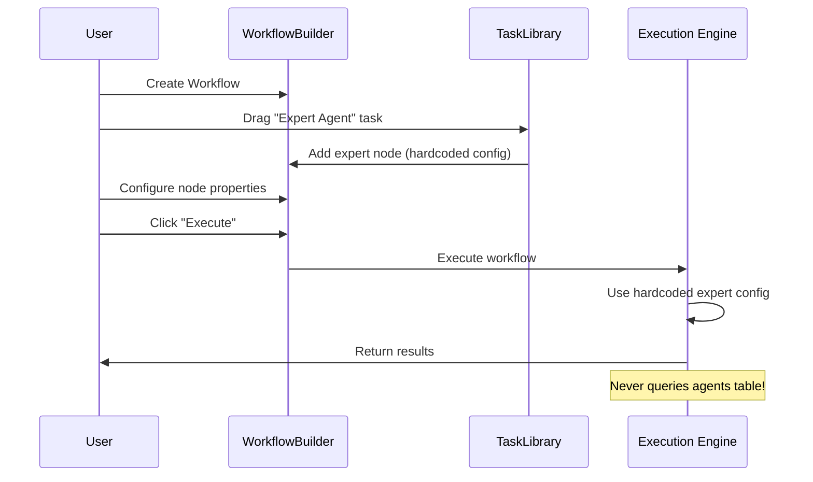

# Agent & Workflow Designer Integration Requirements

**Date:** 2025-11-21
**Location:** `/ask-panel-v1` (Designer Page)
**Status:** Analysis Complete - Implementation Required

---

## Executive Summary

This document analyzes the current architecture of the workflow designer at `/ask-panel-v1` and defines requirements for integrating individual agents with Ask Expert and Ask Panel workflows. The goal is to enable users to:

1. **Browse and select agents** from their personal collection
2. **Drag agents into workflows** as expert nodes
3. **Connect agents** to workflow components (RAG, tools, moderators)
4. **Configure agent behavior** within workflow contexts
5. **Execute workflows** with real agent profiles from the database

---

## Current Architecture Analysis

### 1. Component Structure

#### **1.1 Page Layout** (`/ask-panel-v1/page.tsx`)
```typescript
// Simple wrapper around WorkflowBuilder
export default function AskPanelV1Page() {
  return (
    <div className="flex h-full flex-col">
      <PageHeader icon={Sparkles} title="Designer" />
      <WorkflowBuilder apiBaseUrl="/api/langgraph-gui" embedded={true} />
    </div>
  );
}
```

**Key Points:**
- Minimal page wrapper
- Delegates all functionality to `WorkflowBuilder`
- No direct agent integration

---

#### **1.2 Sidebar Navigation** (`app-sidebar.tsx`)
```typescript
// Conditional rendering based on pathname
if (pathname.startsWith("/ask-panel-v1")) {
  return <SidebarDesignerContent />
}
```

**Current Sidebar Content:**
- **Quick Actions:** New Workflow, Refresh, Browse Templates
- **Modes:** 5 Ask Expert modes (Mode 1-5)
- **Service Templates:** Panel workflow templates (Structured, Open, Socratic, etc.)
- **Library:** Task components from `TASK_DEFINITIONS`

**Missing:**
- ❌ No agents list
- ❌ No agent search/filter
- ❌ No agent drag-and-drop capability

---

#### **1.3 WorkflowBuilder Component** (`WorkflowBuilder.tsx`)
```typescript
// Main workflow designer component
export const WorkflowBuilder: React.FC<WorkflowBuilderProps> = ({
  apiBaseUrl,
  embedded
}) => {
  const [nodes, setNodes, onNodesChange] = useNodesState([]);
  const [edges, setEdges, onEdgesChange] = useEdgesState([]);
  // ... extensive workflow management logic
}
```

**Key Features:**
- ReactFlow canvas for visual workflow design
- Node palette with task definitions
- Panel workflow templates
- Mode documentation modals
- Workflow execution engine
- Node property editing

**Agent Integration Points:**
- ✅ Uses `expert_agent` task type from `TaskLibrary`
- ✅ Supports expert nodes with `expertType` and `context`
- ⚠️ Expert nodes use **hardcoded** configurations, not database agents
- ❌ No connection to `/api/agents-crud` or `/api/user-agents`

---

#### **1.4 Task Library** (`TaskLibrary.tsx`)
```typescript
// Defines all draggable components
export const TASK_DEFINITIONS: TaskDefinition[] = [
  // ... search, data, analysis tasks
  {
    id: 'expert_agent',
    name: 'Expert',
    description: 'Domain expert task for panel participation',
    icon: '👤',
    category: 'Panel',
    config: {
      model: 'gpt-4o',
      temperature: 0.7,
      tools: ['rag', 'pubmed', 'fda'],
      systemPrompt: 'You are a domain expert...'
    },
  },
  // ... specialized agent tasks
  {
    id: 'clinical_researcher_agent',
    name: 'Clinical Researcher',
    // ... hardcoded configuration
  },
  // ... 10+ more agent types
];
```

**Key Points:**
- ✅ **10+ predefined expert agent types** (clinical, regulatory, medical writer, etc.)
- ⚠️ All agents are **static definitions**, not from database
- ❌ No way to use custom agents created by users
- ❌ No link to real agent profiles in `agents` table

---

#### **1.5 Panel Workflow Configurations** (`panel-definitions.ts`)
```typescript
// Predefined panel workflow templates
export const STRUCTURED_PANEL_CONFIG: PanelWorkflowConfig = {
  id: 'structured_panel',
  name: 'Structured Panel',
  experts: [
    {
      id: 'expert-1',
      type: 'expert_agent',
      label: 'Expert Agent 1',
      expertType: 'regulatory_expert', // Hardcoded type
      context: {
        expertise: ['510k', 'denovo', 'medical_devices'],
      },
    },
    // ...
  ],
  nodes: [
    // ... workflow nodes
  ],
  edges: [
    // ... workflow edges
  ]
};
```

**Key Points:**
- ✅ Expert nodes have structured configurations
- ⚠️ Expert configurations are **template-based**, not real agents
- ❌ No agent selection UI during workflow creation
- ❌ No agent profile lookup from database

---

#### **1.6 Mode 1 Ask Expert Workflow** (`mode1-ask-expert.ts`)
```typescript
export const MODE1_ASK_EXPERT_CONFIG: PanelWorkflowConfig = {
  id: 'mode1_ask_expert',
  name: 'Ask Expert Mode 1: Interactive Manual',
  experts: [
    {
      id: 'fda_510k_expert',
      type: 'expert',
      label: 'FDA 510(k) Regulatory Expert',
      expertType: 'regulatory_expert',
      context: {
        expertise: ['FDA 510(k)...'],
        display_name: 'Dr. Sarah Mitchell',
        specialty: 'FDA 510(k) Premarket Notification',
        system_prompt: `You are Dr. Sarah Mitchell...`,
        knowledge_base_ids: ['fda-510k-database', ...],
        sub_agents: ['testing_requirements_specialist', ...]
      }
    }
  ],
  // ... workflow nodes implementing LangGraph state machine
};
```

**Key Points:**
- ✅ **Rich expert context** with knowledge bases, sub-agents, prompts
- ✅ Expert persona defined (Dr. Sarah Mitchell)
- ⚠️ **Hardcoded expert configuration** - not from database
- ❌ No way to select different expert at runtime

---

### 2. Data Flow Analysis

#### **2.1 Current Agent System**

```mermaid
graph TD
    A[User] --> B[/agents page]
    B --> C[Browse Agents]
    B --> D[Create Custom Agent]
    C --> E[/api/agents-crud GET]
    D --> F[/api/agents-crud POST]
    E --> G[(agents table)]
    F --> G

    H[User] --> I[/ask-expert page]
    I --> J[Select Expert Mode]
    J --> K[Hardcoded Expert Config]
    K --> L[Execute Workflow]

    style K fill:#ff6b6b
    style G fill:#51cf66
```

**Problem:** Agents in database and agents in workflows are **disconnected systems**.

---

#### **2.2 Agent Storage Schema**

**Database Table: `agents`**
```sql
CREATE TABLE agents (
  id UUID PRIMARY KEY,
  tenant_id UUID NOT NULL,
  name VARCHAR NOT NULL,
  description TEXT,
  system_prompt TEXT,
  metadata JSONB,
  specializations TEXT[],
  expertise_level VARCHAR,
  avatar_url VARCHAR,
  color_scheme JSONB,
  base_model VARCHAR,
  temperature FLOAT,
  max_tokens INTEGER,
  status VARCHAR,
  created_by UUID,
  created_at TIMESTAMP,
  updated_at TIMESTAMP
);
```

**API: `/api/agents-crud`**
- `GET` - Fetch all agents (with tenant filtering)
- `POST` - Create new agent
- Returns normalized agent data with:
  - `id`, `display_name`, `description`
  - `capabilities`, `knowledge_domains`, `tier`
  - `model`, `avatar`, `color`, `temperature`
  - `system_prompt`, `metadata`

**API: `/api/user-agents`**
- `GET ?userId={uuid}` - Fetch user's agent collection
- `POST` - Add agent to user's list
- `DELETE` - Remove agent from user's list
- Returns user's personal agent library

---

#### **2.3 Workflow Execution Flow**



**Problem:** Workflow execution uses **template configurations**, not real agent profiles.

---

### 3. Integration Gaps

| Feature | Current State | Required State |
|---------|---------------|----------------|
| **Agent List in Sidebar** | ❌ None | ✅ Show user's agents |
| **Agent Search/Filter** | ❌ None | ✅ Search by name, specialty |
| **Agent Drag & Drop** | ❌ Only task library | ✅ Drag agents to canvas |
| **Agent Node Type** | ⚠️ Generic expert_agent | ✅ Agent-specific nodes |
| **Agent Property Panel** | ❌ Generic properties | ✅ Agent-specific config |
| **Agent-Database Link** | ❌ No connection | ✅ Fetch from /api/user-agents |
| **Runtime Agent Selection** | ❌ Template-only | ✅ Select agent at execution |
| **Agent Context in Execution** | ❌ Hardcoded | ✅ Use agent.system_prompt, etc. |

---

## Integration Requirements

### Requirement 1: Sidebar Agent List

**Component:** `SidebarDesignerContent` in `sidebar-view-content.tsx`

**New Section:**
```typescript
// Add to SidebarDesignerContent
<Collapsible defaultOpen className="group/collapsible">
  <SidebarGroup>
    <SidebarGroupLabel>My Agents</SidebarGroupLabel>
    <SidebarGroupContent>
      {/* Agent search */}
      <Input placeholder="Search agents..." />

      {/* Agent list */}
      <ScrollArea>
        {userAgents.map((agent) => (
          <AgentListItem
            key={agent.id}
            agent={agent}
            draggable
            onDragStart={(e) => handleAgentDragStart(agent, e)}
          />
        ))}
      </ScrollArea>
    </SidebarGroupContent>
  </SidebarGroup>
</Collapsible>
```

**Data Fetching:**
```typescript
const { data: userAgents } = useQuery({
  queryKey: ['user-agents', userId],
  queryFn: () => fetch(`/api/user-agents?userId=${userId}`).then(r => r.json())
});
```

**Drag Event:**
```typescript
function handleAgentDragStart(agent: Agent, event: DragEvent) {
  event.dataTransfer?.setData('application/reactflow', JSON.stringify({
    type: 'agent',
    agentId: agent.id,
    agentData: agent
  }));
}
```

---

### Requirement 2: Agent Node Type

**New Node Type:** `agent`

**Node Data Structure:**
```typescript
interface AgentNodeData {
  type: 'agent';
  agentId: string; // Database ID
  agentName: string;
  agentAvatar: string;
  agentColor: string;

  // Full agent profile
  agent: {
    id: string;
    display_name: string;
    description: string;
    system_prompt: string;
    capabilities: string[];
    knowledge_domains: string[];
    tier: number;
    model: string;
    temperature: number;
    max_tokens: number;
    metadata: any;
  };

  // Node-specific overrides
  label?: string; // Custom label for this workflow
  roleDescription?: string; // Role in this specific workflow
  config?: {
    temperature?: number; // Override agent default
    max_tokens?: number;
    tools?: string[]; // Tools available to agent
    rag_enabled?: boolean;
  };
}
```

**Visual Representation:**
```typescript
const AgentNode = ({ data }: { data: AgentNodeData }) => {
  return (
    <div className="agent-node" style={{ borderColor: data.agentColor }}>
      <Handle type="target" position={Position.Left} />
      <div className="node-header">
        
        <div>
          <h4>{data.label || data.agentName}</h4>
          <p className="text-xs text-muted-foreground">
            {data.roleDescription || data.agent.description}
          </p>
        </div>
      </div>
      <div className="node-body">
        <p className="text-xs">
          {data.agent.capabilities.slice(0, 2).join(', ')}
        </p>
      </div>
      <Handle type="source" position={Position.Right} />
    </div>
  );
};
```

---

### Requirement 3: Agent Drop Handler

**WorkflowBuilder Enhancement:**
```typescript
const onDrop = useCallback((event: DragEvent) => {
  event.preventDefault();
  const type = event.dataTransfer.getData('application/reactflow');

  if (!type) return;

  const data = JSON.parse(type);
  const position = screenToFlowPosition({
    x: event.clientX,
    y: event.clientY,
  });

  if (data.type === 'agent') {
    // Create agent node from dropped agent
    const newNode = {
      id: `agent-${Date.now()}`,
      type: 'agent',
      position,
      data: {
        type: 'agent',
        agentId: data.agentData.id,
        agentName: data.agentData.display_name,
        agentAvatar: data.agentData.avatar,
        agentColor: data.agentData.color,
        agent: data.agentData,
        label: data.agentData.display_name,
        config: {
          temperature: data.agentData.temperature,
          max_tokens: data.agentData.max_tokens,
          tools: [],
          rag_enabled: false,
        }
      }
    };

    setNodes((nds) => [...nds, newNode]);
  } else if (data.type === 'task') {
    // Existing task drop logic
    // ...
  }
}, [screenToFlowPosition, setNodes]);
```

---

### Requirement 4: Agent Property Panel

**Component:** `NodePropertiesPanel` enhancement

**Agent-Specific Properties:**
```typescript
if (selectedNode?.type === 'agent') {
  const agentData = selectedNode.data as AgentNodeData;

  return (
    <div className="agent-properties-panel">
      {/* Agent Info */}
      <section>
        <h3>Agent Profile</h3>
        <div className="agent-card">
          
          <div>
            <h4>{agentData.agentName}</h4>
            <p>{agentData.agent.description}</p>
            <div className="capabilities">
              {agentData.agent.capabilities.map(cap => (
                <Badge key={cap}>{cap}</Badge>
              ))}
            </div>
          </div>
        </div>
      </section>

      {/* Workflow Role */}
      <section>
        <Label>Role in Workflow</Label>
        <Input
          value={agentData.label}
          onChange={(e) => updateNodeData({ label: e.target.value })}
          placeholder="e.g., Primary Regulatory Reviewer"
        />
        <Textarea
          value={agentData.roleDescription}
          onChange={(e) => updateNodeData({ roleDescription: e.target.value })}
          placeholder="Describe this agent's specific role in this workflow..."
        />
      </section>

      {/* Model Configuration */}
      <section>
        <h3>Model Settings</h3>
        <Label>Temperature</Label>
        <Slider
          value={[agentData.config?.temperature ?? agentData.agent.temperature]}
          onValueChange={([temp]) => updateNodeConfig({ temperature: temp })}
          min={0}
          max={1}
          step={0.1}
        />
        <Label>Max Tokens</Label>
        <Input
          type="number"
          value={agentData.config?.max_tokens ?? agentData.agent.max_tokens}
          onChange={(e) => updateNodeConfig({ max_tokens: parseInt(e.target.value) })}
        />
      </section>

      {/* Tools & Capabilities */}
      <section>
        <h3>Tools & Access</h3>
        <Checkbox
          checked={agentData.config?.rag_enabled}
          onCheckedChange={(checked) => updateNodeConfig({ rag_enabled: checked })}
        >
          Enable RAG
        </Checkbox>
        <Label>Available Tools</Label>
        <MultiSelect
          value={agentData.config?.tools || []}
          onChange={(tools) => updateNodeConfig({ tools })}
          options={[
            { label: 'PubMed Search', value: 'pubmed' },
            { label: 'FDA Database', value: 'fda' },
            { label: 'Clinical Trials', value: 'clinical_trials' },
            { label: 'Web Search', value: 'web_search' },
          ]}
        />
      </section>

      {/* System Prompt Override */}
      <section>
        <h3>System Prompt</h3>
        <p className="text-sm text-muted-foreground">
          Default prompt from agent profile. Override for workflow-specific instructions.
        </p>
        <Textarea
          value={agentData.config?.system_prompt_override || agentData.agent.system_prompt}
          onChange={(e) => updateNodeConfig({ system_prompt_override: e.target.value })}
          rows={8}
        />
      </section>
    </div>
  );
}
```

---

### Requirement 5: Workflow Execution with Agents

**Execution Engine Update:**

```typescript
async function executeWorkflow(workflow: WorkflowDefinition, query: string) {
  // Extract agent nodes
  const agentNodes = workflow.nodes.filter(n => n.type === 'agent');

  // Build agent context map
  const agentContexts = new Map();
  for (const node of agentNodes) {
    const agentData = node.data as AgentNodeData;
    agentContexts.set(node.id, {
      agentId: agentData.agentId,
      system_prompt: agentData.config?.system_prompt_override || agentData.agent.system_prompt,
      model: agentData.agent.model,
      temperature: agentData.config?.temperature ?? agentData.agent.temperature,
      max_tokens: agentData.config?.max_tokens ?? agentData.agent.max_tokens,
      tools: agentData.config?.tools || [],
      rag_enabled: agentData.config?.rag_enabled,
      knowledge_domains: agentData.agent.knowledge_domains,
    });
  }

  // Execute workflow with agent contexts
  const result = await fetch('/api/langgraph-gui/execute', {
    method: 'POST',
    body: JSON.stringify({
      workflow,
      query,
      agentContexts: Object.fromEntries(agentContexts),
    }),
  });

  return result.json();
}
```

**Backend Execution:**
```python
# In LangGraph workflow execution
def execute_agent_node(node_id: str, state: WorkflowState):
    # Get agent context from workflow
    agent_context = state["agent_contexts"][node_id]

    # Fetch full agent profile if needed
    agent = fetch_agent_profile(agent_context["agentId"])

    # Initialize LLM with agent configuration
    llm = ChatOpenAI(
        model=agent_context["model"],
        temperature=agent_context["temperature"],
        max_tokens=agent_context["max_tokens"],
    )

    # Build system message
    system_message = SystemMessage(content=agent_context["system_prompt"])

    # Add RAG context if enabled
    if agent_context["rag_enabled"]:
        rag_docs = fetch_rag_documents(
            query=state["current_query"],
            knowledge_domains=agent_context["knowledge_domains"]
        )
        system_message.content += f"\n\nContext:\n{format_rag_docs(rag_docs)}"

    # Execute agent
    messages = [system_message] + state["conversation_history"]
    response = llm.invoke(messages)

    return {
        "agent_responses": {
            **state.get("agent_responses", {}),
            node_id: response.content
        }
    }
```

---

### Requirement 6: Agent-to-Workflow Connections

**Connection Types:**

1. **Agent → RAG Node**
   - Agent can query specific knowledge bases
   - Configuration: Select which knowledge domains to access

2. **Agent → Tool Node**
   - Agent can use specific tools (PubMed, FDA, etc.)
   - Configuration: Enable/disable tools per agent

3. **Agent → Agent**
   - Agents can collaborate in sequence or parallel
   - Configuration: Define collaboration pattern

4. **Moderator → Agent**
   - Moderator orchestrates agent participation
   - Configuration: Set speaking order, time limits

5. **Agent → Output**
   - Agent's response flows to output node
   - Configuration: Format, post-processing

**Edge Validation:**
```typescript
function isValidConnection(source: Node, target: Node): boolean {
  // Validate agent connections
  if (source.type === 'agent') {
    const validTargets = ['agent', 'output', 'task'];
    return validTargets.includes(target.type);
  }

  if (target.type === 'agent') {
    const validSources = ['input', 'agent', 'task', 'moderator'];
    return validSources.includes(source.type);
  }

  return true; // Allow other connections
}
```

---

### Requirement 7: Template Migration

**Convert Template Experts to Real Agents:**

**Migration Strategy:**
1. Create database agents for common templates
2. Update panel configs to reference agent IDs
3. Provide agent selection UI in workflow editor

**Example Migration:**
```typescript
// OLD: Hardcoded expert in template
experts: [
  {
    id: 'expert-1',
    type: 'expert_agent',
    expertType: 'regulatory_expert',
    context: { expertise: ['510k', 'denovo'] }
  }
]

// NEW: Agent reference
experts: [
  {
    id: 'expert-1',
    type: 'agent',
    agentId: 'uuid-from-database', // Reference to agents table
    // Optional overrides for this workflow
    roleDescription: 'Primary regulatory reviewer',
    config: { temperature: 0.7 }
  }
]
```

**Agent Selection UI:**
```typescript
<Dialog>
  <DialogTrigger>
    <Button>Select Expert</Button>
  </DialogTrigger>
  <DialogContent>
    <DialogTitle>Choose Expert for this Role</DialogTitle>
    <Input placeholder="Search agents..." />
    <ScrollArea>
      {filteredAgents.map(agent => (
        <AgentSelectionCard
          key={agent.id}
          agent={agent}
          onSelect={() => assignAgentToNode(node.id, agent)}
        />
      ))}
    </ScrollArea>
  </DialogContent>
</Dialog>
```

---

## Implementation Roadmap

### Phase 1: Sidebar Integration (Week 1)
- [ ] Add "My Agents" section to `SidebarDesignerContent`
- [ ] Implement agent fetching from `/api/user-agents`
- [ ] Add agent search and filtering
- [ ] Implement agent drag-and-drop

### Phase 2: Agent Node Type (Week 2)
- [ ] Create `AgentNode` React component
- [ ] Define `AgentNodeData` type
- [ ] Implement drop handler in `WorkflowBuilder`
- [ ] Add agent node styling

### Phase 3: Property Panel (Week 2)
- [ ] Extend `NodePropertiesPanel` for agent nodes
- [ ] Add agent configuration UI
- [ ] Implement node data updates

### Phase 4: Workflow Execution (Week 3)
- [ ] Update workflow execution engine
- [ ] Add agent context to execution payload
- [ ] Implement backend agent profile fetching
- [ ] Test agent execution in workflows

### Phase 5: Connection Validation (Week 3)
- [ ] Define valid agent connections
- [ ] Implement edge validation
- [ ] Add connection UI feedback

### Phase 6: Template Migration (Week 4)
- [ ] Migrate common experts to database
- [ ] Update panel configurations
- [ ] Add agent selection UI for templates
- [ ] Test migrated workflows

---

## Database Schema Changes

### No Schema Changes Required

The existing `agents` table already supports all required fields:
- ✅ `id`, `name`, `description`
- ✅ `system_prompt`, `metadata`
- ✅ `specializations`, `capabilities`
- ✅ `base_model`, `temperature`, `max_tokens`
- ✅ `avatar_url`, `color_scheme`
- ✅ `tenant_id`, `created_by`

**Optional Enhancement:**
```sql
-- Add agent_workflow_configs table for saving agent-workflow associations
CREATE TABLE agent_workflow_configs (
  id UUID PRIMARY KEY DEFAULT uuid_generate_v4(),
  workflow_id UUID NOT NULL,
  node_id VARCHAR NOT NULL,
  agent_id UUID NOT NULL REFERENCES agents(id),
  role_description TEXT,
  config JSONB,
  created_at TIMESTAMP DEFAULT NOW(),
  UNIQUE(workflow_id, node_id)
);
```

---

## API Changes

### New Endpoint: `/api/workflows/agents`

**Purpose:** Fetch agents suitable for workflow integration

```typescript
// GET /api/workflows/agents?userId={uuid}&search={query}
{
  success: true,
  agents: [
    {
      id: 'uuid',
      display_name: 'Dr. Sarah Mitchell',
      description: 'FDA 510(k) Regulatory Expert',
      avatar: '/icons/avatars/avatar_0001.png',
      color: '#3B82F6',
      capabilities: ['regulatory', 'fda', '510k'],
      tier: 1,
      // ... full agent profile
    }
  ]
}
```

### Enhanced Endpoint: `/api/langgraph-gui/execute`

**Add Agent Context:**
```typescript
POST /api/langgraph-gui/execute
{
  workflow: { nodes, edges },
  query: "What testing is required?",
  agentContexts: {
    "agent-node-1": {
      agentId: "uuid",
      system_prompt: "You are Dr. Sarah Mitchell...",
      model: "gpt-4o",
      temperature: 0.7,
      tools: ["fda", "pubmed"],
      rag_enabled: true,
      knowledge_domains: ["regulatory", "510k"]
    }
  }
}
```

---

## UI/UX Considerations

### 1. Agent Discovery
- **Search:** Name, specialty, capabilities
- **Filters:** Tier, department, business function
- **Sorting:** Alphabetical, recent, tier

### 2. Visual Feedback
- **Drag Preview:** Show agent card while dragging
- **Drop Zone:** Highlight valid drop areas
- **Connection Hints:** Show compatible connection points

### 3. Agent Node Design
- **Compact View:** Avatar + name (on canvas)
- **Expanded View:** Full profile (in property panel)
- **Status Indicators:** Active, available, error states

### 4. Workflow Validation
- **Pre-execution Checks:**
  - All agent nodes have valid agents
  - All required connections present
  - No circular dependencies
- **Error Messages:** Clear, actionable feedback

---

## Testing Requirements

### Unit Tests
- [ ] Agent drag-and-drop
- [ ] Agent node creation
- [ ] Node property updates
- [ ] Connection validation

### Integration Tests
- [ ] Agent fetching from API
- [ ] Workflow execution with agents
- [ ] Multi-agent workflows
- [ ] Agent-tool connections

### E2E Tests
- [ ] Create workflow with agents
- [ ] Configure agent properties
- [ ] Execute workflow
- [ ] Validate output

---

## Success Metrics

1. **User can browse agents** in sidebar
2. **User can drag agent** onto canvas
3. **Agent node displays** correct profile data
4. **User can configure** agent in property panel
5. **Workflow executes** with agent's system prompt
6. **Multi-agent workflows** execute successfully
7. **Template migration** preserves functionality

---

## Next Steps for Implementation Teams

### **Frontend Team (reactflow-architect, ux-ui-architect)**
1. Implement `SidebarAgentsContent` component
2. Create `AgentNode` React component
3. Extend `NodePropertiesPanel` for agents
4. Update `WorkflowBuilder` drop handler

### **Backend Team (langgraph-orchestration-architect)**
1. Enhance `/api/langgraph-gui/execute` to accept agent contexts
2. Implement agent profile fetching in workflow execution
3. Update LangGraph node execution to use agent configurations
4. Add agent context to state machine

### **Database Team**
1. (Optional) Create `agent_workflow_configs` table
2. Ensure `agents` table has proper indexes
3. Update RLS policies for workflow-agent access

---

## Conclusion

The integration of agents into the workflow designer requires:
1. **Sidebar enhancement** to display user's agents
2. **New agent node type** with rich profile data
3. **Property panel updates** for agent configuration
4. **Workflow execution changes** to use agent profiles
5. **Template migration** from hardcoded to database agents

All changes are **additive** and **backward-compatible**. Existing workflows continue to function while new agent-based workflows provide enhanced capabilities.

**Estimated Effort:** 3-4 weeks (2 engineers)
**Risk Level:** Low (no breaking changes)
**Impact:** High (unlocks agent marketplace, custom agent workflows)
