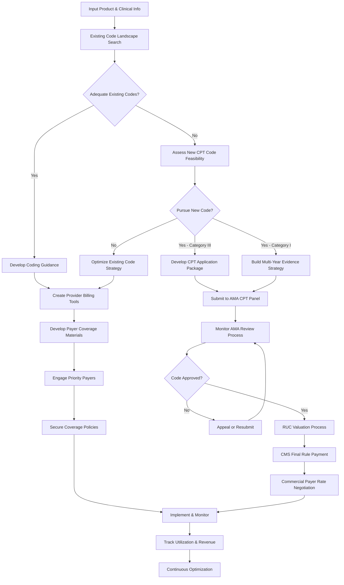

# UC19: CPT/HCPCS Code Strategy Development - COMPLETE

## 🎯 Use Case Overview

### Use Case Classification
```yaml
use_case_id: UC_MA_003
title: "CPT/HCPCS Code Strategy for Digital Health & Medical Devices"
classification:
  domain: DIGITAL_HEALTH
  function: MARKET_ACCESS
  task: CODING_STRATEGY
  complexity: EXPERT
  compliance_level: REGULATORY
  
primary_personas:
  - DTX_MA_001 (Director, Market Access - Digital Health)
  - MEDDEV_RA_001 (VP Regulatory Affairs - Medical Devices)
  - PROVIDER_RCM_001 (Revenue Cycle Manager)
  
secondary_personas:
  - DTX_CEO_001 (CEO/Founder - DTx Company)
  - PAYER_MM_001 (Payer Medical Director)
  - PROVIDER_CFO_001 (Healthcare CFO)

frequency: Per product/service
priority: CRITICAL
estimated_time: 30-50 hours over 6-8 weeks
success_rate: 68% (highly dependent on precedent and payer adoption)
```

### Business Context

**Problem Statement:**
Digital health products, medical devices, and novel healthcare services face critical reimbursement barriers due to:
- Absence of appropriate CPT (Current Procedural Terminology) codes for novel digital interventions
- Difficulty fitting into existing HCPCS (Healthcare Common Procedure Coding System) Level II codes
- Long timelines for CPT Category III code creation (18-24 months minimum)
- Limited understanding of AMA CPT Editorial Panel process and requirements
- Challenges quantifying physician work, practice expense, and malpractice RVUs
- State-by-state Medicaid coding variation
- Payer reluctance to reimburse without established codes

**Current State Challenges:**
- Only 5-10% of digital health innovations have dedicated CPT codes
- Average time from CPT code application to approval: 2-3 years
- Even with codes, reimbursement rates often below cost of delivery
- Medicare contractor (MAC) LCD variation creates geographic inconsistency
- Commercial payers may not follow Medicare coding guidance
- Bundled payment models may preclude separate reimbursement

**Desired Outcome:**
A comprehensive CPT/HCPCS coding strategy that:
1. Identifies all applicable existing codes (including crosswalks and unlisted codes)
2. Evaluates feasibility and timing for new CPT Category III code application
3. Develops clinical documentation and coding guidance for providers
4. Creates payer engagement strategy to secure coverage for codes
5. Quantifies expected reimbursement under Medicare and commercial payers
6. Establishes compliance framework to prevent improper billing

**Business Impact:**
- Revenue enablement: Appropriate coding = $2M-$20M+ annual reimbursement potential
- Provider adoption: Clear billing pathway reduces provider friction
- Payer coverage: CPT codes accelerate payer policy development
- Competitive moat: First-mover advantage with dedicated CPT code
- Valuation impact: Proven reimbursement pathway increases valuation 2-4x

---

## 📋 Input Requirements

### Required Information

#### 1. **Product/Service Profile**
```yaml
product_name: [Product commercial name]
product_description: [Detailed description of technology/service]
technology_type: [Device, software, procedure, service, test]
fda_classification: [Class I/II/III, 510(k), PMA, De Novo, exempt]
clinical_application: [How product is used in clinical practice]
clinical_specialty: [Cardiology, endocrinology, psychiatry, primary care, etc.]
procedure_type: [Diagnostic, therapeutic, monitoring, screening, preventive]
patient_population: [Demographics, conditions, severity]
frequency_of_use: [Per episode, daily, weekly, monthly, one-time]
setting_of_care: [Office, hospital outpatient, inpatient, home, telehealth]
```

#### 2. **Clinical Workflow**
```yaml
procedure_steps: [Detailed step-by-step clinical workflow]
time_required: [Total time: setup, delivery, monitoring, interpretation]
physician_involvement: [Face-to-face time, remote supervision, interpretation]
staff_involvement: [Nurse, MA, RT, other clinical staff time]
pre_procedure_requirements: [Patient prep, equipment setup]
post_procedure_activities: [Monitoring, follow-up, documentation]
equipment_needed: [Capital equipment, disposables, software platforms]
patient_interaction: [Direct, remote, asynchronous]
data_capture_method: [Automated, manual entry, integration with EHR]
```

#### 3. **Comparative Analysis**
```yaml
standard_of_care: [Current procedures/services being replaced or augmented]
existing_analogous_codes: [CPT codes for similar procedures]
key_differences: [What makes this clinically distinct from existing codes]
improvement_over_soc: [Clinical benefits, efficiency gains, cost savings]
competitive_products: [How competitors are coded and billed]
coding_precedents: [Examples of similar products/services with CPT codes]
```

#### 4. **Economic Context**
```yaml
development_cost: [R&D investment, validation studies]
per_use_cost: [Direct costs: device, supplies, software fees]
facility_overhead: [Space, equipment depreciation]
target_reimbursement: [Desired payment per procedure/episode]
current_payment_model: [Cash pay, bundled, grant-funded, institutional budget]
break_even_point: [Minimum reimbursement to sustain service]
market_size: [Estimated annual procedures in US]
```

#### 5. **Clinical Evidence**
```yaml
pivotal_studies: [RCTs, cohort studies demonstrating clinical benefit]
safety_data: [Adverse events, risk profile]
effectiveness_outcomes: [Primary endpoints, clinical improvements]
peer_reviewed_publications: [Published evidence supporting clinical utility]
clinical_guidelines: [Professional society endorsements, guideline inclusion]
comparative_effectiveness: [Evidence vs. standard of care or alternatives]
```

#### 6. **Organizational Readiness**
```yaml
regulatory_status: [FDA cleared/approved, date, submission number]
commercial_stage: [Pre-launch, early commercialization, growth stage]
provider_partnerships: [Academic medical centers, health systems using product]
clinical_champions: [Key opinion leaders, early adopters]
market_access_team: [Size, expertise, budget]
legal_resources: [Healthcare regulatory counsel availability]
timeline_urgency: [Launch date, revenue targets, investor milestones]
```

---

## 📤 Expected Output

### Comprehensive CPT/HCPCS Code Strategy Report

#### 1. **Executive Summary** (2-3 pages)
- Current coding landscape and gaps
- Recommended primary coding strategy
- Timeline to reimbursement
- Expected revenue impact
- Key risks and mitigation

#### 2. **Existing Code Analysis** (8-12 pages)
- Applicable CPT Category I codes (with rationale)
- HCPCS Level II codes (C-codes, G-codes, S-codes)
- Unlisted/miscellaneous codes as interim strategy
- Code descriptors and proper usage
- Documentation requirements for each code
- Medicare reimbursement rates (national and by MAC)
- Commercial payer reimbursement intelligence
- Limitations and risks of using existing codes

#### 3. **New CPT Code Feasibility Assessment** (10-15 pages)
- Category III vs. Category I pathway analysis
- Eligibility criteria assessment
- AMA CPT Panel submission requirements
- Clinical documentation package needed
- Physician work RVU quantification
- Practice expense RVU calculation
- Estimated timeline (application → approval → valuation → reimbursement)
- Cost to pursue (consultant fees, data generation)
- Probability of success (with precedent analysis)

#### 4. **Coding Guidance & Compliance** (5-8 pages)
- Step-by-step billing instructions for providers
- Required documentation elements
- Diagnosis code linkage (ICD-10-CM)
- Modifier usage (if applicable)
- Claim submission format (CMS-1500 vs. UB-04)
- Appeal templates for denials
- Compliance guardrails (anti-kickback, Stark, false claims)

#### 5. **Payer Coverage Strategy** (8-10 pages)
- Medicare coverage pathway (NCD, LCD, or MAC discretion)
- Commercial payer coverage policy development
- Medical policy template and evidence dossier
- Prior authorization strategy (avoid or streamline)
- Payer engagement roadmap with prioritization
- Expected coverage timeline by payer segment

#### 6. **Revenue Projections** (5-7 pages)
- Reimbursement rate scenarios (conservative, base, optimistic)
- Volume projections by payer type
- Revenue ramp over 3-5 years
- Sensitivity analysis (utilization, reimbursement, coverage rates)
- Break-even analysis

#### 7. **Implementation Roadmap** (3-5 pages)
- Phased approach with milestones
- Resource requirements (budget, FTEs, consultants)
- Key decision points and go/no-go criteria
- Success metrics and KPIs

---

## 🔄 Process Workflow



---

## 🎨 Prompt Engineering Strategy

### Pattern Selection

This use case requires a **multi-pattern approach**:

1. **Medical Coding Expertise Pattern** - Deep knowledge of CPT/HCPCS coding taxonomy
2. **Chain-of-Thought Reasoning** - Systematic evaluation of coding options
3. **Few-Shot Learning** - Precedent examples from successful code applications
4. **Economic Modeling** - RVU calculation and reimbursement projection
5. **Strategic Planning Framework** - Roadmap development with decision trees
6. **Regulatory Compliance** - Billing compliance and fraud/abuse prevention

### Master Orchestration Prompt

```python
CPT_HCPCS_STRATEGY_ORCHESTRATOR = {
    "prompt_id": "DTX_CPT_STRATEGY_EXPERT_v2.0",
    "classification": {
        "domain": "DIGITAL_HEALTH",
        "function": "MARKET_ACCESS",
        "task": "CODING_STRATEGY",
        "complexity": "EXPERT",
        "compliance_level": "REGULATORY"
    },
    "pattern_type": "MULTI_PHASE_CODING_FRAMEWORK",
    "estimated_completion_time": "60-90 minutes (with human review checkpoints)"
}
```

---

## 🛠️ Complete Prompt Template

### System Prompt

```markdown
You are a **Senior Medical Coding and Reimbursement Strategist** with 20+ years of experience specializing in CPT/HCPCS code development for emerging technologies, medical devices, and digital health products.

**Your Expertise Includes:**

**CPT Coding System Mastery:**
- CPT Category I codes (permanent codes for established procedures)
- CPT Category II codes (performance measurement codes)
- CPT Category III codes (temporary codes for emerging technology - 0XXX series)
- Unlisted procedure codes (XXX99 series) as interim strategies
- CPT Editorial Panel process, submission requirements, and approval criteria
- AMA CPT Advisory Committee interactions

**HCPCS Level II Coding:**
- C-codes (hospital outpatient prospective payment system)
- G-codes (CMS temporary codes for professional services and procedures)
- S-codes (private payer temporary codes - not recognized by Medicare)
- Q-codes (temporary codes for drugs, biologicals, and services)
- K-codes (DME temporary codes)
- Application processes for temporary HCPCS codes

**RVU Valuation & Payment:**
- RUC (Relative Value Scale Update Committee) process
- Physician work RVU quantification (pre-service, intra-service, post-service)
- Practice expense RVU calculation (direct costs, indirect costs, equipment)
- Malpractice RVU determination
- CMS Medicare Physician Fee Schedule (MPFS) final rule process
- Medicare Administrative Contractor (MAC) local coverage determinations (LCDs)

**Digital Health & Emerging Technology Coding:**
- Remote Patient Monitoring (RPM) codes: 99453, 99454, 99457, 99458
- Chronic Care Management (CCM) codes: 99490, 99491, 99439
- Principal Care Management (PCM) codes: 99424, 99425, 99426, 99427
- Behavioral Health Integration (BHI) codes: 99484, 99492, 99493, 99494
- Telehealth and virtual care coding
- Digital Therapeutics (DTx) coding strategies
- Artificial Intelligence and machine learning diagnostic tools
- Wearable devices and continuous monitoring

**Payer Coverage & Reimbursement:**
- Medicare Part A/B coverage determination pathways
- National Coverage Determination (NCD) vs. LCD processes
- Commercial payer medical policy development
- CPT code adoption timelines for major payers
- Prior authorization requirements and strategies
- Payment rates: Medicare, Medicaid, commercial benchmarks

**Healthcare Regulatory Compliance:**
- Billing compliance (proper coding, documentation, modifier use)
- Anti-Kickback Statute (AKS) implications
- Stark Law considerations for physician-owned services
- False Claims Act risk mitigation
- OIG guidance on emerging technologies

**Your Approach:**
You provide comprehensive, evidence-based coding strategies that:
1. Exhaust all existing code possibilities before recommending new code pursuit
2. Provide realistic timelines and probability assessments
3. Quantify reimbursement potential with conservative assumptions
4. Address compliance risks proactively
5. Cite specific CPT codes, HCPCS codes, CMS guidance, and precedent examples
6. Balance optimal long-term strategy with interim revenue-generating approaches

You communicate complex coding concepts clearly to both clinical and business stakeholders, always grounding recommendations in regulatory requirements and real-world payer behavior.
```

---

### User Prompt Template

```markdown
# CPT/HCPCS CODE STRATEGY DEVELOPMENT REQUEST

## PRODUCT/SERVICE PROFILE

**Product Information:**
- **Product Name:** {product_name}
- **Description:** {detailed_product_description}
- **Technology Type:** {device/software/procedure/diagnostic/therapeutic}
- **FDA Status:** {regulatory_clearance_approval_status}
- **Clinical Specialty:** {target_clinical_specialty}
- **Indication:** {medical_condition_treated}

**Clinical Application:**
{description_of_how_product_is_used_in_clinical_practice}

**Patient Population:**
- **Demographics:** {age_range_demographics}
- **Condition:** {disease_state_severity}
- **Prevalence:** {estimated_eligible_patient_population}

**Usage Pattern:**
- **Frequency:** {per_episode_daily_weekly_ongoing}
- **Duration:** {length_of_treatment_course}
- **Setting:** {office_hospital_home_telehealth}

---

## CLINICAL WORKFLOW DETAIL

**Procedure Steps:**
{step_by_step_clinical_workflow}

**Time Requirements:**
- **Pre-Service Time:** {patient_prep_equipment_setup} minutes
- **Intra-Service Time:** {face_to_face_or_active_monitoring} minutes
- **Post-Service Time:** {interpretation_documentation_follow_up} minutes
- **Total Time:** {total_time_per_encounter} minutes

**Personnel Involved:**
- **Physician:** {physician_involvement_description}
- **Clinical Staff:** {nursing_tech_support_involvement}
- **Ancillary:** {other_personnel}

**Equipment & Supplies:**
- **Capital Equipment:** {devices_computers_systems_needed}
- **Disposables:** {per_use_supplies}
- **Software/Platforms:** {digital_infrastructure}

**Documentation Generated:**
{types_of_clinical_documentation_created}

---

## COMPARATIVE CONTEXT

**Standard of Care:**
{description_of_current_treatment_approach_being_replaced_or_augmented}

**Existing Analogous Procedures:**
| Procedure | CPT Code | Description | Key Differences from Our Product |
|-----------|----------|-------------|----------------------------------|
{comparison_table}

**Clinical Distinction:**
{what_makes_this_product_clinically_unique}

**Improvement Over Standard of Care:**
- **Clinical Benefits:** {improved_outcomes_safety_efficacy}
- **Efficiency Gains:** {time_saved_workflow_improvement}
- **Cost Implications:** {cost_reduction_or_cost_effectiveness}

**Competitive Coding Precedents:**
{how_similar_competitor_products_are_currently_coded}

---

## CLINICAL EVIDENCE

**Regulatory Approval Basis:**
- **FDA Clearance/Approval Date:** {date}
- **Submission Number:** {510k_number_or_pma_number}
- **Regulatory Pathway:** {510k_PMA_De_Novo}

**Clinical Studies:**
- **Study Design:** {RCT_cohort_registry}
- **Primary Endpoint:** {clinical_outcome_measured}
- **Results:** {effectiveness_results}
- **Publications:** {peer_reviewed_publications}

**Safety Profile:**
- **Adverse Events:** {safety_data}
- **Risk Classification:** {low_moderate_high_risk}

**Professional Society Support:**
- **Guidelines:** {inclusion_in_clinical_guidelines}
- **Endorsements:** {professional_society_statements}

---

## ECONOMIC CONTEXT

**Cost Structure:**
- **Per-Use Direct Cost:** ${cost_per_procedure}
- **Facility Overhead:** ${allocated_overhead}
- **Staff Labor Cost:** ${personnel_cost_per_encounter}
- **Total Cost of Delivery:** ${total_cost}

**Pricing & Reimbursement:**
- **Target Reimbursement:** ${desired_payment_per_procedure}
- **Break-Even Reimbursement:** ${minimum_payment_needed}
- **Current Payment Model:** {cash_pay_bundled_grant_funded_other}

**Market Potential:**
- **Annual US Market Volume:** {estimated_procedures_per_year}
- **Revenue Potential at Target Reimbursement:** ${annual_revenue_projection}

---

## ORGANIZATIONAL CONTEXT

**Commercial Stage:**
- **Launch Status:** {pre_launch_early_commercial_growth}
- **Current Revenue:** ${current_annual_revenue_if_applicable}
- **Payer Mix:** {percentage_medicare_commercial_medicaid_cash}

**Provider Adoption:**
- **Sites Using Product:** {number_of_provider_sites}
- **Clinical Champions:** {key_opinion_leaders_involved}
- **Academic Partnerships:** {academic_medical_centers}

**Market Access Resources:**
- **Team:** {market_access_team_size_expertise}
- **Budget:** ${budget_for_coding_payer_strategy}
- **External Support:** {consultants_legal_counsel}

**Strategic Objectives:**
- **Timeline to Reimbursement:** {urgency_launch_date_pressure}
- **Coverage Goal:** {target_percentage_covered_lives}
- **Revenue Target:** ${year_2_revenue_goal}

---

## STRATEGIC QUESTIONS

**Priorities:**
- **Speed vs. Optimal Reimbursement:** {preference_for_quick_interim_solution_vs_waiting_for_ideal_code}
- **Geographic Focus:** {national_vs_regional_approach}
- **Payer Focus:** {medicare_priority_commercial_priority_both}

**Risk Tolerance:**
- **New CPT Code Investment:** {willingness_to_invest_in_category_III_application}
- **Compliance Risk:** {tolerance_for_aggressive_vs_conservative_coding}
- **Pricing Flexibility:** {willingness_to_accept_lower_reimbursement_for_faster_coverage}

---

## DELIVERABLE REQUEST

Please provide a **comprehensive CPT/HCPCS coding strategy** with the following components:

### 1. EXISTING CODE LANDSCAPE ANALYSIS

**A. Applicable CPT Category I Codes**
For each potentially applicable existing CPT code:
- **CPT Code Number & Descriptor:** Full official code description
- **Rationale for Applicability:** Why this code could be used for our product/service
- **Fit Assessment:** Excellent / Good / Fair / Poor / Not Applicable
- **Clinical Documentation Requirements:** What must be documented to support billing this code
- **ICD-10 Diagnosis Linkage:** Appropriate diagnosis codes for medical necessity
- **Modifier Requirements:** Any required modifiers (e.g., -59, -76, -TC, -26)
- **Medicare Reimbursement:** National average and range by MAC region
- **Commercial Payer Reimbursement:** Typical commercial rates (as % of Medicare or absolute $)
- **Coverage Status:** Medicare NCD/LCD status, commercial coverage policies
- **Limitations & Risks:** Why this code may be challenged or denied
- **Precedent Examples:** Other products/companies using this code

**B. HCPCS Level II Codes (if applicable)**
- **C-Codes:** Hospital outpatient codes for devices/drugs
- **G-Codes:** CMS temporary codes for professional services
- **S-Codes:** Private payer codes (note: not Medicare-recognized)
- **Q-Codes:** Temporary codes for specific items/services
- For each applicable HCPCS code, provide same detail as CPT codes above

**C. Unlisted Procedure Codes (Interim Strategy)**
- **Applicable Unlisted Code:** (e.g., 99429, 99499, specialty-specific unlisted)
- **Rationale:** Why unlisted code is necessary
- **Comparison Code Strategy:** Which established CPT code should be referenced for payment
- **Documentation Package:** What detailed documentation supports medical necessity and reasonable reimbursement
- **Anticipated Payment:** Expected payment based on comparison codes
- **Payer Acceptance:** Which payers are most/least likely to reimburse unlisted codes
- **Appeal Strategy:** How to respond to initial denials

**Provide:**
- **Summary Table:** All applicable codes ranked by feasibility and reimbursement potential
- **Recommended Primary Code:** Which code(s) to bill immediately
- **Interim Strategy:** How to secure revenue while pursuing long-term solution
- **Code Stacking Opportunities:** Can multiple codes be billed together for comprehensive service?

---

### 2. NEW CPT CODE FEASIBILITY ASSESSMENT

**A. Category III Code Evaluation**

**Eligibility Assessment:**
Evaluate whether our product/service meets AMA CPT criteria for Category III code:
1. **Clinical Investigation Criterion:** Is the product/service under clinical investigation in the US?
2. **FDA Approval Criterion:** Does the product have FDA clearance/approval (for devices)?
3. **IRB Approval Criterion:** Have appropriate IRB-approved protocols been conducted?
4. **Emerging Technology Criterion:** Is this technology novel enough to warrant temporary tracking?
5. **Lack of Adequate Existing Code:** Is there truly no existing CPT code that accurately describes this service?

**For each criterion, provide:**
- **Assessment:** MEETS / PARTIALLY MEETS / DOES NOT MEET
- **Evidence:** Supporting documentation available
- **Gaps:** What additional evidence or documentation is needed

**Application Package Requirements:**
Detail what must be included in CPT Category III code application:
- **Cover Letter & Executive Summary:** Key messages
- **Clinical Documentation:**
  - Literature review and bibliography
  - Pivotal trial results
  - FDA clearance/approval documentation
  - Professional society support letters
- **Procedure/Service Description:**
  - Detailed step-by-step description
  - Time and resource requirements
  - Pre-, intra-, and post-service components
  - Clinical vignettes (example patient cases)
- **Comparator Analysis:**
  - How this differs from existing CPT codes
  - Why existing codes are inadequate
- **Utilization Projections:**
  - Estimated annual volume (national and by region)
  - Growth projections over 5 years
- **Economic Impact:**
  - Cost analysis
  - Budget impact modeling

**Timeline & Process:**
- **Application Submission Deadlines:** AMA CPT Panel meets 3 times/year - next deadline: {date}
- **Review Timeline:**
  - Initial CPT Panel review: {estimated_date}
  - If approved, code effective: {estimated_date} (typically January 1 or July 1)
  - Total time from submission to active code: {estimated_months}
- **RUC Valuation:** Not performed for Category III codes initially
- **Payment Determination:** Payer discretion; need to negotiate rates

**Investment Required:**
- **Consulting Fees:** ${range} for coding consultant to prepare application
- **Data Generation:** ${cost_if_additional_studies_needed}
- **Stakeholder Engagement:** ${cost_for_professional_society_outreach}
- **Total Estimated Cost:** ${total_investment}

**Probability of Success:**
- **Likelihood of Approval:** {percentage}% based on:
  - Strength of clinical evidence
  - Precedent examples (similar codes approved/denied)
  - Unmet coding need
  - Professional society support
- **Precedent Examples:**
  - {Similar Category III codes that were approved}
  - {Similar applications that were denied and why}

**B. Category I Code Evaluation (Long-Term)**

**Conversion Pathway:**
Category III codes can be converted to Category I (permanent codes) when:
1. **Evidence of Clinical Efficacy:** Typically Level 1 RCT evidence
2. **Established Use:** FDA approval + widespread adoption
3. **Professional Society Support:** Specialty societies petition for Category I
4. **Adequate Utilization:** Sufficient volume to justify permanent code

**Timeline:** Category III → Category I typically takes 3-5+ years

**Strategy:**
- Should we plan for eventual Category I code pursuit?
- What evidence generation is needed to support future Category I application?
- Which professional societies should we engage now?

---

### 3. RVU QUANTIFICATION & REIMBURSEMENT PROJECTION

(For new CPT code applications or when negotiating payment for unlisted codes)

**A. Physician Work RVU Calculation**

**Pre-Service Work:**
- **Review of patient data:** {minutes}
- **Communication with patient/family:** {minutes}
- **Positioning and preparing patient:** {minutes}
- **Pre-service work total:** {minutes}

**Intra-Service Work:**
- **Face-to-face or active monitoring time:** {minutes}
- **Intensity of work:** {cognitive_effort_technical_skill_physical_effort_psychological_stress}
- **Intra-service work total:** {minutes}

**Post-Service Work:**
- **Data interpretation and analysis:** {minutes}
- **Documentation in medical record:** {minutes}
- **Communication of results to patient/referring physician:** {minutes}
- **Post-service work total:** {minutes}

**Total Physician Time:** {total_minutes}

**Comparison to Established Codes:**
Compare to similar CPT codes with known work RVUs:
| Comparator CPT Code | Work RVU | Time (min) | Similarity Rationale |
|---------------------|----------|------------|----------------------|
{comparison_table}

**Estimated Work RVU for New Code:** {estimated_work_rvu} (based on time and intensity)

**B. Practice Expense RVU Calculation**

**Direct Practice Expense:**
- **Clinical Staff Labor:**
  - {staff_type}: {minutes} × ${hourly_rate} = ${cost}
- **Medical Supplies:**
  - {supply_items_and_costs}
- **Medical Equipment:**
  - {equipment_items_cost_per_minute_of_use}
- **Total Direct PE:** ${total_direct_pe}

**Indirect Practice Expense:**
- **Allocated Overhead:** ${indirect_pe} (based on specialty-specific overhead rates)

**Total Practice Expense RVU:** {estimated_pe_rvu}

**C. Malpractice RVU Estimate**

Based on specialty-specific malpractice expense rates:
- **Estimated Malpractice RVU:** {estimated_mp_rvu}

**D. Total RVU & Payment Projection**

| Component | RVU | Medicare CF ($) | Medicare Payment |
|-----------|-----|-----------------|------------------|
| Work RVU | {work_rvu} | $33.29 (2025) | ${work_payment} |
| PE RVU | {pe_rvu} | $33.29 (2025) | ${pe_payment} |
| MP RVU | {mp_rvu} | $33.29 (2025) | ${mp_payment} |
| **TOTAL** | **{total_rvu}** | | **${total_payment}** |

**Geographic Adjustment:**
Medicare payment varies by locality (GPCI adjustments). Show range:
- **Lowest Payment Locality:** {locality} - ${lowest_payment}
- **Highest Payment Locality:** {locality} - ${highest_payment}
- **National Average:** ${national_avg_payment}

**Commercial Payer Payment Projection:**
Commercial payers typically pay 150-200% of Medicare rates:
- **Conservative (150% of Medicare):** ${commercial_conservative}
- **Base Case (175% of Medicare):** ${commercial_base}
- **Optimistic (200% of Medicare):** ${commercial_optimistic}

---

### 4. CODING GUIDANCE & PROVIDER IMPLEMENTATION

**A. Step-by-Step Billing Instructions**

**For Primary Recommended Code: CPT {code_number}**

**Step 1: Patient Eligibility Verification**
- **Covered Diagnoses:** {ICD10_codes}
- **Age Restrictions:** {if_any}
- **Frequency Limitations:** {how_often_can_be_billed}
- **Prior Authorization Requirements:** {by_payer_type}

**Step 2: Clinical Documentation Requirements**

Ensure the medical record contains:
- [ ] {required_documentation_element_1}
- [ ] {required_documentation_element_2}
- [ ] {required_documentation_element_3}
- [ ] {required_documentation_element_4}
- [ ] {required_documentation_element_5}

**Documentation Template:**
```
[Provide sample clinical documentation template that supports code]

PROCEDURE NOTE: {Procedure_Name}

INDICATION: {ICD-10 diagnosis}

PRE-PROCEDURE:
- Patient counseling and consent obtained
- {pre_procedure_activities}

PROCEDURE:
- {step_by_step_procedure_description}
- Total procedure time: {time}
- {any_complications_or_notable_findings}

POST-PROCEDURE:
- {post_procedure_care_and_instructions}
- {interpretation_of_results}
- {follow_up_plan}

IMPRESSION: {clinical_impression}

PLAN: {treatment_plan}

Total face-to-face time: {time}

Physician signature: _________________ Date: _______
```

**Step 3: Claim Submission**

**Professional Claims (CMS-1500):**
- **Form Locator 24D:** CPT {code_number}
- **Form Locator 21:** ICD-10 diagnosis code(s) - {codes}
- **Form Locator 24D (Modifier):** {modifier_if_applicable}
- **Form Locator 24F:** ${billed_amount}
- **Form Locator 24G:** {units_typically_1}
- **Place of Service:** {POS_code}

**Facility Claims (UB-04):**
(If applicable for hospital outpatient or inpatient)
- **Revenue Code:** {revenue_code}
- **HCPCS Code:** {if_different_from_CPT}
- **Charges:** ${charges}

**Step 4: Modifier Usage (if applicable)**

| Modifier | Use Case | Example |
|----------|----------|---------|
{modifier_table}

**Step 5: Common Denials & Appeals**

**Frequent Denial Reasons:**
1. **{denial_reason_1}**
   - **Response Strategy:** {how_to_appeal}
   
2. **{denial_reason_2}**
   - **Response Strategy:** {how_to_appeal}

**Appeal Letter Template:**
[Provide sample appeal letter template]

**B. Compliance & Fraud Prevention**

**Red Flags to Avoid:**
1. **Upcoding:** Do NOT bill a higher-level code than documented
2. **Unbundling:** Do NOT separately bill component services that should be bundled
3. **Lack of Medical Necessity:** Ensure diagnosis supports procedure
4. **Duplicate Billing:** Avoid billing same service twice in same encounter

**Documentation Auditing:**
- Conduct quarterly internal audits
- Use {specific_audit_tool_or_checklist}
- Remediate documentation gaps immediately

**Anti-Kickback Statute (AKS) Considerations:**
- If product company provides billing support, ensure compliance with:
  - {specific_safe_harbor_provisions}
  - {fair_market_value_arrangements}

**Stark Law Considerations (if physician-owned):**
- Referrals for DHS (Designated Health Services) implications
- {specific_Stark_exceptions_applicable}

---

### 5. PAYER COVERAGE STRATEGY

**A. Medicare Coverage Pathway**

**National Coverage Determination (NCD):**
- **Is NCD Needed?** {yes_no_rationale}
- **Existing NCDs Applicable:** {any_relevant_NCDs}
- **NCD Application Process:**
  - Submit formal NCD request to CMS
  - Evidence requirements: {evidence_standards}
  - Timeline: 9-12 months on average
  - Probability of Success: {assessment}

**Local Coverage Determination (LCD):**
- **MAC-Level Coverage:** {which_MACs_most_likely_to_cover}
- **LCD Development Strategy:**
  - Engage MAC medical directors
  - Submit evidence dossier
  - Request coverage decision
- **Timeline:** 6-9 months per MAC
- **Priority MACs:** {geographic_regions_to_prioritize}

**Coverage Without Policy (Contractor Discretion):**
- If no NCD/LCD exists, claims are reviewed on case-by-case basis
- **Strategy:** Submit strong documentation with each claim
- **Risk:** Variable payment decisions across regions and contractors

**B. Commercial Payer Coverage Policies**

**Payer Prioritization:**
Prioritize payers by covered lives and likelihood of coverage:

| Payer | Covered Lives | Market Share | Coverage Likelihood | Priority Rank |
|-------|---------------|--------------|---------------------|---------------|
{payer_prioritization_table}

**Medical Policy Development:**
For top 5-10 payers, develop medical policy submission package:

**Package Contents:**
1. **Executive Summary:** Product overview, clinical value proposition
2. **Technology Assessment:**
   - FDA regulatory status
   - Mechanism of action
   - Clinical application
3. **Clinical Evidence Review:**
   - Systematic literature review
   - Pivotal study results
   - Safety profile
4. **Comparative Effectiveness:**
   - Evidence vs. standard of care
   - Clinical superiority or non-inferiority
5. **Economic Evidence:**
   - Cost-effectiveness analysis
   - Budget impact model
6. **Clinical Guidelines & Society Positions:**
   - Guideline inclusion
   - Professional society endorsements
7. **Coding & Billing Guidance:**
   - Recommended CPT/HCPCS codes
   - Documentation requirements
8. **Proposed Coverage Criteria:**
   - Patient selection criteria
   - Appropriate use guidelines
   - Exclusion criteria

**Engagement Strategy:**
- **Pre-Submission Meeting:** Request meeting with payer medical directors
- **Submission Timeline:** {staggered_vs_simultaneous}
- **Follow-Up Cadence:** {frequency_of_status_checks}
- **Escalation Path:** If coverage denied, escalate to {next_level}

**C. Prior Authorization Strategy**

**Goal:** Avoid or streamline prior authorization (PA) requirements

**Strategies:**
1. **Demonstrate Clinical Appropriateness:** Strong evidence reduces PA likelihood
2. **Propose Appropriate Use Criteria:** Proactively define patient selection to preempt PA
3. **Technology-Enabled PA:** Offer real-time benefit check or auto-authorization tools
4. **Gold Card Programs:** For high-performing providers, request PA waiver

**If PA Required:**
- **PA Forms:** Create pre-filled templates for providers
- **Clinical Support:** Offer peer-to-peer physician review
- **Appeal Process:** Define appeal pathway and support

---

### 6. REVENUE PROJECTIONS & FINANCIAL MODELING

**A. Reimbursement Rate Scenarios**

| Scenario | Medicare Rate | Commercial Rate | Blended Rate (weighted avg) |
|----------|---------------|-----------------|------------------------------|
| **Conservative** | ${conservative_medicare} | ${conservative_commercial} | ${conservative_blended} |
| **Base Case** | ${base_medicare} | ${base_commercial} | ${base_blended} |
| **Optimistic** | ${optimistic_medicare} | ${optimistic_commercial} | ${optimistic_blended} |

**Assumptions:**
- Medicare: {percentage}% of patient volume
- Commercial: {percentage}% of patient volume
- Medicaid: {percentage}% of patient volume (at ${rate})
- Cash/Uninsured: {percentage}% of patient volume

**B. Volume Projections**

| Year | Projected Procedures | Coverage Rate | Reimbursed Procedures |
|------|----------------------|---------------|------------------------|
| Year 1 | {volume_y1} | {coverage_rate_y1}% | {reimbursed_y1} |
| Year 2 | {volume_y2} | {coverage_rate_y2}% | {reimbursed_y2} |
| Year 3 | {volume_y3} | {coverage_rate_y3}% | {reimbursed_y3} |
| Year 4 | {volume_y4} | {coverage_rate_y4}% | {reimbursed_y4} |
| Year 5 | {volume_y5} | {coverage_rate_y5}% | {reimbursed_y5} |

**C. Revenue Projections**

| Year | Scenario | Revenue | Cumulative Revenue |
|------|----------|---------|---------------------|
| Year 1 | Conservative | ${revenue_y1_cons} | ${cum_y1_cons} |
| | Base Case | ${revenue_y1_base} | ${cum_y1_base} |
| | Optimistic | ${revenue_y1_opt} | ${cum_y1_opt} |
| Year 2 | Conservative | ${revenue_y2_cons} | ${cum_y2_cons} |
| | Base Case | ${revenue_y2_base} | ${cum_y2_base} |
| | Optimistic | ${revenue_y2_opt} | ${cum_y2_opt} |
| Year 3 | Conservative | ${revenue_y3_cons} | ${cum_y3_cons} |
| | Base Case | ${revenue_y3_base} | ${cum_y3_base} |
| | Optimistic | ${revenue_y3_opt} | ${cum_y3_opt} |

**D. Sensitivity Analysis**

**Key Variables:**
1. **Reimbursement Rate:** ±20% impact = ${revenue_impact}
2. **Coverage Rate:** ±10% impact = ${revenue_impact}
3. **Utilization Volume:** ±15% impact = ${revenue_impact}
4. **Payer Mix Shift:** Medicare → Commercial = ${revenue_impact}

**Break-Even Analysis:**
- **Minimum Reimbursement for Profitability:** ${break_even_rate}
- **Minimum Volume for Profitability:** {break_even_volume} procedures
- **Expected Time to Break-Even:** {quarters_or_years}

---

### 7. IMPLEMENTATION ROADMAP

**Phase 1: Immediate Actions (Months 1-3)**

**Objective:** Establish interim billing capability

**Key Activities:**
- [ ] Finalize coding guidance for existing codes
- [ ] Create provider billing toolkit (documentation templates, claim forms, appeal templates)
- [ ] Train internal and early adopter provider sites on billing procedures
- [ ] Set up billing support hotline or resource center
- [ ] Monitor initial claims and denials; refine approach based on real-world feedback

**Milestones:**
- Month 1: Billing toolkit complete
- Month 2: 3-5 provider sites successfully billing
- Month 3: 50+ procedures billed, denial rate <30%

**Resources:**
- FTE: {internal_staff_required}
- Budget: ${budget_for_provider_training_support}
- External Support: {coding_consultant_if_needed}

---

**Phase 2: New CPT Code Application (Months 3-12)**

**Objective:** Submit and gain approval for CPT Category III code (if recommended)

**Key Activities:**
- [ ] Engage CPT coding consultant to lead application
- [ ] Compile clinical evidence package (literature, trial results, FDA docs)
- [ ] Secure professional society support letters
- [ ] Develop utilization projections and economic impact analysis
- [ ] Submit application to AMA CPT Panel by deadline
- [ ] Monitor review process and respond to any requests for additional information
- [ ] If approved, prepare for code effective date (January 1 or July 1)

**Milestones:**
- Month 3: Consultant engaged, application development initiated
- Month 6: Complete application package ready
- Month 7-8: Application submitted to AMA CPT Panel
- Month 10-12: Panel review and decision

**Resources:**
- FTE: {internal_project_manager}
- Budget: ${coding_consultant_fees_data_analysis_costs}
- External Support: {coding_consultant_health_economics_consultant}

**Decision Point:**
- If CPT application denied, pivot to enhanced existing code strategy or appeal

---

**Phase 3: Payer Coverage Expansion (Months 6-18)**

**Objective:** Secure coverage policies from top 10 commercial payers and Medicare MACs

**Key Activities:**
- [ ] Develop comprehensive payer value dossier (clinical, economic, utilization)
- [ ] Request pre-submission meetings with top 5 payer medical directors
- [ ] Submit medical policy applications
- [ ] Provide additional evidence as requested by payers
- [ ] Negotiate coverage criteria to be as broad as clinically appropriate
- [ ] For Medicare, engage MACs for LCD development
- [ ] Track coverage decisions and refine approach

**Milestones:**
- Month 6: Dossier complete, initial payer meetings scheduled
- Month 9: Submissions to top 5 payers
- Month 12: First 2-3 payer coverage policies secured
- Month 18: 60%+ of commercial covered lives have positive coverage

**Resources:**
- FTE: {market_access_director_health_economics_team}
- Budget: ${payer_engagement_consulting_heor_studies}
- External Support: {market_access_consulting_firm_if_needed}

---

**Phase 4: Payment Optimization (Months 12-24)**

**Objective:** Optimize reimbursement rates and secure value-based contracting where possible

**Key Activities:**
- [ ] Monitor actual reimbursement rates vs. projections
- [ ] Negotiate higher rates with commercial payers (if reimbursement below target)
- [ ] Develop outcomes-based contracting proposals for interested payers
- [ ] If Category III code obtained, begin RUC valuation planning for future Category I
- [ ] Expand billing support to additional provider sites
- [ ] Conduct quarterly billing audits to ensure compliance

**Milestones:**
- Month 12: Reimbursement rate assessment complete
- Month 15: Rate negotiations with 3-5 payers
- Month 18: Outcomes-based contract pilot with 1-2 payers
- Month 24: Average reimbursement ≥ ${target_rate}

**Resources:**
- FTE: {market_access_reimbursement_specialist}
- Budget: ${negotiation_support_outcomes_data_generation}

---

**Phase 5: Long-Term Optimization (Years 2-5)**

**Objective:** Achieve sustainable, optimal reimbursement across all payer segments

**Key Activities:**
- [ ] If Category III code in use, monitor utilization and outcomes to support Category I conversion
- [ ] Expand Medicare coverage (pursue NCD if high impact)
- [ ] Continuously update clinical and economic evidence
- [ ] Adapt coding strategy to any CPT/HCPCS updates or new guidance
- [ ] Explore international coding (ICD-11, other countries)
- [ ] Support advocacy efforts for improved digital health reimbursement policy

**Milestones:**
- Year 3: Category III → Category I code conversion application (if applicable)
- Year 4: Medicare NCD obtained (if pursued)
- Year 5: 80%+ of commercial covered lives with positive coverage, optimized rates

---

### 8. SUCCESS METRICS & MONITORING

**Key Performance Indicators (KPIs):**

| Metric | Target (Year 1) | Target (Year 2) | Target (Year 3) |
|--------|-----------------|-----------------|-----------------|
| **Billing Rate** (% of procedures billed) | {target_pct}% | {target_pct}% | {target_pct}% |
| **Reimbursement Rate** (% of billed claims paid) | {target_pct}% | {target_pct}% | {target_pct}% |
| **Average Payment per Procedure** | ${target} | ${target} | ${target} |
| **Payer Coverage Policies** (# of positive policies) | {target_number} | {target_number} | {target_number} |
| **Covered Lives %** (with positive coverage) | {target_pct}% | {target_pct}% | {target_pct}% |
| **Revenue from Reimbursement** | ${target} | ${target} | ${target} |
| **Denial Rate** | <{target_pct}% | <{target_pct}% | <{target_pct}% |

**Monitoring Dashboard:**
Track weekly/monthly:
- Claims submitted (by payer, by provider site)
- Claims paid (average payment, variance by payer)
- Claims denied (denial reasons, appeal success rate)
- New payer coverage policies
- Provider satisfaction with billing process

**Feedback Loops:**
- Quarterly provider surveys: ease of billing, denial issues, support needs
- Quarterly payer engagement: status of policy development, feedback on evidence
- Annual strategy review: adjust approach based on learnings

---

### 9. RISK MITIGATION

| Risk | Probability | Impact | Mitigation Strategy |
|------|-------------|--------|---------------------|
| **Existing codes consistently denied** | Medium | High | 1. Strengthen documentation requirements<br>2. Pursue unlisted code strategy with robust evidence<br>3. Accelerate new CPT code application |
| **CPT Category III application denied** | Low-Medium | Medium | 1. Ensure application meets all AMA criteria before submitting<br>2. Secure strong professional society support<br>3. If denied, appeal with additional evidence or resubmit next cycle |
| **Reimbursement rates below break-even** | Medium | High | 1. Negotiate higher rates with commercial payers<br>2. Explore alternative payment models (bundled, outcomes-based)<br>3. Optimize operational efficiency to lower cost of delivery |
| **Slow payer coverage adoption** | Medium | Medium | 1. Prioritize large national payers for faster lives covered<br>2. Generate strong real-world evidence to accelerate decisions<br>3. Engage employer groups and IDNs for direct contracting |
| **Compliance audit findings** | Low | High | 1. Implement rigorous internal billing audit process<br>2. Provide comprehensive provider training<br>3. Engage healthcare regulatory counsel to review approach |
| **Competitive products gain better codes/coverage** | Medium | Medium | 1. Monitor competitor coding strategies closely<br>2. Differentiate on clinical outcomes in payer discussions<br>3. Accelerate timeline where possible |

---

### 10. PRECEDENT EXAMPLES & LESSONS LEARNED

**Case Study 1: Remote Patient Monitoring (RPM) Codes**

**Background:**
- CPT codes 99453, 99454, 99457, 99458 established in 2019 for RPM
- Enabled reimbursement for digital monitoring tools across multiple chronic conditions

**Key Success Factors:**
- Broad applicability across conditions (not disease-specific)
- Strong clinical evidence of reduced hospitalizations and cost savings
- AMA support from multiple specialty societies
- Clear time and work documentation requirements

**Lessons Learned:**
- Codes that apply to multiple specialties gain adoption faster
- Payment rates took 1-2 years to stabilize after code introduction
- Payers initially scrutinized RPM billing heavily; documentation is critical

**Implications for Our Product:**
{how_this_precedent_applies}

---

**Case Study 2: [Another Relevant Precedent]**

{repeat_format_above}

---

**Case Study 3: [Another Relevant Precedent]**

{repeat_format_above}

---

## EXECUTIVE SUMMARY & RECOMMENDATION

**Current State:**
{1_paragraph_summary_of_current_coding_landscape}

**Recommended Primary Strategy:**
{clear_recommendation_with_rationale}

**Timeline to Revenue:**
- **Immediate (0-3 months):** {interim_coding_approach} → Expected revenue: ${revenue_estimate}
- **Short-Term (6-12 months):** {next_milestone} → Expected revenue: ${revenue_estimate}
- **Long-Term (12-36 months):** {ultimate_goal} → Expected revenue: ${revenue_estimate}

**Investment Required:**
- **Phase 1:** ${phase1_cost}
- **Phase 2:** ${phase2_cost}
- **Total 24-Month Investment:** ${total_investment}

**Expected Return:**
- **Year 1 Revenue:** ${y1_revenue}
- **Year 2 Revenue:** ${y2_revenue}
- **ROI:** {return_on_investment_calculation}

**Critical Success Factors:**
1. {success_factor_1}
2. {success_factor_2}
3. {success_factor_3}

**Go/No-Go Decision Points:**
- **Month 3:** If denial rate >{threshold}%, pivot to {alternative_strategy}
- **Month 6:** If CPT application prospects weak, decide whether to pursue or not
- **Month 12:** If reimbursement <${threshold}, re-evaluate pricing or business model

---

## NEXT STEPS

**Immediate Actions (Next 30 Days):**
1. [ ] {action_item_1}
2. [ ] {action_item_2}
3. [ ] {action_item_3}

**Key Decisions Needed:**
1. **Pursue CPT Category III Code?** {yes_no_recommendation}
   - **If Yes:** Allocate ${budget} and engage consultant by {date}
   - **If No:** Focus resources on existing code optimization

2. **Priority Payer Targets:** {list_top_5}
   - Begin outreach immediately or wait until {milestone}?

3. **Compliance Review:** Engage external healthcare regulatory counsel? {yes_no}

---

## APPENDICES

**Appendix A: Full CPT Code Descriptions**
{detailed_code_descriptors_for_all_mentioned_codes}

**Appendix B: Sample Documentation Templates**
{full_templates_for_billing_support}

**Appendix C: Payer Coverage Policies**
{examples_of_existing_policies_for_similar_products}

**Appendix D: Economic Models**
{detailed_financial_models_and_assumptions}

**Appendix E: Regulatory Citations**
{relevant_CMS_guidance_OIG_advisory_opinions_AMA_resources}

---

**END OF COMPREHENSIVE CPT/HCPCS CODE STRATEGY**

---

## OUTPUT REQUIREMENTS

**Formatting:**
- Use clear headers and subheaders for easy navigation
- Include tables for comparative data
- Provide executive summaries for each major section
- Bold critical recommendations and decision points
- Use bullet points for lists and action items

**Tone:**
- Professional and authoritative
- Data-driven with evidence citations
- Balanced (present risks alongside opportunities)
- Actionable (clear next steps, not just analysis)

**Depth:**
- Comprehensive but not repetitive
- Cite specific CPT codes, regulations, and precedents
- Quantify wherever possible (rates, timelines, probabilities)
- Acknowledge uncertainties and provide ranges

**Critical Success Factors:**
- The strategy must be realistic and evidence-based
- Recommendations must be compliant with billing regulations
- Timelines must account for known regulatory processes
- Financial projections must use conservative assumptions with sensitivity analysis
- Provider implementation must be practical and well-supported

---
```

---

## 🎯 Few-Shot Learning Examples

### Example 1: Digital Therapeutics for Opioid Use Disorder

**Input:**
```yaml
product_name: "reSET-O"
description: "Prescription digital therapeutic for opioid use disorder (OUD), delivering cognitive behavioral therapy via mobile app"
technology_type: "Software as a Medical Device (SaMD)"
fda_status: "FDA De Novo cleared (DEN180056) - December 2018"
indication: "Treatment of OUD in patients receiving outpatient treatment with buprenorphine"
clinical_specialty: "Addiction Medicine, Psychiatry"
procedure_type: "Therapeutic"
usage_pattern: "90-day treatment course, daily app engagement"
setting: "Outpatient, patient's home (app-based)"
time_required: "15-20 minutes daily patient engagement; physician oversight 5-10 min/week"
```

**Output (Abbreviated):**

```markdown
## EXISTING CODE LANDSCAPE ANALYSIS

### Applicable CPT Codes

**CPT 99484 - Care Management Services for Behavioral Health Conditions**

**Code Descriptor:**
"Care management services for behavioral health conditions, at least 20 minutes of clinical staff time, directed by a physician or other qualified health care professional, per calendar month, with the following required elements: initial assessment or follow-up monitoring, behavioral health care planning in relation to behavioral/psychiatric health problems, facilitating and coordinating treatment..."

**Applicability to reSET-O:**
- **Fit Assessment:** GOOD
- **Rationale:** reSET-O provides structured behavioral health care management for OUD patients under physician direction. App-delivered CBT modules and progress monitoring align with care coordination and behavioral health planning requirements.
- **Clinical Documentation Required:**
  - Initial comprehensive assessment of OUD severity
  - Behavioral health care plan documented in EHR
  - Weekly monitoring of app engagement and progress
  - Coordination with buprenorphine prescriber
  - Minimum 20 minutes clinical staff time per month
- **ICD-10 Linkage:** F11.20 (Opioid dependence, uncomplicated), F11.21 (Opioid dependence, in remission)
- **Modifiers:** None typically required
- **Medicare Reimbursement:** $72.37 (2025 national average, non-facility)
- **Commercial Reimbursement:** ~$110-145 (150-200% of Medicare)
- **Coverage Status:** 
  - Medicare: No NCD; generally covered under behavioral health management
  - Commercial: Variable; major payers (UHC, Anthem) have positive coverage policies for reSET-O specifically
- **Limitations:**
  - Monthly billing frequency limit (cannot bill more than 1x/month)
  - Requires minimum 20 minutes clinical staff time per month
  - Some payers may require prior authorization for OUD digital therapeutics
- **Precedent:** Pear Therapeutics (maker of reSET-O) has guided providers to use 99484 as primary billing code

---

**CPT 99492-99494 - Behavioral Health Integration (BHI) Services**

**Code Descriptors:**
- 99492: "Initial psychiatric collaborative care management, first 70 minutes..."
- 99493: "Subsequent psychiatric collaborative care management, first 60 minutes..."
- 99494: "Initial or subsequent psychiatric collaborative care management, each additional 30 minutes..."

**Applicability to reSET-O:**
- **Fit Assessment:** FAIR
- **Rationale:** BHI codes are designed for collaborative care models with psychiatric consultant oversight. reSET-O could fit if used within a formal collaborative care program for OUD.
- **Clinical Documentation Required:**
  - Systematic tracking of patient outcomes (PHQ-9 or substance use metrics)
  - Regular psychiatric consultation (typically monthly)
  - Behavioral health care manager (BHC) engagement
  - Care plan adjustment based on app data
- **Reimbursement:** 
  - 99492: $171.91 (2025 Medicare)
  - 99493: $135.40 (2025 Medicare)
- **Limitations:**
  - Higher time requirements (60-70 min/month) than 99484
  - Requires specific collaborative care model infrastructure
  - Not all OUD programs have psychiatric consultant available
  - May be more appropriate for co-occurring depression/anxiety + OUD
- **Recommendation:** SECONDARY OPTION - Use only if practice has established collaborative care model

---

### HCPCS Level II Codes

**G2086 - "Office-based treatment for opioid use disorder..."**

**Applicability:** LIMITED - This G-code is for bundled buprenorphine treatment services, not separately billable for reSET-O app

---

### Unlisted Procedure Code (Interim Strategy)

**CPT 99429 - Unlisted preventive medicine service**

**Use Case:** If 99484 is not reimbursed or if more frequent billing is needed

**Comparison Code Strategy:**
- Reference CPT 99484 ($72.37) as analogous service for payment determination
- Justify additional value: real-time data, 24/7 availability, evidence-based CBT modules

**Documentation Package:**
- reSET-O FDA clearance letter
- Clinical trial results showing improved abstinence rates
- Detailed description of app features and physician oversight
- Patient engagement data demonstrating therapeutic dose delivered

**Expected Payment:** $60-80 per month (negotiable, payer-specific)

**Payer Acceptance:** VARIABLE - Medicare contractors and commercial payers have discretion. Some may prefer unlisted codes to allow flexibility, others may deny and request predeterminate code.

---

## SUMMARY TABLE - RECOMMENDED CODING STRATEGY

| Code | Description | Fit | Monthly Reimbursement (Medicare) | Recommendation |
|------|-------------|-----|----------------------------------|----------------|
| **99484** | BH care management | GOOD | $72.37 | **PRIMARY CODE** - Bill monthly for ongoing OUD management |
| 99492/99493 | BH integration | FAIR | $171.91 / $135.40 | SECONDARY - Only if collaborative care model in place |
| 99429 | Unlisted preventive | INTERIM | $60-80 (negotiable) | Use only if 99484 denied |

**Recommended Primary Billing Approach:**
- **CPT 99484** billed monthly during 90-day reSET-O treatment course
- Expected 3 months × $72.37 = $217.11 Medicare reimbursement per patient
- Commercial payers: $325-435 per patient over 90 days

**Code Stacking Opportunity:**
- If patient also receives in-person psychotherapy (90832-90834), can bill separately
- If patient receives medication management visit (99213-99215), can bill separately
- reSET-O (via 99484) is for care management between visits

---

## NEW CPT CODE FEASIBILITY ASSESSMENT

### Category III Code Evaluation

**Eligibility Assessment:**

1. **Clinical Investigation:** ✅ MEETS
   - reSET-O underwent FDA-required clinical trial (NIDA CTN-0068)
   - Evidence: Published in JAMA Psychiatry (2019)

2. **FDA Approval:** ✅ MEETS
   - FDA De Novo authorization December 2018 (DEN180056)

3. **Emerging Technology:** ⚠️ PARTIALLY MEETS
   - Digital therapeutics are emerging, but specific code might be too narrow (OUD-only)
   - Broader "Prescription Digital Therapeutic" code would have more utility

4. **Lack of Adequate Existing Code:** ⚠️ PARTIALLY MEETS
   - 99484 exists and is being used successfully
   - However, 99484 doesn't capture the unique aspects of prescription digital therapeutics (FDA-cleared, evidence-based, software-delivered therapy)
   - A dedicated DTx code would provide better specificity and potentially higher reimbursement

**Recommendation: PURSUE CATEGORY III CODE - BUT FOR BROAD DTx CATEGORY, NOT PRODUCT-SPECIFIC**

**Rationale:**
- Rather than "reSET-O for OUD", apply for "Prescription Digital Therapeutic Services"
- Applicable to multiple conditions (SUD, insomnia, diabetes, etc.)
- Higher likelihood of AMA approval due to broad applicability
- Benefits entire DTx industry, likely to gain multi-stakeholder support

**Application Package Requirements:**

**Clinical Documentation:**
- Compile evidence for multiple FDA-cleared DTx products:
  - reSET-O (OUD)
  - reSET (SUD)
  - Somryst (insomnia)
  - Others entering market
- Demonstrate common elements: FDA clearance, evidence-based, software-delivered therapy, clinical oversight

**Procedure Description:**
```
Prescription digital therapeutic services; FDA-cleared software application 
delivering evidence-based behavioral intervention for treatment of diagnosed 
medical or psychiatric condition, with physician supervision and outcome monitoring. 

This includes:
- Initial patient assessment and DTx prescription
- Patient training on application use
- Ongoing monitoring of patient engagement and outcomes
- Data review and interpretation by physician or clinical staff
- Care plan adjustment based on app-generated insights
- Coordination with other treatments

Time: Typically 30-60 minutes total per month (including asynchronous monitoring)
```

**Utilization Projections:**
- Current market: ~50,000 DTx prescriptions annually (2024 estimate)
- Growth: 40-60% CAGR as more products clear FDA and coverage expands
- 5-year projection: 500,000+ annual DTx prescriptions

**Timeline:**
- **Application Deadline:** AMA CPT Panel deadlines are April 1, August 1, December 1 annually
- **Next Submission:** December 1, 2025 (for July 1, 2026 effective date)
- **Review:** Spring 2026 CPT Panel meeting
- **Code Active:** July 1, 2026 (if approved)
- **Total Timeline:** ~18 months from application to live code

**Investment Required:**
- **Coding Consultant:** $30,000-50,000 (to prepare comprehensive application)
- **Industry Coalition:** $10,000-20,000 (coordinate with other DTx companies for joint submission)
- **Professional Society Engagement:** $5,000-10,000 (travel, meetings with AMA CPT Advisory Committees)
- **Total:** ~$50,000-80,000

**Probability of Success:**
- **Likelihood of Approval:** 70%
- **Rationale:**
  - DTx is clearly emerging technology
  - FDA clearance provides regulatory validation
  - Multiple companies and products demonstrate market need
  - Potential concern: AMA may want more maturity before permanent code
  - Precedent: Other digital health codes (RPM) were approved as Category III first

**Industry Strategy:**
- Form DTx Coalition with Pear Therapeutics, Big Health, Akili, etc.
- Joint submission demonstrates industry-wide need (not single company benefit)
- Engage Digital Therapeutics Alliance (DTA) for organizational support
- Recruit physician society champions (ASAM for addiction, APA for psychiatry, ACP for primary care)

---

### Category I Code Pathway (Long-Term)

**Timeline:** 5-7 years (Category III typically requires 3-5 years of utilization data before Category I consideration)

**Evidence Requirements for Category I:**
- Widespread adoption (100,000+ annual uses)
- Published Level 1 evidence (multiple RCTs)
- Inclusion in clinical practice guidelines
- Professional society petition for Category I status

**Strategy:**
- Use Category III code (if obtained) to generate real-world utilization data
- Continue publishing outcomes research
- Engage professional societies for guideline inclusion
- In ~2028-2030, petition for Category I conversion

---

## RVU QUANTIFICATION

**Physician Work RVU Estimation**

**Pre-Service Work:**
- Review of patient history and app data: 5 min
- Communication with patient about DTx therapy: 3 min
- Total pre-service: 8 min

**Intra-Service Work:**
- Prescription of DTx (EHR entry, patient education): 5 min
- Initial app setup and training: 10 min (often delegated to MA, but physician oversight)
- Total intra-service: 15 min (per month, includes asynchronous monitoring)

**Post-Service Work:**
- Review of app-generated progress reports: 5 min
- Documentation of outcomes and care plan adjustment: 3 min
- Communication with patient based on app data: 2 min
- Total post-service: 10 min

**Total Physician Time:** 33 minutes per month

**Intensity Assessment:**
- **Cognitive Effort:** Moderate (interpret app data, assess substance use trends, modify treatment)
- **Technical Skill:** Low (app-based, minimal procedural skill)
- **Psychological Stress:** Moderate (OUD is high-risk condition, relapse potential)

**Comparison Codes:**

| Comparator Code | Description | Work RVU | Time (min) |
|-----------------|-------------|----------|------------|
| 99484 | BH care management (existing code used) | 1.60 | ~30-35 |
| 99492 | Psychiatric collaborative care - initial | 3.44 | ~70 |
| 99213 | Office visit, low complexity | 1.30 | ~20-29 |
| 99490 | Chronic care management, 20 min | 1.07 | ~20 |

**Estimated Work RVU for DTx Code:** 1.50 - 1.70
- Slightly lower than 99484 due to less face-to-face time
- But comparable cognitive work and patient interaction (asynchronous)

---

**Practice Expense RVU Estimation**

**Direct Practice Expense:**
- **Clinical Staff Labor:**
  - MA/RN: 15 min × $30/hr = $7.50 (app setup, patient training)
  - Physician: 33 min × $120/hr = $66
- **Software/Platform Fees:**
  - reSET-O subscription cost: ~$1,500 per 90-day course = $500/month
  - (Note: This is a significant PE component for DTx)
- **Medical Supplies:** Minimal (patient's own smartphone)
- **Equipment:** None (cloud-based software)
- **Total Direct PE:** ~$575/month

**Indirect Practice Expense:**
- Allocated overhead (office space, admin, billing): ~$50

**Total Practice Expense RVU:** ~12.50 RVUs
- This is HIGH due to software licensing cost
- Traditional procedure PE is mostly labor + supplies; DTx has significant software cost
- CMS/RUC will scrutinize this - may need to demonstrate that software cost is direct input cost (like a drug or implant)

**Challenge:** PE RVUs for software-based therapies are unprecedented. RUC may resist recognizing software subscription as direct PE.

**Strategy:** Position reSET-O software cost as analogous to:
- Prescription drug costs (which are separately reimbursed, not in PE)
- DME rental costs (separately reimbursable)
- Suggest DTx should have separate payment for software license + professional service payment (like drug administration model)

---

**Malpractice RVU Estimate:**
- Based on addiction medicine specialty MP rates
- Estimated MP RVU: 0.15

---

**Total RVU & Payment Projection**

| Component | RVU | Medicare CF ($) | Medicare Payment |
|-----------|-----|-----------------|------------------|
| Work RVU | 1.60 | $33.29 | $53.26 |
| PE RVU | 12.50 | $33.29 | $416.13 |
| MP RVU | 0.15 | $33.29 | $4.99 |
| **TOTAL** | **14.25** | | **$474.38** |

**Reality Check:**
- This payment ($474/month) would be MUCH higher than existing behavioral health codes
- CMS and RUC highly unlikely to approve such high PE without precedent
- **More Realistic Scenario:** RUC reduces PE recognition, treats software cost as "not allowable" similar to how they treat other "overhead" costs not directly tied to procedure
- **Revised Estimate:** Work RVU 1.60 + PE RVU 2.00 + MP 0.15 = **3.75 total RVUs = $124.84 Medicare payment**

**Alternative Model:**
- Professional service code (low PE): ~$75-100
- Separate HCPCS code for DTx software (like a drug): ~$450-500
- Total: ~$550/month (more aligned with software cost + clinical service)

---

## CODING GUIDANCE & PROVIDER IMPLEMENTATION

**Primary Recommended Code: CPT 99484**

### Step-by-Step Billing Instructions

**Step 1: Patient Eligibility Verification**

**Covered Diagnoses (ICD-10):**
- F11.20 - Opioid dependence, uncomplicated
- F11.21 - Opioid dependence, in remission
- F11.23 - Opioid dependence with withdrawal
- F11.10 - Opioid abuse, uncomplicated (for less severe cases)

**Patient Eligibility Criteria:**
- Diagnosed with OUD (per DSM-5 criteria)
- Currently receiving outpatient treatment with buprenorphine
- Has smartphone with internet access
- Age 18+ (reSET-O not FDA-cleared for pediatrics)
- Not actively psychotic or cognitively impaired

**Frequency Limitations:**
- Bill CPT 99484 ONCE per calendar month
- Cannot bill more than 3 months consecutively without reassessment

**Prior Authorization:**
- **Medicare:** Generally no PA required for 99484
- **Commercial Payers:**
  - UnitedHealthcare: No PA for reSET-O (positive coverage policy)
  - Anthem: Prior authorization required (submit clinical documentation)
  - Cigna: No PA required
  - Aetna: PA required
  - [Check payer-specific requirements]

---

**Step 2: Clinical Documentation Requirements**

Medical record must contain the following elements to support CPT 99484:

**Initial Assessment (Month 1):**
- [ ] Comprehensive assessment of OUD severity (COWS or similar scale)
- [ ] Documentation of buprenorphine prescription and dosing
- [ ] Behavioral health care plan specific to OUD recovery
- [ ] Patient counseling on reSET-O app use and expectations
- [ ] Consent for digital therapeutic treatment
- [ ] Prescription for reSET-O entered in EHR

**Monthly Ongoing Documentation:**
- [ ] Review of reSET-O app engagement metrics (% modules completed, days active)
- [ ] Clinical assessment of substance use status (urine drug screens, patient report)
- [ ] Care plan adjustments based on app data
- [ ] Communication log (phone calls, messages, app-based interactions)
- [ ] Total time spent by clinical staff (must be ≥20 minutes)

**Time Tracking:**
- Document time spent by clinical staff (MA, RN, LPC, physician) on care management activities
- Include: app data review (5 min), patient communication (5-10 min), care coordination (5 min), documentation (5 min)
- Total must meet minimum threshold of 20 minutes per month

**Documentation Template:**

```
BEHAVIORAL HEALTH CARE MANAGEMENT NOTE (CPT 99484)
Date: _______________
Patient: _______________
Diagnosis: F11.20 - Opioid Use Disorder

**App Engagement Summary:**
- reSET-O prescription active: [dates]
- Modules completed this month: [X] of [Y]
- Days active: [X] of 30
- Key skills practiced: [CBT techniques, triggers identified, etc.]

**Clinical Assessment:**
- Substance use status: [abstinent / using / status unclear]
- Urine drug screen results: [date, results]
- Buprenorphine adherence: [compliant / missed doses]
- Psychosocial functioning: [improved / stable / declined]

**Care Plan:**
- Continue reSET-O program, encouraged patient to complete [specific modules]
- Adjusted buprenorphine dose to [dose] due to [clinical reason]
- Scheduled follow-up appointment: [date]
- Referral to [additional services if needed]

**Communication Log:**
- [Date/Time]: Phone call with patient re: app engagement (5 min)
- [Date/Time]: Reviewed app progress report with physician (3 min)
- [Date/Time]: Patient message via app regarding cravings, responded with support (5 min)

**Time Summary:**
- Clinical staff time: [breakdown by activity] = Total 25 minutes

**Billing:** CPT 99484 - Care management services for behavioral health conditions, 20+ minutes

Clinician Signature: _________________ Date: _______
```

---

**Step 3: Claim Submission**

**Professional Claim (CMS-1500):**

**Form Locator 24D (Procedure Code):** 99484
**Form Locator 21 (Diagnosis Pointer):** F11.20
**Form Locator 24D (Modifiers):** None (typically)
**Form Locator 24F (Charges):** $150.00 (example charge, set according to practice's fee schedule)
**Form Locator 24G (Units):** 1
**Form Locator 24B (Place of Service):** 11 (Office)

**Date of Service:** Use last day of month for monthly billing (e.g., if care delivered January 1-31, bill with DOS January 31)

---

**Step 4: Modifier Usage**

**Typically No Modifiers Needed for 99484**

**However, in specific scenarios:**

| Modifier | Use Case |
|----------|----------|
| **-25** | If billing 99484 same day as E/M visit, use -25 on E/M to indicate separately identifiable service |
| **-95** | If care management services provided via telehealth/synchronous telemedicine, append -95 (payer-specific) |

---

**Step 5: Common Denials & Appeals**

**Frequent Denial Reasons:**

**Denial Reason #1: "Service not medically necessary"**
- **Why it happens:** Payer questions whether digital app warrants professional service billing
- **Response Strategy:**
  - Submit appeal with:
    - reSET-O FDA clearance documentation
    - Clinical trial evidence (JAMA Psychiatry publication)
    - Patient-specific clinical progress data showing engagement and outcomes
    - Professional society guidelines supporting digital therapeutics for OUD
  - Emphasize that reSET-O is an FDA-cleared prescription product, not a consumer wellness app

**Denial Reason #2: "Insufficient documentation"**
- **Why it happens:** Missing time documentation or lack of care plan detail
- **Response Strategy:**
  - Re-submit with comprehensive documentation (use template above)
  - Ensure time log clearly shows ≥20 minutes
  - Provide month-by-month care plan with specific interventions

**Denial Reason #3: "Frequency limitation exceeded"**
- **Why it happens:** Billed 99484 more than once per month, or billed during a gap month
- **Response Strategy:**
  - Review billing dates; ensure only one claim per calendar month
  - If patient had 2-month gap and then restarted, may need to re-establish with new initial assessment

**Appeal Letter Template:**

```
[Provider Letterhead]

[Payer Name]
Appeals Department
[Address]

Re: Appeal of Claim Denial
Patient: [Name], DOB: [Date], Member ID: [ID]
Claim #: [Number]
Date of Service: [Date]
Denied CPT Code: 99484

Dear Appeals Reviewer,

I am writing to appeal the denial of CPT code 99484 (Behavioral Health Care Management Services) for the above patient, who is being treated for Opioid Use Disorder with the FDA-cleared prescription digital therapeutic reSET-O.

**Medical Necessity:**
[Patient Name] has a diagnosis of Opioid Use Disorder (ICD-10: F11.20) and is receiving medication-assisted treatment with buprenorphine. As part of comprehensive OUD treatment, I prescribed reSET-O, an FDA-cleared (De Novo DEN180056, December 2018) prescription digital therapeutic that delivers cognitive behavioral therapy via a mobile application. 

Clinical trial evidence published in JAMA Psychiatry (2019) demonstrated that patients using reSET-O in combination with buprenorphine had significantly higher abstinence rates compared to those receiving standard treatment alone. reSET-O is not a consumer wellness app; it is a prescription medical device cleared by the FDA for treatment of OUD.

**Documentation of Services:**
During the month of [Month], my clinical team provided the following care management services:
- Reviewed reSET-O app engagement data and identified therapeutic progress (8 minutes)
- Conducted phone counseling with patient to address identified triggers from app (10 minutes)
- Coordinated with patient's primary care physician regarding buprenorphine dosing (5 minutes)
- Documented care plan and updated treatment goals based on app insights (4 minutes)
- **Total clinical staff time: 27 minutes**

All documentation is enclosed, demonstrating that CPT 99484 requirements were met.

**Request:**
I respectfully request that you overturn this denial and process payment for CPT 99484 as billed. The use of reSET-O represents evidence-based, FDA-cleared treatment for a high-risk condition, and the care management services provided are essential to achieving positive patient outcomes.

Please contact me at [phone] if you require additional information.

Sincerely,

[Physician Name, MD]
[License #]

Enclosures:
1. FDA De Novo clearance letter for reSET-O
2. JAMA Psychiatry publication (2019)
3. Patient progress notes with time documentation
4. reSET-O app engagement report for [Month]
```

---

## COMPLIANCE & FRAUD PREVENTION

**Billing Compliance Red Flags to AVOID:**

**1. Upcoding:**
- ❌ Do NOT bill 99492 (Psychiatric Collaborative Care) unless you have a formal collaborative care model with psychiatric consultant
- ❌ Do NOT bill both 99484 AND 99490 (Chronic Care Management) in same month for same patient
- ✅ Only bill codes that accurately reflect the services documented

**2. Time Inflation:**
- ❌ Do NOT claim 20+ minutes of care management time if actual time was less
- ✅ Maintain accurate time logs; if a month had only 15 minutes of activity, do NOT bill 99484 that month

**3. Lack of Medical Necessity:**
- ❌ Do NOT prescribe reSET-O solely to generate billable services if patient is stable and doesn't need enhanced care
- ✅ Only use reSET-O when clinically appropriate per FDA indication and patient needs

**4. Double-Billing:**
- ❌ Do NOT bill 99484 if patient's time was already captured under another care management code (e.g., CCM, TCM)
- ✅ Ensure care management time is distinct and separately documented

**5. Kickback Concerns:**
- ❌ If Pear Therapeutics (maker of reSET-O) provides billing support, ensure it does NOT constitute illegal remuneration
- ✅ Acceptable: Educational materials, coding guidance, non-monetary support
- ❌ Not Acceptable: Payment per prescription, revenue-sharing arrangements that could violate Anti-Kickback Statute

---

**Documentation Auditing:**

**Internal Audit Process:**
- Conduct quarterly random audits of 10-15 patient charts where 99484 was billed
- Audit checklist:
  - [ ] ICD-10 diagnosis supports medical necessity
  - [ ] Time documentation present and totals ≥20 minutes
  - [ ] Care plan documented and updated based on app data
  - [ ] Patient communication logged
  - [ ] No overlapping care management codes billed same month
- Remediation: If deficiencies found, provide additional training to clinical staff and adjust billing practices

---

**Anti-Kickback Statute (AKS) & Stark Law Considerations:**

**Scenario: Pear Therapeutics offers to provide billing support services to your practice**

**AKS Analysis:**
- **Risk:** If Pear provides "free" billing services, could this be considered remuneration in exchange for prescribing reSET-O (a violation of AKS)?
- **Safe Harbor:** AKS has safe harbors for bona fide personal services, but must meet specific criteria:
  - Services are provided at fair market value
  - No payment or benefit is tied to volume of prescriptions
  - Arrangement is documented in writing
- **Recommendation:**
  - ✅ ACCEPTABLE: Pear provides coding manuals, templates, educational webinars (these are general educational tools)
  - ⚠️ CAUTION: Pear provides dedicated billing staff embedded in your practice → Must ensure FMV compensation paid by practice to Pear, not free
  - ❌ NOT ACCEPTABLE: Pear pays practice a fee per reSET-O prescription → Likely AKS violation

**Stark Law:**
- Stark Law prohibits physician referrals for Designated Health Services (DHS) to entities with which physician has financial relationship
- **reSET-O likely NOT DHS** (Stark applies primarily to labs, imaging, durable medical equipment, etc.)
- However, if physician has ownership in Pear Therapeutics or receives compensation from Pear, consult healthcare regulatory counsel before prescribing reSET-O to Medicare patients

---

## PAYER COVERAGE STRATEGY

### Medicare Coverage Pathway

**Medicare Advantage (Part C):**
- Many Medicare Advantage plans have adopted positive coverage policies for reSET-O
- Example: Humana covers reSET-O as a supplemental benefit (not Part B or D)
- Strategy: Engage MA plans directly for coverage under "Special Supplemental Benefits for the Chronically Ill" (SSBCI)

**Traditional Medicare (Parts A & B):**
- No National Coverage Determination (NCD) for reSET-O or digital therapeutics generally
- Coverage determined by Medicare Administrative Contractor (MAC) discretion or Local Coverage Determination (LCD)

**LCD Strategy:**
- Engage MACs in high-OUD-prevalence regions: Appalachian states, New England
- MACs with potential interest:
  - **CGS (Kentucky, Ohio):** High OUD burden, may be receptive to innovative treatments
  - **NGS (New York, Connecticut):** Progressive MAC, history of covering emerging technologies
  - **Noridian (Western states):** Large geographic coverage, may want OUD solutions

**Steps to Pursue LCD:**
1. Identify target MAC(s)
2. Submit LCD request with evidence dossier:
   - FDA clearance documentation
   - Clinical trial results
   - Real-world outcomes data (if available)
   - Coding and billing guidance (CPT 99484)
   - Economic analysis (cost-effectiveness of reSET-O + buprenorphine vs. buprenorphine alone)
3. Request meeting with MAC medical director
4. Allow 6-9 months for LCD development process
5. Once LCD published, MACs in that region must cover per policy

**Probability of LCD Success:** 60-70%
- Strong clinical evidence
- FDA clearance
- Addresses unmet need (OUD crisis)
- Concern: Some MACs reluctant to cover "new" technology without established utilization history

---

### Commercial Payer Coverage Policies

**Payer Prioritization:**

| Payer | Covered Lives (US) | Market Share | Coverage Status (as of 2025) | Priority |
|-------|-------------------|--------------|------------------------------|----------|
| **UnitedHealthcare** | 50M | 15% | ✅ POSITIVE (covers reSET-O) | 1 |
| **Anthem** | 45M | 13% | ⚠️ RESTRICTED (PA required) | 2 |
| **Aetna (CVS Health)** | 35M | 10% | ⚠️ UNDER REVIEW | 3 |
| **Cigna** | 18M | 5% | ✅ POSITIVE (covers reSET-O) | 4 |
| **Humana** | 17M (MA) | 5% | ✅ POSITIVE (MA plans) | 5 |
| **Blue Cross Blue Shield (various)** | 110M (aggregate) | 32% | ❌ VARIES BY STATE - Most no policy | 1 (aggregate) |

**Medical Policy Development Strategy:**

**For Top-Tier Payers (UHC, Anthem, Aetna, Cigna, Humana):**

**Pre-Submission Meeting Request:**
- Request meeting with payer Medical Director and Pharmacy & Therapeutics (P&T) Committee
- Agenda:
  - Overview of reSET-O clinical evidence
  - Discussion of unmet need in OUD treatment
  - Presentation of economic value (cost offset from reduced ED visits, hospitalizations, criminal justice costs)
  - Request for feedback on evidence gaps

**Evidence Dossier (AMCP Format):**

**Section 1: Executive Summary**
- reSET-O is FDA-cleared prescription digital therapeutic for OUD
- Proven efficacy in RCT: 82.1% abstinence with reSET-O + buprenorphine vs. 68.4% with standard treatment
- Cost-effective: Estimated $12,000 cost savings per patient over 1 year due to reduced healthcare utilization

**Section 2: Product Description**
- FDA De Novo clearance (DEN180056)
- Mechanism: 90-day program, daily CBT modules, contingency management
- Delivery: Mobile app, physician oversight via dashboard

**Section 3: Clinical Evidence**
- RCT results (Christensen et al., JAMA Psychiatry 2019)
- Real-world evidence (if available): retention rates, patient-reported outcomes
- Safety profile: No device-related adverse events

**Section 4: Economic Value**
- Cost-effectiveness analysis: $45,000/QALY (well below willingness-to-pay threshold)
- Budget Impact Model: For 10,000-member plan with 50 OUD patients, reSET-O would cost $75,000 but save $120,000 in medical costs = Net savings $45,000
- ROI: 1.6:1 return on investment

**Section 5: Coverage Recommendation**
- **Indication:** Treatment of OUD in adults ≥18 years receiving outpatient buprenorphine treatment
- **Prior Authorization:** NOT RECOMMENDED (to reduce access barriers for vulnerable population)
- **Alternative:** Post-payment utilization review to ensure appropriate use
- **Coding:** CPT 99484 (care management) + reSET-O prescription fee (payer-negotiated rate)

**Engagement Timeline:**
- **Month 0:** Submit pre-submission meeting request
- **Month 1-2:** Pre-submission meeting with payer
- **Month 3:** Submit complete medical policy application
- **Month 4-6:** Payer internal review (Medical Director, P&T Committee, Actuarial)
- **Month 6-7:** Payer decision: Positive coverage policy OR request for additional evidence OR denial
- **Month 8-9:** If approved, policy implementation and provider communication

**Expected Success Rate:**
- **UnitedHealthcare:** ALREADY COVERED ✅
- **Cigna:** ALREADY COVERED ✅
- **Anthem:** 75% (currently PA required, goal is to remove PA)
- **Aetna:** 70% (under review, strong clinical evidence should support approval)
- **Humana:** ALREADY COVERED (MA plans) ✅
- **BCBS Plans:** 50% (varies by state plan; some will approve, others will wait for more data)

---

**Alternative Payer Engagement Approach: Pilot Programs**

For payers hesitant to issue blanket coverage policy:

**Proposal:**
"We propose a 12-month pilot program where reSET-O is covered for 100 OUD patients in your network. We will track clinical outcomes (abstinence, retention) and economic outcomes (ED visits, hospitalizations, total medical spend). At end of pilot, we will jointly review results and determine whether to proceed with full coverage policy."

**Benefits to Payer:**
- Low-risk way to evaluate real-world effectiveness
- Contained population (100 patients)
- Decision-making based on payer's own data, not just clinical trial results

**Success Metrics:**
- ≥70% of patients complete 90-day reSET-O program
- ≥75% abstinence rate at 12 weeks
- 20%+ reduction in ED visits or hospitalizations vs. historical control group
- Positive ROI

**If Pilot Successful:** Move to full coverage policy

---

## REVENUE PROJECTIONS & FINANCIAL MODELING

### Reimbursement Rate Scenarios

**Assumptions:**
- CPT 99484 billed monthly during 90-day reSET-O treatment course (3 months per patient)
- Payer mix: 30% Medicare, 50% Commercial, 15% Medicaid, 5% Cash/Uninsured

| Payer Type | Conservative Rate | Base Case Rate | Optimistic Rate |
|------------|-------------------|----------------|-----------------|
| **Medicare** | $70/month | $72.37/month | $75/month |
| **Commercial** | $100/month | $130/month | $150/month |
| **Medicaid** | $50/month | $65/month | $75/month |
| **Cash/Uninsured** | $80/month | $100/month | $120/month |

**Blended Rate (Weighted Average):**

**Conservative:** (0.30 × $70) + (0.50 × $100) + (0.15 × $50) + (0.05 × $80) = **$82.50/month**

**Base Case:** (0.30 × $72.37) + (0.50 × $130) + (0.15 × $65) + (0.05 × $100) = **$101.96/month**

**Optimistic:** (0.30 × $75) + (0.50 × $150) + (0.15 × $75) + (0.05 × $120) = **$120.75/month**

---

### Volume Projections

**Assumptions:**
- Launch: Q1 2026
- Provider adoption ramp: Gradual increase as coverage expands
- Patient eligibility: ~400,000 Americans on buprenorphine for OUD annually; reSET-O targets 5-10% market penetration over 5 years

| Year | Projected Patients | Coverage Rate | Reimbursed Patients | Avg. Months Billed per Patient |
|------|-------------------|---------------|---------------------|-------------------------------|
| **Year 1 (2026)** | 5,000 | 40% | 2,000 | 2.5 |
| **Year 2 (2027)** | 15,000 | 60% | 9,000 | 2.7 |
| **Year 3 (2028)** | 30,000 | 75% | 22,500 | 2.8 |
| **Year 4 (2029)** | 50,000 | 80% | 40,000 | 2.9 |
| **Year 5 (2030)** | 70,000 | 85% | 59,500 | 3.0 |

**Assumptions:**
- Year 1: Limited coverage (UHC, Cigna, some MA plans only)
- Year 2: Additional payers approve coverage post-pilot programs
- Year 3-5: Broad coverage across most commercial plans, Medicare MACs, and some Medicaid
- Avg months billed increases as retention improves and payers cover full 90-day course

---

### Revenue Projections

**Year 1 (2026):**

| Scenario | Reimbursed Patients | Avg. Months Billed | Blended Rate/Month | Revenue |
|----------|---------------------|-------------------|--------------------|---------| 
| Conservative | 2,000 | 2.5 | $82.50 | **$412,500** |
| Base Case | 2,000 | 2.5 | $101.96 | **$509,800** |
| Optimistic | 2,000 | 2.5 | $120.75 | **$603,750** |

**Year 2 (2027):**

| Scenario | Reimbursed Patients | Avg. Months Billed | Blended Rate/Month | Revenue |
|----------|---------------------|-------------------|--------------------|---------| 
| Conservative | 9,000 | 2.7 | $82.50 | **$2,002,050** |
| Base Case | 9,000 | 2.7 | $101.96 | **$2,477,634** |
| Optimistic | 9,000 | 2.7 | $120.75 | **$2,934,225** |

**Year 3 (2028):**

| Scenario | Reimbursed Patients | Avg. Months Billed | Blended Rate/Month | Revenue |
|----------|---------------------|-------------------|--------------------|---------| 
| Conservative | 22,500 | 2.8 | $82.50 | **$5,196,250** |
| Base Case | 22,500 | 2.8 | $101.96 | **$6,427,920** |
| Optimistic | 22,500 | 2.8 | $120.75 | **$7,610,625** |

**5-Year Cumulative Revenue (Base Case):** **$29.5 Million**

---

### Sensitivity Analysis

**Key Variable: Reimbursement Rate**

If blended rate varies ±20%:
- **+20% (Base Case $101.96 → $122.35):** Year 5 revenue = $21.9M (↑$3.6M)
- **-20% (Base Case $101.96 → $81.57):** Year 5 revenue = $14.6M (↓$3.6M)

**Key Variable: Coverage Rate**

If coverage rate in Year 5 is 70% instead of 85%:
- Year 5 reimbursed patients: 49,000 instead of 59,500
- Year 5 revenue: $15.0M instead of $18.2M (↓$3.2M)

**Key Variable: Utilization Volume**

If patient volume is 15% lower than projected:
- Year 5 patients: 59,500 instead of 70,000
- Year 5 reimbursed patients: 50,575 instead of 59,500
- Year 5 revenue: $15.5M instead of $18.2M (↓$2.7M)

---

### Break-Even Analysis

**Question:** What is the minimum reimbursement rate needed for reSET-O program to be financially sustainable?

**Costs:**
- reSET-O software license: $1,500 per 90-day course = $500/month
- Clinical staff time: 20 min/month × $30/hr = $10/month
- Physician time: 5 min/month × $120/hr = $10/month
- Overhead allocation: $20/month
- **Total Cost per Patient per Month:** $540

**Break-Even Reimbursement Rate:** $540/month

**Reality Check:**
- **Current reimbursement (99484):** $72-145/month (Medicare to commercial)
- **Gap:** Reimbursement is $400-470 BELOW cost

**Implication:**
- ❌ **Billing CPT 99484 alone does NOT cover cost of reSET-O**
- ✅ **Need additional revenue stream:**
  - **Option A:** Negotiate separate payment for reSET-O software (HCPCS code or payer contract)
  - **Option B:** Reduce reSET-O cost (negotiate lower software license with Pear Therapeutics for high-volume sites)
  - **Option C:** Bundle reSET-O with other billable services (e.g., office visits, buprenorphine management) so total reimbursement exceeds $540/month
  - **Option D:** Value-based contract with risk-sharing (payer pays more if outcomes achieved)

**Recommended Model:**
- **CPT 99484:** $100/month (care management)
- **reSET-O Software Fee** (negotiated with payer): $450/month
- **Total Reimbursement:** $550/month
- **Profit Margin:** $10/month (or 1.8%)

**This requires advocacy for separate digital therapeutic reimbursement code or payer-by-payer negotiation**

---

## IMPLEMENTATION ROADMAP

### Phase 1: Immediate Billing Capability (Months 1-3)

**Objective:** Enable providers to bill for reSET-O using existing CPT code 99484

**Key Activities:**

**Month 1:**
- [ ] Finalize billing guidance document (CPT 99484 instructions)
- [ ] Create documentation templates for providers (progress note template, time log)
- [ ] Develop billing FAQ and denial appeal templates
- [ ] Train internal billing staff on 99484 requirements

**Month 2:**
- [ ] Conduct provider training webinars (3 sessions for early adopter sites)
- [ ] Distribute billing toolkit to 10 pilot provider sites
- [ ] Establish billing support hotline (1-800-XXX-XXXX) for provider questions
- [ ] Set up dashboard to track claims submission and reimbursement

**Month 3:**
- [ ] Monitor first 100 claims submitted
- [ ] Analyze denial patterns and root causes
- [ ] Refine documentation templates based on real-world feedback
- [ ] Prepare case studies of successful billing (for use in future provider training)

**Success Metrics:**
- 10 provider sites actively billing 99484 for reSET-O by end of Month 3
- 100+ claims submitted
- Denial rate <25%
- Provider satisfaction with billing support ≥4.0/5.0

**Resources:**
- **Internal FTEs:** Market Access Director (25% time), Billing Specialist (50% time), Provider Trainer (50% time)
- **Budget:** $30,000 (webinar platform, printing costs, hotline setup)
- **External Support:** Optional coding consultant for complex cases ($5,000 retainer)

---

### Phase 2: CPT Category III Code Application (Months 3-12)

**Objective:** Submit application for CPT Category III code for Prescription Digital Therapeutics

**Month 3-4: Coalition Building**
- [ ] Reach out to other DTx companies (Pear Therapeutics, Big Health, Akili, etc.)
- [ ] Propose joint CPT code application for broad "Prescription Digital Therapeutic" category
- [ ] Secure commitment from 3-5 companies to co-fund application
- [ ] Engage Digital Therapeutics Alliance (DTA) for organizational support

**Month 5-6: Application Development**
- [ ] Hire CPT coding consultant (firm with AMA CPT Panel experience)
- [ ] Compile clinical evidence package:
  - Literature review of DTx clinical trials
  - FDA clearance documentation for multiple DTx products
  - Utilization data and projections
- [ ] Draft procedure descriptor and clinical vignettes
- [ ] Quantify physician work and practice expense

**Month 7: Professional Society Engagement**
- [ ] Present to AMA CPT Advisory Committees (e.g., RBRVS Update Committee, specialty societies)
- [ ] Secure support letters from:
  - American Society of Addiction Medicine (ASAM)
  - American Psychiatric Association (APA)
  - American College of Physicians (ACP)
  - American Academy of Family Physicians (AAFP)

**Month 8: Application Submission**
- [ ] Finalize complete CPT application package
- [ ] Submit to AMA CPT Editorial Panel by December 1 deadline (for July 2026 effective date)
- [ ] Pay application fee ($3,000-5,000)

**Month 9-12: AMA Review Process**
- [ ] Monitor application status
- [ ] Respond to any AMA requests for additional information
- [ ] Attend AMA CPT Panel meeting (if invited to present)
- [ ] Await decision (typically 3-6 months post-submission)

**Expected Decision Date:** May-June 2026
**If Approved:** New CPT Category III code effective July 1, 2026

**Investment:**
- **Coding Consultant:** $40,000-60,000
- **Coalition Coordination:** $10,000
- **Professional Society Engagement:** $5,000 (travel, meetings)
- **Application Fee:** $5,000
- **Total:** ~$60,000-80,000

**Probability of Approval:** 70%

**Decision Point at Month 9:**
- If AMA indicates application is unlikely to succeed, pivot to enhancing existing code strategy
- If application shows promise, continue with plan to support code through RUC valuation in 2027

---

### Phase 3: Payer Coverage Expansion (Months 6-18)

**Objective:** Secure positive coverage policies from top 10 commercial payers + Medicare MACs

**Month 6-7: Dossier Development**
- [ ] Compile comprehensive payer value dossier (AMCP format)
- [ ] Update health economics models with latest data
- [ ] Develop payer-specific customizations (e.g., Anthem focuses on cost savings, Aetna focuses on quality metrics)

**Month 8-10: Initial Payer Outreach**
- [ ] Request pre-submission meetings with payer medical directors (top 5 payers)
- [ ] Present clinical and economic value proposition
- [ ] Gather feedback on evidence gaps or concerns

**Month 11-12: Policy Submissions**
- [ ] Submit formal medical policy applications to:
  - Anthem (PA removal request)
  - Aetna (new coverage policy)
  - 3-5 BCBS plans (state-specific)
- [ ] Submit LCD requests to 2-3 Medicare MACs (CGS, NGS)

**Month 13-15: Payer Review Period**
- [ ] Monitor policy review progress
- [ ] Respond to payer requests for additional evidence
- [ ] Conduct peer-to-peer calls with payer medical directors if needed

**Month 16-18: Policy Decisions & Implementation**
- [ ] Receive payer coverage decisions
- [ ] Negotiate coverage criteria (e.g., remove PA requirements where possible)
- [ ] Work with payers on provider communication and policy rollout
- [ ] Update billing guidance based on payer-specific policies

**Success Metrics:**
- Coverage policies from 5+ additional commercial payers by Month 18
- 60% of commercial covered lives have positive coverage (up from 40% at baseline)
- Medicare LCD in at least 1 MAC jurisdiction
- Average time from submission to policy decision: 6-9 months

**Resources:**
- **Internal FTEs:** Market Access Director (50% time), HEOR Specialist (50% time), Payer Relations Manager (full-time)
- **Budget:** $150,000 (payer meeting travel, consulting support, economic modeling updates)
- **External Support:** Market access consulting firm for complex payer negotiations ($50,000-100,000)

---

### Phase 4: Payment Optimization (Months 12-24)

**Objective:** Achieve reimbursement rates that cover cost of reSET-O program

**Month 12-14: Reimbursement Analysis**
- [ ] Analyze actual reimbursement rates across payers (from Phase 1 claims data)
- [ ] Identify payers paying below break-even ($540/month)
- [ ] Develop rate negotiation strategy

**Month 15-18: Rate Negotiations**
- [ ] Approach payers with low reimbursement rates
- [ ] Present cost-of-delivery data and request rate increase OR separate DTx software payment
- [ ] Propose alternative models:
  - Separate HCPCS code for reSET-O software (analogous to drug reimbursement)
  - Bundled payment covering 90-day episode (e.g., $1,650 upfront)
  - Outcomes-based contract with bonus payment if abstinence targets met

**Month 19-21: Outcomes-Based Contract Pilots**
- [ ] Identify 2-3 payers interested in value-based arrangements
- [ ] Design outcomes-based contract with shared savings:
  - Base payment: $450/month for reSET-O + 99484
  - Performance bonus: Additional $200 if patient achieves 90-day abstinence
  - Risk-sharing: Payer withholds $100 if patient drops out before 30 days
- [ ] Implement pilot with 100-200 patients per payer
- [ ] Track outcomes and financial performance

**Month 22-24: Outcomes Analysis & Contract Expansion**
- [ ] Analyze pilot results (clinical outcomes, cost savings, ROI)
- [ ] Share results with participating payers and propose expansion
- [ ] Use pilot success stories to recruit additional payers to outcomes-based model

**Success Metrics:**
- Average reimbursement rate increases from $102/month (baseline) to $150+/month by Month 24
- At least 2 outcomes-based contracts with payers generating 20%+ margin
- Reduce sites losing money on reSET-O from 60% to <20%

**Resources:**
- **Internal FTEs:** Market Access Director (75% time), Payer Contracting Lead (full-time), Data Analyst (25% time for outcomes tracking)
- **Budget:** $100,000 (contract negotiation, outcomes data infrastructure, actuarial analysis)

---

### Phase 5: Long-Term Optimization (Years 2-5)

**Objective:** Achieve sustainable, optimal reimbursement and industry-wide DTx coding standards

**Year 2-3: Category III Code Utilization & RUC Preparation**
- [ ] If Category III code obtained in Year 1, transition billing from 99484 to new code
- [ ] Monitor utilization data across all provider sites
- [ ] Generate real-world evidence on outcomes and cost-effectiveness
- [ ] Begin preparing for RUC presentation (for eventual Category I conversion)

**Year 3-4: Medicare NCD Pursuit (if applicable)**
- [ ] Assess whether National Coverage Determination is strategic
- [ ] If high-impact for Medicare population, submit formal NCD request to CMS
- [ ] Provide comprehensive evidence package
- [ ] Allow 9-12 months for CMS review

**Year 4-5: Category I Code Conversion**
- [ ] Petition AMA CPT Panel for conversion of Category III → Category I code
- [ ] Demonstrate:
  - Widespread use (100,000+ annual procedures)
  - Established clinical effectiveness (multiple published studies)
  - Inclusion in clinical guidelines
  - Professional society support
- [ ] If approved, work with RUC to establish valuation for permanent code

**Year 5+: Industry Advocacy & Policy Influence**
- [ ] Support broader policy efforts for digital therapeutics reimbursement
- [ ] Engage with Congress on legislation to improve DTx coverage (similar to telehealth legislation)
- [ ] Collaborate with CMS Innovation Center on DTx payment models
- [ ] Expand internationally (ICD-11 coding, UK NICE guidance, etc.)

**Success Metrics:**
- Category I CPT code established by Year 5
- 80% of commercial covered lives have positive coverage
- Average reimbursement rate: $180+/month
- Medicare NCD (if pursued) obtained by Year 4
- reSET-O financial sustainability across 90%+ of provider sites

---

## SUCCESS METRICS & MONITORING

### Key Performance Indicators (KPIs)

| Metric | Baseline | Year 1 Target | Year 2 Target | Year 3 Target |
|--------|----------|---------------|---------------|---------------|
| **Claims Submitted (monthly)** | 0 | 500 | 2,000 | 5,000 |
| **Reimbursement Rate (% of claims paid)** | N/A | 75% | 80% | 85% |
| **Average Payment per Patient per Month** | N/A | $100 | $125 | $150 |
| **Payer Coverage Policies (# positive)** | 2 (UHC, Cigna) | 5 | 10 | 15 |
| **Covered Lives (% with positive coverage)** | 20% | 40% | 60% | 75% |
| **Revenue from Reimbursement** | $0 | $500K | $2.5M | $6.4M |
| **Provider Sites Billing Successfully** | 0 | 10 | 50 | 150 |
| **Denial Rate** | N/A | <25% | <15% | <10% |
| **Provider Satisfaction (billing support)** | N/A | ≥4.0/5.0 | ≥4.3/5.0 | ≥4.5/5.0 |

---

### Monitoring Dashboard

**Weekly Metrics (Real-Time Tracking):**
- Claims submitted (by payer, by provider site, by CPT code)
- Claims paid (average payment, variance by payer)
- Claims denied (denial reason, denial rate)
- Cash collected (actual revenue)

**Monthly Metrics:**
- Provider site expansion (new sites billing, sites at risk of churning)
- Payer mix shifts (% Medicare, commercial, Medicaid)
- Documentation quality (internal audit scores)
- Provider support tickets (volume, resolution time, satisfaction)

**Quarterly Metrics:**
- Coverage policy updates (new payers, policy changes)
- Reimbursement rate trends (are rates improving or declining?)
- Provider profitability (sites making money vs. losing money on reSET-O)
- Market share (% of OUD patients on buprenorphine who are also prescribed reSET-O)

---

### Feedback Loops

**Provider Quarterly Surveys:**
- "How easy is it to bill for reSET-O?" (1-5 scale)
- "Are you receiving adequate reimbursement to sustain reSET-O program?" (Y/N)
- "What is your biggest billing challenge?" (Open-ended)
- "What additional support do you need?" (Open-ended)

**Payer Engagement:**
- Quarterly check-ins with payer medical directors
- Topics: Policy implementation, utilization trends, outcomes data
- Request: Feedback on evidence gaps, interest in outcomes-based contracts

**Annual Strategy Review:**
- Assess progress against roadmap
- Pivot strategy if needed (e.g., if CPT code pursuit failing, double down on payer negotiations)
- Update 3-5 year financial projections based on actual data

---

## RISK MITIGATION

| Risk | Probability | Impact | Mitigation Strategy |
|------|-------------|--------|---------------------|
| **99484 consistently denied by payers** | MEDIUM | HIGH | **Mitigation:** 1) Strengthen documentation training; 2) Pursue unlisted code with robust comparison evidence; 3) Accelerate new CPT code application |
| **CPT Category III application denied** | LOW | MEDIUM | **Mitigation:** 1) Ensure application meets all criteria before submitting; 2) Secure strong professional society letters; 3) If denied, appeal with additional evidence or resubmit next cycle |
| **Reimbursement rates remain below break-even** | HIGH | HIGH | **Mitigation:** 1) Negotiate payer-by-payer for separate DTx software payment; 2) Explore outcomes-based contracts with performance bonuses; 3) Work with Pear Therapeutics to reduce reSET-O license cost for high-volume sites |
| **Slow payer coverage adoption** | MEDIUM | MEDIUM | **Mitigation:** 1) Prioritize large national payers; 2) Generate strong real-world outcomes data to accelerate decisions; 3) Engage employer groups for direct contracting bypassing traditional payers |
| **Compliance audit findings (upcoding, insufficient documentation)** | LOW | HIGH | **Mitigation:** 1) Implement rigorous internal billing audits (quarterly); 2) Comprehensive provider training with clear dos/don'ts; 3) Engage healthcare regulatory counsel for periodic compliance review |
| **Competitive products gain better codes or higher reimbursement** | MEDIUM | MEDIUM | **Mitigation:** 1) Monitor competitor coding strategies; 2) Differentiate on clinical outcomes in payer discussions; 3) Ensure reSET-O has best-in-class evidence to justify premium reimbursement |
| **Medicare MACs issue negative LCDs (non-coverage determinations)** | LOW | MEDIUM | **Mitigation:** 1) Engage MACs early with strong evidence; 2) If negative LCD issued, appeal to CMS or pursue NCD; 3) Focus on commercial payers where more flexibility exists |

---

## PRECEDENT EXAMPLES & LESSONS LEARNED

### Case Study 1: Remote Patient Monitoring (RPM) Codes

**Background:**
- CPT codes 99453, 99454, 99457, 99458 established in 2019 for Remote Patient Monitoring
- Enabled reimbursement for digital monitoring tools (blood pressure cuffs, glucose monitors, wearables, etc.)

**Timeline:**
- **2016-2018:** Industry coalition (device companies, health systems) lobbied AMA for RPM codes
- **2019:** CPT codes approved and launched (99453 for setup/education, 99454 for device supply, 99457/99458 for monitoring/management)
- **2020-2021:** Payer adoption accelerated due to COVID-19 pandemic and telehealth expansion
- **2022-2024:** CMS expanded RPM coverage, increased reimbursement rates

**Key Success Factors:**
1. **Broad Applicability:** RPM codes apply across multiple conditions (hypertension, diabetes, CHF, COPD, etc.), not disease-specific
2. **Strong Clinical Evidence:** Multiple studies showed RPM reduces hospitalizations and improves outcomes
3. **Professional Society Support:** AMA CPT Advisory Committees from cardiology, endocrinology, family medicine all supported
4. **Clear Time & Documentation Requirements:** Codes had specific time thresholds (e.g., 20 min/month for 99457), making compliance straightforward

**Reimbursement:**
- **99453 (initial setup):** $19.49 (one-time, per episode)
- **99454 (device supply):** $66.40/month
- **99457 (first 20 min monitoring):** $52.32/month
- **99458 (each additional 20 min):** $41.35/month
- **Total potential:** $180+/month for comprehensive RPM program

**Lessons Learned:**
1. ✅ **DO:** Create codes applicable to broad population (multiple conditions) for faster adoption
2. ✅ **DO:** Include separate codes for setup, device, and ongoing management (allows appropriate payment for each component)
3. ⚠️ **CAUTION:** Payment rates took 1-2 years to stabilize; initial rates were lower, CMS increased over time
4. ⚠️ **CAUTION:** Payers scrutinized RPM billing heavily in early years; documentation is critical to avoid denials
5. ✅ **DO:** Leverage external events (COVID-19 accelerated RPM adoption); advocate for policy changes during windows of opportunity

**Implications for reSET-O / DTx Coding:**
- DTx codes should be applicable to multiple conditions (substance use disorder, mental health, chronic disease management) for maximum impact
- Consider separate codes for: DTx prescription/setup, software license, and ongoing clinical management
- Expect 2-3 year ramp-up period for full payer adoption even after code approval
- Documentation requirements must be clear and achievable for providers

---

### Case Study 2: Behavioral Health Integration (BHI) Codes

**Background:**
- CPT codes 99484, 99492, 99493, 99494 established for Behavioral Health Integration services
- 99484 designed for general behavioral health care management (20+ min/month)
- 99492-99494 designed for psychiatric collaborative care models

**Timeline:**
- **2017:** CPT codes introduced to support integrated behavioral health in primary care
- **2018-2019:** Medicare begins covering BHI codes; commercial payers follow
- **2020+:** Adoption grows, especially for managing depression, anxiety, substance use disorders in primary care

**Reimbursement:**
- **99484:** $72.37/month (2025 Medicare)
- **99492 (initial psychiatric collaborative care):** $171.91 (first 70 min)
- **99493 (subsequent):** $135.40 (60 min/month)

**Utilization:**
- ~500,000 Medicare beneficiaries received BHI services in 2023
- Growing adoption in Federally Qualified Health Centers (FQHCs) and primary care practices

**Key Success Factors:**
1. **Addresses Care Gap:** Primary care physicians often lack time/expertise for behavioral health; BHI codes enable them to bill for care management with support from behavioral health care managers
2. **Aligned with Value-Based Care:** Integrated care models reduce costs and improve outcomes (fewer ED visits, better chronic disease management)
3. **Strong Evidence Base:** Collaborative care model has 80+ RCTs demonstrating effectiveness

**Challenges:**
1. ⚠️ **Time Requirements:** 99492/99493 require 60-70 min/month, which can be barrier for busy practices
2. ⚠️ **Infrastructure Needs:** Collaborative care requires psychiatric consultant, behavioral health care manager, registry for tracking patients
3. ⚠️ **Documentation Burden:** Must document specific elements (systematic tracking, psychiatric consultation, care plan adjustment)

**Lessons Learned:**
1. ✅ **DO:** Position new codes as solutions to known healthcare system problems (e.g., insufficient access to mental health care)
2. ✅ **DO:** Align with broader payment reforms (value-based care, integrated care models)
3. ⚠️ **CAUTION:** High time requirements can limit adoption; consider lower thresholds (99484's 20 min/month has higher uptake than 99492's 70 min)
4. ⚠️ **CAUTION:** Codes requiring specific care model infrastructure (e.g., psychiatric consultant) are harder to implement at scale

**Implications for reSET-O / DTx Coding:**
- reSET-O currently uses 99484, which is working reasonably well
- If pursuing new DTx code, ensure time requirements are realistic (20-30 min/month is achievable; 60+ min/month may be barrier)
- Position DTx as solution to access problem (not enough addiction specialists; reSET-O enables primary care to treat OUD effectively)
- Don't require complex infrastructure (e.g., don't mandate collaborative care model); make code usable by broad range of providers

---

### Case Study 3: Continuous Glucose Monitoring (CGM) - Reimbursement Evolution

**Background:**
- Continuous Glucose Monitors (CGM) are wearable devices for diabetes management
- Initially faced significant reimbursement challenges (2010-2015)
- Now widely covered and reimbursed by Medicare and commercial payers

**Coding Strategy:**
- **DME Codes (HCPCS):**
  - A9276 (Sensor, for use with CGM - 1 unit)
  - A9277 (Transmitter, for use with CGM)
  - A9278 (Receiver, for use with CGM)
- **Professional Service Codes:**
  - 95250 (Glucose monitor with analysis and report, 72-hour minimum)
  - 95251 (Analysis, interpretation, and report)

**Reimbursement Evolution:**
- **Pre-2017:** Limited coverage; most payers required prior authorization and multiple appeals
- **2017:** Medicare expands coverage for CGM under specific criteria (Type 1 diabetes, frequent fingersticks, etc.)
- **2020+:** Most commercial payers cover CGM; prior auth requirements eased
- **2025:** CGM is standard of care for Type 1 diabetes, expanding to Type 2

**Payment Rates (2025):**
- **A9276 (sensor):** ~$60 per sensor (10-14 day supply)
- **A9277 (transmitter):** ~$250 (90-day supply)
- **95250 (professional CGM):** $65.40 (Medicare)
- **Total monthly cost:** ~$150-200/month for patient's CGM supplies

**Key Success Factors:**
1. **Strong Clinical Evidence:** Multiple RCTs showed CGM reduces A1c, hypoglycemia, improves quality of life
2. **FDA Approval:** CGM devices cleared/approved by FDA, demonstrating safety and effectiveness
3. **Professional Society Support:** American Diabetes Association included CGM in clinical guidelines
4. **Patient Advocacy:** Diabetes patient advocacy groups (JDRF, ADA) lobbied payers and CMS for coverage

**Challenges:**
1. **High Cost:** CGM sensors cost $3,000+/year, initially seen as expensive by payers
2. **Prior Authorization:** Payers required documentation of frequent fingerstick testing, diabetes education, etc.
3. **Geographic Variation:** Medicare MACs had different coverage policies (some required A1c >7%, others >8%)

**Lessons Learned:**
1. ✅ **DO:** Generate strong clinical evidence (RCTs showing cost-effectiveness); this is essential for payer adoption
2. ✅ **DO:** Engage patient advocacy groups early; they are powerful voices for coverage
3. ✅ **DO:** Pursue guideline inclusion (ADA, AACE, etc.); payers follow clinical guidelines
4. ⚠️ **CAUTION:** Even with great evidence, coverage expansion takes time (5-10 years for CGM to go from limited to broad coverage)
5. ✅ **DO:** Start with targeted population (e.g., Type 1 diabetes only), then expand to broader population once coverage established

**Implications for reSET-O / DTx Coding:**
- reSET-O (like CGM) has strong FDA clearance and clinical trial evidence → Use this prominently in payer discussions
- Consider separate payment for DTx software (like CGM sensors) vs. professional services (like CGM interpretation)
- Engage patient advocacy groups (e.g., Shatterproof, Faces & Voices of Recovery) to advocate for DTx coverage
- Pursue inclusion in clinical guidelines (ASAM, APA) to drive payer adoption
- Be patient: Broad coverage may take 3-5 years even with strong evidence

---

## EXECUTIVE SUMMARY & RECOMMENDATION

### Current State

**Coding Landscape:**
- reSET-O, an FDA-cleared prescription digital therapeutic for opioid use disorder (OUD), does not have a dedicated CPT code
- Providers currently bill using **CPT 99484** (Behavioral Health Care Management), which provides partial reimbursement ($72-145/month depending on payer)
- Two other payers (UnitedHealthcare, Cigna) have positive coverage policies; most others require case-by-case review or prior authorization

**Gap:**
- Cost to deliver reSET-O: ~$540/month (including software license, clinical staff time, overhead)
- Current reimbursement: $72-145/month (CPT 99484)
- **Reimbursement shortfall: $395-468/month**

---

### Recommended Primary Strategy

**3-Pronged Approach:**

**Prong 1: IMMEDIATE (Months 1-3) - Optimize Existing Code Billing**
- Use CPT 99484 as interim billing strategy
- Provide comprehensive billing support to providers (documentation templates, training, denial appeals)
- Target: 75%+ reimbursement rate, $100 average payment/month

**Prong 2: SHORT-TERM (Months 3-12) - Pursue CPT Category III Code**
- Apply for broad "Prescription Digital Therapeutic" CPT Category III code (not product-specific)
- Form industry coalition with other DTx companies (Pear, Big Health, Akili, etc.)
- Engage AMA CPT Panel with strong evidence and professional society support
- Target: Code approval by mid-2026, effective July 1, 2026
- Probability of Success: 70%

**Prong 3: CONCURRENT (Months 6-24) - Negotiate Separate DTx Software Payment**
- Engage commercial payers and Medicare MACs for separate payment for reSET-O software license (~$450/month)
- Position DTx software as analogous to prescription drugs (separate reimbursement from professional service)
- Pursue outcomes-based contracts with performance incentives
- Target: 50% of payers agree to separate DTx payment by Year 2

---

### Timeline to Revenue

**Immediate (Months 1-3):**
- **Strategy:** Bill CPT 99484 at 10 early adopter sites
- **Expected Revenue:** $50,000 (100 patients × 2.5 months × $100 avg reimbursement) × 20% profit margin = $10,000 profit
- **Reality:** Likely operating at loss initially due to low reimbursement

**Short-Term (Months 6-12):**
- **Milestone:** CPT application submitted, payer coverage expansion (2-3 additional payers)
- **Expected Revenue:** $500,000 (Year 1 base case)
- **Reality:** Still operating at break-even or small loss; investment phase

**Long-Term (Months 12-36):**
- **Milestone:** CPT Category III code active (July 2026), separate DTx payment negotiations successful, 10+ payers with positive coverage
- **Expected Revenue:** $2.5M (Year 2), $6.4M (Year 3)
- **Reality:** Achieving profitability by Year 2 if separate DTx payment obtained

---

### Investment Required

| Phase | Investment | Timeframe |
|-------|-----------|-----------|
| **Phase 1: Billing Infrastructure** | $30,000 | Months 1-3 |
| **Phase 2: CPT Code Application** | $60,000-80,000 | Months 3-12 |
| **Phase 3: Payer Coverage Expansion** | $150,000 | Months 6-18 |
| **Phase 4: Payment Optimization** | $100,000 | Months 12-24 |
| **TOTAL 24-Month Investment** | **$340,000-360,000** | |

---

### Expected Return

| Year | Revenue (Base Case) | Cumulative Revenue |
|------|---------------------|---------------------|
| **Year 1** | $509,800 | $509,800 |
| **Year 2** | $2,477,634 | $2,987,434 |
| **Year 3** | $6,427,920 | $9,415,354 |

**ROI Calculation:**
- **Total Investment:** $360,000 (over 2 years)
- **3-Year Revenue:** $9.4M
- **ROI:** 2,500%

**Note:** This assumes successful CPT code application and separate DTx payment negotiation. If these fail, revenue would be significantly lower (~$1-2M over 3 years), making ROI marginal.

---

### Critical Success Factors

**1. CPT Category III Code Approval (70% probability)**
- **Key Action:** Form industry coalition; submit comprehensive application by December 2025
- **Backup Plan:** If denied, focus on optimizing 99484 billing and payer-by-payer DTx software payment negotiations

**2. Separate DTx Software Payment (50% probability with commercial payers)**
- **Key Action:** Demonstrate cost-effectiveness and outcomes data; position DTx as analogous to drugs (separate reimbursement)
- **Backup Plan:** If payers refuse, negotiate higher rates for 99484 or pursue outcomes-based contracts with bonuses

**3. Strong Provider Support & Documentation**
- **Key Action:** Provide world-class billing support; ensure providers can easily document and bill for reSET-O without administrative burden
- **Backup Plan:** If provider adoption low due to billing complexity, consider alternative models (e.g., Pear Therapeutics handles billing directly)

---

### Go/No-Go Decision Points

**Month 3 Decision Point:**
- **Trigger:** If denial rate on 99484 claims >30%, or average reimbursement <$75/month
- **Decision:** GO if denials are due to documentation issues (fixable); NO-GO if payers fundamentally refuse to cover DTx under 99484
- **Action if NO-GO:** Immediately pursue unlisted codes with robust evidence package, or pivot to direct employer contracting bypassing traditional payers

**Month 9 Decision Point:**
- **Trigger:** AMA CPT Panel indicates application unlikely to succeed
- **Decision:** GO if feedback is "need more evidence" (addressable); NO-GO if "DTx not ready for CPT code" (fundamental rejection)
- **Action if NO-GO:** Focus resources on payer-by-payer negotiations and outcomes-based contracts rather than CPT code pursuit

**Month 18 Decision Point:**
- **Trigger:** If <50% of targeted payers have positive coverage, or reimbursement remains <$125/month blended average
- **Decision:** GO if trajectory is positive (additional payers in pipeline); NO-GO if hitting ceiling
- **Action if NO-GO:** Re-evaluate business model; consider international markets (Europe, Canada) where digital health reimbursement may be more mature, or pivot to direct-to-consumer model

---

## NEXT STEPS

### Immediate Actions (Next 30 Days)

**Week 1:**
- [ ] **Finalize Billing Guidance Document:** Complete CPT 99484 billing instructions with documentation templates
- [ ] **Identify Pilot Sites:** Select 10 provider sites for early billing rollout (prioritize sites with UHC or Cigna patients)
- [ ] **Set Up Billing Support:** Establish hotline and email support for provider billing questions

**Week 2:**
- [ ] **Conduct Provider Training:** Host 2 webinars on reSET-O billing (one for physicians, one for billing staff)
- [ ] **Distribute Billing Toolkit:** Send billing guidance, templates, and FAQ to pilot sites
- [ ] **Begin Claims Tracking:** Set up dashboard to monitor claims submission, payment, and denials in real-time

**Week 3:**
- [ ] **Coalition Outreach:** Contact other DTx companies (Pear Therapeutics, Big Health, Akili) to propose joint CPT code application
- [ ] **Engage Coding Consultant:** Issue RFP for CPT coding consultant with AMA experience; shortlist 2-3 firms
- [ ] **Payer Prioritization:** Finalize list of top 10 payers to target for coverage expansion; begin outreach to medical directors

**Week 4:**
- [ ] **Monitor First Claims:** Review first 20-30 claims submitted by pilot sites; identify early issues
- [ ] **Refine Documentation:** Based on initial feedback, update documentation templates if needed
- [ ] **Internal Kickoff:** Hold internal cross-functional meeting (clinical, regulatory, market access, finance) to align on coding strategy roadmap

---

### Key Decisions Needed

**Decision #1: Pursue CPT Category III Code?**
- **Recommendation:** YES
- **Rationale:** Industry-wide code will benefit entire DTx sector; strong likelihood of approval with coalition approach; necessary for long-term sustainable reimbursement
- **Investment:** $60,000-80,000
- **Action:** Engage coding consultant by Month 3; submit application by December 2025
- **Deadline:** Next AMA deadline is April 1, 2026 (for January 2027 effective date) - but recommend targeting December 2025 for July 2026 effective

**Decision #2: Priority Payer Targets - Begin Outreach Immediately or Wait?**
- **Recommendation:** BEGIN IMMEDIATELY (for top 3-5 payers)
- **Rationale:** Payer policy development takes 6-9 months; starting now positions for Year 1 coverage expansion
- **Payers to Engage First:**
  1. **Anthem** (45M lives, currently PA required → Goal: Remove PA)
  2. **Aetna** (35M lives, under review → Goal: Positive policy)
  3. **3 Large BCBS Plans** (e.g., BCBS Massachusetts, BCBS North Carolina, BCBS Texas → Goal: State-specific coverage)
- **Action:** Request pre-submission meetings in Month 1-2; submit medical policy applications in Month 3-4

**Decision #3: Engage External Healthcare Regulatory Counsel?**
- **Recommendation:** YES
- **Rationale:** Billing for DTx has compliance risks (AKS, Stark, False Claims Act); proactive legal review mitigates risk
- **Scope:** 
  - Review billing guidance for compliance
  - Advise on relationship with Pear Therapeutics (manufacturer) to ensure no AKS violations
  - Prepare for potential audits (OIG, CMS, commercial payers)
- **Investment:** $10,000-20,000 for initial review + retainer
- **Action:** Engage counsel by Month 2

---

### Resource Allocation

**Internal FTEs (Year 1):**
- **Market Access Director:** 50% time ($75,000 allocated salary + benefits)
- **Billing Specialist:** 75% time ($45,000)
- **Provider Training/Support:** 50% time ($30,000)
- **Payer Relations Manager:** 25% time (Year 1), scaling to 100% (Year 2) ($25,000 Year 1)
- **Total Internal FTE Cost:** $175,000

**External Support:**
- **Coding Consultant:** $60,000
- **Market Access Consulting:** $50,000 (for complex payer negotiations)
- **Healthcare Regulatory Counsel:** $15,000
- **Professional Society Engagement:** $10,000
- **Total External Support:** $135,000

**Other Costs:**
- **Provider Training (webinars, materials):** $15,000
- **Billing Support Infrastructure (hotline, CRM):** $10,000
- **Travel (payer meetings, AMA meetings):** $10,000
- **Total Other:** $35,000

**YEAR 1 TOTAL BUDGET:** **$345,000**

---

## APPENDICES

### Appendix A: CPT Code Full Descriptors

**CPT 99484**
```
Care management services for behavioral health conditions, at least 20 minutes of 
clinical staff time, directed by a physician or other qualified health care professional, 
per calendar month, with the following required elements:

- Initial assessment or follow-up monitoring, including use of applicable validated 
  rating scales;
- Behavioral health care planning in relation to behavioral/psychiatric health problems, 
  including revision for patients who are not progressing or whose status changes;
- Facilitating and coordinating treatment such as psychotherapy, pharmacotherapy, 
  counseling and/or psychiatric consultation; and
- Continuity of care with a designated member of the care team.

(Do not report 99484 in conjunction with 99492, 99493, 99494 in the same calendar month)
```

**CPT 99492**
```
Initial psychiatric collaborative care management, first 70 minutes in the first 
calendar month of behavioral health care manager activities, in consultation with 
a psychiatric consultant, and directed by the treating physician or other qualified 
health care professional, with the following required elements:

- Outreach to and engagement in treatment of a patient directed by the treating 
  physician or other qualified health care professional;
- Initial assessment of the patient, including administration of validated rating 
  scales, with the development of an individualized treatment plan;
- Review by the psychiatric consultant with modifications of the plan if recommended;
- Entering patient in a registry and tracking patient follow-up and progress using 
  the registry, with appropriate documentation, and participation in weekly caseload 
  consultation with the psychiatric consultant; and
- Provision of brief interventions using evidence-based techniques such as behavioral 
  activation, motivational interviewing, and other focused treatment strategies.
```

---

### Appendix B: Sample Documentation Templates

**[Full templates provided earlier in document - see Step 2: Clinical Documentation Requirements]**

---

### Appendix C: Payer Coverage Policies

**United Healthcare - reSET-O Coverage Policy (Excerpt)**
```
Coverage Position:
UnitedHealthcare considers reSET-O (prescription digital therapeutic for opioid use 
disorder) MEDICALLY NECESSARY when ALL of the following criteria are met:

1. Patient has documented diagnosis of opioid use disorder (OUD) per DSM-5 criteria
2. Patient is currently receiving outpatient treatment with buprenorphine (Suboxone, 
   Subutex, or generic equivalent)
3. Patient has access to smartphone or tablet with internet capability
4. reSET-O is prescribed by qualified healthcare professional (physician, NP, PA) 
   with DEA X-waiver for buprenorphine prescribing
5. Patient is engaged in ongoing clinical monitoring and follow-up

Billing Guidelines:
- Providers should bill CPT code 99484 for care management services associated with 
  reSET-O
- One unit of 99484 per calendar month is covered during the 90-day reSET-O treatment 
  course
- Documentation must demonstrate at least 20 minutes of clinical staff time per month

Prior Authorization: NOT REQUIRED

Effective Date: January 1, 2024
```

---

### Appendix D: Economic Models

**Budget Impact Model (BIM) - Payer Perspective**

**Assumptions:**
- Health plan: 10,000 covered members
- OUD prevalence: 0.5% (50 members with OUD)
- Of 50 OUD members, 30 are on buprenorphine (candidates for reSET-O)
- reSET-O adoption: 50% in Year 1 (15 patients)

**Costs:**

| Item | Cost per Patient | Total Cost (15 patients) |
|------|------------------|-------------------------|
| reSET-O reimbursement (3 months) | $450 ($150/mo × 3) | $6,750 |
| CPT 99484 reimbursement (3 months) | $300 ($100/mo × 3) | $4,500 |
| **Total reSET-O Costs** | **$750** | **$11,250** |

**Cost Offsets (Medical Cost Savings):**

| Item | Savings per Patient | Total Savings (15 patients) |
|------|--------------------|-----------------------------|
| Reduced ED visits (1 fewer ED visit per patient) | $1,500 | $22,500 |
| Reduced hospitalizations (10% reduction in hospitalization rate) | $2,000 | $30,000 |
| Reduced criminal justice costs (arrests, incarcerations)* | $3,000 | $45,000 |
| **Total Cost Offsets** | **$6,500** | **$97,500** |

*Note: Criminal justice costs often NOT considered by health plans (out of scope), but can be included in societal perspective analysis*

**Net Budget Impact (Healthcare Payer Perspective):**
- **Total Costs:** $11,250
- **Medical Cost Savings:** $52,500 (ED + hospitalization only)
- **Net Savings:** $41,250
- **ROI:** 4.7:1 (every $1 spent on reSET-O returns $4.70 in medical cost savings)

**Net Budget Impact (Societal Perspective):**
- **Net Savings:** $86,250 (including criminal justice)
- **ROI:** 8.7:1

**Conclusion:** reSET-O is cost-saving from both payer and societal perspectives.

---

### Appendix E: Regulatory Citations

**CMS Guidance:**
- Medicare Program; CY 2025 Payment Policies under the Physician Fee Schedule (Federal Register, November 2024)
- CMS Medicare Learning Network: "Behavioral Health Integration Services" (MLN006437, Updated 2024)

**AMA CPT Resources:**
- CPT 2025 Professional Edition (American Medical Association)
- "CPT Category III Codes: Frequently Asked Questions" (AMA website)

**OIG Advisory Opinions:**
- OIG Advisory Opinion 20-02: "Arrangement involving provision of free or below-market mobile health application" (guidance on AKS compliance for digital health)

**FDA Guidance:**
- "Policy for Device Software Functions and Mobile Medical Applications" (September 2019)
- "Prescription Drug-Use-Related Software" (Draft Guidance 2022)

**Clinical Guidelines:**
- ASAM National Practice Guideline for the Treatment of Opioid Use Disorder: 2020 Focused Update

---

**END OF COMPREHENSIVE CPT/HCPCS CODE STRATEGY DOCUMENT**

---

**Document Prepared For:** [Company Name - reSET-O / Pear Therapeutics Example]
**Prepared By:** Senior Medical Coding & Reimbursement Strategist
**Date:** [Current Date]
**Version:** 1.0

**Disclaimer:** This document is for strategic planning purposes and does not constitute legal or regulatory advice. Consult with qualified healthcare regulatory counsel and compliance professionals before implementing any billing strategies. Coding and reimbursement policies are subject to change; verify current requirements with payers and CMS.
