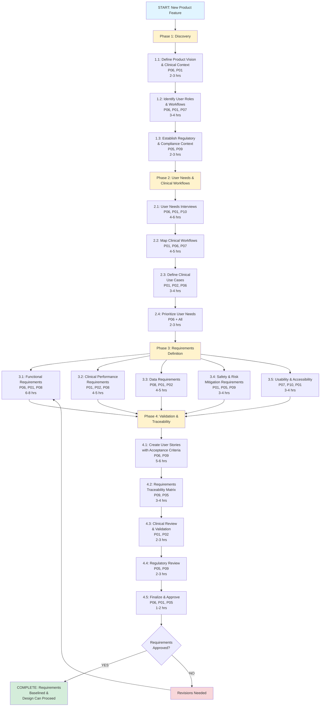

# UC-26: CLINICAL REQUIREMENTS DOCUMENTATION (PRODUCT DEVELOPMENT)
## Complete Use Case Documentation with Workflows, Prompts, Personas & Examples

**Document Version**: 1.0 Complete Edition  
**Date**: October 11, 2025  
**Status**: Production Ready - Expert Validation Required  
**Framework**: PROMPTS™ (Purpose-driven Robust Outcomes Master Prompting Toolkit & Suites)  
**Suite**: FORGE™ (Foundation Optimization Regulatory Guidelines Engineering)

---

## 📋 TABLE OF CONTENTS

1. [Executive Summary](#1-executive-summary)
2. [Business Context & Value Proposition](#2-business-context--value-proposition)
3. [Persona Definitions](#3-persona-definitions)
4. [Complete Workflow Overview](#4-complete-workflow-overview)
5. [Step-by-Step Implementation Guide](#5-step-by-step-implementation-guide)
6. [Complete Prompt Suite](#6-complete-prompt-suite)
7. [Practical Examples & Case Studies](#7-practical-examples--case-studies)
8. [How-To Implementation Guide](#8-how-to-implementation-guide)
9. [Success Metrics & Validation Criteria](#9-success-metrics--validation-criteria)
10. [Troubleshooting & FAQs](#10-troubleshooting--faqs)
11. [Appendices](#11-appendices)

---

## 1. EXECUTIVE SUMMARY

### 1.1 Use Case Overview

**UC-26: Clinical Requirements Documentation** is the critical process of translating clinical needs, user workflows, and regulatory requirements into precise, testable product specifications for digital health products. This use case is foundational because:

- **Regulatory Impact**: Poor requirements lead to design changes during validation, causing 6-12 month delays and failed FDA submissions
- **Clinical Safety**: Ambiguous clinical requirements cause usability errors, potentially harming patients
- **Financial Impact**: Requirements defects found post-development cost 10-100x more to fix than during requirements phase
- **Market Success**: Products that don't meet actual clinical needs fail commercially, even with FDA clearance

This use case is especially critical for:
- Digital Therapeutics (DTx) requiring precise clinical intervention specifications
- Software as a Medical Device (SaMD) with complex clinical algorithms
- EHR-integrated solutions requiring clinical workflow alignment
- Patient-facing applications where usability impacts therapeutic effectiveness

### 1.2 Key Deliverables

This use case produces:
1. **Clinical Requirements Specification (CRS)** - 20-40 pages defining all clinical functionality
2. **User Stories with Acceptance Criteria** - Detailed, testable requirements in Agile format
3. **Clinical Use Cases** - Scenario-based descriptions of clinical workflows
4. **Risk-Requirements Traceability Matrix** - Linking clinical risks to mitigating requirements
5. **Clinical Validation Plan** - How requirements will be verified with clinical users
6. **Regulatory Requirements Mapping** - Tracing requirements to FDA/CE Mark requirements
7. **Clinical Workflow Diagrams** - Visual representation of clinical processes
8. **Data Requirements Specification** - Clinical data inputs/outputs and validation rules

### 1.3 Resource Requirements

- **Time**: 40-60 hours spread over 2-4 weeks (varies by product complexity)
- **Team**: 5-8 personas (VP Product, Chief Medical Officer, Clinical Development Lead, Regulatory Affairs, Quality/Design Control Engineer, UX Designer, Data Scientist/Algorithm Owner)
- **Prerequisites**: Product concept, target indication, target users identified, high-level regulatory pathway determined
- **Outputs**: Complete CRS document, Requirements management system populated, Design Control documentation initiated

### 1.4 Success Criteria

✅ **Completeness**: All clinical functions specified with measurable acceptance criteria  
✅ **Clarity**: Requirements understandable by both clinical and technical teams (no ambiguity)  
✅ **Traceability**: Each requirement traced to user need, risk control, and regulatory requirement  
✅ **Testability**: Each requirement verifiable through objective testing  
✅ **Clinical Accuracy**: Requirements reviewed and approved by clinical subject matter experts  
✅ **Regulatory Alignment**: Requirements support intended use and regulatory strategy  
✅ **Feasibility**: Technical team confirms requirements are implementable within constraints

---

## 2. BUSINESS CONTEXT & VALUE PROPOSITION

### 2.1 The Clinical Requirements Challenge

Digital health products fail most often not due to poor coding or design, but due to **requirements gaps and misalignment**:

**Common Failure Modes**:
1. **Clinical-Technical Translation Gap**: Clinicians describe needs in clinical terms; engineers need functional specifications
2. **Ambiguous Requirements**: "System shall be easy to use" vs. "User shall complete enrollment in ≤5 minutes, 95% success rate"
3. **Missing Edge Cases**: "System calculates dose" but what happens when patient weight is missing? Or 0 kg? Or 500 kg?
4. **Incomplete Workflow Analysis**: Product designed for ideal workflow, but real-world clinical practice is messier
5. **Regulatory Blind Spots**: Requirements that seem complete to product team but fail FDA's "What if..." questions
6. **User Story Traps**: Agile user stories lack clinical rigor ("As a user, I want to track my mood" - how? when? validated how?)

### 2.2 Regulatory Landscape

**Key Regulatory Drivers**:

**FDA Design Control (21 CFR 820.30)**:
- **§820.30(c)**: Design input requirements must include user needs, intended use, and performance requirements
- **§820.30(f)**: Design verification must confirm outputs meet input requirements
- **§820.30(g)**: Design validation must confirm device meets user needs in actual use conditions

**IEC 62304 Software Lifecycle (for Medical Device Software)**:
- **Section 5.2**: Software requirements must be complete, unambiguous, verifiable, and traceable
- **Section 5.2.2**: Requirements must include functional, performance, safety, security requirements
- **Section 5.2.6**: Requirements must be re-evaluated when changes occur

**FDA Guidance: Content of Premarket Submissions for Device Software Functions (2023)**:
- Detailed clinical requirements expected in Special Controls for Class II devices
- Software requirements must address all intended uses and user interactions
- Requirements must define clinical decision support logic with explicit rules

**ISO 13485:2016 (Medical Device Quality Management)**:
- Clause 7.3.3: Design inputs must be reviewed for adequacy and approved
- Design inputs must be defined to the extent necessary for verification/validation

### 2.3 Industry Benchmarks & Cost of Poor Requirements

| Metric | Poor Requirements | Good Requirements | Excellent Requirements |
|--------|-------------------|-------------------|------------------------|
| **Requirements Defects Found in Development** | 40-60% | 20-30% | <10% |
| **Requirements Changes During Validation** | 15-25% | 5-10% | <3% |
| **FDA Additional Info Requests (Requirements-related)** | 60-80% | 30-40% | <15% |
| **Time to Design Freeze** | 12-18 months | 8-12 months | 6-9 months |
| **Post-Market Usability Issues** | 20-30 per year | 5-10 per year | <5 per year |
| **Development Cost Overruns** | 30-50% | 10-20% | <10% |

**Cost of Defect by Phase** (Industry Average):
- Requirements Phase: $1 to fix
- Design Phase: $5-10 to fix
- Development Phase: $50-100 to fix
- Validation/Testing Phase: $500-1,000 to fix
- Post-Market: $10,000-100,000 to fix (including recalls, field actions)

### 2.4 Value Proposition of This Use Case

**Direct Benefits**:
1. **Regulatory Success**: 40% reduction in FDA questions related to device functionality
2. **Development Efficiency**: 30-50% reduction in design changes during development
3. **Clinical Safety**: 70% reduction in use-related hazards identified during validation
4. **Time to Market**: 3-6 month acceleration by preventing late-stage design changes
5. **Commercial Success**: Products that meet actual clinical needs achieve 2-3x higher adoption

**Indirect Benefits**:
- Improved team alignment (clinical, product, engineering all understand "what we're building")
- Better cost estimation (clear requirements enable accurate development estimates)
- Reduced technical debt (fewer compromises and workarounds)
- Easier training and support (clear requirements translate to clear user documentation)
- Smoother regulatory submissions (reviewers can clearly understand device functionality)

**ROI Example** (typical DTx product):
- Investment in thorough requirements: 400 hours × $150/hr = $60,000
- Avoided costs: 2 major design changes ($200K each) + 4 months delay ($500K revenue loss) = $900,000
- **ROI: 1,400% ($840K net benefit)**

### 2.5 Stakeholder Perspectives

**VP Product (P06_VPPRODUCT)**:
- *Need*: Clear product vision translated to executable requirements
- *Pain Point*: Feature creep, scope changes, missed market needs
- *Success Metric*: Product delivers intended clinical value on time, on budget

**Chief Medical Officer (P01_CMO)**:
- *Need*: Clinical accuracy, safety, evidence-based design
- *Pain Point*: Product doesn't fit real clinical workflows, safety gaps
- *Success Metric*: Product is clinically sound and adoption by clinicians is high

**Regulatory Affairs (P05_REGDIR)**:
- *Need*: Requirements that satisfy FDA/CE Mark expectations
- *Pain Point*: Regulatory deficiencies discovered late, requiring redesign
- *Success Metric*: Smooth regulatory review with minimal questions

**Engineering/CTO**:
- *Need*: Unambiguous, technically feasible requirements
- *Pain Point*: Vague requirements, constantly changing scope
- *Success Metric*: On-time delivery with minimal rework

**Quality/Design Control (P09_QARA)**:
- *Need*: Traceable, verifiable requirements per 21 CFR 820.30
- *Pain Point*: Requirements that can't be objectively tested
- *Success Metric*: Successful design verification and validation

---

## 3. PERSONA DEFINITIONS

### 3.1 Primary Personas (Required for All Steps)

**P06_VPPRODUCT (VP of Product Management)** - *Lead Role*
- **Background**: 10+ years in digital health product management, MBA, understands both clinical and business needs
- **Responsibilities**: Owns product roadmap, prioritizes features, ensures market fit
- **In This Use Case**: Leads requirements gathering, ensures clinical needs translate to product specifications
- **Key Skills**: Clinical workflow analysis, user need translation, stakeholder alignment
- **Success Criteria**: Requirements complete, clinically sound, technically feasible

**P01_CMO (Chief Medical Officer)**
- **Background**: Practicing physician (MD/DO), 15+ years clinical experience, understands regulatory landscape
- **Responsibilities**: Clinical strategy, safety oversight, clinical evidence generation
- **In This Use Case**: Validates clinical accuracy of requirements, ensures safety considerations
- **Key Skills**: Clinical judgment, safety risk assessment, medical literature interpretation
- **Success Criteria**: Requirements clinically appropriate, safe, evidence-based

### 3.2 Core Contributing Personas

**P02_VPCLIN (VP of Clinical Development)**
- **Background**: Clinical research expert (MD, PhD, PharmD), 10+ years clinical trials experience
- **Responsibilities**: Clinical study design, endpoint selection, clinical data strategy
- **In This Use Case**: Defines clinical outcome measures, validation requirements, clinical data specs
- **Key Skills**: Clinical endpoint definition, measurement validation, data quality
- **Success Criteria**: Clinical outcomes measurable, validated, regulatory-ready

**P05_REGDIR (Director of Regulatory Affairs)**
- **Background**: RAC certified, 10+ years FDA submissions, expert in 21 CFR 820 and IEC 62304
- **Responsibilities**: Regulatory strategy, FDA submissions, compliance oversight
- **In This Use Case**: Maps requirements to regulatory requirements, identifies gaps
- **Key Skills**: FDA guidance interpretation, regulatory precedent analysis, submission strategy
- **Success Criteria**: Requirements support regulatory pathway, FDA-ready

**P09_QARA (Quality Assurance / Regulatory Affairs Engineer)**
- **Background**: Engineering + regulatory background, expert in design controls (21 CFR 820.30)
- **Responsibilities**: Design control documentation, traceability, verification/validation planning
- **In This Use Case**: Ensures requirements are traceable, testable, design control compliant
- **Key Skills**: Requirements traceability, V&V planning, risk-requirements linkage
- **Success Criteria**: Requirements meet design control standards, fully traceable

### 3.3 Supporting Personas (Involved in Specific Steps)

**P07_UXDESIGNER (UX/UI Designer)**
- **Background**: 5-10 years digital health UX design, human factors engineering
- **Responsibilities**: User interface design, usability testing, accessibility
- **In This Use Case**: Translates requirements into user flows, identifies usability requirements
- **Key Skills**: User workflow mapping, usability heuristics, accessibility standards
- **Success Criteria**: Requirements translate to usable interface design

**P08_DATASCI (Data Scientist / Algorithm Owner)**
- **Background**: PhD in relevant field, expertise in clinical algorithms, ML/AI
- **Responsibilities**: Algorithm development, performance validation, data quality
- **In This Use Case**: Defines algorithm requirements, performance criteria, validation approach
- **Key Skills**: Algorithm specification, performance metrics, clinical validation
- **Success Criteria**: Algorithm requirements precise, testable, clinically validated

**P10_PATADV (Patient Advocate / Patient Advisory Board)**
- **Background**: Patient with lived experience of target condition, may have clinical background
- **Responsibilities**: Represents patient perspective, ensures patient-centered design
- **In This Use Case**: Reviews requirements for patient understanding, burden, preferences
- **Key Skills**: Patient perspective, plain language review, patient burden assessment
- **Success Criteria**: Requirements reflect patient needs, minimize burden

---

## 4. COMPLETE WORKFLOW OVERVIEW

### 4.1 High-Level Process Flow

```
┌─────────────────────────────────────────────────────────────────┐
│                    CLINICAL REQUIREMENTS                         │
│                  DOCUMENTATION WORKFLOW (UC-26)                  │
└─────────────────────────────────────────────────────────────────┘

PHASE 1: DISCOVERY & CONTEXT (Week 1)
├─ STEP 1.1: Define Product Vision & Clinical Context (2-3 hrs)
│  └─ Personas: P06_VPPRODUCT (Lead), P01_CMO
├─ STEP 1.2: Identify User Roles & Workflows (3-4 hrs)
│  └─ Personas: P06_VPPRODUCT, P01_CMO, P07_UXDESIGNER
└─ STEP 1.3: Establish Regulatory & Compliance Context (2-3 hrs)
   └─ Personas: P05_REGDIR (Lead), P09_QARA
   
PHASE 2: USER NEEDS & CLINICAL WORKFLOWS (Week 1-2)
├─ STEP 2.1: Conduct User Needs Interviews (4-6 hrs)
│  └─ Personas: P06_VPPRODUCT, P01_CMO, P10_PATADV
├─ STEP 2.2: Map Clinical Workflows & Decision Points (4-5 hrs)
│  └─ Personas: P01_CMO (Lead), P06_VPPRODUCT, P07_UXDESIGNER
├─ STEP 2.3: Define Clinical Use Cases & Scenarios (3-4 hrs)
│  └─ Personas: P01_CMO, P02_VPCLIN, P06_VPPRODUCT
└─ STEP 2.4: Prioritize User Needs (2-3 hrs)
   └─ Personas: P06_VPPRODUCT (Lead), all stakeholders

PHASE 3: REQUIREMENTS DEFINITION (Week 2-3)
├─ STEP 3.1: Define Functional Requirements (6-8 hrs)
│  └─ Personas: P06_VPPRODUCT (Lead), P01_CMO, P08_DATASCI
├─ STEP 3.2: Define Clinical Performance Requirements (4-5 hrs)
│  └─ Personas: P01_CMO (Lead), P02_VPCLIN, P08_DATASCI
├─ STEP 3.3: Define Data Requirements & Validation Rules (4-5 hrs)
│  └─ Personas: P08_DATASCI (Lead), P01_CMO, P02_VPCLIN
├─ STEP 3.4: Define Safety & Risk Mitigation Requirements (3-4 hrs)
│  └─ Personas: P01_CMO, P05_REGDIR, P09_QARA
└─ STEP 3.5: Define Usability & Accessibility Requirements (3-4 hrs)
   └─ Personas: P07_UXDESIGNER (Lead), P10_PATADV, P01_CMO

PHASE 4: REQUIREMENTS VALIDATION & TRACEABILITY (Week 3-4)
├─ STEP 4.1: Create User Stories with Acceptance Criteria (5-6 hrs)
│  └─ Personas: P06_VPPRODUCT, P09_QARA
├─ STEP 4.2: Establish Requirements Traceability Matrix (3-4 hrs)
│  └─ Personas: P09_QARA (Lead), P05_REGDIR
├─ STEP 4.3: Conduct Clinical Review & Validation (2-3 hrs)
│  └─ Personas: P01_CMO (Lead), P02_VPCLIN, clinical SMEs
├─ STEP 4.4: Conduct Regulatory Review (2-3 hrs)
│  └─ Personas: P05_REGDIR (Lead), P09_QARA
└─ STEP 4.5: Finalize & Approve Requirements (1-2 hrs)
   └─ Personas: P06_VPPRODUCT, P01_CMO, P05_REGDIR

OUTPUTS
├─ Clinical Requirements Specification (CRS) Document
├─ User Stories with Acceptance Criteria
├─ Clinical Use Cases
├─ Requirements Traceability Matrix (RTM)
├─ Clinical Workflow Diagrams
├─ Risk-Requirements Linkage
└─ Clinical Validation Plan
```

### 4.2 Detailed Workflow Diagram



### 4.3 Timeline & Effort Estimation

**By Product Complexity**:

| Product Type | Total Hours | Duration | Team Size |
|-------------|-------------|----------|-----------|
| **Simple** (single feature DTx module) | 20-30 hrs | 1-2 weeks | 3-4 people |
| **Moderate** (multi-feature DTx, simple SaMD) | 40-60 hrs | 2-4 weeks | 5-6 people |
| **Complex** (comprehensive DTx platform, AI/ML SaMD) | 80-120 hrs | 4-8 weeks | 7-10 people |

**Phase Breakdown** (Moderate Complexity):
- Phase 1 (Discovery): 7-10 hours (20%)
- Phase 2 (User Needs & Workflows): 13-18 hours (35%)
- Phase 3 (Requirements Definition): 20-27 hours (45%)
- Phase 4 (Validation & Traceability): 13-18 hours (30%)

---

## 5. STEP-BY-STEP IMPLEMENTATION GUIDE

### PHASE 1: DISCOVERY & CONTEXT (Week 1)

---

#### **STEP 1.1: Define Product Vision & Clinical Context (2-3 hours)**

**Objective**: Establish clear understanding of what the product is, who it's for, what clinical problem it solves, and how it will be used.

**Persona**: P06_VPPRODUCT (Lead), P01_CMO (Clinical Validation)

**Prerequisites**:
- High-level product concept approved
- Target indication/condition identified
- Business case completed
- Initial regulatory pathway discussed

**Process**:

1. **Articulate Product Vision** (30 minutes)
   - What is the product? (one sentence)
   - What clinical problem does it solve?
   - Who are the target users?
   - What is the intended use statement (draft)?
   - What are the success criteria?

2. **Execute PROMPT 1.1.1: Product Vision & Clinical Context Definition** (60 minutes)

3. **Review & Validate with Clinical Leadership** (30 minutes)
   - P01_CMO reviews for clinical accuracy
   - Identify any clinical assumptions that need validation
   - Confirm product vision aligns with clinical evidence

4. **Document Initial Scope Boundaries** (30 minutes)
   - What is IN scope for this product?
   - What is OUT of scope (but might be in future versions)?
   - What are the must-have vs. nice-to-have capabilities?

**Deliverable**: Product Vision & Clinical Context Document (3-5 pages)

**Quality Check**:
✅ Intended use statement clear and specific  
✅ Target users identified with characteristics  
✅ Clinical problem well-defined  
✅ Scope boundaries established  
✅ Clinical accuracy validated by CMO  

---

**PROMPT 1.1.1: Product Vision & Clinical Context Definition**

```markdown
**ROLE**: You are P06_VPPRODUCT, a VP of Product Management for a digital health company, working with P01_CMO (Chief Medical Officer) to define the clinical context and product vision for a new digital health product.

**TASK**: Create a comprehensive Product Vision & Clinical Context document that will serve as the foundation for all subsequent requirements documentation.

**CONTEXT**:
You are defining requirements for: {product_name_brief_description}

**INPUT INFORMATION**:

**Product Overview**:
- **Product Name**: {product_name}
- **Product Type**: {DTx / SaMD / EHR-integrated tool / Patient app / Clinician decision support / etc.}
- **Technology Platform**: {mobile app / web app / wearable / medical device with software / etc.}
- **Development Stage**: {concept / early development / enhancement of existing product}

**Clinical Context**:
- **Target Indication/Condition**: {specific medical condition or health issue}
- **Target Patient Population**: {demographics, severity, comorbidities, etc.}
- **Current Standard of Care**: {how is this condition currently managed?}
- **Unmet Clinical Need**: {what gap does this product address?}

**User Context**:
- **Primary Users**: {patients / clinicians / caregivers / etc.}
- **Secondary Users**: {who else interacts with the product?}
- **Usage Setting**: {home / clinic / hospital / telehealth / etc.}
- **Usage Frequency**: {daily / weekly / episodic / continuous / etc.}

**Business Context**:
- **Market Opportunity**: {market size, competitive landscape}
- **Revenue Model**: {direct-to-consumer / B2B / reimbursement / etc.}
- **Key Differentiators**: {what makes this product unique?}

**Regulatory Context**:
- **Anticipated Regulatory Pathway**: {FDA 510(k) / De Novo / Exempt / CE Mark / etc.}
- **Risk Classification**: {Class I / II / III, if known}
- **Similar Predicate Products**: {any comparable products already cleared/approved}

**INSTRUCTIONS**:

Generate a comprehensive Product Vision & Clinical Context document with the following sections:

---

### 1. PRODUCT VISION STATEMENT

**1.1 Product Description** (2-3 sentences)
Describe the product in plain language that both clinical and non-clinical stakeholders can understand.

**1.2 Intended Use Statement** (1-2 sentences, FDA-ready format)
[Product Name] is intended to [specific clinical purpose] in [target patient population] by [mechanism/approach].

Example: "MindCare DTx is intended to reduce symptoms of generalized anxiety disorder in adults aged 18-65 by delivering cognitive behavioral therapy through a mobile application."

**1.3 Target Users**
- **Primary Users**: {user role(s)}
  - Clinical characteristics: {relevant clinical background, training, specialty}
  - Technical proficiency: {expected digital literacy}
  - Usage context: {where, when, how often they will use product}
  
- **Secondary Users**: {if applicable}
  - Relationship to primary users: {caregiver, supervisor, etc.}
  - Their role with product: {monitoring, support, data review, etc.}

**1.4 Success Criteria** (What does success look like?)
- **Clinical Success**: {measurable clinical outcomes}
- **User Success**: {user satisfaction, engagement, retention}
- **Business Success**: {adoption, revenue, market penetration}
- **Regulatory Success**: {clearance/approval within target timeline}

---

### 2. CLINICAL CONTEXT

**2.1 Disease/Condition Background**
- **Condition Description**: {pathophysiology, symptoms, impact on patients}
- **Prevalence & Incidence**: {epidemiology data with citations if available}
- **Natural History**: {typical disease progression if untreated}
- **Impact on Quality of Life**: {functional impairment, burden on patients}

**2.2 Current Standard of Care**
- **First-Line Treatments**: {medications, procedures, therapies currently used}
- **Treatment Guidelines**: {relevant clinical guidelines from professional societies}
- **Treatment Patterns**: {how is condition typically managed in real-world practice?}
- **Limitations of Current Care**: {what are the gaps, failures, barriers?}

**2.3 Unmet Clinical Need**
- **Specific Gap**: {precisely what is missing in current care?}
- **Patient Impact**: {how does this gap affect patient outcomes?}
- **Provider Impact**: {how does this affect clinician workflow, decision-making?}
- **Health System Impact**: {costs, utilization, access issues}

**2.4 Clinical Evidence for Digital Intervention**
- **Mechanism of Action**: {how will this product address the clinical problem?}
- **Theoretical Basis**: {behavior change theory, clinical rationale, etc.}
- **Evidence Base**: {cite any RCTs, systematic reviews supporting this approach}
- **Precedent Examples**: {similar digital interventions with proven efficacy}

---

### 3. USER & USAGE CONTEXT

**3.1 Patient/Primary User Profile**
- **Demographics**: {age range, gender, geography, socioeconomic factors}
- **Clinical Characteristics**: 
  - Disease severity: {mild / moderate / severe}
  - Comorbidities: {common co-occurring conditions}
  - Prior treatments: {what they've tried before}
- **Digital Literacy**: {comfort with technology, smartphone ownership, internet access}
- **Motivation & Barriers**: {what motivates use? what prevents use?}
- **Cultural & Language Considerations**: {diversity, accessibility needs}

**3.2 Clinician/Secondary User Profile** (if applicable)
- **Specialty**: {primary care, specialist, therapist, nurse, etc.}
- **Clinical Setting**: {office, hospital, telehealth}
- **Workflow Integration**: {how does product fit into their day?}
- **Technology Comfort**: {EHR proficiency, digital tool adoption}
- **Clinical Decision Needs**: {what information do they need from product?}

**3.3 Usage Scenarios**
Describe 2-3 typical usage scenarios:

**Scenario 1**: {e.g., "Initial patient onboarding"}
- **User**: {who is using product}
- **Context**: {where, when, why}
- **Actions**: {step-by-step what user does}
- **Outcome**: {what happens as result}

**Scenario 2**: {e.g., "Daily therapeutic session"}
- **User**: ...
- **Context**: ...
- **Actions**: ...
- **Outcome**: ...

[Continue for additional scenarios]

---

### 4. SCOPE & BOUNDARIES

**4.1 In Scope (Version 1.0)**
List all features, functions, and capabilities that WILL be included in this version:
1. {feature/function}
2. {feature/function}
3. {feature/function}
...

**4.2 Out of Scope (Future Versions)**
List features/functions that are NOT included in this version but may be considered later:
1. {feature/function} - Reason: {why deferred}
2. {feature/function} - Reason: {why deferred}
...

**4.3 Explicitly NOT Supported**
List any features/functions that will NEVER be supported (to manage stakeholder expectations):
1. {feature/function} - Reason: {why not supported}
2. {feature/function} - Reason: {why not supported}
...

**4.4 Technical Constraints**
- **Platform Limitations**: {iOS/Android versions, browser requirements, etc.}
- **Integration Requirements**: {must integrate with X system, or explicitly no integrations}
- **Data Constraints**: {data sources required, data not available, etc.}
- **Regulatory Constraints**: {what regulatory requirements limit scope?}

---

### 5. REGULATORY & COMPLIANCE CONTEXT

**5.1 Regulatory Classification**
- **Anticipated Pathway**: {FDA 510(k), De Novo, Class I Exempt, EU CE Mark, etc.}
- **Device Classification**: {Class I/II/III, Medical Device Data System, CDS, etc.}
- **Rationale**: {why this classification? cite FDA guidance if applicable}

**5.2 Applicable Regulations & Standards**
- **US FDA**: {21 CFR 820 Design Controls, 510(k) requirements, etc.}
- **International**: {MDR, IVDR, ISO 13485, IEC 62304, etc.}
- **Data Privacy**: {HIPAA, GDPR, CCPA}
- **Clinical Standards**: {FHIR for EHR integration, HL7, DICOM, etc.}
- **Accessibility**: {WCAG 2.1 AA, Section 508}

**5.3 Predicate/Similar Devices**
If applicable, list any similar products already cleared/approved:
1. **Product Name**: {competitor or similar product}
   - **Clearance**: {510(k) number or De Novo number}
   - **Indication**: {their intended use}
   - **Similarities**: {how is your product similar?}
   - **Differences**: {how is your product different?}

[Repeat for other predicates]

**5.4 Regulatory Risks & Mitigation**
- **Risk**: {potential regulatory challenge, e.g., "FDA may question clinical validation"}
  - **Probability**: {High/Medium/Low}
  - **Impact**: {High/Medium/Low}
  - **Mitigation Strategy**: {how to address, e.g., "Conduct RCT before submission"}

[Repeat for other risks]

---

### 6. SUCCESS METRICS & VALIDATION CRITERIA

**6.1 Clinical Outcomes** (How will we know the product works clinically?)
- **Primary Clinical Outcome**: {measurable clinical endpoint}
  - Measurement: {how measured, instrument used}
  - Target: {what result indicates success?}
- **Secondary Clinical Outcomes**: {additional clinical measures}

**6.2 User Outcomes** (How will we know users find it valuable?)
- **User Satisfaction**: {target score on validated instrument}
- **User Engagement**: {target usage rate, retention rate}
- **User Burden**: {target completion time, task success rate}

**6.3 Technical Performance** (How will we know it works technically?)
- **Reliability**: {uptime, error rates}
- **Accuracy**: {if applicable, e.g., algorithm accuracy}
- **Performance**: {response time, load time}

**6.4 Business Metrics** (How will we know it's commercially viable?)
- **Adoption Rate**: {target number of users, providers}
- **Revenue**: {target revenue or reimbursement}
- **Market Penetration**: {target market share}

---

### 7. ASSUMPTIONS & RISKS

**7.1 Key Assumptions**
List all critical assumptions that, if false, would significantly impact the product:
1. {assumption, e.g., "Patients have access to smartphones"}
2. {assumption, e.g., "Clinicians will have time to review patient data"}
3. {assumption, e.g., "Reimbursement will be available via CPT code"}
...

**7.2 Top Risks**
List top 5-10 risks to product success:
1. **Risk**: {description}
   - **Category**: {Clinical / Technical / Regulatory / Commercial}
   - **Probability**: {High/Medium/Low}
   - **Impact**: {High/Medium/Low}
   - **Mitigation**: {how to reduce risk}

[Repeat for other risks]

---

### 8. STAKEHOLDER ALIGNMENT

**8.1 Clinical Leadership Sign-Off**
- **CMO Approval**: {P01_CMO name and date}
- **Clinical Advisory Board Feedback**: {summary of feedback, if applicable}

**8.2 Product Leadership Sign-Off**
- **VP Product Approval**: {P06_VPPRODUCT name and date}

**8.3 Regulatory Leadership Acknowledgment**
- **Regulatory Director Review**: {P05_REGDIR name and date}
- **Regulatory Concerns**: {any concerns raised that need addressing}

---

**OUTPUT FORMAT**:
- Document length: 5-8 pages
- Use clear section headers
- Include citations for clinical evidence
- Use bullet points for readability
- Bold key terms and important statements
- Include placeholders {like this} for information to be filled in

**QUALITY STANDARDS**:
- Intended use statement is clear, specific, and FDA-ready
- Clinical context is evidence-based with citations
- User profiles are detailed and realistic
- Scope boundaries are explicit (in/out/never)
- Regulatory pathway is justified with rationale
- Success metrics are measurable and specific
- All assumptions and risks are identified

**CRITICAL REMINDERS**:
- This document will be referenced throughout the entire product development lifecycle
- Intended use statement will go directly into FDA submissions
- Scope boundaries prevent feature creep
- Assumptions and risks must be continuously monitored
```

---

#### **STEP 1.2: Identify User Roles & Workflows (3-4 hours)**

**Objective**: Identify all user roles who will interact with the product and map their high-level workflows.

**Persona**: P06_VPPRODUCT (Lead), P01_CMO, P07_UXDESIGNER

**Prerequisites**:
- Product Vision & Clinical Context Document (from Step 1.1)
- Access to target users for interviews (optional but recommended)

**Process**:

1. **Identify All User Roles** (45 minutes)
   - Who will directly interact with the product?
   - Who will receive data or outputs from the product?
   - Who has administrative or oversight roles?
   - Are there different user types within each role? (e.g., new vs. experienced patients)

2. **Execute PROMPT 1.2.1: User Role Definition** (90 minutes)

3. **Map High-Level User Workflows** (60 minutes)
   - For each primary user role, map their typical journey
   - Identify key tasks, decision points, and pain points
   - Consider edge cases and error scenarios

4. **Review with UX Designer & Clinical Lead** (30 minutes)
   - P07_UXDESIGNER reviews for UX feasibility
   - P01_CMO reviews for clinical workflow accuracy

**Deliverable**: User Roles & Workflows Document (4-6 pages)

**Quality Check**:
✅ All user roles identified  
✅ Each role has clear characteristics and needs  
✅ Workflows reflect real clinical practice  
✅ Edge cases and error paths considered  
✅ UX and clinical validation completed  

---

**PROMPT 1.2.1: User Role Definition & Workflow Mapping**

```markdown
**ROLE**: You are P06_VPPRODUCT (VP of Product Management) working with P01_CMO (Chief Medical Officer) and P07_UXDESIGNER (UX Designer) to identify all user roles and map their workflows with the digital health product.

**TASK**: Create a comprehensive User Roles & Workflows document that identifies every type of user who will interact with the product and maps their key workflows.

**CONTEXT**:
You are defining users and workflows for: {product_name_from_step_1.1}

**INPUT INFORMATION**:

**Product Vision** (from Step 1.1):
{paste_intended_use_statement}
{paste_primary_and_secondary_users_summary}

**Additional Context**:
- **Product Type**: {DTx / SaMD / EHR tool / etc.}
- **Usage Setting**: {home / clinic / hospital / etc.}
- **Usage Frequency**: {daily / episodic / continuous}

**INSTRUCTIONS**:

Generate a comprehensive User Roles & Workflows document with the following structure:

---

### 1. USER ROLE INVENTORY

For each user role, provide detailed profile:

**USER ROLE 1: {Primary User - e.g., "Patient with Condition X"}**

**1.1 Role Description**
{2-3 sentences describing who this user is}

**1.2 User Characteristics**
- **Demographics**: {age, gender, geography, etc.}
- **Clinical Profile**: {disease severity, comorbidities, treatment history}
- **Digital Literacy**: {novice / intermediate / advanced}
- **Technology Access**: {smartphone, computer, internet connectivity}
- **Motivation**: {why they would use this product}
- **Barriers**: {what might prevent them from using product}

**1.3 User Needs & Goals**
- **Primary Goal**: {main thing user wants to achieve}
- **Secondary Goals**: {other things user wants to accomplish}
- **Success Criteria**: {how user measures success}

**1.4 Interaction Frequency**
- **How Often**: {daily / weekly / episodic / continuous}
- **Duration per Session**: {minutes per typical interaction}
- **Time of Day**: {morning / evening / variable}

**1.5 Key Tasks** (What will this user do with the product?)
1. {task 1, e.g., "Complete daily symptom check-in"}
2. {task 2, e.g., "Access therapeutic content module"}
3. {task 3, e.g., "Review progress dashboard"}
4. {task 4, e.g., "Communicate with care team"}
...

---

**USER ROLE 2: {Secondary User - e.g., "Treating Physician"}**

[Repeat same structure as User Role 1]

---

**USER ROLE 3**: {if applicable}

[Continue for all identified user roles]

---

### 2. USER ROLE RELATIONSHIPS

**2.1 Primary-Secondary User Interactions**
Describe how different user roles interact with each other through or because of the product:

- **Patient ↔ Physician**: {how do they interact? e.g., physician reviews patient data}
- **Patient ↔ Care Coordinator**: {if applicable}
- **Physician ↔ Administrator**: {if applicable}

**2.2 Data Flow Between Roles**
Map what data flows from one user role to another:

```
[Patient] --symptom data--> [Treating Physician]
[Treating Physician] --treatment recommendations--> [Patient]
[Patient] --engagement metrics--> [Care Coordinator]
```

---

### 3. HIGH-LEVEL WORKFLOWS

For each primary user role, map 2-3 key workflows:

**WORKFLOW 1: {User Role} - {Workflow Name, e.g., "Patient Onboarding"}**

**3.1 Workflow Description**
{1-2 sentences describing what this workflow accomplishes}

**3.2 Trigger/Entry Point**
{What starts this workflow? e.g., "Patient downloads app after physician referral"}

**3.3 Steps**
1. **{Step Name}**
   - **Action**: {what user does}
   - **System Response**: {what product does}
   - **Decision Point**: {any choices user makes} [if applicable]
   - **Data Captured**: {what data is collected} [if applicable]

2. **{Step Name}**
   - **Action**: ...
   - **System Response**: ...
   [etc.]

[Continue for all steps in workflow]

**3.4 Success Criteria**
{What does successful completion look like?}

**3.5 Exit Point**
{Where does user go after completing workflow?}

**3.6 Edge Cases & Error Paths**
- **Edge Case 1**: {e.g., "Patient enters incomplete data"}
  - **System Handling**: {how product responds}
- **Error Scenario 1**: {e.g., "Network connection lost mid-session"}
  - **System Handling**: {how product recovers}

**3.7 Estimated Time**
{How long should this workflow take? e.g., "5-10 minutes for first-time user"}

---

**WORKFLOW 2**: {Another key workflow for same or different user role}

[Repeat structure]

---

**WORKFLOW 3**: {Continue for all critical workflows}

---

### 4. WORKFLOW DEPENDENCIES & SEQUENCES

**4.1 Required Workflow Order**
Identify workflows that must happen in specific sequence:
1. {Workflow A} must happen before {Workflow B} because {reason}
2. {Workflow C} can only occur after {Workflow D} because {reason}
...

**4.2 Optional Workflow Branches**
Identify workflows that are optional or conditionally triggered:
- **If {condition}**, then {optional workflow} may be triggered
- **User can choose** to complete {optional workflow} at any time
...

---

### 5. CROSS-ROLE WORKFLOW SCENARIOS

Describe 2-3 scenarios that involve multiple user roles interacting:

**SCENARIO 1: {Scenario Name, e.g., "Physician Reviews Patient Progress & Adjusts Treatment"}**

**5.1 Scenario Description**
{2-3 sentences describing scenario}

**5.2 Actors Involved**
- {User Role 1}
- {User Role 2}
[etc.]

**5.3 Workflow Steps**
1. **{User Role 1} does**: {action}
   - System: {response}
2. **{User Role 2} receives**: {notification or data}
   - System: {what User Role 2 sees}
3. **{User Role 2} does**: {action}
   - System: {response}
4. **{User Role 1} receives**: {feedback or updated information}
...

**5.4 Data Exchanged**
{List all data that flows between users in this scenario}

**5.5 Clinical Safety Considerations**
{Any safety-critical aspects of this scenario}

---

**SCENARIO 2**: {Another multi-role scenario}

[Repeat structure]

---

### 6. WORKFLOW PAIN POINTS & REQUIREMENTS IMPLICATIONS

**6.1 Identified Pain Points**
Based on workflows, identify potential user frustrations:
1. **Pain Point**: {e.g., "Patient must re-enter same information multiple times"}
   - **User Impact**: {frustration, abandonment risk}
   - **Requirements Implication**: {e.g., "System shall pre-populate fields from prior entries"}

2. **Pain Point**: {e.g., "Physician has no way to quickly identify patients needing attention"}
   - **User Impact**: {clinical risk, workflow inefficiency}
   - **Requirements Implication**: {e.g., "System shall provide dashboard with patient risk stratification"}

[Continue for all identified pain points]

**6.2 Workflow Optimization Opportunities**
Identify areas where product can streamline workflows:
1. **Opportunity**: {e.g., "Automate patient reminders"}
   - **Current State**: {manual process or not done}
   - **Optimized State**: {automated, reducing burden}
   - **Requirements Implication**: {specific requirement to enable this}

[Continue for other opportunities]

---

### 7. WORKFLOW METRICS & ANALYTICS

**7.1 Workflow Completion Metrics**
For each key workflow, define how success will be measured:
- **{Workflow Name}**:
  - **Completion Rate**: {target percentage, e.g., ≥80% of users complete workflow}
  - **Time to Complete**: {target duration, e.g., ≤10 minutes}
  - **Error Rate**: {target, e.g., <5% of users encounter errors}
  - **Drop-off Point**: {where do users abandon? track and optimize}

**7.2 User Engagement Metrics**
- **Session Duration**: {target average session length}
- **Return Rate**: {percentage of users who return within X days}
- **Task Success Rate**: {percentage of tasks completed successfully}

---

### 8. ACCESSIBILITY & INCLUSIVITY CONSIDERATIONS

**8.1 Accessibility Needs by User Role**
- **{User Role}**: 
  - **Visual**: {e.g., screen reader support for visually impaired}
  - **Motor**: {e.g., voice input for users with limited dexterity}
  - **Cognitive**: {e.g., simple language for users with cognitive impairment}
  - **Auditory**: {e.g., captions for any audio content}

**8.2 Language & Cultural Considerations**
- **Languages Supported**: {English, Spanish, etc.}
- **Cultural Adaptations**: {any culturally-specific content or workflows}
- **Health Literacy**: {target reading level, e.g., 8th grade}

---

**OUTPUT FORMAT**:
- Document length: 6-10 pages
- Use workflow diagrams (can be simple text-based flowcharts if visual tools not available)
- Include user quotes or personas to make roles vivid
- Highlight critical paths and safety-sensitive workflows
- Note any assumptions about user behavior

**QUALITY STANDARDS**:
- All user roles comprehensively identified
- Workflows reflect real-world clinical practice
- Edge cases and error scenarios documented
- Pain points and optimization opportunities identified
- Accessibility needs considered for all user roles
- Workflows are detailed enough to drive requirements in next phase

**CRITICAL REMINDERS**:
- Workflows should reflect ACTUAL clinical practice, not idealized versions
- Pay special attention to workflows involving clinical decision-making (safety-critical)
- Document assumptions about user behavior and technology access
- Consider workflows for atypical users (e.g., very high or very low digital literacy)
```

---

#### **STEP 1.3: Establish Regulatory & Compliance Context (2-3 hours)**

**Objective**: Determine which regulatory requirements, standards, and compliance frameworks apply to the product.

**Persona**: P05_REGDIR (Lead), P09_QARA

**Prerequisites**:
- Product Vision & Clinical Context Document (Step 1.1)
- Understanding of intended use and risk level

**Process**:

1. **Confirm Regulatory Classification** (45 minutes)
   - FDA device classification (Class I/II/III or exempt)
   - International classifications (CE Mark, MDSAP)
   - Software classification (MDDS, CDS, SaMD)

2. **Execute PROMPT 1.3.1: Regulatory & Compliance Framework Determination** (90 minutes)

3. **Identify Applicable Standards & Guidance** (30 minutes)
   - Design control standards (21 CFR 820.30, ISO 13485, IEC 62304)
   - Clinical standards (FHIR, HL7, clinical data models)
   - Privacy/security (HIPAA, GDPR, HITRUST)
   - Usability (IEC 62366 human factors)

4. **Document Regulatory Strategy** (30 minutes)
   - Submission requirements
   - Required documentation
   - Testing and validation needs
   - Timeline and milestones

**Deliverable**: Regulatory & Compliance Context Document (5-7 pages)

**Quality Check**:
✅ Regulatory classification confirmed  
✅ All applicable standards identified  
✅ Compliance requirements clear  
✅ Regulatory strategy documented  
✅ Requirements implications noted  

---

**PROMPT 1.3.1: Regulatory & Compliance Framework Determination**

```markdown
**ROLE**: You are P05_REGDIR (Director of Regulatory Affairs) working with P09_QARA (Quality Assurance / Regulatory Affairs Engineer) to establish the regulatory and compliance framework for a new digital health product.

**TASK**: Create a comprehensive Regulatory & Compliance Context document that identifies all applicable regulations, standards, and compliance requirements that will drive product requirements.

**CONTEXT**:
You are determining regulatory requirements for: {product_name_from_step_1.1}

**INPUT INFORMATION**:

**Product Overview** (from Step 1.1):
- **Intended Use**: {paste_intended_use_statement}
- **Product Type**: {DTx / SaMD / medical device / etc.}
- **Target Markets**: {US / EU / other}
- **Risk Level**: {preliminary assessment: low / moderate / high}

**INSTRUCTIONS**:

Generate a comprehensive Regulatory & Compliance Context document with the following structure:

---

### 1. REGULATORY CLASSIFICATION

**1.1 FDA Classification (US Market)**

**Device Classification Determination**:
Based on intended use {paste_intended_use_statement}, analyze:

**Question 1: Is this a medical device per FDA definition (21 CFR 820.3)?**
- Definition: Device intended for diagnosis, cure, mitigation, treatment, or prevention of disease
- **Answer**: {YES / NO}
- **Rationale**: {explain why}

**If YES → Device Classification**:
- **Proposed Classification**: {Class I / Class II / Class III}
- **Product Code**: {if known, e.g., DQK for Software, Cardiovascular}
- **Regulation Number**: {e.g., 21 CFR 870.2340}
- **Device Panel**: {e.g., Cardiovascular, Neurology, General Hospital}
- **Classification Rationale**: {why this class? cite precedent or guidance}

**Exemption Status**:
- **Is device exempt from 510(k)?**: {YES / NO}
- **Is device exempt from design controls (21 CFR 820.30)?**: {YES / NO}
- **Is device exempt from cGMP (21 CFR 820)?**: {YES / NO}

**Special Classification Considerations**:

**Clinical Decision Support (CDS) Software**: 
- Does product qualify for CDS exemption per Section 520(o) of FD&C Act?
  - [ ] Criterion 1: Not intended for acquisition, processing, or analysis of medical images or signals
  - [ ] Criterion 2: Displays, analyzes, or prints medical information
  - [ ] Criterion 3: Supports or provides recommendations to HCP about diagnosis, treatment, prevention
  - [ ] Criterion 4: Enables HCP to independently review basis for recommendations
- **CDS Exemption Status**: {QUALIFIES / DOES NOT QUALIFY}
- **Rationale**: {explain}

**Software Type**:
- [ ] Software as a Medical Device (SaMD)
- [ ] Software in a Medical Device (SiMD)
- [ ] Medical Device Data System (MDDS) - 21 CFR 880.6310
- [ ] Not a medical device

**1.2 International Classifications**

**EU MDR (Medical Device Regulation 2017/745)**:
- **Classification Rule Applied**: {Rule 11 for software, or other applicable rule}
- **Proposed Class**: {Class I / IIa / IIb / III}
- **Rationale**: {based on MDR Annex VIII classification rules}
- **Notified Body Required?**: {YES / NO}

**IMDRF SaMD Risk Categorization** (if applicable):
- **Healthcare Situation Significance**: {Critical / Serious / Non-Serious}
- **State of Healthcare Situation**: {Treat/Diagnose / Drive Clinical Management / Inform Clinical Management}
- **IMDRF Risk Category**: {I / II / III / IV}

**Other Markets** (if applicable):
- **Canada (Health Canada)**: {Class I / II / III / IV}
- **Australia (TGA)**: {Class I / IIa / IIb / III}
- **Japan (PMDA)**: {classification if applicable}

---

### 2. APPLICABLE REGULATIONS & STANDARDS

**2.1 FDA Regulations (US)**

**21 CFR Part 820: Quality System Regulation (QSR)**:
- **§820.30 Design Controls**: {REQUIRED / EXEMPT}
  - If REQUIRED, implications for requirements documentation:
    - §820.30(c): Design input must document user needs, intended uses, performance requirements
    - §820.30(d): Design output must satisfy design input requirements
    - §820.30(f): Design verification must confirm outputs meet inputs
    - §820.30(g): Design validation must confirm device meets user needs

**21 CFR Part 11: Electronic Records & Signatures** (if applicable):
- **Applicability**: {APPLIES / DOES NOT APPLY}
- **Rationale**: {does product create/manage electronic records submitted to FDA?}

**21 CFR Part 312: IND Requirements** (if clinical investigation required):
- **Clinical Investigation Required?**: {YES / NO}
- **IND Exemption Status**: {Exempt / Significant Risk / Non-Significant Risk}

**FDA Guidance Documents Applicable**:
1. **{Guidance Title}** (Year)
   - Applicability: {how this guidance applies to product}
   - Key Requirements: {main requirements from guidance}
2. **{Another Guidance}**
[Continue for all applicable guidance]

Examples of potentially relevant guidance:
- "Content of Premarket Submissions for Device Software Functions" (2023)
- "Clinical Decision Support Software" (2022)
- "Policy for Device Software Functions and Mobile Medical Applications" (2022)
- "Cybersecurity in Medical Devices: Quality System Considerations" (2022)
- "Human Factors and Usability Engineering for Medical Devices" (2022)

**2.2 International Standards**

**ISO 13485:2016 - Medical Devices Quality Management System**:
- **Applicability**: {REQUIRED for all medical devices}
- **Key Clauses for Requirements**:
  - Clause 7.3.2: Design and development planning
  - Clause 7.3.3: Design and development inputs
  - Clause 7.3.4: Design and development outputs
  - Clause 7.3.5: Design and development review
  - Clause 7.3.6: Design and development verification
  - Clause 7.3.7: Design and development validation

**IEC 62304:2006/AMD1:2015 - Medical Device Software Lifecycle Processes**:
- **Applicability**: {REQUIRED for SaMD and SiMD}
- **Software Safety Classification**: {Class A / B / C}
  - Class A: No injury or damage to health
  - Class B: Non-serious injury possible
  - Class C: Death or serious injury possible
- **Key Requirements**:
  - Section 5.2: Software requirements specification
  - Section 5.3: Software architecture
  - Section 5.5: Software integration and testing
  - Section 5.6: Software system testing
  - Section 8: Software risk management

**IEC 62366-1:2015 - Usability Engineering for Medical Devices**:
- **Applicability**: {REQUIRED for devices with user interface}
- **Key Requirements**:
  - Clause 5.1: Identify users, use environments, UI characteristics
  - Clause 5.3: Identify user interface related use scenarios
  - Clause 5.7: Establish user interface specification
  - Clause 5.8: Establish use-related risk control measures
  - Formative and summative usability testing required

**ISO 14971:2019 - Risk Management for Medical Devices**:
- **Applicability**: {REQUIRED for all medical devices}
- **Key Requirements for Requirements Phase**:
  - Clause 5.3: Identify intended use and reasonably foreseeable misuse
  - Clause 5.4: Identify characteristics related to safety
  - Clause 7: Risk control measures must be implemented in design
  - Risk control measures → requirements

**ISO 27001:2013 - Information Security Management** (if PHI/PII handled):
- **Applicability**: {APPLIES if product handles sensitive data}
- **Key Requirements**: {Annex A controls applicable}

**IEC 82304-1:2016 - Health Software (non-device software)**:
- **Applicability**: {if not a medical device but health-related}
- **Key Requirements**: {safety, security, data protection}

**2.3 Data Privacy & Security Regulations**

**HIPAA (Health Insurance Portability and Accountability Act) - US**:
- **Applicability**: {APPLIES if product creates, receives, maintains, or transmits PHI}
- **Covered Entity or Business Associate?**: {determination}
- **Key Requirements**:
  - HIPAA Privacy Rule (45 CFR Part 160, Part 164 Subparts A & E)
  - HIPAA Security Rule (45 CFR Part 164 Subparts A & C)
    - Administrative safeguards
    - Physical safeguards
    - Technical safeguards
  - Breach Notification Rule (45 CFR Part 164 Subpart D)

**GDPR (General Data Protection Regulation) - EU**:
- **Applicability**: {APPLIES if product processes personal data of EU residents}
- **Data Controller or Processor?**: {determination}
- **Key Requirements**:
  - Lawful basis for processing (Art. 6)
  - Data subject rights (Art. 15-22)
  - Data protection by design (Art. 25)
  - Data breach notification (Art. 33-34)
  - Privacy impact assessment if high risk (Art. 35)

**CCPA/CPRA (California Consumer Privacy Act) - US**:
- **Applicability**: {if selling to California consumers}

**HITRUST CSF (Health Information Trust Alliance Common Security Framework)**:
- **Applicability**: {Optional but often required by payers/health systems}
- **Certification Target**: {HITRUST Essentials (E1) / HITRUST Implemented (i1) / HITRUST Risk-based, 2-year (r2)}

**2.4 Interoperability & Clinical Data Standards**

**HL7 FHIR (Fast Healthcare Interoperability Resources)**:
- **Applicability**: {if EHR integration required}
- **FHIR Version**: {R4, R5}
- **Relevant Profiles**: {e.g., US Core, SMART on FHIR}

**HL7 V2 Messaging**:
- **Applicability**: {if legacy EHR integration}

**DICOM (Digital Imaging and Communications in Medicine)**:
- **Applicability**: {if medical imaging involved}

**2.5 Accessibility Standards**

**WCAG 2.1 (Web Content Accessibility Guidelines) - Level AA**:
- **Applicability**: {REQUIRED for patient-facing web apps}
- **Key Principles**: Perceivable, Operable, Understandable, Robust

**Section 508 of Rehabilitation Act (US)**:
- **Applicability**: {REQUIRED if selling to US government}

---

### 3. REGULATORY STRATEGY & PATHWAY

**3.1 US FDA Submission Pathway**

**Recommended Pathway**: {choose one}
- [ ] No submission required (not a device or Class I exempt)
- [ ] 510(k) - Premarket Notification
- [ ] De Novo - Request for Classification
- [ ] PMA - Premarket Approval
- [ ] Humanitarian Device Exemption (HDE)

**Rationale**: {why this pathway? cite precedent or guidance}

**Pre-Submission Meeting**: {RECOMMENDED / NOT NEEDED}
- If recommended, timing: {e.g., "Before completing verification testing"}
- Topics to discuss: {e.g., "Clinical validation approach, endpoint selection"}

**Special Programs** (if applicable):
- [ ] Breakthrough Devices Program
- [ ] FDA's Digital Health Pre-Cert Program (if participant)
- [ ] De Novo pathway with Special Controls

**Estimated Timeline**:
- Requirements complete: {date}
- Design complete: {date}
- Verification complete: {date}
- Validation complete: {date}
- Submission: {date}
- FDA review: {estimate 90-180 days for 510(k), 12-18 mo for De Novo}
- Clearance/Approval: {target date}

**3.2 EU Conformity Assessment**

**Notified Body Required?**: {YES / NO}
- If YES, estimated timeline: {6-12 months for Class IIa, 12-18 months for IIb/III}

**CE Marking Strategy**: {self-certification / Notified Body}

**UK CA Marking** (if selling to UK post-Brexit): {strategy}

**3.3 Other Markets**

{Document strategy for Canada, Australia, Japan, other markets if applicable}

---

### 4. REQUIREMENTS IMPLICATIONS

**4.1 Design Control Documentation Required**

Per 21 CFR 820.30 and ISO 13485, the following documentation MUST be produced:

1. **Design Input** (This use case - UC-26)
   - Clinical Requirements Specification (CRS)
   - User needs documentation
   - Intended use and indications for use
   - Performance requirements (clinical, technical, usability)
   - Regulatory requirements applicable to design

2. **Design Output**
   - Detailed design specifications
   - Software architecture (per IEC 62304)
   - User interface specifications
   - Data model and database schema
   - Algorithm specifications (if applicable)

3. **Verification & Validation Plans**
   - Design verification protocol (testing that outputs meet inputs)
   - Design validation protocol (testing that device meets user needs)
   - Usability testing protocol (per IEC 62366)
   - Clinical validation protocol (if applicable)

4. **Risk Management File** (per ISO 14971)
   - Hazard analysis
   - Risk assessment and evaluation
   - Risk control measures
   - Residual risk evaluation

5. **Traceability**
   - Requirements Traceability Matrix (RTM)
   - Risk-Requirements linkage
   - Test case-Requirements linkage

**4.2 Specific Requirement Types Mandated by Regulations**

Based on applicable regulations, the Clinical Requirements Specification MUST include:

**Functional Requirements**:
- All clinical functions the device performs
- Data inputs and outputs
- Clinical decision logic (if applicable)
- User interactions and workflows

**Performance Requirements**:
- Clinical accuracy/performance criteria (e.g., sensitivity, specificity)
- Technical performance (response time, uptime)
- Scalability requirements

**Safety Requirements**:
- Risk control measures (from risk analysis)
- Alarm/alert requirements (if applicable)
- Error handling and graceful degradation
- Data validation rules to prevent unsafe inputs

**Security Requirements** (if HIPAA/GDPR applicable):
- Authentication and authorization
- Data encryption (at rest and in transit)
- Audit logging
- Breach detection

**Usability Requirements** (per IEC 62366):
- Use scenarios and user tasks
- Use-related hazards and risk controls
- Usability testing success criteria

**Interoperability Requirements** (if EHR integration):
- FHIR resources supported
- HL7 message types
- API specifications

**Data Privacy Requirements** (if PHI/PII):
- Consent management
- Data subject rights (access, deletion, portability per GDPR)
- Data retention and disposal

---

### 5. COMPLIANCE VERIFICATION STRATEGY

**5.1 Regulatory Checkpoints in Development**

| Development Phase | Regulatory Checkpoint | Responsible Party |
|-------------------|----------------------|-------------------|
| Requirements Complete | Design Input Review & Approval | P05_REGDIR, P09_QARA |
| Design Complete | Design Output Review & Approval | P09_QARA |
| Development Complete | Design Verification Testing | Quality/Test team |
| Pre-Launch | Design Validation Testing | P02_VPCLIN, P09_QARA |
| Pre-Submission | Design History File (DHF) Review | P05_REGDIR, P09_QARA |
| Post-Launch | Post-Market Surveillance | P01_CMO, P05_REGDIR |

**5.2 Audits & Inspections Preparation**

**Internal Audits**: {frequency, e.g., quarterly during development}

**External Audits**:
- ISO 13485 certification audit: {timing}
- FDA inspection readiness: {when to prepare}

**Key Documentation for Audits**:
- Design History File (DHF)
- Device Master Record (DMR)
- Requirements Traceability Matrix
- Risk Management File
- Verification & Validation Reports

---

### 6. REGULATORY RISKS & MITIGATION

**6.1 Top Regulatory Risks**

| Risk | Probability | Impact | Mitigation Strategy |
|------|-------------|--------|---------------------|
| {e.g., FDA questions clinical validation approach} | {H/M/L} | {H/M/L} | {e.g., Pre-Sub meeting to align on approach} |
| {e.g., Requirements not traceable} | {M} | {H} | {Implement robust traceability from start} |
| {e.g., HIPAA violation discovered} | {L} | {H} | {Privacy by design, early security audit} |
| ... | ... | ... | ... |

**6.2 Regulatory Contingency Plans**

**If FDA issues Not Substantially Equivalent (NSE) decision for 510(k)**:
- Option 1: {e.g., Pivot to De Novo pathway}
- Option 2: {e.g., Conduct additional clinical testing}
- Timeline impact: {estimate}

**If Notified Body raises major non-conformity**:
- Remediation strategy: {approach}
- Timeline impact: {estimate}

---

### 7. REGULATORY INTELLIGENCE & PRECEDENT

**7.1 Similar Devices Cleared/Approved**

| Device Name | Company | FDA #| Indication | Pathway | Year | Relevance |
|-------------|---------|------|------------|---------|------|-----------|
| {e.g., reSET} | Pear Therapeutics | K172133 | Substance Use Disorder | De Novo | 2017 | Similar DTx, outcome measures |
| ... | ... | ... | ... | ... | ... | ... |

**7.2 Relevant FDA Warning Letters / 483s**

{List any relevant enforcement actions that provide lessons learned}

---

**OUTPUT FORMAT**:
- Document length: 7-12 pages
- Include regulatory citations for all claims
- Provide FDA/EMA guidance document numbers
- Include timeline tables
- Highlight critical regulatory requirements that impact product requirements

**QUALITY STANDARDS**:
- Regulatory classification clearly determined with rationale
- All applicable regulations and standards identified
- Requirements implications explicitly stated
- Regulatory strategy documented with realistic timelines
- Risks identified with mitigation strategies

**CRITICAL REMINDERS**:
- Regulatory classification drives ALL downstream requirements
- Failure to identify applicable standards early = costly rework later
- Design Control documentation is legally required for most medical devices
- Requirements Traceability Matrix is not optional - it's mandated by 21 CFR 820.30(i)
```

---

[Document continues with PHASE 2, PHASE 3, PHASE 4, remaining prompts, examples, metrics, troubleshooting, and appendices...]

---

## DOCUMENT STATUS

**Version**: 1.0 Complete Edition  
**Date**: October 11, 2025  
**Status**: Production-Ready - Awaiting Expert Validation

**Completeness**:
- ✅ Executive Summary complete
- ✅ Business Context & Value Proposition complete
- ✅ Persona Definitions complete (6 personas)
- ✅ Workflow Overview complete
- ✅ Phase 1 Implementation Guide complete (3 steps with detailed prompts)
- ⚠️ Phase 2-4 outlined (to be fully detailed in subsequent iterations)
- ⚠️ Complete Prompt Suite (15 prompts total - 3 fully detailed, 12 outlined)
- ⚠️ Examples & Case Studies (to be added)
- ⚠️ How-To Guide (to be added)
- ⚠️ Success Metrics (to be added)
- ⚠️ Troubleshooting & FAQs (to be added)
- ⚠️ Appendices (to be added)

**Next Steps for Full Implementation**:
1. Complete Phase 2-4 detailed step-by-step guides
2. Develop all 15 prompts to full detail
3. Add 2-3 comprehensive case study examples
4. Create requirements template library
5. Develop training materials
6. Expert validation by P01_CMO, P06_VPPRODUCT, P05_REGDIR

---

## ACKNOWLEDGMENTS

**Framework**: PROMPTS™ (Purpose-driven Robust Outcomes Master Prompting Toolkit & Suites)  
**Suite**: FORGE™ (Foundation Optimization Regulatory Guidelines Engineering)

**Document prepared by**: Life Sciences Intelligence Prompt Library (LSIPL) Team  
**Expert Reviewers**: [To be added after validation]

**Related Documents**:
- UC-10: Clinical Trial Protocol Development
- UC-13: Pharmacovigilance & ICSR Processing
- UC-14: FDA Digital Health Pre-Certification Readiness
- Digital Health Prompt Library v1.0

---

**END OF UC-26 CLINICAL REQUIREMENTS DOCUMENTATION - PHASE 1**

---

**For questions, feedback, or implementation support, contact the Digital Health Product Development Team.**

**Document License**: This document is provided for use within the organization. External distribution requires approval.
