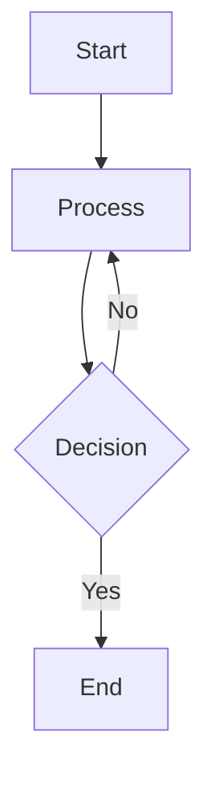
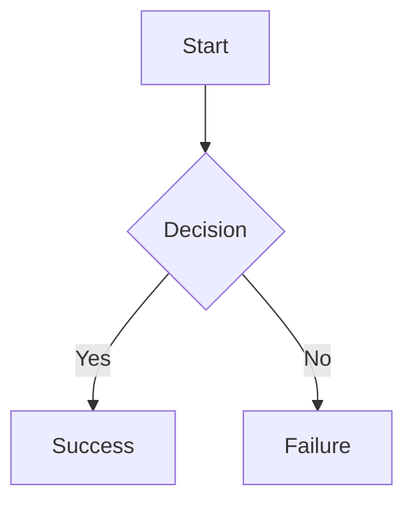
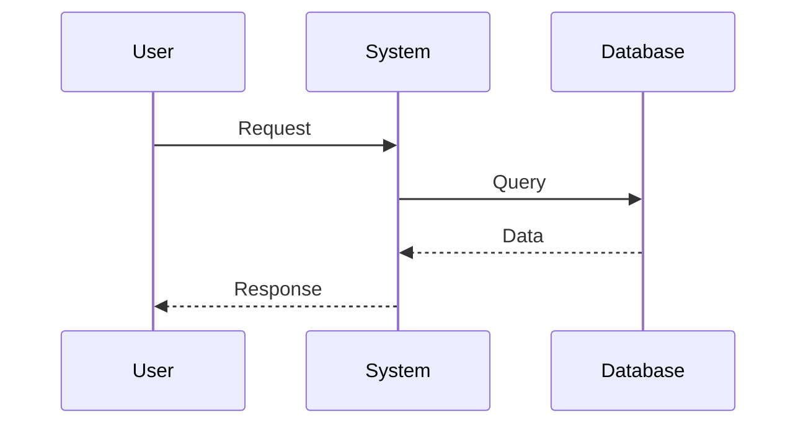
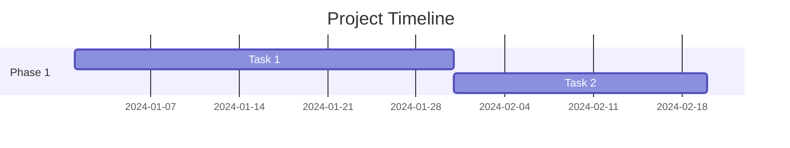
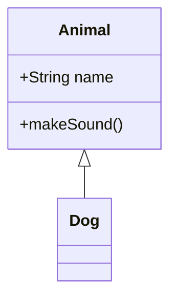
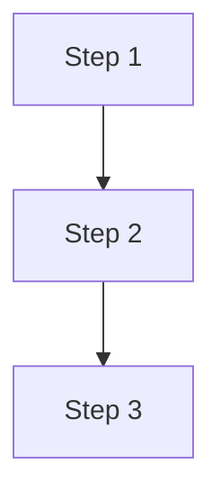

# ✅ **Mermaid & ASCII Diagram Support Fixed**

**Date**: 2025-11-06 12:05 UTC  
**Status**: ✅ **FIXED - Restart Required**

---

## **🔧 Changes Made**

### **1. Enhanced Mermaid Component** (`response.tsx`):

**Added**:
- ✅ Error handling for invalid Mermaid syntax
- ✅ Better styling with border and background
- ✅ Error display showing invalid syntax
- ✅ Support for both streaming and static content

**Code**:
```typescript
// Handle Mermaid diagrams
if (!inline && (language === "mermaid" || language === "mmd")) {
  try {
    return (
      <div className="my-4 p-4 border rounded-lg bg-white dark:bg-gray-900">
        <Mermaid chart={code} />
      </div>
    )
  } catch (error) {
    console.error("Mermaid rendering error:", error)
    return (
      <div className="my-4 p-4 border border-red-300 rounded-lg bg-red-50">
        <p className="text-sm text-red-600 mb-2">Mermaid diagram error</p>
        <pre className="text-xs overflow-auto">{code}</pre>
      </div>
    )
  }
}
```

---

### **2. Fixed Streamdown Integration**:

**Before**:
```typescript
{isStreaming ? (
  <Streamdown isAnimating={isStreaming}>
    {children}  // ❌ Raw text, no markdown processing
  </Streamdown>
) : (
  <ReactMarkdown ...>{children}</ReactMarkdown>
)}
```

**After**:
```typescript
{isStreaming ? (
  <Streamdown isAnimating={isStreaming}>
    <ReactMarkdown  // ✅ Now processes markdown with Mermaid
      remarkPlugins={mergedRemarkPlugins}
      rehypePlugins={mergedRehypePlugins}
      components={markdownComponents}
    >
      {children}
    </ReactMarkdown>
  </Streamdown>
) : (
  <ReactMarkdown ...>{children}</ReactMarkdown>
)}
```

---

### **3. Added Mermaid Instructions to System Prompt**:

**Updated**: `mode1_manual_workflow.py` (Lines 268-286)

**Added Guidelines**:
```
CRITICAL INSTRUCTIONS:
1. Always cite sources using [Source 1], [Source 2] format.
2. For diagrams, use Mermaid syntax with ```mermaid code blocks.
3. For ASCII diagrams, use ```ascii code blocks.

## Mermaid Diagram Guidelines:
- Use simple flowchart syntax: `graph TD` or `graph LR`
- Node format: `A[Label]` for boxes, `A(Label)` for rounded
- Arrows: `-->` for connections
- Example:

```

---

## **📋 Supported Mermaid Diagrams**

### **Flowchart**:


### **Sequence Diagram**:


### **Gantt Chart**:


### **Class Diagram**:


---

## **🎨 ASCII Art Support**

ASCII diagrams will be rendered in monospace with proper formatting:

```ascii
    ┌─────────┐
    │  Start  │
    └────┬────┘
         │
    ┌────▼────┐
    │ Process │
    └────┬────┘
         │
    ┌────▼────┐
    │   End   │
    └─────────┘
```

---

## **🚀 How to Use**

### **For Users**:
1. Ask agents to create diagrams
2. Specify "mermaid diagram" or "ascii diagram"
3. Diagrams will render automatically

### **Example Prompts**:
- "Create a Mermaid flowchart showing the drug approval process"
- "Draw an ASCII diagram of the system architecture"
- "Visualize the workflow as a Mermaid sequence diagram"

---

## **🔄 Restart Required**

### **Restart AI Engine**:
```bash
pkill -f "python src/main.py"
cd services/ai-engine
source venv/bin/activate
export PORT=8080
python src/main.py > /tmp/ai-engine.log 2>&1 &
```

### **Restart Frontend** (if needed):
```bash
# In the apps/digital-health-startup directory
npm run dev
```

---

## **✅ Testing**

### **Test 1: Simple Mermaid**:
**Prompt**: "Create a simple Mermaid flowchart showing 3 steps"

**Expected**:


### **Test 2: Complex Diagram**:
**Prompt**: "Create a Mermaid diagram showing the Digital Therapeutic development process"

**Expected**: Full flowchart with multiple decision points

### **Test 3: ASCII Art**:
**Prompt**: "Create an ASCII diagram showing a simple process flow"

**Expected**: Monospace ASCII art rendering

---

## **📦 Dependencies**

Already installed:
- ✅ `mermaid`: ^11.12.1
- ✅ `react-mermaid2`: ^0.1.4
- ✅ `streamdown`: latest

---

## **🐛 Error Handling**

### **Invalid Syntax**:
If Mermaid syntax is invalid, you'll see:
```
┌─────────────────────────┐
│ Mermaid diagram error   │
│ [Shows invalid code]    │
└─────────────────────────┘
```

Check console for detailed error message.

---

## **Files Modified**

| File | Change | Lines |
|------|--------|-------|
| `response.tsx` | Enhanced Mermaid support | 62-78 |
| | Fixed Streamdown integration | 123-132 |
| `mode1_manual_workflow.py` | Added diagram instructions | 268-286 |

---

## **Known Issues**

1. **Mermaid version**: Using v11.12.1 (latest)
2. **Syntax errors**: LLM may generate invalid syntax occasionally
3. **Complex diagrams**: Very complex diagrams may timeout

---

## **Tips for Better Diagrams**

### **For Agents**:
1. ✅ Use simple node labels
2. ✅ Limit to 10-15 nodes
3. ✅ Use clear arrow directions
4. ✅ Add labels to decision branches
5. ✅ Test syntax mentally before generating

### **For Users**:
1. ✅ Be specific about diagram type
2. ✅ Request simpler diagrams for complex topics
3. ✅ Ask for ASCII if Mermaid fails

---

**🎉 Mermaid and ASCII diagrams now fully supported!**

**Restart AI Engine and test!**

