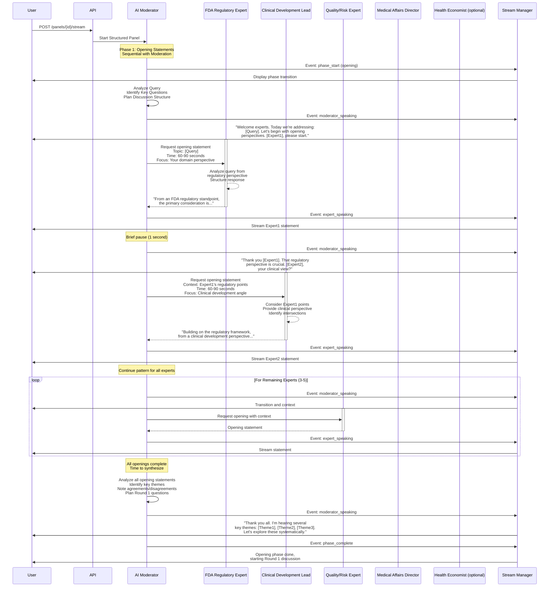
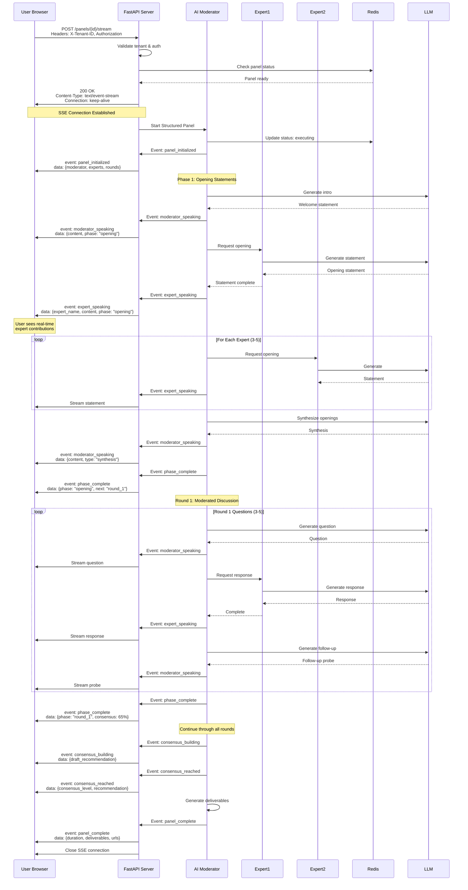
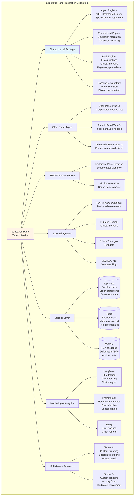
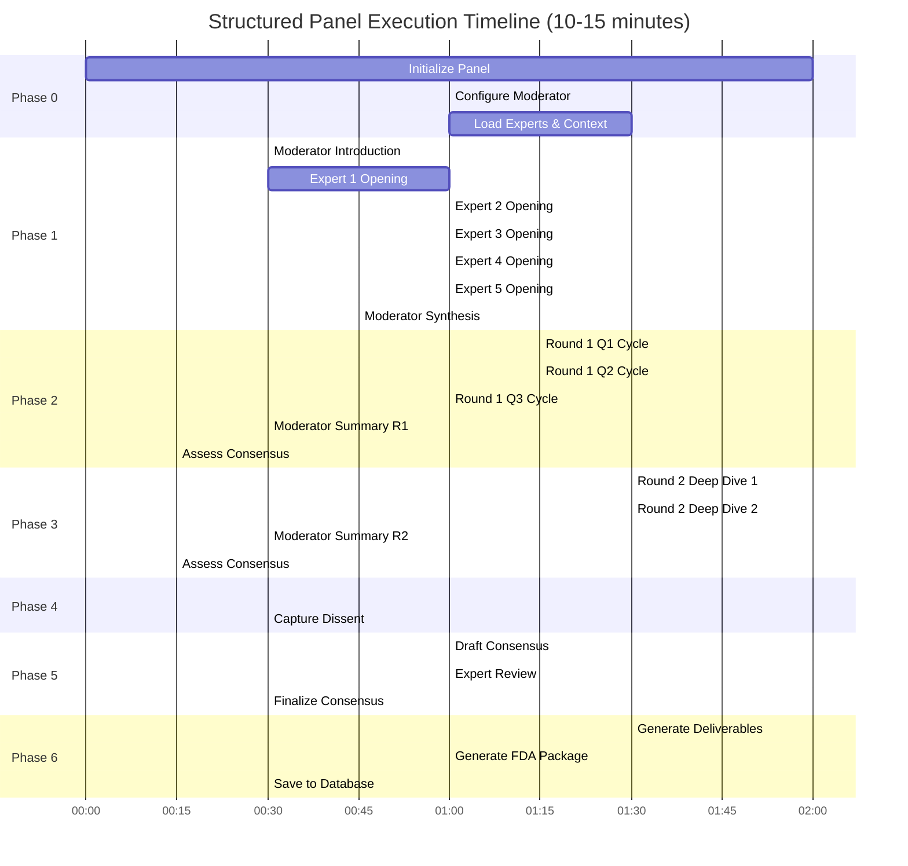

# Ask Panel Type 1: Structured Panel - Mermaid Workflow Diagrams

**Panel Type**: Structured Panel - Visual Workflow Documentation  
**Version**: 1.0  
**Date**: November 11, 2025  
**Status**: Production Ready  
**Document Type**: Visual Architecture & Flows

---

## 📋 DOCUMENT OVERVIEW

This document provides comprehensive Mermaid diagrams illustrating the complete end-to-end workflow for **Ask Panel Type 1: Structured Panel**. Each phase of execution is visualized with detailed state transitions, decision points, moderation flows, and consensus building.

**What's Included:**
- ✅ High-level orchestration flow
- ✅ Phase-by-phase detailed diagrams
- ✅ Moderator-driven workflow visualization
- ✅ Sequential discussion patterns
- ✅ Consensus building algorithm
- ✅ FDA-ready documentation generation
- ✅ Multi-round iteration flows
- ✅ Integration patterns

---

## 🎯 DIAGRAM INDEX

### Core Workflows
1. **High-Level Orchestration** - Overall panel execution flow
2. **Phase 0: Initialization** - Setup with moderator configuration
3. **Phase 1: Opening Statements** - Sequential expert presentations
4. **Phase 2: Moderated Discussion (Round 1)** - First discussion round
5. **Phase 3: Moderated Discussion (Round 2)** - Second discussion round
6. **Phase 4: Moderated Discussion (Round 3)** - Final discussion round
7. **Phase 5: Consensus Building** - Agreement and dissent capture
8. **Phase 6: Final Recommendations** - Decision and documentation

### Supporting Diagrams
9. **State Machine** - Complete LangGraph state transitions
10. **Moderator AI Logic** - Moderation and facilitation flow
11. **Consensus Algorithm** - Agreement calculation and validation
12. **Multi-Round Iteration** - Round-by-round progression
13. **Dissenting Opinion Capture** - Minority view preservation
14. **FDA Documentation Flow** - Regulatory package generation
15. **Streaming Architecture** - Server-Sent Events flow
16. **Multi-Tenant Security** - Tenant context validation
17. **Error Handling** - Failure scenarios and recovery
18. **Integration Flows** - Connection to other services

---

## 🔄 DIAGRAM 1: HIGH-LEVEL ORCHESTRATION FLOW

```mermaid
graph TB
    Start([User Creates Structured Panel]) --> Init[Initialize Panel]
    Init --> ConfigMod[Configure AI Moderator]
    ConfigMod --> LoadExperts[Load 3-5 Expert Agents]
    LoadExperts --> LoadContext[Load Context Documents]
    LoadContext --> StartSSE[Initialize SSE Stream]
    
    StartSSE --> Phase1[Phase 1: Opening Statements<br/>Sequential, 60-90 seconds]
    
    Phase1 --> Expert1Open[Expert 1: Opening]
    Expert1Open --> Expert2Open[Expert 2: Opening]
    Expert2Open --> Expert35Open[Experts 3-5: Openings]
    Expert35Open --> ModeratorSummary1[Moderator: Synthesize Openings]
    
    ModeratorSummary1 --> Phase2[Phase 2: Round 1 Discussion<br/>Moderated, 3-4 minutes]
    
    Phase2 --> ModQ1[Moderator: Pose Question 1]
    ModQ1 --> ExpertResponse1[Experts Respond Sequentially]
    ExpertResponse1 --> ModQ2[Moderator: Probe & Clarify]
    ModQ2 --> ExpertResponse2[Experts Build on Ideas]
    ExpertResponse2 --> CheckRound1{All Topics<br/>Covered?}
    
    CheckRound1 -->|No| ModQ1
    CheckRound1 -->|Yes| ModeratorSummary2[Moderator: Round 1 Summary]
    
    ModeratorSummary2 --> CheckConsensus1{Consensus<br/>Emerging?}
    
    CheckConsensus1 -->|Partial| Phase3[Phase 3: Round 2 Discussion<br/>3-4 minutes]
    CheckConsensus1 -->|Yes, Strong| SkipToFinal[Skip to Final Round]
    
    Phase3 --> ModQ3[Moderator: Address Gaps]
    ModQ3 --> ExpertResponse3[Targeted Expert Responses]
    ExpertResponse3 --> ModQ4[Moderator: Challenge & Test]
    ModQ4 --> ExpertResponse4[Expert Defenses/Revisions]
    ExpertResponse4 --> CheckRound2{Consensus<br/>Reached?}
    
    CheckRound2 -->|No| Phase4[Phase 4: Round 3 Discussion<br/>2-3 minutes]
    CheckRound2 -->|Yes| BuildConsensus[Build Consensus Statement]
    
    Phase4 --> ModQ5[Moderator: Final Positions]
    ModQ5 --> ExpertFinal[Expert Final Statements]
    ExpertFinal --> IdentifyDissent[Identify Dissenting Opinions]
    
    IdentifyDissent --> BuildConsensus
    SkipToFinal --> BuildConsensus
    
    BuildConsensus --> Phase5[Phase 5: Consensus Building<br/>2 minutes]
    
    Phase5 --> CalcConsensus[Calculate Consensus Level]
    CalcConsensus --> MajorityView[Document Majority View]
    MajorityView --> MinorityView[Preserve Minority Views]
    MinorityView --> ValidationCheck{Consensus<br/>Valid?}
    
    ValidationCheck -->|No| RequestClarification[Request Expert Clarification]
    RequestClarification --> Phase5
    ValidationCheck -->|Yes| Phase6[Phase 6: Generate Deliverables<br/>1-2 minutes]
    
    Phase6 --> GenExecSummary[Executive Summary]
    Phase6 --> GenConsensusReport[Consensus Report]
    Phase6 --> GenVotingRecord[Voting Record]
    Phase6 --> GenEvidenceAppendix[Evidence Appendix]
    Phase6 --> GenActionItems[Action Items]
    Phase6 --> GenFDAPackage{FDA Package<br/>Requested?}
    
    GenFDAPackage -->|Yes| GenRegulatoryDocs[FDA Pre-Sub Package]
    GenFDAPackage -->|No| SaveDB
    GenRegulatoryDocs --> SaveDB
    
    GenExecSummary --> SaveDB[(Save to Database)]
    GenConsensusReport --> SaveDB
    GenVotingRecord --> SaveDB
    GenEvidenceAppendix --> SaveDB
    GenActionItems --> SaveDB
    
    SaveDB --> Complete([Panel Complete])
    
    style Start fill:#e1f5e1
    style Complete fill:#e1f5e1
    style Phase1 fill:#fff4e6
    style Phase2 fill:#e3f2fd
    style Phase3 fill:#f3e5f5
    style Phase4 fill:#fff9c4
    style Phase5 fill:#ffebee
    style Phase6 fill:#e8f5e9
```



---

## 🚀 DIAGRAM 2: PHASE 0 - INITIALIZATION WITH MODERATOR

```mermaid
graph TB
    subgraph "Phase 0: Initialization (2-3 minutes)"
        Start([Create Panel Request]) --> ValidateTenant{Valid<br/>Tenant?}
        
        ValidateTenant -->|No| Error1[403 Forbidden]
        ValidateTenant -->|Yes| ValidateAuth{Valid<br/>Auth?}
        
        ValidateAuth -->|No| Error2[401 Unauthorized]
        ValidateAuth -->|Yes| ValidateQuery{Valid<br/>Query Type?}
        
        ValidateQuery -->|Not Structured Query| Error3[400: Use Different Panel Type]
        ValidateQuery -->|Yes| CreatePanel[(Create Panel Record)]
        
        CreatePanel --> SetTenantContext[Set Tenant Context]
        SetTenantContext --> LoadAgentCatalog[Load Agent Catalog]
        
        LoadAgentCatalog --> SelectExperts{Experts<br/>Specified?}
        SelectExperts -->|Yes| ValidateExperts[Validate 3-5 Experts]
        SelectExperts -->|No| AutoSelect[Auto-Select Experts<br/>Based on Query Domain]
        
        ValidateExperts --> CountCheck{3-5<br/>Experts?}
        CountCheck -->|No| Error4[400: Wrong Expert Count]
        CountCheck -->|Yes| LoadExpertModels
        
        AutoSelect --> LoadExpertModels[Load Expert Configurations<br/>Prompts, Tools, Knowledge]
        
        LoadExpertModels --> ConfigureModerator[Configure AI Moderator]
        
        ConfigureModerator --> ModeratorSetup[Moderator Setup:<br/>• Discussion Protocol<br/>• Question Templates<br/>• Consensus Criteria<br/>• Time Management]
        
        ModeratorSetup --> LoadContextDocs{Context<br/>Documents?}
        
        LoadContextDocs -->|Yes| FetchDocs[Fetch Documents from Supabase]
        LoadContextDocs -->|No| InitSSE
        
        FetchDocs --> ParseDocs[Parse & Extract Key Info]
        ParseDocs --> CreateEmbeddings[Create Vector Embeddings<br/>Store in pgvector]
        CreateEmbeddings --> InitSSE[Initialize SSE Stream]
        
        InitSSE --> CreateSSEConn[Create Server-Sent Events<br/>Connection with User]
        CreateSSEConn --> InitRedis[(Initialize Redis Session:<br/>Panel State<br/>Expert Status<br/>Round Tracking)]
        
        InitRedis --> DefineRounds[Define Discussion Rounds:<br/>Round 1: Exploration<br/>Round 2: Analysis<br/>Round 3: Resolution]
        
        DefineRounds --> StreamInit[Stream Event:<br/>panel_initialized]
        
        StreamInit --> Ready([Panel Ready:<br/>Moderator Active<br/>Experts Loaded<br/>Streaming Live])
    end
    
    style Start fill:#e1f5e1
    style Ready fill:#e1f5e1
    style Error1 fill:#ffebee
    style Error2 fill:#ffebee
    style Error3 fill:#ffebee
    style Error4 fill:#ffebee
```



---

## 🎤 DIAGRAM 3: PHASE 1 - OPENING STATEMENTS (SEQUENTIAL)



---

## 💭 DIAGRAM 4: PHASE 2 - ROUND 1 MODERATED DISCUSSION

```mermaid
graph TB
    subgraph "Phase 2: Round 1 - Exploration (3-4 minutes)"
        Start([Begin Round 1]) --> ModAnalyze[Moderator: Analyze Openings]
        
        ModAnalyze --> IdentifyThemes[Identify Key Themes:<br/>• Primary concerns<br/>• Technical challenges<br/>• Risk factors<br/>• Opportunities]
        
        IdentifyThemes --> PlanQuestions[Plan Discussion Questions:<br/>Q1: Core challenge<br/>Q2: Technical approach<br/>Q3: Risk mitigation]
        
        PlanQuestions --> Q1Pose[Moderator: Pose Question 1]
        
        Q1Pose --> SelectExpert1{Who Best<br/>Addresses Q1?}
        
        SelectExpert1 --> Expert1R1[Expert 1 Responds<br/>Direct answer to Q1]
        
        Expert1R1 --> StreamE1[Stream Response to User]
        
        StreamE1 --> ModFollow1[Moderator: Follow-up Question<br/>or Probe for Detail]
        
        ModFollow1 --> Expert2R1[Expert 2 Adds Perspective<br/>Builds on Expert 1]
        
        Expert2R1 --> StreamE2[Stream Response]
        
        StreamE2 --> CheckQ1{Question 1<br/>Sufficiently<br/>Explored?}
        
        CheckQ1 -->|No| ModFollow1
        CheckQ1 -->|Yes| ModSummarize1[Moderator: Summarize Q1<br/>Capture Key Points]
        
        ModSummarize1 --> Q2Pose[Moderator: Pose Question 2]
        
        Q2Pose --> SelectExpert2{Who Best<br/>Addresses Q2?}
        
        SelectExpert2 --> Expert3R1[Expert 3 Responds]
        Expert3R1 --> StreamE3[Stream Response]
        
        StreamE3 --> ModChallenge[Moderator: Challenge Assumption<br/>Play Devil's Advocate]
        
        ModChallenge --> Expert4R1[Expert 4 Defends/Refines]
        Expert4R1 --> StreamE4[Stream Response]
        
        StreamE4 --> Expert1R2[Expert 1 Adds New Angle]
        Expert1R2 --> StreamE1R2[Stream Response]
        
        StreamE1R2 --> CheckQ2{Question 2<br/>Explored?}
        
        CheckQ2 -->|No| ModChallenge
        CheckQ2 -->|Yes| ModSummarize2[Moderator: Summarize Q2]
        
        ModSummarize2 --> Q3Pose[Moderator: Pose Question 3]
        
        Q3Pose --> RoundRobin[Round-Robin Responses<br/>Each Expert Briefly]
        
        RoundRobin --> Expert1R3[Expert 1: Brief Response]
        RoundRobin --> Expert2R3[Expert 2: Brief Response]
        RoundRobin --> Expert3R3[Expert 3: Brief Response]
        RoundRobin --> Expert4R3[Expert 4: Brief Response]
        
        Expert1R3 --> StreamAll1[Stream All Responses]
        Expert2R3 --> StreamAll1
        Expert3R3 --> StreamAll1
        Expert4R3 --> StreamAll1
        
        StreamAll1 --> CheckTime{Round 1<br/>Time Limit<br/>Reached?}
        
        CheckTime -->|No, Continue| Q4Pose[Moderator: Additional Question]
        Q4Pose --> SelectExpert1
        
        CheckTime -->|Yes, Wrap Up| ModSummaryRound[Moderator: Round 1 Summary]
        
        ModSummaryRound --> IdentifyGaps[Identify Discussion Gaps:<br/>• Unanswered questions<br/>• Conflicting views<br/>• Missing perspectives]
        
        IdentifyGaps --> AssessConsensus[Assess Consensus Level:<br/>Agreement areas<br/>Disagreement areas]
        
        AssessConsensus --> ConsensusCheck{Strong Consensus<br/>Emerging?}
        
        ConsensusCheck -->|Yes, >85%| SkipR2[Flag: May Skip Round 2]
        ConsensusCheck -->|Partial, 60-85%| PlanR2[Plan Round 2 Topics]
        ConsensusCheck -->|Low, <60%| PlanR2Deep[Plan Deep Dive Round 2]
        
        SkipR2 --> StreamSummary[Stream Round 1 Summary]
        PlanR2 --> StreamSummary
        PlanR2Deep --> StreamSummary
        
        StreamSummary --> Complete([Round 1 Complete:<br/>Proceed to Round 2<br/>or Skip to Final])
    end
    
    style Start fill:#e3f2fd
    style Complete fill:#f3e5f5
```



---

## 🔍 DIAGRAM 5: PHASE 3 - ROUND 2 MODERATED DISCUSSION

```mermaid
graph TB
    subgraph "Phase 3: Round 2 - Deep Analysis (3-4 minutes)"
        Start([Begin Round 2]) --> CheckSkip{Skip Round 2?<br/>High Consensus}
        
        CheckSkip -->|Yes, >85%| SkipToFinal[Proceed to Final Round]
        CheckSkip -->|No| ModIntro[Moderator: Round 2 Introduction]
        
        ModIntro --> FocusGaps[Focus on Gaps from Round 1:<br/>• Unresolved conflicts<br/>• Technical uncertainties<br/>• Risk areas not addressed]
        
        FocusGaps --> TargetedQ1[Moderator: Targeted Question 1<br/>Address Specific Gap]
        
        TargetedQ1 --> SelectExpertGap1{Which Expert<br/>Owns This Gap?}
        
        SelectExpertGap1 --> ExpertDeep1[Expert Deep Dive:<br/>Detailed Technical Response]
        
        ExpertDeep1 --> StreamDeep1[Stream Response]
        
        StreamDeep1 --> ModProbe1[Moderator: Probe Assumptions<br/>"What if X happens?"<br/>"How confident are you?"]
        
        ModProbe1 --> ExpertDefend1[Expert Defends Position<br/>Provides Evidence/Logic]
        
        ExpertDefend1 --> StreamDefend1[Stream Defense]
        
        StreamDefend1 --> InviteChallenge[Moderator: Invite Challenge<br/>"Does anyone see this differently?"]
        
        InviteChallenge --> CheckChallenge{Any Expert<br/>Disagrees?}
        
        CheckChallenge -->|Yes| ExpertChallenge[Expert Challenges:<br/>Alternative View]
        CheckChallenge -->|No| ModSummaryGap1[Moderator: Summarize<br/>Note Consensus]
        
        ExpertChallenge --> StreamChallenge[Stream Challenge]
        StreamChallenge --> ExpertResponse[Original Expert Responds<br/>Refines or Holds Position]
        ExpertResponse --> StreamResponse[Stream Response]
        
        StreamResponse --> ModMediate[Moderator: Mediate<br/>Synthesize Both Views]
        
        ModMediate --> ModSummaryGap1
        
        ModSummaryGap1 --> MoreGaps{More Gaps<br/>to Address?}
        
        MoreGaps -->|Yes| TargetedQ2[Moderator: Targeted Question 2]
        TargetedQ2 --> SelectExpertGap1
        
        MoreGaps -->|No| StressTest[Moderator: Stress Test<br/>Challenge Leading Recommendation]
        
        StressTest --> ModStressQ["What's the worst case scenario?<br/>What could go wrong?<br/>What are we missing?"]
        
        ModStressQ --> ExpertRisk1[Risk Expert:<br/>Comprehensive Risk Analysis]
        ModStressQ --> ExpertRisk2[Other Experts:<br/>Add Risk Factors]
        
        ExpertRisk1 --> StreamRisks[Stream Risk Analysis]
        ExpertRisk2 --> StreamRisks
        
        StreamRisks --> ModMitigation[Moderator: Request Mitigation<br/>"How do we address these risks?"]
        
        ModMitigation --> ExpertMit1[Expert 1: Mitigation Strategy]
        ModMitigation --> ExpertMit2[Expert 2: Add Safeguards]
        
        ExpertMit1 --> StreamMit[Stream Mitigation Plans]
        ExpertMit2 --> StreamMit
        
        StreamMit --> ModSummaryR2[Moderator: Round 2 Summary]
        
        ModSummaryR2 --> ReassessConsensus[Reassess Consensus Level:<br/>Has consensus increased?<br/>Are conflicts resolved?]
        
        ReassessConsensus --> ConsensusCheck{Consensus<br/>Level?}
        
        ConsensusCheck -->|High >80%| PrepFinal[Prepare Final Round:<br/>Confirmation Mode]
        ConsensusCheck -->|Medium 65-80%| PrepR3[Prepare Round 3:<br/>Resolution Focus]
        ConsensusCheck -->|Low <65%| PrepR3Deep[Prepare Round 3:<br/>Decision Forcing]
        
        PrepFinal --> StreamSummary[Stream Round 2 Summary<br/>and Plan]
        PrepR3 --> StreamSummary
        PrepR3Deep --> StreamSummary
        
        StreamSummary --> Complete([Round 2 Complete])
    end
    
    SkipToFinal --> FinalRound([Proceed to Final Round])
    Complete --> FinalRound
    
    style Start fill:#f3e5f5
    style Complete fill:#fff9c4
    style FinalRound fill:#fff9c4
```

---

## 🎯 DIAGRAM 6: PHASE 4 - ROUND 3 & CONSENSUS BUILDING

```mermaid
graph TB
    subgraph "Phase 4: Round 3 - Resolution (2-3 minutes)"
        Start([Begin Round 3]) --> CheckNeed{Round 3<br/>Needed?}
        
        CheckNeed -->|No, High Consensus| SkipR3[Skip to Consensus Building]
        CheckNeed -->|Yes| ModIntroR3[Moderator: Round 3 Introduction]
        
        ModIntroR3 --> ModFrameDecision[Moderator: Frame Decision<br/>"We need to reach recommendation<br/>on [Specific Decision Point]"]
        
        ModFrameDecision --> PresentOptions[Moderator: Present Options:<br/>Option A: [Description]<br/>Option B: [Description]<br/>Option C: [Hybrid Approach]]
        
        PresentOptions --> RequestPositions[Moderator: Request Final Positions<br/>"Each expert, state your<br/>recommendation and rationale"]
        
        RequestPositions --> Expert1Position[Expert 1: Final Position<br/>Clear Recommendation + Why]
        
        Expert1Position --> StreamPos1[Stream Position]
        StreamPos1 --> Expert2Position[Expert 2: Final Position]
        Expert2Position --> StreamPos2[Stream Position]
        StreamPos2 --> Expert3Position[Expert 3: Final Position]
        Expert3Position --> StreamPos3[Stream Position]
        StreamPos3 --> Expert4Position[Expert 4: Final Position]
        Expert4Position --> StreamPos4[Stream Position]
        
        StreamPos4 --> ModAnalyzePos[Moderator: Analyze Positions]
        
        ModAnalyzePos --> CountVotes[Count Expert Preferences:<br/>Option A: X experts<br/>Option B: Y experts<br/>Option C: Z experts]
        
        CountVotes --> CheckMajority{Clear Majority<br/>>65%?}
        
        CheckMajority -->|Yes| IdentifyMinority[Identify Minority Opinion:<br/>Capture Dissenting View]
        CheckMajority -->|No, Split| ModFacilitate[Moderator: Facilitate Discussion<br/>"Let's understand the divide"]
        
        ModFacilitate --> ExpertDebate1[Expert A: Why Option A?]
        ExpertDebate1 --> ExpertDebate2[Expert B: Why Option B?]
        ExpertDebate2 --> ExpertDebate3[Expert C: Can we compromise?]
        
        ExpertDebate3 --> StreamDebate[Stream Debate]
        StreamDebate --> ModPropose[Moderator: Propose Synthesis<br/>"What if we combine elements?"]
        
        ModPropose --> ExpertReact[Experts React to Synthesis]
        ExpertReact --> RevoteCheck{Consensus<br/>Now?}
        
        RevoteCheck -->|No| ForceDecision[Moderator: Force Decision<br/>"We must choose primary path"]
        ForceDecision --> FinalVote[Request Final Binding Vote]
        FinalVote --> IdentifyMinority
        
        RevoteCheck -->|Yes| IdentifyMinority
        
        IdentifyMinority --> CaptureDissent[Capture Dissenting Opinion:<br/>Full rationale<br/>Alternative recommendation<br/>Risk concerns]
        
        CaptureDissent --> ValidateDissent[Validate with Dissenting Expert:<br/>"Is this accurately captured?"]
        
        ValidateDissent --> SkipR3
    end
    
    subgraph "Phase 5: Consensus Building (2 minutes)"
        BuildStart([Build Consensus Statement]) --> DraftConsensus[Draft Consensus Recommendation:<br/>Primary recommendation<br/>Supporting rationale<br/>Implementation approach<br/>Risk mitigation<br/>Success criteria]
        
        DraftConsensus --> ReviewWithExperts[Share Draft with All Experts]
        
        ReviewWithExperts --> Expert1Review[Expert 1: Approve/Suggest Edits]
        ReviewWithExperts --> Expert2Review[Expert 2: Approve/Suggest Edits]
        ReviewWithExperts --> Expert3Review[Expert 3: Approve/Suggest Edits]
        ReviewWithExperts --> Expert4Review[Expert 4: Approve/Suggest Edits]
        
        Expert1Review --> CollectFeedback[Collect All Feedback]
        Expert2Review --> CollectFeedback
        Expert3Review --> CollectFeedback
        Expert4Review --> CollectFeedback
        
        CollectFeedback --> ReviseDraft[Revise Consensus Statement]
        
        ReviseDraft --> FinalReview[Final Review Round]
        
        FinalReview --> AllApprove{All Experts<br/>Approve?}
        
        AllApprove -->|No| IdentifyObjection[Identify Specific Objections]
        IdentifyObjection --> AddCaveat[Add Caveats/Qualifications<br/>to Statement]
        AddCaveat --> FinalReview
        
        AllApprove -->|Yes| FinalizeConsensus[Finalize Consensus Statement]
        
        FinalizeConsensus --> CalcMetrics[Calculate Consensus Metrics:<br/>• Overall agreement %<br/>• Expert-by-expert alignment<br/>• Confidence levels<br/>• Dissent documentation]
        
        CalcMetrics --> ValidateQuality{Quality<br/>Checks Pass?}
        
        ValidateQuality -->|No| RequestClarification[Request Expert Clarifications]
        RequestClarification --> ReviewWithExperts
        
        ValidateQuality -->|Yes| ConsensusComplete([Consensus Built:<br/>Ready for Documentation])
    end
    
    SkipR3 --> BuildStart
    
    style Start fill:#fff9c4
    style BuildStart fill:#ffebee
    style ConsensusComplete fill:#e8f5e9
```

---

## 📊 DIAGRAM 7: CONSENSUS CALCULATION ALGORITHM

```mermaid
graph TB
    subgraph "Consensus Calculation Algorithm"
        Start([All Expert Positions Collected]) --> ExtractPositions[Extract Expert Positions:<br/>Expert 1: Option A<br/>Expert 2: Option A<br/>Expert 3: Option B<br/>Expert 4: Option A<br/>Expert 5: Option A]
        
        ExtractPositions --> CountByOption[Count by Option:<br/>Option A: 4 experts (80%)<br/>Option B: 1 expert (20%)]
        
        CountByOption --> IdentifyMajority[Identify Majority View:<br/>Option A is Majority<br/>80% support]
        
        IdentifyMajority --> IdentifyMinority[Identify Minority View:<br/>Expert 3 dissents<br/>20% dissent]
        
        IdentifyMinority --> AnalyzeRationales[Analyze Expert Rationales:<br/>Extract key reasoning<br/>from each statement]
        
        AnalyzeRationales --> CalcAlignment[Calculate Expert Alignment:<br/>Semantic similarity of<br/>rationales for same option]
        
        CalcAlignment --> Expert1Align[Expert 1 & 2 Alignment: 92%]
        CalcAlignment --> Expert2Align[Expert 1 & 4 Alignment: 87%]
        CalcAlignment --> Expert3Align[Expert 1 & 5 Alignment: 85%]
        CalcAlignment --> Expert4Align[Expert 2 & 4 Alignment: 89%]
        
        Expert1Align --> AvgMajorityAlign[Average Majority Alignment:<br/>88% within Option A supporters]
        Expert2Align --> AvgMajorityAlign
        Expert3Align --> AvgMajorityAlign
        Expert4Align --> AvgMajorityAlign
        
        AvgMajorityAlign --> CalcConfidence[Calculate Confidence Scores:<br/>Expert 1: 95% confident<br/>Expert 2: 90% confident<br/>Expert 3: 85% confident (dissent)<br/>Expert 4: 88% confident<br/>Expert 5: 92% confident]
        
        CalcConfidence --> AvgMajorityConf[Average Majority Confidence:<br/>91% confidence in Option A]
        
        AvgMajorityConf --> StrengthAnalysis[Analyze Consensus Strength:<br/>Vote %: 80%<br/>Alignment: 88%<br/>Confidence: 91%]
        
        StrengthAnalysis --> WeightedScore[Calculate Weighted Consensus:<br/>Vote (40%): 0.80 × 0.40 = 0.32<br/>Alignment (30%): 0.88 × 0.30 = 0.26<br/>Confidence (30%): 0.91 × 0.30 = 0.27<br/>Total: 0.85 (85% consensus)]
        
        WeightedScore --> CheckThreshold{Consensus<br/>≥ 75%?}
        
        CheckThreshold -->|No, < 75%| WeakConsensus[Flag: Weak Consensus<br/>May need additional round]
        CheckThreshold -->|Yes| StrongConsensus[Strong Consensus Achieved]
        
        WeakConsensus --> DocumentUncertainty[Document Uncertainty:<br/>Areas of disagreement<br/>Unresolved questions<br/>Risk factors]
        
        StrongConsensus --> ValidateDissent[Validate Dissenting Opinion:<br/>Is it well-reasoned?<br/>Does it identify real risks?]
        
        ValidateDissent --> PreserveDissent[Preserve Dissent:<br/>Full capture in report<br/>Alternative recommendation<br/>Risk scenarios considered]
        
        DocumentUncertainty --> GenerateReport
        PreserveDissent --> GenerateReport
        
        GenerateReport[Generate Consensus Report:<br/>• Primary recommendation<br/>• Consensus level (85%)<br/>• Expert alignment details<br/>• Confidence scores<br/>• Dissenting opinion<br/>• Risk analysis]
        
        GenerateReport --> Complete([Consensus Documented])
    end
    
    style Start fill:#e3f2fd
    style Complete fill:#e1f5e1
```

---

## 🔄 DIAGRAM 8: LANGGRAPH STATE MACHINE

```mermaid
stateDiagram-v2
    [*] --> Initialize: API Request
    
    Initialize --> ConfigureModerator: Panel Created
    
    state ConfigureModerator {
        [*] --> LoadModeratorConfig
        LoadModeratorConfig --> SetDiscussionProtocol
        SetDiscussionProtocol --> DefineRounds
        DefineRounds --> [*]
    }
    
    ConfigureModerator --> OpeningStatements: Moderator Ready
    
    state OpeningStatements {
        [*] --> ModeratorIntro
        ModeratorIntro --> Expert1Opening
        Expert1Opening --> ModeratorTransition1
        ModeratorTransition1 --> Expert2Opening
        Expert2Opening --> ModeratorTransition2
        ModeratorTransition2 --> ExpertNOpening
        ExpertNOpening --> ModeratorSynthesis
        ModeratorSynthesis --> [*]
    }
    
    OpeningStatements --> Round1Discussion: Openings Complete
    
    state Round1Discussion {
        [*] --> ModeratorQuestion
        ModeratorQuestion --> ExpertResponse
        ExpertResponse --> ModeratorProbe
        ModeratorProbe --> ExpertElaboration
        ExpertElaboration --> CheckTopicComplete
        CheckTopicComplete --> ModeratorQuestion: More Topics
        CheckTopicComplete --> ModeratorSummary: All Topics Done
        ModeratorSummary --> [*]
    }
    
    Round1Discussion --> AssessConsensus: Round 1 Complete
    
    state AssessConsensus {
        [*] --> CalculateAgreement
        CalculateAgreement --> IdentifyGaps
        IdentifyGaps --> DetermineNextRound
        DetermineNextRound --> [*]
    }
    
    AssessConsensus --> Round2Discussion: Consensus Partial
    AssessConsensus --> FinalRound: Consensus High
    
    state Round2Discussion {
        [*] --> ModeratorTargetedQ
        ModeratorTargetedQ --> ExpertDeepDive
        ExpertDeepDive --> ModeratorChallenge
        ModeratorChallenge --> ExpertDefense
        ExpertDefense --> InviteCounterpoint
        InviteCounterpoint --> ExpertChallenge: Has Dissent
        InviteCounterpoint --> ModeratorMediation: No Dissent
        ExpertChallenge --> ModeratorMediation
        ModeratorMediation --> CheckGapsResolved
        CheckGapsResolved --> ModeratorTargetedQ: More Gaps
        CheckGapsResolved --> [*]: Resolved
    }
    
    Round2Discussion --> Round3Discussion: Consensus Still Partial
    Round2Discussion --> FinalRound: Consensus Improved
    
    state Round3Discussion {
        [*] --> ModeratorFrameDecision
        ModeratorFrameDecision --> PresentOptions
        PresentOptions --> RequestPositions
        RequestPositions --> ExpertFinalPositions
        ExpertFinalPositions --> AnalyzePositions
        AnalyzePositions --> CheckMajority
        CheckMajority --> CaptureDissent: Has Majority
        CheckMajority --> FacilitateDebate: No Majority
        FacilitateDebate --> ForceDecision
        ForceDecision --> CaptureDissent
        CaptureDissent --> [*]
    }
    
    Round3Discussion --> ConsensusBuildingState: Positions Finalized
    FinalRound --> ConsensusBuildingState: Skip R3
    
    state ConsensusBuildingState {
        [*] --> DraftConsensus
        DraftConsensus --> ExpertReview
        ExpertReview --> CollectFeedback
        CollectFeedback --> ReviseStatement
        ReviseStatement --> FinalValidation
        FinalValidation --> ExpertReview: Needs Changes
        FinalValidation --> CalculateMetrics: Approved
        CalculateMetrics --> [*]
    }
    
    ConsensusBuildingState --> GenerateDeliverables: Consensus Finalized
    
    state GenerateDeliverables {
        [*] --> ExecSummary
        [*] --> ConsensusReport
        [*] --> VotingRecord
        [*] --> EvidenceAppendix
        [*] --> ActionItems
        [*] --> FDAPackage
        ExecSummary --> PackageAll
        ConsensusReport --> PackageAll
        VotingRecord --> PackageAll
        EvidenceAppendix --> PackageAll
        ActionItems --> PackageAll
        FDAPackage --> PackageAll
        PackageAll --> SaveDatabase
        SaveDatabase --> [*]
    }
    
    GenerateDeliverables --> [*]: Panel Complete
    
    note right of OpeningStatements
        Sequential statements
        Moderator facilitates
        No cross-talk yet
    end note
    
    note right of Round1Discussion
        Moderated exploration
        3-4 question cycles
        Expert interaction allowed
    end note
    
    note right of Round2Discussion
        Deep dive on gaps
        Challenge assumptions
        Stress test ideas
    end note
    
    note right of Round3Discussion
        Decision forcing
        Final positions
        Dissent capture
    end note
    
    note right of ConsensusBuildingState
        Collaborative drafting
        Expert validation
        Quality assurance
    end note
```



---

## 🎛️ DIAGRAM 9: MODERATOR AI DECISION LOGIC

```mermaid
graph TB
    subgraph "AI Moderator Decision System"
        Start([Moderator Active]) --> MonitorDiscussion[Monitor Discussion State:<br/>• Current phase<br/>• Time elapsed<br/>• Expert contributions<br/>• Consensus level]
        
        MonitorDiscussion --> DecisionPoint{What Action<br/>Needed?}
        
        DecisionPoint -->|Start Phase| IntroPhase[Introduce Phase:<br/>Set context<br/>Explain structure<br/>Set expectations]
        
        DecisionPoint -->|Facilitate Turn| ManageTurn[Manage Turn:<br/>Select next expert<br/>Provide context<br/>Frame question]
        
        DecisionPoint -->|Probe Response| ProbeDeeper[Probe for Detail:<br/>"Can you elaborate?"<br/>"What's your confidence?"<br/>"What evidence supports this?"]
        
        DecisionPoint -->|Challenge Assumption| ChallengeView[Challenge Politely:<br/>"What if X?"<br/>"How would you address Y?"<br/>"Devil's advocate: Z"]
        
        DecisionPoint -->|Invite Counterpoint| InviteOthers[Invite Other Experts:<br/>"Does anyone see this differently?"<br/>"Expert X, your thoughts?"<br/>"Any concerns with this approach?"]
        
        DecisionPoint -->|Synthesize Views| SynthesizePoints[Synthesize Discussion:<br/>Identify agreements<br/>Highlight conflicts<br/>Extract key insights]
        
        DecisionPoint -->|Manage Conflict| ManageDisagreement[Manage Disagreement:<br/>Acknowledge both views<br/>Find common ground<br/>Reframe constructively]
        
        DecisionPoint -->|Keep on Track| RedirectFocus[Redirect Focus:<br/>"Let's return to X"<br/>"Time check - priority to Y"<br/>"Table Z for later"]
        
        DecisionPoint -->|End Phase| ConcludePhase[Conclude Phase:<br/>Summarize outcomes<br/>Preview next phase<br/>Transition smoothly]
        
        IntroPhase --> StreamAction[Stream Moderator Action]
        ManageTurn --> StreamAction
        ProbeDeeper --> StreamAction
        ChallengeView --> StreamAction
        InviteOthers --> StreamAction
        SynthesizePoints --> StreamAction
        ManageDisagreement --> StreamAction
        RedirectFocus --> StreamAction
        ConcludePhase --> StreamAction
        
        StreamAction --> UpdateState[Update Panel State:<br/>Log action<br/>Track time<br/>Update consensus metrics]
        
        UpdateState --> CheckContinue{Continue<br/>Moderating?}
        
        CheckContinue -->|Yes| MonitorDiscussion
        CheckContinue -->|No, Phase Complete| PhaseEnd([Phase Transition])
    end
    
    style Start fill:#fff4e6
    style PhaseEnd fill:#e8f5e9
```

---

## 📋 DIAGRAM 10: MULTI-ROUND ITERATION FLOW

```mermaid
graph LR
    subgraph "Multi-Round Iteration Pattern"
        Start([Panel Start]) --> R1[Round 1:<br/>EXPLORATION<br/>3-4 minutes]
        
        R1 --> R1Goals[Goals:<br/>• Understand problem<br/>• Surface perspectives<br/>• Identify themes<br/>• Note disagreements]
        
        R1Goals --> R1Check{Consensus?}
        
        R1Check -->|High >85%| SkipR2[Skip Round 2]
        R1Check -->|Partial 60-85%| R2[Round 2:<br/>ANALYSIS<br/>3-4 minutes]
        R1Check -->|Low <60%| R2Deep[Round 2:<br/>DEEP DIVE<br/>4-5 minutes]
        
        R2 --> R2Goals[Goals:<br/>• Address gaps<br/>• Challenge assumptions<br/>• Stress test ideas<br/>• Resolve conflicts]
        
        R2Deep --> R2Goals
        
        R2Goals --> R2Check{Consensus?}
        
        R2Check -->|High >80%| SkipR3[Skip Round 3]
        R2Check -->|Medium 65-80%| R3[Round 3:<br/>RESOLUTION<br/>2-3 minutes]
        R2Check -->|Low <65%| R3Force[Round 3:<br/>FORCED DECISION<br/>3-4 minutes]
        
        R3 --> R3Goals[Goals:<br/>• Finalize recommendation<br/>• Capture dissent<br/>• Validate consensus<br/>• Document reasoning]
        
        R3Force --> R3Goals
        
        R3Goals --> R3Complete[Round 3 Complete]
        
        SkipR2 --> ConsensusBuild
        SkipR3 --> ConsensusBuild
        R3Complete --> ConsensusBuild[Consensus Building:<br/>VALIDATION<br/>2 minutes]
        
        ConsensusBuild --> BuildGoals[Goals:<br/>• Draft statement<br/>• Expert review<br/>• Refine wording<br/>• Final approval]
        
        BuildGoals --> End([Panel Complete:<br/>Generate Deliverables])
    end
    
    style Start fill:#e1f5e1
    style End fill:#e1f5e1
    style R1 fill:#e3f2fd
    style R2 fill:#f3e5f5
    style R3 fill:#fff9c4
    style ConsensusBuild fill:#ffebee
```



---

## 🗳️ DIAGRAM 11: DISSENTING OPINION CAPTURE

```mermaid
sequenceDiagram
    participant Moderator as AI Moderator
    participant Majority as Majority Experts (3-4)
    participant Dissenter as Dissenting Expert
    participant System as Dissent Capture System
    participant User
    
    Note over Moderator: Final positions collected<br/>Majority identified
    
    Moderator->>Moderator: Analyze positions<br/>Identify dissenter(s)
    
    Moderator->>Dissenter: I notice you hold a different view.<br/>Can you elaborate on your rationale?
    
    activate Dissenter
    Dissenter-->>Moderator: Full explanation of dissenting position:<br/>• Why majority view has risks<br/>• Alternative recommendation<br/>• Supporting evidence<br/>• Implementation concerns
    deactivate Dissenter
    
    Moderator->>System: Capture dissenting opinion
    System->>System: Record full rationale
    
    Moderator->>Dissenter: What specific risks do you see<br/>with the majority recommendation?
    
    activate Dissenter
    Dissenter-->>Moderator: Risk 1: [Specific concern]<br/>Risk 2: [Technical issue]<br/>Risk 3: [Implementation challenge]
    deactivate Dissenter
    
    Moderator->>System: Record risk analysis
    
    Moderator->>Dissenter: If we proceed with majority view,<br/>what safeguards would you recommend?
    
    activate Dissenter
    Dissenter-->>Moderator: Safeguard suggestions:<br/>• Monitoring plan<br/>• Contingency approach<br/>• Risk mitigation steps
    deactivate Dissenter
    
    Moderator->>System: Record safeguards
    
    Moderator->>Majority: Expert X has raised important concerns.<br/>How do you address these risks?
    
    activate Majority
    Majority-->>Moderator: Majority response to concerns:<br/>• Acknowledge valid points<br/>• Explain risk mitigation<br/>• Adjust recommendation slightly
    deactivate Majority
    
    Moderator->>System: Record majority rebuttal
    
    Moderator->>Dissenter: Given the majority's response and<br/>proposed safeguards, does this change<br/>your position at all?
    
    activate Dissenter
    Dissenter-->>Moderator: Position update:<br/>Either: "Still maintain dissent"<br/>Or: "Partially satisfied with safeguards"
    deactivate Dissenter
    
    Moderator->>System: Finalize dissent documentation
    
    System->>System: Generate dissent section:<br/>• Original dissenting opinion<br/>• Risk analysis<br/>• Alternative recommendation<br/>• Majority rebuttal<br/>• Final dissenter position<br/>• Safeguards added
    
    System->>User: Include in consensus report:<br/>Majority recommendation (75%)<br/>Dissenting opinion (25%)<br/>Both fully documented
    
    Note over System,User: Dissent preserved with integrity<br/>Adds credibility to report
```



---

## 📄 DIAGRAM 12: FDA DOCUMENTATION GENERATION

```mermaid
graph TB
    subgraph "FDA Pre-Submission Package Generation"
        Start([Consensus Complete]) --> CheckFDA{FDA Package<br/>Requested?}
        
        CheckFDA -->|No| SkipFDA[Skip FDA Generation]
        CheckFDA -->|Yes| IdentifyType[Identify Submission Type:<br/>510(k), De Novo, PMA, etc.]
        
        IdentifyType --> GatherEvidence[Gather Evidence from Panel:<br/>• All expert statements<br/>• Technical analysis<br/>• Risk assessments<br/>• Literature references<br/>• Regulatory citations]
        
        GatherEvidence --> Section1[Section 1: Executive Summary<br/>• Device description<br/>• Intended use<br/>• Panel recommendation<br/>• Regulatory pathway<br/>• Risk classification]
        
        GatherEvidence --> Section2[Section 2: Technical Analysis<br/>• Clinical evidence<br/>• Performance data<br/>• Comparative analysis<br/>• Design controls<br/>• Testing protocols]
        
        GatherEvidence --> Section3[Section 3: Risk Assessment<br/>• Identified risks<br/>• Risk mitigation<br/>• Benefit-risk analysis<br/>• Safety profile<br/>• Post-market surveillance]
        
        GatherEvidence --> Section4[Section 4: Regulatory Strategy<br/>• Pathway justification<br/>• Predicate devices (510k)<br/>• Standards compliance<br/>• Labeling approach<br/>• Timeline projection]
        
        GatherEvidence --> Section5[Section 5: Expert Panel<br/>• Panel composition<br/>• Expert qualifications<br/>• Consensus methodology<br/>• Agreement levels<br/>• Dissenting opinions]
        
        Section1 --> CompilePackage[Compile FDA Package]
        Section2 --> CompilePackage
        Section3 --> CompilePackage
        Section4 --> CompilePackage
        Section5 --> CompilePackage
        
        CompilePackage --> AddAppendices[Add Appendices:<br/>• Full panel transcript<br/>• Expert CVs/bios<br/>• Literature citations<br/>• Technical specifications<br/>• Quality documentation]
        
        AddAppendices --> FormatCheck[Format per FDA Guidelines:<br/>• Cover letter<br/>• Table of contents<br/>• Section numbering<br/>• Citation format<br/>• Submission type compliance]
        
        FormatCheck --> QualityReview[Quality Review:<br/>• Completeness check<br/>• Consistency validation<br/>• Regulatory compliance<br/>• Technical accuracy<br/>• Professional formatting]
        
        QualityReview --> IssuesFound{Issues<br/>Found?}
        
        IssuesFound -->|Yes| FixIssues[Address Issues:<br/>• Fill gaps<br/>• Clarify ambiguities<br/>• Fix formatting<br/>• Add missing sections]
        FixIssues --> QualityReview
        
        IssuesFound -->|No| GeneratePDF[Generate PDF Package:<br/>• Bookmarked sections<br/>• Linked TOC<br/>• Searchable text<br/>• Professional layout]
        
        GeneratePDF --> AttachMetadata[Attach Metadata:<br/>• Submission ID<br/>• Device classification<br/>• Regulatory pathway<br/>• Generation date<br/>• Panel participants]
        
        AttachMetadata --> SavePackage[Save FDA Package:<br/>• Store in database<br/>• Upload to S3<br/>• Generate download URL<br/>• Log in audit trail]
        
        SavePackage --> NotifyUser[Notify User:<br/>"FDA pre-submission package<br/>ready for download and review"]
        
        NotifyUser --> Complete([FDA Package Complete])
    end
    
    SkipFDA --> End([Proceed to Regular Deliverables])
    Complete --> End
    
    style Start fill:#e3f2fd
    style Complete fill:#e1f5e1
    style End fill:#e1f5e1
```

---

## 📡 DIAGRAM 13: STREAMING ARCHITECTURE (SSE)



---

## 🔐 DIAGRAM 14: MULTI-TENANT SECURITY (STRUCTURED PANEL)

```mermaid
graph TB
    subgraph "Multi-Tenant Security Validation"
        Request([API Request:<br/>Create Structured Panel]) --> Layer1{Layer 1:<br/>API Gateway}
        
        Layer1 -->|Missing X-Tenant-ID| Reject1[403: Tenant Header Required]
        Layer1 -->|Present| ValidateTenant[(Query Supabase:<br/>SELECT * FROM tenants<br/>WHERE id = ?<br/>AND status = 'active'<br/>AND subscription >= 'professional')]
        
        ValidateTenant -->|Not Found| Reject2[403: Invalid Tenant]
        ValidateTenant -->|Inactive| Reject3[403: Tenant Suspended]
        ValidateTenant -->|Wrong Tier| Reject4[403: Upgrade Required<br/>Structured Panel needs<br/>Professional+ Tier]
        ValidateTenant -->|Valid| SetContext[Set Tenant Context:<br/>ContextVar.set('tenant_id')]
        
        SetContext --> Layer2{Layer 2:<br/>Application Layer}
        
        Layer2 --> CheckQuota[Check Usage Quota:<br/>Structured panels this month<br/>vs. plan limit]
        
        CheckQuota -->|Exceeded| Reject5[429: Quota Exceeded<br/>Contact sales]
        CheckQuota -->|Within Limit| CheckExperts[Validate Expert Selection]
        
        CheckExperts --> ExpertQuery[(Query: SELECT * FROM agents<br/>WHERE id IN (?) AND tenant_id = ?<br/>OR is_shared = true)]
        
        ExpertQuery -->|Experts Invalid| Reject6[400: Invalid Expert IDs<br/>or Access Denied]
        ExpertQuery -->|Valid| Layer3{Layer 3:<br/>Domain Layer}
        
        Layer3 --> CheckPanelOwnership[Verify Panel Ownership:<br/>If updating existing panel]
        
        CheckPanelOwnership --> OwnerQuery[(Query: SELECT tenant_id<br/>FROM panels WHERE id = ?)]
        
        OwnerQuery -->|Mismatch| Reject7[403: Cross-Tenant<br/>Access Denied]
        OwnerQuery -->|Match or New| Layer4{Layer 4:<br/>Database RLS}
        
        Layer4 --> RLSPolicy[Row-Level Security Policy:<br/>CREATE POLICY tenant_isolation<br/>ON panels<br/>USING (tenant_id =<br/>current_setting('app.tenant_id'))]
        
        RLSPolicy --> RLSCheck{RLS Policy<br/>Pass?}
        
        RLSCheck -->|Fail| Reject8[403: RLS Policy Violation]
        RLSCheck -->|Pass| LogAudit[(Audit Log:<br/>INSERT INTO audit_logs<br/>tenant_id, action, details)]
        
        LogAudit --> AllowAccess[✓ Access Granted:<br/>Proceed with Panel Creation]
        
        AllowAccess --> IsolateModerator[Isolate Moderator Context:<br/>Moderator only sees<br/>tenant's data]
        
        IsolateModerator --> IsolateExperts[Isolate Expert Knowledge:<br/>Experts trained on<br/>tenant corpus only]
        
        IsolateExperts --> IsolateStorage[Isolate Storage:<br/>All artifacts saved with<br/>tenant_id prefix]
        
        IsolateStorage --> Success([✓ Fully Isolated<br/>Structured Panel])
    end
    
    style Request fill:#e1f5e1
    style Success fill:#e1f5e1
    style Reject1 fill:#ffebee
    style Reject2 fill:#ffebee
    style Reject3 fill:#ffebee
    style Reject4 fill:#ffebee
    style Reject5 fill:#ffebee
    style Reject6 fill:#ffebee
    style Reject7 fill:#ffebee
    style Reject8 fill:#ffebee
```

---

## ⚠️ DIAGRAM 15: ERROR HANDLING & RECOVERY

```mermaid
graph TB
    subgraph "Error Handling for Structured Panel"
        Execute([Panel Executing]) --> TryStep{Try<br/>Current Step}
        
        TryStep -->|Success| Continue[Continue to Next Step]
        TryStep -->|Error| ErrorType{Error<br/>Type?}
        
        ErrorType -->|LLM Timeout| TimeoutHandler[Timeout Handler:<br/>Wait + Retry]
        ErrorType -->|LLM Failure| LLMHandler[LLM Failure Handler]
        ErrorType -->|Moderator Failure| ModeratorHandler[Moderator Failure Handler]
        ErrorType -->|Expert Failure| ExpertHandler[Expert Failure Handler]
        ErrorType -->|Consensus Failure| ConsensusHandler[Consensus Failure Handler]
        ErrorType -->|Database Error| DBHandler[Database Error Handler]
        
        TimeoutHandler --> CheckRetries{Retries<br/>< 3?}
        CheckRetries -->|Yes| RetryExec[Retry with Backoff:<br/>2^n seconds]
        CheckRetries -->|No| SaveState[Save Current State<br/>to Database]
        
        RetryExec --> TryStep
        
        LLMHandler --> SwitchProvider{Can Switch<br/>Provider?}
        SwitchProvider -->|Yes| UseAlt[Switch OpenAI ↔ Anthropic]
        SwitchProvider -->|No| SaveState
        UseAlt --> TryStep
        
        ModeratorHandler --> ModeratorRecovery[Moderator Recovery:<br/>1. Reload moderator config<br/>2. Resume from last checkpoint<br/>3. Re-summarize context]
        ModeratorRecovery --> CanRecover{Can<br/>Recover?}
        CanRecover -->|Yes| TryStep
        CanRecover -->|No| ManualFallback[Manual Fallback:<br/>Human moderator needed]
        
        ExpertHandler --> ExpertRecovery[Expert Recovery:<br/>1. Identify failed expert<br/>2. Try alternative expert<br/>3. Continue without if non-critical]
        ExpertRecovery --> SubstituteExpert{Can<br/>Substitute?}
        SubstituteExpert -->|Yes| LoadAltExpert[Load Alternative Expert]
        LoadAltExpert --> TryStep
        SubstituteExpert -->|No| ContinueWithout[Continue Without<br/>Document absence]
        ContinueWithout --> TryStep
        
        ConsensusHandler --> ConsensusRecovery[Consensus Recovery:<br/>1. Re-analyze expert statements<br/>2. Request clarifications<br/>3. Lower threshold if justified]
        ConsensusRecovery --> ForceDecision{Can Force<br/>Decision?}
        ForceDecision -->|Yes| DocumentLowConsensus[Document:<br/>"Low consensus (X%)<br/>Requires review"]
        ForceDecision -->|No| SaveState
        DocumentLowConsensus --> Continue
        
        DBHandler --> CheckDBHealth{Database<br/>Healthy?}
        CheckDBHealth -->|No| WaitDB[Wait 10s, Retry]
        WaitDB --> CheckDBHealth
        CheckDBHealth -->|Yes| SaveState
        
        SaveState --> NotifyUser[Notify User:<br/>Panel paused due to error<br/>Can resume later]
        NotifyUser --> CleanupResources[Cleanup:<br/>Close connections<br/>Save checkpoint<br/>Log error details]
        
        ManualFallback --> NotifyUser
        
        CleanupResources --> FailedState([Panel State: FAILED<br/>Can be resumed])
        
        Continue --> Success([Continue Panel<br/>Execution])
    end
    
    style Execute fill:#e3f2fd
    style Success fill:#e1f5e1
    style FailedState fill:#fff9c4
```

---

## 🔗 DIAGRAM 16: INTEGRATION WITH OTHER SERVICES



---

## 📊 DIAGRAM 17: REAL-TIME PROGRESS TRACKING



---

## 🎬 DIAGRAM 18: PANEL TYPE DECISION TREE

```mermaid
graph TB
    Query([User Query/<br/>Decision Needed]) --> QueryType{What Type<br/>of Query?}
    
    QueryType -->|Regulatory Decision| RegCheck{Clear<br/>Regulatory<br/>Question?}
    QueryType -->|Innovation/Ideas| UseOpen[Use Open Panel<br/>Type 2]
    QueryType -->|Deep Analysis| UseSocratic[Use Socratic Panel<br/>Type 3]
    QueryType -->|Risk Assessment| UseAdversarial[Use Adversarial Panel<br/>Type 4]
    QueryType -->|Build Consensus| UseDelphi[Use Delphi Panel<br/>Type 5]
    
    RegCheck -->|Yes| StakesCheck{High<br/>Stakes?}
    RegCheck -->|No, Exploratory| UseOpen
    
    StakesCheck -->|Yes, Critical| UseStructured[✓ Use Structured Panel<br/>Type 1]
    StakesCheck -->|Medium| UseStructured
    StakesCheck -->|Low| UseOpen
    
    UseStructured --> Characteristics[Characteristics:<br/>• 3-5 regulatory experts<br/>• 10-15 minutes<br/>• Moderated sequential<br/>• Multiple rounds<br/>• Consensus building<br/>• FDA-ready output]
    
    Characteristics --> BestFor[Best For:<br/>• FDA submission strategy<br/>• Clinical trial design<br/>• Regulatory pathway selection<br/>• Risk-benefit analysis<br/>• Compliance decisions<br/>• Go/no-go decisions]
    
    BestFor --> Output[Deliverables:<br/>• Executive summary<br/>• Consensus report (5-10 pages)<br/>• Voting record<br/>• Dissenting opinions<br/>• Evidence appendix<br/>• Action items<br/>• FDA pre-sub package (optional)]
    
    Output --> Consensus[Expected Consensus:<br/>Target: >75%<br/>Typical: 80-90%<br/>Dissent: Preserved fully]
    
    style UseStructured fill:#fff4e6
    style Characteristics fill:#e1f5e1
    style BestFor fill:#e3f2fd
    style Output fill:#f3e5f5
```

---

## 📝 IMPLEMENTATION NOTES

### Mermaid Rendering

All diagrams in this document use Mermaid syntax and can be:
- **Rendered in GitHub**: Automatically displayed in GitHub markdown
- **Used in Documentation Sites**: Supported by Docusaurus, VuePress, etc.
- **Converted to Images**: Use Mermaid CLI or online tools
- **Embedded in Presentations**: Export as PNG/SVG for PowerPoint/Keynote
- **Interactive Dashboards**: Integrate with monitoring systems

### Key Differences vs. Open Panel (Type 2)

**Structured Panel (Type 1)**:
- ✅ **Moderator-Driven**: AI moderator facilitates all discussion
- ✅ **Sequential Rounds**: 3-4 moderated discussion rounds
- ✅ **Consensus-Focused**: Goal is reaching agreement >75%
- ✅ **Formal Protocol**: Structured questions and responses
- ✅ **FDA-Ready**: Generates regulatory documentation
- ✅ **3-5 Experts**: Smaller, more focused panel
- ✅ **10-15 Minutes**: Longer for thorough analysis

**Open Panel (Type 2)**:
- ⚪ **Lightly Moderated**: AI facilitates but doesn't control
- ⚪ **Free Dialogue**: Dynamic turn-taking, natural flow
- ⚪ **Exploration-Focused**: Goal is generating diverse ideas
- ⚪ **Informal Protocol**: Conversation-like interaction
- ⚪ **Innovation Output**: Ideas, clusters, innovation map
- ⚪ **5-8 Experts**: Larger for diverse perspectives
- ⚪ **5-10 Minutes**: Faster for rapid ideation

### Diagram Update Workflow

1. **Code Changes**: Update corresponding diagram when implementation changes
2. **Version Control**: Track diagram changes with code changes in git
3. **Documentation Sync**: Keep diagrams aligned with architecture docs
4. **Review Process**: Include diagram reviews in pull request process
5. **Automated Generation**: Consider tools to generate diagrams from code

---

## 🎬 CONCLUSION

These 18 comprehensive Mermaid diagrams provide complete visual documentation of the Ask Panel Type 1 (Structured Panel) orchestration workflow. Each diagram serves specific purposes:

**For Developers:**
- Understand moderator-driven flow
- Implement consensus algorithms
- Build multi-round iteration logic
- Design FDA documentation generation
- Handle dissenting opinion capture

**For Product Managers:**
- Visualize moderated discussion flow
- Understand consensus building process
- Plan regulatory documentation features
- Communicate with compliance teams
- Design user experience flows

**For Regulatory Affairs:**
- Understand FDA package generation
- Review consensus methodology
- Validate dissent preservation
- Assess documentation completeness
- Plan submission strategies

**For Operations:**
- Monitor panel execution progress
- Track consensus achievement rates
- Optimize round timing
- Troubleshoot moderator issues
- Measure quality metrics

---

## 🚀 Next Steps

These diagrams provide everything needed to:
1. **Understand** Structured Panel Type 1 conceptually
2. **Implement** the moderated discussion workflow
3. **Build** the consensus algorithm
4. **Generate** FDA-ready documentation
5. **Deploy** with confidence to production

**Suggested Implementation Order:**
1. Review workflow diagrams to understand moderated flow
2. Study moderator AI logic for facilitation patterns
3. Implement multi-round iteration state machine
4. Build consensus calculation algorithm
5. Create FDA documentation generator
6. Test with real regulatory scenarios
7. Deploy and validate with compliance teams

---

**Document Version**: 1.0  
**Last Updated**: November 11, 2025  
**Status**: Production Ready  
**Format**: Mermaid Markdown  
**Maintainer**: VITAL Platform Team

**Related Documents**:
- [ASK_PANEL_TYPE1_STRUCTURED_WORKFLOW_COMPLETE.md]
- [ASK_PANEL_TYPE1_LANGGRAPH_ARCHITECTURE.md]
- [ASK_PANEL_COMPREHENSIVE_DOCUMENTATION.md]
- [ASK_PANEL_TYPE2_MERMAID_WORKFLOWS.md] (for comparison)
