# Ask Panel Type 6: Hybrid Human-AI Panel - Mermaid Workflow Diagrams

**Panel Type**: Hybrid Human-AI Panel - Visual Workflow Documentation  
**Version**: 1.0  
**Date**: November 17, 2025  
**Status**: Production Ready  
**Document Type**: Visual Architecture & Flows

---

## 📋 DOCUMENT OVERVIEW

This document provides comprehensive Mermaid diagrams illustrating the complete end-to-end workflow for **Ask Panel Type 6: Hybrid Human-AI Panel**. Each phase of the human-AI collaborative decision-making process is visualized with detailed state transitions, validation checkpoints, and integration patterns.

**What's Included:**
- ✅ High-level orchestration flow
- ✅ Phase-by-phase detailed diagrams
- ✅ Human expert integration patterns
- ✅ AI expert coordination mechanisms
- ✅ Validation and verification flows
- ✅ Real-time collaboration patterns
- ✅ Consensus building algorithms
- ✅ Decision ratification processes

---

## 🎯 DIAGRAM INDEX

### Core Workflows
1. **High-Level Orchestration** - Overall hybrid panel execution
2. **Phase 0: Expert Onboarding** - Human & AI expert setup
3. **Phase 1: Context Briefing** - Synchronized knowledge sharing
4. **Phase 2: AI Initial Analysis** - Automated exploration
5. **Phase 3: Human Validation** - Critical review & enhancement
6. **Phase 4: Collaborative Discussion** - Mixed interaction
7. **Phase 5: Consensus Building** - Weighted voting system
8. **Phase 6: Final Ratification** - Human approval & documentation

### Supporting Diagrams
9. **State Machine** - Complete LangGraph state transitions
10. **Human Interface Flow** - Real-time human interaction
11. **AI-Human Handoff Logic** - Transition management
12. **Validation Checkpoints** - Quality assurance
13. **Weighted Consensus Algorithm** - Human-weighted voting
14. **Authentication & Authorization** - Multi-tier security
15. **Streaming Architecture** - Real-time collaboration
16. **Escalation Patterns** - Human override triggers
17. **Audit Trail System** - Compliance tracking
18. **Decision Tree** - When to use Hybrid Panel

---

## 📊 DIAGRAM 1: HIGH-LEVEL ORCHESTRATION FLOW


---

## 📋 DIAGRAM 2: PHASE 0 - EXPERT ONBOARDING


---

## 🔄 DIAGRAM 3: PHASE 1 - CONTEXT BRIEFING & SYNCHRONIZATION


---

## 🤖 DIAGRAM 4: PHASE 2 - AI INITIAL ANALYSIS

```mermaid
graph TB
    subgraph "AI Analysis Phase [3-5 minutes]"
        Start([AI Phase Start]) --> ParallelAnalysis[Parallel AI Analysis]
        
        ParallelAnalysis --> AI1[AI Expert 1:<br/>Technical Analysis]
        ParallelAnalysis --> AI2[AI Expert 2:<br/>Regulatory Review]
        ParallelAnalysis --> AI3[AI Expert 3:<br/>Market Assessment]
        ParallelAnalysis --> AI4[AI Expert 4:<br/>Risk Evaluation]
        ParallelAnalysis --> AI5[AI Expert 5:<br/>Strategic Options]
        
        AI1 --> Stream1[Stream to Humans:<br/>Technical findings]
        AI2 --> Stream2[Stream to Humans:<br/>Regulatory gaps]
        AI3 --> Stream3[Stream to Humans:<br/>Market dynamics]
        AI4 --> Stream4[Stream to Humans:<br/>Risk factors]
        AI5 --> Stream5[Stream to Humans:<br/>Strategic paths]
        
        Stream1 --> Synthesize[AI Synthesis:<br/>Combine perspectives]
        Stream2 --> Synthesize
        Stream3 --> Synthesize
        Stream4 --> Synthesize
        Stream5 --> Synthesize
        
        Synthesize --> InitialFramework[Generate Initial<br/>Framework]
        
        InitialFramework --> IdentifyGaps[Identify:<br/>• Knowledge gaps<br/>• Assumptions<br/>• Uncertainties]
        
        IdentifyGaps --> PrepareForHumans[Prepare for<br/>Human Review:<br/>• Key findings<br/>• Questions<br/>• Recommendations]
        
        PrepareForHumans --> NotifyHumans[Notify Humans:<br/>Analysis Complete]
        
        NotifyHumans --> End([Ready for<br/>Human Validation])
    end
    
    style Start fill:#fff4e6
    style End fill:#e3f2fd
    style Synthesize fill:#fce4ec
```



---

## 👥 DIAGRAM 5: PHASE 3 - HUMAN VALIDATION & ENHANCEMENT

```mermaid
graph LR
    subgraph "Human Validation Phase [5-7 minutes]"
        Start([Human Phase Start]) --> ReceiveAI[Receive AI<br/>Analysis Package]
        
        ReceiveAI --> ReviewMode{Review<br/>Mode?}
        
        ReviewMode -->|Sequential| H1Review[Human 1 Reviews]
        ReviewMode -->|Parallel| ParallelReview[All Humans<br/>Review Simultaneously]
        
        H1Review --> H1Annotate[Annotate:<br/>✓ Agree<br/>✗ Disagree<br/>? Question]
        H1Annotate --> H2Review[Human 2 Reviews<br/>+ H1 Annotations]
        H2Review --> H2Annotate[Add Annotations]
        H2Annotate --> H3Review[Human 3 Reviews<br/>+ All Annotations]
        H3Review --> H3Annotate[Final Annotations]
        
        ParallelReview --> CombineAnnotations[Combine All<br/>Annotations]
        H3Annotate --> CombineAnnotations
        
        CombineAnnotations --> IdentifyIssues[Identify Critical:<br/>• Errors<br/>• Omissions<br/>• Biases<br/>• Risks]
        
        IdentifyIssues --> HumanAdditions[Humans Add:<br/>• Domain expertise<br/>• Real-world context<br/>• Ethical considerations<br/>• Political factors]
        
        HumanAdditions --> ValidateAssumptions[Challenge<br/>AI Assumptions]
        
        ValidateAssumptions --> CreateFeedback[Create Feedback<br/>for AI Team]
        
        CreateFeedback --> TriggerDiscussion{Major<br/>Issues?}
        
        TriggerDiscussion -->|Yes| ImmediateDiscussion[Trigger Immediate<br/>Human-AI Discussion]
        TriggerDiscussion -->|No| PreparePhase4[Prepare for<br/>Collaborative Phase]
        
        ImmediateDiscussion --> ResolveIssues[Resolve Critical<br/>Issues]
        ResolveIssues --> PreparePhase4
        
        PreparePhase4 --> End([Validation<br/>Complete])
    end
    
    style Start fill:#e3f2fd
    style End fill:#e8f5e9
    style IdentifyIssues fill:#ffebee
```



---

## 🤝 DIAGRAM 6: PHASE 4 - COLLABORATIVE DISCUSSION


---

## ⚖️ DIAGRAM 7: PHASE 5 - WEIGHTED CONSENSUS BUILDING

```mermaid
graph TB
    subgraph "Consensus Building with Human Weighting"
        Start([Consensus Phase]) --> CollectPositions[Collect Final<br/>Positions]
        
        CollectPositions --> HumanVotes[Human Expert Votes<br/>Weight = 2.0x]
        CollectPositions --> AIVotes[AI Expert Votes<br/>Weight = 1.0x]
        
        HumanVotes --> VoteMatrix[Vote Matrix:<br/>H1: Support (2.0)<br/>H2: Support (2.0)<br/>H3: Conditional (2.0)]
        
        AIVotes --> VoteMatrix2[AI Votes:<br/>AI1: Support (1.0)<br/>AI2: Support (1.0)<br/>AI3: Oppose (1.0)<br/>AI4: Support (1.0)<br/>AI5: Support (1.0)]
        
        VoteMatrix --> CalculateScore[Calculate Weighted<br/>Consensus Score]
        VoteMatrix2 --> CalculateScore
        
        CalculateScore --> Formula[Formula:<br/>(ΣHuman×2 + ΣAI×1) /<br/>(NumHumans×2 + NumAI×1)]
        
        Formula --> Score[Score: 83%<br/>(10 + 4) / 17]
        
        Score --> CheckThreshold{Score >= 75%?}
        
        CheckThreshold -->|Yes| StrongConsensus[Strong Consensus<br/>Achieved]
        CheckThreshold -->|No, 60-75%| WeakConsensus[Weak Consensus<br/>Document Dissent]
        CheckThreshold -->|No, <60%| NoConsensus[No Consensus<br/>Escalate/Iterate]
        
        StrongConsensus --> DocumentConsensus[Document:<br/>• Decision<br/>• Rationale<br/>• Support level]
        
        WeakConsensus --> DocumentDissent[Document:<br/>• Majority view<br/>• Dissenting opinions<br/>• Risk factors]
        
        NoConsensus --> OptionsMenu[Options:<br/>1. Additional round<br/>2. Escalate to senior<br/>3. Defer decision<br/>4. Split recommendation]
        
        DocumentConsensus --> PrepareRatification[Prepare for<br/>Human Ratification]
        DocumentDissent --> PrepareRatification
        OptionsMenu --> HandleNoConsensus[Execute Selected<br/>Option]
        
        HandleNoConsensus --> AdditionalRound[Additional<br/>Discussion Round]
        AdditionalRound --> CollectPositions
        
        PrepareRatification --> End([Ready for<br/>Ratification])
    end
    
    style Start fill:#fce4ec
    style StrongConsensus fill:#e8f5e9
    style WeakConsensus fill:#fff4e6
    style NoConsensus fill:#ffebee
```

---

## ✅ DIAGRAM 8: PHASE 6 - FINAL HUMAN RATIFICATION

```mermaid
graph LR
    subgraph "Human Ratification Process"
        Start([Ratification Start]) --> PresentDecision[Present Consensus<br/>to Human Experts]
        
        PresentDecision --> ReviewPackage[Review Package:<br/>• Consensus statement<br/>• Supporting evidence<br/>• Risk assessment<br/>• Dissenting views]
        
        ReviewPackage --> HumanDeliberation[Human-Only<br/>Deliberation<br/>(Private Channel)]
        
        HumanDeliberation --> VoteToRatify{Ratify<br/>Decision?}
        
        VoteToRatify -->|Unanimous Yes| FullRatification[Full Ratification]
        VoteToRatify -->|Majority Yes| ConditionalRatification[Conditional<br/>Ratification]
        VoteToRatify -->|No Majority| RequestChanges[Request<br/>Modifications]
        
        FullRatification --> SignOff[Digital Signatures:<br/>All Human Experts]
        
        ConditionalRatification --> DocumentConditions[Document:<br/>• Conditions<br/>• Reservations<br/>• Caveats]
        DocumentConditions --> SignOff
        
        RequestChanges --> SpecifyChanges[Specify Required<br/>Changes]
        SpecifyChanges --> ReturnToPanel[Return to<br/>Collaborative Phase]
        
        ReturnToPanel --> RerunDiscussion[Rerun Focused<br/>Discussion]
        RerunDiscussion --> UpdateConsensus[Update Consensus<br/>Based on Changes]
        UpdateConsensus --> PresentDecision
        
        SignOff --> CreateAuditTrail[Create Complete<br/>Audit Trail]
        
        CreateAuditTrail --> GenerateCertificate[Generate:<br/>• Decision certificate<br/>• Compliance package<br/>• FDA documentation]
        
        GenerateCertificate --> FinalSave[Save All:<br/>• Database<br/>• Blockchain hash<br/>• Compliance system]
        
        FinalSave --> NotifyComplete[Notify:<br/>• Stakeholders<br/>• Compliance team<br/>• Implementation team]
        
        NotifyComplete --> End([Panel Complete<br/>with Human Validation])
    end
    
    style Start fill:#e3f2fd
    style FullRatification fill:#e8f5e9
    style RequestChanges fill:#ffebee
    style End fill:#c8e6c9
```

---

## 🔄 DIAGRAM 9: COMPLETE STATE MACHINE


---

## 👤 DIAGRAM 10: HUMAN INTERFACE FLOW


---

## 🔄 DIAGRAM 11: AI-HUMAN HANDOFF LOGIC


---

## ✓ DIAGRAM 12: VALIDATION CHECKPOINTS


---

## 📊 DIAGRAM 13: WEIGHTED CONSENSUS ALGORITHM

```mermaid
graph TB
    subgraph "Weighted Voting Algorithm"
        Start([Start Consensus]) --> GatherVotes[Gather All Votes]
        
        GatherVotes --> SeparateVotes[Separate by Type]
        
        SeparateVotes --> HumanVoteList[Human Votes:<br/>H1, H2, H3, H4]
        SeparateVotes --> AIVoteList[AI Votes:<br/>AI1, AI2, AI3, AI4, AI5]
        
        HumanVoteList --> ApplyHumanWeight[Apply Weight = 2.0<br/>per human vote]
        AIVoteList --> ApplyAIWeight[Apply Weight = 1.0<br/>per AI vote]
        
        ApplyHumanWeight --> WeightedHuman[Weighted Human:<br/>Support: 6.0<br/>Oppose: 2.0<br/>Abstain: 0.0]
        
        ApplyAIWeight --> WeightedAI[Weighted AI:<br/>Support: 3.0<br/>Oppose: 1.0<br/>Abstain: 1.0]
        
        WeightedHuman --> SumSupport[Total Support:<br/>6.0 + 3.0 = 9.0]
        WeightedAI --> SumSupport
        
        WeightedHuman --> SumOppose[Total Oppose:<br/>2.0 + 1.0 = 3.0]
        WeightedAI --> SumOppose
        
        SumSupport --> CalculatePercentage[Calculate %:<br/>Support / (Support + Oppose)<br/>9.0 / 12.0 = 75%]
        SumOppose --> CalculatePercentage
        
        CalculatePercentage --> AddConfidence[Add Confidence Factors]
        
        AddConfidence --> ExpertiseBonus[Expertise Bonus:<br/>+5% if domain expert agrees]
        AddConfidence --> CertaintyPenalty[Certainty Penalty:<br/>-3% if high uncertainty]
        AddConfidence --> EvidenceBonus[Evidence Bonus:<br/>+2% per strong evidence]
        
        ExpertiseBonus --> FinalScore[Final Consensus Score:<br/>75% + 5% - 3% + 4% = 81%]
        CertaintyPenalty --> FinalScore
        EvidenceBonus --> FinalScore
        
        FinalScore --> InterpretScore{Interpret<br/>Score}
        
        InterpretScore -->|>85%| StrongConsensus[Strong Consensus]
        InterpretScore -->|75-85%| ModerateConsensus[Moderate Consensus]
        InterpretScore -->|60-75%| WeakConsensus[Weak Consensus]
        InterpretScore -->|<60%| NoConsensus[No Consensus]
    end
    
    style Start fill:#fce4ec
    style FinalScore fill:#fff4e6
    style StrongConsensus fill:#e8f5e9
```

---

## 🔐 DIAGRAM 14: AUTHENTICATION & AUTHORIZATION


---

## 📡 DIAGRAM 15: STREAMING ARCHITECTURE

```mermaid
graph TB
    subgraph "Multi-Channel Streaming"
        PanelCore([Panel Orchestrator]) --> EventGen[Event Generator]
        
        EventGen --> HumanEvents[Human Events:<br/>• Speaking<br/>• Voting<br/>• Annotating]
        EventGen --> AIEvents[AI Events:<br/>• Analysis<br/>• Response<br/>• Question]
        EventGen --> SystemEvents[System Events:<br/>• Phase change<br/>• Consensus update<br/>• Validation]
        
        HumanEvents --> EventQueue[Event Queue<br/>(Redis Stream)]
        AIEvents --> EventQueue
        SystemEvents --> EventQueue
        
        EventQueue --> SSEServer[SSE Server]
        
        SSEServer --> MultiChannel[Multi-Channel Broadcast]
        
        MultiChannel --> HumanChannel[Human Channel:<br/>Full fidelity stream]
        MultiChannel --> AIChannel[AI Channel:<br/>Structured updates]
        MultiChannel --> ObserverChannel[Observer Channel:<br/>Read-only stream]
        MultiChannel --> AuditChannel[Audit Channel:<br/>Compliance log]
        
        HumanChannel --> HumanInterface[Human Expert<br/>Interface]
        AIChannel --> AIInterface[AI Agent<br/>Interface]
        ObserverChannel --> StakeholderView[Stakeholder<br/>Dashboard]
        AuditChannel --> ComplianceSystem[Compliance<br/>System]
        
        HumanInterface --> Acknowledge[Acknowledge Receipt]
        AIInterface --> Process[Process Update]
        
        Acknowledge --> ConfirmDelivery[Delivery Confirmation]
        Process --> ConfirmDelivery
        
        ConfirmDelivery --> UpdateState[Update Panel State]
        UpdateState --> PanelCore
    end
    
    style PanelCore fill:#fff4e6
    style EventQueue fill:#fce4ec
    style MultiChannel fill:#e3f2fd
```

---

## ⚠️ DIAGRAM 16: ESCALATION PATTERNS


---

## 📈 DIAGRAM 17: AUDIT TRAIL SYSTEM

```mermaid
graph LR
    subgraph "Complete Audit Trail"
        StartAudit([Audit System<br/>Activated]) --> Categories[Audit Categories]
        
        Categories --> AuthAudit[Authentication:<br/>• Login times<br/>• MFA verification<br/>• Permission checks]
        
        Categories --> ParticipantAudit[Participants:<br/>• Human experts<br/>• AI agents<br/>• Roles assigned]
        
        Categories --> ContentAudit[Content:<br/>• Query/context<br/>• Documents<br/>• References]
        
        Categories --> InteractionAudit[Interactions:<br/>• All messages<br/>• Questions<br/>• Responses]
        
        Categories --> DecisionAudit[Decisions:<br/>• Votes cast<br/>• Consensus scores<br/>• Ratifications]
        
        Categories --> ChangeAudit[Changes:<br/>• Modifications<br/>• Overrides<br/>• Escalations]
        
        AuthAudit --> BlockchainHash[Generate<br/>Blockchain Hash]
        ParticipantAudit --> BlockchainHash
        ContentAudit --> BlockchainHash
        InteractionAudit --> BlockchainHash
        DecisionAudit --> BlockchainHash
        ChangeAudit --> BlockchainHash
        
        BlockchainHash --> ImmutableRecord[Create Immutable<br/>Record]
        
        ImmutableRecord --> StoreLocations[Storage Locations]
        
        StoreLocations --> Database[Primary Database:<br/>Full audit data]
        StoreLocations --> Blockchain[Blockchain:<br/>Hash verification]
        StoreLocations --> ColdStorage[Cold Storage:<br/>Long-term archive]
        StoreLocations --> Compliance[Compliance System:<br/>Regulatory copy]
        
        Database --> Retrievable[Retrievable for:<br/>• Investigation<br/>• Compliance audit<br/>• Quality review]
        
        Blockchain --> Verifiable[Verifiable:<br/>• Tamper-proof<br/>• Time-stamped<br/>• Authenticated]
    end
    
    style StartAudit fill:#e3f2fd
    style BlockchainHash fill:#fce4ec
    style ImmutableRecord fill:#e8f5e9
```



---

## 🌲 DIAGRAM 18: DECISION TREE - WHEN TO USE HYBRID PANEL

```mermaid
graph TB
    Query([Decision Needed]) --> Complexity{High<br/>Complexity?}
    
    Complexity -->|No| OtherPanel[Use Other Panel Type:<br/>• Structured<br/>• Open<br/>• Socratic]
    
    Complexity -->|Yes| Stakes{High<br/>Stakes?>}
    
    Stakes -->|No| AIOnly[Consider AI-Only<br/>Panel Types]
    
    Stakes -->|Yes| Regulatory{Regulatory<br/>Requirement?}
    
    Regulatory -->|Yes| MustHybrid[MUST Use<br/>Hybrid Panel]
    
    Regulatory -->|No| HumanValue{Human Insight<br/>Critical?}
    
    HumanValue -->|No| ConsiderAI[Consider AI Panel<br/>with Human Review]
    
    HumanValue -->|Yes| CheckFactors{Check Other<br/>Factors}
    
    CheckFactors --> F1{Ethical<br/>Implications?}
    CheckFactors --> F2{Political<br/>Sensitivity?}
    CheckFactors --> F3{Public<br/>Scrutiny?}
    CheckFactors --> F4{Novel<br/>Situation?}
    CheckFactors --> F5{Cultural<br/>Factors?}
    
    F1 -->|Yes| UseHybrid[Use Hybrid Panel]
    F2 -->|Yes| UseHybrid
    F3 -->|Yes| UseHybrid
    F4 -->|Yes| UseHybrid
    F5 -->|Yes| UseHybrid
    
    F1 -->|No| CheckScore[Calculate Score]
    F2 -->|No| CheckScore
    F3 -->|No| CheckScore
    F4 -->|No| CheckScore
    F5 -->|No| CheckScore
    
    CheckScore --> Score{Score >= 3?}
    
    Score -->|Yes| RecommendHybrid[Recommend<br/>Hybrid Panel]
    Score -->|No| OptionalHybrid[Hybrid Optional<br/>User Choice]
    
    MustHybrid --> ConfigureHybrid[Configure Hybrid Panel:<br/>• Select mode<br/>• Assign humans<br/>• Set timeline]
    UseHybrid --> ConfigureHybrid
    RecommendHybrid --> ConfigureHybrid
    OptionalHybrid --> UserDecision{User<br/>Choice?}
    
    UserDecision -->|Hybrid| ConfigureHybrid
    UserDecision -->|Other| OtherPanel
    
    style Query fill:#e8f5e9
    style MustHybrid fill:#ffcdd2
    style UseHybrid fill:#c8e6c9
    style ConfigureHybrid fill:#e3f2fd
```



---

## 🔄 DIAGRAM USAGE & MAINTENANCE

### Implementation Guide

1. **Development Teams**: Use diagrams 1-8 for implementation sequence
2. **Product Managers**: Focus on diagrams 1, 10, 18 for user experience
3. **Security Teams**: Reference diagrams 14, 16 for security implementation
4. **Compliance Teams**: Use diagrams 8, 17 for audit requirements
5. **Operations Teams**: Focus on diagrams 15, 16 for monitoring

### Maintenance Protocol

```yaml
update_triggers:
  - Workflow logic changes
  - New integration points
  - Security policy updates
  - Compliance requirement changes
  - Performance optimizations
  
version_control:
  - Track with code changes
  - Include in pull requests
  - Document change rationale
  - Update related documentation
```

---

## 🎯 CONCLUSION

These 18 comprehensive Mermaid diagrams provide complete visual documentation of the **Ask Panel Type 6 (Hybrid Human-AI)** orchestration workflow. The diagrams cover:

**Core Value**: Human expertise + AI capability = Superior decisions
**Key Innovation**: Weighted consensus with human override authority  
**Compliance**: Full audit trail with blockchain verification
**Flexibility**: Multiple collaboration modes (sync/async/validation)

**Implementation Priority**:
1. **Phase 1**: Basic human-AI interaction (Diagrams 1-5)
2. **Phase 2**: Consensus & validation (Diagrams 6-8)
3. **Phase 3**: Advanced features (Diagrams 9-13)
4. **Phase 4**: Security & compliance (Diagrams 14-17)
5. **Phase 5**: Optimization & scaling (Diagram 18)

---

**Document Version**: 1.0  
**Last Updated**: November 17, 2025  
**Status**: Production Ready  
**Format**: Mermaid Markdown  
**Maintainer**: VITAL Platform Team

**Related Documents**:
- ASK_PANEL_TYPE6_HYBRID_WORKFLOW_COMPLETE.md (to be created)
- ASK_PANEL_TYPE6_LANGGRAPH_ARCHITECTURE.md (to be created)
- ASK_PANEL_COMPREHENSIVE_DOCUMENTATION.md
