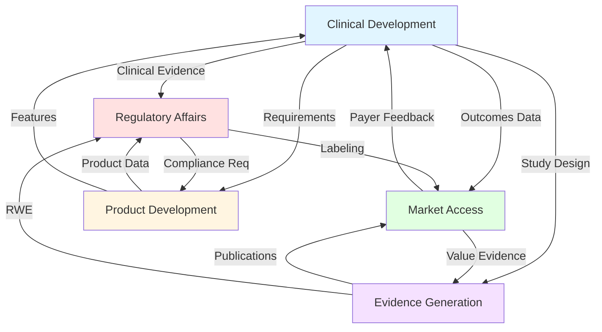

# Digital Health Prompt Library: 50 Use Cases Comprehensive Map
## Version 1.0 | Life Sciences Intelligence Prompt Library (LSIPL)

---

## 📋 Table of Contents
1. [Executive Overview](#executive-overview)
2. [Organizational Architecture](#organizational-architecture)
3. [Use Case Taxonomy](#use-case-taxonomy)
4. [Cross-Functional Relationship Map](#cross-functional-relationship-map)
5. [Detailed Use Case Catalog](#detailed-use-case-catalog)
6. [Integration Patterns](#integration-patterns)
7. [Workflow Examples](#workflow-examples)

---

## 🎯 Executive Overview

### Purpose
This document provides a comprehensive map of 50 specialized use cases within the Digital Health Prompt Library, designed to support life sciences professionals across the entire digital therapeutics (DTx) and digital health product lifecycle.

### Scope
**Total Use Cases:** 50  
**Functional Domains:** 5  
**Complexity Levels:** Basic, Intermediate, Advanced, Expert  
**Target Users:** Clinical Development, Regulatory Affairs, Market Access, Product Development, Evidence Generation teams

### Key Metrics
- **Coverage:** End-to-end DTx/Digital Health lifecycle
- **Integration:** Cross-functional workflow support
- **Compliance:** FDA, EMA, HIPAA, 21 CFR Part 11
- **Quality Standard:** Industry gold standards (PRISM, Constitutional AI, OpenAI Best Practices)

---

## 🏗️ Organizational Architecture

### Hierarchical Structure

```
Digital Health Prompt Library (DHPL)
│
├── Clinical Development (CD) [10 Use Cases]
│   ├── Trial Design & Endpoints
│   ├── Biomarker Development
│   └── Protocol Development
│
├── Regulatory Affairs (RA) [10 Use Cases]
│   ├── FDA Pathways
│   ├── Documentation
│   └── Compliance
│
├── Commercial & Market Access (MA) [10 Use Cases]
│   ├── Payer Strategy
│   ├── Health Economics
│   └── Reimbursement
│
├── Product Development (PD) [10 Use Cases]
│   ├── Clinical Requirements
│   ├── UX/UI Design
│   └── Technical Implementation
│
└── Evidence Generation (EG) [10 Use Cases]
    ├── Real-World Evidence
    ├── Publications
    └── KOL Engagement
```

### Maturity Model by Domain

| Domain | Basic (1-2) | Intermediate (3-4) | Advanced (5-6) | Expert (7-10) |
|--------|-------------|-------------------|----------------|---------------|
| **Clinical Development** | 2 | 3 | 3 | 2 |
| **Regulatory Affairs** | 1 | 2 | 4 | 3 |
| **Market Access** | 2 | 4 | 2 | 2 |
| **Product Development** | 3 | 3 | 2 | 2 |
| **Evidence Generation** | 2 | 3 | 3 | 2 |

---

## 📊 Use Case Taxonomy

### Classification Framework

Each use case is classified using a 5-dimensional taxonomy:

```yaml
USE_CASE_ID: {DOMAIN}_{FUNCTION}_{SEQUENCE}
  Domain: [CD, RA, MA, PD, EG]
  Complexity: [BASIC, INTERMEDIATE, ADVANCED, EXPERT]
  Compliance_Level: [STANDARD, REGULATED, CLINICAL, CONFIDENTIAL]
  Pattern_Type: [COT, FEW_SHOT, RAG, ENSEMBLE, HYBRID]
  Stakeholder: [CLINICAL, REGULATORY, COMMERCIAL, TECHNICAL, SCIENTIFIC]
```

### Naming Convention

**Format:** `UC_{DOMAIN}_{SEQUENCE}`

**Examples:**
- `UC_CD_001`: Use Case - Clinical Development - Sequence 001
- `UC_RA_005`: Use Case - Regulatory Affairs - Sequence 005
- `UC_MA_010`: Use Case - Market Access - Sequence 010

---

## 🔄 Cross-Functional Relationship Map

### Primary Relationships



### Dependency Matrix

| From ↓ To → | CD | RA | MA | PD | EG |
|-------------|----|----|----|----|-------|
| **CD** | - | HIGH | MED | HIGH | HIGH |
| **RA** | MED | - | LOW | HIGH | LOW |
| **MA** | MED | LOW | - | LOW | HIGH |
| **PD** | HIGH | MED | LOW | - | LOW |
| **EG** | HIGH | MED | HIGH | LOW | - |

**Legend:**
- **HIGH:** Critical dependency, frequent interaction
- **MED:** Moderate dependency, periodic interaction
- **LOW:** Minimal dependency, occasional interaction

---

## 📚 Detailed Use Case Catalog

---

## 🔬 Clinical Development Use Cases (UC_CD)

### Overview
**Total Use Cases:** 10  
**Purpose:** Support clinical trial design, endpoint selection, and protocol development for digital health products  
**Primary Stakeholders:** Clinical Scientists, Biostatisticians, Medical Directors

---

### UC_CD_001: DTx Clinical Endpoint Selection
**Complexity:** EXPERT  
**Pattern:** FEW_SHOT_WITH_COT  
**Dependencies:** None (Foundation)

**Description:**
Comprehensive guidance for selecting primary and secondary clinical endpoints for digital therapeutic interventions, aligned with FDA expectations and clinical meaningfulness.

**Input Requirements:**
- DTx product description
- Target indication
- Mechanism of action
- Patient population
- Treatment duration
- Standard of care

**Output Deliverables:**
- Primary endpoint recommendation with rationale
- Secondary endpoint hierarchy
- Digital biomarker opportunities
- Comparator selection strategy
- Statistical considerations
- Regulatory risk assessment

**Key Features:**
✅ FDA precedent examples (reSET, Somryst, etc.)  
✅ MCID (Minimally Clinically Important Difference) guidance  
✅ PRO instrument validation requirements  
✅ Digital biomarker validation framework (V3)

**Related Use Cases:**
- `UC_CD_002` (Digital Biomarker Validation)
- `UC_CD_003` (RCT Design)
- `UC_RA_001` (FDA Software Classification)
- `UC_MA_007` (Comparative Effectiveness)

**Success Metrics:**
- FDA acceptance rate: >90%
- Expert validation score: >4.5/5
- Clinical meaningfulness rating: >95%

---

### UC_CD_002: Digital Biomarker Validation
**Complexity:** ADVANCED  
**Pattern:** COT_WITH_RAG  
**Dependencies:** `UC_CD_001`, `UC_PD_009`

**Description:**
Structured approach to validating digital biomarkers following the DiMe V3 framework (Verification, Analytical Validation, Clinical Validation).

**Input Requirements:**
- Digital biomarker description
- Data source (sensor, app, wearable)
- Clinical context of use
- Target population
- Measurement frequency

**Output Deliverables:**
- Verification protocol (technical performance)
- Analytical validation plan (measurement accuracy)
- Clinical validation strategy (clinical utility)
- Regulatory interaction roadmap
- Timeline and resource estimates

**Validation Framework:**
```
V3 Framework Stages:
1. Verification (Technical)
   - Accuracy, precision, reliability
   - Device/sensor performance
   
2. Analytical Validation
   - Construct validity
   - Criterion validity
   - Reliability (test-retest)
   
3. Clinical Validation
   - Association with clinical outcomes
   - Predictive validity
   - Clinical utility
```

**Related Use Cases:**
- `UC_CD_001` (Endpoint Selection)
- `UC_PD_009` (AI/ML Model Validation)
- `UC_RA_002` (510(k) vs De Novo)
- `UC_EG_001` (RWE Study Design)

**Regulatory Considerations:**
- FDA Digital Health Center of Excellence guidance
- 21st Century Cures Act provisions
- Real-World Evidence framework

---

### UC_CD_003: RCT Design for DTx
**Complexity:** ADVANCED  
**Pattern:** COT_WITH_CHECKLIST  
**Dependencies:** `UC_CD_001`, `UC_CD_004`

**Description:**
Comprehensive randomized controlled trial (RCT) design specifically tailored for digital therapeutic interventions, addressing unique challenges like blinding, engagement, and digital endpoints.

**Input Requirements:**
- Clinical hypothesis
- Primary endpoint
- Target population
- Intervention duration
- Available resources

**Output Deliverables:**
- Complete RCT design recommendation
- Randomization strategy
- Blinding approach (double-blind, sham control)
- Sample size calculation
- Statistical analysis plan outline
- Enrollment and retention strategies

**Design Considerations:**
- **Blinding Challenges:** Sham app design to maintain double-blind
- **Engagement:** Strategies to ensure adherence
- **Attrition:** Digital trials often face 30-40% dropout
- **Intent-to-Treat:** Handling missing data
- **Per-Protocol:** Engagement threshold definitions

**Related Use Cases:**
- `UC_CD_001` (Endpoint Selection)
- `UC_CD_004` (Comparator Selection)
- `UC_CD_007` (Sample Size Calculation)
- `UC_CD_010` (Protocol Development)

---

### UC_CD_004: Comparator Selection Strategy
**Complexity:** INTERMEDIATE  
**Pattern:** FEW_SHOT  
**Dependencies:** `UC_CD_003`

**Description:**
Strategic guidance for selecting appropriate comparators in DTx clinical trials (placebo, sham app, standard of care, active control).

**Input Requirements:**
- Indication and severity
- Standard of care options
- Blinding requirements
- Regulatory pathway (FDA, EMA)

**Output Deliverables:**
- Recommended comparator with rationale
- Blinding strategy
- Regulatory acceptability assessment
- Risk mitigation for comparator challenges
- Alternative comparator options

**Comparator Options Matrix:**

| Comparator | Pros | Cons | Best For | FDA View |
|------------|------|------|----------|----------|
| **Sham App** | Maintains blinding | Development cost | De Novo, 510(k) | Preferred |
| **Waitlist** | Simple, cheap | Unblinded | Early research | Not preferred |
| **Treatment-as-Usual** | Real-world | Heterogeneous | Pragmatic trials | Acceptable |
| **Active Control** | Head-to-head | Large sample size | Non-inferiority | Acceptable |

**Related Use Cases:**
- `UC_CD_003` (RCT Design)
- `UC_RA_002` (Regulatory Pathways)

---

### UC_CD_005: PRO Instrument Selection
**Complexity:** INTERMEDIATE  
**Pattern:** RAG_OPTIMIZED  
**Dependencies:** `UC_CD_001`

**Description:**
Guidance for selecting validated Patient-Reported Outcome (PRO) instruments for digital health trials, ensuring regulatory compliance and clinical meaningfulness.

**Input Requirements:**
- Target indication
- Symptom domains to measure
- Patient population characteristics
- Measurement frequency
- Regulatory requirements

**Output Deliverables:**
- Recommended PRO instruments (primary & secondary)
- Psychometric properties summary
- Regulatory precedent examples
- Licensing and usage considerations
- Digital adaptation requirements

**PRO Selection Criteria:**
1. **Content Validity:** Measures what matters to patients
2. **Construct Validity:** Aligns with theoretical framework
3. **Reliability:** Consistent measurement (α >0.70)
4. **Responsiveness:** Sensitive to change over time
5. **MCID:** Established threshold for meaningful change
6. **Regulatory Precedent:** FDA/EMA acceptance history

**Related Use Cases:**
- `UC_CD_001` (Endpoint Selection)
- `UC_RA_004` (Pre-Sub Meeting Prep)

---

### UC_CD_006: Adaptive Trial Design
**Complexity:** EXPERT  
**Pattern:** ENSEMBLE  
**Dependencies:** `UC_CD_003`, `UC_CD_007`

**Description:**
Advanced guidance for implementing adaptive trial designs in DTx studies, including sample size re-estimation, interim analyses, and response-adaptive randomization.

**Input Requirements:**
- Clinical hypothesis
- Preliminary effect size estimates
- Resource constraints
- Risk tolerance
- Regulatory appetite for adaptive design

**Output Deliverables:**
- Adaptive design recommendation (Type 1, 2, or 3)
- Decision rules and stopping boundaries
- Statistical analysis plan for adaptation
- Regulatory strategy (FDA Type C meeting)
- Simulation results and operating characteristics

**Adaptive Design Types:**
- **Type 1:** Sample size re-estimation
- **Type 2:** Interim futility/efficacy stopping
- **Type 3:** Response-adaptive randomization

**Regulatory Considerations:**
- FDA Guidance: "Adaptive Designs for Clinical Trials of Drugs and Biologics" (2019)
- Control of Type I error
- Operational bias mitigation

**Related Use Cases:**
- `UC_CD_003` (RCT Design)
- `UC_CD_007` (Sample Size Calculation)
- `UC_RA_004` (Pre-Sub Meeting)

---

### UC_CD_007: Sample Size Calculation for DTx
**Complexity:** INTERMEDIATE  
**Pattern:** COT  
**Dependencies:** `UC_CD_001`, `UC_CD_003`

**Description:**
Specialized sample size calculation for digital therapeutic trials, accounting for unique factors like high attrition, engagement variability, and digital endpoints.

**Input Requirements:**
- Primary endpoint and effect size
- Expected attrition rate (typically 25-40% for DTx)
- Statistical power target (80% or 90%)
- Alpha level (typically 0.05)
- Analysis approach (ANCOVA, mixed models, etc.)

**Output Deliverables:**
- Required sample size (per arm)
- Sensitivity analysis (varying assumptions)
- Enrollment timeline estimate
- Budget implications
- Attrition mitigation strategies

**DTx-Specific Considerations:**
- **High Attrition:** Plan for 30-40% dropout (vs 15-20% in traditional trials)
- **Engagement Variability:** Per-protocol analysis threshold
- **Digital Endpoints:** Potentially more frequent measurement = higher power
- **Crossover/Contamination:** Control group accessing similar apps

**Sample Size Formula (Simplified):**
```
N = 2 × [(Zα/2 + Zβ) × σ / Δ]² × (1 / (1 - attrition_rate))

Where:
- Zα/2 = 1.96 (for α = 0.05, two-sided)
- Zβ = 0.84 (for 80% power) or 1.28 (for 90% power)
- σ = standard deviation
- Δ = expected difference (effect size)
- attrition_rate = expected dropout (e.g., 0.35)
```

**Related Use Cases:**
- `UC_CD_001` (Endpoint Selection)
- `UC_CD_003` (RCT Design)
- `UC_CD_006` (Adaptive Design)

---

### UC_CD_008: Engagement Metrics as Endpoints
**Complexity:** ADVANCED  
**Pattern:** COT_WITH_RAG  
**Dependencies:** `UC_CD_001`, `UC_PD_005`

**Description:**
Framework for incorporating engagement metrics (app usage, session frequency, module completion) as exploratory or secondary endpoints in DTx trials.

**Input Requirements:**
- DTx product features
- Engagement data available
- Clinical hypothesis (mechanism of action)
- Primary clinical endpoint
- Expected dose-response relationship

**Output Deliverables:**
- Engagement metric definitions
- Analysis plan (mediation, dose-response)
- Regulatory positioning (exploratory vs secondary)
- Interpretation guidelines
- Risk assessment for FDA acceptance

**Engagement Metric Categories:**
1. **Frequency Metrics:** Sessions per week, days active
2. **Duration Metrics:** Time spent in app, session length
3. **Content Metrics:** Modules completed, exercises done
4. **Interaction Metrics:** User-generated content, chat messages

**Statistical Approaches:**
- **Mediation Analysis:** Does engagement mediate the effect on clinical outcomes?
- **Dose-Response:** Higher engagement → better outcomes?
- **Threshold Analysis:** Minimum engagement needed for efficacy?

**FDA Perspective:**
⚠️ Engagement alone is NOT sufficient for effectiveness claims  
✅ Engagement can support mechanism of action  
✅ Dose-response relationship strengthens causality argument

**Related Use Cases:**
- `UC_CD_001` (Endpoint Selection)
- `UC_PD_005` (Engagement Feature Optimization)
- `UC_EG_001` (RWE Study Design)

---

### UC_CD_009: Subgroup Analysis Planning
**Complexity:** INTERMEDIATE  
**Pattern:** COT  
**Dependencies:** `UC_CD_003`

**Description:**
Structured approach to planning subgroup analyses in DTx trials, addressing heterogeneity of treatment effects and supporting personalized medicine claims.

**Input Requirements:**
- Trial design and sample size
- Hypothesized effect modifiers
- Regulatory requirements
- Statistical power for subgroups

**Output Deliverables:**
- Pre-specified subgroup analysis plan
- Statistical methods for interaction testing
- Multiple comparison adjustment strategy
- Interpretation guidelines
- Regulatory positioning

**Common Subgroups in DTx:**
- **Demographics:** Age, sex, race/ethnicity
- **Disease Severity:** Mild, moderate, severe
- **Comorbidities:** Presence/absence of specific conditions
- **Prior Treatments:** Treatment-naïve vs experienced
- **Engagement Level:** High vs low engagers
- **Digital Literacy:** Tech-savvy vs novice users

**Statistical Considerations:**
- **Pre-specification:** All subgroup analyses MUST be pre-specified to avoid data dredging
- **Interaction Testing:** Test for subgroup × treatment interaction (p <0.10 threshold)
- **Multiple Comparisons:** Bonferroni or false discovery rate adjustment
- **Power:** Subgroup analyses are typically underpowered; avoid over-interpretation

**Regulatory Guidance:**
- FDA: "Collection of Race and Ethnicity Data in Clinical Trials" (2016)
- EMA: "Guideline on the Investigation of Subgroups in Confirmatory Clinical Trials" (2019)

**Related Use Cases:**
- `UC_CD_003` (RCT Design)
- `UC_CD_007` (Sample Size Calculation)

---

### UC_CD_010: Clinical Trial Protocol Development
**Complexity:** ADVANCED  
**Pattern:** STRUCTURED_GENERATION  
**Dependencies:** `UC_CD_001` through `UC_CD_009`

**Description:**
Comprehensive clinical trial protocol development for DTx studies, following ICH E6 (GCP) and ICH E8 (General Considerations for Clinical Trials) guidelines.

**Input Requirements:**
- Study objectives and hypotheses
- Endpoint selections (primary, secondary)
- Trial design (RCT, adaptive, etc.)
- Sample size and duration
- Regulatory strategy

**Output Deliverables:**
- Complete protocol draft (ICH E6 compliant)
- Protocol synopsis
- Schedule of assessments
- Statistical analysis plan outline
- Informed consent template

**Protocol Structure (ICH E6):**
```
1. Title Page
2. Protocol Synopsis
3. Table of Contents
4. List of Abbreviations
5. Responsible Parties
6. Background & Rationale
7. Objectives & Endpoints
8. Trial Design
9. Study Population
   9.1 Inclusion Criteria
   9.2 Exclusion Criteria
10. Intervention/Investigational Product
11. Study Procedures
12. Safety Assessments
13. Statistical Considerations
14. Data Management
15. Quality Assurance
16. Ethical Considerations
17. Publication Policy
18. References
19. Appendices
```

**DTx-Specific Protocol Sections:**
- **Digital Intervention Description:** Features, algorithms, behavioral techniques
- **Engagement Monitoring:** Real-time usage data, alerts for non-adherence
- **Technical Support:** Help desk, troubleshooting procedures
- **Data Security:** HIPAA compliance, encryption, data breach protocols
- **Device Requirements:** Compatible devices, internet access needs

**Related Use Cases:**
- ALL Clinical Development use cases (UC_CD_001-009)
- `UC_RA_004` (Pre-Sub Meeting Prep)
- `UC_PD_001` (Clinical Requirements)

**Quality Standards:**
- ICH E6 (R2) Good Clinical Practice
- ICH E8 General Considerations for Clinical Trials
- ICH E9 Statistical Principles for Clinical Trials

---

## 📋 Regulatory Affairs Use Cases (UC_RA)

### Overview
**Total Use Cases:** 10  
**Purpose:** Navigate FDA/EMA regulatory pathways for digital health products  
**Primary Stakeholders:** Regulatory Affairs Managers, Quality Assurance, Legal/Compliance

---

### UC_RA_001: FDA Software Classification (SaMD)
**Complexity:** INTERMEDIATE  
**Pattern:** DECISION_TREE  
**Dependencies:** None (Foundation)

**Description:**
Systematic approach to determining whether a digital health product meets FDA's definition of Software as a Medical Device (SaMD) and requires regulatory oversight.

**Input Requirements:**
- Product description and features
- Intended use statement
- Target user (patient, clinician, etc.)
- Clinical claims or indications
- Data processing/analysis functions

**Output Deliverables:**
- SaMD classification (Yes/No)
- If Yes: Device class determination (I, II, III)
- Regulatory pathway recommendation
- Rationale with FDA guidance citations
- Risk assessment

**FDA Classification Framework:**

```
Decision Tree:
1. Does it meet definition of "device" under FD&C Act Section 201(h)?
   ├─ No → Not regulated as device
   └─ Yes → Continue
   
2. Does it fall under enforcement discretion (FDA Guidance 2019)?
   ├─ Yes → Low risk, not enforced
   └─ No → Continue
   
3. What is the intended use?
   ├─ Diagnosis/Treatment → Likely Class II or III
   ├─ Prevention/Monitoring → Likely Class I or II
   └─ Wellness only → May be enforcement discretion
   
4. What is the risk level?
   ├─ High risk (serious injury/death) → Class III (PMA)
   ├─ Moderate risk → Class II (510(k) or De Novo)
   └─ Low risk → Class I (exempt or 510(k))
```

**Key FDA Guidance Documents:**
- "Clinical Decision Support Software" (2019)
- "Policy for Device Software Functions and Mobile Medical Applications" (2019)
- "Software as a Medical Device (SAMD): Clinical Evaluation" (2017)

**Examples by Classification:**

| Product Type | SaMD? | Class | Pathway |
|--------------|-------|-------|---------|
| Wellness app (no clinical claims) | No | N/A | Enforcement discretion |
| Clinical decision support (diagnostic) | Yes | II | 510(k) or De Novo |
| DTx with therapeutic claims | Yes | II | De Novo typically |
| AI diagnostic (high risk) | Yes | II/III | De Novo or PMA |

**Related Use Cases:**
- `UC_RA_002` (510(k) vs De Novo)
- `UC_RA_003` (Predicate Identification)
- `UC_PD_008` (HIPAA Compliance)

---

### UC_RA_002: 510(k) vs De Novo Pathway Determination
**Complexity:** ADVANCED  
**Pattern:** COT_WITH_PRECEDENT  
**Dependencies:** `UC_RA_001`

**Description:**
Strategic determination of optimal FDA premarket pathway for digital health medical devices: Traditional 510(k), Special 510(k), or De Novo classification.

**Input Requirements:**
- Device description and intended use
- SaMD classification (from UC_RA_001)
- Available predicate devices
- Novelty assessment
- Clinical data available

**Output Deliverables:**
- Recommended regulatory pathway
- Predicate device analysis (if 510(k))
- Rationale and risk assessment
- Data requirements gap analysis
- Timeline and cost estimates
- Contingency plans

**Pathway Decision Matrix:**

| Criteria | Traditional 510(k) | Special 510(k) | De Novo |
|----------|-------------------|----------------|---------|
| **Predicate Exists** | ✅ Required | ✅ Required | ❌ No predicate |
| **Modification Type** | N/A | Design changes to own device | N/A |
| **Novel Technology** | ❌ No | ❌ No | ✅ Yes |
| **Clinical Data** | Usually not required | Usually not required | Often required |
| **Review Time** | 90-180 days | 30 days | 150+ days |
| **Risk Level** | Class I/II | Class I/II | Class I/II (low-moderate) |

**De Novo Pathway (Most Common for DTx):**

**Eligibility Criteria:**
1. No legally marketed predicate device
2. Low to moderate risk (Class I or II)
3. General controls (Class I) or special controls (Class II) provide reasonable assurance of safety and effectiveness

**Process:**
1. Submit De Novo request with data
2. FDA reviews (target 150 days, often longer)
3. If granted: Device becomes new Class I/II classification
4. Future devices can use as 510(k) predicate

**DTx Precedent Examples:**

| Product | Indication | Pathway | K/DEN Number | Year |
|---------|------------|---------|--------------|------|
| reSET | Substance Use Disorder | De Novo | DEN170078 | 2017 |
| reSET-O | Opioid Use Disorder | De Novo | DEN180056 | 2018 |
| Somryst | Chronic Insomnia | De Novo | DEN190033 | 2020 |
| EndeavorRx | Pediatric ADHD | De Novo | DEN180005 | 2020 |

**Related Use Cases:**
- `UC_RA_001` (SaMD Classification)
- `UC_RA_003` (Predicate Identification)
- `UC_RA_004` (Pre-Sub Meeting)
- `UC_CD_010` (Protocol Development)

---

### UC_RA_003: Predicate Device Identification
**Complexity:** ADVANCED  
**Pattern:** RAG_WITH_SEARCH  
**Dependencies:** `UC_RA_002`

**Description:**
Systematic identification and analysis of potential predicate devices for 510(k) submissions, establishing substantial equivalence arguments.

**Input Requirements:**
- Device description
- Intended use
- Technological characteristics
- Performance specifications
- Clinical indications

**Output Deliverables:**
- 3-5 predicate device candidates
- Substantial equivalence analysis matrix
- Primary and secondary predicate recommendations
- Technological differences assessment
- Risk mitigation for differences

**Substantial Equivalence Criteria:**

**Must Have:**
1. **Same intended use** (or more specific use)
2. **Same technological characteristics** OR
3. **Different technological characteristics** BUT:
   - Does not raise new safety/effectiveness questions
   - Demonstrates equivalent safety/effectiveness

**Search Strategy:**
1. FDA 510(k) database search
2. FDA product classification database
3. Identify product code
4. Search by intended use keywords
5. Review K-summaries for similarity

**Substantial Equivalence Matrix:**

| Comparison Factor | Your Device | Predicate 1 | Predicate 2 | Assessment |
|-------------------|-------------|-------------|-------------|------------|
| Intended Use | [description] | [description] | [description] | Same/Different |
| Technology | [type] | [type] | [type] | Same/Different |
| Performance | [specs] | [specs] | [specs] | Equivalent/Different |
| Clinical Data | [summary] | [summary] | [summary] | Comparable? |

**Related Use Cases:**
- `UC_RA_002` (Pathway Determination)
- `UC_RA_004` (Pre-Sub Meeting)

---

### UC_RA_004: Pre-Submission Meeting Preparation
**Complexity:** INTERMEDIATE  
**Pattern:** STRUCTURED_TEMPLATE  
**Dependencies:** `UC_RA_001`, `UC_RA_002`

**Description:**
Comprehensive preparation for FDA Pre-Submission (Pre-Sub) meetings (formerly called Pre-IDE or Pre-IND meetings), maximizing value from FDA feedback.

**Input Requirements:**
- Device/product description
- Proposed regulatory strategy
- Specific questions for FDA
- Clinical development plan
- Data available

**Output Deliverables:**
- Pre-Sub meeting request package
- Question list (prioritized)
- Background materials
- Meeting agenda proposal
- Follow-up strategy

**Pre-Sub Meeting Types:**

1. **Q-Submission (Q-Sub):**
   - Feedback on specific questions
   - No meeting required
   - 75-day response time
   - Best for focused questions

2. **Pre-Submission Meeting:**
   - Face-to-face or teleconference
   - Broader strategic discussions
   - 75 days to schedule + 30 days prep time
   - Best for complex issues

**Recommended Topics:**

**High Priority (Always Include):**
- [ ] Regulatory pathway confirmation (510(k), De Novo, PMA)
- [ ] Clinical endpoint acceptability
- [ ] Clinical study design (RCT design, comparator)
- [ ] Statistical analysis approach

**Medium Priority (Include if Applicable):**
- [ ] Predicate device acceptability
- [ ] Biocompatibility testing requirements
- [ ] Software validation documentation
- [ ] Cybersecurity requirements
- [ ] Special controls (for De Novo)

**Lower Priority (If Time Permits):**
- [ ] Labeling considerations
- [ ] Post-market surveillance plan
- [ ] International harmonization

**Question Formulation Best Practices:**
✅ **Good Question:** "Does FDA agree that the PHQ-9 change score at week 12 is an acceptable primary endpoint for our DTx targeting MDD, given precedent with similar digital interventions?"

❌ **Poor Question:** "What endpoint should we use?"

**Meeting Package Components:**
1. **Cover Letter** (1 page)
2. **Question List** (prioritized, 5-10 questions max)
3. **Background Section** (10-15 pages)
   - Device description
   - Intended use
   - Technology overview
   - Regulatory precedent
   - Proposed clinical study
4. **Appendices** (supporting data, references)

**Timeline:**
- Submit Pre-Sub request: Day 0
- FDA acknowledges: Day 5-10
- FDA response: Day 75
- Meeting scheduled: Day 75-105
- Meeting occurs: Day 105-135

**Related Use Cases:**
- `UC_RA_002` (Pathway Determination)
- `UC_CD_010` (Protocol Development)

---

### UC_RA_005: Clinical Evaluation Report (CER)
**Complexity:** ADVANCED  
**Pattern:** STRUCTURED_GENERATION  
**Dependencies:** `UC_CD_010`, `UC_EG_009`

**Description:**
Development of Clinical Evaluation Reports (CER) for medical devices, required for CE Mark (EU MDR) and increasingly expected by FDA for novel DTx.

**Input Requirements:**
- Device description and specifications
- Clinical data (trials, literature, PMCF)
- Risk analysis
- Intended use and claims
- Regulatory requirements (EU MDR, FDA)

**Output Deliverables:**
- Complete CER document (MEDDEV 2.7/1 Rev 4 compliant)
- Clinical data summary tables
- Risk-benefit analysis
- Conformity assessment
- Literature review methodology

**CER Structure (EU MDR Article 61):**

```
1. Executive Summary
2. Scope of CER
3. Clinical Background
   3.1 Disease/Condition
   3.2 Current Management
   3.3 Unmet Need
4. Device Description
   4.1 Technical Specifications
   4.2 Intended Use/Indications
   4.3 Claims
5. Clinical Development Plan
6. Clinical Data
   6.1 Clinical Investigations
   6.2 Literature Review
   6.3 PMCF Data
7. Analysis of Clinical Data
   7.1 Safety Analysis
   7.2 Performance Analysis
   7.3 Benefit-Risk Determination
8. Conclusions
9. References
10. Appendices
```

**Clinical Data Hierarchy (Preferred Order):**
1. **Clinical Investigations:** RCTs, observational studies (own device)
2. **Equivalent Device Data:** Clinical data from substantially equivalent devices
3. **Literature Review:** Systematic review of published studies
4. **PMCF:** Post-Market Clinical Follow-up data

**MEDDEV 2.7/1 Rev 4 Requirements:**
- Systematic literature review methodology
- Appraisal of each study (validity, relevance)
- Data extraction and synthesis
- Addressing all risks identified in risk analysis

**Related Use Cases:**
- `UC_CD_010` (Protocol Development)
- `UC_EG_009` (Systematic Review)
- `UC_RA_007` (International Harmonization)

---

### UC_RA_006: FDA Breakthrough Designation Strategy
**Complexity:** EXPERT  
**Pattern:** COT_WITH_CRITERIA  
**Dependencies:** `UC_CD_001`, `UC_RA_002`

**Description:**
Strategic assessment and application for FDA Breakthrough Device Designation, which provides expedited review and interactive communication with FDA.

**Input Requirements:**
- Device description
- Indication (must be life-threatening or irreversibly debilitating)
- Clinical data or preliminary evidence
- Unmet medical need assessment
- Comparison to existing treatments

**Output Deliverables:**
- Breakthrough Designation application
- Eligibility assessment
- Unmet need justification
- Clinical data summary
- Preliminary data (if available)
- Expedited pathway strategy

**Breakthrough Designation Criteria (ALL Required):**

1. **Life-Threatening or Irreversibly Debilitating Disease/Condition**
   - Examples: Cancer, stroke, heart failure, Alzheimer's, SUD with overdose risk

2. **Device Provides More Effective Treatment or Diagnosis**
   - Compared to standard of care
   - Must be significant improvement

3. **Device Availability in Best Interest of Patients**
   - Unmet need
   - No adequate alternatives

4. **Preliminary Clinical Evidence** (at least ONE):
   - Clinical data (early trial results)
   - Non-clinical data (bench, animal studies)
   - Other relevant information

**Benefits of Breakthrough Designation:**
✅ Priority review (faster than standard)  
✅ Interactive communication with FDA (more frequent meetings)  
✅ Senior FDA management engagement  
✅ Guidance on efficient clinical trial design  
✅ Organizational commitment from FDA

**DTx Breakthrough Examples:**
- **EndeavorRx (Akili):** Pediatric ADHD - GRANTED (2018)
- **reSET-O (Pear Therapeutics):** Opioid Use Disorder - GRANTED (2017)

**Application Strategy:**
1. Submit Breakthrough Device Designation request
2. FDA reviews within 60 days
3. If granted: Establish Sprint discussions (recurring FDA meetings)
4. Leverage for clinical trial guidance
5. Utilize for expedited 510(k)/De Novo review

**Related Use Cases:**
- `UC_RA_002` (Pathway Determination)
- `UC_RA_004` (Pre-Sub Meeting)
- `UC_CD_001` (Endpoint Selection)

---

### UC_RA_007: International Harmonization Strategy
**Complexity:** EXPERT  
**Pattern:** MULTI_JURISDICTIONAL  
**Dependencies:** `UC_RA_001` through `UC_RA_006`

**Description:**
Strategic approach to harmonizing regulatory submissions across FDA (US), EMA (EU), PMDA (Japan), Health Canada, and other global regulatory bodies.

**Input Requirements:**
- Target markets (US, EU, Japan, etc.)
- Product classification by jurisdiction
- Clinical data available
- Timeline and resource constraints
- Market prioritization

**Output Deliverables:**
- Multi-jurisdictional regulatory strategy
- Harmonized clinical development plan
- Submission sequencing recommendation
- Data sharing opportunities
- Risk assessment by jurisdiction

**Regulatory Landscape Comparison:**

| Aspect | FDA (US) | CE Mark (EU MDR) | PMDA (Japan) | Health Canada |
|--------|----------|------------------|--------------|---------------|
| **DTx Classification** | SaMD (Class I/II/III) | Medical Device (Class I/IIa/IIb/III) | Program Medical Device | Class I/II/III/IV |
| **Approval Pathway** | 510(k), De Novo, PMA | Conformity Assessment | Shonin | Medical Device License |
| **Clinical Data Req** | Varies (often RCT) | Clinical Evaluation Report | Often requires RCT | Similar to FDA |
| **Review Timeline** | 90-180 days (510k) | Varies by NB | 12-18 months | 75 days (Class II) |
| **Post-Market** | PMSR, MDR | PMCF, Vigilance | Re-examination | Mandatory reporting |

**Harmonization Opportunities:**

1. **Clinical Trial Design:**
   - Design ONE pivotal trial accepted by multiple agencies
   - Align endpoints with FDA, EMA, PMDA requirements
   - Example: Use PHQ-9 (accepted globally) for depression

2. **Data Sharing:**
   - FDA may accept EU clinical data (and vice versa)
   - IMDRF (International Medical Device Regulators Forum) guidance

3. **Quality Management:**
   - ISO 13485 accepted globally
   - IEC 62304 for software lifecycle

**Sequencing Strategy:**

**Parallel Approach (Fastest Time to Market):**
- Submit to FDA and EU simultaneously
- Higher resource requirement
- Fastest global launch

**Sequential Approach (Lower Risk):**
1. FDA first (De Novo establishes precedent)
2. CE Mark (leveraging FDA data)
3. Japan, Canada (leveraging FDA+EU data)

**Related Use Cases:**
- `UC_RA_001` through `UC_RA_006` (All RA use cases)
- `UC_CD_010` (Protocol Development)
- `UC_RA_005` (CER Development)

---

### UC_RA_008: Cybersecurity Documentation (FDA)
**Complexity:** ADVANCED  
**Pattern:** CHECKLIST_WITH_TEMPLATES  
**Dependencies:** `UC_PD_008`

**Description:**
Comprehensive cybersecurity documentation for FDA submissions, following FDA "Content of Premarket Submissions for Management of Cybersecurity in Medical Devices" (2023).

**Input Requirements:**
- Device architecture and data flow
- Cybersecurity risks identified
- Threat modeling results
- Cybersecurity controls implemented
- Software Bill of Materials (SBOM)

**Output Deliverables:**
- Cybersecurity Management Plan
- Threat Modeling Report
- Risk Assessment and Mitigation
- Software Bill of Materials (SBOM)
- Vulnerability Management Plan
- Incident Response Plan

**FDA Cybersecurity Requirements (2023 Guidance):**

**Pre-Market Requirements:**
1. **Cybersecurity Bill of Materials (CBOM)**
2. **Software Bill of Materials (SBOM)**
3. **Secure Product Development Framework (SPDF)**
4. **Vulnerability Management Plan**
5. **Security Risk Management**

**Key Documentation Sections:**

**1. Threat Modeling:**
- Identify assets (data, functions)
- Identify threats (STRIDE model)
- Assess vulnerabilities
- Determine risk level
- Mitigations implemented

**2. Cybersecurity Controls:**
- Authentication (user login)
- Authorization (role-based access)
- Encryption (data at rest, in transit)
- Audit logging
- Secure communications (TLS 1.2+)
- Vulnerability patching process

**3. Software Bill of Materials (SBOM):**
```json
{
  "component": "OpenSSL",
  "version": "1.1.1",
  "license": "Apache 2.0",
  "known_vulnerabilities": "CVE-2021-XXXX (patched)"
}
```

**Related Use Cases:**
- `UC_PD_008` (Data Privacy Architecture)
- `UC_RA_002` (Regulatory Pathways)

---

### UC_RA_009: Software Validation Documentation
**Complexity:** ADVANCED  
**Pattern:** STRUCTURED_TEMPLATE  
**Dependencies:** `UC_PD_001`, `UC_PD_009`

**Description:**
Comprehensive software validation documentation following FDA guidance and IEC 62304 standards for software lifecycle processes.

**Input Requirements:**
- Software description and architecture
- Intended use and risk classification
- Software requirements specifications
- Verification and validation testing results
- Change control procedures

**Output Deliverables:**
- Software Requirements Specification (SRS)
- Software Design Specification (SDS)
- Verification and Validation (V&V) Plan
- Test Protocols and Reports
- Traceability Matrix
- Software Development Lifecycle documentation

**FDA Guidance:**
- "General Principles of Software Validation" (2002)
- "Content of Premarket Submissions for Software Contained in Medical Devices" (2005)
- "Software as a Medical Device (SAMD): Clinical Evaluation" (2017)

**IEC 62304 Software Lifecycle:**
```
1. Software Development Planning
2. Software Requirements Analysis
3. Software Architectural Design
4. Software Detailed Design
5. Software Unit Implementation and Verification
6. Software Integration and Testing
7. Software System Testing
8. Software Release
```

**Traceability Matrix Example:**

| Req ID | Requirement | Design | Code | Test Case | Result |
|--------|-------------|--------|------|-----------|--------|
| SRS-001 | User login with password | SDS-005 | Module_Auth | TC-001 | PASS |
| SRS-002 | PHQ-9 scoring algorithm | SDS-012 | Module_PHQ9 | TC-015 | PASS |

**Risk-Based Approach:**
- **Class A (Low Risk):** Minimal documentation
- **Class B (Medium Risk):** Moderate documentation (most DTx)
- **Class C (High Risk):** Comprehensive documentation

**Related Use Cases:**
- `UC_PD_001` (Clinical Requirements)
- `UC_PD_009` (AI/ML Validation)
- `UC_RA_002` (Regulatory Pathways)

---

### UC_RA_010: Post-Market Surveillance Planning
**Complexity:** INTERMEDIATE  
**Pattern:** COT_WITH_CHECKLIST  
**Dependencies:** `UC_RA_002`, `UC_EG_001`

**Description:**
Development of Post-Market Surveillance (PMS) plans to monitor device safety and effectiveness after market authorization, satisfying FDA and EU MDR requirements.

**Input Requirements:**
- Device risk classification
- Identified risks and mitigation measures
- Market size and user population
- Regulatory requirements (FDA, EU MDR)
- Available data sources

**Output Deliverables:**
- Post-Market Surveillance Plan
- Data collection procedures
- Analysis and reporting schedule
- Adverse event monitoring system
- PMCF (EU) or PMSR (FDA) protocol

**FDA Post-Market Requirements:**

**All Devices:**
- Medical Device Reporting (MDR) - Report deaths, serious injuries, malfunctions
- Corrections and Removals reporting

**Section 522 Studies (if required):**
- FDA can require post-market surveillance for Class II/III devices
- Typically for novel devices or new indications

**EU MDR Post-Market Requirements:**

**Post-Market Surveillance (PMS) System:**
- Continuous monitoring
- Annual PMS Report

**Post-Market Clinical Follow-up (PMCF):**
- Proactive clinical data collection
- PMCF Plan (required before CE Mark)
- PMCF Report (annual)

**Surveillance Data Sources:**
1. **Adverse Event Reports** (passive)
2. **User Registries** (active enrollment)
3. **Claims Data** (insurance, EHR)
4. **In-App Data Collection** (digital health advantage)
5. **Surveys** (patient-reported outcomes)

**Example PMCF Protocol:**
```
Objective: Monitor long-term safety and effectiveness of DTx for depression

Population: All commercial users (real-world)

Data Collection:
- PHQ-9 scores (monthly)
- Adverse events (continuous monitoring)
- App usage data (automated)
- User satisfaction surveys (quarterly)

Analysis: Annual aggregate analysis

Reporting: Annual PMCF report to Notified Body
```

**Related Use Cases:**
- `UC_EG_001` (RWE Study Design)
- `UC_EG_004` (Patient Registry Design)

---

## 💼 Commercial & Market Access Use Cases (UC_MA)

### Overview
**Total Use Cases:** 10  
**Purpose:** Support payer strategy, reimbursement, and market access for digital health products  
**Primary Stakeholders:** Market Access Directors, HEOR Teams, Payer Relations, Health Economists

---

### UC_MA_001: Payer Value Dossier Development
**Complexity:** EXPERT  
**Pattern:** STRUCTURED_GENERATION  
**Dependencies:** `UC_CD_001`, `UC_EG_007`, `UC_MA_002`

**Description:**
Comprehensive value dossier development for payer engagement, synthesizing clinical, economic, and real-world evidence to support reimbursement and formulary access.

**Input Requirements:**
- Product description and indication
- Clinical trial results
- Health economic model outputs
- Real-world evidence
- Competitive landscape
- Target payer audience (national, regional, commercial, Medicare)

**Output Deliverables:**
- Complete Value Dossier (50-100 pages)
- Executive Summary (2-3 pages)
- Evidence synthesis
- Budget impact analysis
- Cost-effectiveness results
- Real-world outcomes data
- Stakeholder perspectives (patients, providers)

**Value Dossier Structure:**

```
1. Executive Summary
   - Value proposition (1 page)
   - Key evidence highlights
   
2. Disease Overview
   - Epidemiology
   - Burden of illness
   - Unmet need
   - Current treatment landscape
   
3. Product Profile
   - Mechanism of action
   - Clinical differentiation
   - Patient population
   - Dosing/usage
   
4. Clinical Evidence
   - Efficacy data (RCT results)
   - Safety profile
   - Quality of life outcomes
   - Subgroup analyses
   
5. Economic Evidence
   - Cost-effectiveness analysis
   - Budget impact model
   - Return on investment
   - Total cost of care
   
6. Real-World Evidence
   - Observational studies
   - Registry data
   - Patient-reported outcomes
   - Adherence and persistence
   
7. Patient & Provider Perspectives
   - Patient satisfaction
   - Provider acceptance
   - Ease of use
   
8. Conclusion & Key Messages
   - Value summary
   - Access recommendations
   
9. Appendices
   - References
   - Technical details
```

**Payer Value Pillars:**
1. **Clinical Value:** Efficacy, safety, outcomes
2. **Economic Value:** Cost-effectiveness, budget impact
3. **Patient Value:** Quality of life, satisfaction, convenience
4. **Provider Value:** Ease of integration, workflow fit
5. **Societal Value:** Productivity, indirect costs

**DTx-Specific Considerations:**
- **Scalability:** Low marginal cost per patient (vs traditional therapy)
- **Accessibility:** 24/7 availability, no geographic barriers
- **Data Generation:** Real-time outcomes data for continuous evaluation
- **Personalization:** Adaptive algorithms, tailored content

**Related Use Cases:**
- `UC_MA_002` (Health Economics Model)
- `UC_MA_006` (Budget Impact Model)
- `UC_MA_007` (Comparative Effectiveness)
- `UC_EG_007` (Health Outcomes Research)

---

### UC_MA_002: Health Economics Model (DTx)
**Complexity:** EXPERT  
**Pattern:** QUANTITATIVE_MODELING  
**Dependencies:** `UC_CD_001`, `UC_MA_007`

**Description:**
Development of health economic models (cost-effectiveness, cost-utility) for digital therapeutics, adapted for unique DTx characteristics like scalability and real-time data.

**Input Requirements:**
- Clinical efficacy data (trial results)
- Treatment costs (development, delivery, support)
- Comparator costs
- Health state utilities (quality of life)
- Population characteristics
- Time horizon (typically 1-5 years for DTx)

**Output Deliverables:**
- Cost-Effectiveness Model (Markov or Decision Tree)
- Cost per QALY (Quality-Adjusted Life Year)
- Incremental Cost-Effectiveness Ratio (ICER)
- Sensitivity Analyses (one-way, probabilistic)
- Cost-Effectiveness Acceptability Curve
- Budget Impact Model integration
- Technical documentation

**Model Types:**

**1. Decision Tree Model**
- Best for: Short-term outcomes, acute conditions
- Example: DTx for smoking cessation (12-week program)

**2. Markov Model**
- Best for: Chronic conditions, long-term outcomes
- Example: DTx for depression (recurring states over 5 years)

**3. Discrete Event Simulation (DES)**
- Best for: Complex patient pathways
- Example: DTx with multiple intervention points

**DTx Cost-Effectiveness Framework:**

```
Perspective: Payer or Societal

Costs to Include:
- Development costs (amortized)
- Platform/infrastructure costs
- Patient onboarding costs
- Ongoing support (tech, clinical)
- Monitoring and data analysis
- Comparator costs (usual care, therapy)

Effectiveness Measures:
- QALYs (quality-adjusted life years)
- Clinical outcomes (symptom reduction)
- Functional outcomes (return to work)
- Reduced healthcare utilization

Time Horizon:
- Short-term: 1 year (for acute)
- Long-term: 5 years (for chronic)
- Lifetime (for serious conditions)
```

**ICER Calculation:**

```
ICER = (Cost_DTx - Cost_Comparator) / (QALY_DTx - QALY_Comparator)

Example:
Cost_DTx = $500 per patient
Cost_Comparator = $2,000 per patient (face-to-face therapy)
QALY_DTx = 0.75
QALY_Comparator = 0.70

ICER = ($500 - $2,000) / (0.75 - 0.70)
ICER = -$1,500 / 0.05
ICER = -$30,000 per QALY

Interpretation: DTx is DOMINANT (less costly, more effective)
```

**Willingness-to-Pay Thresholds:**
- **US:** $50,000 - $150,000 per QALY (informal)
- **UK (NICE):** £20,000 - £30,000 per QALY
- **WHO:** 1-3x GDP per capita

**Sensitivity Analysis:**
- **One-Way Sensitivity:** Vary each parameter individually
- **Probabilistic Sensitivity Analysis (PSA):** Monte Carlo simulation (1,000+ iterations)
- **Scenario Analysis:** Best case, worst case, base case

**Related Use Cases:**
- `UC_MA_001` (Value Dossier)
- `UC_MA_006` (Budget Impact Model)
- `UC_MA_007` (Comparative Effectiveness)

---

### UC_MA_003: CPT/HCPCS Code Strategy
**Complexity:** ADVANCED  
**Pattern:** REGULATORY_NAVIGATION  
**Dependencies:** `UC_RA_001`, `UC_MA_001`

**Description:**
Strategic approach to obtaining Current Procedural Terminology (CPT) codes or Healthcare Common Procedure Coding System (HCPCS) codes for digital health products to enable reimbursement.

**Input Requirements:**
- Product description and intended use
- Clinical service provided
- Provider workflow integration
- Existing code landscape
- Target payer mix (Medicare, commercial)

**Output Deliverables:**
- Code strategy recommendation (Category I, III, or HCPCS)
- Application package for new code
- Comparative code analysis
- Reimbursement pathway
- Timeline and success probability
- Interim billing strategies

**Code Types Overview:**

| Code Type | Description | Application Process | Reimbursement |
|-----------|-------------|---------------------|---------------|
| **Category I CPT** | Established procedures | AMA CPT Panel (18-24 mo) | Yes (if Medicare NCD) |
| **Category III CPT** | Emerging technologies | AMA CPT Panel (12-18 mo) | Limited/No |
| **HCPCS Level II** | Non-physician services, DME | CMS (6-12 mo) | Varies |
| **Unlisted Code** | Existing catch-all codes | None (use immediately) | Case-by-case |

**CPT Category I Requirements (ALL Required):**
1. **FDA Clearance/Approval** (510(k), De Novo, or PMA)
2. **Clinical Efficacy** (peer-reviewed publications, typically ≥2 studies)
3. **Distinct Service** (not duplicative of existing codes)
4. **Performed by Many Physicians** (national adoption)
5. **Provided to Many Patients** (not rare procedure)

**Application Process:**

**CPT Category I Application:**
1. **Submit Code Change Request** to AMA (due annually, Feb 1)
2. **CPT Editorial Panel Review** (3 meetings per year)
3. **RUC (Relative Value Update Committee) Review** (if approved)
4. **CMS Final Rule** (reimbursement rate set)
5. **Implementation** (January 1 following year)

**Total Timeline:** 18-24 months minimum

**DTx-Specific Challenges:**
- ❌ Most DTx do NOT meet Category I criteria (not yet widely adopted)
- ⚠️ Category III is more accessible but limited reimbursement
- ✅ HCPCS may be better for DTx (e.g., A-codes for "administrative" services)

**Precedent Examples:**

| DTx Product | Code Type | Code | Year | Status |
|-------------|-----------|------|------|--------|
| Remote Therapeutic Monitoring | Category III CPT | 98975-98977 | 2022 | Active |
| Principal Care Management | Category I CPT | 99424-99427 | 2022 | Active |
| Behavioral Health Integration | Category I CPT | 99484, 99492-99494 | 2017 | Active |

**Interim Billing Strategies (While Awaiting Code):**
1. **Unlisted Code:** Use existing unlisted code (e.g., 99499) with documentation
2. **Bundled Billing:** Include in evaluation and management (E/M) visit
3. **Cash Pay:** Direct-to-consumer until reimbursement established
4. **Value-Based Contracts:** Risk-sharing arrangements with payers

**Related Use Cases:**
- `UC_MA_001` (Value Dossier)
- `UC_MA_004` (Formulary Positioning)
- `UC_MA_008` (Value-Based Contracting)

---

### UC_MA_004: Formulary Positioning Strategy
**Complexity:** INTERMEDIATE  
**Pattern:** STRATEGIC_FRAMEWORK  
**Dependencies:** `UC_MA_001`, `UC_MA_003`

**Description:**
Strategic positioning of digital health products within payer formularies or benefit designs to optimize access and utilization.

**Input Requirements:**
- Product profile and evidence
- Competitive landscape
- Target payer types
- Clinical guidelines
- Cost comparison

**Output Deliverables:**
- Formulary positioning recommendation (tier placement)
- Access strategy (prior authorization, step therapy)
- Competitive differentiation messaging
- Payer negotiation talking points
- Utilization management recommendations

**Formulary Tier System (Typical):**

| Tier | Description | Patient Cost Share | Access Restrictions |
|------|-------------|-------------------|---------------------|
| **Tier 1 (Preferred)** | Generic, low-cost | Lowest copay ($5-15) | Minimal/None |
| **Tier 2 (Standard)** | Preferred brand | Medium copay ($20-50) | Some PA |
| **Tier 3 (Non-Preferred)** | Non-preferred brand | High copay ($50-100) | PA, Step Therapy |
| **Tier 4 (Specialty)** | High-cost specialty | Coinsurance (20-33%) | Strict PA |

**DTx Positioning Considerations:**

Most DTx aim for **Tier 2 or Medical Benefit** (not pharmacy):
- **Medical Benefit:** Covered like medical services (preferable for DTx)
- **Pharmacy Benefit:** Requires integration into pharmacy systems (challenging)

**Positioning Arguments:**

**For Preferred Status (Lower Tier):**
✅ Lower cost than alternatives (e.g., vs in-person therapy)  
✅ Guideline-recommended intervention  
✅ Strong clinical evidence (RCT with positive results)  
✅ Fills unmet need (access barriers to traditional care)  
✅ Positive payer experience (pilot programs)

**For Open Access (No PA):**
✅ Low-risk intervention (safe)  
✅ Broad patient population (not narrow indication)  
✅ Early intervention potential (prevent costly complications)

**Utilization Management Strategies:**

**Prior Authorization (PA) Criteria (if required):**
```
Example PA Criteria for DTx (Depression):

Approve if ALL criteria met:
1. Diagnosis: MDD per DSM-5
2. Severity: PHQ-9 score 10-19 (moderate)
3. Failed/Contraindication: Unable to access in-person therapy OR
   tried traditional therapy with inadequate response
4. Prescriber: Behavioral health provider or PCP
5. Duration: 12-week course (renewable with assessment)
```

**Step Therapy (if required):**
- Step 1: Try traditional therapy (if accessible)
- Step 2: DTx if Step 1 fails or not accessible

**Related Use Cases:**
- `UC_MA_001` (Value Dossier)
- `UC_MA_005` (P&T Presentation)
- `UC_MA_008` (Value-Based Contracting)

---

### UC_MA_005: P&T Committee Presentation
**Complexity:** ADVANCED  
**Pattern:** PERSUASIVE_COMMUNICATION  
**Dependencies:** `UC_MA_001`, `UC_MA_004`

**Description:**
Development of compelling Pharmacy & Therapeutics (P&T) Committee presentations to secure formulary approval for digital health products.

**Input Requirements:**
- Value dossier content
- Formulary position requested
- P&T committee composition
- Competitor landscape
- Payer-specific priorities

**Output Deliverables:**
- P&T slide deck (15-20 slides)
- Speaker notes
- Q&A preparation
- Clinical monograph
- Evidence summary tables

**P&T Presentation Structure:**

```
Slide Structure (15 slides, 20 minutes):

1. Title & Disclosures (1 min)
2. Agenda (30 sec)
3. Disease Burden & Unmet Need (2 min)
   - Epidemiology
   - Current treatment gaps
   - Member impact
4. Product Overview (2 min)
   - Mechanism of action
   - Differentiation
5. Clinical Evidence (5 min)
   - Pivotal trial design
   - Primary endpoint results
   - Safety profile
   - Subgroup data
6. Economic Evidence (4 min)
   - Cost-effectiveness
   - Budget impact
   - ROI projections
7. Real-World Evidence (2 min)
   - Utilization data
   - Adherence/persistence
8. Formulary Recommendation (2 min)
   - Tier placement requested
   - PA criteria (if any)
   - Clinical policy recommendations
9. Q&A (5 min)
10. Summary & Next Steps (1 min)
```

**Key Messaging Framework:**

**For P&T Committees (Decision Criteria):**
1. **Clinical Value:** Does it work? (efficacy, safety)
2. **Economic Value:** Is it cost-effective?
3. **Member Value:** Will patients use it? Satisfied?
4. **Operational Value:** Easy to implement?

**Anticipated Questions & Answers:**

**Q: How does this compare to existing therapies?**
A: [Provide head-to-head comparison or network meta-analysis]

**Q: What's the budget impact?**
A: [Show budget impact over 1, 3, 5 years with sensitivity analysis]

**Q: What utilization do you expect?**
A: [Conservative estimates based on epidemiology and market access]

**Q: What's the evidence quality?**
A: [GRADE assessment, RCT vs observational]

**Related Use Cases:**
- `UC_MA_001` (Value Dossier)
- `UC_MA_004` (Formulary Positioning)

---

### UC_MA_006: Budget Impact Model (BIM)
**Complexity:** ADVANCED  
**Pattern:** QUANTITATIVE_MODELING  
**Dependencies:** `UC_MA_002`

**Description:**
Development of Budget Impact Models (BIM) to project the financial impact of adopting a digital health product from a payer's perspective over 1-5 years.

**Input Requirements:**
- Target population size
- Current treatment mix and costs
- Proposed product price
- Expected uptake (market share)
- Time horizon (typically 3 years)
- Payer type (commercial, Medicare, Medicaid)

**Output Deliverables:**
- Budget Impact Model (Excel)
- Total budget impact by year
- Per-member-per-month (PMPM) impact
- Sensitivity analyses
- Scenario analyses (uptake, pricing)
- Summary report

**BIM Framework:**

```
Budget Impact = (Cost_with_DTx - Cost_without_DTx)

Components:
1. Target Population
   - Total members
   - Eligible population (disease prevalence)
   - Treated population (current treatment rate)

2. Market Share/Uptake
   - Year 1: 5-10% of eligible
   - Year 2: 10-20%
   - Year 3: 15-30%

3. Costs WITH DTx
   - DTx cost per patient
   - Reduced downstream costs (ER visits, hospitalizations)
   - Monitoring/support costs

4. Costs WITHOUT DTx
   - Current treatment costs
   - Disease management costs
   - Complications costs
```

**Example BIM (DTx for Depression):**

```
Assumptions:
- Health Plan: 1 million members
- Depression Prevalence: 8% = 80,000 members
- Currently Treated: 50% = 40,000 members
- DTx Price: $500 per 12-week course
- In-Person Therapy Cost: $2,000 per 12 weeks
- DTx Market Share: Year 1 (10%), Year 2 (20%), Year 3 (30%)

Year 1 Budget Impact:
- DTx Users: 40,000 × 10% = 4,000
- DTx Cost: 4,000 × $500 = $2,000,000
- Offset (Reduced Therapy): 4,000 × $2,000 = $8,000,000
- Net Budget Impact: $2M - $8M = -$6M (SAVINGS)
- PMPM Impact: -$6M / 1M / 12 months = -$0.50 PMPM
```

**PMPM (Per-Member-Per-Month):**
Critical metric for payers. Budgets are managed PMPM.
- **Acceptable Impact:** < $0.05 PMPM (minimal)
- **Moderate Impact:** $0.05 - $0.25 PMPM (requires justification)
- **High Impact:** > $0.25 PMPM (significant scrutiny)

**Sensitivity Analysis:**
Test impact of varying:
- Uptake rates (optimistic, base, conservative)
- Pricing (list, negotiated)
- Efficacy (clinical trial vs real-world)
- Downstream cost offsets

**Related Use Cases:**
- `UC_MA_002` (Health Economics Model)
- `UC_MA_001` (Value Dossier)

---

### UC_MA_007: Comparative Effectiveness Analysis
**Complexity:** EXPERT  
**Pattern:** EVIDENCE_SYNTHESIS  
**Dependencies:** `UC_EG_009`

**Description:**
Comprehensive comparative effectiveness analysis to demonstrate superior or non-inferior clinical outcomes versus standard of care or competing interventions.

**Input Requirements:**
- Clinical trial data (own product)
- Competitor data (trials, real-world)
- Treatment pathways
- Patient populations
- Outcomes of interest

**Output Deliverables:**
- Comparative effectiveness report
- Network meta-analysis (if applicable)
- Indirect treatment comparison
- Real-world comparative effectiveness
- Evidence synthesis

**Analysis Approaches:**

**1. Head-to-Head RCT (Gold Standard):**
- Direct comparison in same trial
- Highest evidence level
- Expensive, time-consuming

**2. Indirect Treatment Comparison (ITC):**
- Compare via common comparator
- Example: A vs Placebo, B vs Placebo → Compare A vs B indirectly

**3. Network Meta-Analysis (NMA):**
- Multiple treatments, multiple trials
- Statistical synthesis across network

**4. Real-World Comparative Effectiveness:**
- Observational data (claims, EHR)
- Propensity score matching
- Lower evidence level, but pragmatic

**Evidence Hierarchy:**

| Evidence Type | Level | Bias Risk | Payer Acceptance |
|---------------|-------|-----------|------------------|
| Head-to-Head RCT | 1A | Low | Highest |
| Network Meta-Analysis | 1B | Low-Mod | High |
| Indirect Comparison | 2 | Moderate | Moderate |
| Observational (adjusted) | 3 | Moderate | Moderate |
| Observational (unadjusted) | 4 | High | Low |

**Related Use Cases:**
- `UC_EG_009` (Meta-Analysis)
- `UC_MA_002` (Health Economics)

---

### UC_MA_008: Value-Based Contracting Strategy
**Complexity:** EXPERT  
**Pattern:** STRATEGIC_NEGOTIATION  
**Dependencies:** `UC_MA_001`, `UC_EG_001`

**Description:**
Design of value-based or outcomes-based contracts with payers, where payment is tied to demonstrated clinical outcomes or utilization metrics.

**Input Requirements:**
- Clinical outcomes measurable
- Real-world data capabilities
- Risk tolerance
- Pricing strategy
- Target payer characteristics

**Output Deliverables:**
- Value-based contract proposal
- Outcome metrics and thresholds
- Payment model structure
- Risk-sharing framework
- Monitoring and reporting plan

**Value-Based Contract Models:**

**1. Outcomes-Based Rebate:**
- Payer pays upfront
- Rebate if outcomes not achieved
- Example: Rebate if <60% of patients achieve remission

**2. Pay-for-Performance:**
- Base payment + bonus for achieving targets
- Example: $500 base + $200 bonus if patient adherence >70%

**3. Risk-Sharing Agreement:**
- Shared savings if costs reduced
- Shared risk if costs increase

**4. Warranty/Guarantee:**
- Full or partial refund if product doesn't work
- Example: Full refund if patient discontinues within 4 weeks

**Contract Structure Example:**

```
DTx for Depression Value-Based Contract:

Base Price: $500 per patient per 12-week course

Performance Metrics:
1. Engagement: ≥60% complete ≥8 modules
   → Rebate: $100 if not met
   
2. Clinical Outcome: ≥50% achieve PHQ-9 response (≥50% reduction)
   → Rebate: $150 if not met
   
3. Utilization Impact: ≥20% reduction in behavioral health ER visits
   → Bonus: $100 if met

Net Price Range: $250 - $600 per patient

Data Reporting: Quarterly aggregate reports (de-identified)
```

**Feasibility Assessment:**
✅ **Feasible When:**
- Real-time data capture (digital advantage!)
- Validated outcome measures
- Sufficient volume for statistical power
- Clear attribution (DTx caused outcome)

❌ **Challenging When:**
- Small populations
- Delayed outcomes (>1 year)
- Multiple confounding factors

**Related Use Cases:**
- `UC_MA_001` (Value Dossier)
- `UC_EG_001` (RWE Study Design)

---

### UC_MA_009: Health Technology Assessment (HTA)
**Complexity:** EXPERT  
**Pattern:** MULTI_STAKEHOLDER  
**Dependencies:** `UC_MA_001`, `UC_RA_007`

**Description:**
Preparation for Health Technology Assessment (HTA) submissions to bodies like NICE (UK), CADTH (Canada), IQWIG (Germany), HAS (France).

**Input Requirements:**
- Clinical evidence package
- Economic evaluation
- Budget impact analysis
- Real-world evidence
- Patient preferences
- Target HTA bodies

**Output Deliverables:**
- HTA submission dossier (100-200 pages)
- Evidence synthesis
- Cost-effectiveness model (NICE format)
- Budget impact model (local)
- Patient input statement
- Reimbursement recommendation

**Major HTA Bodies:**

| HTA Body | Country | Key Requirements | Decision Criterion |
|----------|---------|------------------|-------------------|
| **NICE** | UK | Cost/QALY, clinical evidence, patient input | £20-30K/QALY |
| **CADTH** | Canada | Clinical, economic, patient evidence | Similar to NICE |
| **IQWIG** | Germany | Benefit assessment vs comparator | Benefit categories |
| **HAS** | France | Clinical value (ASMR rating) | 5-level scale |
| **PBAC** | Australia | Cost-effectiveness, budget impact | Cost/QALY |

**Related Use Cases:**
- `UC_MA_001` (Value Dossier)
- `UC_MA_002` (Health Economics)

---

### UC_MA_010: Patient Assistance Program Design
**Complexity:** INTERMEDIATE  
**Pattern:** OPERATIONAL_FRAMEWORK  
**Dependencies:** `UC_MA_003`

**Description:**
Design of patient assistance programs (PAPs) or co-pay support programs to improve access for uninsured or underinsured patients.

**Input Requirements:**
- Target patient population
- Pricing and reimbursement landscape
- Eligibility criteria
- Budget allocation
- Legal/compliance requirements

**Output Deliverables:**
- PAP program design
- Eligibility criteria
- Application process
- Funding model
- Compliance framework (anti-kickback considerations)

**Program Types:**

**1. Co-Pay Assistance:**
- Offset patient out-of-pocket costs
- Commercial insurance only (Medicare/Medicaid excluded per federal law)

**2. Free Drug/Product Program:**
- Uninsured or underinsured patients
- Income-based eligibility

**3. Patient Savings Card:**
- Discount off cash price

**Compliance Considerations:**
⚠️ **Anti-Kickback Statute:** Federal law prohibits inducements for federal healthcare program patients  
⚠️ **Safe Harbor:** Co-pay assistance for commercially insured may qualify

**Related Use Cases:**
- `UC_MA_003` (CPT Code Strategy)
- `UC_MA_004` (Formulary Positioning)

---

## 🛠️ Product Development Use Cases (UC_PD)

### Overview
**Total Use Cases:** 10  
**Purpose:** Support clinical requirements, UX design, and technical implementation for digital health products  
**Primary Stakeholders:** Product Managers, UX Designers, Engineers, Clinical Informaticists

---

### UC_PD_001: Clinical Requirements Documentation
**Complexity:** INTERMEDIATE  
**Pattern:** STRUCTURED_SPECIFICATION  
**Dependencies:** `UC_CD_001`, `UC_RA_001`

**Description:**
Translation of clinical needs and regulatory requirements into detailed product requirements specifications for digital health development teams.

**Related Use Cases:**
- `UC_CD_001` (Endpoint Selection)
- `UC_RA_009` (Software Validation)
- `UC_PD_002` (UX Validation)

---

### UC_PD_002: User Experience (UX) Clinical Validation
**Complexity:** INTERMEDIATE  
**Pattern:** HUMAN_FACTORS  
**Dependencies:** `UC_PD_001`

**Description:**
Clinical validation of user experience design following FDA human factors engineering guidance (FDA Guidance: "Applying Human Factors and Usability Engineering to Medical Devices" 2016).

**Related Use Cases:**
- `UC_PD_001` (Clinical Requirements)
- `UC_PD_010` (Usability Testing)

---

### UC_PD_003: EHR Integration Strategy (FHIR)
**Complexity:** ADVANCED  
**Pattern:** TECHNICAL_INTEGRATION  
**Dependencies:** `UC_PD_001`

**Description:**
Strategic approach to integrating digital health products with Electronic Health Records using HL7 FHIR (Fast Healthcare Interoperability Resources) standards.

**Related Use Cases:**
- `UC_PD_008` (HIPAA Compliance)
- `UC_RA_009` (Software Validation)

---

### UC_PD_004: Digital Therapeutic Algorithm Design
**Complexity:** EXPERT  
**Pattern:** CLINICAL_ALGORITHM  
**Dependencies:** `UC_CD_001`, `UC_PD_001`

**Description:**
Design of evidence-based therapeutic algorithms for DTx, incorporating behavioral science, clinical guidelines, and personalization strategies.

**Related Use Cases:**
- `UC_CD_001` (Endpoint Selection)
- `UC_PD_006` (Behavioral Science Integration)

---

### UC_PD_005: Engagement Feature Optimization
**Complexity:** INTERMEDIATE  
**Pattern:** BEHAVIORAL_DESIGN  
**Dependencies:** `UC_CD_008`, `UC_PD_006`

**Description:**
Optimization of engagement features (gamification, notifications, social support) to maximize adherence and therapeutic dose.

**Related Use Cases:**
- `UC_CD_008` (Engagement Metrics)
- `UC_PD_006` (Behavioral Science)

---

### UC_PD_006: Behavioral Science Integration
**Complexity:** ADVANCED  
**Pattern:** EVIDENCE_BASED_DESIGN  
**Dependencies:** `UC_PD_004`

**Description:**
Integration of behavioral science principles (CBT, DBT, ACT, motivational interviewing) into digital therapeutic design.

**Related Use Cases:**
- `UC_PD_004` (Algorithm Design)
- `UC_PD_005` (Engagement Optimization)

---

### UC_PD_007: Accessibility & Inclusivity Design
**Complexity:** INTERMEDIATE  
**Pattern:** WCAG_COMPLIANCE  
**Dependencies:** `UC_PD_002`

**Description:**
Ensuring digital health products meet accessibility standards (WCAG 2.1 AA) and are inclusive across diverse populations.

**Related Use Cases:**
- `UC_PD_002` (UX Validation)
- `UC_PD_010` (Usability Testing)

---

### UC_PD_008: Data Privacy Architecture (HIPAA)
**Complexity:** ADVANCED  
**Pattern:** SECURITY_FRAMEWORK  
**Dependencies:** `UC_RA_008`

**Description:**
Comprehensive data privacy and security architecture for digital health products, ensuring HIPAA compliance and patient trust.

**Related Use Cases:**
- `UC_RA_008` (Cybersecurity)
- `UC_PD_003` (EHR Integration)

---

### UC_PD_009: AI/ML Model Clinical Validation
**Complexity:** EXPERT  
**Pattern:** MODEL_VALIDATION  
**Dependencies:** `UC_CD_002`, `UC_RA_001`

**Description:**
Clinical validation of AI/ML models in digital health products, following FDA guidance on AI/ML-based Software as a Medical Device.

**Related Use Cases:**
- `UC_CD_002` (Digital Biomarker Validation)
- `UC_RA_001` (SaMD Classification)

---

### UC_PD_010: Usability Testing Protocol
**Complexity:** INTERMEDIATE  
**Pattern:** HUMAN_FACTORS_TESTING  
**Dependencies:** `UC_PD_002`

**Description:**
Structured usability testing protocols for digital health products, including formative and summative evaluations.

**Related Use Cases:**
- `UC_PD_002` (UX Validation)
- `UC_RA_009` (Software Validation)

---

## 📊 Evidence Generation Use Cases (UC_EG)

### Overview
**Total Use Cases:** 10  
**Purpose:** Generate and synthesize evidence to support regulatory, reimbursement, and clinical adoption  
**Primary Stakeholders:** Medical Affairs, HEOR, Clinical Scientists, Medical Writers

---

### UC_EG_001: Real-World Evidence Study Design
**Complexity:** ADVANCED  
**Pattern:** OBSERVATIONAL_DESIGN  
**Dependencies:** `UC_CD_003`, `UC_RA_010`

**Description:**
Design of real-world evidence (RWE) studies using observational data (claims, EHR, registry) to complement RCT data.

**Related Use Cases:**
- `UC_RA_010` (Post-Market Surveillance)
- `UC_EG_003` (Propensity Score Matching)

---

### UC_EG_002: Observational Data Analysis (DTx)
**Complexity:** ADVANCED  
**Pattern:** STATISTICAL_ANALYSIS  
**Dependencies:** `UC_EG_001`

**Description:**
Statistical analysis of observational DTx data, addressing confounding, selection bias, and missing data challenges.

**Related Use Cases:**
- `UC_EG_001` (RWE Study Design)
- `UC_EG_003` (Propensity Score Matching)

---

### UC_EG_003: Propensity Score Matching for DTx
**Complexity:** EXPERT  
**Pattern:** CAUSAL_INFERENCE  
**Dependencies:** `UC_EG_001`, `UC_EG_002`

**Description:**
Application of propensity score methods (matching, weighting, stratification) to estimate causal effects in observational DTx studies.

**Related Use Cases:**
- `UC_EG_001` (RWE Study Design)
- `UC_EG_002` (Observational Analysis)

---

### UC_EG_004: Patient Registry Design
**Complexity:** INTERMEDIATE  
**Pattern:** DATA_COLLECTION_FRAMEWORK  
**Dependencies:** `UC_RA_010`

**Description:**
Design and implementation of patient registries for long-term DTx outcomes monitoring and post-market surveillance.

**Related Use Cases:**
- `UC_RA_010` (Post-Market Surveillance)
- `UC_EG_001` (RWE Study Design)

---

### UC_EG_005: Publication Strategy & Medical Writing
**Complexity:** INTERMEDIATE  
**Pattern:** SCIENTIFIC_COMMUNICATION  
**Dependencies:** `UC_CD_010`, `UC_EG_009`

**Description:**
Strategic planning and execution of peer-reviewed publications to establish clinical evidence base and thought leadership.

**Related Use Cases:**
- `UC_EG_006` (KOL Engagement)
- `UC_EG_009` (Meta-Analysis)

---

### UC_EG_006: KOL Engagement & Advisory Boards
**Complexity:** INTERMEDIATE  
**Pattern:** STAKEHOLDER_ENGAGEMENT  
**Dependencies:** `UC_EG_005`

**Description:**
Strategic engagement of Key Opinion Leaders (KOLs) through advisory boards, research collaborations, and speaker programs.

**Related Use Cases:**
- `UC_EG_005` (Publication Strategy)
- `UC_MA_005` (P&T Presentations)

---

### UC_EG_007: Health Outcomes Research Design
**Complexity:** ADVANCED  
**Pattern:** OUTCOMES_FRAMEWORK  
**Dependencies:** `UC_CD_001`, `UC_EG_001`

**Description:**
Design of health outcomes research studies focusing on patient-reported outcomes, quality of life, and functional status.

**Related Use Cases:**
- `UC_CD_005` (PRO Instrument Selection)
- `UC_MA_001` (Value Dossier)

---

### UC_EG_008: Patient-Centered Outcomes Research
**Complexity:** ADVANCED  
**Pattern:** PCOR_METHODOLOGY  
**Dependencies:** `UC_EG_007`

**Description:**
Patient-centered outcomes research (PCOR) methodology, incorporating patient perspectives and preferences into evidence generation.

**Related Use Cases:**
- `UC_EG_007` (Health Outcomes Research)
- `UC_CD_005` (PRO Instruments)

---

### UC_EG_009: Meta-Analysis & Systematic Review
**Complexity:** EXPERT  
**Pattern:** EVIDENCE_SYNTHESIS  
**Dependencies:** `UC_EG_005`

**Description:**
Systematic review and meta-analysis of clinical evidence for DTx, following PRISMA guidelines and Cochrane methodology.

**Related Use Cases:**
- `UC_MA_007` (Comparative Effectiveness)
- `UC_RA_005` (Clinical Evaluation Report)

---

### UC_EG_010: Evidence Synthesis for HTAs
**Complexity:** EXPERT  
**Pattern:** HTA_EVIDENCE_PACKAGE  
**Dependencies:** `UC_EG_009`, `UC_MA_009`

**Description:**
Comprehensive evidence synthesis tailored for Health Technology Assessment submissions, integrating clinical, economic, and patient-reported evidence.

**Related Use Cases:**
- `UC_MA_009` (HTA Submissions)
- `UC_EG_009` (Meta-Analysis)

---

## 🔗 Integration Patterns

### Cross-Domain Workflows

**Workflow 1: Regulatory Submission (FDA De Novo)**
```
1. UC_RA_001 (SaMD Classification)
   ↓
2. UC_RA_002 (Pathway Determination → De Novo)
   ↓
3. UC_RA_004 (Pre-Sub Meeting)
   ↓
4. UC_CD_001 (Endpoint Selection)
   ↓
5. UC_CD_010 (Protocol Development)
   ↓
6. [Conduct Clinical Trial]
   ↓
7. UC_RA_009 (Software Validation Documentation)
   ↓
8. UC_RA_008 (Cybersecurity Documentation)
   ↓
9. [Submit De Novo Application]
```

**Workflow 2: Market Access Strategy**
```
1. [FDA Clearance Obtained]
   ↓
2. UC_MA_007 (Comparative Effectiveness Analysis)
   ↓
3. UC_MA_002 (Health Economics Model)
   ↓
4. UC_MA_006 (Budget Impact Model)
   ↓
5. UC_MA_001 (Value Dossier Development)
   ↓
6. UC_MA_003 (CPT Code Strategy)
   ↓
7. UC_MA_004 (Formulary Positioning)
   ↓
8. UC_MA_005 (P&T Presentation)
   ↓
9. UC_MA_008 (Value-Based Contracting)
```

**Workflow 3: Product-to-Evidence Lifecycle**
```
1. UC_PD_001 (Clinical Requirements)
   ↓
2. UC_PD_004 (Algorithm Design)
   ↓
3. UC_PD_006 (Behavioral Science Integration)
   ↓
4. UC_PD_002 (UX Validation)
   ↓
5. [Product Development]
   ↓
6. UC_CD_003 (RCT Design)
   ↓
7. [Conduct Trial]
   ↓
8. UC_EG_005 (Publication Strategy)
   ↓
9. UC_EG_001 (RWE Study Design)
   ↓
10. UC_RA_010 (Post-Market Surveillance)
```

---

## 📈 Use Case Complexity Distribution

```
Complexity Distribution Across Domains:

BASIC (10 use cases):
- UC_RA_001, UC_CD_004, UC_CD_005, UC_CD_007, UC_CD_009
- UC_MA_004, UC_MA_010
- UC_PD_002, UC_PD_005, UC_PD_007

INTERMEDIATE (20 use cases):
- UC_CD_004, UC_CD_005, UC_CD_007, UC_CD_009
- UC_RA_004, UC_RA_010
- UC_MA_003, UC_MA_004, UC_MA_010
- UC_PD_001, UC_PD_002, UC_PD_005, UC_PD_007, UC_PD_010
- UC_EG_004, UC_EG_005, UC_EG_006

ADVANCED (14 use cases):
- UC_CD_002, UC_CD_003, UC_CD_008, UC_CD_010
- UC_RA_003, UC_RA_005, UC_RA_008, UC_RA_009
- UC_MA_005, UC_MA_006
- UC_PD_003, UC_PD_006, UC_PD_008
- UC_EG_001, UC_EG_002, UC_EG_007, UC_EG_008

EXPERT (6 use cases):
- UC_CD_001, UC_CD_006
- UC_RA_002, UC_RA_006, UC_RA_007
- UC_MA_001, UC_MA_002, UC_MA_007, UC_MA_008, UC_MA_009
- UC_PD_004, UC_PD_009
- UC_EG_003, UC_EG_009, UC_EG_010
```

---

## 🎯 Priority Implementation Roadmap

### Phase 1: Foundation (Weeks 1-4)
**High-Impact, Frequently-Used Use Cases**

1. `UC_CD_001` - DTx Clinical Endpoint Selection ⭐⭐⭐⭐⭐
2. `UC_RA_001` - FDA SaMD Classification ⭐⭐⭐⭐⭐
3. `UC_RA_002` - 510(k) vs De Novo Determination ⭐⭐⭐⭐⭐
4. `UC_MA_001` - Value Dossier Development ⭐⭐⭐⭐⭐
5. `UC_PD_001` - Clinical Requirements Documentation ⭐⭐⭐⭐

### Phase 2: Expansion (Weeks 5-8)
**Supporting Use Cases**

- Clinical Development: UC_CD_002 through UC_CD_010
- Regulatory: UC_RA_003 through UC_RA_010
- Market Access: UC_MA_002 through UC_MA_006

### Phase 3: Advanced (Weeks 9-12)
**Specialized & Expert-Level Use Cases**

- Product Development: All UC_PD
- Evidence Generation: All UC_EG
- Advanced Market Access: UC_MA_007 through UC_MA_010

---

## 📚 Appendix: Use Case Quick Reference

### Use Case Master Index

| ID | Title | Domain | Complexity | Dependencies |
|----|-------|--------|------------|--------------|
| UC_CD_001 | DTx Clinical Endpoint Selection | CD | EXPERT | None |
| UC_CD_002 | Digital Biomarker Validation | CD | ADVANCED | UC_CD_001 |
| UC_CD_003 | RCT Design for DTx | CD | ADVANCED | UC_CD_001 |
| UC_CD_004 | Comparator Selection Strategy | CD | INTERMEDIATE | UC_CD_003 |
| UC_CD_005 | PRO Instrument Selection | CD | INTERMEDIATE | UC_CD_001 |
| UC_CD_006 | Adaptive Trial Design | CD | EXPERT | UC_CD_003 |
| UC_CD_007 | Sample Size Calculation | CD | INTERMEDIATE | UC_CD_001 |
| UC_CD_008 | Engagement Metrics as Endpoints | CD | ADVANCED | UC_CD_001 |
| UC_CD_009 | Subgroup Analysis Planning | CD | INTERMEDIATE | UC_CD_003 |
| UC_CD_010 | Clinical Trial Protocol Development | CD | ADVANCED | UC_CD_001-009 |
| UC_RA_001 | FDA Software Classification | RA | INTERMEDIATE | None |
| UC_RA_002 | 510(k) vs De Novo Determination | RA | ADVANCED | UC_RA_001 |
| UC_RA_003 | Predicate Device Identification | RA | ADVANCED | UC_RA_002 |
| UC_RA_004 | Pre-Submission Meeting Prep | RA | INTERMEDIATE | UC_RA_001 |
| UC_RA_005 | Clinical Evaluation Report | RA | ADVANCED | UC_CD_010 |
| UC_RA_006 | FDA Breakthrough Designation | RA | EXPERT | UC_CD_001 |
| UC_RA_007 | International Harmonization | RA | EXPERT | UC_RA_001-006 |
| UC_RA_008 | Cybersecurity Documentation | RA | ADVANCED | UC_PD_008 |
| UC_RA_009 | Software Validation Documentation | RA | ADVANCED | UC_PD_001 |
| UC_RA_010 | Post-Market Surveillance Planning | RA | INTERMEDIATE | UC_RA_002 |
| UC_MA_001 | Payer Value Dossier Development | MA | EXPERT | UC_CD_001 |
| UC_MA_002 | Health Economics Model | MA | EXPERT | UC_CD_001 |
| UC_MA_003 | CPT/HCPCS Code Strategy | MA | ADVANCED | UC_RA_001 |
| UC_MA_004 | Formulary Positioning Strategy | MA | INTERMEDIATE | UC_MA_001 |
| UC_MA_005 | P&T Committee Presentation | MA | ADVANCED | UC_MA_001 |
| UC_MA_006 | Budget Impact Model | MA | ADVANCED | UC_MA_002 |
| UC_MA_007 | Comparative Effectiveness Analysis | MA | EXPERT | UC_EG_009 |
| UC_MA_008 | Value-Based Contracting Strategy | MA | EXPERT | UC_MA_001 |
| UC_MA_009 | Health Technology Assessment | MA | EXPERT | UC_MA_001 |
| UC_MA_010 | Patient Assistance Program Design | MA | INTERMEDIATE | UC_MA_003 |
| UC_PD_001 | Clinical Requirements Documentation | PD | INTERMEDIATE | UC_CD_001 |
| UC_PD_002 | UX Clinical Validation | PD | INTERMEDIATE | UC_PD_001 |
| UC_PD_003 | EHR Integration Strategy (FHIR) | PD | ADVANCED | UC_PD_001 |
| UC_PD_004 | Digital Therapeutic Algorithm Design | PD | EXPERT | UC_CD_001 |
| UC_PD_005 | Engagement Feature Optimization | PD | INTERMEDIATE | UC_CD_008 |
| UC_PD_006 | Behavioral Science Integration | PD | ADVANCED | UC_PD_004 |
| UC_PD_007 | Accessibility & Inclusivity Design | PD | INTERMEDIATE | UC_PD_002 |
| UC_PD_008 | Data Privacy Architecture (HIPAA) | PD | ADVANCED | UC_RA_008 |
| UC_PD_009 | AI/ML Model Clinical Validation | PD | EXPERT | UC_CD_002 |
| UC_PD_010 | Usability Testing Protocol | PD | INTERMEDIATE | UC_PD_002 |
| UC_EG_001 | Real-World Evidence Study Design | EG | ADVANCED | UC_CD_003 |
| UC_EG_002 | Observational Data Analysis | EG | ADVANCED | UC_EG_001 |
| UC_EG_003 | Propensity Score Matching | EG | EXPERT | UC_EG_001 |
| UC_EG_004 | Patient Registry Design | EG | INTERMEDIATE | UC_RA_010 |
| UC_EG_005 | Publication Strategy & Medical Writing | EG | INTERMEDIATE | UC_CD_010 |
| UC_EG_006 | KOL Engagement & Advisory Boards | EG | INTERMEDIATE | UC_EG_005 |
| UC_EG_007 | Health Outcomes Research Design | EG | ADVANCED | UC_CD_001 |
| UC_EG_008 | Patient-Centered Outcomes Research | EG | ADVANCED | UC_EG_007 |
| UC_EG_009 | Meta-Analysis & Systematic Review | EG | EXPERT | UC_EG_005 |
| UC_EG_010 | Evidence Synthesis for HTAs | EG | EXPERT | UC_EG_009 |

---

## 📞 Document Control

**Document Version:** 1.0  
**Last Updated:** October 11, 2025  
**Status:** FINAL  
**Owner:** Life Sciences Intelligence Prompt Library (LSIPL) Team

**Change Log:**
- v1.0 (2025-10-11): Initial comprehensive 50 use case mapping

---

**END OF DOCUMENT**