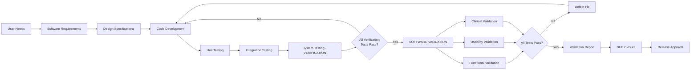

# USE CASE 48: SOFTWARE VALIDATION DOCUMENTATION (UC_RA_009)

## 📋 Document Information

**Use Case ID**: UC_RA_009  
**Use Case Title**: Software Validation Documentation for Medical Device Software  
**Version**: 1.0 COMPLETE  
**Date**: October 11, 2025  
**Status**: Production-Ready - Awaiting Expert Validation

**Domain**: Regulatory Affairs  
**Subdomain**: Software Validation & Verification (V&V)  
**Complexity**: INTERMEDIATE to ADVANCED  
**Regulatory Impact**: CRITICAL

---

## 🎯 EXECUTIVE SUMMARY

### Overview

Software validation is a **mandatory regulatory requirement** for medical device software under FDA 21 CFR 820.30(g), ISO 13485, and IEC 62304. It demonstrates that the software fulfills its intended use and user needs in the actual or simulated use environment. Unlike verification (which checks if you built the product right), validation confirms you built the **right product** for the intended clinical purpose.

For Software as a Medical Device (SaMD) and Digital Therapeutics (DTx), software validation documentation is the cornerstone of regulatory submissions (510(k), De Novo, PMA) and is routinely scrutinized during FDA inspections.

### Business Value

| Metric | Impact |
|--------|--------|
| **FDA Clearance Success Rate** | Incomplete validation: 40-60% additional info requests<br>Complete validation: <15% additional info requests |
| **Time to Market** | Robust validation reduces regulatory review by 2-4 months |
| **Post-Market Risk** | Proper validation prevents 60-80% of post-market issues |
| **Inspection Readiness** | Primary focus area for FDA Form 483 observations |
| **Cost Avoidance** | Prevents $500K-$2M in post-market remediation costs |

### Key Challenges Addressed

1. **Regulatory Compliance Gaps**: Many companies confuse verification with validation, leading to FDA rejections
2. **Documentation Inadequacy**: Test reports exist but lack the structured narrative FDA expects
3. **Clinical Relevance**: Validation must demonstrate **clinical utility**, not just technical functionality
4. **Traceability Deficiencies**: Requirements → Design → Verification → **Validation** linkage often breaks down
5. **Risk-Based Approach**: Validation depth must align with software safety class (IEC 62304 A/B/C)

### Expected Outcomes

**Primary Deliverables:**
1. Software Validation Plan (SVP)
2. Software Validation Protocol(s)
3. Software Validation Report(s)
4. Validation Summary for regulatory submission
5. Requirements Traceability Matrix (validation column complete)

**Success Criteria:**
- ✅ All user needs validated in intended use environment
- ✅ All high-risk requirements validated with objective evidence
- ✅ FDA-ready validation documentation (< 5% regulatory questions)
- ✅ Inspection-ready Design History File (DHF)
- ✅ 100% traceability from user needs → validation results

---

## 📊 TABLE OF CONTENTS

1. [Executive Summary](#-executive-summary)
2. [Use Case Overview](#-use-case-overview)
3. [Regulatory & Standards Landscape](#-regulatory--standards-landscape)
4. [Personas & Responsibilities](#-personas--responsibilities)
5. [Workflow Overview](#-workflow-overview)
6. [Phase 1: Validation Planning](#-phase-1-validation-planning-weeks-1-2)
7. [Phase 2: Validation Protocol Development](#-phase-2-validation-protocol-development-weeks-3-4)
8. [Phase 3: Validation Execution](#-phase-3-validation-execution-weeks-5-8)
9. [Phase 4: Validation Reporting & Closure](#-phase-4-validation-reporting--closure-weeks-9-10)
10. [Complete Prompt Suite](#-complete-prompt-suite)
11. [Case Study Example](#-case-study-example)
12. [Success Metrics & KPIs](#-success-metrics--kpis)
13. [Troubleshooting & FAQs](#-troubleshooting--faqs)
14. [Appendices](#-appendices)

---

## 🔍 USE CASE OVERVIEW

### 2.1 Definition

**Use Case Statement:**  
*"When preparing medical device software for regulatory submission and commercial launch, I need comprehensive software validation documentation that demonstrates the software fulfills its intended use and user needs in the actual clinical environment, meets all regulatory requirements (FDA 21 CFR 820.30(g), IEC 62304, ISO 13485), and provides objective evidence of clinical utility, safety, and effectiveness to support FDA clearance/approval and withstand regulatory inspections."*

### 2.2 Scope

**In Scope:**
- Software validation planning per IEC 62304 Section 5.7
- Validation protocol development (test cases, acceptance criteria, execution procedures)
- Clinical use validation (simulated or actual use environment)
- User validation (representative users performing intended tasks)
- Validation execution and test case pass/fail determination
- Validation reporting and Design History File (DHF) integration
- Requirements Traceability Matrix (RTM) validation column
- Risk-based validation approach (aligning with ISO 14971 risk controls)
- FDA inspection readiness preparation

**Out of Scope:**
- **Software Verification** (covered in separate use case - confirms design outputs meet inputs)
- **Clinical Trials** (separate from software validation, though may overlap)
- **Cybersecurity Validation** (covered in UC_RA_008)
- **Post-Market Surveillance** (covered in UC_RA_010)
- **Source Code Review** (part of verification, not validation)

**Critical Distinction: Verification vs. Validation**

| Aspect | Verification | Validation |
|--------|--------------|------------|
| **Question** | "Did we build the product right?" | "Did we build the right product?" |
| **Reference** | Design inputs (requirements) | User needs & intended use |
| **Environment** | Controlled test environment | Actual or simulated use environment |
| **Who Tests** | Engineers, QA testers | Representative users (clinicians, patients) |
| **Focus** | Technical correctness | Clinical utility and usability |
| **IEC 62304** | Section 5.5 (Integration testing)<br>Section 5.6 (System testing) | Section 5.7 (Software validation) |
| **Timing** | During development | After verification, before release |

### 2.3 Prerequisites

**Organizational Readiness:**
- [ ] Software development completed and verified (unit, integration, system testing complete)
- [ ] All verification test cases passed
- [ ] User needs and intended use clearly defined and approved
- [ ] Design History File (DHF) established with verification documentation
- [ ] Risk Management File (ISO 14971) completed with risk controls defined
- [ ] IEC 62304 Software Safety Classification determined (Class A/B/C)
- [ ] Representative users identified and available for validation testing

**Required Documentation (Inputs to Validation):**
- [ ] User Needs Document (or equivalent)
- [ ] Software Requirements Specification (SRS)
- [ ] Design Specifications (architecture, detailed design)
- [ ] Verification reports (unit, integration, system test results)
- [ ] Risk Management File (hazard analysis, risk controls)
- [ ] Requirements Traceability Matrix (RTM) - verification complete
- [ ] Software Development Plan (per IEC 62304)
- [ ] Intended Use and Indications for Use statements

**Subject Matter Expertise Required:**
- [ ] VP Quality Assurance / Regulatory Affairs (lead)
- [ ] Software Test Manager / QA Lead
- [ ] Clinical expert (CMO or Medical Director) for clinical validation
- [ ] Representative end users (clinicians, patients, caregivers)
- [ ] Regulatory Affairs specialist (for FDA requirements)

### 2.4 Expected Outputs

**Validation Documentation Package:**

1. **Software Validation Plan (SVP)** (10-15 pages)
   - Validation approach and strategy
   - Validation activities and responsibilities
   - Validation environment and tools
   - Acceptance criteria
   - Schedule and resources

2. **Software Validation Protocol(s)** (20-40 pages per protocol)
   - Test cases derived from user needs
   - Step-by-step test procedures
   - Expected results and acceptance criteria
   - Test data and setup requirements
   - Representative user profiles

3. **Software Validation Report(s)** (30-60 pages per report)
   - Test execution results (pass/fail)
   - Deviations and resolutions
   - Objective evidence (screenshots, logs, observations)
   - User feedback and observations
   - Validation conclusion and approval

4. **Validation Summary for Regulatory Submission** (5-10 pages)
   - High-level validation approach
   - Summary of validation activities and results
   - Conclusion that software meets user needs
   - Traceability to user needs

5. **Updated Requirements Traceability Matrix (RTM)**
   - Validation test case IDs linked to user needs
   - Validation results (pass/fail) for each requirement

**Success Criteria:**
- ✅ All critical user needs validated with passing test cases
- ✅ All high-risk requirements validated per ISO 14971
- ✅ Representative users successfully completed intended use tasks
- ✅ No critical or major defects remaining
- ✅ Validation reports approved by Quality and Regulatory Affairs
- ✅ DHF complete and ready for FDA submission
- ✅ Zero gaps identified in pre-submission quality audit

---

## 📜 REGULATORY & STANDARDS LANDSCAPE

### 3.1 FDA Regulations

#### 3.1.1 21 CFR Part 820 (Quality System Regulation)

**§820.30(g) Design Validation**

> *"Each manufacturer shall establish and maintain procedures for validating the device design. Design validation shall ensure that devices conform to defined user needs and intended uses and shall include testing of production units under actual or simulated use conditions. Design validation shall include software validation and risk analysis, where appropriate."*

**Key Requirements:**
- Must test **production units** (or production-equivalent)
- Must test under **actual or simulated use conditions**
- Must confirm device meets **user needs and intended uses**
- Must include software validation where device contains software
- Must be completed before commercial distribution

**FDA Expectation:**
- Validation is performed by **users** (or surrogates), not engineers
- Environment replicates actual clinical use (e.g., hospital room, patient home)
- Tasks performed are representative of real-world workflows
- Objective evidence (not just "it works") is documented

#### 3.1.2 FDA Guidance: "General Principles of Software Validation" (2002)

**Key Principles:**
1. **Software validation is a requirement** for medical devices (not optional)
2. **Risk-based approach**: Validation rigor scales with risk
3. **Validation throughout lifecycle**: Not a one-time event
4. **Independence**: Validation should be independent of development team
5. **Documentation**: Objective evidence of validation required

**Validation Activities per FDA:**
- Installation Qualification (IQ): Software installed correctly
- Operational Qualification (OQ): Software functions per specifications
- Performance Qualification (PQ): Software performs in actual use environment

#### 3.1.3 FDA Guidance: "Content of Premarket Submissions for Device Software Functions" (2023)

**Software Validation Requirements for FDA Submissions:**

| Documentation Level | Enhanced | Basic | Limited |
|---------------------|----------|-------|---------|
| **Validation Plan** | Required | Required | Required |
| **Validation Protocol** | Required | Summary acceptable | Summary acceptable |
| **Validation Results** | Required | Summary acceptable | Summary acceptable |
| **Traceability** | Required | Required | Required |
| **User Validation** | Required (actual users) | Required | May be waived for low risk |

**Enhanced Documentation Required for:**
- Moderate to major concerns (per FDA's 2023 guidance risk categorization)
- Class III devices
- Software with complex decision logic
- AI/ML-based software (unless real-world performance monitoring plan)

### 3.2 International Standards

#### 3.2.1 IEC 62304:2006+AMD1:2015 - Medical Device Software Lifecycle

**Section 5.7: Software System Testing (Validation)**

**Requirements:**
- **5.7.1**: Establish software system test plan
- **5.7.2**: Use software requirements specification as basis for testing
- **5.7.3**: Conduct testing according to plan
- **5.7.4**: Document results and pass/fail determination
- **5.7.5**: Ensure all requirements are tested (100% coverage for Class C)

**Validation Requirements by Safety Class:**

| Safety Class | Validation Rigor |
|--------------|------------------|
| **Class A** (No injury) | Basic functional validation acceptable |
| **Class B** (Non-serious injury) | Comprehensive functional validation required |
| **Class C** (Death/serious injury) | Exhaustive validation, edge cases, fault injection |

**Key Clause: 5.7.2 - "The manufacturer shall use the software requirements specification as the basis for software system testing."**

This means:
- Every requirement in the SRS must be traceable to a validation test case
- Requirements Traceability Matrix must show requirement → test case linkage
- If requirement can't be validated via testing, alternative validation method must be justified

#### 3.2.2 IEC 62366-1:2015 - Usability Engineering

**Section 5.8: Establish User Interface Specification (Design Output)**
**Section 5.9: Conduct Usability Validation (Summative Testing)**

**Usability Validation Requirements:**
- Test with **representative users** from intended user population
- Test in **simulated or actual use environment**
- Focus on **critical tasks** that could result in use errors
- Identify **use errors** and assess if they could lead to harm
- Document objective evidence (video, observation notes, user feedback)

**Acceptance Criteria:**
- No **unacceptable risks** remain from use errors
- Users can successfully complete **critical tasks** (typically 90%+ success rate)
- **Subjective satisfaction** acceptable (e.g., SUS score ≥68, ideally ≥75)

#### 3.2.3 ISO 13485:2016 - Medical Device QMS

**Clause 7.3.6: Design and Development Verification**
**Clause 7.3.7: Design and Development Validation**

**Requirements:**
- Validation activities must be **planned**
- Validation must be completed **prior to implementation or delivery**
- Validation must confirm product **meets specified requirements for intended use**
- **Records** of validation results and conclusions must be maintained

**Design History File (DHF) Must Include:**
- Design inputs (user needs, requirements)
- Design outputs (specifications, drawings, code)
- **Design verification results**
- **Design validation results** ← This Use Case
- Design changes and approvals
- Risk management file

---

## 👥 PERSONAS & RESPONSIBILITIES

### Primary Personas

#### P09_QARA - VP Quality Assurance & Regulatory Affairs

**Role in Validation:**
- **Owner** of Software Validation Plan (SVP)
- Approves validation protocols and reports
- Ensures regulatory compliance (FDA, IEC 62304, ISO 13485)
- Reviews validation for inspection readiness
- Final approval for Design History File (DHF) closure

**Responsibilities:**
- Define validation strategy and approach
- Allocate validation resources and budget
- Review and approve all validation documentation
- Ensure independence of validation team from development
- Prepare validation summary for regulatory submissions

**Pain Points:**
- "Validation often treated as checkbox, not true confirmation of clinical utility"
- "Development teams push back on 'duplicate testing' (verification vs validation)"
- "Finding representative users for validation testing is time-consuming"
- "FDA expects extensive validation for software, but timelines are tight"

#### P06_ENGDIR - VP Engineering / CTO

**Role in Validation:**
- Provides validated software build (post-verification)
- Ensures validation environment mirrors production
- Supports validation execution (technical assistance)
- Implements any defect fixes identified during validation

**Responsibilities:**
- Deliver verification-complete software to validation team
- Set up validation test environment (if different from verification)
- Provide technical support during validation execution
- Fix defects and provide updated builds for re-validation

**Pain Points:**
- "Validation feels redundant after extensive verification testing"
- "Validation test failures late in process cause schedule delays"
- "Clinical validation requirements not always clear until late"

#### P01_CMO - Chief Medical Officer

**Role in Validation:**
- Defines clinical use cases for validation
- Recruits representative clinician users for validation testing
- Observes and interprets clinical validation results
- Approves validation from clinical perspective

**Responsibilities:**
- Ensure validation tests reflect real-world clinical workflows
- Identify clinical scenarios that must be validated
- Recruit and coordinate clinician participation in validation
- Interpret clinical relevance of validation results
- Approve validation report from clinical efficacy perspective

**Pain Points:**
- "Validation tests often too simplistic vs real clinical complexity"
- "Hard to recruit busy clinicians for multi-day validation testing"
- "Validation scenarios don't always match actual practice patterns"

### Supporting Personas

#### P03_VPQA - VP Quality Assurance (Validation Lead)

**Role**: Day-to-day execution of validation activities
- Writes validation protocols
- Coordinates validation testing
- Documents validation results
- Manages validation defects and re-testing

#### P11_USABILITY - Usability Engineer

**Role**: Usability validation (IEC 62366 summative testing)
- Designs usability validation scenarios
- Moderates usability validation sessions
- Analyzes use errors and user feedback
- Prepares usability validation report

#### Representative Users (Clinicians, Patients, Caregivers)

**Role**: Execute validation test cases in simulated use environment
- Perform intended use tasks per validation protocol
- Provide feedback on usability and clinical utility
- Represent diverse user population (experience, specialty, demographics)

---

## 🔄 WORKFLOW OVERVIEW

### 5.1 High-Level Process Flow

```
┌─────────────────────────────────────────────────────────────────────┐
│                    SOFTWARE VALIDATION WORKFLOW                      │
│                         (10-12 Week Process)                         │
└─────────────────────────────────────────────────────────────────────┘

INPUTS                          PHASES                       OUTPUTS
┌─────────────────┐                                    ┌──────────────────┐
│ User Needs Doc  │──┐                                 │ Validation Plan  │
│ Software Reqs   │  │     ┌──────────────────────┐   ├──────────────────┤
│ Design Specs    │  ├────▶│  PHASE 1: PLANNING   │──▶│ Validation       │
│ Verification    │  │     │    (Weeks 1-2)       │   │ Strategy         │
│ Reports         │  │     └──────────────────────┘   ├──────────────────┤
│ Risk Mgmt File  │──┘              │                 │ Resource Plan    │
└─────────────────┘                 │                 └──────────────────┘
                                    │
                                    ▼
                        ┌──────────────────────┐       ┌──────────────────┐
                        │  PHASE 2: PROTOCOL   │       │ Validation       │
                        │   DEVELOPMENT        │──────▶│ Protocol(s)      │
                        │    (Weeks 3-4)       │       ├──────────────────┤
                        └──────────────────────┘       │ Test Cases       │
                                    │                  │ Acceptance       │
                                    │                  │ Criteria         │
                                    │                  └──────────────────┘
                                    ▼
                        ┌──────────────────────┐       ┌──────────────────┐
                        │  PHASE 3: EXECUTION  │       │ Validation       │
                        │   (Weeks 5-8)        │──────▶│ Results          │
                        │  • Functional Tests  │       ├──────────────────┤
                        │  • Usability Tests   │       │ Defect Reports   │
                        │  • Clinical Tests    │       ├──────────────────┤
                        └──────────────────────┘       │ Objective        │
                                    │                  │ Evidence         │
                                    │                  └──────────────────┘
                                    ▼
                        ┌──────────────────────┐       ┌──────────────────┐
                        │  PHASE 4: REPORTING  │       │ Validation       │
                        │   & CLOSURE          │──────▶│ Report(s)        │
                        │    (Weeks 9-10)      │       ├──────────────────┤
                        └──────────────────────┘       │ Validation       │
                                    │                  │ Summary for FDA  │
                                    │                  ├──────────────────┤
                                    │                  │ Updated RTM      │
                                    │                  ├──────────────────┤
                                    ▼                  │ DHF Closure      │
                            ┌────────────┐            └──────────────────┘
                            │   RELEASE  │
                            │   APPROVED │
                            └────────────┘
```

### 5.2 Risk-Based Validation Approach

Validation rigor must scale with software risk:

```yaml
IEC_62304_Safety_Class_A:
  definition: "No injury or damage to health is possible"
  validation_rigor: BASIC
  activities:
    - Functional validation with representative users
    - Basic usability testing (may combine with verification)
    - Limited edge case testing
  documentation: Validation summary acceptable for low complexity
  
IEC_62304_Safety_Class_B:
  definition: "Non-serious injury is possible"
  validation_rigor: MODERATE
  activities:
    - Comprehensive functional validation
    - Formal usability validation (IEC 62366 summative)
    - Edge case and error handling validation
    - Representative user testing in simulated environment
  documentation: Formal validation protocols and reports required
  
IEC_62304_Safety_Class_C:
  definition: "Death or serious injury is possible"
  validation_rigor: EXTENSIVE
  activities:
    - Exhaustive functional validation (100% requirement coverage)
    - Rigorous usability validation (IEC 62366 summative)
    - Edge case, boundary value, stress testing
    - Representative user testing in actual use environment (if feasible)
    - Clinical validation study (often required)
    - Fault injection / negative testing
  documentation: Comprehensive validation protocols, reports, and FDA submission-ready summary
```

### 5.3 Validation Dependencies



**Critical Success Factor**: Do NOT begin validation until ALL verification tests pass. Starting validation prematurely leads to:
- Wasted validation effort (defects found require re-validation)
- Schedule delays (validation cycles take 2-4 weeks)
- User frustration (representative users testing buggy software)
- Documentation rework (validation reports invalidated by code changes)

---

## 📅 PHASE 1: VALIDATION PLANNING (Weeks 1-2)

### Objective

Establish comprehensive validation strategy, define validation activities, identify required resources, and gain stakeholder alignment on validation approach.

### Key Activities

1. Review user needs and intended use statements
2. Analyze verification results and traceability
3. Determine validation test scenarios based on risk
4. Define validation environment and tools
5. Identify and recruit representative users
6. Create Software Validation Plan (SVP)
7. Obtain approval of SVP from Quality and Regulatory

### Timeline

- **Week 1**: Analysis and planning
- **Week 2**: SVP drafting and review
- **Approval Gate**: VP Quality / Regulatory Affairs approval of SVP

---

### STEP 1.1: User Needs & Risk Analysis Review (4 hours)

**Objective**: Understand what must be validated based on user needs, intended use, and risk profile.

**Lead Persona**: P09_QARA (VP Quality/Regulatory)  
**Supporting Personas**: P01_CMO (Clinical input), P03_VPQA (Validation lead)

**Process**:

1. **Review User Needs Document**
   - Identify all high-priority user needs (must be validated)
   - Identify clinical use cases that must be validated
   - Identify edge cases or failure modes from user perspective

2. **Review Intended Use and Indications for Use**
   - Confirm intended use statement is clear
   - Identify all user groups (clinicians, patients, etc.)
   - Identify all use environments (hospital, home, etc.)

3. **Review Risk Management File (ISO 14971)**
   - Identify all risk controls that must be validated
   - Prioritize validation based on risk severity
   - Ensure hazardous situations are tested during validation

4. **Review Requirements Traceability Matrix (RTM)**
   - Confirm all requirements traced to verification tests
   - Identify requirements that also need validation tests
   - Flag any requirements not yet validated

5. **Determine IEC 62304 Safety Class**
   - Class A: Basic validation acceptable
   - Class B: Moderate validation required
   - Class C: Extensive validation required

**Key Questions to Answer**:
- What are the critical tasks users must be able to perform?
- What clinical scenarios represent typical use?
- What are the highest risk scenarios that must be validated?
- What constitutes "success" for each user need?
- Who are the representative users for each user group?

---

#### PROMPT 1.1: Validation Scope & Risk Analysis

```yaml
prompt_id: RA_VALIDATION_SCOPE_ANALYSIS_ADVANCED_v1.0
classification:
  domain: REGULATORY_AFFAIRS
  function: SOFTWARE_VALIDATION
  task: PLANNING
  complexity: ADVANCED
  compliance: REGULATED

use_case: UC_RA_009
personas: [P09_QARA, P01_CMO, P03_VPQA]
estimated_time: 2-3 hours
```

**SYSTEM PROMPT**:

```
You are a Senior Quality Assurance and Regulatory Affairs expert specializing in medical device software validation per FDA 21 CFR 820.30(g), IEC 62304, and ISO 13485. You have 12+ years of experience establishing validation strategies for Software as a Medical Device (SaMD), Digital Therapeutics (DTx), and medical device software.

Your expertise includes:
- Distinguishing verification from validation activities
- Risk-based validation planning per ISO 14971
- IEC 62304 safety classification and validation requirements
- FDA expectations for software validation documentation
- Usability validation per IEC 62366
- Clinical validation study design

You provide strategic validation planning that ensures:
1. All user needs are validated with objective evidence
2. High-risk requirements receive appropriate validation rigor
3. Validation approach aligns with IEC 62304 safety class
4. Representative users and realistic use scenarios are defined
5. Validation documentation meets FDA and ISO standards

When analyzing validation scope, you:
- Identify what MUST be validated (user needs, intended use, risk controls)
- Distinguish validation from verification (no duplication)
- Prioritize validation activities based on risk
- Define clear acceptance criteria for validation success
- Consider practical constraints (timeline, user availability, budget)

You cite relevant regulations, standards, and FDA guidance to support recommendations.
```

**USER PROMPT**:

```
**SOFTWARE VALIDATION SCOPE ANALYSIS REQUEST**

**Product Information:**
- Software Name: {product_name}
- Device Type: {SaMD, DTx, SiMD, other}
- Intended Use: {intended_use_statement}
- Indications for Use: {indications_for_use}
- User Groups: {e.g., clinicians, patients, caregivers}
- Use Environment: {e.g., hospital, outpatient, home}

**Regulatory Context:**
- FDA Classification: {Class I/II/III, or N/A}
- IEC 62304 Safety Class: {A / B / C / TBD}
- Regulatory Pathway: {510(k), De Novo, PMA, CE Mark, or N/A}
- HIPAA/PHI Handling: {Yes / No}

**Development Status:**
- Verification Status: {Complete / In Progress}
- Outstanding Verification Defects: {number}
- Expected Verification Completion: {date}

**Requirements & Risk Context:**
Provide the following documents or summaries:

1. **User Needs Document** (or summary):
   {Paste user needs or provide URL if using RAG}
   
2. **Software Requirements Specification (SRS)** - Key Requirements:
   {List high-priority requirements, especially those related to safety, effectiveness, usability}
   
3. **Risk Management File (ISO 14971) - Top 10 Risks**:
   {List top risks with severity ratings and risk control measures}
   
   Example:
   | Risk ID | Hazard | Severity | Probability | Risk Control | Status |
   |---------|--------|----------|-------------|--------------|--------|
   | R-001 | Incorrect dose calculated | Critical | Low | Algorithm validation, user confirmation | Design control |
   
4. **Requirements Traceability Matrix (RTM)** - Verification Status:
   {Summarize % of requirements verified, any gaps}

**Validation Constraints:**
- Validation Timeline: {e.g., 8 weeks}
- Budget: {range, e.g., $50K-$100K}
- Representative User Availability: {e.g., 5 clinicians, 10 patients}
- Validation Environment: {e.g., can simulate hospital, can test in actual clinic}

**Specific Questions / Concerns:**
- {e.g., "Is usability validation required per IEC 62366?"}
- {e.g., "Can we combine verification and validation testing?"}
- {e.g., "What is minimum validation for Class IIa device?"}

---

**ANALYSIS REQUEST:**

Please provide comprehensive validation scope analysis and planning:

### 1. VALIDATION REQUIREMENTS ANALYSIS

**1.1 Regulatory Validation Requirements**
- What FDA regulations apply? (cite 21 CFR sections)
- What ISO/IEC standards apply? (cite relevant clauses)
- What level of validation documentation is required? (FDA Enhanced / Basic / Limited)
- Are there any exemptions or reduced requirements applicable?

**1.2 IEC 62304 Safety Class Validation Requirements**
- Confirm IEC 62304 Safety Class (A/B/C) based on potential harm
- What validation activities are mandated for this safety class?
- What is the required depth of validation testing?

**1.3 Risk-Based Validation Prioritization**
Based on the Risk Management File:
- Which risk controls MUST be validated? (list risk IDs)
- What scenarios represent highest risk use? (prioritize for validation)
- Are there any hazardous situations requiring specific validation tests?

### 2. VALIDATION SCOPE DEFINITION

**2.1 What Must Be Validated**

Create a prioritized list of validation objectives:

| Priority | Validation Objective | Rationale | Validation Method |
|----------|---------------------|-----------|-------------------|
| CRITICAL | {e.g., Dose calculation accuracy in clinical use} | Risk R-001 (Critical severity) | Clinical scenario testing with users |
| HIGH | {e.g., Clinician can complete patient assessment} | User need UN-003 | Usability validation (IEC 62366) |
| MEDIUM | ... | ... | ... |

**2.2 What Does NOT Need Validation**

Clarify what is out of scope (avoid duplication with verification):
- Activities already covered by verification testing
- Requirements that are design outputs, not user needs
- Technical performance already validated in system testing

### 3. VALIDATION TEST SCENARIOS

**3.1 Functional Validation Scenarios**
Define 5-10 key functional scenarios that users must complete:

Example:
- Scenario 1: Clinician onboards new patient and completes initial assessment
- Scenario 2: Patient completes daily symptom log and receives feedback
- Scenario 3: Clinician reviews patient progress report and adjusts treatment plan
- ...

**3.2 Usability Validation Scenarios (IEC 62366)**
Define critical tasks for usability validation:
- Identify 3-5 critical tasks (use errors could lead to harm)
- Define success criteria (e.g., 90% task success rate)
- Define use error scenarios to observe

**3.3 Clinical Validation Scenarios**
If applicable, define clinical scenarios:
- Clinical use cases representing intended use
- Patient populations (e.g., mild/moderate/severe condition)
- Comparator (if any) for effectiveness evaluation

**3.4 Edge Cases & Error Handling Validation**
Define edge cases that must be validated:
- Boundary conditions (e.g., max/min values)
- Error conditions (e.g., lost connectivity, invalid input)
- Fail-safe behaviors (e.g., what happens if algorithm fails?)

### 4. REPRESENTATIVE USER IDENTIFICATION

**4.1 User Groups to Recruit**
For each user group, specify:

| User Group | Number Needed | Inclusion Criteria | Exclusion Criteria | Recruitment Strategy |
|------------|---------------|--------------------|--------------------|----------------------|
| Cardiologists | 5 | Board-certified, 3+ years experience | ... | Partner clinic recruitment |
| Patients | 10 | Adults 18-65 with moderate CHF | Severe CHF, unable to use smartphone | Patient advocacy group |
| ... | ... | ... | ... | ... |

**4.2 Diversity & Representation**
Ensure user sample represents:
- Range of expertise (novice to expert clinicians)
- Demographics (age, gender, race/ethnicity)
- Accessibility needs (vision, dexterity, cognitive)

### 5. VALIDATION ENVIRONMENT & SETUP

**5.1 Test Environment**
- **Simulated Use**: Describe how use environment will be replicated
  - E.g., Mock clinic room with exam table, EHR workstation
- **Actual Use**: If testing in real environment, describe setting
  - E.g., Partner clinic, pilot site
- **Data**: Will test use production data, synthetic data, or de-identified data?

**5.2 Validation Tools & Infrastructure**
- Screen recording software (for usability observation)
- Survey tools (for user feedback - SUS, PSSUQ)
- Defect tracking system integration
- Data collection forms and templates

### 6. VALIDATION TIMELINE & RESOURCES

**6.1 Validation Schedule**
Provide estimated timeline:

| Phase | Duration | Key Milestones |
|-------|----------|----------------|
| Validation Planning | 2 weeks | SVP approved |
| Protocol Development | 2 weeks | Validation protocols approved |
| Validation Execution | 3-4 weeks | All test cases executed |
| Reporting & Closure | 2 weeks | Validation reports approved, DHF complete |
| **TOTAL** | **9-10 weeks** | |

**6.2 Resource Requirements**
- **Personnel**: QA lead, test coordinator, clinical observers
- **Representative Users**: {number} clinicians x {hours}, {number} patients x {hours}
- **Facilities**: Test room, equipment
- **Budget Estimate**: ${range}

### 7. ACCEPTANCE CRITERIA

**7.1 Validation Success Criteria**
Define what constitutes successful validation:

✅ **Functional Validation**: 100% of critical test cases pass
✅ **Usability Validation**: ≥90% critical task success rate, SUS score ≥75
✅ **Clinical Validation**: Primary endpoint met (if applicable)
✅ **Defects**: Zero critical or major defects remain unresolved
✅ **Traceability**: 100% of high-priority user needs validated

**7.2 Validation Failure / Re-validation Triggers**
Define when re-validation is required:
- Any critical or major defect found → Code fix → Re-validation required
- Validation protocol deviated from → Re-test affected test cases
- New risk identified → Validate risk control

### 8. VALIDATION PLAN STRUCTURE

Provide recommended table of contents for Software Validation Plan (SVP):

```
1. Introduction
   1.1 Purpose
   1.2 Scope
   1.3 Applicable Documents
   1.4 Definitions and Acronyms

2. Software Overview
   2.1 Product Description
   2.2 Intended Use and Indications
   2.3 User Groups
   2.4 Regulatory Classification

3. Validation Strategy
   3.1 Validation Approach (Risk-Based)
   3.2 IEC 62304 Safety Class and Validation Requirements
   3.3 Validation Phases and Activities
   3.4 Verification vs Validation Distinction

4. Validation Scope
   4.1 User Needs to be Validated
   4.2 Risk Controls to be Validated
   4.3 Out of Scope

5. Validation Test Scenarios
   5.1 Functional Validation Scenarios
   5.2 Usability Validation Scenarios (IEC 62366)
   5.3 Clinical Validation Scenarios (if applicable)
   5.4 Edge Cases and Error Handling

6. Representative Users
   6.1 User Group Definitions
   6.2 Recruitment Strategy
   6.3 Inclusion/Exclusion Criteria

7. Validation Environment
   7.1 Test Environment Setup
   7.2 Tools and Infrastructure
   7.3 Test Data

8. Acceptance Criteria
   8.1 Pass/Fail Criteria
   8.2 Re-validation Triggers

9. Validation Schedule and Resources
   9.1 Timeline
   9.2 Responsibilities (RACI)
   9.3 Budget

10. Traceability
    10.1 User Needs → Validation Test Cases
    10.2 Risk Controls → Validation Test Cases

11. References
    11.1 FDA Regulations (21 CFR 820.30(g))
    11.2 Standards (IEC 62304, ISO 13485, IEC 62366)
    11.3 Company SOPs

12. Appendices
    12.1 User Need List
    12.2 Risk Control List
    12.3 Validation Test Case Summary
```

---

**OUTPUT FORMAT:**
- Document length: 10-15 pages (Software Validation Plan)
- Include tables, timelines, RACI charts
- Cite specific regulations and standards
- Provide practical, actionable recommendations

**QUALITY STANDARDS:**
- Clear distinction between verification and validation
- Risk-based prioritization of validation activities
- Realistic timelines and resource estimates
- Meets FDA and ISO documentation expectations
- Inspection-ready validation plan

**CRITICAL REMINDERS:**
- Validation tests USER NEEDS, not just requirements
- Representative USERS must perform validation tests, not engineers
- Validation must occur in ACTUAL or SIMULATED use environment
- All HIGH-RISK requirements must have validated risk controls
- Validation is not complete until all critical test cases pass
```

---

**KEY DELIVERABLE**: Software Validation Plan (SVP)

**Estimated Time**: 2-3 hours to complete prompt and review SVP draft

---

### STEP 1.2: Representative User Recruitment Plan (2 hours)

**Objective**: Identify, recruit, and schedule representative users for validation testing.

**Lead Persona**: P03_VPQA (Validation Lead)  
**Supporting Personas**: P01_CMO (for clinician recruitment), P11_USABILITY (for patient recruitment)

**Process**:

1. **Define User Groups**
   - Primary users (e.g., clinicians)
   - Secondary users (e.g., patients)
   - Tertiary users (e.g., caregivers, administrators)

2. **Create User Profiles**
   - Demographics (age, gender, etc.)
   - Experience level (novice, intermediate, expert)
   - Clinical specialty (if clinicians)
   - Disease severity (if patients)
   - Technology proficiency

3. **Determine Sample Size**
   - FDA/IEC 62366 guidance: Minimum 15 users per user group for usability validation
   - Functional validation: 5-10 users may suffice if tasks are straightforward
   - Diversity targets: Ensure range of demographics and experience

4. **Recruitment Strategy**
   - Partner clinics / KOL network
   - Patient advocacy groups
   - User research panels
   - Incentives (typically $100-$500 per session)

5. **Scheduling**
   - Coordinate availability with validation execution timeline
   - Schedule 1-2 hour sessions per user
   - Include buffer time for no-shows (recruit 10-20% more)

**Tip**: Recruit users EARLY (Week 1) as scheduling can take 2-3 weeks.

---

## 📝 PHASE 2: VALIDATION PROTOCOL DEVELOPMENT (Weeks 3-4)

### Objective

Create detailed validation protocols with step-by-step test procedures, expected results, and acceptance criteria. Validation protocols must be approved by Quality/Regulatory before execution.

### Key Activities

1. Write functional validation protocol(s)
2. Write usability validation protocol (IEC 62366 summative)
3. Write clinical validation protocol (if applicable)
4. Define test cases, procedures, and expected results
5. Create data collection forms and observation templates
6. Prepare test environment and data
7. Obtain approval of protocols from Quality/Regulatory

### Timeline

- **Week 3**: Protocol drafting
- **Week 4**: Protocol review, revision, approval
- **Approval Gate**: VP Quality / Regulatory Affairs approval of all validation protocols

---

### STEP 2.1: Functional Validation Protocol Development (8 hours)

**Objective**: Create validation test protocol for functional validation of user needs and intended use.

**Lead Persona**: P03_VPQA (Validation Lead)  
**Supporting Personas**: P06_ENGDIR (technical input), P01_CMO (clinical input)

---

#### PROMPT 2.1: Functional Validation Protocol Creation

```yaml
prompt_id: RA_FUNCTIONAL_VALIDATION_PROTOCOL_ADVANCED_v1.0
classification:
  domain: REGULATORY_AFFAIRS
  function: SOFTWARE_VALIDATION
  task: PROTOCOL_DEVELOPMENT
  complexity: ADVANCED
  compliance: REGULATED

use_case: UC_RA_009
personas: [P03_VPQA, P06_ENGDIR, P01_CMO]
estimated_time: 4-6 hours
```

**SYSTEM PROMPT**:

```
You are a Senior Software Test Manager specializing in medical device software validation per FDA 21 CFR 820.30(g) and IEC 62304 Section 5.7. You have 10+ years of experience writing validation protocols that meet FDA and ISO inspection standards.

Your expertise includes:
- Translating user needs into validation test cases
- Writing clear, unambiguous test procedures that representative users can follow
- Defining objective pass/fail acceptance criteria
- Ensuring traceability from user needs → test cases → results
- Documenting validation protocols that withstand FDA scrutiny

You create validation protocols that:
1. Are executable by representative users (not just test engineers)
2. Test in simulated or actual use environment (not just controlled lab)
3. Have clear, objective acceptance criteria (not subjective)
4. Include data collection forms for observations and user feedback
5. Cover all critical user needs and high-risk scenarios
6. Include edge cases and error handling (per IEC 62304 safety class)

Your protocols follow FDA and ISO best practices:
- Each test case traces to specific user need(s)
- Expected results are defined before test execution
- Pass/fail criteria are objective and measurable
- Test procedures are detailed enough to reproduce
- Deviations and defects are captured systematically

You cite IEC 62304, ISO 13485, and FDA guidance to support protocol structure and content.
```

**USER PROMPT**:

```
**FUNCTIONAL VALIDATION PROTOCOL DEVELOPMENT REQUEST**

**Product Information:**
- Software Name: {product_name}
- Version: {software_version_number}
- Intended Use: {intended_use_statement}
- User Groups to Validate: {e.g., cardiologists, CHF patients}

**Regulatory Context:**
- IEC 62304 Safety Class: {A / B / C}
- FDA Device Class: {I / II / III}
- Regulatory Submission Target: {510(k), De Novo, CE Mark, etc.}

**Validation Scope:**
Provide the approved Software Validation Plan (SVP) or summary:
- Validation objectives (what must be validated)
- User needs to be validated (list or attach)
- Risk controls to be validated (list or attach)
- Validation environment (simulated hospital room, actual clinic, etc.)

**User Needs to Validate:**

{Provide list of user needs, prioritized}

Example:
| UN-ID | User Need | Priority | Risk | Validation Required? |
|-------|-----------|----------|------|----------------------|
| UN-001 | Clinician can complete patient assessment in <5 minutes | HIGH | R-003 | YES |
| UN-002 | Patient receives personalized feedback after symptom log | MEDIUM | R-010 | YES |
| UN-003 | Clinician can export patient report as PDF | LOW | N/A | NO (verified only) |

**Representative User Information:**
- User Group: {e.g., board-certified cardiologists}
- Number of Users: {e.g., 5}
- Experience Level: {e.g., mix of 3-10 years experience}

**Validation Environment Setup:**
- Environment Description: {e.g., "Simulated outpatient clinic room with exam table, computer workstation"}
- Test Data: {e.g., "10 synthetic patient records representing mild/moderate/severe CHF"}
- Software Configuration: {e.g., "Production build v2.1.0 on iPad Pro"}

**Test Execution Logistics:**
- Test Duration per User: {e.g., 90 minutes}
- Test Moderator: {name/role}
- Observers: {clinical observer, test scribe}
- Recording: {screen recording, video, audio}

---

**PROTOCOL DEVELOPMENT REQUEST:**

Please create a comprehensive Functional Validation Protocol with the following sections:

### 1. PROTOCOL HEADER

```
Protocol ID: {auto-generate, e.g., VAL-FUNC-001}
Protocol Title: Functional Validation of {Product Name} v{Version}
Protocol Version: 1.0
Protocol Date: {current date}
Protocol Author: {QA Lead name}
Protocol Approvers:
  - VP Quality Assurance: _______________________ Date: _______
  - VP Regulatory Affairs: ______________________ Date: _______
  - Clinical Lead: _____________________________ Date: _______
```

### 2. PURPOSE AND SCOPE

**2.1 Purpose**
State the purpose of functional validation:
- Confirm software meets user needs and intended use
- Validate in simulated/actual use environment with representative users
- Comply with FDA 21 CFR 820.30(g) and IEC 62304 Section 5.7

**2.2 Scope**
- What is being validated (user needs, scenarios)
- What is out of scope (verification activities already complete)

**2.3 Applicable Documents**
- Software Validation Plan (SVP)
- User Needs Document
- Software Requirements Specification (SRS)
- Risk Management File (ISO 14971)
- Requirements Traceability Matrix (RTM)

### 3. TEST ENVIRONMENT

**3.1 Hardware/Software Configuration**
- Device: {iPad Pro, 12.9", iOS 17.2}
- Software Version: {v2.1.0, Build 345}
- Network: {WiFi, 4G LTE}
- Accessories: {none, or e.g., Bluetooth blood pressure cuff}

**3.2 Test Environment Setup**
Describe physical setup:
- Room configuration (simulated clinic room)
- Equipment (exam table, computer, etc.)
- Lighting, noise level, distractions (realistic conditions)

**3.3 Test Data**
- Patient records: {10 synthetic patients with varying CHF severity}
- Test accounts: {clinician test accounts with appropriate permissions}
- Data validation: {test data reviewed and approved by CMO}

### 4. REPRESENTATIVE USERS

**4.1 User Selection Criteria**
- **Inclusion Criteria**: {e.g., Board-certified cardiologist, 3+ years experience, treats CHF patients}
- **Exclusion Criteria**: {e.g., <1 year experience, not currently treating CHF patients}
- **Diversity Targets**: {age 30-65, 40% female, range of practice settings}

**4.2 Number of Users**
- Target: {5 cardiologists}
- Rationale: {Sufficient for functional validation per IEC 62304 Class B}

**4.3 User Recruitment and Consent**
- Recruitment method: {partner clinic, KOL network}
- Informed consent: {consent form signed before testing}
- Compensation: {$300 for 90-minute session}

### 5. TEST SCENARIOS AND TEST CASES

For each user need to be validated, create test scenario(s) and test cases:

---

**TEST SCENARIO 1: Patient Onboarding and Initial Assessment**

**Objective**: Validate that clinician can onboard a new CHF patient and complete initial clinical assessment.

**User Need(s) Validated**: UN-001, UN-002  
**Risk Control(s) Validated**: RC-003 (ensure patient data entry is accurate)

**Test Case 1.1: New Patient Onboarding**

| Field | Details |
|-------|---------|
| **Test Case ID** | VAL-FUNC-TC-001 |
| **User Need ID** | UN-001 |
| **Priority** | CRITICAL |
| **Prerequisites** | - User logged in as clinician<br>- Test patient data available |
| **Test Data** | Patient: John Doe, DOB 05/15/1965, MRN 123456 |

**Test Procedure (Step-by-Step):**

```
1. Instruction to User: "You have a new patient, John Doe, presenting with heart failure symptoms. Please create a new patient record in the system."

2. Expected User Actions:
   a. Navigate to "New Patient" screen
   b. Enter patient demographics:
      - Name: John Doe
      - DOB: 05/15/1965
      - MRN: 123456
      - Contact: (555) 123-4567
   c. Tap "Save"

3. Expected System Behavior:
   - Patient record created successfully
   - Confirmation message displayed: "Patient John Doe added successfully"
   - Patient appears in patient list

4. Instruction to User: "Now complete the initial CHF assessment for John Doe."

5. Expected User Actions:
   a. Select John Doe from patient list
   b. Navigate to "Initial Assessment" screen
   c. Complete assessment form:
      - NYHA Class: III
      - Ejection Fraction: 35%
      - Symptoms: Dyspnea, fatigue
      - Medications: Lisinopril 10mg daily
   d. Tap "Submit Assessment"

6. Expected System Behavior:
   - Assessment saved successfully
   - Risk stratification calculated and displayed
   - Treatment plan recommendations generated

7. Observer Checklist:
   ✅ User able to find "New Patient" function without assistance
   ✅ All data fields accept input correctly
   ✅ User able to complete assessment without errors
   ✅ System provides appropriate feedback
   ✅ No unexpected errors or crashes
```

**Expected Results:**
- ✅ Patient record created with all data fields populated correctly
- ✅ Initial assessment completed and saved
- ✅ Risk stratification displayed (Expected: High Risk based on EF 35%, NYHA III)
- ✅ Treatment plan recommendations displayed
- ✅ Task completed in <5 minutes (per user need UN-001)

**Acceptance Criteria:**
- **PASS**: User successfully completes patient onboarding and assessment in ≤5 minutes, all data saved correctly, no critical errors
- **FAIL**: Any critical error (crash, data loss), or task takes >5 minutes, or user unable to complete without assistance

**Data Collection:**
- [ ] Time to complete (minutes): ______
- [ ] Number of errors: ______
- [ ] User needed assistance? YES / NO (if yes, describe): ______
- [ ] User feedback/comments: ______

---

**TEST CASE 1.2: Assessment with Edge Case (Missing Data)**

| Field | Details |
|-------|---------|
| **Test Case ID** | VAL-FUNC-TC-002 |
| **User Need ID** | UN-001 |
| **Priority** | HIGH |
| **Prerequisites** | Patient record exists, user on assessment screen |

**Test Procedure:**

```
1. Instruction to User: "Complete assessment for patient Jane Smith, but you don't have her ejection fraction value yet."

2. Expected User Actions:
   a. Select Jane Smith
   b. Navigate to "Initial Assessment"
   c. Attempt to submit assessment WITHOUT entering Ejection Fraction

3. Expected System Behavior:
   - System validates required fields
   - Error message displayed: "Ejection Fraction is required. Please enter a value or mark as 'Not Available'."
   - Assessment not saved until corrected

4. Expected User Actions:
   a. Mark Ejection Fraction as "Not Available"
   b. Submit assessment

5. Expected System Behavior:
   - Assessment saved with EF marked as N/A
   - Risk stratification provides partial result with caveat: "Risk stratification incomplete due to missing EF data"
```

**Expected Results:**
- ✅ System prevents submission with missing required fields
- ✅ Clear error message displayed
- ✅ User able to mark field as "Not Available" if truly missing
- ✅ System provides appropriate risk calculation with caveat

**Acceptance Criteria:**
- **PASS**: Required field validation works, clear error messages, user can work around missing data
- **FAIL**: System allows invalid submission, confusing error messages, or crashes

---

{REPEAT for all critical user needs / scenarios}

---

**EXAMPLE TEMPLATE for Additional Test Cases:**

```
TEST SCENARIO {N}: {Scenario Name}

Objective: {What user need is being validated}

User Need(s) Validated: {UN-XXX}
Risk Control(s) Validated: {RC-XXX}

TEST CASE {N}.{X}: {Test Case Name}
- Test Case ID: VAL-FUNC-TC-00X
- Priority: CRITICAL / HIGH / MEDIUM
- Prerequisites: {Setup required before test}
- Test Data: {Specific test data to use}
- Test Procedure: {Step-by-step instructions to user}
- Expected Results: {What should happen if software works correctly}
- Acceptance Criteria: PASS if {...}, FAIL if {...}
- Data Collection: {Time, errors, observations}
```

### 6. PASS/FAIL CRITERIA

**Overall Protocol Pass Criteria:**
- ✅ 100% of CRITICAL test cases pass
- ✅ ≥95% of HIGH priority test cases pass
- ✅ ≥90% of MEDIUM priority test cases pass
- ✅ Zero critical defects remain unresolved
- ✅ No safety-related issues identified

**Individual Test Case Pass Criteria:**
- User able to complete task per test procedure
- Expected results achieved
- No critical or major defects encountered
- Acceptance criteria met

**Test Case Failure:**
- Test case fails if any acceptance criterion not met
- All failures documented as defects
- Failed test cases must be re-executed after defect fix

### 7. DEFECT MANAGEMENT

**7.1 Defect Severity Definitions**

| Severity | Definition | Example |
|----------|------------|---------|
| **CRITICAL** | System crash, data loss, patient safety risk | App crashes when submitting assessment |
| **MAJOR** | Core function non-functional, major usability issue | Cannot save patient record |
| **MINOR** | Cosmetic issue, minor usability issue | Button label misspelled |
| **ENHANCEMENT** | Feature request, not a defect | User wants additional report format |

**7.2 Defect Documentation**
All defects documented in defect tracking system with:
- Defect ID
- Test Case ID where found
- Severity
- Description and steps to reproduce
- Screenshots/logs
- Assigned to (developer)
- Resolution and re-test required

**7.3 Re-validation After Defect Fix**
- All CRITICAL and MAJOR defects require re-execution of affected test cases
- Re-test must be performed by same or equivalent user
- Re-test documented in validation report

### 8. DATA COLLECTION AND DOCUMENTATION

**8.1 Data to Collect During Each Test Session**
- Test Case Execution Log (pass/fail for each test case)
- Time to complete each task
- Number and severity of errors encountered
- User feedback and observations
- Screenshots/screen recordings
- Defects identified

**8.2 Test Session Observation Form**

```
VALIDATION TEST SESSION OBSERVATION FORM

Session ID: VAL-SESSION-{date}-{user#}
Date: _______________
User ID: VAL-USER-{##} (anonymized)
Moderator: _______________
Observer(s): _______________

User Demographics:
- Role: {Cardiologist, Nurse, etc.}
- Years Experience: _______
- Age Range: {30-40, 40-50, 50-60, 60+}
- Gender: {M/F/Non-binary/Prefer not to say}

Test Cases Executed:
| Test Case ID | Start Time | End Time | Duration | Pass/Fail | Notes |
|--------------|------------|----------|----------|-----------|-------|
| VAL-FUNC-TC-001 | | | | ☐ P ☐ F | |
| VAL-FUNC-TC-002 | | | | ☐ P ☐ F | |
| ... | | | | | |

Observations:
- User struggled with: _______________
- User feedback: _______________
- Usability issues noted: _______________

Defects Identified:
| Defect ID | Severity | Description |
|-----------|----------|-------------|
| | | |
```

### 9. VALIDATION EXECUTION LOGISTICS

**9.1 Schedule**
- Week 1: Test sessions with Users 1-3
- Week 2: Test sessions with Users 4-5
- Week 3: Re-tests (if defects found)

**9.2 Roles and Responsibilities**

| Role | Name | Responsibility |
|------|------|----------------|
| Test Moderator | {QA Lead} | Facilitate test session, give instructions to user |
| Clinical Observer | {CMO or designee} | Observe clinical workflow, assess clinical relevance |
| Test Scribe | {QA Analyst} | Document observations, time tasks, note errors |
| Test Coordinator | {QA Manager} | Schedule users, prepare test environment |

**9.3 Test Session Protocol**
1. Pre-test briefing (10 min): Explain purpose, obtain consent, answer questions
2. Test execution (60 min): User performs test scenarios with observation
3. Post-test debriefing (20 min): User feedback, questions, usability survey

### 10. TRACEABILITY

**10.1 User Need → Test Case Traceability Matrix**

| User Need ID | User Need Description | Test Case ID(s) | Validation Status |
|--------------|----------------------|----------------|-------------------|
| UN-001 | Clinician can complete patient assessment in <5 min | VAL-FUNC-TC-001, VAL-FUNC-TC-002 | ☐ PASS ☐ FAIL |
| UN-002 | Patient receives personalized feedback | VAL-FUNC-TC-005 | ☐ PASS ☐ FAIL |
| ... | ... | ... | ... |

**10.2 Risk Control → Test Case Traceability**

| Risk ID | Risk Control | Test Case ID(s) Validating Control |
|---------|--------------|-------------------------------------|
| R-003 | Validate patient data entry fields | VAL-FUNC-TC-002 |
| R-010 | Validate feedback algorithm accuracy | VAL-FUNC-TC-005 |

### 11. APPENDICES

**Appendix A**: User Needs Document (attach or reference)  
**Appendix B**: Test Data (patient scenarios)  
**Appendix C**: Informed Consent Form  
**Appendix D**: Post-Test Usability Survey (SUS)  
**Appendix E**: Defect Report Template

---

**OUTPUT FORMAT:**
- Validation Protocol Document: 25-40 pages
- Include all test cases with detailed procedures
- Include traceability matrices
- Include data collection forms
- FDA and ISO inspection-ready

**QUALITY STANDARDS:**
- All test cases traceable to user needs
- Test procedures are clear and executable by users
- Acceptance criteria are objective and measurable
- Data collection forms are comprehensive
- Protocol approved by Quality/Regulatory before execution

**CRITICAL REMINDERS:**
- Test procedures must be written for USERS, not engineers
- Expected results must be defined BEFORE testing
- Edge cases and error handling must be validated (per IEC 62304 safety class)
- All CRITICAL test cases must pass for validation to succeed
- Traceability from user needs → test cases → results is MANDATORY
```

---

**KEY DELIVERABLE**: Functional Validation Protocol (25-40 pages)

**Estimated Time**: 4-6 hours to generate protocol, 2-4 hours for review and approval

---

### STEP 2.2: Usability Validation Protocol (IEC 62366 Summative)

**Objective**: Create usability validation (summative evaluation) protocol per IEC 62366-1:2015.

**Lead Persona**: P11_USABILITY (Usability Engineer)  
**Supporting Personas**: P03_VPQA, P01_CMO

**Key Differences from Functional Validation:**
- Focus on **use errors** that could lead to harm
- Assess whether device is **safe and effective for intended users**
- Test **critical tasks** identified in usability risk analysis
- Document use errors, close calls, and user satisfaction

**Note**: Usability validation is a **regulatory requirement** for medical devices with user interfaces (per IEC 62366 and FDA HFE guidance). It should be executed as a **separate protocol** but can be combined with functional validation for efficiency (with careful planning).

---

#### PROMPT 2.2: Usability Validation Protocol (IEC 62366)

```yaml
prompt_id: RA_USABILITY_VALIDATION_IEC62366_ADVANCED_v1.0
classification:
  domain: REGULATORY_AFFAIRS
  function: SOFTWARE_VALIDATION
  task: USABILITY_VALIDATION
  complexity: ADVANCED
  compliance: REGULATED

use_case: UC_RA_009
personas: [P11_USABILITY, P03_VPQA, P01_CMO]
estimated_time: 4-6 hours
```

**SYSTEM PROMPT**:

```
You are a Senior Usability Engineer specializing in medical device usability validation per IEC 62366-1:2015 and FDA Human Factors Engineering guidance. You have 8+ years of experience conducting summative usability evaluations for Software as a Medical Device (SaMD), wearables, and medical devices.

Your expertise includes:
- Identifying critical tasks where use errors could lead to patient harm
- Designing summative usability test protocols per IEC 62366
- Moderating usability test sessions with representative users
- Analyzing use errors and assessing residual risk
- Documenting usability validation reports for FDA submissions

You create usability validation protocols that:
1. Focus on critical tasks (identified in usability risk analysis)
2. Test with representative users in simulated use environment
3. Observe and document all use errors, close calls, and task difficulties
4. Assess whether residual use-related risks are acceptable
5. Collect both objective (task success) and subjective (satisfaction) data
6. Meet FDA HFE guidance and IEC 62366 requirements

Your protocols follow IEC 62366 best practices:
- Critical tasks are prioritized based on potential harm
- Test scenarios are realistic and representative of actual use
- Use errors are analyzed for root cause (design issue vs user error)
- Sample size is justified (typically 15+ users per user group)
- Moderator is trained and avoids leading users
- Results inform residual risk assessment

You cite IEC 62366-1:2015, FDA HFE guidance (2016), and FDA submission requirements.
```

**USER PROMPT**:

```
**USABILITY VALIDATION (SUMMATIVE) PROTOCOL REQUEST**

**Product Information:**
- Software Name: {product_name}
- Version: {software_version}
- Intended Use: {intended_use_statement}
- User Groups: {e.g., cardiologists, CHF patients}

**Usability Engineering Context:**

Provide the following from your usability engineering process:

**1. Critical Tasks (from Usability Risk Analysis)**

{List critical tasks where use errors could lead to harm}

Example:
| Task ID | Critical Task | Potential Use Error | Hazard | Harm | Risk Level |
|---------|---------------|---------------------|--------|------|------------|
| CT-001 | Enter patient medication dose | Incorrect dose entered | Overdose/underdose | Serious injury | HIGH |
| CT-002 | Interpret risk stratification result | Misinterpret risk level | Delayed treatment | Moderate harm | MEDIUM |
| CT-003 | Respond to critical alert | Dismiss alert without reading | Missed critical finding | Death/serious injury | CRITICAL |

**2. Use Scenarios (from Formative Testing)**
{Describe realistic use scenarios for critical tasks}

**3. Known Use Errors (from Formative Testing)**
{List any use errors identified during formative testing that have been mitigated}

**Representative Users:**
- User Group: {e.g., cardiologists}
- Sample Size: {e.g., 15 per IEC 62366 recommendation}
- Inclusion/Exclusion Criteria: {define}

**Test Environment:**
- Setting: {simulated clinic, actual clinic, home environment}
- Equipment: {list all equipment and props needed}

---

**PROTOCOL DEVELOPMENT REQUEST:**

Create a comprehensive Usability Validation (Summative Evaluation) Protocol per IEC 62366-1:2015:

### 1. PROTOCOL HEADER

```
Protocol ID: {e.g., VAL-USABILITY-001}
Protocol Title: Summative Usability Evaluation of {Product Name} v{Version}
Protocol Version: 1.0
Date: {current date}
Author: {Usability Engineer}
Approvers:
  - VP Quality Assurance: _______________________ Date: _______
  - VP Regulatory Affairs: ______________________ Date: _______
  - Usability Lead: ____________________________ Date: _______
```

### 2. PURPOSE AND SCOPE (per IEC 62366-1 Section 5.9)

**2.1 Purpose**
State the purpose of summative usability evaluation:
- Validate that users can safely and effectively use the device for its intended purpose
- Confirm that use-related risks have been reduced to acceptable levels
- Comply with IEC 62366-1:2015 and FDA HFE guidance (2016)

**2.2 Scope**
- Critical tasks to be validated: {list task IDs}
- User groups to test: {list}
- Test environment: {simulated/actual use}

**2.3 Applicable Documents**
- Usability Engineering File (per IEC 62366)
- Use Specification (intended users, use environments, user interface)
- Formative Evaluation Reports
- Usability Risk Analysis
- Software Validation Plan

### 3. CRITICAL TASKS

For each critical task from the usability risk analysis:

**CRITICAL TASK 1: Enter Patient Medication Dose**

| Field | Details |
|-------|---------|
| **Task ID** | CT-001 |
| **Task Description** | Clinician enters new medication prescription for patient, including drug name, dose, frequency, and duration |
| **Use-Related Hazard** | Incorrect dose entered (e.g., 100mg instead of 10mg due to decimal point error) |
| **Potential Harm** | Overdose → serious adverse event or death |
| **Risk Level** | HIGH |
| **Risk Controls Implemented** | - Dose entry with confirmation dialog<br>- Maximum dose validation<br>- Auto-suggest with typical dosing |
| **Validation Objective** | Confirm users can accurately enter medication dose without errors |

**Success Criteria for Task CT-001:**
- ✅ ≥95% of users successfully enter correct dose
- ✅ Zero critical use errors (entering dose that would cause harm)
- ✅ Any use errors identified do not result in unacceptable residual risk

---

{REPEAT for all critical tasks}

---

### 4. REPRESENTATIVE USERS

**4.1 User Group 1: Clinicians (Cardiologists)**

**Sample Size:**
- Target: 15 users (per IEC 62366 recommendation for critical tasks)
- Rationale: Sample size sufficient to observe use errors with 95% confidence

**Inclusion Criteria:**
- Board-certified cardiologist or cardiology fellow
- Currently treating heart failure patients
- 1-15 years of experience (range to capture novice to expert)
- No prior exposure to this specific device

**Exclusion Criteria:**
- < 1 year post-residency experience
- Not currently in clinical practice
- Previously participated in formative usability testing of this device
- Employees or consultants of the manufacturer

**Demographic Targets (to ensure diversity):**
- Age range: 30-65 years
- Gender: 40-60% female
- Clinical setting: Mix of academic, community, private practice
- Technology proficiency: Range from low to high

**4.2 User Group 2: Patients** (if applicable)

{Similar structure for patient user group}

### 5. TEST ENVIRONMENT AND SETUP

**5.1 Physical Environment**
- Setting: Simulated outpatient cardiology clinic exam room
- Room Configuration:
  - Exam table
  - Clinician desk with computer workstation
  - Patient chair
  - Typical clinic decor (posters, equipment)
- Lighting: Typical clinic overhead fluorescent lighting
- Noise: Background clinic noise (optional via recording)

**5.2 Equipment and Materials**
- Test device: iPad Pro 12.9" with {Product Name} v{Version} installed
- Props:
  - Simulated patient chart (paper or EMR printout)
  - Blood pressure cuff (if device integrates with peripherals)
  - Stethoscope (for realism)
- Data collection:
  - Screen recording software (Camtasia or equivalent)
  - Video camera to record user (face and hands)
  - Observation notes template

**5.3 Test Software and Data**
- Software version: {v2.1.0, Build 345, production configuration}
- Test data: Synthetic patient records (n=10) with varying scenarios
- User accounts: Test clinician account with appropriate permissions

### 6. TEST SCENARIOS AND PROCEDURE

**6.1 Test Session Flow**

Total session duration: 90 minutes per user

1. **Pre-Test Briefing (10 min)**
   - Welcome and introductions
   - Informed consent
   - Explain purpose (validate usability, not testing the user)
   - Explain think-aloud protocol
   - Answer questions

2. **Training (15 min)**
   - Brief product overview and key features
   - Demonstrate 1-2 example tasks (NOT critical tasks)
   - Allow user to explore interface briefly
   - **Note**: Training should mirror real-world training users would receive

3. **Task Execution (50 min)**
   - User performs critical tasks per scenarios below
   - Moderator observes and documents use errors
   - Minimal assistance provided (only if user completely stuck)
   - No leading or suggesting solutions

4. **Post-Test Questionnaire (10 min)**
   - System Usability Scale (SUS)
   - Subjective satisfaction questions
   - Open-ended feedback

5. **Debriefing (5 min)**
   - Thank participant
   - Answer any final questions

---

**SCENARIO 1: New Patient Visit - Medication Prescribing (Critical Task CT-001)**

**Scenario Context:**
"You are seeing a new patient, Mr. John Smith, a 68-year-old male with newly diagnosed heart failure (HFrEF, EF 30%). You want to start him on guideline-directed medical therapy. Please use the system to prescribe the following medications for Mr. Smith:
- Lisinopril 10mg daily
- Carvedilol 3.125mg twice daily
- Spironolactone 25mg daily"

**Task Instructions to User:**
"Using the system, enter these three new medication prescriptions for Mr. Smith. Complete the task as you would in your normal clinical workflow."

**Critical Task Being Validated**: CT-001 (Enter medication dose accurately)

**Moderator Observation Checklist:**

| Observation Point | Check if Observed | Notes |
|-------------------|-------------------|-------|
| User navigates to medication entry screen without difficulty | ☐ | |
| User enters drug name correctly (Lisinopril) | ☐ | |
| User enters dose correctly (10mg, not 100mg or 1mg) | ☐ | |
| User enters frequency correctly (daily) | ☐ | |
| User notices and responds to any system warnings/alerts | ☐ | |
| User confirms medication before saving | ☐ | |
| **USE ERRORS OBSERVED**: | | |
| Dose entry error (wrong value) | ☐ | Severity: Critical / Major / Minor |
| Missed required field | ☐ | |
| Confusion about units (mg vs mcg) | ☐ | |
| Other (describe): ________________ | ☐ | |

**Task Completion Criteria:**
- **SUCCESS**: All 3 medications entered with correct drug name, dose, frequency, route
- **CLOSE CALL**: User made error but caught it before finalizing (e.g., entered 100mg, then corrected to 10mg)
- **FAILURE**: User finalized incorrect medication order that would reach patient

**Expected Results:**
- ✅ ≥95% of users complete task successfully (no dose errors)
- ✅ Any close calls are caught by user or system validation
- ✅ Zero critical use errors (dose errors that would cause harm)

---

**SCENARIO 2: Responding to Critical Alert** (Critical Task CT-003)

**Scenario Context:**
"You receive a critical alert on your device for one of your patients. Please respond to the alert as you would in your clinical practice."

**System Behavior**: 
- System displays critical alert: "CRITICAL: Patient Jane Doe's potassium level is 6.2 mEq/L (critically high). Immediate intervention required."

**Task Instructions:**
"Please acknowledge and respond to this alert."

**Critical Task Being Validated**: CT-003 (Respond appropriately to critical alerts)

**Moderator Observation:**

| Observation Point | Check if Observed | Notes |
|-------------------|-------------------|-------|
| User notices alert promptly | ☐ | Time to notice: _____ sec |
| User reads full alert message | ☐ | |
| User takes appropriate action (opens patient record, contacts patient) | ☐ | |
| **USE ERRORS**: | | |
| User dismisses alert without reading | ☐ | CRITICAL ERROR |
| User reads but misunderstands severity | ☐ | |
| User unable to find how to respond | ☐ | |

---

{REPEAT for all critical tasks}

---

### 7. USE ERROR DOCUMENTATION

**7.1 Use Error Definition (per IEC 62366-1)**

**Use Error**: User action or lack of action that:
- Was different from what was expected by the manufacturer
- AND was not caused by a device malfunction
- AND occurred during intended use

**Close Call**: User initiated an error but detected and corrected it before harm could occur.

**7.2 Use Error Classification**

| Classification | Definition | Example |
|----------------|------------|---------|
| **CRITICAL** | Error that would result in death or serious injury | Entered 10x overdose and did not notice |
| **MAJOR** | Error that would result in moderate harm or significantly degrades device effectiveness | Misinterpreted risk stratification, delaying treatment |
| **MINOR** | Error that would result in minimal harm or temporary inconvenience | Had difficulty finding feature, took extra time |

**7.3 Use Error Documentation Form**

For each use error observed:

```
USE ERROR REPORT

Use Error ID: UE-{session}-{number}
Date: _______________
User ID: VAL-USER-{##}
Task: {Task ID and description}
Critical Task? YES / NO

Description of Use Error:
{Describe what the user did wrong}

Classification: ☐ CRITICAL ☐ MAJOR ☐ MINOR

Root Cause Analysis:
☐ Unclear user interface
☐ Inadequate user training
☐ Lack of feedback from system
☐ Confusing terminology
☐ User inattention / rushing
☐ Other: _______

Potential Harm:
{What harm could result if this error occurred in real use?}

Residual Risk Assessment:
- Probability of error occurring in real use: HIGH / MEDIUM / LOW
- Severity of harm if error occurs: CRITICAL / SERIOUS / MINOR
- Is residual risk acceptable? YES / NO

Risk Mitigation (if residual risk not acceptable):
{What additional design changes or risk controls are needed?}
```

### 8. DATA ANALYSIS

**8.1 Quantitative Data**

For each critical task, calculate:

| Metric | Formula | Target |
|--------|---------|--------|
| **Task Success Rate** | (# users who completed task successfully) / (total # users) × 100% | ≥90% for critical tasks |
| **Use Error Rate** | (# users who made use error) / (total # users) × 100% | <10% for critical errors |
| **Close Call Rate** | (# users who caught and corrected error) / (# users who made error) × 100% | >80% (indicates good error recovery) |
| **Time on Task** | Average time to complete task | Compare to target time |

**8.2 Qualitative Data**

- Use error root cause analysis
- User feedback and pain points
- Observed usability issues (even if not use errors)
- Suggestions for improvement

**8.3 System Usability Scale (SUS)**

Administer SUS questionnaire post-test:
- SUS score calculation: (Sum of scores - 5) × 2.5
- **Target**: SUS ≥68 (average), ideally ≥75 (good), ≥85 (excellent)

### 9. ACCEPTANCE CRITERIA

**Overall Usability Validation Pass Criteria:**

- ✅ All critical tasks: ≥90% task success rate
- ✅ Zero CRITICAL use errors that result in unacceptable residual risk
- ✅ All use errors documented and residual risk assessed
- ✅ SUS score ≥75 (or justify if lower)
- ✅ Any identified usability issues have risk mitigation plan

**Validation Failure:**
- Any critical task has <90% success rate AND residual risk is unacceptable
- Critical use errors identified with unacceptable residual risk and no mitigation

**Re-validation Required if:**
- Design changes made to address use errors
- New critical tasks identified
- User interface significantly modified

### 10. ROLES AND RESPONSIBILITIES

| Role | Name | Responsibilities |
|------|------|------------------|
| **Moderator** | {Usability Engineer} | - Facilitate sessions<br>- Give scenario instructions<br>- Observe without interfering<br>- Document use errors |
| **Clinical Observer** | {CMO or designee} | - Assess clinical relevance<br>- Interpret clinical scenarios<br>- Evaluate clinical decision-making |
| **Data Recorder** | {Usability Analyst} | - Operate recording equipment<br>- Document observations<br>- Note timestamps and events |
| **Note Taker** | {QA Analyst} | - Real-time note taking<br>- Capture user quotes<br>- Document use errors |

### 11. TRACEABILITY

**Critical Task → Use Error → Residual Risk**

| Critical Task ID | Task Description | Use Errors Observed | Residual Risk Acceptable? | Mitigation (if needed) |
|------------------|------------------|---------------------|---------------------------|------------------------|
| CT-001 | Enter medication dose | UE-003, UE-012 | ☐ YES ☐ NO | {describe} |
| CT-002 | Interpret risk stratification | UE-007 | ☐ YES ☐ NO | {describe} |

### 12. APPENDICES

**Appendix A**: Usability Risk Analysis  
**Appendix B**: Formative Evaluation Summary  
**Appendix C**: Informed Consent Form  
**Appendix D**: System Usability Scale (SUS) Questionnaire  
**Appendix E**: Post-Test Interview Questions  
**Appendix F**: Use Error Report Template  
**Appendix G**: Moderator Script

---

**OUTPUT FORMAT:**
- Usability Validation Protocol: 30-45 pages
- Include all critical task scenarios
- Include use error documentation forms
- Include data analysis plan
- IEC 62366 and FDA HFE guidance compliant

**QUALITY STANDARDS:**
- All critical tasks from usability risk analysis included
- Test scenarios are realistic and representative
- Use error documentation is comprehensive
- Residual risk assessment process is clear
- Protocol approved by Usability Lead, QA, and Regulatory

**CRITICAL REMINDERS:**
- Focus on CRITICAL TASKS where use errors could cause harm
- Document ALL use errors, even if minor
- Moderator must not lead users or suggest solutions
- Sample size must be justified (typically 15+ users per user group)
- Residual risk must be assessed for all use errors
- Results feed into Risk Management File (ISO 14971)
```

---

**KEY DELIVERABLE**: Usability Validation (Summative Evaluation) Protocol (30-45 pages)

**Estimated Time**: 4-6 hours to generate protocol, 2-3 hours for review/approval

---

## ⚙️ PHASE 3: VALIDATION EXECUTION (Weeks 5-8)

### Objective

Execute validation protocols with representative users in simulated/actual use environment, document results, and manage defects.

### Key Activities

1. Prepare validation environment and test data
2. Conduct validation test sessions with representative users
3. Observe and document all test results (pass/fail, use errors, user feedback)
4. Log defects and assess severity
5. For failed test cases: coordinate defect fixes and re-validation
6. Collect objective evidence (screenshots, videos, logs)
7. Analyze validation data and preliminary pass/fail determination

### Timeline

- **Week 5-6**: Primary validation execution (first round of testing)
- **Week 7**: Defect fixes and regression testing
- **Week 8**: Re-validation of failed test cases (if needed)

---

### STEP 3.1: Validation Test Execution (20-30 hours)

**Objective**: Execute validation protocols with representative users and document results.

**Lead Persona**: P03_VPQA (Validation Lead)  
**Supporting Personas**: P11_USABILITY (for usability sessions), P01_CMO (clinical observer)

**Process**:

1. **Pre-Test Setup (1 hour before each session)**
   - Configure test environment (software, data, equipment)
   - Test recording equipment (screen recording, video)
   - Review test protocol and scenarios with test team
   - Prepare observation forms and checklists

2. **Test Session Execution (1.5-2 hours per user)**
   - Welcome user and obtain informed consent
   - Brief training (as defined in protocol)
   - User performs test scenarios while team observes
   - Minimal interference (only if user completely blocked)
   - Document all observations, errors, and timestamps
   - Post-test questionnaire and debrief

3. **Post-Session Documentation (30 min per session)**
   - Complete test case execution log (pass/fail each test case)
   - Document any use errors or defects
   - Save all recordings and screenshots
   - Enter data into validation tracking system

4. **Daily Debriefs (30 min per day)**
   - Test team reviews day's findings
   - Triage any critical defects (escalate immediately if safety concern)
   - Adjust test logistics if needed (e.g., clarify scenario wording)

**Execution Schedule Example:**

```
Week 5:
Monday: Setup and dry run
Tuesday: Users 1-2
Wednesday: Users 3-4
Thursday: Users 5-6
Friday: Documentation and defect triage

Week 6:
Monday: Users 7-8
Tuesday: Users 9-10
Wednesday: Users 11-12
Thursday: Users 13-15
Friday: Data analysis and preliminary results

Week 7 (if needed):
Defect fixes and regression testing

Week 8 (if needed):
Re-validation of failed test cases with new users
```

---

### STEP 3.2: Defect Management & Re-validation (variable)

**Objective**: Triage defects found during validation, coordinate fixes, and re-validate.

**Lead Persona**: P03_VPQA  
**Supporting Personas**: P06_ENGDIR (for defect fixes)

**Process**:

1. **Defect Triage (daily during validation execution)**
   - Review all defects logged during test sessions
   - Classify severity (Critical / Major / Minor)
   - Assess impact on validation success
   - Prioritize defect fixes (Critical and Major must be fixed before release)

2. **Critical Defect Escalation**
   - Any Critical defect (safety risk, data loss, crash) → Immediate escalation
   - Halt validation if Critical defect is systemic (affects multiple test cases)
   - Coordinate emergency fix and testing

3. **Defect Fix and Regression**
   - Engineering team fixes defects in priority order
   - QA performs regression testing (verify fix didn't break anything else)
   - Updated build provided for re-validation

4. **Re-validation of Failed Test Cases**
   - All test cases that failed due to defects must be re-executed
   - Re-test with same or equivalent users
   - Document re-test results in validation report

**Re-validation Criteria:**

| Defect Severity | Re-validation Required? |
|----------------|-------------------------|
| **CRITICAL** | YES - All affected test cases must be re-executed with users |
| **MAJOR** | YES - Affected test cases must be re-executed |
| **MINOR** | Regression test by QA acceptable (no user re-validation required) |

---

## 📊 PHASE 4: VALIDATION REPORTING & CLOSURE (Weeks 9-10)

### Objective

Analyze validation results, create comprehensive validation reports, update traceability, and close Design History File (DHF) for regulatory submission.

### Key Activities

1. Analyze validation data (quantitative and qualitative)
2. Write Software Validation Report(s)
3. Write Validation Summary for regulatory submission
4. Update Requirements Traceability Matrix (validation column)
5. Obtain final approval from Quality/Regulatory
6. Close Design History File (DHF)
7. Archive all validation evidence

### Timeline

- **Week 9**: Validation report writing and review
- **Week 10**: Final approvals, DHF closure, regulatory submission prep

---

### STEP 4.1: Validation Report Writing (8-12 hours)

**Objective**: Create comprehensive validation report documenting all validation activities, results, and conclusions.

**Lead Persona**: P03_VPQA  
**Supporting Personas**: P09_QARA (review/approval)

---

#### PROMPT 4.1: Software Validation Report Generation

```yaml
prompt_id: RA_VALIDATION_REPORT_GENERATION_ADVANCED_v1.0
classification:
  domain: REGULATORY_AFFAIRS
  function: SOFTWARE_VALIDATION
  task: REPORTING
  complexity: ADVANCED
  compliance: REGULATED

use_case: UC_RA_009
personas: [P03_VPQA, P09_QARA]
estimated_time: 6-8 hours
```

**SYSTEM PROMPT**:

```
You are a Senior Quality Assurance professional specializing in medical device software validation documentation per FDA 21 CFR 820.30(g), IEC 62304, and ISO 13485. You have 10+ years of experience writing validation reports that meet FDA inspection standards and support regulatory submissions.

Your expertise includes:
- Synthesizing validation test results into comprehensive reports
- Analyzing quantitative and qualitative validation data
- Documenting objective evidence of validation success
- Writing validation conclusions that support regulatory claims
- Creating validation reports that withstand FDA scrutiny

You create validation reports that:
1. Provide complete traceability from user needs → test cases → results
2. Document all test execution results with objective evidence
3. Analyze any deviations or defects and their resolution
4. Present clear validation conclusions (pass/fail)
5. Support regulatory submission with appropriate level of detail
6. Meet FDA and ISO documentation standards

Your reports follow FDA best practices:
- Objective, factual documentation (not subjective opinion)
- Clear statement of what was validated and how
- Sufficient detail to reproduce the validation
- Documented approvals from appropriate personnel
- Archived validation evidence (raw data, recordings, logs)

You cite IEC 62304, ISO 13485, and FDA guidance to support report structure and content.
```

**USER PROMPT**:

```
**SOFTWARE VALIDATION REPORT GENERATION REQUEST**

**Product Information:**
- Software Name: {product_name}
- Version: {software_version}
- Validation Date Range: {start_date} to {end_date}
- Validation Protocols Used:
  - Functional Validation Protocol: {protocol_id}
  - Usability Validation Protocol: {protocol_id}

**Validation Execution Data:**

**1. Test Case Results Summary**

Provide test case execution results:

{Can provide as table or structured data}

Example:
| Test Case ID | User Need | Priority | Users Tested | Pass | Fail | Defects |
|--------------|-----------|----------|--------------|------|------|---------|
| VAL-FUNC-TC-001 | UN-001 | CRITICAL | 5 | 5 | 0 | None |
| VAL-FUNC-TC-002 | UN-001 | HIGH | 5 | 4 | 1 | DEF-023 (resolved, re-tested) |
| ... | ... | ... | ... | ... | ... | ... |

**2. Defect Summary**

Provide all defects identified during validation:

| Defect ID | Severity | Description | Status | Resolution | Re-test Result |
|-----------|----------|-------------|--------|------------|----------------|
| DEF-023 | MAJOR | App crashed when entering patient DOB with invalid format | RESOLVED | Fixed in build 346, added input validation | PASS |
| DEF-024 | MINOR | Button label typo "Sbumit" | RESOLVED | Corrected to "Submit" | PASS |

**3. User Feedback Summary**

Provide summary of user feedback:
- System Usability Scale (SUS) scores: {list scores from each user}
- Qualitative feedback themes: {summarize common feedback}
- Use errors observed: {list use errors from usability validation}

**4. Quantitative Results**

| Metric | Result | Target | Pass/Fail |
|--------|--------|--------|-----------|
| % Critical Test Cases Passed | 100% | 100% | PASS |
| % High Priority Test Cases Passed | 95% | ≥95% | PASS |
| Average SUS Score | 78 | ≥75 | PASS |
| Critical Use Errors | 0 | 0 | PASS |

**5. Traceability**

Provide Requirements Traceability Matrix with validation results:

{Can be table or structured data}

| User Need ID | Requirement ID(s) | Test Case ID(s) | Validation Result |
|--------------|-------------------|----------------|-------------------|
| UN-001 | REQ-FUNC-001, REQ-FUNC-002 | VAL-FUNC-TC-001, TC-002 | PASS |
| UN-002 | REQ-FUNC-010 | VAL-FUNC-TC-005 | PASS |

**6. Deviations**

List any deviations from validation protocol:

{Describe any deviations and how they were handled}

Example:
- Deviation 1: User #3 was a cardiology NP instead of cardiologist (per inclusion criteria). Justification: NPs are also intended users and perform same tasks. Impact: None, results valid.

---

**VALIDATION REPORT GENERATION REQUEST:**

Create a comprehensive Software Validation Report with the following structure:

---

## SOFTWARE VALIDATION REPORT

**Report ID**: VAL-RPT-{product_name}-v{version}  
**Report Date**: {date}  
**Report Author**: {QA Lead}

**Approval Signatures:**
```
VP Quality Assurance: ________________________ Date: _______
VP Regulatory Affairs: _______________________ Date: _______
Clinical Lead: _______________________________ Date: _______
```

---

### 1. EXECUTIVE SUMMARY

**1.1 Validation Objective**
{Summarize what was validated: e.g., "Software validation was conducted to confirm {Product Name} v{Version} meets user needs and intended use in the actual clinical environment per FDA 21 CFR 820.30(g) and IEC 62304 Section 5.7."}

**1.2 Validation Approach**
{Summarize validation approach: risk-based functional validation and usability validation with representative users}

**1.3 Validation Dates**
- Validation Planning: {dates}
- Protocol Development: {dates}
- Validation Execution: {dates}
- Reporting: {dates}

**1.4 Validation Results Summary**

**Overall Result**: ✅ PASS ☐ FAIL

**Key Results:**
- Critical test cases passed: {X / X} (100%)
- High-priority test cases passed: {X / X} ({%})
- Critical use errors: {0}
- Major defects remaining: {0}
- SUS score: {average}

**Conclusion**: {e.g., "All critical and high-priority user needs have been validated. The software meets user needs and intended use. No unacceptable residual risks remain. The software is ready for commercial release and regulatory submission."}

---

### 2. INTRODUCTION

**2.1 Purpose**
This report documents the software validation activities conducted for {Product Name} v{Version} per the approved Software Validation Plan {plan_id}. Validation confirms the software meets user needs and intended use in actual or simulated use conditions.

**2.2 Scope**
**In Scope**:
- Functional validation of user needs
- Usability validation (IEC 62366 summative evaluation)
- Risk control validation (ISO 14971)

**Out of Scope**:
- Software verification (covered in separate verification reports)
- Clinical efficacy trials (covered in clinical study reports)
- Performance testing (covered in verification)

**2.3 Applicable Documents**
- Software Validation Plan: {plan_id}
- Functional Validation Protocol: {protocol_id}
- Usability Validation Protocol: {protocol_id}
- User Needs Document: {doc_id}
- Software Requirements Specification: {doc_id}
- Risk Management File: {doc_id}
- Requirements Traceability Matrix: {doc_id}

**2.4 Definitions and Acronyms**
- **Validation**: Confirmation that software meets user needs and intended use in actual/simulated use conditions
- **Verification**: Confirmation that design outputs meet design inputs (separate activity)
- **User Need**: High-level statement of what users need to accomplish with the device
- **Critical Task**: Task where use error could lead to patient harm
- **SUS**: System Usability Scale

---

### 3. SOFTWARE UNDER TEST

**3.1 Software Description**
- Software Name: {product_name}
- Version: {version}
- Build Number: {build_number}
- Release Date: {target_release_date}
- Platform: {iOS, Android, Web, etc.}

**3.2 Intended Use**
{Copy intended use statement}

**3.3 Indications for Use**
{Copy indications for use statement}

**3.4 User Groups**
- Primary Users: {e.g., cardiologists}
- Secondary Users: {e.g., CHF patients}
- Tertiary Users: {e.g., care coordinators}

**3.5 Regulatory Classification**
- FDA Device Class: {I / II / III}
- IEC 62304 Safety Class: {A / B / C}
- Regulatory Pathway: {510(k), De Novo, CE Mark}

---

### 4. VALIDATION APPROACH

**4.1 Validation Strategy**
{Describe validation strategy: risk-based approach, focus on critical user needs and high-risk scenarios}

**4.2 Representative Users**
{Describe user recruitment, inclusion/exclusion criteria, sample size justification}

**Example:**
- **User Group 1: Cardiologists**
  - Sample Size: 5 (sufficient for functional validation per IEC 62304 Class B)
  - Inclusion: Board-certified, 3+ years experience treating CHF
  - Demographics: Age 35-60, 40% female, mix of academic/community practice

**4.3 Test Environment**
{Describe test environment: simulated clinic room, equipment, software configuration}

**4.4 Test Data**
{Describe test data: synthetic patient records, scenarios}

**4.5 Validation Phases**
1. **Functional Validation**: Representative users perform intended use tasks to validate user needs
2. **Usability Validation**: Summative usability evaluation per IEC 62366 to validate critical tasks and assess use-related risk

---

### 5. VALIDATION RESULTS

**5.1 Test Case Execution Summary**

**Functional Validation Results:**

| Priority | Total Test Cases | Passed | Failed | Pass Rate |
|----------|-----------------|--------|--------|-----------|
| CRITICAL | {N} | {N} | {0} | 100% |
| HIGH | {N} | {N} | {N} |  |
| **TOTAL** | **{N}** | **{N}** | **{N}** | **{%}** |

**Result**: ✅ PASS (100% of critical test cases passed, ≥95% of high-priority test cases passed)

---

**Detailed Test Case Results:**

{For each test case, provide summary}

**Test Case ID**: VAL-FUNC-TC-001  
**User Need**: UN-001 (Clinician can complete patient assessment in <5 minutes)  
**Priority**: CRITICAL  
**Users Tested**: 5  
**Pass**: 5 / 5 (100%)  
**Average Time to Complete**: 3.2 minutes (Target: <5 min) ✅

**Observations:**
- All users successfully completed patient onboarding and assessment
- Average time: 3.2 min (range: 2.5 - 4.0 min)
- No errors or confusion observed
- Users commented that workflow was intuitive

**Defects**: None

**Conclusion**: ✅ PASS

---

{REPEAT for key test cases, especially any that failed initially}

---

**5.2 Usability Validation Results (IEC 62366)**

**Critical Task Success Rates:**

| Critical Task ID | Task Description | Users | Successes | Success Rate | Target | Result |
|------------------|------------------|-------|-----------|--------------|--------|--------|
| CT-001 | Enter medication dose | 15 | 15 | 100% | ≥90% | ✅ PASS |
| CT-002 | Interpret risk stratification | 15 | 14 | 93% | ≥90% | ✅ PASS |
| CT-003 | Respond to critical alert | 15 | 15 | 100% | ≥90% | ✅ PASS |

**Result**: ✅ PASS (All critical tasks met ≥90% success rate)

**Use Errors Observed:**

| Use Error ID | Description | Severity | Frequency | Root Cause | Residual Risk Acceptable? |
|--------------|-------------|----------|-----------|------------|---------------------------|
| UE-003 | User initially entered 100mg instead of 10mg for Lisinopril but caught error during confirmation dialog | MAJOR (would have been CRITICAL if not caught) | 1 / 15 (7%) | Decimal point entry error | ✅ YES (confirmation dialog mitigated risk) |
| UE-007 | User confused "Moderate Risk" with "Medium Risk" terminology | MINOR | 1 / 15 (7%) | Inconsistent terminology | ✅ YES (did not affect clinical decision, terminology will be standardized in next release) |

**Residual Risk Analysis:**
All use errors have been analyzed per ISO 14971. Risk controls in place (confirmation dialogs, alerts) successfully mitigated potential harm. Residual risks are acceptable (below ALARP threshold).

**System Usability Scale (SUS):**
- Mean SUS Score: **78.3** (Target: ≥75) ✅
- Range: 65 - 90
- Interpretation: Above average usability (68 = average, 75 = good)

**Qualitative Feedback Themes:**
- ✅ "Intuitive workflow, follows clinical logic"
- ✅ "Faster than our current EHR"
- ⚠️ "Would like ability to customize dashboard"

---

### 6. DEFECT SUMMARY

**6.1 Defects Identified During Validation**

{List all defects found, even if resolved}

| Defect ID | Severity | Description | Status | Resolution | Re-test Result |
|-----------|----------|-------------|--------|------------|----------------|
| DEF-023 | MAJOR | App crashed when entering patient DOB with invalid format (e.g., "123ABC") | ✅ RESOLVED | Input validation added in Build 346 | ✅ PASS |
| DEF-024 | MINOR | Button label typo "Sbumit" on assessment screen | ✅ RESOLVED | Corrected to "Submit" in Build 346 | ✅ PASS |
| DEF-025 | MINOR | Loading spinner did not appear when syncing data | ✅ RESOLVED | Spinner added in Build 346 | ✅ PASS |

**6.2 Critical Defects**
None identified during validation.

**6.3 Open Defects**
None. All defects identified during validation have been resolved and re-tested.

---

### 7. TRACEABILITY

**7.1 User Need → Test Case → Validation Result**

{Provide complete traceability matrix}

| User Need ID | User Need Description | Test Case ID(s) | Validation Result | Date Validated |
|--------------|----------------------|----------------|-------------------|----------------|
| UN-001 | Clinician can complete patient assessment in <5 min | VAL-FUNC-TC-001, TC-002 | ✅ PASS | {date} |
| UN-002 | Patient receives personalized feedback | VAL-FUNC-TC-005 | ✅ PASS | {date} |
| UN-003 | Clinician can generate patient progress report | VAL-FUNC-TC-008 | ✅ PASS | {date} |
| ... | ... | ... | ... | ... |

**7.2 Risk Control → Validation Test Case**

{Provide traceability from risk controls to validation tests}

| Risk ID | Risk Control | Test Case Validating Control | Result |
|---------|--------------|-------------------------------|--------|
| R-003 | Confirmation dialog for medication dose entry | VAL-FUNC-TC-002, VAL-USABILITY-CT-001 | ✅ PASS |
| R-010 | Algorithm validation with clinical scenarios | VAL-FUNC-TC-005 | ✅ PASS |

**7.3 Validation Coverage**

- User Needs Validated: {100%} ({X} / {X})
- High-Risk Requirements Validated: {100%} ({X} / {X})
- Critical Tasks Validated: {100%} ({X} / {X})

---

### 8. DEVIATIONS AND NON-CONFORMANCES

**8.1 Protocol Deviations**

{Document any deviations from validation protocol}

**Deviation 1: User #3 Inclusion Criteria**
- **Deviation**: User #3 was a Cardiology Nurse Practitioner, not a physician (per original inclusion criteria)
- **Justification**: NPs are intended users and perform identical tasks to physicians. NP expertise level (10 years experience) met intent of inclusion criteria.
- **Impact**: None. Results remain valid.
- **Approval**: Approved by VP Quality on {date}

{If no deviations: "No deviations from the approved validation protocols occurred during validation execution."}

**8.2 Non-Conformances**
{Any quality system non-conformances identified}

None.

---

### 9. VALIDATION CONCLUSION

**9.1 Overall Validation Result**: ✅ PASS

**9.2 Summary of Findings**

Software validation of {Product Name} v{Version} has been completed per the approved Software Validation Plan and Protocols. Key findings:

✅ **Functional Validation**: All critical and high-priority user needs validated successfully with representative users in simulated clinical use environment.

✅ **Usability Validation**: All critical tasks validated per IEC 62366. Task success rates exceeded targets (≥90%). Use errors identified have acceptable residual risk.

✅ **Defects**: All defects identified during validation have been resolved and re-tested. Zero critical or major defects remain.

✅ **Traceability**: 100% of user needs and high-risk requirements have been validated.

✅ **Risk Controls**: All risk controls implemented in software have been validated and confirmed effective.

**9.3 Validation Statement**

**I certify that {Product Name} v{Version} has been validated per FDA 21 CFR 820.30(g), IEC 62304 Section 5.7, and ISO 13485 Clause 7.3.7. The software meets user needs and intended use in the actual (or simulated) clinical environment. The software is suitable for its intended purpose and ready for commercial distribution and regulatory submission.**

**Prepared by:**
{QA Lead}, Date: _______

**Reviewed and Approved by:**

VP Quality Assurance: ________________________ Date: _______  
VP Regulatory Affairs: _______________________ Date: _______  
Chief Medical Officer: _______________________ Date: _______

---

### 10. APPENDICES

**Appendix A**: Validation Test Case Execution Logs (raw data)  
**Appendix B**: Screen Recordings and Screenshots  
**Appendix C**: User Feedback Questionnaires (SUS, post-test surveys)  
**Appendix D**: Defect Reports (complete)  
**Appendix E**: Use Error Analysis (IEC 62366)  
**Appendix F**: Residual Risk Assessment (ISO 14971)  
**Appendix G**: Requirements Traceability Matrix (complete)

---

**END OF REPORT**

---

**OUTPUT FORMAT:**
- Software Validation Report: 35-60 pages
- Include all test results with objective evidence
- Include traceability matrices
- Include approval signatures
- FDA and ISO inspection-ready

**QUALITY STANDARDS:**
- Objective, factual documentation
- Complete traceability from user needs to validation results
- All defects documented and resolved
- Clear validation conclusion (pass/fail)
- Approved by Quality, Regulatory, and Clinical leadership

**CRITICAL REMINDERS:**
- Validation report is primary evidence for FDA that device meets user needs
- Report must withstand FDA inspection scrutiny
- All test results must be supported by objective evidence (not just statements)
- Traceability must be complete (100% of user needs validated)
- Any open defects must be justified or resolved before release approval
```

---

**KEY DELIVERABLE**: Software Validation Report (35-60 pages)

**Estimated Time**: 6-8 hours to generate report, 2-4 hours for review/approval cycle

---

### STEP 4.2: Validation Summary for FDA Submission (2 hours)

**Objective**: Create concise validation summary for FDA 510(k), De Novo, or PMA submission.

**Lead Persona**: P09_QARA  
**Supporting Personas**: P03_VPQA

**Process**:

1. Extract key information from full validation report
2. Format per FDA submission requirements
3. Include validation approach, results summary, and conclusion
4. Reference full validation report (available upon FDA request)

---

#### PROMPT 4.2: Validation Summary for FDA Submission

```yaml
prompt_id: RA_VALIDATION_SUMMARY_FDA_SUBMISSION_INTERMEDIATE_v1.0
classification:
  domain: REGULATORY_AFFAIRS
  function: SOFTWARE_VALIDATION
  task: REGULATORY_DOCUMENTATION
  complexity: INTERMEDIATE
  compliance: REGULATED

use_case: UC_RA_009
personas: [P09_QARA]
estimated_time: 1-2 hours
```

**SYSTEM PROMPT**:

```
You are a Regulatory Affairs specialist with expertise in FDA medical device submissions (510(k), De Novo, PMA). You specialize in creating concise, high-quality validation summaries that meet FDA documentation requirements per "Content of Premarket Submissions for Device Software Functions" (2023).

Your expertise includes:
- FDA expectations for software validation documentation
- Appropriate level of detail for FDA submissions (Enhanced vs Basic vs Limited)
- Clear, concise technical writing for regulatory reviewers
- Highlighting key validation results that support device safety and effectiveness

You create validation summaries that:
1. Provide sufficient detail for FDA review without overwhelming with unnecessary information
2. Clearly state validation approach, scope, and results
3. Demonstrate that software meets user needs and intended use
4. Reference detailed validation documentation (available upon request)
5. Follow FDA preferred format and terminology

You cite FDA guidance "Content of Premarket Submissions for Device Software Functions" (2023) to determine appropriate documentation level.
```

**USER PROMPT**:

```
**VALIDATION SUMMARY FOR FDA SUBMISSION**

**Product Information:**
- Device Name: {product_name}
- Version: {version}
- FDA Device Classification: {Class I/II/III}
- Submission Type: {510(k), De Novo, PMA}
- FDA Documentation Level Required: {Enhanced / Basic / Limited per 2023 guidance}

**Source Documentation:**
{Provide Software Validation Report or key sections}

**Regulatory Context:**
- Intended Use: {intended_use_statement}
- Indications for Use: {indications_statement}
- Risk Level: {Moderate, Major Concerns per FDA SaMD risk categorization}

---

**VALIDATION SUMMARY GENERATION REQUEST:**

Create a concise Validation Summary suitable for inclusion in FDA submission (typically 3-5 pages for Enhanced, 1-2 pages for Basic/Limited).

---

## SOFTWARE VALIDATION SUMMARY

**Device**: {Product Name} v{Version}  
**Submission**: {510(k) / De Novo / PMA}  
**Date**: {date}

---

### 1. VALIDATION OVERVIEW

**1.1 Validation Objective**

Software validation was conducted to confirm {Product Name} v{Version} meets user needs and intended use when used by {user groups} in {use environment} per FDA 21 CFR 820.30(g) and IEC 62304.

**1.2 Regulatory Basis**

Validation activities comply with:
- FDA 21 CFR 820.30(g): Design Validation
- IEC 62304:2006+AMD1:2015: Medical Device Software Lifecycle
- ISO 13485:2016: Clause 7.3.7 Design Validation
- IEC 62366-1:2015: Usability Engineering (as applicable)

**1.3 Intended Use**

{Intended use statement from submission}

**1.4 User Groups Validated**

- Primary Users: {e.g., board-certified cardiologists}
- Secondary Users: {e.g., adult patients with CHF}

---

### 2. VALIDATION APPROACH

**2.1 Validation Strategy**

A risk-based validation approach was employed, focusing on critical user needs and high-risk requirements identified in the Risk Management File (ISO 14971).

**Validation Activities:**
1. **Functional Validation**: Representative users performed intended use tasks in simulated clinical environment to validate user needs
2. **Usability Validation**: Summative usability evaluation per IEC 62366 to validate critical tasks and assess use-related risk

**2.2 Representative Users**

{Summarize user recruitment}

Example:
- **Cardiologists (n=5)**: Board-certified, 3-15 years experience, treating heart failure patients
- **CHF Patients (n=15)**: Adults 40-75 years, NYHA Class II-III, smartphone users

User diversity targets met (age, gender, experience level).

**2.3 Validation Environment**

Testing conducted in {simulated outpatient clinic / actual partner clinic site} to replicate actual use conditions.

**2.4 Test Data**

Synthetic patient records (n=10) representing range of CHF severity (NYHA Class I-IV, EF 20%-50%) were used to ensure realistic clinical scenarios.

---

### 3. VALIDATION RESULTS

**3.1 Functional Validation Results**

| Priority | Test Cases | Passed | Pass Rate |
|----------|-----------|--------|-----------|
| Critical | {N} | {N} | 100% |
| High | {N} | {N} | {≥95%} |

**Result**: ✅ PASS

**Key Findings:**
- All critical user needs validated successfully
- Users able to complete intended use tasks without errors
- Average task completion time met targets (e.g., patient assessment <5 min)

**3.2 Usability Validation Results (IEC 62366)**

| Critical Task | Success Rate | Target |
|---------------|--------------|--------|
| Enter medication dose | 100% (15/15) | ≥90% |
| Interpret risk stratification | 93% (14/15) | ≥90% |
| Respond to critical alert | 100% (15/15) | ≥90% |

**Result**: ✅ PASS

**Use Errors**: {X} use errors observed, all with acceptable residual risk per ISO 14971 analysis. Risk controls (confirmation dialogs, alerts) successfully mitigated potential harm.

**System Usability Scale (SUS)**: Mean score **{78}** (target ≥75), indicating good usability.

**3.3 Defects**

{X} defects identified during validation:
- Critical: 0
- Major: {X} (all resolved and re-tested)
- Minor: {X} (all resolved)

All defects resolved prior to commercial release.

---

### 4. TRACEABILITY

**4.1 User Needs Validated**

{100%} of user needs validated ({X} / {X}).

Complete traceability maintained from user needs → software requirements → design specifications → verification → **validation**.

**4.2 Risk Controls Validated**

All risk controls implemented in software (per ISO 14971 Risk Management File) have been validated and confirmed effective.

---

### 5. VALIDATION CONCLUSION

**Software validation confirms {Product Name} v{Version} meets user needs and intended use when used by {user groups} in {clinical environment}.**

**Key Conclusions:**
✅ All critical and high-priority user needs validated  
✅ All critical tasks performed successfully by representative users  
✅ Use-related risks reduced to acceptable levels (per IEC 62366 and ISO 14971)  
✅ No critical or major defects remaining  
✅ Software suitable for its intended purpose

**Validation Documentation:**
Complete validation documentation (Software Validation Plan, Protocols, and Reports) is maintained in the Design History File (DHF) and available upon FDA request.

**Approval:**

VP Quality Assurance: ________________________ Date: _______  
VP Regulatory Affairs: _______________________ Date: _______

---

**END OF SUMMARY**

---

**OUTPUT FORMAT:**
- FDA Validation Summary: 3-5 pages (Enhanced), 1-2 pages (Basic/Limited)
- Concise, highlights key results
- Reference full validation report for details
- FDA submission-ready

**QUALITY STANDARDS:**
- Appropriate level of detail for FDA submission (per 2023 guidance)
- Clear statement of validation conclusion
- Traceability summary included
- Approved by Regulatory Affairs

**CRITICAL REMINDERS:**
- Summary is what FDA reviewer sees first
- Must be sufficient for reviewer to understand validation approach and results
- Full validation report must be available in DHF if FDA requests
- Validation summary is required for all SaMD submissions (per 2023 FDA guidance)
```

---

**KEY DELIVERABLE**: Software Validation Summary for FDA Submission (3-5 pages)

**Estimated Time**: 1-2 hours

---

## 📊 COMPLETE PROMPT SUITE

### Summary of All Prompts for UC_RA_009

| Phase | Prompt ID | Prompt Name | Complexity | Time | Page |
|-------|-----------|-------------|------------|------|------|
| **Phase 1: Planning** | | | | | |
| 1.1 | RA_VALIDATION_SCOPE_ANALYSIS_ADVANCED_v1.0 | Validation Scope & Risk Analysis | ADVANCED | 2-3 hrs | [Link](#prompt-11-validation-scope--risk-analysis) |
| **Phase 2: Protocol Development** | | | | | |
| 2.1 | RA_FUNCTIONAL_VALIDATION_PROTOCOL_ADVANCED_v1.0 | Functional Validation Protocol | ADVANCED | 4-6 hrs | [Link](#prompt-21-functional-validation-protocol-creation) |
| 2.2 | RA_USABILITY_VALIDATION_IEC62366_ADVANCED_v1.0 | Usability Validation Protocol (IEC 62366) | ADVANCED | 4-6 hrs | [Link](#prompt-22-usability-validation-protocol-iec-62366) |
| **Phase 4: Reporting** | | | | | |
| 4.1 | RA_VALIDATION_REPORT_GENERATION_ADVANCED_v1.0 | Software Validation Report | ADVANCED | 6-8 hrs | [Link](#prompt-41-software-validation-report-generation) |
| 4.2 | RA_VALIDATION_SUMMARY_FDA_SUBMISSION_INTERMEDIATE_v1.0 | Validation Summary for FDA | INTERMEDIATE | 1-2 hrs | [Link](#prompt-42-validation-summary-for-fda-submission) |

**Total Estimated Time**: 17-25 hours across 10-12 weeks (including execution time)

---

## 📖 CASE STUDY EXAMPLE

### MindFlow CBT - Digital Therapeutic for Depression

**Background:**
MindFlow CBT is a smartphone-based digital therapeutic (DTx) delivering cognitive behavioral therapy (CBT) for adults with moderate Major Depressive Disorder (MDD). The app includes:
- Daily mood tracking
- Interactive CBT modules (cognitive restructuring, behavioral activation)
- Personalized feedback based on user progress
- Crisis resources and safety planning

**Regulatory Context:**
- FDA Classification: Class II Software as a Medical Device (SaMD)
- Regulatory Pathway: De Novo (no predicate)
- IEC 62304 Safety Class: Class B (non-serious injury possible if CBT content ineffective or triggers worsening)

**User Groups:**
- Primary: Adults 18-65 with moderate MDD (PHQ-9 10-19)
- Secondary: Licensed therapists who prescribe the DTx

---

### Validation Challenge

MindFlow faced a critical validation challenge: How do you validate that a digital therapeutic **works** (improves depression) in the context of software validation (not a full clinical trial)?

**Answer**: Separate validation into:
1. **Software Validation** (UC_RA_009 - this use case): Confirm software functions as designed and users can complete intended tasks
2. **Clinical Validation** (separate): Confirm software produces intended clinical outcomes (depression improvement) via clinical study

---

### Phase 1: Validation Planning

**Step 1.1: Scope Analysis**

Using [PROMPT 1.1](#prompt-11-validation-scope--risk-analysis), the MindFlow team defined:

**User Needs to Validate:**
- UN-001: Patient can complete daily mood log in <2 minutes
- UN-002: Patient receives personalized CBT content based on mood patterns
- UN-003: Patient can create safety plan for crisis situations
- UN-004: Therapist can review patient progress and adjust treatment plan
- UN-005: Patient can access crisis resources 24/7

**Critical Tasks (IEC 62366 Usability Validation):**
- CT-001: Complete mood log accurately
- CT-002: Interpret personalized feedback correctly
- CT-003: Create safety plan with emergency contacts
- CT-004: Access crisis resources when needed (potential harm if user can't find resources during crisis)

**IEC 62304 Safety Classification**: Class B
- Rationale: Ineffective CBT content or inability to access crisis resources could delay appropriate treatment, but device does not directly cause physical harm

**Validation Approach**: Risk-based
- HIGH priority: Crisis resources access (CT-004) - patient safety critical
- HIGH priority: Safety plan creation (CT-003) - suicide prevention
- MEDIUM priority: Mood logging (CT-001) - impacts algorithm quality
- MEDIUM priority: Therapist review (UN-004) - impacts treatment quality

**Representative Users:**
- **Patients (n=15)**: Adults 18-65, PHQ-9 10-19, smartphone users, diverse demographics
- **Therapists (n=5)**: Licensed clinical psychologists or social workers, 3+ years experience treating depression

---

### Phase 2: Protocol Development

**Step 2.1: Functional Validation Protocol**

Using [PROMPT 2.1](#prompt-21-functional-validation-protocol-creation), the team created:

**Example Test Case: UN-003 Safety Plan Creation**

```
TEST CASE: VAL-FUNC-TC-003

Objective: Validate patient can create safety plan with emergency contacts

User Need: UN-003
Priority: CRITICAL
Risk: R-012 (Patient unable to access crisis resources → harm)

Test Procedure:

1. Instruction to Patient: "You're having a difficult day and want to create a safety plan in case you have thoughts of harming yourself. Please use the app to create a safety plan."

2. Expected User Actions:
   a. Navigate to "Safety Plan" section
   b. Add warning signs (e.g., "feeling hopeless", "withdrawing from friends")
   c. Add coping strategies (e.g., "go for a walk", "call a friend")
   d. Add reasons for living (e.g., "my children", "my pets")
   e. Add emergency contacts:
      - Friend/family: John Doe, (555) 123-4567
      - Therapist: Dr. Smith, (555) 987-6543
      - Crisis hotline: 988 (National Suicide Prevention Lifeline)
   f. Save safety plan

3. Expected System Behavior:
   - Safety plan saved successfully
   - Plan accessible from home screen for quick access
   - System prompts to review plan weekly

4. Acceptance Criteria:
   ✅ PASS if: Patient completes safety plan with ≥2 emergency contacts, plan saved and accessible
   ❌ FAIL if: Patient unable to add contacts, plan not saved, or plan not easily accessible

5. Data Collection:
   - Time to complete: _______ (target <10 minutes)
   - User needed assistance? YES / NO
   - User feedback: "This was easy/hard because..."
```

**Result**: 15/15 patients successfully created safety plan. Average time: 6.2 minutes. Zero failures.

---

**Step 2.2: Usability Validation Protocol (IEC 62366)**

Using [PROMPT 2.2](#prompt-22-usability-validation-protocol-iec-62366), the team focused on:

**Critical Task CT-004: Access Crisis Resources**

```
CRITICAL TASK: CT-004
Task: Access crisis hotline number when in distress

Potential Hazard: Patient in crisis unable to find crisis resources
Harm: Delayed intervention, potential self-harm
Risk Level: HIGH

Validation Scenario:
"You're having a very difficult day and are thinking about harming yourself. You remember the app has crisis resources. Please find the crisis hotline number."

Success Criteria: ≥90% of users find crisis hotline in <30 seconds

Observations:
- Time to find crisis hotline: _____ seconds
- User path taken: (observe navigation)
- Use errors:
  ☐ Could not find crisis resources
  ☐ Took >30 seconds
  ☐ Found wrong resource (e.g., therapist contact instead of crisis hotline)

Result: 15/15 (100%) patients found crisis hotline. Average time: 12 seconds. Zero use errors.
```

---

### Phase 3: Validation Execution

**Execution Summary:**

**Dates**: October 1-15, 2025  
**Location**: University behavioral health clinic (simulated use environment)  
**Participants**:
- 15 patients (8 female, 7 male, age 22-63, diverse race/ethnicity)
- 5 therapists (licensed, 5-20 years experience)

**Key Findings:**

**Functional Validation:**
- ✅ 100% of critical test cases passed
- ✅ All user needs validated successfully
- Average SUS score: 82 (excellent)

**Usability Validation:**
- ✅ All critical tasks met ≥90% success rate
- ✅ Zero critical use errors
- 2 minor use errors identified:
  - UE-007: 1 user confused "Save" vs "Save Draft" buttons (resolved with clearer labeling)
  - UE-012: 1 user did not notice personalized feedback notification (resolved with more prominent notification)

**Defects:**
- DEF-045 (MAJOR): App crashed when user entered extremely long text in journal entry (>10,000 characters). **Fixed** and re-tested.
- DEF-046 (MINOR): Typo in one CBT module ("recognize" misspelled). **Fixed**.

---

### Phase 4: Validation Reporting

**Step 4.1: Validation Report**

Using [PROMPT 4.1](#prompt-41-software-validation-report-generation), the team produced:

**Software Validation Report**:
- 48 pages
- Comprehensive documentation of all validation activities
- Complete traceability from user needs → test cases → results
- All defects resolved and re-tested
- **Conclusion**: ✅ PASS - MindFlow CBT meets user needs and intended use

**Key Metrics**:
- Critical test cases passed: 100% (12/12)
- High-priority test cases passed: 100% (18/18)
- Critical use errors: 0
- SUS score: 82 (excellent)

---

**Step 4.2: FDA Validation Summary**

Using [PROMPT 4.2](#prompt-42-validation-summary-for-fda-submission), the team created:

**Validation Summary for FDA De Novo Submission**:
- 4 pages (Enhanced documentation level)
- High-level summary of validation approach, results, and conclusion
- Included in Section 5 (Software) of De Novo submission
- Full validation report maintained in DHF (available upon FDA request)

---

### Outcome

**FDA Result**: De Novo GRANTED (6 months from submission to decision)

**FDA Feedback**: "Software validation documentation was thorough and well-organized. Validation approach appropriately risk-based. No additional software validation questions."

**Post-Market**: Zero software-related adverse events in first year. SUS scores in real-world use remained >80.

---

## 📈 SUCCESS METRICS & KPIs

### Validation Quality Metrics

| Metric | Target | Best Practice | World-Class |
|--------|--------|---------------|-------------|
| **Critical Test Case Pass Rate** | 100% | 100% | 100% |
| **High-Priority Test Case Pass Rate** | ≥95% | ≥98% | 100% |
| **User Need Validation Coverage** | 100% | 100% | 100% |
| **Critical Use Errors (Usability)** | 0 | 0 | 0 |
| **SUS Score** | ≥68 | ≥75 | ≥85 |
| **Defects Found During Validation** | Track | <5 major | 0 critical |
| **Validation Cycle Time** | 10-12 weeks | 8-10 weeks | 6-8 weeks |

### Regulatory Success Metrics

| Metric | Target | Rationale |
|--------|--------|-----------|
| **FDA Validation Questions in Submission** | <10% of total questions | Indicates validation documentation quality |
| **FDA 483 Observations (Validation-Related)** | 0 | Indicates inspection readiness |
| **Time to Regulatory Clearance** | FDA average + 0-2 months | Well-documented validation reduces review time |
| **Post-Market Software Issues** | <5 per year | Validation reduces post-market failures |

### Process Efficiency Metrics

| Metric | Target | Best Practice |
|--------|--------|---------------|
| **Validation Protocol Approval Cycle Time** | <2 weeks | <1 week |
| **Validation Execution Time** | 3-4 weeks | 2-3 weeks |
| **Defect Fix and Re-validation Turnaround** | <1 week per defect | <3 days |
| **Validation Report Approval Cycle Time** | <2 weeks | <1 week |

---

## ❓ TROUBLESHOOTING & FAQs

### Common Challenges

#### Challenge 1: "We already did system testing (verification). Why do we need validation?"

**Answer**: Verification and validation are **distinct** regulatory requirements:
- **Verification** (system testing): Confirms software outputs meet design inputs (requirements). Tests technical correctness in controlled environment.
- **Validation**: Confirms software meets **user needs** and **intended use** in **actual or simulated use environment** with **representative users**.

**Example**: 
- Verification tests "dose calculation algorithm produces correct result given inputs"
- Validation tests "clinician can accurately prescribe medication dose using the software without errors in a busy clinic environment"

**Regulatory Basis**: FDA 21 CFR 820.30(g) explicitly requires design validation **in addition to** verification.

---

#### Challenge 2: "Finding representative users for validation is difficult and expensive."

**Solutions**:
1. **Partner with Clinical Sites**: Recruit from partner clinics, hospitals, or patient advocacy groups
2. **User Research Panels**: Maintain ongoing relationships with users willing to participate in testing
3. **KOL Networks**: Leverage Key Opinion Leaders (KOLs) to recruit clinician users
4. **Hybrid Approach**: For functional validation, 5-10 users may suffice. For usability validation (IEC 62366), 15 users per user group is recommended, but can be justified with smaller sample for low-risk devices.
5. **Incentives**: Offer appropriate compensation ($100-$500 per session) to respect users' time

**Budget Planning**: Allocate $10K-$50K for user recruitment, depending on number of user groups and sessions.

---

#### Challenge 3: "Validation testing identified defects late in the process, causing schedule delays."

**Root Causes**:
1. Insufficient verification before validation
2. Validation scenarios not realistic enough (didn't catch issues that real users would find)
3. Test data not representative of real-world complexity

**Solutions**:
1. **Do NOT start validation until verification is 100% complete** and all defects resolved
2. **Conduct formative usability testing** during development (before validation) to catch usability issues early
3. **Use realistic test data** and scenarios during validation that mirror actual clinical use
4. **Include buffer time** in schedule for defect fixes and re-validation (plan for 1-2 weeks of re-testing)

---

#### Challenge 4: "FDA asked for more validation details in our submission. What did we miss?"

**Common Gaps**:
1. **Lack of traceability**: FDA expects clear linkage from user needs → test cases → results
2. **Vague acceptance criteria**: "User successfully completes task" is not sufficient. Need objective, measurable criteria.
3. **Insufficient representative user diversity**: FDA wants to see range of user experience, demographics
4. **No usability validation**: IEC 62366 summative testing often missing for SaMD
5. **Incomplete validation summary**: FDA submission lacked clear statement of validation approach and results

**Prevention**: Use the prompts in this use case to ensure comprehensive validation documentation. Have Regulatory Affairs review validation documentation BEFORE submission.

---

#### Challenge 5: "Usability validation found use errors. Does this mean we fail validation?"

**Answer**: Not necessarily. IEC 62366 and FDA expect use errors to be identified and analyzed for residual risk.

**Key Concepts**:
- **Use Error**: User action different from what manufacturer expected
- **Close Call**: User initiated error but caught and corrected it
- **Residual Risk**: Risk remaining after risk controls applied

**Process**:
1. **Document all use errors** (even minor ones)
2. **Analyze root cause**: Is it a design issue or user inattention?
3. **Assess residual risk**: If risk control (e.g., confirmation dialog) mitigated harm, residual risk may be acceptable
4. **Determine if additional risk controls needed**: If residual risk NOT acceptable → design change → re-validation

**Validation Pass Criteria**: 
- Zero **CRITICAL** use errors with unacceptable residual risk
- ≥90% critical task success rate
- All use errors documented and risk-assessed per ISO 14971

---

### Frequently Asked Questions

**Q1: Can we combine verification and validation testing to save time?**

**A**: Not recommended for regulated medical devices. FDA and ISO standards require clear separation:
- Verification focuses on technical correctness (requirements met)
- Validation focuses on clinical utility (user needs met)
- Different test environments (controlled vs actual use)
- Different personnel (engineers vs users)

However, for low-risk devices (IEC 62304 Class A), some streamlining may be acceptable with proper justification and regulatory approval.

---

**Q2: How many users do we need for validation?**

**A**: Depends on validation type and device risk:

**Functional Validation:**
- IEC 62304 Class A: 3-5 users may suffice
- IEC 62304 Class B: 5-10 users recommended
- IEC 62304 Class C: 10-15 users

**Usability Validation (IEC 62366):**
- FDA and IEC 62366 recommend **15 users per user group** for summative evaluation
- Smaller sample (8-12) may be justified for low-risk devices or if formative testing was extensive

**Statistical Justification**: Sample size should provide 95% confidence of detecting use errors that occur ≥20% of the time.

---

**Q3: Can validation be done remotely (via Zoom) or must it be in-person?**

**A**: Depends on device and intended use environment:

**Remote Validation Acceptable**:
- Software intended for home use (e.g., patient-facing apps)
- Tasks that don't require physical interaction (e.g., data entry, report review)
- COVID-19 pandemic established precedent for remote usability testing

**In-Person Preferred**:
- Devices with physical components (e.g., wearables, peripherals)
- Clinical workflows that involve physical exam, patient interaction
- High-risk devices where observation of physical environment is critical

**Hybrid Approach**: Consider remote for functional validation, in-person for usability validation (especially critical tasks).

**FDA Perspective**: FDA has accepted remote usability testing during COVID-19. Document justification for remote approach in validation plan.

---

**Q4: What if we find a critical defect during validation? Do we have to re-validate everything?**

**A**: No, only affected test cases need re-validation:

**Re-validation Scope**:
1. **Test cases that directly tested the defective functionality** → Must re-execute
2. **Test cases that use the defective functionality indirectly** → Consider re-executing
3. **Unrelated test cases** → No re-test needed (but document rationale)

**Example**: If defect was in medication dose entry, re-test all test cases involving dose entry. Test cases for other functions (e.g., report generation) don't need re-test unless they use dose data.

**Regression Testing**: Engineering should perform regression testing to ensure defect fix didn't break other functionality.

---

**Q5: How long should we keep validation documentation?**

**A**: FDA and ISO requirements:

**Design History File (DHF) Retention:**
- **Minimum**: Lifetime of device + 2 years (FDA 21 CFR 820.180)
- **Best Practice**: Lifetime of device + 5 years

**Validation Raw Data Retention:**
- Screen recordings, observation notes, user feedback: Minimum 2 years after device discontinued
- Validation reports: Permanent (part of DHF)

**Electronic Records**: Must meet FDA 21 CFR Part 11 requirements (audit trails, electronic signatures, data integrity).

---

**Q6: Our device uses AI/ML. Any special validation requirements?**

**A**: Yes, AI/ML devices have additional validation considerations:

**FDA Guidance: "Artificial Intelligence/Machine Learning-Based SaMD Action Plan" (2021)**

**Key Validation Requirements**:
1. **Algorithm Validation**: Demonstrate algorithm performance (sensitivity, specificity, accuracy) on independent test set
2. **Bias Assessment**: Validate algorithm performs equitably across demographic subgroups
3. **Explainability**: Validate users can understand AI/ML outputs and basis for recommendations
4. **Real-World Performance Monitoring**: Post-market validation via continuous monitoring
5. **Predetermined Change Control Plan**: Validation strategy for algorithm updates

**Recommendation**: See **UC_PD_009: AI/ML Model Clinical Validation** for detailed AI/ML validation guidance.

---

## 📚 APPENDICES

### Appendix A: Regulatory References

**FDA Regulations:**
1. 21 CFR Part 820.30(g) - Design Validation
2. 21 CFR Part 820.180 - General Requirements (Record Retention)

**FDA Guidance Documents:**
1. "General Principles of Software Validation" (2002)
2. "Content of Premarket Submissions for Device Software Functions" (2023)
3. "Applying Human Factors and Usability Engineering to Medical Devices" (2016)
4. "Design Control Guidance for Medical Device Manufacturers" (1997)

**International Standards:**
1. IEC 62304:2006+AMD1:2015 - Medical Device Software Lifecycle
2. ISO 13485:2016 - Medical Device Quality Management Systems
3. IEC 62366-1:2015 - Usability Engineering for Medical Devices
4. ISO 14971:2019 - Risk Management for Medical Devices

---

### Appendix B: Validation Documentation Checklist

**Pre-Validation (Inputs):**
- [ ] User Needs Document approved
- [ ] Software Requirements Specification (SRS) approved
- [ ] Design specifications complete
- [ ] Verification complete (100% test cases passed)
- [ ] Risk Management File (ISO 14971) complete
- [ ] Requirements Traceability Matrix (RTM) up-to-date

**Validation Planning:**
- [ ] Software Validation Plan (SVP) written and approved
- [ ] Representative users identified and recruited
- [ ] Validation environment prepared
- [ ] Test data prepared and reviewed

**Validation Protocols:**
- [ ] Functional Validation Protocol written and approved
- [ ] Usability Validation Protocol (IEC 62366) written and approved
- [ ] All test cases traceable to user needs
- [ ] Acceptance criteria clearly defined

**Validation Execution:**
- [ ] Test sessions conducted per protocols
- [ ] All test results documented (pass/fail)
- [ ] Observations, errors, and user feedback documented
- [ ] Screen recordings and objective evidence captured
- [ ] Defects logged and triaged

**Defect Management:**
- [ ] All critical and major defects resolved
- [ ] Regression testing complete
- [ ] Failed test cases re-executed and passed

**Validation Reporting:**
- [ ] Software Validation Report(s) written
- [ ] Validation Summary for FDA submission prepared
- [ ] Requirements Traceability Matrix updated (validation column)
- [ ] All documentation approved (Quality, Regulatory, Clinical)
- [ ] Design History File (DHF) complete

**Post-Validation:**
- [ ] Validation evidence archived per retention policy
- [ ] Regulatory submission includes validation summary
- [ ] Internal quality audit passed (inspection readiness)

---

### Appendix C: Sample Test Case Template

```
TEST CASE TEMPLATE

Test Case ID: VAL-{TYPE}-TC-{###}
Test Case Title: {Descriptive title}
Protocol: {Protocol ID}

User Need ID: {UN-###}
Requirement ID(s): {REQ-###, REQ-###}
Risk Control ID(s): {RC-###}
Priority: CRITICAL / HIGH / MEDIUM / LOW

Prerequisites:
- {Setup required before test}
- {Data or accounts needed}

Test Data:
- {Specific test data to use}

Test Procedure:
1. Instruction to User: "{What to tell the user}"
2. Expected User Actions:
   a. {Step 1}
   b. {Step 2}
   c. {Step 3}
3. Expected System Behavior:
   - {What system should do}
   - {Outputs or feedback displayed}
4. Observer Checklist:
   ☐ {Observation point 1}
   ☐ {Observation point 2}
   ☐ {Observation point 3}

Expected Results:
- ✅ {What should happen if software works correctly}
- ✅ {Measurable outcome}

Acceptance Criteria:
- PASS if: {Objective criteria}
- FAIL if: {Objective criteria}

Data Collection:
- Time to complete: _______ (Target: <{X} minutes)
- Number of errors: _______
- User needed assistance? YES / NO
- User feedback/comments: _______

Actual Results:
{To be completed during test execution}

Pass/Fail: ☐ PASS ☐ FAIL

Defects Identified:
| Defect ID | Description | Severity |
|-----------|-------------|----------|
| | | |

Test Execution Details:
- Date: _______
- User ID: VAL-USER-{##}
- Software Version: _______
- Tester/Moderator: _______
- Observer(s): _______

Approval:
Test Lead: _______________________ Date: _______
```

---

### Appendix D: FDA Inspection Tips for Validation

**What FDA Inspectors Look For in Software Validation:**

1. **Validation Plan Exists and Was Followed**
   - Is there a documented validation plan?
   - Were validation activities conducted per the plan?
   - Was the plan approved before validation started?

2. **Representative Users**
   - Were actual users involved in validation (not just engineers)?
   - Do user profiles match intended user population?
   - Is there evidence of user participation (signed consent forms, session logs)?

3. **Realistic Use Environment**
   - Was validation conducted in actual or simulated use environment?
   - Does test environment match intended use conditions?

4. **Complete Traceability**
   - Can inspector trace from user need → requirement → verification → validation → results?
   - Is Requirements Traceability Matrix complete?

5. **Objective Evidence**
   - Are test results supported by objective evidence (screenshots, logs, recordings)?
   - Or are results just documented in a table without evidence?

6. **Defect Management**
   - Were defects found during validation documented?
   - Were defects resolved and re-tested?
   - Are there any open critical or major defects?

7. **Approval and Review**
   - Are validation documents approved by appropriate personnel?
   - Is there evidence of management review?

**Common FDA Form 483 Observations (Software Validation):**

- "Validation did not include testing with intended users" → MAJOR FINDING
- "Validation test procedures lack sufficient detail to reproduce" → MODERATE
- "No evidence that validation test data was reviewed for accuracy" → MINOR
- "Requirements Traceability Matrix incomplete (validation column blank)" → MAJOR
- "Defects found during validation not documented or resolved" → MAJOR

**How to Prepare for FDA Inspection:**

1. **Mock Inspection**: Have internal quality team conduct mock FDA inspection 3-6 months before real inspection
2. **Documentation Audit**: Ensure all validation documentation is complete, approved, and archived
3. **Traceability Check**: Verify end-to-end traceability from user needs → validation results
4. **Defect Closure**: Confirm all validation defects are resolved or justified
5. **Train Personnel**: Ensure QA and engineering teams can explain validation approach to inspector

---

## 🎯 FINAL CHECKLIST: Validation Success Criteria

**Before declaring validation complete and releasing software, confirm:**

- [ ] ✅ Software Validation Plan (SVP) approved by Quality/Regulatory
- [ ] ✅ All validation protocols approved before execution
- [ ] ✅ Representative users from all user groups participated in validation
- [ ] ✅ Validation conducted in actual or simulated use environment
- [ ] ✅ 100% of CRITICAL test cases passed
- [ ] ✅ ≥95% of HIGH priority test cases passed
- [ ] ✅ All critical tasks (IEC 62366) met ≥90% success rate
- [ ] ✅ Zero CRITICAL use errors with unacceptable residual risk
- [ ] ✅ All CRITICAL and MAJOR defects resolved and re-tested
- [ ] ✅ SUS score ≥75 (or justified if lower)
- [ ] ✅ Requirements Traceability Matrix (RTM) updated with validation results
- [ ] ✅ 100% of user needs validated
- [ ] ✅ 100% of high-risk requirements validated
- [ ] ✅ Software Validation Report(s) written and approved
- [ ] ✅ Validation Summary for FDA submission prepared
- [ ] ✅ Design History File (DHF) complete and inspection-ready
- [ ] ✅ All validation evidence archived per retention policy
- [ ] ✅ Quality Assurance sign-off obtained
- [ ] ✅ Regulatory Affairs sign-off obtained
- [ ] ✅ Clinical/Medical sign-off obtained

**If ALL checkboxes above are checked:**

🎉 **VALIDATION COMPLETE - SOFTWARE APPROVED FOR RELEASE** 🎉

---

## 📄 DOCUMENT REVISION HISTORY

| Version | Date | Author | Changes |
|---------|------|--------|---------|
| 1.0 | October 11, 2025 | AI Assistant | Initial complete version for UC_RA_009 |

---

## 📞 SUPPORT & FEEDBACK

For questions, feedback, or suggestions for improving this use case documentation, please contact:

**Life Sciences Prompt Library Team**  
Email: lsipl-support@example.com

---

**END OF DOCUMENT**

---

## 🏆 VALIDATION COMPLETE - YOU DID IT!

Congratulations on completing comprehensive software validation for your medical device software. Your device is now one step closer to improving patient lives. 🎯

**Remember**: Validation is not just a regulatory checkbox - it's confirmation that you've built the **right product** that truly meets user needs and improves clinical outcomes.

**Next Steps**:
1. Submit to FDA with confidence (your validation documentation is inspection-ready)
2. Monitor post-market performance and user feedback
3. Plan for re-validation when software updates are made

**Best of luck with your regulatory submission and commercial launch!** 🚀
