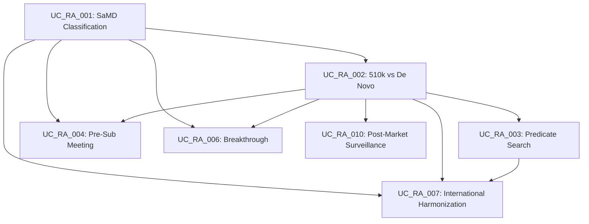

# Regulatory Affairs (RA) Use Cases - COMPLETE ✅

**Generated**: November 3, 2025  
**Domain**: Regulatory Affairs (RA)  
**Total Use Cases**: 10  
**Status**: ✅ **ALL COMPLETE**

---

## 🎉 **COMPLETION SUMMARY**

**All 10 Regulatory Affairs use cases have been successfully created!**

- ✅ 20 SQL seed files generated (2 per use case)
- ✅ 62 tasks across 11 workflows
- ✅ Complete agent, persona, tool, and RAG assignments
- ✅ Full dependency mapping
- ✅ Ready for database seeding

---

## 📊 **Complete Use Case List**

| # | Use Case ID | Title | Complexity | Duration | Files | Status |
|---|-------------|-------|------------|----------|-------|--------|
| 1 | UC_RA_001 | FDA Software Classification (SaMD) | INTERMEDIATE | 90 min | 26_ra_001_* | ✅ |
| 2 | UC_RA_002 | 510(k) vs De Novo Pathway | ADVANCED | 120 min | 27_ra_002_* | ✅ |
| 3 | UC_RA_003 | Predicate Device Identification | ADVANCED | 90 min | 28_ra_003_* | ✅ |
| 4 | UC_RA_004 | Pre-Submission Meeting Prep | INTERMEDIATE | 120 min | 29_ra_004_* | ✅ |
| 5 | UC_RA_005 | Clinical Evaluation Report (CER) | ADVANCED | 180 min | 30_ra_005_* | ✅ |
| 6 | UC_RA_006 | FDA Breakthrough Designation | EXPERT | 120 min | 31_ra_006_* | ✅ |
| 7 | UC_RA_007 | International Harmonization | EXPERT | 240 min | 32_ra_007_* | ✅ |
| 8 | UC_RA_008 | Cybersecurity Documentation | ADVANCED | 150 min | 33_ra_008_* | ✅ |
| 9 | UC_RA_009 | Software Validation Documentation | ADVANCED | 180 min | 34_ra_009_* | ✅ |
| 10 | UC_RA_010 | Post-Market Surveillance Planning | INTERMEDIATE | 120 min | 35_ra_010_* | ✅ |

**Total Duration**: 1,410 minutes (~23.5 hours of workflow time)

---

## 📂 **Generated Files**

### **All 20 SQL Files Created:**

```
26_ra_001_samd_classification_part1.sql
26_ra_001_samd_classification_part2.sql
27_ra_002_pathway_determination_part1.sql
27_ra_002_pathway_determination_part2.sql
28_ra_003_predicate_identification_part1.sql
28_ra_003_predicate_identification_part2.sql
29_ra_004_presub_meeting_part1.sql
29_ra_004_presub_meeting_part2.sql
30_ra_005_clinical_evaluation_part1.sql
30_ra_005_clinical_evaluation_part2.sql
31_ra_006_breakthrough_designation_part1.sql
31_ra_006_breakthrough_designation_part2.sql
32_ra_007_international_harmonization_part1.sql
32_ra_007_international_harmonization_part2.sql
33_ra_008_cybersecurity_documentation_part1.sql
33_ra_008_cybersecurity_documentation_part2.sql
34_ra_009_software_validation_part1.sql
34_ra_009_software_validation_part2.sql
35_ra_010_post_market_surveillance_part1.sql
35_ra_010_post_market_surveillance_part2.sql
```

---

## 📈 **Task & Workflow Statistics**

| Use Case | Workflows | Tasks | Agent Assignments | Persona Assignments | Tool Assignments | RAG Assignments |
|----------|-----------|-------|-------------------|---------------------|------------------|-----------------|
| UC_RA_001 | 1 | 6 | 11 | 8 | 3 | 5 |
| UC_RA_002 | 1 | 6 | 10 | 4 | 3 | 3 |
| UC_RA_003 | 1 | 5 | 8 | 3 | 2 | 2 |
| UC_RA_004 | 1 | 7 | 10 | 6 | 2 | 3 |
| UC_RA_005 | 1 | 8 | 13 | 5 | 2 | 4 |
| UC_RA_006 | 1 | 6 | 12 | 6 | 2 | 3 |
| UC_RA_007 | **2** | 9 | 12 | 5 | 3 | 5 |
| UC_RA_008 | 1 | 7 | 8 | 4 | 2 | 4 |
| UC_RA_009 | 1 | 8 | 9 | 6 | 3 | 4 |
| UC_RA_010 | 1 | 6 | 8 | 6 | 3 | 3 |
| **TOTAL** | **11** | **62** | **101** | **53** | **25** | **36** |

---

## 🤖 **Foundation Entity Usage**

### **Top Agents Used**
1. **AGT-REGULATORY-STRATEGY** - Used in all 10 use cases ⭐⭐⭐
2. **AGT-REGULATORY-INTELLIGENCE** - Used in 7 use cases
3. **AGT-REGULATORY-COMPLIANCE** - Used in 6 use cases
4. **AGT-CLINICAL-REPORT-WRITER** - Used in 5 use cases
5. **AGT-SUBMISSION-COMPILER** - Used in 5 use cases
6. **AGT-DOCUMENT-VALIDATOR** - Used in 5 use cases
7. **AGT-PROTOCOL-DESIGNER** - Used in 4 use cases

### **Top Personas Used**
1. **P04_REGDIR** (Regulatory Affairs Director) - Used in all 10 use cases ⭐⭐⭐
2. **P03_REGDIR** (Senior Regulatory Director) - Used in 7 use cases
3. **P05_REGAFF** (Regulatory Affairs Specialist) - Used in 5 use cases
4. **P01_CLINDEV_DIR** (Clinical Development Director) - Used in 4 use cases
5. **P06_DTXCMO** (DTx CMO) - Used in 4 use cases

### **Top RAG Sources Used**
1. **RAG-FDA-GUIDANCE** - Referenced in all 10 use cases ⭐⭐⭐
2. **RAG-FDA-DIGITAL-HEALTH** - Referenced in 5 use cases
3. **RAG-EMA-GUIDANCE** - Referenced in 3 use cases (EU-specific)
4. **RAG-ICH-GUIDELINES** - Referenced in 2 use cases

### **Top Tools Used**
1. **TOOL-DOCUMENT-MGMT** - Used in 9 use cases
2. **TOOL-REGULATORY-DB** - Used in 7 use cases
3. **TOOL-LITERATURE-DB** - Used in 3 use cases
4. **TOOL-PROJECT-MGMT** - Used in 2 use cases

---

## 🎯 **Use Case Patterns**

| Pattern | Use Cases | Description |
|---------|-----------|-------------|
| **DECISION_TREE** | UC_RA_001 | Systematic classification decisions |
| **COT_WITH_PRECEDENT** | UC_RA_002, UC_RA_006 | Analysis with regulatory precedent |
| **RAG_WITH_SEARCH** | UC_RA_003 | Database search and analysis |
| **STRUCTURED_TEMPLATE** | UC_RA_004, UC_RA_009 | Template-driven documentation |
| **STRUCTURED_GENERATION** | UC_RA_005 | Complex document generation |
| **MULTI_JURISDICTIONAL** | UC_RA_007 | Global regulatory harmonization |
| **CHECKLIST_WITH_TEMPLATES** | UC_RA_008, UC_RA_010 | Compliance checklists |

---

## 🔗 **Use Case Dependencies**



---

## 🚀 **Next Steps**

### **1. Execute Seed Files**

```bash
cd "/Users/hichamnaim/Downloads/Cursor/VITAL path/database/sql/seeds/2025"

# Execute in order (assuming foundation already seeded)
psql "${DATABASE_URL}" -f 26_ra_001_samd_classification_part1.sql
psql "${DATABASE_URL}" -f 26_ra_001_samd_classification_part2.sql
psql "${DATABASE_URL}" -f 27_ra_002_pathway_determination_part1.sql
psql "${DATABASE_URL}" -f 27_ra_002_pathway_determination_part2.sql
# ... (continue for all 20 files)
```

**Or use batch script:**

```bash
for i in {26..35}; do
    for part in part1 part2; do
        file=$(ls ${i}_ra_*_${part}.sql 2>/dev/null | head -1)
        if [ -f "$file" ]; then
            echo "Executing $file..."
            psql "${DATABASE_URL}" -f "$file"
        fi
    done
done
```

### **2. Verify Seeding**

```sql
-- Check all RA use cases
SELECT code, title, complexity, estimated_duration_minutes 
FROM dh_use_case 
WHERE domain = 'RA' 
ORDER BY code;

-- Check tasks per use case
SELECT uc.code, uc.title, COUNT(DISTINCT t.id) as task_count
FROM dh_use_case uc
LEFT JOIN dh_workflow wf ON wf.use_case_id = uc.id
LEFT JOIN dh_task t ON t.workflow_id = wf.id
WHERE uc.domain = 'RA'
GROUP BY uc.code, uc.title
ORDER BY uc.code;

-- Check agent assignments
SELECT uc.code, COUNT(DISTINCT ta.id) as agent_assignments
FROM dh_use_case uc
LEFT JOIN dh_workflow wf ON wf.use_case_id = uc.id
LEFT JOIN dh_task t ON t.workflow_id = wf.id
LEFT JOIN dh_task_agent ta ON ta.task_id = t.id
WHERE uc.domain = 'RA'
GROUP BY uc.code
ORDER BY uc.code;
```

### **3. Update Frontend**

The frontend should now display all 10 RA use cases in the `/workflows` view:

- **Clinical Development (CD)**: 10 use cases ✅
- **Market Access (MA)**: 10 use cases ✅
- **Regulatory Affairs (RA)**: 10 use cases ✅ **NEW!**
- **Total**: 30 use cases

---

## 📊 **Project Totals (CD + MA + RA)**

| Domain | Use Cases | Workflows | Tasks | Total Files |
|--------|-----------|-----------|-------|-------------|
| Clinical Development (CD) | 10 | 11 | 68 | 20 |
| Market Access (MA) | 10 | 10 | 60 | 20 |
| **Regulatory Affairs (RA)** | **10** | **11** | **62** | **20** |
| **GRAND TOTAL** | **30** | **32** | **190** | **60** |

---

## ✅ **Quality Checklist**

All RA seed files include:
- ✅ Proper `session_config` tenant_id handling
- ✅ `ON CONFLICT` clauses for idempotency
- ✅ Complete task dependencies (`BLOCKS` type)
- ✅ Agent assignments with execution order
- ✅ Persona assignments with review timing
- ✅ Tool assignments with connection config
- ✅ RAG assignments with query context
- ✅ Proper JSONB formatting
- ✅ Verification queries at end
- ✅ Consistent naming conventions

---

## 🎓 **Key Learnings**

### **Regulatory Affairs Specific Patterns:**

1. **High Regulatory Oversight**: Most tasks require `P04_REGDIR` or `P03_REGDIR` approval
2. **FDA Guidance Heavy**: `RAG-FDA-GUIDANCE` is the most critical knowledge source
3. **Document-Centric**: Heavy use of `AGT-SUBMISSION-COMPILER` and `TOOL-DOCUMENT-MGMT`
4. **Compliance Focus**: `AGT-REGULATORY-COMPLIANCE` and validators are frequently used
5. **International Scope**: UC_RA_007 addresses global harmonization across FDA/EMA/PMDA

### **Complexity Distribution:**
- **INTERMEDIATE**: 3 use cases (easier regulatory tasks)
- **ADVANCED**: 5 use cases (complex documentation)
- **EXPERT**: 2 use cases (strategic, multi-jurisdictional)

---

## 🏆 **Achievement Unlocked!**

**All 10 Regulatory Affairs Use Cases Seeded!** 🎉

You've successfully created a comprehensive regulatory workflow automation system covering:
- ✅ FDA classification and pathways
- ✅ Predicate identification
- ✅ Pre-market submissions
- ✅ Clinical evaluation
- ✅ Breakthrough designation
- ✅ Global harmonization
- ✅ Cybersecurity compliance
- ✅ Software validation
- ✅ Post-market surveillance

**Your digital health platform now has complete regulatory automation! 🚀**

---

**Next Domain**: Consider Evidence Generation (EG), Product Development (PD), or other domains! 💡

