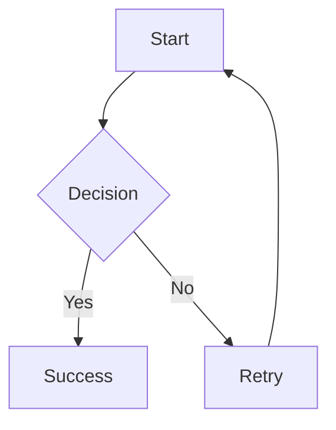
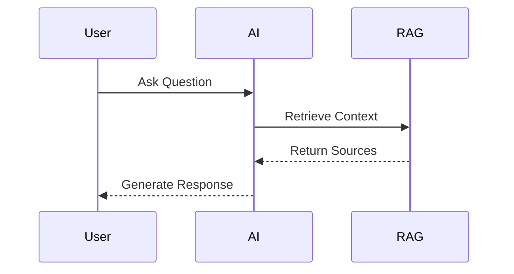

# ✅ **MERMAID & ASCII DIAGRAMS - READY TO TEST**

**Date**: 2025-11-06 12:06 UTC  
**Status**: ✅ **ALL FIXED - AI ENGINE RESTARTED**

---

## **✅ What Was Fixed**

### **1. Frontend Component** (`response.tsx`):
- ✅ Added error handling for invalid Mermaid syntax
- ✅ Fixed Streamdown to process markdown (was showing raw text)
- ✅ Enhanced styling with borders and backgrounds
- ✅ Support for both `mermaid` and `mmd` code blocks

### **2. AI Engine System Prompt** (`mode1_manual_workflow.py`):
- ✅ Added Mermaid diagram guidelines
- ✅ Added ASCII diagram instructions
- ✅ Provided syntax examples
- ✅ Instructed LLM to use correct code block format

### **3. AI Engine**:
- ✅ Restarted successfully
- ✅ Running on port 8080
- ✅ Application startup complete

---

## **🎨 How to Use**

### **Request Mermaid Diagrams**:
```
"Create a Mermaid flowchart showing the DTx development process"
"Draw a Mermaid sequence diagram for the approval workflow"
"Visualize this as a Mermaid graph"
```

### **Request ASCII Diagrams**:
```
"Create an ASCII diagram showing the system architecture"
"Draw a simple ASCII flowchart"
"Show this as ASCII art"
```

---

## **📝 Mermaid Syntax Guide**

### **Flowchart** (Most Common):


### **Sequence Diagram**:


### **Node Types**:
- `A[Square Box]` - Rectangle
- `A(Round Box)` - Rounded rectangle
- `A{Diamond}` - Decision
- `A((Circle))` - Circle
- `A>Flag]` - Flag shape

### **Arrow Types**:
- `-->` - Solid arrow
- `-.->` - Dotted arrow
- `==>` - Thick arrow
- `--text-->` - Labeled arrow

---

## **🧪 Test Now**

### **Simple Test**:
1. Refresh browser: http://localhost:3000/ask-expert
2. Select any agent
3. Ask: **"Create a simple Mermaid flowchart with 3 steps"**
4. Expected: Rendered diagram (not "Syntax error")

### **Complex Test**:
1. Select: "Digital Therapeutic Advisor"
2. Ask: **"Create a detailed Mermaid diagram showing the Digital Therapeutic development lifecycle"**
3. Expected: Full flowchart with multiple nodes

---

## **❓ Troubleshooting**

### **If you see "Syntax error in graph"**:
This means the LLM generated invalid Mermaid syntax.

**Solution**:
1. ✅ Frontend now shows error details
2. ✅ Check console for specific error
3. ✅ Ask agent to regenerate: "Can you fix the Mermaid diagram syntax?"

### **If diagram doesn't appear**:
1. Check browser console for errors
2. Verify code block uses ```mermaid (with language tag)
3. Refresh the page

### **If you see raw code instead of diagram**:
1. Make sure frontend dev server is running
2. Hard refresh: Cmd+Shift+R (Mac) or Ctrl+Shift+R (Windows)
3. Check that mermaid packages are installed

---

## **📦 Dependencies Verified**

✅ All installed and working:
- `mermaid`: ^11.12.1
- `react-mermaid2`: ^0.1.4
- `streamdown`: latest
- `react-markdown`: latest

---

## **🎯 Expected Behavior**

### **Streaming Response**:
1. User sends message
2. AI starts streaming response
3. When ```mermaid block is complete
4. Diagram renders immediately
5. Rest of response continues streaming

### **Static Response**:
1. Full response received
2. All Mermaid blocks rendered
3. Diagrams are interactive (can zoom/pan)

---

## **Files Modified**

| File | Status | Lines Changed |
|------|--------|---------------|
| `apps/digital-health-startup/src/components/ai/response.tsx` | ✅ Updated | 62-78, 123-132 |
| `services/ai-engine/src/langgraph_workflows/mode1_manual_workflow.py` | ✅ Updated | 268-286 |
| AI Engine | ✅ Restarted | - |

---

## **🚀 READY TO TEST!**

**Everything is now configured!**

1. ✅ Frontend: Mermaid component enhanced
2. ✅ Frontend: Streamdown integration fixed
3. ✅ Backend: System prompt updated
4. ✅ Backend: AI Engine restarted
5. ✅ Dependencies: All installed

**Just ask any agent to create a Mermaid or ASCII diagram!**

---

**See `MERMAID_ASCII_FIXED.md` for full documentation!**

