# Ask Panel Type 4: Adversarial Panel - Mermaid Workflow Diagrams

**Panel Type**: Adversarial Panel - Visual Workflow Documentation  
**Version**: 1.0  
**Date**: November 11, 2025  
**Status**: Production Ready  
**Document Type**: Visual Architecture & Flows

---

## 📋 DOCUMENT OVERVIEW

This document provides comprehensive Mermaid diagrams illustrating the complete end-to-end workflow for **Ask Panel Type 4: Adversarial Panel**. Each phase of the structured debate is visualized with detailed state transitions, decision points, argument development, and critical evaluation processes.

**What's Included:**
- ✅ High-level orchestration flow
- ✅ Phase-by-phase detailed diagrams
- ✅ Debate structure visualization
- ✅ Argument development patterns
- ✅ Counter-argument mechanisms
- ✅ Evidence weighing algorithms
- ✅ Risk assessment flows
- ✅ Integration patterns

---

## 🎯 DIAGRAM INDEX

### Core Workflows
1. **High-Level Orchestration** - Overall debate execution flow
2. **Phase 0: Team Formation** - Pro/Con team assignment
3. **Phase 1: Position Development** - Initial argument construction
4. **Phase 2: Opening Arguments** - Team position presentations
5. **Phase 3: Cross-Examination** - Critical questioning phase
6. **Phase 4: Rebuttal Round** - Counter-argument development
7. **Phase 5: Evidence Weighing** - Strength assessment
8. **Phase 6: Risk Analysis** - Final risk/benefit evaluation

### Supporting Diagrams
9. **State Machine** - Complete LangGraph state transitions
10. **Debate Moderator Logic** - Turn management and fairness
11. **Evidence Scoring Algorithm** - Argument strength calculation
12. **Counter-Argument Generator** - Rebuttal construction
13. **Risk Matrix Development** - Risk vs benefit analysis
14. **Neutral Observer Integration** - Balanced perspective
15. **Streaming Architecture** - Real-time debate updates
16. **Multi-Tenant Security** - Debate isolation
17. **Error Handling** - Debate recovery scenarios
18. **Decision Tree** - When to use Adversarial Panel

---

## 📊 DIAGRAM 1: HIGH-LEVEL ORCHESTRATION FLOW


---

## 🏗️ DIAGRAM 2: TEAM FORMATION & ASSIGNMENT

```mermaid
graph TB
    subgraph "Team Formation Process"
        Query[User Query/Decision] --> AnalyzeStakes{Identify<br/>Stakes}
        
        AnalyzeStakes --> IdentifyPro[Identify Pro Position:<br/>Benefits, Opportunities]
        AnalyzeStakes --> IdentifyCon[Identify Con Position:<br/>Risks, Challenges]
        
        IdentifyPro --> SelectProExperts[Select Pro Experts:<br/>Based on Domain]
        IdentifyCon --> SelectConExperts[Select Con Experts:<br/>Based on Domain]
        
        SelectProExperts --> ProTeam[Pro Team (2-3):<br/>• Domain Expert 1<br/>• Domain Expert 2<br/>• Support Expert]
        
        SelectConExperts --> ConTeam[Con Team (2-3):<br/>• Risk Analyst<br/>• Skeptic Expert<br/>• Regulatory Expert]
        
        ProTeam --> SelectNeutral[Select Neutral Observer]
        ConTeam --> SelectNeutral
        
        SelectNeutral --> NeutralExpert[Neutral Expert:<br/>• Balanced Perspective<br/>• Evidence Evaluator<br/>• Synthesis Role]
        
        NeutralExpert --> TeamConfig[Final Team Configuration:<br/>5-7 Total Experts]
        
        TeamConfig --> InitializeDebate[Initialize Debate<br/>with Teams]
    end
    
    style ProTeam fill:#e1f5e1
    style ConTeam fill:#fce4ec
    style NeutralExpert fill:#e3f2fd
```

---

## 💬 DIAGRAM 3: POSITION DEVELOPMENT PHASE


---

## 🎤 DIAGRAM 4: OPENING ARGUMENTS FLOW


---

## ❓ DIAGRAM 5: CROSS-EXAMINATION DYNAMICS


---

## 🔄 DIAGRAM 6: REBUTTAL ROUND STRUCTURE


---

## ⚖️ DIAGRAM 7: EVIDENCE WEIGHING ALGORITHM


---

## 📊 DIAGRAM 8: RISK MATRIX DEVELOPMENT

```mermaid
graph TB
    subgraph "Risk-Benefit Matrix Construction"
        Start([Phase 6: Risk Analysis]) --> CollectRisks[Collect All<br/>Identified Risks]
        CollectBenefits[Collect All<br/>Identified Benefits]
        
        CollectRisks --> CategorizeRisks[Categorize Risks:<br/>• Technical<br/>• Regulatory<br/>• Financial<br/>• Operational]
        
        CollectBenefits --> CategorizeBenefits[Categorize Benefits:<br/>• Revenue<br/>• Efficiency<br/>• Compliance<br/>• Innovation]
        
        CategorizeRisks --> ScoreRisks[Score Each Risk:<br/>Likelihood × Impact]
        CategorizeBenefits --> ScoreBenefits[Score Each Benefit:<br/>Probability × Value]
        
        ScoreRisks --> PlotMatrix[Plot on Matrix:<br/>2x2 Grid]
        ScoreBenefits --> PlotMatrix
        
        PlotMatrix --> Quadrants{Analyze<br/>Quadrants}
        
        Quadrants -->|Q1| HighRiskHighReward[High Risk<br/>High Reward]
        Quadrants -->|Q2| LowRiskHighReward[Low Risk<br/>High Reward ✓]
        Quadrants -->|Q3| LowRiskLowReward[Low Risk<br/>Low Reward]
        Quadrants -->|Q4| HighRiskLowReward[High Risk<br/>Low Reward ✗]
        
        HighRiskHighReward --> Decision[Strategic Decision:<br/>Risk Tolerance?]
        LowRiskHighReward --> Decision
        LowRiskLowReward --> Decision
        HighRiskLowReward --> Decision
        
        Decision --> Recommendation[Final Recommendation:<br/>Proceed/Modify/Reject]
    end
    
    style LowRiskHighReward fill:#e1f5e1
    style HighRiskLowReward fill:#fce4ec
```



---

## 🔄 DIAGRAM 9: STATE MACHINE IMPLEMENTATION


---

## 🎯 DIAGRAM 10: DEBATE MODERATOR LOGIC

```mermaid
graph TD
    subgraph "AI Debate Moderator Logic"
        Start([Moderator Active]) --> MonitorTime[Monitor Time:<br/>Track phase duration]
        
        MonitorTime --> CheckTurn{Whose<br/>Turn?}
        
        CheckTurn -->|Pro Team| ValidatePro[Validate Pro Input:<br/>On-topic, respectful]
        CheckTurn -->|Con Team| ValidateCon[Validate Con Input:<br/>On-topic, respectful]
        
        ValidatePro --> CheckBalance{Check<br/>Balance}
        ValidateCon --> CheckBalance
        
        CheckBalance -->|Imbalanced| Intervene[Moderator Intervention:<br/>"Let's hear from..."]
        CheckBalance -->|Balanced| Continue
        
        Intervene --> AdjustTime[Adjust Time:<br/>Give more to disadvantaged]
        
        Continue --> TrackSpeaking[Track Speaking Time:<br/>Per team/expert]
        
        TrackSpeaking --> PhaseTransition{Phase<br/>Complete?}
        
        PhaseTransition -->|No| CheckTurn
        PhaseTransition -->|Yes| AnnounceNext[Announce Next Phase:<br/>Clear instructions]
        
        AnnounceNext --> ResetTimers[Reset Phase Timers]
        
        ResetTimers --> NextPhase([Next Phase])
        
        style Intervene fill:#fff9c4
        style AdjustTime fill:#fce4ec
    end
```

---

## 💡 DIAGRAM 11: COUNTER-ARGUMENT GENERATOR

```mermaid
graph LR
    subgraph "Counter-Argument Construction"
        OpponentArg[Opponent Argument] --> Analyze[Analyze Structure]
        
        Analyze --> IdentifyType{Argument<br/>Type?}
        
        IdentifyType -->|Empirical| AttackData[Attack Data:<br/>• Sample size<br/>• Methodology<br/>• Bias]
        
        IdentifyType -->|Logical| AttackLogic[Attack Logic:<br/>• Premises<br/>• Assumptions<br/>• Fallacies]
        
        IdentifyType -->|Precedent| AttackPrecedent[Attack Precedent:<br/>• Relevance<br/>• Context<br/>• Outcomes]
        
        IdentifyType -->|Expert Opinion| AttackExpert[Attack Authority:<br/>• Credentials<br/>• Conflicts<br/>• Consensus]
        
        AttackData --> GenerateCounter[Generate Counter:<br/>Alternative interpretation]
        AttackLogic --> GenerateCounter
        AttackPrecedent --> GenerateCounter
        AttackExpert --> GenerateCounter
        
        GenerateCounter --> ProvideEvidence[Provide Counter-Evidence:<br/>Supporting sources]
        
        ProvideEvidence --> DeliverRebuttal[Deliver Rebuttal:<br/>Clear, respectful]
    end
```



---

## 📈 DIAGRAM 12: STREAMING EVENT FLOW


---

## 🔒 DIAGRAM 13: MULTI-TENANT SECURITY


---

## ⚠️ DIAGRAM 14: ERROR HANDLING


---

## 🌐 DIAGRAM 15: INTEGRATION PATTERNS


---

## 🎬 DIAGRAM 16: PANEL EXECUTION TIMELINE


---

## 🎯 DIAGRAM 17: DECISION TREE - WHEN TO USE

```mermaid
graph TB
    Start([Decision Needed]) --> DecisionType{Decision<br/>Type?}
    
    DecisionType -->|High Risk| RiskCheck{Need Risk<br/>Analysis?}
    DecisionType -->|Innovation| UseOpen[Use Open Panel]
    DecisionType -->|Regulatory| UseStructured[Use Structured Panel]
    DecisionType -->|Deep Analysis| UseSocratic[Use Socratic Panel]
    DecisionType -->|Consensus| UseDelphi[Use Delphi Panel]
    
    RiskCheck -->|Yes| StakesCheck{Critical<br/>Stakes?}
    RiskCheck -->|No| UseStructured
    
    StakesCheck -->|Yes| UseAdversarial[✓ Use Adversarial Panel<br/>Type 4]
    StakesCheck -->|Medium| ConsiderAdversarial[Consider Adversarial<br/>or Structured]
    StakesCheck -->|Low| UseOpen
    
    UseAdversarial --> Characteristics[Characteristics:<br/>• 4-6 experts<br/>• 10-15 minutes<br/>• Pro vs Con teams<br/>• Evidence-based debate<br/>• Risk matrix output]
    
    Characteristics --> BestFor[Best For:<br/>• Go/No-go decisions<br/>• Investment evaluation<br/>• Technology adoption<br/>• Regulatory strategy<br/>• M&A assessment<br/>• Product launch]
    
    BestFor --> Output[Deliverables:<br/>• Risk assessment<br/>• Pro/Con analysis<br/>• Evidence scores<br/>• Decision matrix<br/>• Balanced recommendation]
    
    style UseAdversarial fill:#fce4ec
    style Characteristics fill:#e1f5e1
    style BestFor fill:#e3f2fd
```



---

## 📊 DIAGRAM 18: ARGUMENT STRENGTH VISUALIZATION


---

## 📝 IMPLEMENTATION NOTES

### Mermaid Rendering

All diagrams in this document use Mermaid syntax and can be:
- **Rendered in GitHub**: Automatically displayed in GitHub markdown
- **Used in Documentation Sites**: Supported by Docusaurus, VuePress, etc.
- **Converted to Images**: Use Mermaid CLI or online tools
- **Embedded in Presentations**: Export as PNG/SVG for PowerPoint/Keynote
- **Interactive Dashboards**: Integrate with monitoring systems

### Key Differences vs Other Panel Types

**Adversarial Panel (Type 4)**:
- ⚔️ **Structured Debate**: Pro vs Con team format
- ⚔️ **Evidence-Based**: All arguments require evidence
- ⚔️ **Cross-Examination**: Direct questioning between teams
- ⚔️ **Risk-Focused**: Emphasis on risk/benefit analysis
- ⚔️ **Neutral Observer**: Balanced perspective from neutral expert
- ⚔️ **Scored Arguments**: Quantitative strength assessment
- ⚔️ **10-15 Minutes**: Comprehensive debate time

**Comparison to Other Types**:
- vs **Structured (Type 1)**: More confrontational, explicit opposition
- vs **Open (Type 2)**: Focused debate vs free exploration
- vs **Socratic (Type 3)**: Debate vs questioning methodology
- vs **Delphi (Type 5)**: Open debate vs anonymous rounds
- vs **Hybrid (Type 6)**: AI-only vs human-AI mix

### Diagram Update Workflow

1. **Code Changes**: Update corresponding diagram when implementation changes
2. **Version Control**: Track diagram changes with code changes in git
3. **Documentation Sync**: Keep diagrams aligned with architecture docs
4. **Review Process**: Include diagram reviews in pull request process
5. **Automated Generation**: Consider tools to generate diagrams from code

---

## 🎬 CONCLUSION

These 18 comprehensive Mermaid diagrams provide complete visual documentation of the Ask Panel Type 4 (Adversarial Panel) orchestration workflow. Each diagram serves specific purposes:

**For Developers:**
- Understand debate flow mechanics
- Implement team formation logic
- Build cross-examination system
- Design scoring algorithms
- Handle debate state management

**For Product Managers:**
- Visualize debate structure
- Understand risk assessment process
- Plan feature enhancements
- Communicate with stakeholders
- Design user experience

**For Risk Managers:**
- Understand evaluation methodology
- Review evidence weighing
- Validate risk matrix construction
- Assess decision framework
- Plan risk mitigation

**For Operations:**
- Monitor debate execution
- Track argument quality
- Optimize timing
- Troubleshoot issues
- Measure effectiveness

---

## 🚀 Next Steps

These diagrams provide everything needed to:
1. **Understand** Adversarial Panel Type 4 conceptually
2. **Implement** the debate workflow system
3. **Build** the evidence scoring algorithm
4. **Generate** risk assessment matrices
5. **Deploy** with confidence to production

**Suggested Implementation Order:**
1. Review workflow diagrams to understand debate structure
2. Study team formation and assignment logic
3. Implement cross-examination state machine
4. Build argument scoring algorithm
5. Create risk matrix generator
6. Test with real decision scenarios
7. Deploy and validate with risk teams

---

**Document Version**: 1.0  
**Last Updated**: November 11, 2025  
**Status**: Production Ready  
**Format**: Mermaid Markdown  
**Maintainer**: VITAL Platform Team

**Related Documents**:
- [ASK_PANEL_TYPE4_ADVERSARIAL_WORKFLOW_COMPLETE.md]
- [ASK_PANEL_TYPE4_LANGGRAPH_ARCHITECTURE.md]
- [ASK_PANEL_COMPREHENSIVE_DOCUMENTATION.md]
- [ASK_PANEL_TYPE1_MERMAID_WORKFLOWS.md] (Structured - for comparison)
- [ASK_PANEL_TYPE2_MERMAID_WORKFLOWS.md] (Open - for comparison)
