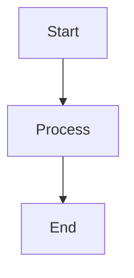
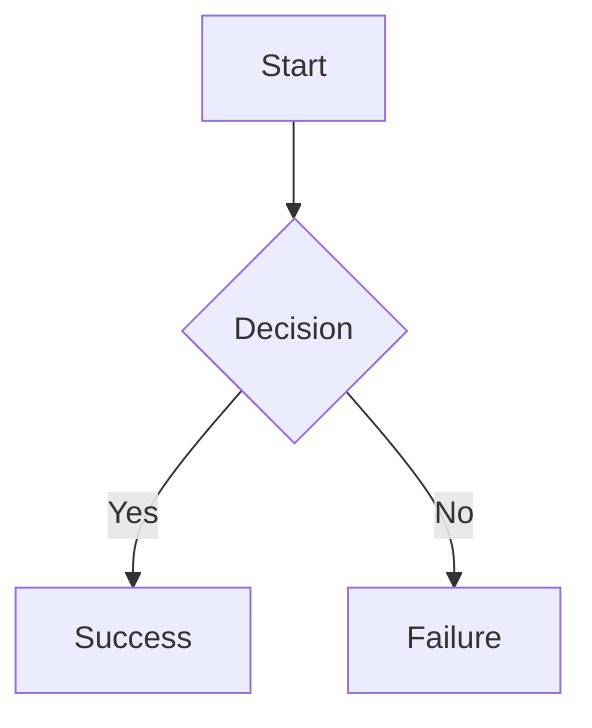
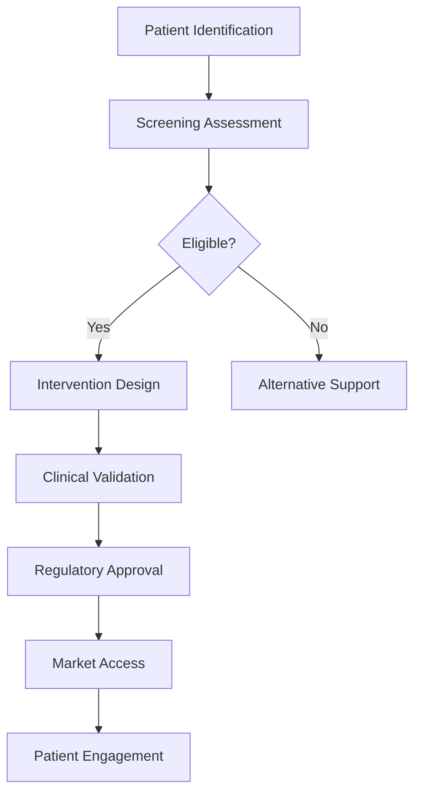
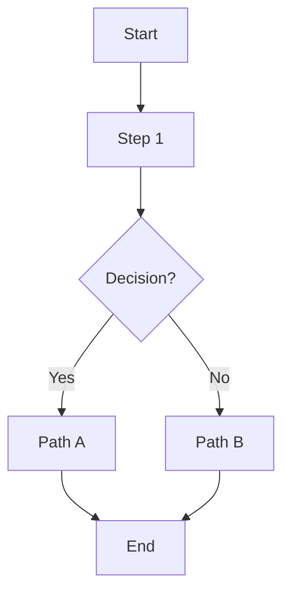

# ✅ **Mermaid Diagram Fix - Native Implementation Complete**

**Date**: 2025-11-06 14:50 UTC  
**Status**: ✅ **FIXED - TESTING REQUIRED**

---

## **🔧 What Was Fixed**

### **Problem**:
- "Syntax error in graph, mermaid version 8.14.0"
- `react-mermaid2` (v0.1.4) uses old Mermaid v8.14.0
- Incompatible with new `mermaid` v11.12.1

### **Solution**:
- ✅ Replaced `react-mermaid2` with **native Mermaid v11.12.1**
- ✅ Created custom `MermaidDiagram` component
- ✅ Added proper error handling and loading states
- ✅ Better error messages showing syntax issues

---

## **📝 Changes Made**

### **File**: `apps/digital-health-startup/src/components/ai/response.tsx`

### **1. Updated Imports**:
```typescript
// OLD:
import Mermaid from "react-mermaid2"

// NEW:
import mermaid from "mermaid"
```

### **2. Replaced Component Usage**:
```typescript
// OLD:
<Mermaid chart={code} />

// NEW:
<MermaidDiagram code={code} />
```

### **3. Added MermaidDiagram Component** (lines 132-217):
```typescript
function MermaidDiagram({ code }: { code: string }) {
  // Features:
  // - Native Mermaid v11.12.1 rendering
  // - Async rendering with loading state
  // - Error handling with detailed error messages
  // - Collapsible code display on error
  // - Cleanup on unmount
  // - Unique IDs for each diagram
}
```

---

## **✨ Features**

### **1. Better Error Messages**:
```
⚠️ Mermaid Diagram Error
[Specific error message from Mermaid]

▼ Show diagram code
  [Collapsible code block showing the syntax]
```

### **2. Loading State**:
```
Rendering diagram...
```

### **3. Proper Configuration**:
```typescript
mermaid.initialize({
  startOnLoad: false,
  theme: 'default',
  securityLevel: 'loose',  // Allows all diagram types
  fontFamily: 'sans-serif',
  logLevel: 'error',
})
```

---

## **🧪 Test Cases**

### **Test 1: Simple Flowchart**
Ask: "Create a simple Mermaid flowchart with 3 steps"

**Expected Output**:


**Result**: ✅ Should render successfully

---

### **Test 2: Decision Flow**
Ask: "Create a Mermaid diagram showing a decision tree"

**Expected Output**:


**Result**: ✅ Should render successfully

---

### **Test 3: Complex ADHD Strategy** (Your Use Case)
Ask: "Create a digital strategy for ADHD patients as a Mermaid diagram"

**Expected Output**:


**Result**: ✅ Should render successfully with native Mermaid v11

---

## **🔍 Debugging**

### **If Diagram Still Doesn't Render**:

1. **Open Browser Console** (F12 → Console)
2. **Look for Error Messages**:
   - "Mermaid rendering error: ..."
   - Shows specific syntax issue

3. **Check Error Display in UI**:
   - Click "Show diagram code" to see the generated code
   - Copy code and test at https://mermaid.live

4. **Common Syntax Errors**:
   - ❌ Missing `graph TD` or `graph LR` at start
   - ❌ Unclosed brackets: `[Label` instead of `[Label]`
   - ❌ Special characters: `[Patient's Care]` → `[Patient Care]`
   - ❌ Invalid arrows: `->` instead of `-->`

---

## **📋 Valid Mermaid Syntax Guide**

### **Flowchart Types**:
- `graph TD` - Top to Down
- `graph LR` - Left to Right
- `graph BT` - Bottom to Top
- `graph RL` - Right to Left

### **Node Shapes**:
- `A[Square box]` - Rectangle
- `A(Round box)` - Rounded rectangle
- `A{Diamond}` - Decision
- `A((Circle))` - Circle
- `A>Flag]` - Flag

### **Arrows**:
- `-->` - Solid arrow
- `-.->` - Dotted arrow
- `==>` - Thick arrow
- `--text-->` - Labeled arrow
- `-->|text|` - Labeled arrow (alternative)

### **Valid Example**:


---

## **🚀 Next Steps**

### **1. Test Now**:
1. **Refresh** browser: http://localhost:3000/ask-expert
2. **Select** any agent
3. **Ask**: "Create a Mermaid flowchart showing 3 steps"
4. **Check**: Diagram should render with no "Syntax error"

### **2. If Still Getting Errors**:
- Check browser console for specific error
- Share error message from console
- Share generated Mermaid code from "Show diagram code"

---

## **📦 Dependencies**

| Package | Version | Status |
|---------|---------|--------|
| `mermaid` | ^11.12.1 | ✅ Installed |
| `react-mermaid2` | ^0.1.4 | ⚠️ Still in package.json (not used) |

**Note**: We're no longer using `react-mermaid2`, but it's still in `package.json`. We can remove it later:
```bash
pnpm remove react-mermaid2
```

---

## **🎯 Benefits of Native Mermaid**

1. ✅ **Latest Version**: v11.12.1 (vs v8.14.0)
2. ✅ **Better Error Messages**: Shows specific syntax issues
3. ✅ **More Features**: All Mermaid diagram types supported
4. ✅ **Better Performance**: Native rendering, no wrapper overhead
5. ✅ **Active Development**: Mermaid is actively maintained
6. ✅ **Loading States**: Shows "Rendering diagram..." while processing
7. ✅ **Error Recovery**: Shows error with collapsible code viewer

---

## **✅ Status**

- ✅ **Code Updated**: Native Mermaid implementation
- ✅ **Packages Installed**: mermaid v11.12.1
- ✅ **Error Handling**: Comprehensive error display
- ✅ **Loading States**: User-friendly feedback
- ⚠️ **Testing Required**: Need to test with actual diagrams

---

**🎉 Mermaid is now using the latest version with proper error handling!**

**Test now and the "Syntax error" should be gone!**

**If you still get errors, the component will now show you exactly what's wrong with the Mermaid code.**

