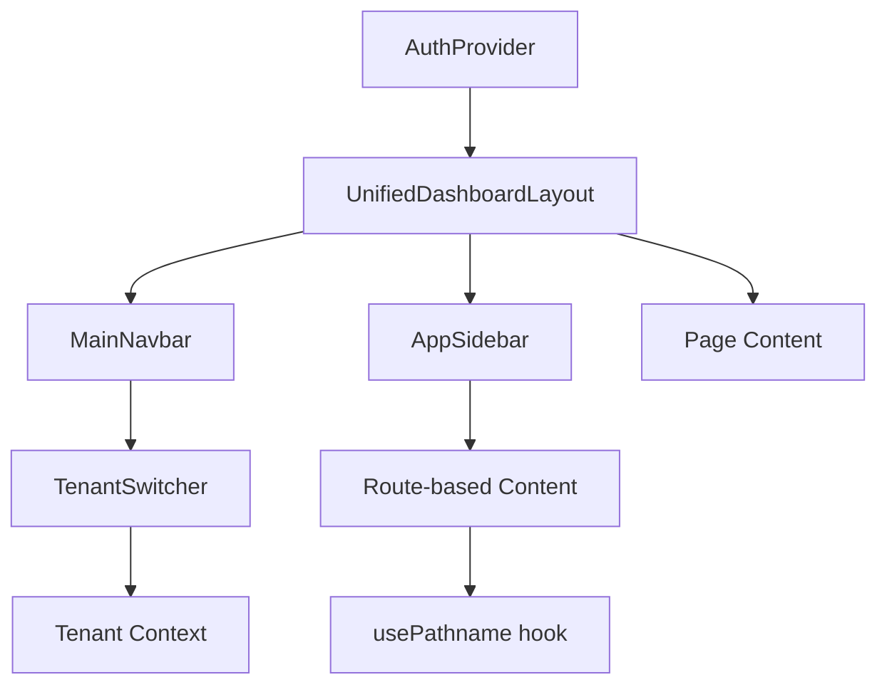

# Unified Dashboard Layout - Complete Integration Summary

## Overview
The UnifiedDashboardLayout is the main layout wrapper for all authenticated pages in the application. It integrates the top navbar, sidebar, and content area into a cohesive, responsive layout.

## Architecture

### Component Hierarchy
```
ThemeProvider
└── SidebarProvider
    └── <div flex-col> (Full screen container)
        ├── MainNavbar (Top navigation bar)
        └── <div flex> (Content wrapper)
            ├── AppSidebar (Left sidebar - collapsible)
            └── SidebarInset (Main content area)
                ├── <header> (Breadcrumb navigation)
                └── <main> (Page content)
```

## Components

### 1. MainNavbar (Top Navigation)
**Location:** `/components/navbar/MainNavbar.tsx`

**Features:**
- **Fixed at top** - No sticky positioning, naturally at top of flex-col
- **z-index: 50** - Ensures dropdown menus appear above all content
- **Responsive design** - Hamburger menu on mobile, full nav on desktop
- **Glassmorphism** - Backdrop blur effect with semi-transparent background

**Navigation Sections:**
- **Left Side:**
  - Home
  - Dashboard (authenticated users only)
  - Services (dropdown)
  - Library (dropdown)
  - Admin (admin users only)

- **Right Side:**
  - Search (hidden on mobile)
  - Tenant Switcher (authenticated users only) ⭐ **NEW**
  - Notifications (authenticated users only)
  - Theme Toggle (dark/light mode)
  - User Menu / Login button

**Tenant Switcher Integration:**
- Displays active tenant logo and name
- Dropdown to switch between organizations
- Shows: Vital.expert, Vital.pharma, Vital.startup
- Logos from `/public/logos/`

### 2. AppSidebar (Left Sidebar)
**Location:** `/components/app-sidebar-new.tsx`

**Features:**
- **Collapsible** - Can minimize to icon-only mode
- **Contextual content** - Different content based on current route
- **Route-based rendering:**
  - `/dashboard` → Dashboard overview and quick actions
  - `/admin` → Admin navigation
  - `/ask-expert` → Agent selection and sessions
  - `/ask-panel` → Panel management
  - `/workflows` → Workflow status
  - `/solution-builder` → Solution components
  - `/agents` → Agent filters and actions
  - `/knowledge` → Knowledge categories
  - `/prism` → Prompt library
  - `/personas` → Persona filters

**Structure:**
- **Content Area:** Dynamic contextual content
- **Footer:** NavUser component (user profile dropdown)
- **Rail:** Visual indicator for collapsed state

### 3. Content Area
**Location:** Inside `SidebarInset`

**Structure:**
- **Breadcrumb Header:**
  - Sidebar toggle button
  - Auto-generated breadcrumbs from URL
  - Sticky header with glassmorphism
  - Adapts height when sidebar is collapsed

- **Main Content:**
  - Scrollable area
  - Padding and gap spacing
  - Renders page-specific content (`children`)

## Layout Flow

### Desktop View (≥1024px)
```
┌─────────────────────────────────────────────────────────┐
│  MainNavbar (Home | Dashboard | Services | Library)    │
│  [Search] [Vital.expert ▼] [🔔] [🌙] [User ▼]         │
├──────────┬──────────────────────────────────────────────┤
│ Sidebar  │ [☰] Home > Workflows > Editor              │
│          ├──────────────────────────────────────────────┤
│ • Item1  │                                              │
│ • Item2  │                                              │
│ • Item3  │         Main Content Area                   │
│          │                                              │
│ [User]   │                                              │
└──────────┴──────────────────────────────────────────────┘
```

### Mobile View (<1024px)
```
┌─────────────────────────────────────────┐
│ [☰] [Search] [🔔] [🌙] [User ▼]        │
├─────────────────────────────────────────┤
│                                         │
│                                         │
│         Main Content Area               │
│                                         │
│                                         │
└─────────────────────────────────────────┘
```

## Z-Index Layering

| Component | Z-Index | Purpose |
|-----------|---------|---------|
| MainNavbar | z-50 | Stays above sidebar and content |
| Dropdown Menus | z-50 | Portal-rendered, appears above all |
| Modal Overlays | z-50 | (Radix Portal) |
| Sidebar | default | Below navbar |
| Content | default | Lowest layer |

## Styling

### MainNavbar
- Background: `bg-background/95 backdrop-blur`
- Border: `border-b`
- Height: `h-16`
- Container: `max-width` responsive container

### Breadcrumb Header
- Background: `bg-background/95 backdrop-blur`
- Border: `border-b`
- Height: `h-16` (normal) → `h-12` (collapsed sidebar)
- Sticky positioning within SidebarInset

### Sidebar
- Collapsible to icon mode
- Border: `border-r`
- Content: Scrollable with padding

## Key Features

### 1. Tenant Switching
- **Location:** Top navbar (right side)
- **Component:** TenantSwitcher
- **Logos:**
  - `/logos/VITALexpert.png`
  - `/logos/VITALpharma.png`
  - `/logos/VITALstartup.png`
- **State:** React state (to be connected to tenant context)

### 2. Responsive Design
- **Desktop (≥1024px):** Full navbar with all items
- **Tablet (768px-1024px):** Partial navbar, collapsible sidebar
- **Mobile (<768px):** Hamburger menu, hidden sidebar

### 3. Theme Support
- Light/Dark mode toggle in navbar
- ThemeProvider wraps entire layout
- Theme persists across sessions

### 4. Authentication Gates
- Dashboard link: Requires authentication
- Tenant switcher: Requires authentication
- Notifications: Requires authentication
- Admin section: Requires admin role

## Data Flow



## File Structure

```
/components
├── navbar/
│   ├── MainNavbar.tsx          ← Top navigation bar
│   ├── MobileNav.tsx            ← Mobile hamburger menu
│   ├── NavbarSearch.tsx         ← Search component
│   └── NavbarNotifications.tsx  ← Notifications bell
├── dashboard/
│   └── unified-dashboard-layout.tsx  ← Main layout wrapper
├── tenant-switcher.tsx          ← Tenant selector dropdown
├── app-sidebar-new.tsx          ← Left sidebar
├── nav-user.tsx                 ← User profile dropdown
└── sidebar-view-content.tsx     ← Route-specific sidebar content
```

## Integration Points

### 1. Authentication
- Uses `useAuth()` hook from `@/lib/auth/supabase-auth-context`
- Checks `user` and `userProfile` for conditional rendering
- Redirects unauthenticated users via AppLayout

### 2. Routing
- Uses Next.js `usePathname()` hook
- Auto-generates breadcrumbs from URL segments
- Conditional sidebar content based on route

### 3. Theme
- Uses `next-themes` library
- ThemeProvider wraps layout
- Theme toggle button in navbar

### 4. Tenant Context (To Be Implemented)
```typescript
// TODO: Replace mock tenants with real context
const { tenants, activeTenant, setActiveTenant } = useTenant()
```

## Navigation Routes

### Services
- `/ask-expert` - 1:1 AI consultant conversations
- `/ask-panel` - Multi-agent panel discussions
- `/workflows` - Multi-step automated processes
- `/solution-builder` - Pre-built solutions marketplace

### Library
- `/agents` - Browse and manage AI agents
- `/personas` - AI personas for different roles
- `/jobs-to-be-done` - Define and manage JTBDs
- `/tools` - Available tools and integrations
- `/prism` - Prompt templates and engineering
- `/knowledge` - Knowledge base and documentation

### Admin
- `/admin` - Admin dashboard and settings (admins only)

## Performance Considerations

1. **SSR-Safe:** Uses `mounted` state to prevent hydration mismatches
2. **Code Splitting:** Components lazy-loaded where appropriate
3. **Memoization:** Uses `useMemo` for computed values
4. **Portal Rendering:** Dropdown menus render at document root for performance

## Future Enhancements

1. **Tenant Context Integration:**
   - Connect TenantSwitcher to real tenant data
   - Implement tenant switching logic
   - Persist tenant selection

2. **Analytics:**
   - Track navigation patterns
   - Monitor tenant switching
   - Measure component performance

3. **Accessibility:**
   - Keyboard navigation improvements
   - ARIA labels for screen readers
   - Focus management

4. **Customization:**
   - User-configurable navbar items
   - Saved layouts per user
   - Custom theme colors per tenant

## Troubleshooting

### Dropdown Not Appearing
- **Solution:** Ensure navbar has `z-50` and no `sticky` positioning
- **Reason:** Radix Portal needs proper stacking context

### Sidebar Not Collapsing
- **Solution:** Verify `SidebarProvider` wraps the layout
- **Check:** Ensure `collapsible="icon"` prop on Sidebar

### Breadcrumbs Not Updating
- **Solution:** Check `usePathname()` is working correctly
- **Verify:** Component is client-side (`'use client'`)

### Theme Not Persisting
- **Solution:** Verify `ThemeProvider` wraps layout
- **Check:** next-themes configuration in `_app` or layout

## Conclusion

The UnifiedDashboardLayout provides a complete, production-ready layout system with:
- ✅ Top navbar with tenant switching
- ✅ Collapsible contextual sidebar
- ✅ Responsive design
- ✅ Theme support
- ✅ Authentication gates
- ✅ Auto-generated breadcrumbs
- ✅ Proper z-index layering

All components are properly integrated and working together to create a seamless user experience.
