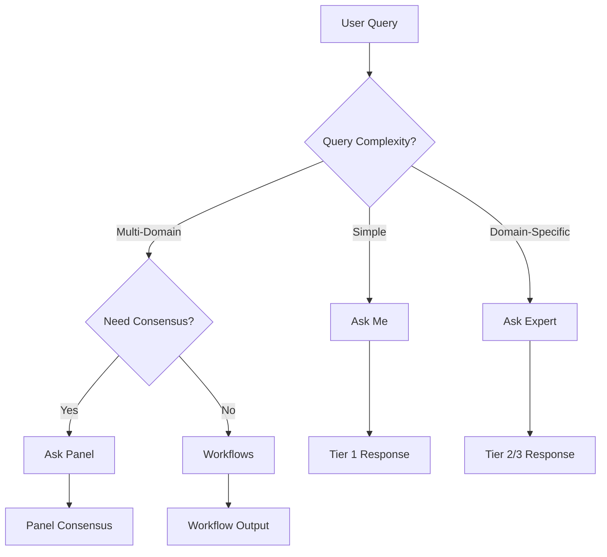

# Agent 0S: Comprehensive Business Guide

**VITAL Platform - Intelligent Agent Orchestration System**

**Version:** 4.0  
**Last Updated:** December 2025  
**Audience:** Business Users, Product Managers, Decision Makers

---

## Table of Contents

1. [Executive Summary](#executive-summary)
2. [What is Agent 0S?](#what-is-agent-0s)
3. [The 5-Level Agent Hierarchy](#the-5-level-agent-hierarchy)
4. [Agent Enrichment Model](#agent-enrichment-model)
5. [Service Layer Integration](#service-layer-integration)
6. [Escalation & Delegation Capabilities](#escalation--delegation-capabilities)
7. [Deep Agents & Sub-Agents](#deep-agents--sub-agents)
8. [Evidence-Based Agent Selection](#evidence-based-agent-selection)
9. [Hybrid Search Architecture](#hybrid-search-architecture)
10. [Service Modes](#service-modes)
11. [Business Benefits](#business-benefits)
12. [Glossary](#glossary)

---

## Executive Summary

Agent 0S is VITAL's intelligent agent orchestration system that powers all AI-driven interactions across the platform. It manages **1,000+ specialized agents** organized in a **5-level hierarchy**, enabling sophisticated task handling through automatic delegation, escalation, and evidence-based selection.

### Key Capabilities at a Glance

```
┌─────────────────────────────────────────────────────────────────────────┐
│                        AGENT 0S CAPABILITIES                             │
├─────────────────────────────────────────────────────────────────────────┤
│                                                                          │
│  ✓ 1,000+ Domain Expert Agents (Medical, Regulatory, Market Access)    │
│  ✓ 5-Level Intelligent Hierarchy (Master → Expert → Specialist → ...)  │
│  ✓ Rich Agent Enrichment (Skills, Capabilities, Tools, Roles)          │
│  ✓ Automatic Escalation & Delegation                                    │
│  ✓ Evidence-Based Multi-Criteria Selection                              │
│  ✓ Hybrid Search (Vector + Graph + Full-Text)                          │
│  ✓ Human-in-the-Loop Safety Gates                                       │
│  ✓ Multi-Tenant Isolation                                               │
│  ✓ Service Layer Integration (Ask Expert, Panel, Workflows)            │
│                                                                          │
└─────────────────────────────────────────────────────────────────────────┘
```

---

## What is Agent 0S?

Agent 0S is the **intelligent orchestration layer** that manages how AI agents work together to answer your questions and complete tasks. Think of it as an **AI workforce manager** that:

1. **Understands** your query's complexity and requirements
2. **Selects** the best-qualified agent(s) from 1,000+ available
3. **Coordinates** multiple agents when needed
4. **Enriches** agents with skills, capabilities, tools, and domain expertise
5. **Integrates** seamlessly with all VITAL service layers
6. **Escalates** to human oversight for critical decisions
7. **Delivers** evidence-based, accurate responses

### The Agent 0S Promise

```
╔═══════════════════════════════════════════════════════════════════════╗
║                                                                        ║
║   "The right agent, for the right task, with the right oversight"     ║
║                                                                        ║
╚═══════════════════════════════════════════════════════════════════════╝
```

### Agent 0S at Scale

```
┌─────────────────────────────────────────────────────────────────────────┐
│                      AGENT 0S BY THE NUMBERS                             │
├─────────────────────────────────────────────────────────────────────────┤
│                                                                          │
│  AGENTS                          │  ENRICHMENT                          │
│  ────────────────────────────────┼────────────────────────────────────  │
│  1,000+ Total Agents             │  200+ Unique Capabilities            │
│  850+ Expert Agents (L2)         │  500+ Skills Mapped                  │
│  100+ Specialist Agents (L3)     │  100+ Tools Integrated               │
│  25+ Master Agents (L1)          │  50+ Knowledge Domains               │
│  25+ Worker Agents (L4)          │  10+ Persona Archetypes              │
│  100+ Tool Agents (L5)           │  8+ Communication Styles             │
│                                                                          │
│  ORGANIZATIONAL COVERAGE         │  SEARCH INFRASTRUCTURE               │
│  ────────────────────────────────┼────────────────────────────────────  │
│  8 Major Departments             │  3 Search Modalities                 │
│  20+ Business Functions          │  L0-L7 Ontology Layers               │
│  50+ Organizational Roles        │  1,000+ Agent Embeddings             │
│  15+ Regulatory Frameworks       │  Real-time Performance Metrics       │
│                                                                          │
└─────────────────────────────────────────────────────────────────────────┘
```

---

## The 5-Level Agent Hierarchy

Agent 0S organizes agents into **5 distinct levels**, each with specific responsibilities, autonomy, and capabilities. This mirrors how organizations structure their workforce.

### Hierarchy Overview

```
                    ┌─────────────────────┐
                    │   LEVEL 1: MASTER   │  ← Strategic Orchestrators
                    │   (25+ Agents)      │     Cross-domain coordination
                    └──────────┬──────────┘
                               │
              ┌────────────────┼────────────────┐
              │                │                │
              ▼                ▼                ▼
     ┌────────────────┐ ┌────────────────┐ ┌────────────────┐
     │ LEVEL 2: EXPERT│ │ LEVEL 2: EXPERT│ │ LEVEL 2: EXPERT│  ← Domain Experts
     │  (850+ Agents) │ │                │ │                │     User Selection
     └───────┬────────┘ └───────┬────────┘ └───────┬────────┘     Point ⭐
             │                  │                  │
             ▼                  ▼                  ▼
     ┌────────────────┐ ┌────────────────┐ ┌────────────────┐
     │L3: SPECIALIST  │ │L3: SPECIALIST  │ │L3: SPECIALIST  │  ← Sub-Experts
     │  (100+ Agents) │ │                │ │                │     On-demand
     └───────┬────────┘ └───────┬────────┘ └───────┬────────┘
             │                  │                  │
             ▼                  ▼                  ▼
     ┌────────────────┐ ┌────────────────┐ ┌────────────────┐
     │ L4: WORKER     │ │ L4: WORKER     │ │ L4: WORKER     │  ← Task Executors
     │  (25+ Agents)  │ │                │ │                │     Parallel work
     └───────┬────────┘ └───────┬────────┘ └───────┬────────┘
             │                  │                  │
             ▼                  ▼                  ▼
     ┌────────────────┐ ┌────────────────┐ ┌────────────────┐
     │ L5: TOOL       │ │ L5: TOOL       │ │ L5: TOOL       │  ← Tool Wrappers
     │  (100+ Tools)  │ │                │ │                │     API/DB Access
     └────────────────┘ └────────────────┘ └────────────────┘
```

### Agent Distribution Summary

```
┌─────────────────────────────────────────────────────────────────────────┐
│                    1,000+ AGENTS DISTRIBUTION                            │
├─────────────────────────────────────────────────────────────────────────┤
│                                                                          │
│  LEVEL    │ COUNT  │ % OF TOTAL │ PRIMARY PURPOSE                       │
│  ─────────┼────────┼────────────┼─────────────────────────────────────  │
│  L1 MASTER│   25+  │    2.5%    │ Strategic orchestration               │
│  L2 EXPERT│  850+  │   85.0%    │ Domain expertise (User selection) ⭐  │
│  L3 SPEC  │  100+  │   10.0%    │ Focused sub-domain tasks              │
│  L4 WORKER│   25+  │    2.5%    │ Parallel task execution               │
│  L5 TOOL  │  100+  │    N/A     │ API/Database integrations             │
│  ─────────┼────────┼────────────┼─────────────────────────────────────  │
│  TOTAL    │ 1,000+ │   100%     │ Complete pharmaceutical coverage      │
│                                                                          │
└─────────────────────────────────────────────────────────────────────────┘
```

### Level Details

#### Level 1: MASTER Agents (Orchestrators)

| Attribute | Description |
|-----------|-------------|
| **Role** | Strategic coordination across domains |
| **Autonomy** | Highest - Full decision authority |
| **Count** | 25+ agents |
| **Spawns** | Experts, Specialists, Workers, Tools |
| **Model** | GPT-4 (temperature: 0.20) |
| **Token Budget** | 2,000-2,500 tokens |
| **Cost** | ~$0.35 per query |
| **Use Cases** | Complex multi-step workflows, strategic planning |

**Examples:**
- Master Clinical Strategy Orchestrator
- Master Regulatory Pathway Planner
- Master Market Access Strategy Director
- Master Drug Development Coordinator

#### Level 2: EXPERT Agents (Domain Specialists) ⭐

| Attribute | Description |
|-----------|-------------|
| **Role** | Deep domain expertise |
| **Autonomy** | High within domain boundaries |
| **Count** | 850+ agents |
| **Spawns** | Specialists, Workers, Tools |
| **Model** | GPT-4 (temperature: 0.40) |
| **Token Budget** | 1,500-2,000 tokens |
| **Cost** | ~$0.12 per query |
| **Use Cases** | 85% of user queries |

> **⭐ This is the primary user interaction point** - Users select or are matched with Expert agents from the 1,000+ Agent Store.

**Expert Agent Distribution by Department:**

```
┌─────────────────────────────────────────────────────────────┐
│          EXPERT AGENTS BY DEPARTMENT (850+ TOTAL)            │
├─────────────────────────────────────────────────────────────┤
│                                                              │
│  Clinical Development   ████████████████████████████  310+  │
│  Regulatory Affairs     ██████████████████████        160+  │
│  Market Access & HEOR   ████████████████████          120+  │
│  Medical Affairs        █████████████████              95+  │
│  Manufacturing & CMC    ██████████                     80+  │
│  Commercial             ████████                       45+  │
│  Operations & PM        ██████                         25+  │
│  Research & Development ████                           15+  │
│                                                              │
└─────────────────────────────────────────────────────────────┘
```

**Expert Agent Distribution by Persona:**

```
┌─────────────────────────────────────────────────────────────┐
│               EXPERT AGENTS BY PERSONA TYPE                  │
├─────────────────────────────────────────────────────────────┤
│                                                              │
│  Senior Expert          ████████████████████████████  55%   │
│  Specialist             ████████████████              30%   │
│  Functional Manager     ██████                         6%   │
│  Coordinator            ████                           4%   │
│  Executive Leader       ███                            3%   │
│  Strategist             ██                             2%   │
│                                                              │
└─────────────────────────────────────────────────────────────┘
```

#### Level 3: SPECIALIST Agents (Sub-Experts)

| Attribute | Description |
|-----------|-------------|
| **Role** | Focused sub-domain expertise |
| **Autonomy** | Medium - Task-specific |
| **Count** | 100+ agents |
| **Spawns** | Workers, Tools |
| **Model** | GPT-4-Turbo (temperature: 0.40) |
| **Token Budget** | 1,000-1,500 tokens |
| **Cost** | ~$0.10 per query |
| **Lifespan** | Session-scoped (temporary) |

**Examples:**
- FDA 510(k) Specialist
- EMA MDR Specialist
- HEOR Analyst
- Clinical Research Coordinator
- IND Document Specialist
- Biostatistics Specialist

#### Level 4: WORKER Agents (Task Executors)

| Attribute | Description |
|-----------|-------------|
| **Role** | Execute specific tasks in parallel |
| **Autonomy** | Low - Follows instructions |
| **Count** | 25+ agents |
| **Spawns** | Tools only |
| **Model** | GPT-3.5-Turbo (temperature: 0.60) |
| **Token Budget** | 300-500 tokens |
| **Cost** | ~$0.015 per query |
| **Lifespan** | Task-scoped (very temporary) |

**Examples:**
- Data Extraction Worker
- Document Processing Worker
- Literature Search Coordinator
- Analysis Worker
- Data Entry Specialist

#### Level 5: TOOL Agents (Integrations)

| Attribute | Description |
|-----------|-------------|
| **Role** | Execute specific functions via APIs |
| **Autonomy** | None - Deterministic execution |
| **Count** | 100+ tools |
| **Spawns** | Nothing |
| **Model** | None (API-based) |
| **Token Budget** | 100-200 tokens |
| **Cost** | ~$0.001 per execution |
| **Lifespan** | Single execution |

**Tool Categories:**

```
┌────────────────────────────────────────────────────────────────────┐
│                      100+ INTEGRATED TOOLS                          │
├────────────────────────────────────────────────────────────────────┤
│                                                                     │
│  📚 Search & Retrieval (20+)      │  📊 Analytics (15+)            │
│     • RAG Search                   │     • Sentiment Analysis       │
│     • PubMed Search                │     • Named Entity Recognition │
│     • Web Search (Tavily)          │     • Statistical Tests        │
│     • Cochrane Search              │     • Endpoint Selector        │
│     • ArXiv Search                 │                                │
│                                    │                                │
│  🏛️ Regulatory Databases (15+)    │  📝 Data Processing (20+)      │
│     • FDA Drugs@FDA API            │     • PDF Parser               │
│     • FDA Guidance Search          │     • Excel Calculator         │
│     • EMA Guidance Search          │     • CSV Processor            │
│     • ClinicalTrials.gov           │     • Text Summarizer          │
│     • Drugs.com Search             │     • Document Analyzer        │
│                                    │                                │
│  🔒 Compliance Tools (10+)        │  💊 Medical Tools (15+)        │
│     • HIPAA Checker                │     • Drug Interaction Checker │
│     • GDPR Validator               │     • Dosing Calculator        │
│     • PHI Detector                 │     • Clinical Risk Scores     │
│     • 21 CFR Part 11 Validator     │     • Study Design Tool        │
│                                                                     │
└────────────────────────────────────────────────────────────────────┘
```

---

## Agent Enrichment Model

Every agent in Agent 0S is enriched with a comprehensive set of attributes that define its expertise, capabilities, and behavior. This enrichment model ensures agents are precisely matched to user needs.

### The Agent Enrichment Architecture

```
┌─────────────────────────────────────────────────────────────────────────┐
│                    AGENT ENRICHMENT ARCHITECTURE                         │
├─────────────────────────────────────────────────────────────────────────┤
│                                                                          │
│                         ┌─────────────────┐                             │
│                         │     AGENT       │                             │
│                         │   (Core Entity) │                             │
│                         └────────┬────────┘                             │
│                                  │                                       │
│    ┌───────────────┬─────────────┼─────────────┬───────────────┐        │
│    │               │             │             │               │        │
│    ▼               ▼             ▼             ▼               ▼        │
│ ┌──────────┐ ┌──────────┐ ┌──────────┐ ┌──────────┐ ┌──────────┐      │
│ │CAPABILITIES│ │  SKILLS  │ │  TOOLS   │ │  ROLES   │ │ DOMAINS  │      │
│ │(M:M)      │ │  (M:M)   │ │  (M:M)   │ │  (M:M)   │ │  (M:M)   │      │
│ └──────────┘ └──────────┘ └──────────┘ └──────────┘ └──────────┘      │
│                                                                          │
│    ┌───────────────┬─────────────┬─────────────┬───────────────┐        │
│    │               │             │             │               │        │
│    ▼               ▼             ▼             ▼               ▼        │
│ ┌──────────┐ ┌──────────┐ ┌──────────┐ ┌──────────┐ ┌──────────┐      │
│ │ PERSONA  │ │  STYLE   │ │  TONE    │ │DEPARTMENT│ │ FUNCTION │      │
│ │ARCHETYPE │ │          │ │MODIFIERS │ │          │ │          │      │
│ └──────────┘ └──────────┘ └──────────┘ └──────────┘ └──────────┘      │
│                                                                          │
└─────────────────────────────────────────────────────────────────────────┘
```

### Capabilities Enrichment

Capabilities define **what an agent can do** at a high level. Each agent has multiple capabilities with proficiency scores.

```
┌─────────────────────────────────────────────────────────────────────────┐
│                      CAPABILITY CATEGORIES                               │
├─────────────────────────────────────────────────────────────────────────┤
│                                                                          │
│  REGULATORY (40+ capabilities)        CLINICAL (35+ capabilities)       │
│  ─────────────────────────────        ────────────────────────────      │
│  • IND/NDA Submission                 • Clinical Trial Design           │
│  • 510(k) Preparation                 • Protocol Development            │
│  • CE Marking                         • Biostatistics Analysis          │
│  • Regulatory Strategy                • Patient Recruitment             │
│  • Post-Market Surveillance           • Safety Monitoring               │
│                                                                          │
│  MARKET ACCESS (30+ capabilities)     TECHNICAL/CMC (25+ capabilities)  │
│  ──────────────────────────────       ─────────────────────────────     │
│  • HEOR Analysis                      • Manufacturing Processes         │
│  • Pricing Strategy                   • Quality Assurance               │
│  • Payer Negotiations                 • Analytical Methods              │
│  • Value Dossier Creation             • Supply Chain                    │
│  • Reimbursement Strategy             • Stability Testing               │
│                                                                          │
│  STRATEGIC (25+ capabilities)         OPERATIONAL (20+ capabilities)    │
│  ────────────────────────────         ─────────────────────────────     │
│  • Portfolio Planning                 • Project Management              │
│  • Competitive Intelligence           • Resource Planning               │
│  • Launch Planning                    • Vendor Management               │
│  • Lifecycle Management               • Budget Forecasting              │
│                                                                          │
└─────────────────────────────────────────────────────────────────────────┘
```

**Capability Proficiency Levels:**

| Level | Description | Score Range |
|-------|-------------|-------------|
| **Expert** | Deep mastery, can teach others | 0.85 - 1.00 |
| **Advanced** | Strong competency, handles complex cases | 0.70 - 0.84 |
| **Intermediate** | Solid understanding, handles standard cases | 0.50 - 0.69 |
| **Beginner** | Basic knowledge, needs guidance | 0.00 - 0.49 |

### Skills Enrichment

Skills are **granular abilities** that enable capabilities. Each agent is mapped to multiple skills with proficiency tracking.

```
┌─────────────────────────────────────────────────────────────────────────┐
│                       500+ SKILLS TAXONOMY                               │
├─────────────────────────────────────────────────────────────────────────┤
│                                                                          │
│  SKILL CATEGORIES                                                        │
│  ────────────────────────────────────────────────────────────────────   │
│                                                                          │
│  📋 Regulatory Skills           │  🔬 Scientific Skills                 │
│     • Dossier Compilation       │     • Literature Review               │
│     • Submission Tracking       │     • Data Interpretation             │
│     • Agency Communication      │     • Statistical Analysis            │
│     • Compliance Assessment     │     • Evidence Synthesis              │
│                                                                          │
│  📊 Analytical Skills           │  💬 Communication Skills              │
│     • Data Visualization        │     • Scientific Writing              │
│     • Trend Analysis            │     • Presentation Design             │
│     • Risk Assessment           │     • Stakeholder Engagement          │
│     • Modeling & Simulation     │     • Medical Communication           │
│                                                                          │
│  💼 Business Skills             │  🛠️ Technical Skills                  │
│     • Strategic Planning        │     • Document Management             │
│     • Financial Modeling        │     • Quality Control                 │
│     • Negotiation               │     • Process Optimization            │
│     • Stakeholder Management    │     • Systems Integration             │
│                                                                          │
└─────────────────────────────────────────────────────────────────────────┘
```

### Tools Assignment

Agents are automatically assigned **relevant tools** based on their role and department. Tool assignments include priority and auto-use settings.

```
┌─────────────────────────────────────────────────────────────────────────┐
│                    INTELLIGENT TOOL ASSIGNMENT                           │
├─────────────────────────────────────────────────────────────────────────┤
│                                                                          │
│  AGENT PROFILE                    ASSIGNED TOOLS (by priority)          │
│  ──────────────────────────────   ─────────────────────────────────     │
│                                                                          │
│  Medical Affairs Agent:           1. PubMed Search (auto-use)           │
│  • Department: Medical Affairs    2. Cochrane Search (auto-use)         │
│  • Role: Medical Information      3. Web Search (auto-use)              │
│                                   4. Drugs.com Search (auto-use)        │
│                                   5. Clinical Trials Search             │
│                                                                          │
│  Regulatory Agent:                1. FDA Guidance Search (auto-use)     │
│  • Department: Regulatory         2. EMA Guidance Search                │
│  • Role: Regulatory Strategist    3. Clinical Trials Search (auto-use)  │
│                                   4. Web Search (auto-use)              │
│                                   5. Document Analyzer                  │
│                                                                          │
│  Clinical Agent:                  1. Clinical Trials Search (auto-use)  │
│  • Department: Clinical Dev       2. PubMed Search (auto-use)           │
│  • Role: Clinical Scientist       3. Study Design Tool (auto-use)       │
│                                   4. Endpoint Selector                  │
│                                   5. Biostatistics Calculator           │
│                                                                          │
└─────────────────────────────────────────────────────────────────────────┘
```

### Organizational Mapping

Each agent is mapped to the **organizational structure** for precise routing and expertise matching.

```
┌─────────────────────────────────────────────────────────────────────────┐
│                   ORGANIZATIONAL HIERARCHY                               │
├─────────────────────────────────────────────────────────────────────────┤
│                                                                          │
│  DEPARTMENT                                                              │
│       │                                                                  │
│       └── FUNCTION                                                       │
│               │                                                          │
│               └── ROLE                                                   │
│                       │                                                  │
│                       └── AGENTS (M:M relationship)                      │
│                                                                          │
│  ─────────────────────────────────────────────────────────────────────  │
│                                                                          │
│  Example Mapping:                                                        │
│                                                                          │
│  Clinical Development (Department)                                       │
│       │                                                                  │
│       ├── Clinical Operations (Function)                                │
│       │       │                                                          │
│       │       ├── Clinical Trial Manager (Role)                         │
│       │       │       └── 15+ Agents                                    │
│       │       │                                                          │
│       │       └── Clinical Research Coordinator (Role)                  │
│       │               └── 20+ Agents                                    │
│       │                                                                  │
│       └── Biostatistics (Function)                                      │
│               │                                                          │
│               └── Biostatistician (Role)                                │
│                       └── 25+ Agents                                    │
│                                                                          │
└─────────────────────────────────────────────────────────────────────────┘
```

### Persona & Communication Style

Agents are enriched with **persona archetypes** and **communication styles** that define how they interact with users.

**10 Persona Archetypes:**

| Archetype | Tone | Formality | Empathy | Typical Domains |
|-----------|------|-----------|---------|-----------------|
| Clinical Expert | Professional | 80% | 70% | Medical Affairs, R&D |
| Regulatory Authority | Formal | 90% | 40% | Regulatory, Compliance |
| Data Analyst | Professional | 70% | 40% | Analytics, Finance |
| Safety Officer | Formal | 85% | 60% | Pharmacovigilance, Risk |
| Research Specialist | Professional | 75% | 50% | R&D, Clinical Dev |
| Business Strategist | Professional | 70% | 45% | Commercial, Market Access |
| Operations Manager | Professional | 65% | 50% | Manufacturing, Supply Chain |
| Compliance Guardian | Formal | 90% | 35% | Legal, Compliance |
| Innovation Advisor | Accessible | 55% | 60% | Digital Health, IT |
| Patient Advocate | Accessible | 45% | 90% | Patient Engagement |

**8 Communication Styles:**

```
┌─────────────────────────────────────────────────────────────────────────┐
│                     COMMUNICATION STYLES                                 │
├─────────────────────────────────────────────────────────────────────────┤
│                                                                          │
│  Style              │ Verbosity │ Technical │ Structure                 │
│  ───────────────────┼───────────┼───────────┼─────────────────────────  │
│  Concise Technical  │ Low (30%) │ High (90%)│ Bullet Points             │
│  Detailed Technical │ High (80%)│ High (90%)│ Narrative                 │
│  Concise Accessible │ Low (30%) │ Low (30%) │ Bullet Points             │
│  Detailed Accessible│ High (80%)│ Low (30%) │ Narrative                 │
│  Balanced           │ Med (50%) │ Med (50%) │ Mixed                     │
│  Executive Summary  │ Low (40%) │ Med (60%) │ Bullet Points             │
│  Educational        │ High (70%)│ Med (50%) │ Narrative                 │
│  Data-Driven        │ Med (60%) │ High (70%)│ Tables                    │
│                                                                          │
└─────────────────────────────────────────────────────────────────────────┘
```

---

## Service Layer Integration

Agent 0S integrates seamlessly with all VITAL service layers, providing intelligent agent orchestration across the entire platform.

### Service Layer Architecture

```
┌─────────────────────────────────────────────────────────────────────────┐
│                    SERVICE LAYER INTEGRATION                             │
├─────────────────────────────────────────────────────────────────────────┤
│                                                                          │
│  ┌─────────────────────────────────────────────────────────────────┐   │
│  │                      FRONTEND LAYER                              │   │
│  │  ┌──────────┐ ┌──────────┐ ┌──────────┐ ┌──────────┐           │   │
│  │  │ Ask Me   │ │Ask Expert│ │Ask Panel │ │Workflows │           │   │
│  │  └────┬─────┘ └────┬─────┘ └────┬─────┘ └────┬─────┘           │   │
│  └───────┼────────────┼────────────┼────────────┼──────────────────┘   │
│          │            │            │            │                       │
│          └────────────┴──────┬─────┴────────────┘                       │
│                              │                                          │
│  ┌───────────────────────────▼─────────────────────────────────────┐   │
│  │                    API GATEWAY LAYER                             │   │
│  │  • Route Selection • Authentication • Rate Limiting              │   │
│  └───────────────────────────┬─────────────────────────────────────┘   │
│                              │                                          │
│  ┌───────────────────────────▼─────────────────────────────────────┐   │
│  │                   LANGGRAPH WORKFLOW LAYER                       │   │
│  │  ┌──────────┐ ┌──────────┐ ┌──────────┐ ┌──────────┐           │   │
│  │  │ Mode 1   │ │ Mode 2   │ │ Mode 3   │ │ Mode 4   │           │   │
│  │  │Manual    │ │ Auto     │ │ Agentic  │ │ Panel    │           │   │
│  │  │Interactive│ │Interactive│ │ Manual  │ │ Auto     │           │   │
│  │  └────┬─────┘ └────┬─────┘ └────┬─────┘ └────┬─────┘           │   │
│  └───────┼────────────┼────────────┼────────────┼──────────────────┘   │
│          │            │            │            │                       │
│          └────────────┴──────┬─────┴────────────┘                       │
│                              │                                          │
│  ┌───────────────────────────▼─────────────────────────────────────┐   │
│  │                     AGENT 0S CORE                                │   │
│  │  ┌──────────────┐ ┌──────────────┐ ┌──────────────┐             │   │
│  │  │Evidence-Based│ │  Delegation  │ │   Unified    │             │   │
│  │  │  Selector    │ │   Engine     │ │ Agent Loader │             │   │
│  │  └──────────────┘ └──────────────┘ └──────────────┘             │   │
│  └───────────────────────────┬─────────────────────────────────────┘   │
│                              │                                          │
│  ┌───────────────────────────▼─────────────────────────────────────┐   │
│  │                    DATA LAYER                                    │   │
│  │  ┌──────────┐ ┌──────────┐ ┌──────────┐ ┌──────────┐           │   │
│  │  │PostgreSQL│ │ Pinecone │ │  Neo4j   │ │ Supabase │           │   │
│  │  │(Agents)  │ │(Vectors) │ │ (Graph)  │ │(Metrics) │           │   │
│  │  └──────────┘ └──────────┘ └──────────┘ └──────────┘           │   │
│  └─────────────────────────────────────────────────────────────────┘   │
│                                                                          │
└─────────────────────────────────────────────────────────────────────────┘
```

### The 4-Mode Architecture Matrix

Agent 0S supports 4 distinct interaction modes based on agent selection method and interaction style:

```
┌─────────────────────────────────────────────────────────────────────────┐
│                      4-MODE ARCHITECTURE MATRIX                          │
├─────────────────────────────────────────────────────────────────────────┤
│                                                                          │
│                    │ MANUAL SELECTION      │ AUTO SELECTION             │
│  ──────────────────┼───────────────────────┼────────────────────────    │
│                    │                       │                            │
│  CONVERSATIONAL    │ MODE 1                │ MODE 2                     │
│  (Chat/Interactive)│ User picks agent      │ System picks agent         │
│                    │ from 1,000+ store     │ via Hybrid RRF             │
│                    │                       │                            │
│  ──────────────────┼───────────────────────┼────────────────────────    │
│                    │                       │                            │
│  AGENTIC           │ MODE 3                │ MODE 4                     │
│  (ReAct/CoT/Goals) │ User picks agent      │ System picks 1-3 agents    │
│                    │ Autonomous execution  │ Panel collaboration        │
│                    │                       │                            │
└─────────────────────────────────────────────────────────────────────────┘
```

### LangGraph Workflow Integration

Each mode is implemented as a **LangGraph StateGraph** workflow with full compliance to VITAL's Golden Rules:

```
┌─────────────────────────────────────────────────────────────────────────┐
│                    LANGGRAPH WORKFLOW NODES                              │
├─────────────────────────────────────────────────────────────────────────┤
│                                                                          │
│  ENTRY                                                                   │
│    │                                                                     │
│    ▼                                                                     │
│  ┌─────────────────┐                                                    │
│  │ Tenant Validate │  ← Golden Rule #3: Multi-Tenant Isolation          │
│  └────────┬────────┘                                                    │
│           │                                                              │
│           ▼                                                              │
│  ┌─────────────────┐                                                    │
│  │  Cache Check    │  ← Golden Rule #2: Caching at Every Stage          │
│  └────────┬────────┘                                                    │
│           │                                                              │
│           ▼                                                              │
│  ┌─────────────────┐                                                    │
│  │ Agent Selection │  ← Evidence-Based Selector (8-Factor)              │
│  │ (Manual/Auto)   │                                                    │
│  └────────┬────────┘                                                    │
│           │                                                              │
│           ▼                                                              │
│  ┌─────────────────┐                                                    │
│  │  RAG Retrieval  │  ← Golden Rule #4: RAG/Tools Enforcement           │
│  └────────┬────────┘                                                    │
│           │                                                              │
│           ▼                                                              │
│  ┌─────────────────┐                                                    │
│  │Agent Execution  │  ← 5-Level Hierarchy (Delegation/Escalation)       │
│  │ (L1→L2→L3→L4→L5)│                                                    │
│  └────────┬────────┘                                                    │
│           │                                                              │
│           ▼                                                              │
│  ┌─────────────────┐                                                    │
│  │Response + Learn │  ← Golden Rule #5: Feedback-Driven Learning        │
│  └────────┬────────┘                                                    │
│           │                                                              │
│           ▼                                                              │
│       RESPONSE                                                           │
│                                                                          │
└─────────────────────────────────────────────────────────────────────────┘
```

### Golden Rules Compliance

All Agent 0S workflows comply with VITAL's 5 Golden Rules:

| Rule | Description | Implementation |
|------|-------------|----------------|
| **#1** | LangGraph StateGraph | All workflows use typed state graphs |
| **#2** | Caching at Every Stage | Redis/PostgreSQL caching nodes |
| **#3** | Tenant Isolation | RLS policies, tenant_id validation |
| **#4** | RAG/Tools Enforcement | Mandatory context retrieval |
| **#5** | Feedback-Driven Learning | Long-term memory, metrics logging |

### Agent Loading & Enrichment Flow

When an agent is loaded for a workflow, it's enriched with all associated data:

```
┌─────────────────────────────────────────────────────────────────────────┐
│                    UNIFIED AGENT LOADER FLOW                             │
├─────────────────────────────────────────────────────────────────────────┤
│                                                                          │
│  1. LOAD AGENT CORE                                                      │
│     │                                                                    │
│     │  SELECT * FROM agents WHERE id = $agent_id                        │
│     │  • name, display_name, description                                │
│     │  • model, temperature, max_tokens                                 │
│     │  • system_prompt, tier, status                                    │
│     │                                                                    │
│     ▼                                                                    │
│  2. LOAD CAPABILITIES                                                    │
│     │                                                                    │
│     │  SELECT * FROM agent_capabilities                                 │
│     │  JOIN capabilities ON capability_id                               │
│     │  • capability_name, proficiency_level                             │
│     │  • times_used, success_count, avg_confidence                      │
│     │                                                                    │
│     ▼                                                                    │
│  3. LOAD SKILLS                                                          │
│     │                                                                    │
│     │  SELECT * FROM agent_skills                                       │
│     │  JOIN skills ON skill_id                                          │
│     │  • skill_name, proficiency_level, is_primary                      │
│     │                                                                    │
│     ▼                                                                    │
│  4. LOAD TOOLS                                                           │
│     │                                                                    │
│     │  SELECT * FROM agent_tool_assignments                             │
│     │  JOIN tools ON tool_id                                            │
│     │  • tool_name, is_enabled, auto_use, priority                      │
│     │                                                                    │
│     ▼                                                                    │
│  5. LOAD ORGANIZATIONAL CONTEXT                                          │
│     │                                                                    │
│     │  • department_name, function_name, role_name                      │
│     │  • persona_archetype, communication_style                         │
│     │  • knowledge_domains, regulatory_frameworks                       │
│     │                                                                    │
│     ▼                                                                    │
│  6. LOAD HIERARCHY                                                       │
│     │                                                                    │
│     │  SELECT * FROM agent_hierarchies                                  │
│     │  • parent_agent_id, sub_agent_pool                                │
│     │  • can_spawn_l2, can_spawn_l3, can_spawn_l4                       │
│     │  • can_escalate_to, escalation_threshold                          │
│     │                                                                    │
│     ▼                                                                    │
│  7. BUILD ENRICHED AGENT PROFILE                                         │
│     │                                                                    │
│     │  AgentProfile {                                                   │
│     │    core: {...},                                                   │
│     │    capabilities: [...],                                           │
│     │    skills: [...],                                                 │
│     │    tools: [...],                                                  │
│     │    organization: {...},                                           │
│     │    hierarchy: {...}                                               │
│     │  }                                                                │
│     │                                                                    │
│     ▼                                                                    │
│  READY FOR WORKFLOW EXECUTION                                            │
│                                                                          │
└─────────────────────────────────────────────────────────────────────────┘
```

---

## Escalation & Delegation Capabilities

Agent 0S implements a sophisticated **bidirectional flow** between agent levels:

- **Delegation (↓)**: Higher-level agents assign tasks to lower levels
- **Escalation (↑)**: Lower-level agents request help from higher levels

### Escalation & Delegation Flow

```
                           ESCALATION (↑)
                    When agent cannot handle task
                    
    ┌─────────────────────────────────────────────────────────┐
    │                                                          │
    │                    HUMAN-IN-THE-LOOP                    │
    │                   (Final Authority)                      │
    │                                                          │
    └─────────────────────────────────────────────────────────┘
                              ↑ ↓
    ┌─────────────────────────────────────────────────────────┐
    │                                                          │
    │            L1 MASTER (Strategic Coordination)           │
    │                                                          │
    └─────────────────────────────────────────────────────────┘
                              ↑ ↓
    ┌─────────────────────────────────────────────────────────┐
    │                                                          │
    │            L2 EXPERT (Domain Expertise)                 │
    │                                                          │
    └─────────────────────────────────────────────────────────┘
                              ↑ ↓
    ┌─────────────────────────────────────────────────────────┐
    │                                                          │
    │           L3 SPECIALIST (Focused Tasks)                 │
    │                                                          │
    └─────────────────────────────────────────────────────────┘
                              ↑ ↓
    ┌─────────────────────────────────────────────────────────┐
    │                                                          │
    │    L4 WORKER → L5 TOOL (Execution & Integration)        │
    │                                                          │
    └─────────────────────────────────────────────────────────┘
    
                          DELEGATION (↓)
                    Breaking down complex tasks
```

### Escalation Triggers

Agents automatically escalate when they encounter:

| Trigger | Description | Escalates To |
|---------|-------------|--------------|
| **Low Confidence** | Confidence score < 75% | Parent Agent |
| **Out of Domain** | Query outside expertise area | Parent Agent |
| **High Complexity** | Multi-domain coordination needed | L1 Master |
| **Safety Concern** | Patient safety, regulatory compliance | Human |
| **Policy Conflict** | Conflicting stakeholder needs | Human |

### Escalation Decision Tree

```
                    ┌─────────────────────┐
                    │   Receive Query     │
                    └──────────┬──────────┘
                               │
                               ▼
                    ┌─────────────────────┐
                    │ Confidence > 75%?   │
                    └──────────┬──────────┘
                         │           │
                        YES         NO
                         │           │
                         ▼           ▼
              ┌──────────────┐  ┌──────────────┐
              │ In Domain?   │  │  ESCALATE    │
              └──────┬───────┘  │  (Low Conf)  │
                │         │     └──────────────┘
               YES       NO
                │         │
                ▼         ▼
         ┌──────────┐ ┌──────────────┐
         │ Process  │ │  ESCALATE    │
         │ Query    │ │ (Out Domain) │
         └──────────┘ └──────────────┘
```

### Delegation Patterns

#### Pattern 1: Sequential Execution
```
EXPERT → SPECIALIST_1 (completes) → SPECIALIST_2 (completes) → Synthesis
```

#### Pattern 2: Parallel Execution
```
EXPERT → spawns [SPECIALIST_1, SPECIALIST_2, SPECIALIST_3] in parallel
       → waits for all to complete
       → synthesizes results
```

#### Pattern 3: Hierarchical Delegation
```
EXPERT → SPECIALIST_A
           └→ WORKER_1
               └→ TOOL_X
           └→ WORKER_2
               └→ TOOL_Y
       → SPECIALIST_B
           └→ TOOL_Z
```

---

## Deep Agents & Sub-Agents

### What are Deep Agents?

Deep Agents are enhanced agents with **advanced capabilities** for complex, multi-step tasks:

```
┌─────────────────────────────────────────────────────────────────────┐
│                      DEEP AGENT CAPABILITIES                         │
├─────────────────────────────────────────────────────────────────────┤
│                                                                      │
│  ┌─────────────────┐  ┌─────────────────┐  ┌─────────────────┐     │
│  │  SUB-AGENT      │  │  FILE SYSTEM    │  │  LONG-TERM      │     │
│  │  SPAWNING       │  │  ACCESS         │  │  MEMORY         │     │
│  │                 │  │                 │  │                 │     │
│  │  Delegate tasks │  │  Save/retrieve  │  │  Remember       │     │
│  │  to specialists │  │  working files  │  │  across sessions│     │
│  └─────────────────┘  └─────────────────┘  └─────────────────┘     │
│                                                                      │
│  ┌─────────────────┐  ┌─────────────────┐  ┌─────────────────┐     │
│  │  PLANNING       │  │  CONTEXT        │  │  RESULT         │     │
│  │  (TODOS)        │  │  ENGINEERING    │  │  AGGREGATION    │     │
│  │                 │  │                 │  │                 │     │
│  │  Break down     │  │  Optimize info  │  │  Synthesize     │     │
│  │  complex tasks  │  │  for sub-agents │  │  sub-agent work │     │
│  └─────────────────┘  └─────────────────┘  └─────────────────┘     │
│                                                                      │
└─────────────────────────────────────────────────────────────────────┘
```

### Context Engineering

When a Deep Agent spawns sub-agents, it uses **Context Engineering** to ensure each sub-agent receives:

```
┌─────────────────────────────────────────────────────────────────────┐
│                     CONTEXT ENGINEERING                              │
├─────────────────────────────────────────────────────────────────────┤
│                                                                      │
│  PARENT AGENT                                                        │
│       │                                                              │
│       ├──→ Task Description (what to do)                            │
│       │                                                              │
│       ├──→ Relevant Context (filtered information)                  │
│       │                                                              │
│       ├──→ Delegation Criteria (when to escalate back)              │
│       │                                                              │
│       ├──→ Output Format (how to return results)                    │
│       │                                                              │
│       └──→ Constraints (boundaries and limits)                      │
│                                                                      │
│                           ↓                                          │
│                                                                      │
│  SUB-AGENT receives clean, focused context                          │
│  (not the entire conversation history)                              │
│                                                                      │
└─────────────────────────────────────────────────────────────────────┘
```

### Aggregation Strategies

When multiple sub-agents return results, Deep Agents use various **aggregation strategies**:

| Strategy | Description | Use Case |
|----------|-------------|----------|
| **Synthesize** | LLM combines all perspectives | Complex analysis |
| **Concatenate** | Simple combination | Parallel data gathering |
| **Vote** | Majority consensus | Conflicting recommendations |
| **Hierarchical** | Parent reviews and refines | Quality-critical tasks |

---

## Evidence-Based Agent Selection

Agent 0S uses a sophisticated **8-factor scoring system** to select the best agent(s) for each query.

### The 8-Factor Scoring Matrix

```
┌─────────────────────────────────────────────────────────────────────┐
│                   8-FACTOR AGENT SCORING                             │
├─────────────────────────────────────────────────────────────────────┤
│                                                                      │
│  Factor                        Weight    Source                      │
│  ─────────────────────────────────────────────────────────────────  │
│                                                                      │
│  1. Semantic Similarity        30%       Vector Search (Pinecone)   │
│     └─ How well agent matches query meaning                         │
│                                                                      │
│  2. Domain Expertise           25%       Agent Metadata              │
│     └─ Agent's specialty alignment                                  │
│                                                                      │
│  3. Historical Performance     15%       Performance Metrics         │
│     └─ Past success rate and ratings                                │
│                                                                      │
│  4. Keyword Relevance          10%       Full-Text Search (Postgres)│
│     └─ Exact keyword matches                                        │
│                                                                      │
│  5. Graph Proximity            10%       Knowledge Graph (Neo4j)    │
│     └─ Relationship connections                                     │
│                                                                      │
│  6. User Preference             5%       User History               │
│     └─ Past user interactions                                       │
│                                                                      │
│  7. Availability                3%       Agent Metrics              │
│     └─ Current agent load                                           │
│                                                                      │
│  8. Tier Compatibility          2%       Tier Matching              │
│     └─ Match with required response tier                            │
│                                                                      │
│  ─────────────────────────────────────────────────────────────────  │
│  TOTAL                        100%                                   │
│                                                                      │
└─────────────────────────────────────────────────────────────────────┘
```

### Query Assessment Process

Before selecting an agent, the system assesses each query:

```
┌─────────────────────────────────────────────────────────────────────┐
│                     QUERY ASSESSMENT                                 │
├─────────────────────────────────────────────────────────────────────┤
│                                                                      │
│  INPUT: "What are the FDA requirements for 510(k) submission?"      │
│                                                                      │
│  ─────────────────────────────────────────────────────────────────  │
│                                                                      │
│  ANALYSIS:                                                           │
│                                                                      │
│  ┌─────────────────┐                                                │
│  │ Complexity:     │  MEDIUM                                        │
│  │ Risk Level:     │  MEDIUM (regulatory topic)                     │
│  │ Required        │  0.90 (high accuracy needed)                   │
│  │ Accuracy:       │                                                │
│  │ Medical         │  NO (regulatory, not clinical)                 │
│  │ Context:        │                                                │
│  │ Escalation      │  NONE                                          │
│  │ Triggers:       │                                                │
│  └─────────────────┘                                                │
│                                                                      │
│  RESULT: → Tier 2 (Expert Analysis)                                 │
│          → Select: Regulatory Strategy Director                     │
│                                                                      │
└─────────────────────────────────────────────────────────────────────┘
```

### Tier Determination

Based on query assessment, the system determines the appropriate response tier:

```
┌─────────────────────────────────────────────────────────────────────┐
│                      RESPONSE TIERS                                  │
├─────────────────────────────────────────────────────────────────────┤
│                                                                      │
│  ┌─────────────────────────────────────────────────────────────┐   │
│  │ TIER 1: RAPID RESPONSE                                       │   │
│  ├─────────────────────────────────────────────────────────────┤   │
│  │ • Low complexity + Low risk                                  │   │
│  │ • Target accuracy: 85-92%                                    │   │
│  │ • Response time: < 5 seconds                                 │   │
│  │ • No human oversight required                                │   │
│  │ • Single Expert agent (no spawning)                          │   │
│  └─────────────────────────────────────────────────────────────┘   │
│                                                                      │
│  ┌─────────────────────────────────────────────────────────────┐   │
│  │ TIER 2: EXPERT ANALYSIS                                      │   │
│  ├─────────────────────────────────────────────────────────────┤   │
│  │ • Medium complexity or risk                                  │   │
│  │ • Target accuracy: 90-96%                                    │   │
│  │ • Response time: < 30 seconds                                │   │
│  │ • Human oversight optional                                   │   │
│  │ • Expert + optional Specialist spawning                      │   │
│  └─────────────────────────────────────────────────────────────┘   │
│                                                                      │
│  ┌─────────────────────────────────────────────────────────────┐   │
│  │ TIER 3: DEEP REASONING + HUMAN OVERSIGHT                     │   │
│  ├─────────────────────────────────────────────────────────────┤   │
│  │ • High complexity, critical risk, or escalation triggers     │   │
│  │ • Target accuracy: 94-98%                                    │   │
│  │ • Response time: < 120 seconds                               │   │
│  │ • Human oversight REQUIRED                                   │   │
│  │ • Full hierarchy + Panel + Critic agent                      │   │
│  └─────────────────────────────────────────────────────────────┘   │
│                                                                      │
└─────────────────────────────────────────────────────────────────────┘
```

---

## Hybrid Search Architecture

Agent 0S uses a **triple-source hybrid search** to find the best information and agents:

### The Intelligence Broker

```
┌─────────────────────────────────────────────────────────────────────┐
│                     INTELLIGENCE BROKER                              │
├─────────────────────────────────────────────────────────────────────┤
│                                                                      │
│  Query Analysis → Strategy Selection → Multi-Modal Retrieval        │
│                                                                      │
│  ┌──────────────────┐  ┌──────────────────┐  ┌──────────────────┐  │
│  │   Neo4j Graph    │  │     Pinecone     │  │    PostgreSQL    │  │
│  │   (Ontology)     │  │    (Vectors)     │  │   (Structured)   │  │
│  │                  │  │                  │  │                  │  │
│  │  Relationships   │  │  Semantic Match  │  │  Full-Text &     │  │
│  │  L0-L7 Layers    │  │  Embeddings      │  │  Keyword Search  │  │
│  │                  │  │                  │  │                  │  │
│  │     20%          │  │      50%         │  │      30%         │  │
│  └────────┬─────────┘  └────────┬─────────┘  └────────┬─────────┘  │
│           │                     │                     │             │
│           └──────────────┬──────┴──────────────┬──────┘             │
│                          │                     │                    │
│                          ▼                     ▼                    │
│           ┌─────────────────────────────────────────────┐          │
│           │     Reciprocal Rank Fusion (RRF)            │          │
│           │     Combines results from all sources       │          │
│           └─────────────────────────────────────────────┘          │
│                                    │                                │
│                                    ▼                                │
│           ┌─────────────────────────────────────────────┐          │
│           │     Unified Context + Evidence Response     │          │
│           └─────────────────────────────────────────────┘          │
│                                                                      │
└─────────────────────────────────────────────────────────────────────┘
```

### Search Sources Explained

| Source | Technology | Weight | What It Finds |
|--------|------------|--------|---------------|
| **Vector Search** | Pinecone | 50% | Semantically similar content |
| **Full-Text Search** | PostgreSQL | 30% | Exact keyword matches |
| **Graph Search** | Neo4j | 20% | Related entities & relationships |

### The L0-L7 Ontology Layers

The Knowledge Graph organizes information in 8 layers:

```
┌─────────────────────────────────────────────────────────────────────┐
│                    ONTOLOGY LAYERS (L0-L7)                           │
├─────────────────────────────────────────────────────────────────────┤
│                                                                      │
│  L0 │ DOMAIN KNOWLEDGE                                              │
│     │ Therapeutic areas, diseases, products                         │
│     └──────────────────────────────────────────────────────────────│
│                                                                      │
│  L1 │ FUNCTIONS                                                     │
│     │ Medical Affairs, Commercial, Regulatory, R&D                  │
│     └──────────────────────────────────────────────────────────────│
│                                                                      │
│  L2 │ DEPARTMENTS                                                   │
│     │ Medical Information, Field Medical, Publications              │
│     └──────────────────────────────────────────────────────────────│
│                                                                      │
│  L3 │ ROLES                                                         │
│     │ MSL, Medical Director, Regulatory Manager                     │
│     └──────────────────────────────────────────────────────────────│
│                                                                      │
│  L4 │ PERSONAS                                                      │
│     │ User profiles with specific characteristics                   │
│     └──────────────────────────────────────────────────────────────│
│                                                                      │
│  L5 │ JOBS-TO-BE-DONE (JTBDs)                                       │
│     │ Tasks and goals users need to accomplish                      │
│     └──────────────────────────────────────────────────────────────│
│                                                                      │
│  L6 │ JTBD-ROLE MAPPINGS                                            │
│     │ Which roles handle which tasks                                │
│     └──────────────────────────────────────────────────────────────│
│                                                                      │
│  L7 │ AGENTS                                                        │
│     │ AI agents mapped to roles and tasks                           │
│     └──────────────────────────────────────────────────────────────│
│                                                                      │
└─────────────────────────────────────────────────────────────────────┘
```

---

## Service Modes

Agent 0S powers **4 distinct service modes** across the VITAL platform:

### Service Mode Comparison

```
┌─────────────────────────────────────────────────────────────────────┐
│                      VITAL SERVICE MODES                             │
├─────────────────────────────────────────────────────────────────────┤
│                                                                      │
│  ┌─────────────────────────────────────────────────────────────┐   │
│  │ ASK ME (Simple Queries)                                      │   │
│  ├─────────────────────────────────────────────────────────────┤   │
│  │ • Single agent, rapid response                               │   │
│  │ • Tier 1 processing                                          │   │
│  │ • Basic RAG search                                           │   │
│  │ • < 5 second response                                        │   │
│  └─────────────────────────────────────────────────────────────┘   │
│                                                                      │
│  ┌─────────────────────────────────────────────────────────────┐   │
│  │ ASK EXPERT (Domain Expertise)                                │   │
│  ├─────────────────────────────────────────────────────────────┤   │
│  │ • Expert agent consultation                                  │   │
│  │ • Tier 2/3 processing                                        │   │
│  │ • Hybrid enhanced search                                     │   │
│  │ • Evidence-based responses                                   │   │
│  └─────────────────────────────────────────────────────────────┘   │
│                                                                      │
│  ┌─────────────────────────────────────────────────────────────┐   │
│  │ ASK PANEL (Multi-Expert Consensus)                           │   │
│  ├─────────────────────────────────────────────────────────────┤   │
│  │ • Multiple experts collaborate                               │   │
│  │ • Tier 3 processing                                          │   │
│  │ • Graph-enhanced search                                      │   │
│  │ • Consensus or debate synthesis                              │   │
│  └─────────────────────────────────────────────────────────────┘   │
│                                                                      │
│  ┌─────────────────────────────────────────────────────────────┐   │
│  │ WORKFLOWS (Automated Processes)                              │   │
│  ├─────────────────────────────────────────────────────────────┤   │
│  │ • Multi-step automation                                      │   │
│  │ • Agent-optimized search                                     │   │
│  │ • Full hierarchy utilization                                 │   │
│  │ • Human checkpoints as needed                                │   │
│  └─────────────────────────────────────────────────────────────┘   │
│                                                                      │
└─────────────────────────────────────────────────────────────────────┘
```

### Mode Selection Flow



---

## Business Benefits

### Why Agent 0S Matters

```
┌─────────────────────────────────────────────────────────────────────┐
│                     BUSINESS VALUE DELIVERED                         │
├─────────────────────────────────────────────────────────────────────┤
│                                                                      │
│  ⚡ SPEED                                                            │
│     • Tier 1: < 5 seconds                                           │
│     • Tier 2: < 30 seconds                                          │
│     • Tier 3: < 120 seconds                                         │
│                                                                      │
│  🎯 ACCURACY                                                         │
│     • Tier 1: 85-92%                                                │
│     • Tier 2: 90-96%                                                │
│     • Tier 3: 94-98%                                                │
│                                                                      │
│  🔒 SAFETY                                                           │
│     • Automatic escalation for critical queries                     │
│     • Human-in-the-loop for high-stakes decisions                   │
│     • Compliance checks built-in (HIPAA, GxP, 21 CFR Part 11)       │
│                                                                      │
│  📈 SCALABILITY                                                      │
│     • 1,000+ expert agents available                                │
│     • 8 major pharmaceutical departments covered                    │
│     • Parallel task execution                                       │
│     • Multi-tenant isolation                                        │
│                                                                      │
│  💡 INTELLIGENCE                                                     │
│     • Evidence-based agent selection (8-factor scoring)             │
│     • Hybrid search across 3 data sources                           │
│     • Rich agent enrichment (skills, capabilities, tools)           │
│     • Continuous learning from interactions                         │
│                                                                      │
│  🔗 INTEGRATION                                                      │
│     • Seamless service layer integration                            │
│     • 4-mode architecture (Manual/Auto × Interactive/Agentic)       │
│     • LangGraph workflow compliance                                 │
│     • Golden Rules enforcement                                      │
│                                                                      │
└─────────────────────────────────────────────────────────────────────┘
```

### Cost Efficiency

| Tier | Cost per Query | Use Case |
|------|----------------|----------|
| Tier 1 | ~$0.10 | Routine queries (70% of volume) |
| Tier 2 | ~$0.50 | Expert analysis (25% of volume) |
| Tier 3 | ~$2.00 | Critical decisions (5% of volume) |

### ROI Drivers

1. **Faster Time-to-Answer**: Reduce research time by 80%
2. **Consistent Quality**: Evidence-based responses every time
3. **Expert Availability**: 24/7 access to 1,000+ domain experts
4. **Reduced Risk**: Automatic safety gates and escalation
5. **Scalable Expertise**: Handle volume without hiring
6. **Comprehensive Coverage**: 8 departments, 200+ capabilities, 500+ skills

---

## Glossary

| Term | Definition |
|------|------------|
| **Agent** | An AI entity with specific expertise and capabilities |
| **Agent Enrichment** | The process of associating agents with skills, capabilities, tools, and roles |
| **Capability** | A high-level ability that defines what an agent can do |
| **Deep Agent** | An enhanced agent capable of spawning sub-agents and managing complex tasks |
| **Delegation** | Higher-level agent assigning tasks to lower-level agents |
| **Escalation** | Lower-level agent requesting help from higher-level agents |
| **Golden Rules** | VITAL's 5 core compliance rules for all workflows |
| **HITL** | Human-In-The-Loop - Human oversight for critical decisions |
| **Intelligence Broker** | Central orchestration layer for hybrid search |
| **JTBD** | Jobs-To-Be-Done - Tasks users need to accomplish |
| **LangGraph** | State graph framework for building agent workflows |
| **Ontology** | Structured knowledge organization (L0-L7 layers) |
| **Persona Archetype** | Communication style template (e.g., Clinical Expert, Regulatory Authority) |
| **Proficiency Level** | Agent's skill level (Beginner, Intermediate, Advanced, Expert) |
| **RAG** | Retrieval-Augmented Generation - AI enhanced with search |
| **RRF** | Reciprocal Rank Fusion - Algorithm to combine search results |
| **Service Layer** | Platform integration point (Ask Expert, Ask Panel, Workflows) |
| **Skill** | A granular ability that enables capabilities |
| **Sub-Agent** | Agent spawned by a parent agent for specific tasks |
| **Tier** | Response quality/complexity level (1, 2, or 3) |
| **Tool Assignment** | Mapping of tools to agents based on role and department |
| **Vector Search** | Finding content by semantic similarity |

---

## Summary

Agent 0S represents a **paradigm shift** in how AI systems handle complex, domain-specific queries. With **1,000+ specialized agents** organized in a **5-level hierarchy**, sophisticated **escalation and delegation** capabilities, **rich agent enrichment** (skills, capabilities, tools, roles), and seamless **service layer integration**, Agent 0S delivers:

- **The right expertise** from 1,000+ agents for every query
- **Rich context** through comprehensive agent enrichment
- **Appropriate oversight** for every risk level
- **Seamless integration** across all VITAL service layers
- **Scalable intelligence** for every organization

```
╔═══════════════════════════════════════════════════════════════════════╗
║                                                                        ║
║   Agent 0S: 1,000+ Experts, Infinite Possibilities                    ║
║   Intelligence at Scale, Safety by Design                             ║
║                                                                        ║
╚═══════════════════════════════════════════════════════════════════════╝
```

---

## Appendix: Database Schema Overview

For reference, here is a simplified view of the key database tables that power Agent 0S:

```
┌─────────────────────────────────────────────────────────────────────┐
│                    AGENT 0S DATABASE SCHEMA                          │
├─────────────────────────────────────────────────────────────────────┤
│                                                                      │
│  CORE TABLES                                                         │
│  ────────────────────────────────────────────────────────────────   │
│  agents                 │ Core agent definitions (1,000+ records)   │
│  agent_levels           │ L1-L5 level definitions and defaults      │
│  agent_hierarchies      │ Parent-child relationships                │
│                                                                      │
│  ENRICHMENT TABLES (M:M Junctions)                                  │
│  ────────────────────────────────────────────────────────────────   │
│  agent_capabilities     │ Agent → Capability mappings               │
│  agent_skills           │ Agent → Skill mappings                    │
│  agent_tool_assignments │ Agent → Tool mappings                     │
│  agent_roles            │ Agent → Organizational Role mappings      │
│  agent_knowledge_domains│ Agent → Domain expertise mappings         │
│                                                                      │
│  LOOKUP TABLES                                                       │
│  ────────────────────────────────────────────────────────────────   │
│  capabilities           │ 200+ capability definitions               │
│  skills                 │ 500+ skill definitions                    │
│  tools                  │ 100+ tool definitions                     │
│  persona_archetypes     │ 10 persona templates                      │
│  communication_styles   │ 8 style definitions                       │
│                                                                      │
│  ORGANIZATIONAL STRUCTURE                                            │
│  ────────────────────────────────────────────────────────────────   │
│  org_departments        │ 8 major departments                       │
│  org_functions          │ 20+ business functions                    │
│  org_roles              │ 50+ organizational roles                  │
│                                                                      │
│  WORKFLOW TABLES                                                     │
│  ────────────────────────────────────────────────────────────────   │
│  workflow_instances     │ Workflow execution tracking               │
│  workflow_steps         │ Individual step tracking                  │
│  agent_assignments      │ Agent assignments per workflow            │
│                                                                      │
│  PERFORMANCE & METRICS                                               │
│  ────────────────────────────────────────────────────────────────   │
│  agent_performance_metrics │ Daily performance aggregates           │
│  agent_selection_history   │ Selection audit trail                  │
│  agent_embeddings          │ Vector embeddings for search           │
│                                                                      │
└─────────────────────────────────────────────────────────────────────┘
```

---

*For technical implementation details, see the developer documentation.*

*For questions or feedback, contact the VITAL Platform team.*

