# Agent 0S: Visual Guide with Mermaid Diagrams

**VITAL Platform - Intelligent Agent Orchestration System**

**Version:** 1.0  
**Last Updated:** December 2025  
**Companion Document to:** AGENT_0S_BUSINESS_GUIDE.md

---

## Table of Contents

1. [System Overview](#1-system-overview)
2. [Agent Selection Flow](#2-agent-selection-flow)
3. [Escalation Patterns](#3-escalation-patterns)
4. [Delegation Patterns](#4-delegation-patterns)
5. [Service Modes](#5-service-modes)
6. [Agent Enrichment](#6-agent-enrichment)
7. [Hybrid Search Architecture](#7-hybrid-search-architecture)
8. [Workflow Integration](#8-workflow-integration)
9. [End-to-End Scenarios](#9-end-to-end-scenarios)

---

## 1. System Overview

### 1.1 Agent 0S High-Level Architecture


### 1.2 The 5-Level Agent Hierarchy

```mermaid
flowchart TB
    subgraph Human["👤 Human-in-the-Loop"]
        HITL[Human Oversight<br/>Final Authority]
    end

    subgraph L1["Level 1: MASTER"]
        M1[Master Clinical<br/>Orchestrator]
        M2[Master Regulatory<br/>Planner]
        M3[Master Market Access<br/>Director]
    end

    subgraph L2["Level 2: EXPERT ⭐"]
        E1[Medical Affairs<br/>Expert]
        E2[Regulatory<br/>Expert]
        E3[Clinical Development<br/>Expert]
        E4[Market Access<br/>Expert]
        EN[... 850+ more]
    end

    subgraph L3["Level 3: SPECIALIST"]
        S1[FDA 510k<br/>Specialist]
        S2[HEOR<br/>Analyst]
        S3[Biostatistics<br/>Specialist]
        SN[... 100+ more]
    end

    subgraph L4["Level 4: WORKER"]
        W1[Data Extraction<br/>Worker]
        W2[Document<br/>Processor]
        W3[Analysis<br/>Worker]
    end

    subgraph L5["Level 5: TOOL"]
        T1[PubMed<br/>Search]
        T2[FDA<br/>Database]
        T3[Clinical Trials<br/>API]
        TN[... 100+ tools]
    end

    HITL <-.->|Escalation| L1
    L1 <-->|Delegate/Escalate| L2
    L2 <-->|Delegate/Escalate| L3
    L3 <-->|Delegate/Escalate| L4
    L4 -->|Execute| L5

    style L2 fill:#fff9c4,stroke:#f9a825,stroke-width:3px
    style Human fill:#ffcdd2
```



---

## 2. Agent Selection Flow

### 2.1 Evidence-Based Agent Selection (8-Factor Scoring)

```mermaid
flowchart TB
    subgraph Input["📥 Input"]
        Q[User Query]
        CTX[Context<br/>Tenant, History]
    end

    subgraph Assessment["🔍 Query Assessment"]
        QA[Query Analyzer<br/>LLM-based]
        QA --> COMP[Complexity<br/>Low/Medium/High]
        QA --> RISK[Risk Level<br/>Low/Medium/High]
        QA --> ACC[Required Accuracy<br/>85-98%]
        QA --> TRIG[Escalation<br/>Triggers]
    end

    subgraph TierDet["📊 Tier Determination"]
        T1[Tier 1<br/>Rapid Response]
        T2[Tier 2<br/>Expert Analysis]
        T3[Tier 3<br/>Deep + HITL]
    end

    subgraph Search["🔎 Multi-Modal Search"]
        direction LR
        VS[Vector Search<br/>Pinecone 50%]
        FS[Full-Text Search<br/>Postgres 30%]
        GS[Graph Search<br/>Neo4j 20%]
    end

    subgraph Scoring["⚖️ 8-Factor Scoring"]
        F1[1. Semantic Similarity 30%]
        F2[2. Domain Expertise 25%]
        F3[3. Historical Performance 15%]
        F4[4. Keyword Relevance 10%]
        F5[5. Graph Proximity 10%]
        F6[6. User Preference 5%]
        F7[7. Availability 3%]
        F8[8. Tier Compatibility 2%]
    end

    subgraph Output["📤 Selection Result"]
        SA[Selected Agent(s)]
        CONF[Confidence Score]
        REASON[Recommendation<br/>Reason]
    end

    Input --> Assessment
    Assessment --> TierDet
    TierDet --> Search
    Search --> Scoring
    Scoring --> Output

    style Scoring fill:#e8f5e9
    style Output fill:#e3f2fd
```

### 2.2 Agent Selection Decision Tree

```mermaid
flowchart TD
    START([User Query Received]) --> ASSESS{Assess Query<br/>Complexity}
    
    ASSESS -->|Simple| T1[Tier 1<br/>Rapid Response]
    ASSESS -->|Medium| T2[Tier 2<br/>Expert Analysis]
    ASSESS -->|Complex/Critical| T3[Tier 3<br/>Deep + HITL]
    
    T1 --> SEARCH1[Single Vector<br/>Search]
    T2 --> SEARCH2[Hybrid Search<br/>Vector + Graph]
    T3 --> SEARCH3[Full Hybrid<br/>+ Panel Mode]
    
    SEARCH1 --> SCORE1[Quick Score<br/>Top 1 Agent]
    SEARCH2 --> SCORE2[8-Factor Score<br/>Top 1-3 Agents]
    SEARCH3 --> SCORE3[8-Factor Score<br/>+ Diversity Check]
    
    SCORE1 --> GATE1{Confidence<br/>> 85%?}
    SCORE2 --> GATE2{Confidence<br/>> 90%?}
    SCORE3 --> GATE3{Confidence<br/>> 94%?}
    
    GATE1 -->|Yes| SELECT1[Select Agent]
    GATE1 -->|No| FALLBACK1[Use Fallback<br/>Agent]
    
    GATE2 -->|Yes| SELECT2[Select Agent(s)]
    GATE2 -->|No| ESCALATE2[Escalate to<br/>Tier 3]
    
    GATE3 -->|Yes| SELECT3[Select Panel]
    GATE3 -->|No| HITL[Request Human<br/>Oversight]
    
    SELECT1 --> EXECUTE([Execute Query])
    SELECT2 --> EXECUTE
    SELECT3 --> EXECUTE
    FALLBACK1 --> EXECUTE
    ESCALATE2 --> T3
    HITL --> EXECUTE

    style T1 fill:#c8e6c9
    style T2 fill:#fff9c4
    style T3 fill:#ffcdd2
```

### 2.3 Service-Specific Agent Selection


---

## 3. Escalation Patterns

### 3.1 Escalation Decision Flow


### 3.2 Escalation Hierarchy


### 3.3 HITL (Human-in-the-Loop) Triggers

```mermaid
flowchart TB
    subgraph Triggers["🚨 HITL Triggers"]
        direction TB
        SAFETY[Patient Safety<br/>Concern]
        COMPLY[Compliance<br/>Critical]
        BUSINESS[Business<br/>Critical]
        EXCEPT[Exception<br/>Request]
    end

    subgraph Examples["📋 Examples"]
        E1[Drug dosing<br/>recommendations]
        E2[Regulatory<br/>submissions]
        E3[Contract<br/>approvals]
        E4[Policy<br/>exceptions]
    end

    subgraph Actions["✅ Human Actions"]
        APPROVE[Approve<br/>Response]
        MODIFY[Modify &<br/>Approve]
        REJECT[Reject &<br/>Reassign]
        OVERRIDE[Override<br/>Decision]
    end

    SAFETY --> E1
    COMPLY --> E2
    BUSINESS --> E3
    EXCEPT --> E4

    E1 --> APPROVE
    E2 --> MODIFY
    E3 --> REJECT
    E4 --> OVERRIDE

    style Triggers fill:#ffcdd2
    style Actions fill:#c8e6c9
```



---

## 4. Delegation Patterns

### 4.1 Delegation Decision Flow


### 4.2 Delegation Patterns


### 4.3 Context Engineering for Delegation

```mermaid
flowchart TB
    subgraph Parent["👔 Parent Agent"]
        FULL_CTX[Full Context<br/>Query + History + RAG]
    end

    subgraph Engineering["⚙️ Context Engineering"]
        FILTER[Filter Relevant<br/>Information]
        FORMAT[Format for<br/>Sub-task]
        CRITERIA[Add Delegation<br/>Criteria]
        CONSTRAINTS[Define<br/>Constraints]
    end

    subgraph SubAgent["👷 Sub-Agent Receives"]
        TASK[Task Description<br/>What to do]
        REL_CTX[Relevant Context<br/>Filtered info]
        ESC_CRIT[Escalation Criteria<br/>When to escalate]
        OUTPUT[Output Format<br/>How to respond]
        LIMITS[Constraints<br/>Boundaries]
    end

    FULL_CTX --> FILTER
    FILTER --> FORMAT
    FORMAT --> CRITERIA
    CRITERIA --> CONSTRAINTS

    CONSTRAINTS --> TASK
    CONSTRAINTS --> REL_CTX
    CONSTRAINTS --> ESC_CRIT
    CONSTRAINTS --> OUTPUT
    CONSTRAINTS --> LIMITS

    style Engineering fill:#fff9c4
    style SubAgent fill:#e8f5e9
```



---

## 5. Service Modes

### 5.1 The 4-Mode Architecture

```mermaid
quadrantChart
    title VITAL 4-Mode Architecture
    x-axis Manual Selection --> Auto Selection
    y-axis Conversational --> Agentic
    quadrant-1 Mode 2: Auto + Interactive
    quadrant-2 Mode 1: Manual + Interactive
    quadrant-3 Mode 3: Manual + Agentic
    quadrant-4 Mode 4: Auto + Agentic
    Mode 1: [0.25, 0.75]
    Mode 2: [0.75, 0.75]
    Mode 3: [0.25, 0.25]
    Mode 4: [0.75, 0.25]
```

### 5.2 Service Mode Selection


### 5.3 Ask Expert Flow (Modes 1 & 2)


### 5.4 Ask Panel Flow (Mode 4)


---

## 6. Agent Enrichment

### 6.1 Agent Enrichment Data Model


### 6.2 Agent Loading & Enrichment Flow

```mermaid
flowchart TB
    subgraph Load["1️⃣ Load Core Agent"]
        L1[Query agents table]
        L2[Get name, model, prompt]
    end

    subgraph Capabilities["2️⃣ Load Capabilities"]
        C1[Query agent_capabilities]
        C2[Join capabilities table]
        C3[Get proficiency levels]
    end

    subgraph Skills["3️⃣ Load Skills"]
        S1[Query agent_skills]
        S2[Join skills table]
        S3[Identify primary skills]
    end

    subgraph Tools["4️⃣ Load Tools"]
        T1[Query agent_tool_assignments]
        T2[Filter enabled tools]
        T3[Sort by priority]
    end

    subgraph Org["5️⃣ Load Organization"]
        O1[Get department_name]
        O2[Get function_name]
        O3[Get role_name]
    end

    subgraph Hierarchy["6️⃣ Load Hierarchy"]
        H1[Query agent_hierarchies]
        H2[Get parent/children]
        H3[Get spawn permissions]
    end

    subgraph Profile["7️⃣ Build Profile"]
        P1[Combine all data]
        P2[Create AgentProfile]
        P3[Ready for execution]
    end

    Load --> Capabilities --> Skills --> Tools --> Org --> Hierarchy --> Profile

    style Profile fill:#c8e6c9
```



### 6.3 Persona & Communication Style


---

## 7. Hybrid Search Architecture

### 7.1 Intelligence Broker Flow


### 7.2 L0-L7 Ontology Layers


### 7.3 Reciprocal Rank Fusion (RRF)

```mermaid
flowchart LR
    subgraph Sources["Search Results"]
        V[Vector Results<br/>Rank 1,2,3...]
        F[Full-Text Results<br/>Rank 1,2,3...]
        G[Graph Results<br/>Rank 1,2,3...]
    end

    subgraph RRF["RRF Formula"]
        FORM["score(d) = Σ 1/(k + rank(d))"]
        K["k = 60 (constant)"]
    end

    subgraph Weights["Apply Weights"]
        W1["Vector × 0.50"]
        W2["Full-Text × 0.30"]
        W3["Graph × 0.20"]
    end

    subgraph Output["Final Ranking"]
        SORT[Sort by<br/>Combined Score]
        TOP[Return Top-K<br/>Results]
    end

    V --> W1 --> RRF
    F --> W2 --> RRF
    G --> W3 --> RRF
    RRF --> SORT --> TOP

    style RRF fill:#e3f2fd
```

---

## 8. Workflow Integration

### 8.1 LangGraph Workflow Structure

```mermaid
stateDiagram-v2
    [*] --> TenantValidation
    TenantValidation --> CacheCheck
    
    CacheCheck --> CacheHit: Cache Found
    CacheCheck --> AgentSelection: Cache Miss
    
    CacheHit --> Response
    
    AgentSelection --> RAGRetrieval
    RAGRetrieval --> AgentExecution
    
    AgentExecution --> ConfidenceCheck
    
    ConfidenceCheck --> Escalation: Low Confidence
    ConfidenceCheck --> DelegationCheck: High Confidence
    
    Escalation --> AgentExecution: Escalated
    
    DelegationCheck --> Delegation: Complex Task
    DelegationCheck --> ResponseGeneration: Simple Task
    
    Delegation --> SubAgentExecution
    SubAgentExecution --> Aggregation
    Aggregation --> ResponseGeneration
    
    ResponseGeneration --> FeedbackCapture
    FeedbackCapture --> Response
    
    Response --> [*]
```

### 8.2 Golden Rules Compliance

```mermaid
flowchart TB
    subgraph Rule1["Rule #1: LangGraph StateGraph"]
        R1[All workflows use<br/>typed state graphs]
    end

    subgraph Rule2["Rule #2: Caching"]
        R2[Cache at every<br/>stage]
    end

    subgraph Rule3["Rule #3: Tenant Isolation"]
        R3[RLS policies<br/>tenant_id validation]
    end

    subgraph Rule4["Rule #4: RAG/Tools"]
        R4[Mandatory context<br/>retrieval]
    end

    subgraph Rule5["Rule #5: Feedback Learning"]
        R5[Long-term memory<br/>metrics logging]
    end

    WF[Every Workflow] --> Rule1
    WF --> Rule2
    WF --> Rule3
    WF --> Rule4
    WF --> Rule5

    style WF fill:#e3f2fd,stroke:#1565c0,stroke-width:2px
```

### 8.3 Workflow Execution Tracking

```mermaid
erDiagram
    WORKFLOW_INSTANCE ||--o{ WORKFLOW_STEP : contains
    WORKFLOW_INSTANCE ||--o{ AGENT_ASSIGNMENT : has
    WORKFLOW_STEP ||--o{ AGENT_ASSIGNMENT : executes
    
    WORKFLOW_INSTANCE {
        uuid id PK
        uuid tenant_id FK
        string workflow_type
        int workflow_mode
        jsonb input_data
        string status
        timestamp started_at
        timestamp completed_at
    }
    
    WORKFLOW_STEP {
        uuid id PK
        uuid workflow_instance_id FK
        int step_number
        string step_type
        uuid assigned_agent_id FK
        string status
        int duration_seconds
    }
    
    AGENT_ASSIGNMENT {
        uuid id PK
        uuid workflow_instance_id FK
        uuid workflow_step_id FK
        uuid agent_id FK
        string assignment_role
        jsonb agent_response
        float confidence_score
    }
```

---

## 9. End-to-End Scenarios

### 9.1 Scenario: Simple Query (Ask Me)

```mermaid
sequenceDiagram
    participant U as User
    participant AM as Ask Me
    participant SEL as Selector
    participant AG as Agent
    participant RAG as RAG

    Note over U,RAG: "What is a 510(k) submission?"
    
    U->>AM: Simple Query
    AM->>SEL: Tier 1 Selection
    SEL->>SEL: Quick Vector Search
    SEL-->>AM: General Expert
    AM->>AG: Load Agent
    AG->>RAG: Basic Search
    RAG-->>AG: Top 3 Documents
    AG->>AG: Generate Response
    AG-->>AM: Response (90% conf)
    AM-->>U: Answer in < 5 sec
```

### 9.2 Scenario: Expert Consultation (Ask Expert)

```mermaid
sequenceDiagram
    participant U as User
    participant AE as Ask Expert
    participant SEL as Selector
    participant EXP as Regulatory Expert
    participant SPEC as FDA Specialist
    participant RAG as RAG
    participant TOOLS as Tools

    Note over U,TOOLS: "What are the FDA requirements for a Class II medical device 510(k)?"
    
    U->>AE: Domain Query
    AE->>SEL: Tier 2 Selection
    SEL->>SEL: 8-Factor Scoring
    SEL-->>AE: Regulatory Expert (95%)
    
    AE->>EXP: Load + Enrich Agent
    EXP->>RAG: Hybrid Search
    RAG-->>EXP: Regulatory Docs
    
    EXP->>EXP: Assess Complexity
    Note over EXP: Complex - Delegate
    
    EXP->>SPEC: Spawn FDA Specialist
    SPEC->>TOOLS: FDA Database Query
    TOOLS-->>SPEC: 510(k) Requirements
    SPEC-->>EXP: Detailed Requirements
    
    EXP->>EXP: Synthesize Response
    EXP-->>AE: Comprehensive Answer
    AE-->>U: Evidence-Based Response
```

### 9.3 Scenario: Panel Discussion (Ask Panel)

```mermaid
sequenceDiagram
    participant U as User
    participant AP as Ask Panel
    participant SEL as Selector
    participant REG as Regulatory Expert
    participant CLI as Clinical Expert
    participant MA as Market Access Expert
    participant AGG as Aggregator

    Note over U,AGG: "Should we pursue FDA or EMA first for our new oncology drug?"
    
    U->>AP: Strategic Query
    AP->>SEL: Tier 3 Panel Selection
    SEL->>SEL: Diversity Check
    SEL-->>AP: 3 Diverse Experts
    
    par Parallel Execution
        AP->>REG: Regulatory Perspective
        AP->>CLI: Clinical Perspective
        AP->>MA: Market Access Perspective
    end
    
    REG-->>AP: FDA First (regulatory path)
    CLI-->>AP: EMA First (trial design)
    MA-->>AP: FDA First (market size)
    
    AP->>AGG: Aggregate Perspectives
    AGG->>AGG: Identify Consensus
    Note over AGG: 2/3 recommend FDA first
    
    AGG->>AGG: Synthesize with Caveats
    AGG-->>AP: Panel Recommendation
    AP-->>U: Consensus + Dissent
```

### 9.4 Scenario: Complex Workflow with Escalation

```mermaid
sequenceDiagram
    participant U as User
    participant WF as Workflow
    participant M as Master Agent
    participant E as Expert Agent
    participant S as Specialist
    participant HITL as Human Reviewer

    Note over U,HITL: "Create a complete IND submission strategy for our novel CAR-T therapy"
    
    U->>WF: Complex Task
    WF->>M: Route to Master
    
    M->>M: Decompose Task
    Note over M: 5 sub-tasks identified
    
    M->>E: Delegate to Expert
    E->>S: Spawn Specialist
    
    S->>S: Process Sub-task
    Note over S: Patient Safety Concern
    
    S->>E: Escalate (Safety)
    E->>M: Escalate (Cross-Domain)
    M->>HITL: Escalate (Critical)
    
    HITL->>HITL: Review & Approve
    HITL-->>M: Approved with Notes
    
    M->>M: Continue Workflow
    M-->>WF: Final Strategy
    WF-->>U: IND Strategy Document
```

---

## Quick Reference: Key Flows

### Agent Selection Summary

```mermaid
flowchart LR
    Q[Query] --> A[Assess] --> T[Tier] --> S[Search] --> R[Rank] --> G[Gate] --> E[Execute]
    
    style Q fill:#e3f2fd
    style E fill:#c8e6c9
```

### Escalation Summary

```mermaid
flowchart LR
    L5[Tool] -->|Failure| L4[Worker] -->|Limit| L3[Specialist] -->|Scope| L2[Expert] -->|Complex| L1[Master] -->|Critical| H[Human]
    
    style H fill:#ffcdd2
```

### Delegation Summary

```mermaid
flowchart LR
    L1[Master] -->|Route| L2[Expert] -->|Spawn| L3[Specialist] -->|Assign| L4[Worker] -->|Execute| L5[Tool]
    
    style L1 fill:#fff9c4
```

---

*This visual guide complements the Agent 0S Business Guide. For detailed explanations, refer to AGENT_0S_BUSINESS_GUIDE.md*

