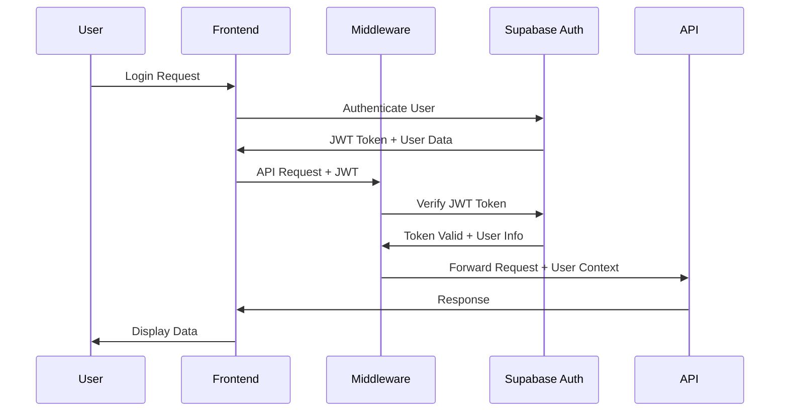

# VITAL Path Security Architecture

## Table of Contents
1. [Security Overview](#security-overview)
2. [Authentication Architecture](#authentication-architecture)
3. [Authorization Architecture](#authorization-architecture)
4. [Data Security](#data-security)
5. [Security Controls](#security-controls)
6. [Monitoring and Logging](#monitoring-and-logging)
7. [Compliance Framework](#compliance-framework)
8. [Threat Model](#threat-model)
9. [Security Boundaries](#security-boundaries)
10. [Incident Response](#incident-response)

---

## Security Overview

### Security Principles

The VITAL Path platform follows a **defense-in-depth** security strategy with multiple layers of protection:

1. **Zero Trust Architecture**: Never trust, always verify
2. **Principle of Least Privilege**: Users and systems have minimum necessary access
3. **Data Classification**: Sensitive data is properly categorized and protected
4. **Continuous Monitoring**: Real-time security event detection and response
5. **Compliance by Design**: Built-in HIPAA and SOC 2 compliance controls

### Security Objectives

- **Confidentiality**: Protect sensitive healthcare data from unauthorized access
- **Integrity**: Ensure data accuracy and prevent unauthorized modifications
- **Availability**: Maintain system availability for critical healthcare operations
- **Accountability**: Track all user actions and system events
- **Compliance**: Meet healthcare industry security standards

### Defense-in-Depth Strategy

```
┌─────────────────────────────────────────────────────────────┐
│                    Security Layers                         │
├─────────────────────────────────────────────────────────────┤
│ Layer 7: Application Security (Input validation, Auth)     │
│ Layer 6: API Security (Rate limiting, RBAC, RLS)          │
│ Layer 5: Database Security (Encryption, RLS policies)     │
│ Layer 4: Network Security (TLS, VPN, Firewalls)           │
│ Layer 3: Infrastructure Security (Containers, Secrets)    │
│ Layer 2: Physical Security (Data centers, Access control) │
└─────────────────────────────────────────────────────────────┘
```

---

## Authentication Architecture

### Authentication Flow



### JWT Token Management

**Token Structure**:
```json
{
  "header": {
    "alg": "RS256",
    "typ": "JWT"
  },
  "payload": {
    "sub": "user-uuid",
    "email": "user@example.com",
    "role": "admin",
    "organization_id": "org-uuid",
    "permissions": ["read:users", "write:agents"],
    "iat": 1640995200,
    "exp": 1640998800
  }
}
```

**Token Lifecycle**:
- **Access Token**: 1 hour expiration, used for API requests
- **Refresh Token**: 30 days expiration, used to renew access tokens
- **Rotation**: Refresh tokens are rotated on each use
- **Revocation**: Tokens can be immediately revoked via blacklist

### Session Management

**Session Storage**:
- **Frontend**: Secure HTTP-only cookies for refresh tokens
- **Backend**: Redis for session state and rate limiting
- **Database**: Session metadata in `session_store` table

**Session Security**:
- Secure cookie flags (HttpOnly, Secure, SameSite)
- Session timeout after inactivity
- Concurrent session limits per user
- Automatic cleanup of expired sessions

### Multi-Factor Authentication (Future)

**Planned Implementation**:
- TOTP (Time-based One-Time Password) via authenticator apps
- SMS-based verification for critical operations
- Hardware security keys (FIDO2/WebAuthn)
- Biometric authentication for mobile apps

---

## Authorization Architecture

### Role-Based Access Control (RBAC)

**Role Hierarchy**:
```
Super Admin
├── Full system access
├── User management
├── Organization management
└── Security configuration

Admin
├── Organization management
├── User management (within org)
├── Agent management
└── Analytics access

Manager
├── Team management
├── Agent configuration
├── Workflow management
└── Limited analytics

User
├── Agent interaction
├── Workflow execution
├── Personal settings
└── Basic analytics

Viewer
├── Read-only access
├── Basic reporting
└── Limited agent interaction
```

**Permission Matrix**:

| Resource | Super Admin | Admin | Manager | User | Viewer |
|----------|-------------|-------|---------|------|--------|
| Users | CRUD | CRUD (org) | R | R | R |
| Organizations | CRUD | R | R | R | R |
| Agents | CRUD | CRUD (org) | CRUD (org) | R | R |
| Workflows | CRUD | CRUD (org) | CRUD (org) | R | R |
| Analytics | All | Org | Team | Personal | Basic |
| Settings | All | Org | Team | Personal | None |

### Row-Level Security (RLS)

**Organization Isolation**:
```sql
-- Example RLS Policy
CREATE POLICY "Organization Data Isolation" ON agents
  FOR ALL USING (
    organization_id = get_user_organization_id() OR
    is_organization_admin()
  );
```

**Data Access Patterns**:
- **User Data**: Users can only access their own data
- **Organization Data**: Users can only access data within their organization
- **Cross-Organization**: Only super admins can access cross-organization data
- **System Data**: Only admins can access system-wide data

### Permission Enforcement

**Frontend Enforcement**:
```typescript
// Component-level permission checks
const { user, hasPermission } = useAuth();

if (!hasPermission('agents', 'create')) {
  return <AccessDenied />;
}
```

**Backend Enforcement**:
```typescript
// API route protection
export async function POST(request: NextRequest) {
  return withAuth(request, async (req, user) => {
    if (!user.permissions.includes('agents:create')) {
      return NextResponse.json({ error: 'Forbidden' }, { status: 403 });
    }
    // Handle request
  });
}
```

---

## Data Security

### Data Classification

**Classification Levels**:

1. **Public**: Non-sensitive information (public documentation)
2. **Internal**: Internal business information (analytics, reports)
3. **Confidential**: Sensitive business information (user data, configurations)
4. **Restricted**: Highly sensitive information (PHI, authentication data)

**Data Handling Requirements**:

| Classification | Encryption | Access Control | Audit Logging | Retention |
|----------------|------------|----------------|---------------|-----------|
| Public | Optional | Basic | Optional | 7 years |
| Internal | At rest | Role-based | Required | 5 years |
| Confidential | At rest + transit | RBAC + RLS | Required | 7 years |
| Restricted | At rest + transit | RBAC + RLS + MFA | Required | 10 years |

### Encryption

**Encryption at Rest**:
- **Database**: AES-256 encryption for all data
- **File Storage**: S3 server-side encryption (SSE-S3)
- **Backups**: Encrypted backup storage with separate keys
- **Secrets**: HashiCorp Vault for secret management

**Encryption in Transit**:
- **API Communication**: TLS 1.3 for all API calls
- **Database Connections**: SSL/TLS encrypted connections
- **File Uploads**: HTTPS for all file transfers
- **WebSocket**: WSS for real-time communications

**Key Management**:
- **Key Rotation**: Automatic key rotation every 90 days
- **Key Storage**: Hardware Security Modules (HSM) for key storage
- **Key Access**: Multi-person approval for key access
- **Key Backup**: Encrypted key backups in separate locations

### Data Retention and Disposal

**Retention Policies**:
- **User Data**: 7 years after account closure
- **Audit Logs**: 10 years for compliance
- **PHI Data**: 6 years minimum (HIPAA requirement)
- **System Logs**: 1 year for operational purposes

**Data Disposal**:
- **Secure Deletion**: Cryptographic erasure for sensitive data
- **Physical Destruction**: Secure destruction of physical media
- **Verification**: Audit trail of data disposal activities
- **Compliance**: Documentation for regulatory requirements

---

## Security Controls

### Input Validation

**Validation Layers**:
1. **Frontend**: Client-side validation for user experience
2. **API Gateway**: Request validation and sanitization
3. **Application**: Server-side validation and business rules
4. **Database**: Constraint validation and type checking

**Validation Rules**:
```typescript
// Example validation schema
const userSchema = z.object({
  email: z.string().email().max(255),
  name: z.string().min(1).max(100).regex(/^[a-zA-Z\s]+$/),
  role: z.enum(['admin', 'manager', 'user', 'viewer']),
  organization_id: z.string().uuid()
});
```

### Output Encoding

**Encoding Strategies**:
- **HTML Context**: HTML entity encoding
- **JavaScript Context**: JavaScript string escaping
- **URL Context**: URL encoding
- **SQL Context**: Parameterized queries (no encoding needed)

**Implementation**:
```typescript
// Output encoding example
const sanitizeOutput = (input: string, context: 'html' | 'js' | 'url') => {
  switch (context) {
    case 'html': return input.replace(/[<>&"']/g, (char) => htmlEntities[char]);
    case 'js': return input.replace(/['"\\]/g, '\\$&');
    case 'url': return encodeURIComponent(input);
  }
};
```

### CSRF Protection

**Protection Mechanisms**:
- **CSRF Tokens**: Unique tokens for each form
- **SameSite Cookies**: Strict same-site cookie policy
- **Origin Validation**: Verify request origin headers
- **Double Submit**: Cookie and header token validation

### XSS Prevention

**Prevention Strategies**:
- **Content Security Policy**: Strict CSP headers
- **Input Sanitization**: Remove dangerous HTML/JS
- **Output Encoding**: Proper encoding for all outputs
- **Trusted Types**: Type-safe DOM manipulation

### SQL Injection Prevention

**Protection Methods**:
- **Parameterized Queries**: Use prepared statements
- **Input Validation**: Validate all inputs
- **Least Privilege**: Database users with minimal permissions
- **Query Monitoring**: Monitor for suspicious query patterns

---

## Monitoring and Logging

### Audit Logging

**Log Categories**:
1. **Authentication Events**: Login, logout, failed attempts
2. **Authorization Events**: Permission checks, role changes
3. **Data Access**: Database queries, file access
4. **System Events**: Configuration changes, errors
5. **Security Events**: Threat detection, policy violations

**Log Format**:
```json
{
  "timestamp": "2025-01-13T10:30:00Z",
  "event_type": "user_login",
  "user_id": "user-123",
  "organization_id": "org-456",
  "ip_address": "192.168.1.100",
  "user_agent": "Mozilla/5.0...",
  "success": true,
  "details": {
    "login_method": "password",
    "session_id": "sess-789"
  }
}
```

### Security Event Monitoring

**Real-time Monitoring**:
- **Failed Authentication**: Brute force detection
- **Unusual Access Patterns**: Geographic anomalies
- **Rate Limit Violations**: API abuse detection
- **Permission Escalation**: Unauthorized access attempts

**Alert Thresholds**:
- **Critical**: 5+ failed logins in 5 minutes
- **High**: 10+ API calls per second from single IP
- **Medium**: Login from new geographic location
- **Low**: First-time user access to sensitive resource

### Threat Detection

**Detection Methods**:
- **Rule-based**: Predefined patterns and thresholds
- **ML-based**: Anomaly detection using machine learning
- **Behavioral**: User behavior analysis
- **Network**: Traffic pattern analysis

**Response Actions**:
- **Automatic**: IP blocking, account lockout
- **Manual**: Security team notification
- **Escalation**: Management notification for critical events
- **Investigation**: Forensic analysis and reporting

---

## Compliance Framework

### HIPAA Compliance

**Administrative Safeguards**:
- Security officer designation
- Workforce training and access management
- Information access management
- Security awareness and training

**Physical Safeguards**:
- Facility access controls
- Workstation use restrictions
- Device and media controls
- Disposal and reuse procedures

**Technical Safeguards**:
- Access control (unique user identification)
- Audit controls (activity logs)
- Integrity (data protection)
- Person or entity authentication
- Transmission security

### SOC 2 Compliance

**Trust Service Criteria**:
1. **Security**: Protection against unauthorized access
2. **Availability**: System operational availability
3. **Processing Integrity**: Complete, valid, accurate processing
4. **Confidentiality**: Information designated as confidential
5. **Privacy**: Personal information collection, use, retention

### Compliance Monitoring

**Automated Checks**:
- Configuration compliance scanning
- Vulnerability assessments
- Access review automation
- Policy violation detection

**Manual Reviews**:
- Quarterly access reviews
- Annual security assessments
- Compliance audits
- Penetration testing

---

## Threat Model

### Threat Categories

**External Threats**:
- **Malicious Actors**: Hackers, cybercriminals
- **Competitors**: Industrial espionage
- **Nation States**: Advanced persistent threats
- **Script Kiddies**: Automated attacks

**Internal Threats**:
- **Insider Threats**: Malicious employees
- **Accidental Exposure**: Human error
- **Privilege Abuse**: Misuse of access
- **Social Engineering**: Manipulation attacks

### Attack Vectors

**Common Attack Vectors**:
1. **Web Application**: SQL injection, XSS, CSRF
2. **API**: Rate limiting bypass, authentication bypass
3. **Database**: Privilege escalation, data exfiltration
4. **Network**: Man-in-the-middle, DDoS
5. **Social**: Phishing, pretexting, baiting

**Mitigation Strategies**:
- **Defense in Depth**: Multiple security layers
- **Least Privilege**: Minimal necessary access
- **Monitoring**: Real-time threat detection
- **Training**: Security awareness programs

---

## Security Boundaries

### Trust Zones

**High Trust Zone**:
- Internal application servers
- Database servers
- Administrative interfaces
- Security monitoring systems

**Medium Trust Zone**:
- API gateways
- Load balancers
- Caching layers
- Message queues

**Low Trust Zone**:
- Public internet
- User devices
- Third-party integrations
- External APIs

### Network Segmentation

**Network Architecture**:
```
Internet → DMZ → Application Tier → Database Tier
    ↓         ↓           ↓              ↓
  WAF    Load Balancer  App Servers   Database
  CDN    API Gateway    Cache Layer   Backup
```

**Security Controls**:
- **Firewalls**: Network-level access control
- **WAF**: Web application firewall
- **DDoS Protection**: Traffic filtering and rate limiting
- **VPN**: Secure remote access

---

## Incident Response

### Incident Classification

**Severity Levels**:
- **P0 - Critical**: System compromise, data breach
- **P1 - High**: Service disruption, security violation
- **P2 - Medium**: Performance degradation, minor security issue
- **P3 - Low**: Informational, minor operational issue

### Response Procedures

**Detection and Analysis**:
1. **Automated Detection**: Security monitoring alerts
2. **Manual Detection**: User reports, routine checks
3. **Initial Assessment**: Severity and impact analysis
4. **Escalation**: Notify appropriate response team

**Containment and Eradication**:
1. **Immediate Containment**: Isolate affected systems
2. **Evidence Preservation**: Collect forensic evidence
3. **Root Cause Analysis**: Identify attack vector
4. **Remediation**: Fix vulnerabilities and restore services

**Recovery and Lessons Learned**:
1. **System Restoration**: Bring services back online
2. **Monitoring**: Enhanced monitoring for recurrence
3. **Post-Incident Review**: Analyze response effectiveness
4. **Documentation**: Update procedures and training

### Communication Plan

**Internal Communication**:
- **Security Team**: Immediate notification
- **Management**: Escalation based on severity
- **Development Team**: Technical details and fixes
- **Legal/Compliance**: Regulatory requirements

**External Communication**:
- **Customers**: Service status updates
- **Regulators**: Compliance reporting
- **Law Enforcement**: Criminal activity reporting
- **Media**: Public relations management

---

## Security Metrics and KPIs

### Key Performance Indicators

**Security Metrics**:
- **Mean Time to Detection (MTTD)**: < 5 minutes
- **Mean Time to Response (MTTR)**: < 15 minutes
- **False Positive Rate**: < 5%
- **Security Incident Count**: Track monthly trends

**Compliance Metrics**:
- **Audit Findings**: Zero critical findings
- **Policy Violations**: Track and trend
- **Training Completion**: 100% of staff
- **Access Reviews**: Quarterly completion

**Operational Metrics**:
- **System Uptime**: 99.99% availability
- **Performance Impact**: < 5% overhead
- **User Experience**: No security-related friction
- **Cost Efficiency**: Security ROI measurement

---

## Future Security Enhancements

### Planned Improvements

**Short Term (3-6 months)**:
- Multi-factor authentication implementation
- Advanced threat hunting capabilities
- Security orchestration and automation
- Enhanced compliance reporting

**Medium Term (6-12 months)**:
- Zero-trust network architecture
- AI-powered threat detection
- Advanced analytics and correlation
- Security awareness training platform

**Long Term (1-2 years)**:
- Quantum-resistant cryptography
- Advanced behavioral analytics
- Autonomous security response
- Predictive threat intelligence

---

## Conclusion

The VITAL Path security architecture provides a comprehensive, defense-in-depth approach to protecting sensitive healthcare data and ensuring system availability. Through continuous monitoring, regular assessments, and ongoing improvements, the platform maintains a strong security posture while enabling healthcare innovation.

For questions or concerns about this security architecture, please contact the security team at security@vitalpath.com.

---

*Last Updated: January 13, 2025*
*Version: 1.0*
*Classification: Internal Use Only*