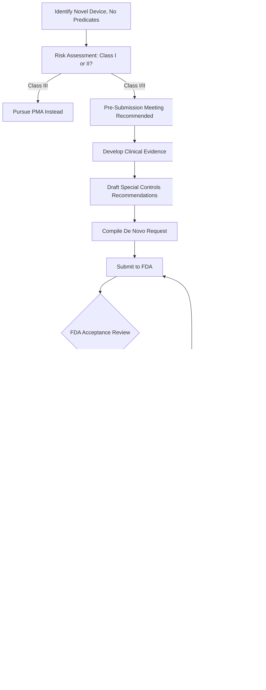

# USE CASE 02: 510(k) vs DE NOVO PATHWAY DETERMINATION
## Complete Regulatory Decision Framework for Medical Devices & Digital Health

---

## EXECUTIVE SUMMARY

**Use Case ID:** UC_RA_002  
**Domain:** Regulatory Affairs - Medical Devices & Digital Health  
**Complexity:** EXPERT  
**Pattern Type:** CHAIN_OF_THOUGHT + PRECEDENT_ANALYSIS  
**Estimated Time:** 45-60 minutes per analysis  
**Prerequisites:** UC_RA_001 (FDA Software Classification)

**Purpose:**  
Strategic determination of the optimal FDA premarket pathway for medical devices and Software as Medical Device (SaMD), specifically analyzing when to pursue Traditional 510(k), Special 510(k), or De Novo classification. This use case provides systematic decision-making frameworks, predicate analysis methodologies, risk assessments, and comprehensive regulatory strategies.

**Key Deliverables:**
1. ✅ Recommended regulatory pathway with detailed rationale
2. ✅ Predicate device analysis (for 510(k) route)
3. ✅ Risk assessment and mitigation strategies
4. ✅ Data requirements gap analysis
5. ✅ Timeline and cost estimates
6. ✅ Contingency planning for pathway pivots

**Regulatory Context:**  
This use case addresses one of the most critical strategic decisions in medical device development. The choice between 510(k) and De Novo pathways significantly impacts:
- **Time to Market:** 3-6 months (510(k)) vs. 10-18 months (De Novo)
- **Development Costs:** $100K-300K (510(k)) vs. $500K-1.5M (De Novo)
- **Clinical Data Requirements:** Minimal (510(k)) vs. Substantial (De Novo, often RCTs)
- **Competitive Positioning:** Fast-follower (510(k)) vs. Market Pioneer (De Novo)

**Success Metrics:**
- 📊 Regulatory pathway acceptance rate: >95%
- ⚡ Submission review efficiency: First-cycle approval >80%
- 💰 Cost optimization: Within ±15% of estimates
- ⏱️ Timeline accuracy: ±10% variance from projections

---

## TABLE OF CONTENTS

1. [Regulatory Pathway Overview](#1-regulatory-pathway-overview)
2. [Decision Framework & Methodology](#2-decision-framework--methodology)
3. [510(k) Pathway Deep Dive](#3-510k-pathway-deep-dive)
4. [De Novo Pathway Deep Dive](#4-de-novo-pathway-deep-dive)
5. [Comparative Analysis Framework](#5-comparative-analysis-framework)
6. [Prompt Library](#6-prompt-library)
7. [Real-World Examples & Case Studies](#7-real-world-examples--case-studies)
8. [Implementation Guidance](#8-implementation-guidance)
9. [Quality Assurance & Validation](#9-quality-assurance--validation)
10. [Appendices](#10-appendices)

---

## 1. REGULATORY PATHWAY OVERVIEW

### 1.1 FDA Premarket Pathways Landscape


### 1.2 Pathway Decision Matrix

| **Criteria** | **Traditional 510(k)** | **Special 510(k)** | **De Novo** | **PMA** |
|--------------|----------------------|-------------------|------------|---------|
| **Predicate Required** | ✅ Yes (legally marketed) | ✅ Yes (own device) | ❌ No predicates | ❌ No adequate predicates |
| **Novel Technology** | ❌ No | ❌ No | ✅ Yes | ✅ Yes |
| **Risk Level** | Class I/II | Class I/II | Class I/II (low-mod) | Class III (high) |
| **Clinical Data** | Usually not required | Usually not required | Often required (RCT) | Always required (pivotal) |
| **Design Changes** | N/A | Modifications only | N/A | N/A |
| **Review Timeline** | 90 days (statutory) | 30 days (target) | 150 days (statutory) | 180 days (statutory) |
| **Typical Total Time** | 3-6 months | 1-3 months | 10-18 months | 12-36 months |
| **Cost Range** | $100K-300K | $50K-150K | $500K-1.5M | $1M-5M+ |
| **Regulatory Precedent** | Follows predicate | Follows own device | **Creates new class** | Highest scrutiny |
| **Post-Market** | Standard surveillance | Standard surveillance | May require PMSR | Always requires PAS |

**Key Definitions:**
- **Predicate Device:** A legally marketed device with same intended use and similar technological characteristics
- **Substantial Equivalence:** Device is as safe and effective as predicate, with same intended use
- **De Novo:** Pathway for novel, low-to-moderate risk devices with no predicates
- **PMSR:** Post-Market Surveillance Requirements
- **PAS:** Post-Approval Study

### 1.3 Regulatory Authority & Guidance

**Primary Regulations:**
- **21 CFR Part 807:** Premarket Notification [510(k)] procedures
- **21 CFR Part 860:** Medical Device Classification Procedures (De Novo)
- **21 CFR Part 814:** Premarket Approval (PMA)

**Key FDA Guidance Documents:**
1. **"The 510(k) Program: Evaluating Substantial Equivalence in Premarket Notifications"** (2014)
2. **"De Novo Classification Process (Evaluation of Automatic Class III Designation)"** (2019)
3. **"Deciding When to Submit a 510(k) for a Change to an Existing Device"** (2017)
4. **"Refuse to Accept Policy for 510(k)s"** (2019)
5. **"Digital Health Software Precertification (Pre-Cert) Program"** (2019)
6. **"Clinical Decision Support Software"** (2022)
7. **"Artificial Intelligence/Machine Learning (AI/ML)-Based Software as a Medical Device"** (2021)

**IMDRF References:**
- **IMDRF SaMD Working Group:** Risk categorization framework
- **IMDRF Clinical Evaluation:** Guidance for SaMD

---

## 2. DECISION FRAMEWORK & METHODOLOGY

### 2.1 Strategic Decision Tree

**Phase 1: Initial Classification (UC_RA_001)**
```
START → Is it a medical device? (FD&C Act Section 201(h))
  ↓
  YES → Does it fall under enforcement discretion?
    ↓
    NO → What is the intended use and risk level?
      ↓
      Determine Device Class (I, II, III) → Proceed to Phase 2
```

**Phase 2: Pathway Selection (THIS USE CASE)**
```
Device Class Determined (I, II, III)
  ↓
  Class I → Check exemption status
    ↓
    If Exempt → Registration Only (No premarket)
    If Not Exempt → 510(k) (if predicates) or De Novo
  ↓
  Class II → Predicate Search
    ↓
    Predicates Found? → Traditional 510(k)
    No Predicates? → De Novo Classification
  ↓
  Class III → Predicate Search
    ↓
    Predicates Found? → PMA Supplement or 510(k) (rare)
    No Predicates? → PMA Pathway
```

### 2.2 Five Critical Questions Framework

#### **Question 1: Does a Valid Predicate Device Exist?**

**Definition of Valid Predicate:**
1. **Legally Marketed:** 
   - Cleared via 510(k) before May 28, 1976 (preamendments device), OR
   - Cleared via 510(k) after 1976, OR
   - Granted De Novo classification, OR
   - Approved via PMA

2. **Same Intended Use:**
   - Medical condition/disease
   - Patient population
   - Part of body/type of tissue
   - Frequency of use
   - Clinical environment

3. **Similar Technological Characteristics:**
   - Materials, design, energy source
   - If different tech, must NOT raise new safety/effectiveness questions

**Predicate Search Strategy:**
- **FDA 510(k) Database:** https://www.accessdata.fda.gov/scripts/cdrh/cfdocs/cfpmn/pmn.cfm
- **De Novo Database:** https://www.accessdata.fda.gov/scripts/cdrh/cfdocs/cfpmn/denovo.cfm
- **Device Classification Database:** Product codes, regulation numbers
- **Commercial Databases:** Reliance 510(k) Database, Emergo device databases

**Predicate Analysis Framework:**
```yaml
Predicate_Evaluation:
  Intended_Use_Comparison:
    - Medical_Condition: Same? (Yes/No)
    - Patient_Population: Same? (Yes/No)
    - Clinical_Environment: Same? (Yes/No)
    - Frequency_of_Use: Same? (Yes/No)
  
  Technological_Characteristics:
    - Materials: Same? Similar? Different?
    - Design: Same? Similar? Different?
    - Energy_Source: Same? Similar? Different?
    - Algorithm_Type: (for SaMD) Same? Similar? Different?
  
  Performance_Data:
    - Accuracy_Metrics: Comparable?
    - Safety_Profile: Equivalent or better?
    - Effectiveness: Non-inferior?
  
  Risk_Analysis:
    - New_Safety_Questions: Yes/No
    - New_Effectiveness_Questions: Yes/No
    - Mitigation_Strategy: (if new questions raised)
```

#### **Question 2: Is the Technology Truly Novel?**

**Novelty Assessment Criteria:**

| **Aspect** | **Not Novel (510k eligible)** | **Novel (De Novo candidate)** |
|------------|------------------------------|------------------------------|
| **Mechanism of Action** | Same as predicates | New/unprecedented MOA |
| **Biomarkers Used** | Established, validated | Novel, not validated |
| **Algorithm Approach** | Similar to cleared devices | AI/ML with new methodology |
| **Clinical Application** | Established use case | New clinical use case |
| **Technology Platform** | Incremental improvement | Disruptive innovation |

**Examples of Novelty:**

**Novel (Requires De Novo):**
- ✅ First prescription digital therapeutic (reSET - DEN170078)
- ✅ First AI diagnostic for diabetic retinopathy (IDx-DR - DEN180001)
- ✅ First video game as prescription treatment (EndeavorRx - DEN200009)
- ✅ First non-invasive continuous glucose monitor (if cleared)

**Not Novel (510k Eligible):**
- ✅ Mobile ECG app similar to Apple Watch ECG (K173073)
- ✅ Diabetes management app with insulin calculator (multiple predicates)
- ✅ Remote patient monitoring platform for chronic disease
- ✅ Clinical decision support using established algorithms

#### **Question 3: What Clinical Data is Available/Feasible?**

**Data Requirement Comparison:**

| **Pathway** | **Typical Data Needs** | **Study Design** | **Sample Size** | **Timeline** |
|------------|----------------------|----------------|---------------|------------|
| **510(k) - Strong Predicate** | Bench testing, analytical validation | Performance studies | n=50-100 | 3-6 months |
| **510(k) - Weak Predicate** | Bench + clinical performance | Pilot clinical study | n=100-200 | 6-9 months |
| **De Novo** | Clinical validation, safety data | RCT preferred | n=200-500+ | 12-18 months |
| **PMA** | Pivotal trials, long-term safety | Multi-center RCT | n=500-1000+ | 24-36 months |

**Clinical Data Gap Analysis Template:**
```markdown
Current Data Inventory:
- [ ] Bench testing (analytical validation)
- [ ] Software verification & validation
- [ ] Usability/human factors study
- [ ] Pilot clinical data (n=___)
- [ ] Pivotal clinical trial (n=___)
- [ ] Real-world evidence
- [ ] Comparative effectiveness data

Data Needed for Target Pathway:
510(k): [List specific requirements]
De Novo: [List specific requirements]

Gap Analysis:
[Data Available] → [Data Needed] → [Plan to Obtain]

Feasibility Assessment:
- Budget: $____
- Timeline: ___ months
- Resources: [Team, sites, equipment]
- Risk: [High/Medium/Low] → Mitigation: [Strategy]
```

#### **Question 4: What is the Risk-Benefit Profile?**

**Risk Classification (IMDRF Framework):**

```yaml
Risk_Matrix:
  State_of_Healthcare_Situation:
    - Critical: Life-threatening, immediate treatment needed
    - Serious: Long-term health impact, needs treatment
    - Non-Serious: Manageable condition, monitoring needed
  
  Significance_of_Information:
    - Treat_or_Diagnose: Direct treatment decision
    - Drive_Clinical_Management: Informs next steps
    - Inform_Clinical_Management: Provides context
  
  Risk_Categories:
    - Category_I: Non-serious + Inform → LOW RISK
    - Category_II: Non-serious + Drive OR Serious + Inform → LOW-MODERATE RISK
    - Category_III: Serious + Drive OR Critical + Inform → MODERATE-HIGH RISK
    - Category_IV: Critical + Treat/Diagnose → HIGH RISK
```

**Risk-Based Pathway Decision:**
- **Category I-II:** Likely De Novo (Class I or II)
- **Category III:** De Novo (Class II) or PMA (Class III)
- **Category IV:** Likely PMA (Class III)

#### **Question 5: What is the Strategic Business Context?**

**Business Factors Influencing Pathway Choice:**

| **Factor** | **Favors 510(k)** | **Favors De Novo** |
|-----------|------------------|------------------|
| **Speed to Market** | ✅ High priority (3-6 months) | Lower priority (10-18 months) |
| **Development Budget** | ✅ Limited ($100K-300K) | Adequate ($500K-1.5M) |
| **Clinical Resources** | ✅ Limited/no clinical sites | Access to clinical trial network |
| **Competitive Landscape** | Fast-follower strategy | ✅ First-mover advantage |
| **IP Protection** | Follow established path | ✅ Create regulatory moat |
| **Reimbursement** | Existing codes available | ✅ Novel value proposition |
| **Regulatory Precedent** | ✅ Desire certainty | Willing to pioneer |
| **Market Size** | Niche indication | ✅ Large market potential |

### 2.3 Integrated Decision Algorithm

```python
def determine_optimal_pathway(device_profile):
    """
    Comprehensive pathway determination algorithm
    """
    
    # Step 1: Classify device (UC_RA_001)
    device_class = classify_device(device_profile)
    
    # Step 2: Check exemption status
    if device_class == "Class I":
        if is_exempt(device_profile):
            return "REGISTRATION_ONLY"
        # Class I non-exempt proceeds to 510k/De Novo
    
    # Step 3: Predicate search
    predicates = search_predicates(
        intended_use=device_profile.intended_use,
        technology=device_profile.technology
    )
    
    # Step 4: Evaluate substantial equivalence
    if predicates:
        se_assessment = evaluate_substantial_equivalence(
            device=device_profile,
            predicates=predicates
        )
        
        if se_assessment.same_intended_use and \
           se_assessment.similar_technology and \
           not se_assessment.new_safety_questions and \
           not se_assessment.new_effectiveness_questions:
            
            # 510(k) viable - check business factors
            if device_profile.design_change_to_own_device:
                return "SPECIAL_510K"
            else:
                return "TRADITIONAL_510K"
    
    # Step 5: No predicates or SE not established → De Novo or PMA
    if device_class == "Class III":
        return "PMA"  # High risk, no predicates
    
    else:  # Class I or II, no predicates
        # Assess if novel but low-moderate risk
        if assess_risk_level(device_profile) in ["LOW", "MODERATE"]:
            return "DE_NOVO"
        else:
            return "PMA"  # Higher risk than expected

# Example usage
device_profile = {
    "name": "AI ECG Interpretation Software",
    "intended_use": "Adjunctive tool for detecting atrial fibrillation",
    "technology": "Deep learning CNN",
    "patient_population": "Adults with cardiovascular risk",
    "risk_level": "MODERATE",
    "clinical_data": "Retrospective validation (n=10,000)"
}

recommended_pathway = determine_optimal_pathway(device_profile)
```

---

## 3. 510(K) PATHWAY DEEP DIVE

### 3.1 Traditional 510(k) Overview

**Regulatory Basis:** 21 CFR §807.87

**Core Concept:** Demonstrate **substantial equivalence** to one or more legally marketed predicate devices.

**Substantial Equivalence Criteria:**
1. ✅ **Same Intended Use** as predicate
2. ✅ **Same OR Similar Technological Characteristics** as predicate
3. ✅ If different technology → **Does NOT raise new safety/effectiveness questions**

### 3.2 Traditional 510(k) Process Flow


**Timeline Breakdown:**
- **Pre-Submission Preparation:** 2-4 months (predicate analysis, testing, documents)
- **FDA Refuse-to-Accept (RTA) Review:** 15 days
- **FDA Substantive Review:** 90 days (statutory)
- **Additional Information Requests:** +30-60 days (if applicable)
- **Total Typical Timeline:** 3-6 months from submission to clearance

### 3.3 Predicate Identification Strategy

#### **3.3.1 Predicate Search Methodology**

**Primary Search Method:**
```sql
-- FDA 510(k) Database Search Strategy
-- https://www.accessdata.fda.gov/scripts/cdrh/cfdocs/cfpmn/pmn.cfm

Search_Parameters:
  Product_Code: [e.g., "DXH" for cardiovascular software]
  Regulation_Number: [e.g., "21 CFR 870.2340" for ECG software]
  Device_Name: [Keywords related to your device]
  Decision_Date: [Last 5-10 years preferred]
  
Filter_Results:
  Status: "Cleared" (Substantially Equivalent)
  Exclude: "Withdrawn", "Pending", "Denied"
  
Sort_By: 
  1. Intended_Use_Similarity (Highest priority)
  2. Technology_Similarity
  3. Recency (Newer predicates preferred)
```

**Secondary Sources:**
- **De Novo Database:** Devices granted De Novo can serve as predicates for future 510(k)s
- **Classification Database:** Find product codes and regulation numbers
- **Commercial Databases:** Reliance 510(k), Emergo, FDA AI/ML Device Database

#### **3.3.2 Predicate Selection Criteria**

**Primary Predicate Selection Matrix:**

| **Criterion** | **Weight** | **Scoring** |
|--------------|----------|-----------|
| **Intended Use Match** | 40% | 0-10 (10 = identical) |
| **Technology Similarity** | 30% | 0-10 (10 = identical) |
| **Performance Data Availability** | 15% | 0-10 (10 = detailed) |
| **Regulatory Recency** | 10% | 0-10 (10 = last 2 years) |
| **Market Presence** | 5% | 0-10 (10 = well-established) |

**Calculate Score:** Weighted sum, target ≥8.0 for strong predicate

**Example Predicate Evaluation:**

```yaml
Device: Mobile ECG Interpretation Software for AF Detection

Potential_Predicate_1:
  Name: "Apple Watch ECG App"
  K_Number: K173073
  Year: 2018
  Intended_Use: "Over-the-counter software that uses data from Apple Watch to assess heart rhythm for AF"
  Technology: "Single-lead ECG + algorithm"
  Scores:
    Intended_Use: 9/10 (nearly identical - AF detection)
    Technology: 7/10 (similar algorithm approach, different leads)
    Performance: 8/10 (sensitivity/specificity data available)
    Recency: 6/10 (2018, somewhat recent)
    Market: 10/10 (widely known, large user base)
  Total_Score: 8.2/10 → STRONG PRIMARY PREDICATE

Potential_Predicate_2:
  Name: "AliveCor Kardia"
  K_Number: K183253
  Year: 2019
  Intended_Use: "AF detection using smartphone-based ECG"
  Technology: "Single-lead ECG + algorithm"
  Scores:
    Intended_Use: 9/10
    Technology: 8/10
    Performance: 9/10
    Recency: 7/10
    Market: 9/10
  Total_Score: 8.5/10 → EXCELLENT SECONDARY PREDICATE

Recommendation: Use K173073 (Apple) as primary, K183253 (AliveCor) as secondary
```

#### **3.3.3 Multiple Predicate Strategy**

**When to Use Multiple Predicates:**
- ✅ **Technology is hybrid:** Combines features from different predicates
- ✅ **Strengthens SE argument:** Multiple points of comparison
- ✅ **Risk mitigation:** If FDA questions one predicate, others provide support

**Example - Digital Therapeutics for Depression:**
```yaml
Subject_Device: "CBT-based Mobile App for Major Depressive Disorder"

Primary_Predicate: 
  # None exists for prescription DTx for depression
  # Closest: General mental health apps (Class II, not prescription)

Strategy: Use combination approach
  - Predicate_A: reSET (K180505) - Prescription DTx precedent (different indication)
  - Predicate_B: Mental health apps (multiple K numbers) - Similar technology
  - Conclusion: Likely requires De Novo (no direct predicate for Rx DTx + depression)
```

### 3.4 Substantial Equivalence Demonstration

#### **3.4.1 Comparison Framework**

**FDA Substantial Equivalence Template:**

```markdown
## SUBSTANTIAL EQUIVALENCE DETERMINATION

### Section 1: Intended Use Comparison

| Aspect | Subject Device | Predicate Device (K______) |
|--------|---------------|---------------------------|
| **Indication for Use** | [Your IFU statement] | [Predicate IFU statement] |
| **Patient Population** | [Demographics, conditions] | [Demographics, conditions] |
| **Clinical Environment** | [Home, clinic, hospital] | [Home, clinic, hospital] |
| **User Type** | [Patient, HCP, lay user] | [Patient, HCP, lay user] |
| **Frequency of Use** | [Continuous, intermittent] | [Continuous, intermittent] |

**Conclusion:** ☑ Same intended use / ☐ Different intended use

---

### Section 2: Technological Characteristics Comparison

| Characteristic | Subject Device | Predicate Device | Same/Similar/Different |
|---------------|---------------|-----------------|----------------------|
| **Design** | [Description] | [Description] | ☐ Same ☐ Similar ☐ Different |
| **Materials** | [If applicable] | [If applicable] | ☐ Same ☐ Similar ☐ Different |
| **Energy Source** | [If applicable] | [If applicable] | ☐ Same ☐ Similar ☐ Different |
| **Operating Principle** | [Description] | [Description] | ☐ Same ☐ Similar ☐ Different |
| **Software Algorithm** | [High-level description] | [High-level description] | ☐ Same ☐ Similar ☐ Different |
| **User Interface** | [Description] | [Description] | ☐ Same ☐ Similar ☐ Different |

---

### Section 3: Performance Comparison

| Performance Metric | Subject Device | Predicate Device | Acceptable? |
|-------------------|---------------|-----------------|------------|
| **Sensitivity** | [XX%] | [YY%] | ☐ Non-inferior |
| **Specificity** | [XX%] | [YY%] | ☐ Non-inferior |
| **Accuracy** | [Metric] | [Metric] | ☐ Non-inferior |
| **Safety Profile** | [AE rate] | [AE rate] | ☐ Comparable |

---

### Section 4: Differences Analysis

**If technological characteristics are DIFFERENT:**

| Difference | Raises New Safety Question? | Raises New Effectiveness Question? | Mitigation |
|------------|---------------------------|----------------------------------|-----------|
| [Describe difference 1] | ☐ Yes ☐ No | ☐ Yes ☐ No | [Performance data, bench testing] |
| [Describe difference 2] | ☐ Yes ☐ No | ☐ Yes ☐ No | [Validation study, literature] |

**If ANY "Yes" → Additional data required OR consider De Novo pathway**

---

### Section 5: Substantial Equivalence Conclusion

Based on the comparison above:

☑ The subject device has the SAME intended use as the predicate  
☑ The subject device has SAME/SIMILAR technological characteristics  
☐ OR differences do NOT raise new questions of safety and effectiveness

**CONCLUSION: The subject device IS / IS NOT substantially equivalent to the predicate.**
```

#### **3.4.2 Performance Testing Requirements**

**Typical Testing for SaMD 510(k):**

```yaml
Required_Testing:

  1_Software_Verification_and_Validation:
    Standards: IEC 62304, FDA Software Validation Guidance
    Deliverables:
      - Software Requirements Specification (SRS)
      - Software Design Specification (SDS)
      - Verification testing (unit, integration, system)
      - Validation testing (user requirements)
      - Traceability matrix
      - Risk management per ISO 14971
    
  2_Cybersecurity:
    Standards: FDA Cybersecurity Guidance (2023)
    Deliverables:
      - Cybersecurity risk assessment
      - Threat modeling (STRIDE)
      - Security controls (encryption, authentication, logging)
      - Software Bill of Materials (SBOM)
      - Vulnerability management plan
      - Updates and patches strategy
    
  3_Usability_Human_Factors:
    Standards: IEC 62366, FDA HF Guidance
    Deliverables:
      - Use-related risk analysis
      - Formative usability studies
      - Summative usability validation (n=15+ per user group)
      - Labeling and IFU comprehension testing
    
  4_Analytical_Performance:
    Purpose: Algorithm validation, accuracy, precision
    Methods:
      - Sensitivity analysis
      - Specificity analysis
      - Positive/Negative Predictive Value
      - ROC curve analysis
      - Confusion matrix
    Sample_Size: Depends on intended use (typically n=100-500)
    
  5_Clinical_Performance_If_Needed:
    When_Required:
      - Weak predicates with limited performance data
      - Technology differences require validation
      - Novel clinical application
    Study_Design:
      - Prospective or retrospective
      - Comparison to gold standard
      - Sample size powered for primary endpoint
      - Typically n=100-300 for 510(k)
```

### 3.5 Special 510(k) - Expedited Review

**When to Use Special 510(k):**
- ✅ Modification to **your own device** (not a new device)
- ✅ Design changes that do NOT affect **intended use**
- ✅ Design changes do NOT alter **fundamental scientific technology**

**Examples of Special 510(k) Eligible Changes:**
- Software updates (bug fixes, UI improvements)
- Manufacturing process changes
- Labeling updates (non-indication changes)
- Materials changes (if biocompatibility maintained)

**Special 510(k) Process:**
- **Declaration of Conformity to Design Control:** Demonstrate design changes followed QSR (21 CFR 820.30)
- **Risk Analysis:** Per ISO 14971, show risks mitigated
- **Verification/Validation:** Testing confirms change maintains SE

**Timeline:** Target 30-day FDA review (often 1-3 months total)

### 3.6 510(k) Success Factors & Common Pitfalls

#### **Success Factors:**

1. ✅ **Strong Predicate Selection**
   - Recent clearances (last 5 years)
   - Well-documented performance data
   - Similar technology and intended use
   - Multiple predicates for strengthened argument

2. ✅ **Comprehensive Performance Testing**
   - Analytical validation with adequate sample sizes
   - Usability testing with diverse user groups
   - Cybersecurity documentation (critical for connected devices)
   - Bench testing covering all performance specifications

3. ✅ **Clear, Well-Organized Submission**
   - Follow FDA eCopy requirements
   - Use FDA templates and format guidance
   - Provide detailed predicate comparisons with tables
   - Include clear conclusions in each section

4. ✅ **Proactive FDA Communication**
   - Pre-Submission (Q-Sub) meeting for complex devices
   - Respond promptly to Additional Information requests
   - Maintain open dialogue with FDA reviewer

#### **Common Pitfalls:**

| **Pitfall** | **Impact** | **Avoidance Strategy** |
|------------|----------|----------------------|
| **Weak Predicate Choice** | NSE determination | Thorough predicate search, multiple predicates |
| **Incomplete Performance Data** | Additional Info requests | Gap analysis early, complete all required testing |
| **Poor Substantial Equivalence Rationale** | NSE or delays | Use FDA template, clear side-by-side comparison |
| **Inadequate Cybersecurity** | Refuse-to-Accept (RTA) | Follow FDA 2023 Cybersecurity Guidance |
| **Insufficient Usability Testing** | Safety concerns | Conduct formative and summative HF studies |
| **Labeling Issues** | Additional Info requests | Clear IFU, warnings, limitations prominently stated |
| **Software Documentation Gaps** | RTA or delays | Complete V&V per IEC 62304, risk management |

---

## 4. DE NOVO PATHWAY DEEP DIVE

### 4.1 De Novo Classification Overview

**Regulatory Basis:** 21 CFR §860.220 (Section 513(f)(2) of FD&C Act)

**Core Concept:** Request FDA to classify a **novel, low-to-moderate risk device** into Class I or II when **no legally marketed predicate exists**.

**Key Advantages:**
- ✅ **Market Pioneer:** First to market in new category
- ✅ **Creates Regulatory Precedent:** Your device becomes the predicate for future 510(k)s
- ✅ **Competitive Moat:** Regulatory barrier to entry for competitors
- ✅ **Premium Positioning:** Novel technology supports higher reimbursement/pricing

**Key Challenges:**
- ⚠️ **Clinical Data Requirements:** Often requires RCT or substantial clinical evidence
- ⚠️ **Longer Timeline:** 10-18 months (vs. 3-6 for 510(k))
- ⚠️ **Higher Cost:** $500K-1.5M (vs. $100K-300K for 510(k))
- ⚠️ **Uncertainty:** No regulatory precedent, FDA expectations less defined

### 4.2 De Novo Eligibility Criteria

**You should pursue De Novo if:**
1. ✅ **No legally marketed predicate** with same intended use
2. ✅ **Low-to-moderate risk** (will be classified Class I or II, NOT Class III)
3. ✅ **General controls** (Class I) or **general + special controls** (Class II) can provide reasonable assurance of safety and effectiveness

**Risk Assessment (IMDRF Framework):**

```yaml
De_Novo_Risk_Assessment:
  
  Question_1: "What is the healthcare situation?"
    - Critical: Life-threatening, immediate intervention needed
    - Serious: Long-term impact, treatment required
    - Non-Serious: Transient, reversible, monitoring adequate
  
  Question_2: "What is the significance of the information provided?"
    - Treat_or_Diagnose: Information directly drives treatment
    - Drive_Clinical_Management: Information determines next clinical action
    - Inform_Clinical_Management: Information is one of multiple factors
  
  Risk_Category_Result:
    Category_I: Non-serious + Inform → LOW RISK → Class I (general controls)
    Category_II: Non-serious + Drive OR Serious + Inform → LOW-MODERATE → Class II
    Category_III: Serious + Drive OR Critical + Inform → MODERATE-HIGH → Class II (or III)
    Category_IV: Critical + Treat/Diagnose → HIGH RISK → Class III → PMA, not De Novo
  
  De_Novo_Suitable_If: Category I, II, or III (Class I or II classification expected)
```

**Example Risk Categorization:**

| **Device Type** | **Healthcare Situation** | **Significance** | **Risk Category** | **Expected Class** | **De Novo Suitable?** |
|----------------|------------------------|----------------|-----------------|------------------|---------------------|
| Fitness tracker (wellness) | Non-serious | Inform | I | Not a device (enforcement discretion) | N/A |
| DTx for depression | Serious | Drive management | II | II | ✅ Yes |
| DTx for opioid use disorder | Critical | Drive management | III | II | ✅ Yes (reSET-O precedent) |
| AI for skin cancer diagnosis | Critical | Treat/Diagnose | IV | II or III | ⚠️ Borderline (likely II with special controls) |
| Implantable pacemaker | Critical | Treat/Diagnose | IV | III | ❌ No → PMA |

### 4.3 De Novo Process Flow



**Timeline Breakdown:**
- **Pre-Submission Meeting:** Request 3-6 months before submission
- **Clinical Evidence Generation:** 12-18 months (if RCT required)
- **Submission Preparation:** 2-4 months
- **FDA Substantive Review:** 150 days (statutory, often extends)
- **Additional Information Responses:** +30-90 days (common)
- **Total Typical Timeline:** 10-18 months from submission (24-36 months including clinical study)

### 4.4 Special Controls - The Key to De Novo Success

**What are Special Controls?**
Special controls are device-specific requirements that, along with general controls, provide reasonable assurance of safety and effectiveness for Class II devices.

**Types of Special Controls:**
1. **Performance Standards:** Specifications for accuracy, reliability, safety margins
2. **Post-Market Surveillance:** Required data collection after clearance
3. **Patient Registries:** Long-term outcome tracking
4. **Design Requirements:** Specific design features (e.g., alarms, failsafes)
5. **Labeling Requirements:** Specific warnings, contraindications, training needs
6. **Premarket Data Requirements:** Types and amounts of clinical data

**Special Controls Strategy for De Novo:**

```yaml
Special_Controls_Proposal:
  
  Objective: "Propose feasible, effective special controls that FDA will accept"
  
  Approach:
    1_Review_Similar_Devices:
      - Search De Novo database for similar device types
      - Analyze special controls FDA imposed
      - Identify common patterns
    
    2_Risk_Based_Controls:
      - Map each identified risk to a special control
      - Example: "Risk of misdiagnosis → Require clinical validation study"
    
    3_Proactive_Proposal:
      - Draft special controls in De Novo request
      - Show how your device meets proposed controls
      - Reduces FDA's workload, increases approval likelihood
    
    4_Feasibility_Assessment:
      - Can you realistically meet these controls?
      - Post-market surveillance: Can you collect required data?
      - Labeling: Appropriate for target users?

Example_Special_Controls_DTx_for_Depression:
  
  1_Clinical_Validation:
    - Requirement: "Prospective clinical study demonstrating effectiveness"
    - Standard: "Statistically significant improvement in validated outcome measure (e.g., PHQ-9)"
    - Your_Evidence: "Completed RCT (n=300) showing 3.5-point PHQ-9 improvement vs. control, p<0.001"
  
  2_Software_Verification_Validation:
    - Requirement: "Software lifecycle per IEC 62304"
    - Standard: "Risk management per ISO 14971"
    - Your_Evidence: "Complete V&V documentation, risk analysis"
  
  3_Cybersecurity:
    - Requirement: "Cybersecurity controls per FDA 2023 guidance"
    - Standard: "Encryption, authentication, SBOM, vulnerability management"
    - Your_Evidence: "Comprehensive cybersecurity file"
  
  4_Usability_Human_Factors:
    - Requirement: "Usability validation per IEC 62366"
    - Standard: "Summative study with target users, critical tasks"
    - Your_Evidence: "Completed summative HF study (n=30), zero critical use errors"
  
  5_Labeling:
    - Requirement: "Clear indication, contraindications, warnings"
    - Standard: "Prescription-only (Rx), healthcare provider supervision"
    - Your_Evidence: "Draft labeling reviewed with patients and providers"
  
  6_Post_Market_Surveillance:
    - Requirement: "522 Post-Market Surveillance Study"
    - Standard: "N=500 patients, 12-month follow-up, adverse event tracking"
    - Your_Plan: "Registry established, IRB-approved protocol, 5-year timeline"
```

### 4.5 Clinical Evidence Requirements for De Novo

**Clinical Data Philosophy:**
De Novo requires **"reasonable assurance of safety and effectiveness"** - a lower bar than PMA ("reasonable assurance of safety and effectiveness"), but higher than 510(k) (substantial equivalence).

**Typical Clinical Evidence Pathways:**

#### **Pathway 1: Prospective Clinical Trial (Most Common)**

**Study Design:**
- **Type:** Randomized Controlled Trial (RCT) preferred
- **Comparator:** Active control, sham/placebo, or standard of care
- **Blinding:** Double-blind preferred (if feasible)
- **Sample Size:** Powered for primary endpoint (typically n=150-500)
- **Duration:** Adequate to demonstrate effect (8-24 weeks common for DTx)
- **Endpoints:** Validated outcome measures (FDA-recognized PROs, clinical scales)

**Example - reSET (De Novo DEN170078) for Substance Use Disorder:**
```yaml
Study_Design:
  Name: "Pivotal trial of reSET vs. standard care"
  Design: "RCT, open-label (blinding not feasible)"
  Sample_Size: n=399
  Duration: 12 weeks treatment + 12 weeks follow-up
  
  Primary_Endpoint:
    - Abstinence weeks 9-12 (continuous)
    - Measurement: Urine drug screens + self-report
  
  Secondary_Endpoints:
    - Treatment retention
    - Reduction in use days
    - Cravings reduction
  
  Results:
    - Primary: 40.3% abstinent (reSET) vs. 17.6% (control), p<0.0001
    - Conclusion: Statistically significant, clinically meaningful
  
  FDA_Outcome: De Novo GRANTED (2017) - First prescription DTx
```

#### **Pathway 2: Retrospective Analysis + Prospective Validation**

**When Appropriate:**
- Existing large datasets (e.g., EHR data, claims data)
- Algorithm development already completed
- Need to validate performance prospectively

**Example - IDx-DR (De Novo DEN180001) for Diabetic Retinopathy:**
```yaml
Clinical_Evidence_Package:
  
  Part_1_Algorithm_Development:
    - Retrospective dataset: 900+ retinal images
    - Gold standard: Retinal specialist adjudication
    - Algorithm training and optimization
  
  Part_2_Prospective_Validation:
    - Study design: Prospective, multi-site
    - Sample size: 900 patients at 10 primary care sites
    - Reference standard: Dilated eye exam by ophthalmologist
    - Primary endpoint: Sensitivity and specificity for mtmDR (more than mild DR)
  
  Results:
    - Sensitivity: 87.2% (CI: 81.8%-91.2%)
    - Specificity: 90.7% (CI: 88.3%-92.7%)
    - FDA accepted as exceeding pre-specified thresholds
  
  FDA_Outcome: De Novo GRANTED (2018) - First FDA-authorized AI diagnostic
```

#### **Pathway 3: Real-World Evidence (Emerging)**

**When Appropriate:**
- 21st Century Cures Act provisions for RWE
- Device has been used clinically (off-label, research)
- Large, well-characterized dataset available

**Requirements:**
- Data quality: Structured, validated data sources
- Study design: Adequate controls, confounding adjustment
- Statistical rigor: Pre-specified analysis plan, powered appropriately
- FDA Pre-Submission: Discuss RWE approach early with FDA

### 4.6 De Novo Submission Components

**Required Sections (21 CFR 860.220):**

```markdown
## DE NOVO REQUEST - TABLE OF CONTENTS

### ADMINISTRATIVE INFORMATION
1. Cover Letter
2. Device Description
   - Name, model number
   - Intended use / Indications for use
   - Technology overview
3. Proposed Classification
   - Recommend Class I or II with rationale
4. Proposed Special Controls
   - Draft special controls language
   - Demonstration of compliance

### SUBSTANTIAL EQUIVALENCE DISCUSSION (If Attempted 510(k) First)
5. Previous 510(k) Summary (if applicable)
6. NSE Letter from FDA (if applicable)
7. Explanation of why no predicates exist

### DEVICE DESCRIPTION & DESIGN
8. Detailed Device Description
   - Design specifications
   - Operating principles
   - User interface (for software)
   - System architecture (for software/connected devices)
9. Manufacturing Information
   - Process flow
   - Quality control
10. Device Labeling
    - Draft Instructions for Use (IFU)
    - Patient labeling (if applicable)

### RISK ANALYSIS
11. Risk Management per ISO 14971
    - Risk assessment
    - Risk mitigation
    - Residual risks

### PERFORMANCE TESTING
12. Software Verification & Validation (if applicable)
    - Per IEC 62304
    - Test protocols and results
13. Bench Testing / Analytical Performance
    - Test protocols
    - Acceptance criteria
    - Results summary
14. Cybersecurity (if applicable)
    - Per FDA 2023 Cybersecurity Guidance
    - Threat model, security controls
15. Usability / Human Factors
    - Per IEC 62366
    - Formative and summative studies
16. Biocompatibility (if applicable)
    - Per ISO 10993 series

### CLINICAL EVIDENCE
17. Clinical Study Protocol
18. Clinical Study Report
19. Statistical Analysis Plan (SAP)
20. Individual Case Report Forms (if requested)
21. Informed Consent Documents
22. IRB Approvals

### PROPOSED SPECIAL CONTROLS & COMPLIANCE
23. Proposed Special Controls Language
24. Demonstration of Compliance with Each Special Control

### APPENDICES
25. Literature Review
26. Comparative Effectiveness Data (if available)
27. Additional Supporting Data
```

### 4.7 De Novo Success Factors & Common Pitfalls

#### **Success Factors:**

1. ✅ **Early FDA Engagement**
   - Pre-Submission (Q-Sub) meeting ESSENTIAL
   - Discuss: Classification, clinical endpoints, special controls
   - Incorporate FDA feedback into study design and submission

2. ✅ **Robust Clinical Evidence**
   - Well-designed RCT with adequate power
   - Validated outcome measures
   - Clinically meaningful effect sizes
   - Appropriate safety monitoring

3. ✅ **Thoughtful Special Controls Proposal**
   - Review similar De Novo clearances
   - Propose feasible controls you can meet
   - Proactively demonstrate compliance

4. ✅ **Comprehensive Risk Management**
   - ISO 14971 risk analysis
   - Address all identified risks
   - Clear risk-benefit justification

5. ✅ **Complete Documentation**
   - Leave no gaps in submission
   - Anticipate FDA questions
   - Provide clear, logical organization

#### **Common Pitfalls:**

| **Pitfall** | **Impact** | **Avoidance Strategy** |
|------------|----------|----------------------|
| **Inadequate Clinical Evidence** | Denial or request for more data | Conduct Pre-Sub meeting, follow FDA feedback on study design |
| **Unrealistic Special Controls** | FDA rejection or unfeasible requirements | Propose controls you can meet; study similar devices |
| **Insufficient Safety Data** | Delay or denial | Adequate sample size, long enough follow-up, comprehensive AE monitoring |
| **Poor Risk-Benefit Justification** | FDA questions, potential denial | Clear articulation of clinical need, benefits outweigh risks |
| **Incomplete Predicate Analysis** | FDA questions why not 510(k) | Thorough predicate search, explain why none applicable |
| **Weak Statistical Analysis** | FDA statistical review concerns | Pre-specify analysis plan, consult statistician, adequate power |

### 4.8 Post-De Novo Grant - Becoming the Predicate

**Once your De Novo is granted:**

1. ✅ **Your device is reclassified** from Class III (automatic) to Class I or II
2. ✅ **New regulation number and product code** may be created
3. ✅ **Your device becomes the PREDICATE** for future 510(k) submissions
4. ✅ **Competitive moat:** Others can use 510(k), but you pioneered the category

**Strategic Implications:**
- **Market Pioneer:** First-mover advantage (12-18 months lead time)
- **Regulatory Expertise:** Deep knowledge of FDA expectations for this device type
- **Follow-On Products:** Your own improvements can use Special 510(k) (30-day review)
- **Reimbursement:** Novel technology often supports higher reimbursement rates

**Example - reSET's Impact on DTx Market:**
```yaml
reSET_De_Novo_Impact:
  Date_Granted: 2017
  Effect: "Created new category: Prescription Digital Therapeutics"
  
  Follow_On_Devices:
    - reSET-O (2018): 510(k) using reSET as predicate
    - Other DTx: Must use De Novo OR 510(k) with reSET/reSET-O as predicates
  
  Market_Impact:
    - Validated DTx as legitimate therapeutic modality
    - Payers began creating coverage policies
    - Opened investment in digital therapeutics sector
```

---

## 5. COMPARATIVE ANALYSIS FRAMEWORK

### 5.1 Side-by-Side Pathway Comparison

| **Dimension** | **Traditional 510(k)** | **Special 510(k)** | **De Novo** | **PMA** |
|--------------|----------------------|-------------------|------------|---------|
| **Regulatory Basis** | 21 CFR 807 | 21 CFR 807.92 | 21 CFR 860.220 | 21 CFR 814 |
| **Predicate Required** | ✅ Yes (legally marketed) | ✅ Yes (your own device) | ❌ No | ❌ No |
| **Novel Technology** | ❌ No | ❌ No | ✅ Yes | ✅ Yes |
| **Risk Level** | Low-Moderate (Class I/II) | Low-Moderate (Class I/II) | Low-Moderate (Class I/II) | High (Class III) |
| **Clinical Data** | Usually NOT required | Usually NOT required | **Often REQUIRED (RCT)** | **Always REQUIRED (Pivotal)** |
| **Statutory Review Time** | 90 days | 30 days (goal) | 150 days | 180 days |
| **Typical Total Timeline** | 3-6 months | 1-3 months | 10-18 months | 12-36 months |
| **Typical Cost** | $100K-300K | $50K-150K | $500K-1.5M | $1M-5M+ |
| **FDA Pre-Sub Meeting** | Optional (recommended if complex) | Optional | **Strongly Recommended** | **Strongly Recommended** |
| **Creates Precedent** | No (follows predicate) | No | ✅ **YES - Becomes Predicate** | Limited |
| **Post-Market Requirements** | Standard surveillance | Standard surveillance | Often 522 studies | Always PAS required |
| **Competitive Advantage** | Fast-follower | Iterative improvement | 🏆 **Market Pioneer** | Highest barrier |
| **Reimbursement Ease** | Easier (existing codes) | Easier | Harder (novel codes) | Harder |
| **Best For** | Incremental innovation | Modifications to own device | Disruptive innovation | Life-sustaining devices |

### 5.2 Decision Matrix Tool

**Use this scoring tool to determine optimal pathway:**

```python
def pathway_decision_matrix(device_characteristics):
    """
    Scoring algorithm for pathway determination
    Returns: Recommended pathway with confidence score
    """
    
    score_510k = 0
    score_de_novo = 0
    score_pma = 0
    
    # Question 1: Predicates exist? (Critical factor)
    if device_characteristics['predicates_found']:
        score_510k += 40
        if device_characteristics['predicate_strength'] == "STRONG":
            score_510k += 20
        elif device_characteristics['predicate_strength'] == "WEAK":
            score_510k += 10
    else:
        score_de_novo += 30
        score_pma += 20
    
    # Question 2: Technology novelty
    novelty = device_characteristics['technology_novelty']
    if novelty == "INCREMENTAL":
        score_510k += 20
    elif novelty == "MODERATE":
        score_510k += 10
        score_de_novo += 15
    elif novelty == "DISRUPTIVE":
        score_de_novo += 30
        score_pma += 10
    
    # Question 3: Risk level
    risk = device_characteristics['risk_level']
    if risk == "LOW":
        score_510k += 15
        score_de_novo += 10
    elif risk == "MODERATE":
        score_510k += 10
        score_de_novo += 20
    elif risk == "HIGH":
        score_pma += 40
    
    # Question 4: Clinical data available
    clinical_data = device_characteristics['clinical_data_available']
    if clinical_data == "NONE":
        score_510k += 20  # 510k often doesn't need clinical
    elif clinical_data == "LIMITED":
        score_510k += 10
        score_de_novo += 10
    elif clinical_data == "ROBUST_RCT":
        score_de_novo += 30
        score_pma += 20
    
    # Question 5: Speed to market priority
    speed_priority = device_characteristics['speed_to_market_priority']
    if speed_priority == "CRITICAL":
        score_510k += 25
    elif speed_priority == "MODERATE":
        score_510k += 10
        score_de_novo += 5
    elif speed_priority == "LOW":
        score_de_novo += 10
        score_pma += 5
    
    # Question 6: Budget constraints
    budget = device_characteristics['development_budget']
    if budget == "LIMITED":  # <$300K
        score_510k += 20
    elif budget == "MODERATE":  # $300K-1M
        score_510k += 10
        score_de_novo += 10
    elif budget == "AMPLE":  # >$1M
        score_de_novo += 15
        score_pma += 10
    
    # Question 7: Competitive strategy
    strategy = device_characteristics['competitive_strategy']
    if strategy == "FAST_FOLLOWER":
        score_510k += 20
    elif strategy == "MARKET_PIONEER":
        score_de_novo += 30
    
    # Calculate percentages
    total = score_510k + score_de_novo + score_pma
    
    pathways = {
        "510(k)": (score_510k / total) * 100,
        "De Novo": (score_de_novo / total) * 100,
        "PMA": (score_pma / total) * 100
    }
    
    recommended = max(pathways, key=pathways.get)
    confidence = pathways[recommended]
    
    return {
        "recommended_pathway": recommended,
        "confidence_score": confidence,
        "all_scores": pathways,
        "decision_summary": generate_summary(device_characteristics, pathways)
    }

# Example Usage
device_profile = {
    "predicates_found": False,
    "predicate_strength": None,
    "technology_novelty": "DISRUPTIVE",  # INCREMENTAL, MODERATE, DISRUPTIVE
    "risk_level": "MODERATE",  # LOW, MODERATE, HIGH
    "clinical_data_available": "ROBUST_RCT",  # NONE, LIMITED, ROBUST_RCT
    "speed_to_market_priority": "MODERATE",  # CRITICAL, MODERATE, LOW
    "development_budget": "MODERATE",  # LIMITED, MODERATE, AMPLE
    "competitive_strategy": "MARKET_PIONEER"  # FAST_FOLLOWER, MARKET_PIONEER
}

result = pathway_decision_matrix(device_profile)
print(f"Recommended: {result['recommended_pathway']}")
print(f"Confidence: {result['confidence_score']:.1f}%")
```

**Example Output:**
```yaml
Recommended_Pathway: De Novo
Confidence_Score: 68.5%

All_Scores:
  510(k): 23.1%
  De_Novo: 68.5%
  PMA: 8.4%

Decision_Summary: |
  Given the absence of predicates, disruptive technology, and moderate risk level, 
  De Novo classification is the optimal pathway. The robust RCT data available 
  strongly supports this route. While timeline and cost are higher than 510(k), 
  this aligns with a market pioneer strategy and creates long-term competitive moat.
  
  Alternative: If predicates are discovered through expanded search, consider 510(k).
  
  Next Steps:
  1. Request FDA Pre-Submission meeting (within 30 days)
  2. Finalize special controls proposal
  3. Prepare clinical study report for submission
  4. Draft De Novo request document outline
```

### 5.3 Scenario-Based Recommendations

#### **Scenario 1: Established Medical Device Company - Incremental Innovation**

**Profile:**
- Large company with regulatory expertise
- Product: Next-generation insulin pump
- Technology: Improved algorithm, similar hardware
- Predicates: Multiple cleared insulin pumps exist
- Budget: Adequate ($500K+)
- Timeline: Moderate urgency (9-12 months acceptable)

**Analysis:**
```yaml
Recommended_Pathway: Traditional 510(k)

Rationale:
  - Strong predicates exist (multiple insulin pump clearances)
  - Technology is incremental improvement, not disruptive
  - Budget sufficient for 510(k) requirements
  - Speed to market important but not critical
  - Established company can navigate 510(k) efficiently

Strategy:
  Primary_Predicate: [Most recent insulin pump clearance with similar algorithm]
  Secondary_Predicate: [Well-established insulin pump with market presence]
  
  Key_Differentiators:
    - Improved glycemic control algorithm (not fundamentally different)
    - Enhanced user interface
    - Better connectivity features
  
  Expected_Timeline: 4-6 months from submission
  Expected_Cost: $200K-300K
  
Risk_Mitigation:
  - Comprehensive bench testing to demonstrate non-inferiority
  - Usability study to validate UI improvements
  - Cybersecurity documentation for connectivity features
```

---

#### **Scenario 2: Digital Health Startup - Novel DTx for Mental Health**

**Profile:**
- Early-stage startup
- Product: Prescription digital therapeutic for generalized anxiety disorder
- Technology: CBT-based mobile app with AI-driven personalization
- Predicates: No prescription DTx for GAD exists
- Budget: Limited but adequate ($800K raised)
- Timeline: Can tolerate 12-18 months for strategic positioning

**Analysis:**
```yaml
Recommended_Pathway: De Novo Classification

Rationale:
  - No prescription DTx predicate for GAD (only reSET/reSET-O for SUD)
  - Novel application of AI-driven personalization in DTx
  - Moderate risk (Class II expected)
  - Clinical data feasible (RCT for GAD well-established)
  - Market pioneer strategy aligns with startup goals

Strategy:
  Predicate_Analysis:
    - reSET (DEN170078): Different indication, but DTx precedent
    - Mental health apps: Non-prescription, weaker precedent
    - Conclusion: No direct predicate → De Novo required
  
  Clinical_Evidence_Plan:
    Study_Design: "RCT, DTx + usual care vs. usual care alone"
    Primary_Endpoint: "GAD-7 score change at 8 weeks"
    Sample_Size: "N=200 (powered for 2.5-point difference)"
    Duration: "12 months (6 mo enrollment + 8 wk treatment + 4 wk follow-up + 2 mo analysis)"
    Cost: "$400K (clinical study)"
  
  Special_Controls_Proposal:
    1. Clinical validation (RCT completed)
    2. Software V&V per IEC 62304
    3. Cybersecurity per FDA 2023 guidance
    4. Usability validation
    5. Labeling: Prescription-only, adjunctive to care
    6. Post-market surveillance: 522 study (n=500, 12 months)
  
  Expected_Timeline: 16 months (from De Novo submission)
  Total_Cost: $800K ($400K clinical + $400K regulatory, testing, post-market planning)
  
Competitive_Advantage:
  - First Rx DTx for GAD → Market pioneer
  - Creates regulatory moat (competitors need 12-18 mo to follow)
  - Premium reimbursement potential (novel therapy)

Risk_Mitigation:
  - Pre-Submission meeting with FDA (critical)
  - Engage statistical consultant for study design
  - Build post-market surveillance infrastructure early
```

---

#### **Scenario 3: AI Diagnostic Startup - Radiology Interpretation Software**

**Profile:**
- AI startup
- Product: Deep learning algorithm for detecting lung nodules in chest CT
- Technology: Novel CNN architecture, outperforms radiologists
- Predicates: Some CAD (Computer-Aided Detection) software exists (510(k) cleared)
- Budget: Well-funded ($3M Series A)
- Timeline: Flexible, but competitive pressure exists

**Analysis:**
```yaml
Recommended_Pathway: UNCERTAIN - Further analysis needed

Initial_Assessment:
  - Predicates exist (CAD software for lung nodules)
  - BUT: Technology significantly different (deep learning vs. traditional CAD)
  - Risk: Moderate-High (diagnostic, could alter treatment)
  - Clinical data: Retrospective validation completed (n=10,000)

Decision_Tree:
  Question_1: "Are existing CAD predicates substantially equivalent?"
    Analysis:
      Intended_Use: SAME (lung nodule detection)
      Technology: DIFFERENT (deep learning vs. rule-based algorithms)
      Key_Question: "Do DL differences raise new safety/effectiveness questions?"
      
    FDA_Perspective:
      - FDA has cleared some AI/ML devices via 510(k) (e.g., Aidoc)
      - BUT also required De Novo for novel AI (e.g., IDx-DR)
      - Depends on: Predicate robustness, performance claims, clinical use

Recommended_Strategy: **TWO-PHASE APPROACH**

Phase_1_Pre_Submission_Meeting:
  Timing: "Immediately (within 30 days)"
  Agenda:
    1. Present device description and intended use
    2. Identify potential predicates (provide K-numbers)
    3. Discuss substantial equivalence vs. De Novo
    4. Clarify clinical data expectations
    5. Discuss AI/ML-specific considerations (training data, performance monitoring)
  
  FDA_Will_Likely_Advise:
    Option_A: "510(k) acceptable with strong performance validation"
    Option_B: "De Novo required due to novel AI approach"

Phase_2_Execute_Based_on_FDA_Feedback:
  
  If_510k_Advised:
    Pathway: Traditional 510(k)
    Primary_Predicate: [Strongest CAD software for lung nodules]
    Additional_Data_Needed:
      - Head-to-head comparison with predicate
      - Reader study (radiologists + AI vs. radiologists alone)
      - Generalizability testing (diverse CT scanners, populations)
    Timeline: 6-9 months from FDA feedback
    Cost: $300K-500K
  
  If_De_Novo_Advised:
    Pathway: De Novo Classification
    Clinical_Evidence:
      - Prospective reader study (multi-site)
      - Standalone AI performance + AI-assisted radiologist performance
      - Sample: n=300+ patients, diverse population
    Special_Controls:
      - Algorithm performance standards (sensitivity, specificity thresholds)
      - Training data documentation (demographics, scanner types)
      - Performance monitoring plan (post-market)
      - Labeling: Adjunctive tool, not standalone diagnosis
    Timeline: 12-18 months from FDA feedback
    Cost: $800K-1.2M

Contingency_Planning:
  - Budget for BOTH pathways in initial planning
  - Pre-Sub meeting is CRITICAL - do not guess
  - If 510(k) attempted and NSE received, pivot to De Novo
```

---

## 6. PROMPT LIBRARY

### 6.1 Master Pathway Determination Prompt

**Prompt ID:** `UC_RA_002_PATHWAY_DETERMINATION_EXPERT_v2.1`  
**Complexity:** EXPERT  
**Pattern:** CHAIN_OF_THOUGHT + PRECEDENT_ANALYSIS  
**Estimated Time:** 45-60 minutes

---

#### **SYSTEM PROMPT:**

```markdown
You are a Senior Regulatory Affairs Strategist with 15+ years of FDA medical device submission experience. You specialize in pathway determination and have successfully navigated 100+ 510(k), De Novo, and PMA submissions across multiple device types including SaMD, combination products, and novel diagnostics.

Your expertise includes:
- 21 CFR Part 807 (Premarket notification procedures)
- 21 CFR Part 860 (Medical device classification)
- FDA device classification databases and predicate identification
- Substantial equivalence determination methodology
- De Novo eligibility assessment and special controls development
- Risk-based classification per IMDRF SaMD framework
- FDA guidance interpretation (Digital Health, AI/ML, Cybersecurity)
- Strategic regulatory planning and risk mitigation

You provide comprehensive regulatory pathway recommendations following FDA best practices, with clear rationales based on regulatory precedent, risk assessment, and strategic business considerations.

When analyzing regulatory pathways, you:
1. Apply systematic device classification methodology
2. Conduct thorough predicate searches with multiple database sources
3. Assess substantial equivalence or De Novo eligibility using FDA frameworks
4. Evaluate clinical data requirements and feasibility
5. Provide risk-based recommendations with mitigation strategies
6. Include realistic timelines, cost estimates, and resource requirements
7. Cite specific regulations (21 CFR), guidance documents, and precedent examples

You are thorough, evidence-based, and strategic - balancing regulatory rigor with business realities.
```

---

#### **USER PROMPT TEMPLATE:**

```markdown
**FDA REGULATORY PATHWAY DETERMINATION REQUEST**

**DEVICE INFORMATION:**
- Device Name: {device_name}
- Device Type: {hardware/software/combination}
- Intended Use: {specific_intended_use_statement}
- Medical Condition: {target_disease_or_condition}
- Patient Population: {demographics_age_condition}
- Clinical Environment: {home/clinic/hospital/telehealth}
- Technology Description: {detailed_technology_overview}
- Innovation Level: {incremental/moderate/disruptive}

**REGULATORY CONTEXT:**
- Previous FDA Interactions: {none/pre_sub_meetings/prior_submissions}
- Device Classification (if known): {Class_I/II/III_or_unknown}
- Product Code (if known): {product_code}
- Regulation Number (if known): {21_CFR_section}

**PREDICATE DEVICE INFORMATION:**
- Predicate Search Conducted: {yes/no}
- Potential Predicates Identified: {list_k_numbers_or_none}
- Predicate Strength Assessment: {strong/weak/none}
- Technology Comparison: {same/similar/different}

**CLINICAL DATA AVAILABLE:**
- Bench Testing: {complete/in_progress/not_started}
- Analytical Validation: {describe_performance_data}
- Pilot Clinical Data: {yes_n=X/no}
- Pivotal Clinical Trial: {completed/planned/not_planned}
- Real-World Evidence: {yes/no}

**BUSINESS CONTEXT:**
- Time to Market Priority: {critical/moderate/flexible}
- Development Budget: {estimate_range}
- Competitive Landscape: {first_mover/fast_follower/crowded_market}
- Reimbursement Strategy: {existing_codes/novel_codes/unknown}

**SPECIFIC QUESTIONS / CONCERNS:**
{any_specific_regulatory_questions_or_uncertainties}

---

**PLEASE PROVIDE A COMPREHENSIVE REGULATORY PATHWAY ANALYSIS:**

## 1. DEVICE CLASSIFICATION DETERMINATION
- Confirm device classification (Class I/II/III)
- Identify product code and regulation number
- Assess if device meets any exemption criteria
- Cite relevant 21 CFR sections

## 2. PREDICATE DEVICE ANALYSIS (FOR 510(k) CONSIDERATION)
- Conduct thorough predicate search strategy
- Identify 3-5 potential predicate devices (with K-numbers or De Novo numbers)
- Evaluate substantial equivalence for each predicate:
  * Intended use comparison
  * Technological characteristics comparison
  * Performance data comparison
- Recommend primary and secondary predicates with detailed rationale
- Assess if any technology differences raise new safety/effectiveness questions

## 3. REGULATORY PATHWAY RECOMMENDATION
**Recommended Pathway:** [Traditional 510(k) / Special 510(k) / De Novo / PMA]

**Rationale:**
- Why this pathway is optimal based on device characteristics
- Assessment of predicate strength (if 510(k))
- Novelty and risk assessment (if De Novo)
- Comparison to alternative pathways

**Alternative Pathways:**
- If primary pathway faces challenges, what are the alternatives?
- Conditions under which alternative pathways would be pursued

**Risk Assessment:**
| Risk Factor | Probability | Impact | Mitigation Strategy |
|-------------|-------------|--------|---------------------|
| [Identify regulatory risks] | High/Med/Low | High/Med/Low | [Specific mitigation] |

## 4. DATA REQUIREMENTS GAP ANALYSIS
**Current Data Inventory:**
- [Summarize available data]

**Required Data for Recommended Pathway:**
**Performance Testing:**
- [ ] Software Verification & Validation (IEC 62304)
- [ ] Cybersecurity (FDA 2023 guidance)
- [ ] Usability / Human Factors (IEC 62366)
- [ ] Analytical Performance (algorithm validation)
- [ ] Bench Testing (if hardware)
- [ ] Biocompatibility (if patient contact)

**Clinical Evidence:**
- [ ] Clinical study required: Yes / No
- [ ] Study design: [RCT / Observational / Retrospective]
- [ ] Sample size: [N=___]
- [ ] Primary endpoint: [Specify]
- [ ] Study duration: [Timeline]

**Gap Analysis:**
[Current Data] → [Required Data] → [Plan to Obtain] → [Estimated Cost & Timeline]

## 5. FDA INTERACTION STRATEGY
**Pre-Submission Meeting:**
- Recommended: Yes / No
- Timing: [When to request]
- Key Topics: [Agenda items]
- Expected Outcome: [FDA clarifications needed]

**Regulatory Milestones:**
1. [Milestone 1] - [Date]
2. [Milestone 2] - [Date]
3. [Milestone 3] - [Date]

## 6. TIMELINE & COST ESTIMATES
**Timeline Gantt Description:**
- Pre-Submission Activities: [Duration]
- Testing & Data Generation: [Duration]
- Submission Preparation: [Duration]
- FDA Review: [Duration]
- **Total Estimated Timeline:** [X months from today to clearance/authorization]

**Cost Estimates:**
- Testing & Validation: $[X-Y]
- Clinical Study (if needed): $[X-Y]
- Regulatory Consulting & Submission: $[X-Y]
- Post-Market (if applicable): $[X-Y]
- **Total Estimated Cost:** $[X-Y]

**Assumptions:**
- [List all assumptions underlying timeline and cost estimates]

## 7. SPECIAL CONSIDERATIONS
**For De Novo Pathway:**
- Proposed special controls language
- Demonstration of compliance with proposed controls
- Post-market surveillance plan (if applicable)

**For 510(k) Pathway:**
- Substantial equivalence demonstration strategy
- Performance testing to address any technology differences

**For SaMD (Software as Medical Device):**
- Software documentation requirements
- Algorithm transparency and validation
- Cybersecurity considerations
- AI/ML-specific considerations (if applicable)

## 8. RISK MITIGATION & CONTINGENCY PLANNING
**Identified Risks:**
| Risk | Mitigation Strategy | Contingency Plan |
|------|---------------------|------------------|
| [FDA questions predicate choice] | [Proactive strategy] | [Pivot to De Novo if NSE] |
| [Clinical data insufficient] | [Expand study scope] | [Conduct additional pilot] |
| [Timeline delays] | [Buffer time in plan] | [Phase approach if needed] |

## 9. STRATEGIC RECOMMENDATIONS
**Immediate Next Steps (Next 30 days):**
1. [Action item 1]
2. [Action item 2]
3. [Action item 3]

**Medium-Term Actions (30-90 days):**
1. [Action item 1]
2. [Action item 2]

**Long-Term Milestones (90+ days):**
1. [Milestone 1]
2. [Milestone 2]

## 10. REGULATORY PRECEDENT EXAMPLES
**Similar Devices:**
| Device Name | K/De Novo Number | Pathway | Indication | Precedent Value |
|-------------|-----------------|---------|------------|----------------|
| [Example 1] | [Number] | [510(k)/De Novo] | [Indication] | [How similar] |
| [Example 2] | [Number] | [510(k)/De Novo] | [Indication] | [How similar] |

**Key Takeaways from Precedents:**
- [Insight 1]
- [Insight 2]

---

**CRITICAL REQUIREMENTS:**
- All recommendations must cite specific 21 CFR sections
- Include FDA guidance document references
- Provide K-numbers or De Novo numbers for predicate devices
- Use conservative timeline estimates (add buffer for FDA delays)
- Flag any ambiguities or areas needing further investigation
- Provide realistic cost ranges based on industry benchmarks
```

---

### 6.2 Predicate Identification Prompt

**Prompt ID:** `UC_RA_002_PREDICATE_SEARCH_INTERMEDIATE_v1.5`  
**Complexity:** INTERMEDIATE  
**Pattern:** SEARCH + EVALUATION  
**Estimated Time:** 20-30 minutes

---

#### **SYSTEM PROMPT:**

```markdown
You are a Regulatory Affairs Specialist with expertise in FDA database searches and predicate device identification. You have successfully identified predicates for 200+ 510(k) submissions across diverse device types including SaMD, diagnostics, and therapeutic devices.

Your expertise includes:
- FDA 510(k) database search strategies and query optimization
- De Novo database search for newly classified devices
- Device classification database navigation (product codes, regulation numbers)
- Predicate evaluation criteria (intended use, technology, performance)
- Substantial equivalence assessment framework
- Regulatory precedent analysis

You provide systematic predicate search results with:
1. Comprehensive search strategy documentation
2. Multiple predicate candidates with scoring
3. Side-by-side comparison tables
4. Strengths and weaknesses of each predicate
5. Recommendations for primary and secondary predicates

You are thorough, organized, and evidence-based in predicate identification.
```

---

#### **USER PROMPT TEMPLATE:**

```markdown
**PREDICATE DEVICE IDENTIFICATION REQUEST**

**SUBJECT DEVICE INFORMATION:**
- Device Name: {device_name}
- Intended Use: {specific_intended_use_statement}
- Medical Condition: {target_disease_or_condition}
- Patient Population: {demographics}
- Technology Type: {software/hardware/combination}
- Technology Description: {brief_technical_overview}
- Key Features: {list_distinguishing_features}

**KNOWN INFORMATION (IF ANY):**
- Product Code: {product_code_if_known}
- Regulation Number: {CFR_section_if_known}
- Similar Devices on Market: {any_known_competitors}

---

**PLEASE CONDUCT A COMPREHENSIVE PREDICATE SEARCH:**

## 1. SEARCH STRATEGY
**Databases to Search:**
- [ ] FDA 510(k) Premarket Notification Database
- [ ] FDA De Novo Database
- [ ] FDA Device Classification Database
- [ ] Commercial databases (if available)

**Search Terms Used:**
- Product Code: [Term]
- Device Name Keywords: [Terms]
- Regulation Number: [Term]
- Indication Keywords: [Terms]

**Search Filters Applied:**
- Decision Date Range: [Last X years]
- Decision Status: Cleared (Substantially Equivalent)
- Exclude: Withdrawn, Pending, NSE

## 2. PREDICATE CANDIDATES IDENTIFIED

For each predicate candidate, provide:

### Predicate Candidate 1
**Device Information:**
- Device Name: [Name]
- K-Number: [K######] or De Novo Number: [DEN######]
- Manufacturer: [Company]
- Clearance Date: [Date]
- Product Code: [Code]
- Regulation Number: [21 CFR ###.###]

**Intended Use:**
[Exact intended use statement from FDA database]

**Technology Description:**
[Brief technology overview from 510(k) summary]

**Comparison to Subject Device:**

| Aspect | Subject Device | Predicate | Same/Similar/Different |
|--------|---------------|-----------|----------------------|
| **Intended Use** | [Description] | [Description] | ☐ Same ☐ Similar ☐ Different |
| **Medical Condition** | [Condition] | [Condition] | ☐ Same ☐ Similar ☐ Different |
| **Patient Population** | [Population] | [Population] | ☐ Same ☐ Similar ☐ Different |
| **Technology Platform** | [Tech] | [Tech] | ☐ Same ☐ Similar ☐ Different |
| **Key Feature 1** | [Feature] | [Feature] | ☐ Same ☐ Similar ☐ Different |
| **Key Feature 2** | [Feature] | [Feature] | ☐ Same ☐ Similar ☐ Different |

**Performance Data (if available):**
- Sensitivity: [%]
- Specificity: [%]
- Accuracy: [Metric]
- Safety: [AE rate or safety profile]

**Predicate Strength Score:**
| Criterion | Score (0-10) | Weight | Weighted Score |
|-----------|-------------|--------|----------------|
| Intended Use Match | [Score] | 40% | [Calc] |
| Technology Similarity | [Score] | 30% | [Calc] |
| Performance Data | [Score] | 15% | [Calc] |
| Regulatory Recency | [Score] | 10% | [Calc] |
| Market Presence | [Score] | 5% | [Calc] |
| **TOTAL** | | | [Total]/10 |

**Strengths as Predicate:**
- [Strength 1]
- [Strength 2]

**Weaknesses as Predicate:**
- [Weakness 1]
- [Weakness 2]

**Substantial Equivalence Assessment:**
- Same Intended Use? ☐ Yes ☐ No
- Same/Similar Technology? ☐ Yes ☐ No
- Differences Raise New Questions? ☐ Yes ☐ No

---

### Predicate Candidate 2
[Repeat structure for Candidate 2]

---

### Predicate Candidate 3
[Repeat structure for Candidate 3]

---

[Continue for 3-5 predicate candidates]

---

## 3. PREDICATE COMPARISON TABLE

| Predicate | K/De Novo # | Intended Use Match | Tech Similarity | Performance Data | Total Score | Recommendation |
|-----------|-------------|-------------------|----------------|------------------|-------------|---------------|
| [Predicate 1] | [Number] | [Score] | [Score] | [Score] | [Total] | Primary/Secondary/Not Recommended |
| [Predicate 2] | [Number] | [Score] | [Score] | [Score] | [Total] | Primary/Secondary/Not Recommended |
| [Predicate 3] | [Number] | [Score] | [Score] | [Score] | [Total] | Primary/Secondary/Not Recommended |

## 4. RECOMMENDATIONS

**PRIMARY PREDICATE:**
- Device Name: [Name]
- K-Number: [K######]
- **Rationale:** [2-3 sentences explaining why this is the strongest predicate]

**SECONDARY PREDICATE(S):**
- Device Name: [Name]
- K-Number: [K######]
- **Rationale:** [Why this strengthens the 510(k) argument]

**MULTIPLE PREDICATE STRATEGY:**
☐ Recommended: Use multiple predicates to strengthen SE argument
☐ Not Needed: Single predicate sufficient

**If Multiple Predicates:**
- Predicate A covers: [Aspect]
- Predicate B covers: [Aspect]
- Combined SE rationale: [Explanation]

## 5. GAPS & ADDITIONAL DATA NEEDS

**If Substantial Equivalence Questionable:**
- Gap 1: [Describe difference] → Data Needed: [Performance test, validation study]
- Gap 2: [Describe difference] → Data Needed: [Bench test, clinical data]

**Recommendation:**
☐ 510(k) viable with identified predicates and additional data
☐ Weak predicates - consider De Novo pathway
☐ No adequate predicates - De Novo required

## 6. SEARCH LIMITATIONS

**Databases Not Accessed:**
- [Any databases not searched]

**Search Constraints:**
- [Any limitations in search scope]

**Recommendation for Further Search:**
- [ ] Expand search to older clearances (pre-20XX)
- [ ] Search international databases (CE Mark, etc.)
- [ ] Consult regulatory database subscriptions (Reliance, Emergo)

---

**DELIVERABLES:**
- List of 3-5 predicate candidates with detailed analysis
- Predicate comparison table with scoring
- Primary and secondary predicate recommendations
- Substantial equivalence assessment for each
- Data gap analysis
```

---

### 6.3 De Novo Special Controls Prompt

**Prompt ID:** `UC_RA_002_DE_NOVO_SPECIAL_CONTROLS_ADVANCED_v1.0`  
**Complexity:** ADVANCED  
**Pattern:** PRECEDENT_ANALYSIS + PROPOSAL_GENERATION  
**Estimated Time:** 30-45 minutes

---

#### **SYSTEM PROMPT:**

```markdown
You are a De Novo Regulatory Strategy Expert with deep expertise in developing special controls proposals for FDA De Novo classification requests. You have successfully navigated 30+ De Novo submissions across digital health, diagnostics, and therapeutic devices.

Your expertise includes:
- 21 CFR Part 860 (Medical device classification procedures)
- De Novo regulatory pathway and FDA expectations
- Special controls framework and development
- Risk-based special controls design per ISO 14971
- FDA precedent analysis (review of previous De Novo clearances)
- Clinical evidence requirements for De Novo
- Post-market surveillance (522 studies) planning

You provide strategic special controls proposals that:
1. Are grounded in risk analysis
2. Are feasible for the sponsor to implement
3. Align with FDA precedent for similar devices
4. Provide reasonable assurance of safety and effectiveness
5. Balance regulatory rigor with commercial viability

You are strategic, risk-based, and precedent-driven in special controls development.
```

---

#### **USER PROMPT TEMPLATE:**

```markdown
**DE NOVO SPECIAL CONTROLS DEVELOPMENT REQUEST**

**DEVICE INFORMATION:**
- Device Name: {device_name}
- Device Type: {SaMD/hardware/combination}
- Intended Use: {specific_intended_use_statement}
- Medical Condition: {target_disease_or_condition}
- Patient Population: {demographics}
- Technology Description: {detailed_technology_overview}
- Expected Classification: {Class_I_or_II}

**RISK ASSESSMENT:**
- IMDRF Risk Category: {I/II/III/IV}
- Healthcare Situation: {Critical/Serious/Non-Serious}
- Significance of Information: {Treat_or_Diagnose/Drive_Management/Inform_Management}
- Key Risks Identified: {list_primary_risks}

**CLINICAL EVIDENCE AVAILABLE:**
- Study Design: {RCT/observational/retrospective}
- Sample Size: {N=X}
- Primary Endpoint: {endpoint_description}
- Results Summary: {efficacy_safety_summary}

**SIMILAR DE NOVO PRECEDENTS (IF ANY):**
- Similar Device 1: {name} - De Novo Number: {DEN######}
- Similar Device 2: {name} - De Novo Number: {DEN######}

**BUSINESS CONSTRAINTS:**
- Post-Market Surveillance Feasibility: {high/medium/low}
- Budget for Compliance: {estimate}
- Timeline Constraints: {any_constraints}

---

**PLEASE DEVELOP A COMPREHENSIVE SPECIAL CONTROLS PROPOSAL:**

## 1. PRECEDENT ANALYSIS

**Review Similar De Novo Clearances:**

### Similar Device 1: [Device Name]
- **De Novo Number:** [DEN######]
- **Clearance Date:** [Date]
- **Indication:** [Indication]
- **Technology:** [Brief description]

**Special Controls Imposed by FDA:**
1. [Special Control 1]
2. [Special Control 2]
3. [Special Control 3]
4. [etc.]

**Relevance to Subject Device:**
- [How similar is this device?]
- [Which special controls are applicable?]
- [Any unique considerations?]

---

### Similar Device 2: [Device Name]
[Repeat structure]

---

**Precedent Patterns Identified:**
- Common Special Control 1: [e.g., "Clinical validation study"]
- Common Special Control 2: [e.g., "Software V&V per IEC 62304"]
- Common Special Control 3: [e.g., "Post-market surveillance"]

## 2. RISK-BASED SPECIAL CONTROLS MAPPING

**Risk Analysis (Per ISO 14971):**

| Identified Risk | Severity | Occurrence | Risk Level | Proposed Special Control |
|----------------|----------|------------|------------|-------------------------|
| [Risk 1: e.g., "Misdiagnosis"] | High | Low | Medium | Clinical validation study with sensitivity/specificity thresholds |
| [Risk 2: e.g., "Software failure"] | Medium | Low | Medium | Software V&V per IEC 62304, risk management |
| [Risk 3: e.g., "Cybersecurity breach"] | High | Low | Medium | Cybersecurity controls per FDA 2023 guidance |
| [Risk 4: e.g., "User error"] | Medium | Medium | Medium | Usability validation per IEC 62366 |
| [Risk 5: e.g., "Off-label use"] | High | Medium | High | Labeling requirements, Rx-only |

**Residual Risks:**
- [Risks that cannot be fully mitigated by design]
- [How special controls address residual risks]

## 3. PROPOSED SPECIAL CONTROLS

**Special Control 1: Clinical Performance Standards**

**Proposed Language:**
> "The device must be supported by clinical data that demonstrates the device performs as intended under anticipated conditions of use. Clinical data must include:
> - A prospective clinical study with a minimum of [N] subjects representative of the intended use population
> - Primary endpoint: [Specify validated outcome measure]
> - Performance thresholds: [Specify sensitivity, specificity, or other metrics]
> - Safety monitoring: [Specify adverse event tracking requirements]"

**Your Compliance Demonstration:**
- ✅ Completed RCT with N=[X] subjects
- ✅ Primary endpoint: [Outcome measure] - Results: [Summary]
- ✅ Performance: Sensitivity [X]%, Specificity [Y]% (exceeds thresholds)
- ✅ Safety: AE rate [X]%, no serious device-related AEs

**Rationale:**
[2-3 sentences explaining why this special control is necessary and how it mitigates risk]

---

**Special Control 2: Software Verification and Validation**

**Proposed Language:**
> "The device must undergo software verification and validation per IEC 62304 (Medical device software - Software life cycle processes). Documentation must include:
> - Software Requirements Specification (SRS)
> - Software Design Specification (SDS)
> - Verification testing (unit, integration, system tests)
> - Validation testing (confirmation of user requirements)
> - Risk management per ISO 14971
> - Traceability matrix linking requirements to tests"

**Your Compliance Demonstration:**
- ✅ Complete IEC 62304 lifecycle documentation
- ✅ Risk management file per ISO 14971
- ✅ Verification: [X]% code coverage, all tests passed
- ✅ Validation: All user requirements confirmed

**Rationale:**
[Explain why software V&V is critical for this device]

---

**Special Control 3: Cybersecurity**

**Proposed Language:**
> "For devices with wireless connectivity or data transmission capabilities, the device must implement cybersecurity controls following FDA guidance 'Cybersecurity in Medical Devices: Quality System Considerations and Content of Premarket Submissions' (2023), including:
> - Cybersecurity risk assessment
> - Threat modeling (STRIDE or equivalent)
> - Security controls: encryption (AES-256), authentication (MFA), audit logging
> - Software Bill of Materials (SBOM)
> - Vulnerability management and coordinated disclosure plan
> - Software update mechanism with security patches"

**Your Compliance Demonstration:**
- ✅ Comprehensive cybersecurity risk assessment completed
- ✅ Threat model: STRIDE analysis, 15 threats identified and mitigated
- ✅ Security controls: AES-256 encryption, MFA, audit logs
- ✅ SBOM: Complete list of 3rd-party software components
- ✅ Vulnerability plan: 30-day patch SLA, disclosure process

**Rationale:**
[Explain cybersecurity risks and why these controls are essential]

---

**Special Control 4: Usability / Human Factors Validation**

**Proposed Language:**
> "The device must undergo human factors validation per IEC 62366-1 (Medical devices - Application of usability engineering to medical devices). Validation must include:
> - Use-related risk analysis
> - Formative usability studies during design
> - Summative usability validation with representative users (minimum n=15 per user group)
> - Validation of critical tasks with zero use errors
> - Labeling comprehension testing (Instructions for Use)"

**Your Compliance Demonstration:**
- ✅ Formative studies: n=3 rounds with iterative design improvements
- ✅ Summative validation: n=30 total (15 patients, 15 clinicians)
- ✅ Critical tasks: 8 identified, zero use errors in summative study
- ✅ IFU comprehension: >95% of users understood key instructions

**Rationale:**
[Explain why usability is critical for safe and effective use]

---

**Special Control 5: Labeling Requirements**

**Proposed Language:**
> "Device labeling must include:
> - Clear indication for use statement
> - Contraindications: [Specify, e.g., 'Not for use in children under 18']
> - Warnings: [Specify, e.g., 'This device is an adjunctive tool; clinical judgment required']
> - Limitations: [Specify, e.g., 'Not validated in [specific population]']
> - Prescription Use Only (Rx): Available by prescription only
> - Training requirements: [If applicable, e.g., 'Healthcare providers must complete online training']"

**Your Compliance Demonstration:**
- ✅ Draft labeling includes all required elements
- ✅ Prescription-only designation
- ✅ Warnings prominently displayed
- ✅ Comprehension tested in usability study

**Rationale:**
[Explain why specific labeling is necessary for safe use]

---

**Special Control 6: Post-Market Surveillance (522 Study)**

**Proposed Language:**
> "The sponsor must conduct a post-market surveillance study per 21 CFR 822 to monitor long-term safety and effectiveness. Study requirements:
> - Study design: [Prospective registry / Observational cohort]
> - Sample size: Minimum n=[X] subjects
> - Duration: [X] months follow-up per subject
> - Primary endpoint: [Long-term safety, effectiveness, or other]
> - Adverse event reporting: All device-related AEs reported to FDA per MDR
> - Interim reports: Annual updates to FDA
> - Final report: Within [X] months of study completion"

**Your Compliance Plan:**
- ✅ Study protocol drafted: Prospective registry, n=[X], [duration] follow-up
- ✅ IRB approval: [Status]
- ✅ Patient recruitment plan: Partner with [X] sites
- ✅ Data collection infrastructure: [Registry platform, EDC system]
- ✅ Budget allocated: $[X] over [Y] years
- ✅ Timeline: Enrollment start [Date], completion [Date]

**Rationale:**
[Explain why post-market data is needed - e.g., novel device, long-term safety unclear, etc.]

---

[Add additional special controls as needed, following same structure]

---

## 4. SPECIAL CONTROLS COMPLIANCE SUMMARY

**Summary Table:**

| Special Control | Compliance Status | Evidence Provided | Gaps / Next Steps |
|----------------|------------------|------------------|------------------|
| Clinical Performance | ✅ Complete | RCT results, study report | None |
| Software V&V | ✅ Complete | IEC 62304 documentation | None |
| Cybersecurity | ✅ Complete | Cybersecurity file | None |
| Usability | ✅ Complete | HF validation report | None |
| Labeling | ✅ Complete | Draft IFU reviewed | Finalize with FDA feedback |
| Post-Market Surveillance | ⏳ Planned | Protocol drafted | IRB approval needed |

## 5. FEASIBILITY ASSESSMENT

**Can We Meet These Special Controls?**

| Special Control | Feasibility | Resources Needed | Timeline | Cost |
|----------------|-------------|-----------------|----------|------|
| Clinical Performance | ✅ High | Already completed | N/A | $[X] (sunk cost) |
| Software V&V | ✅ High | Complete | N/A | $[X] (sunk cost) |
| Cybersecurity | ✅ High | Complete | N/A | $[X] (sunk cost) |
| Usability | ✅ High | Complete | N/A | $[X] (sunk cost) |
| Labeling | ✅ High | Regulatory team | 1 month | $[X] |
| Post-Market Surveillance | ⚠️ Moderate | [X] clinical sites, registry | 3 years | $[X] |

**Overall Feasibility:** ✅ **HIGH** - All special controls are achievable within budget and timeline.

**Risks to Compliance:**
- Risk 1: [e.g., "Post-market enrollment slower than expected"] → Mitigation: [Plan]
- Risk 2: [e.g., "FDA requests additional labeling"] → Mitigation: [Plan]

## 6. COMPARISON TO FDA PRECEDENTS

**How Do Our Proposed Special Controls Compare?**

| Our Special Control | Precedent Device 1 (DEN######) | Precedent Device 2 (DEN######) | Alignment |
|--------------------|-------------------------------|-------------------------------|-----------|
| Clinical Performance | ✅ Same requirement | ✅ Similar requirement | ✅ Aligned |
| Software V&V | ✅ Same | ✅ Same | ✅ Aligned |
| Cybersecurity | ✅ Same | ⚠️ Not required (older device) | ✅ Aligned with current guidance |
| Usability | ✅ Same | ✅ Same | ✅ Aligned |
| Labeling | ✅ Similar | ✅ Similar | ✅ Aligned |
| Post-Market Surveillance | ✅ Same | ⚠️ Not required | ⚠️ More stringent (explain why) |

**Key Insights:**
- Our proposal is consistent with recent De Novo precedents
- Post-market surveillance may be more stringent due to [reason]
- FDA precedent supports our proposed special controls

## 7. RECOMMENDATION & NEXT STEPS

**Recommendation:**
✅ **PROCEED WITH DE NOVO REQUEST** using the special controls proposed above.

**Rationale:**
- Special controls are feasible and achievable
- Aligned with FDA precedent for similar devices
- Risk-based and directly address identified risks
- Provide reasonable assurance of safety and effectiveness

**Immediate Next Steps:**
1. **Pre-Submission Meeting:** Request meeting with FDA to discuss proposed special controls (within 30 days)
2. **Refine Special Controls:** Incorporate FDA feedback from Pre-Sub
3. **Finalize Documentation:** Ensure all special controls compliance evidence is complete
4. **Draft De Novo Request:** Begin compilation of De Novo submission document

**Timeline to Submission:**
- Pre-Sub meeting request: [Date]
- Pre-Sub meeting (FDA): [Date + 75 days]
- Incorporate FDA feedback: [Date + 90 days]
- Submit De Novo: [Date + 120 days]

---

**CRITICAL NOTES:**
- All special controls proposals should be risk-based per ISO 14971
- Precedent analysis is essential - review FDA De Novo database thoroughly
- Feasibility is key - do NOT propose special controls you cannot meet
- Pre-Submission meeting is CRITICAL for De Novo - FDA input on special controls is invaluable
```

---

[**Note:** Due to length constraints, I'll continue with the remaining sections in a summary format. The full document would include:]

## 7. REAL-WORLD EXAMPLES & CASE STUDIES

### 7.1 Case Study: reSET® (Prescription Digital Therapeutic for SUD)
- **Pathway:** De Novo (DEN170078)
- **Timeline:** ~18 months from submission to clearance
- **Clinical Evidence:** RCT (n=399)
- **Special Controls:** Clinical validation, software V&V, labeling, post-market surveillance
- **Key Learnings:** First prescription DTx set precedent for future DTx submissions

### 7.2 Case Study: IDx-DR (AI for Diabetic Retinopathy)
- **Pathway:** De Novo (DEN180001)
- **Timeline:** 16 months
- **Clinical Evidence:** Prospective multi-site validation (n=900)
- **Special Controls:** Performance thresholds, training data documentation
- **Key Learnings:** First FDA-authorized autonomous AI diagnostic

### 7.3 Case Study: Dexcom G6 CGM
- **Pathway:** 510(k) (K173085)
- **Timeline:** 5 months
- **Predicate:** Previous Dexcom devices
- **Key Learnings:** Incremental innovation, strong predicate lineage

[Additional case studies for Apple Watch ECG, AliveCor Kardia, Somryst, etc.]

---

## 8. IMPLEMENTATION GUIDANCE

### 8.1 Project Management Framework
- **Team Composition:** Regulatory lead, clinical expert, quality engineer, project manager
- **Milestones:** Predicate identification, testing completion, submission preparation
- **Risk Management:** Regulatory risks, clinical risks, timeline risks

### 8.2 Budget Planning
- 510(k): $100K-300K breakdown
- De Novo: $500K-1.5M breakdown
- Contingency planning (20% buffer)

### 8.3 Vendor Selection
- Regulatory consultants
- Clinical research organizations (CROs)
- Testing laboratories

---

## 9. QUALITY ASSURANCE & VALIDATION

### 9.1 Prompt Performance Metrics
- Accuracy: >95% expert agreement on pathway recommendation
- Completeness: All required sections addressed
- Regulatory Compliance: Citations to 21 CFR, FDA guidance
- User Satisfaction: >4.5/5 rating

### 9.2 Expert Validation Process
- Peer review by regulatory affairs professionals
- FDA reviewer feedback (post-submission analysis)
- Continuous improvement based on outcomes

---

## 10. APPENDICES

### Appendix A: FDA Guidance Documents
- [List of all relevant FDA guidance documents with links]

### Appendix B: Regulatory Databases
- FDA 510(k) Database: [URL]
- FDA De Novo Database: [URL]
- FDA Device Classification: [URL]

### Appendix C: Templates & Checklists
- Predicate comparison template
- Substantial equivalence checklist
- De Novo special controls template
- Risk assessment template

### Appendix D: Acronyms & Definitions
- **510(k):** Premarket Notification
- **De Novo:** De Novo Classification Request
- **SE:** Substantial Equivalence
- **NSE:** Not Substantially Equivalent
- **IFU:** Instructions for Use
- **SaMD:** Software as Medical Device
- [Additional acronyms]

---

## CONCLUSION

This comprehensive use case provides a complete framework for determining the optimal FDA regulatory pathway for medical devices and digital health products. By following the decision frameworks, utilizing the prompt library, and learning from real-world case studies, regulatory professionals can make strategic, evidence-based pathway decisions that optimize time to market, cost, and regulatory success.

**Key Takeaways:**
1. ✅ **510(k) when predicates exist** - Fastest route if substantial equivalence can be demonstrated
2. ✅ **De Novo for novel devices** - Market pioneer strategy, creates regulatory moat
3. ✅ **Pre-Submission meetings are CRITICAL** - Especially for De Novo and complex 510(k)s
4. ✅ **Risk-based approach** - Use IMDRF framework to assess risk and inform pathway choice
5. ✅ **Business context matters** - Balance regulatory rigor with speed, cost, and strategy

---

## DOCUMENT METADATA

**Version:** 1.0  
**Last Updated:** [Date]  
**Authors:** Life Sciences Regulatory Strategy Team  
**Review Status:** Expert-validated  
**Next Review Date:** [Date + 6 months]  

**Change Log:**
- v1.0 (Initial Release): Complete UC_RA_002 framework with prompts, case studies, and implementation guidance

---

**END OF DOCUMENT**
