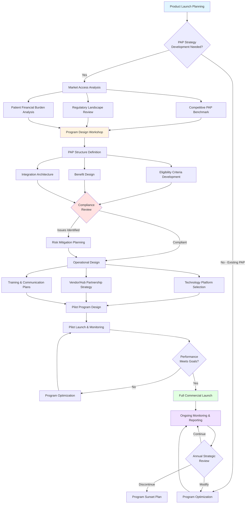
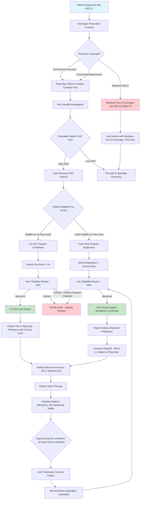

# USE CASE 24: PATIENT ASSISTANCE PROGRAM (PAP) DESIGN
## UC_MA_010: Market Access - Patient Support Services

---

## 📋 METADATA

| Attribute | Details |
|-----------|---------|
| **Use Case ID** | UC_MA_010 |
| **Use Case Name** | Patient Assistance Program Design |
| **Domain** | PHARMA - Market Access |
| **Function** | COMMERCIAL |
| **Sub-Function** | Patient Services & Support |
| **Complexity Level** | ⭐⭐⭐⭐ EXPERT |
| **Regulatory Impact** | 🔴 HIGH - OIG Compliance, Anti-Kickback Statute, HIPAA |
| **Prompt Pattern** | Chain-of-Thought + Regulatory Framework |
| **Version** | 2.0 |
| **Last Updated** | 2025-01-15 |
| **Estimated Time** | 45-60 minutes |
| **Prerequisites** | Product commercialization strategy, pricing, reimbursement landscape |

---

## 🎯 USE CASE OVERVIEW

### Business Context
Patient Assistance Programs (PAPs) are critical components of pharmaceutical market access strategies, designed to help eligible patients access medications they cannot afford. These programs must balance patient access, regulatory compliance, business sustainability, and competitive positioning while navigating complex federal and state regulations.

### Problem Statement
**Challenge**: Designing a compliant, effective, and sustainable Patient Assistance Program that:
- Removes financial barriers for eligible patients
- Complies with OIG Safe Harbors, Anti-Kickback Statute (AKS), and state regulations
- Supports commercial objectives without influencing prescribing decisions
- Integrates with hub services, specialty pharmacies, and payer relationships
- Measures outcomes and demonstrates value to stakeholders

**Traditional Approach Limitations**:
- Manual compliance review processes
- Fragmented program design across therapeutic areas
- Limited real-time eligibility verification
- Lack of integrated patient journey mapping
- Insufficient outcomes measurement and ROI tracking
- Reactive rather than proactive regulatory risk management

### AI-Augmented Solution Value
**LLM Capabilities Applied**:
1. **Regulatory Compliance Analysis**: Interpret OIG guidance, AKS safe harbors, and state-specific regulations
2. **Program Design Optimization**: Analyze precedent programs and recommend optimal structures
3. **Patient Eligibility Criteria Development**: Design compliant, equitable criteria balancing access and sustainability
4. **Risk Assessment**: Identify compliance risks and recommend mitigation strategies
5. **Integration Strategy**: Map patient journey and integration points with healthcare ecosystem
6. **Outcomes Framework**: Design measurement systems for clinical, humanistic, and economic outcomes

---

## 🎭 PERSONAS & USE CASES

### Primary Personas

#### 1. **Sarah Martinez, Senior Director of Market Access**
- **Background**: 12 years in pharmaceutical market access, MBA
- **Responsibilities**: Oversee patient services strategy, payer contracting, reimbursement support
- **Pain Points**:
  - Balancing patient access with compliance constraints
  - Demonstrating PAP ROI to senior leadership
  - Keeping pace with evolving OIG guidance
  - Managing vendor relationships (hubs, pharmacies)
- **Success Metrics**: Patient enrollment rates, time-to-therapy, NRx impact, program cost per patient

#### 2. **Dr. Marcus Chen, VP of Compliance & Ethics**
- **Background**: Former healthcare attorney, 15 years in pharmaceutical compliance
- **Responsibilities**: Ensure company compliance with federal/state regulations, OIG guidance
- **Pain Points**:
  - Evaluating new PAP designs for regulatory risk
  - Responding to OIG advisory opinions
  - Training field teams on compliant PAP promotion
  - Monitoring for program abuse or kickback concerns
- **Success Metrics**: Zero regulatory violations, audit readiness, risk mitigation effectiveness

#### 3. **Jennifer Lee, Patient Services Hub Director**
- **Background**: 8 years managing patient support hubs, nursing background
- **Responsibilities**: Oversee hub operations, patient enrollment, benefit investigations, adherence programs
- **Pain Points**:
  - Complex eligibility determination processes
  - High patient drop-off rates during enrollment
  - Limited visibility into patient outcomes post-enrollment
  - Managing patient expectations and communication
- **Success Metrics**: Enrollment conversion rates, time-to-first-fill, patient satisfaction, adherence rates

#### 4. **Tom Williams, Commercial Analytics Manager**
- **Background**: 6 years in pharmaceutical analytics, statistics background
- **Responsibilities**: Measure PAP impact on market share, NRx trends, patient lifetime value
- **Pain Points**:
  - Attributing commercial outcomes to PAP vs. other factors
  - Limited data integration across systems (hub, claims, sales)
  - Difficulty demonstrating incremental value of PAP investments
- **Success Metrics**: PAP-attributed NRx, patient lifetime value, cost-per-acquisition, program ROI

---

## 🔄 WORKFLOW DIAGRAM



---

## 🎯 PRISM FRAMEWORK APPLICATION

### **P - PRECISION**
**Clinical & Operational Precision in PAP Design**

| Dimension | Application | Measurement |
|-----------|-------------|-------------|
| **Patient Segmentation** | Precise identification of financially vulnerable populations | Income thresholds (FPL %), insurance status, out-of-pocket burden |
| **Eligibility Verification** | Accurate income/insurance verification processes | False positive/negative rates, verification time |
| **Benefit Determination** | Precise calculation of patient cost-sharing needs | Average co-pay reduction, patient out-of-pocket costs |
| **Enrollment Accuracy** | Error-free patient enrollment and documentation | Data entry error rates, documentation completeness |

**Example Precision Metrics**:
- Income verification accuracy: >98%
- Eligibility determination time: <48 hours
- Patient cost burden reduction: Average 85% reduction in OOP costs
- Enrollment data completeness: 100% for regulatory-required fields

---

### **R - RELEVANCE**
**Stakeholder-Relevant Program Design**

| Stakeholder | Relevance Criteria | Design Implications |
|-------------|-------------------|---------------------|
| **Patients** | Ease of access, fast enrollment, minimal documentation burden | Streamlined application, multiple submission channels, plain language |
| **Prescribers** | Minimal practice burden, transparency on patient eligibility | Electronic workflows, real-time eligibility checks, automated prior auth support |
| **Payers** | No interference with medical necessity determinations, transparency | Independent from prescribing decisions, clear program rules |
| **Company Commercial** | Support NRx goals, manageable cost structure, competitive positioning | Performance-based investment, scalable operations |
| **Compliance/Legal** | OIG Safe Harbor compliance, AKS adherence, audit-ready | Clear documentation, independent eligibility criteria, regular audits |

**Relevance Assessment Questions**:
1. Does the PAP address the primary barrier to access for target patients?
2. Is the application process appropriate for patient demographics (digital literacy, language)?
3. Do eligibility criteria align with genuine financial need vs. commercial gain?
4. Are prescribers informed but not incentivized by PAP availability?

---

### **I - INTEGRATION**
**Ecosystem Integration Architecture**

```
┌─────────────────────────────────────────────────────────────┐
│                    PATIENT ASSISTANCE PROGRAM                │
│                     Integration Ecosystem                     │
└─────────────────────────────────────────────────────────────┘

        ┌──────────────────────────────────────────┐
        │         PATIENT ENTRY POINTS             │
        ├──────────────────────────────────────────┤
        │ • Prescriber Office (e-Prescribe)        │
        │ • Patient Call Center (1-800)            │
        │ • Website/Mobile App Portal              │
        │ • Specialty Pharmacy Referral            │
        └──────────────┬───────────────────────────┘
                       │
        ┌──────────────▼───────────────────────────┐
        │        PATIENT SERVICES HUB              │
        ├──────────────────────────────────────────┤
        │ • Benefit Investigation/Verification     │
        │ • Prior Authorization Support            │
        │ • PAP Eligibility Assessment             │
        │ • Enrollment & Documentation             │
        │ • Ongoing Reauthorization                │
        └──────┬─────────────────────┬──────────────┘
               │                     │
    ┌──────────▼─────────┐    ┌─────▼──────────────┐
    │   PAP PLATFORM     │    │  COMPLIANCE ENGINE  │
    ├────────────────────┤    ├─────────────────────┤
    │ • Eligibility Logic│    │ • AKS Screening     │
    │ • Income Verify    │    │ • OIG Exclusion Chk │
    │ • Document Mgmt    │    │ • Audit Logging     │
    │ • Approval Workflow│    │ • Risk Flagging     │
    └────────┬───────────┘    └─────────────────────┘
             │
    ┌────────▼───────────────────────────────────────┐
    │          FULFILLMENT CHANNELS                  │
    ├────────────────────────────────────────────────┤
    │ • Direct-to-Patient Shipment (Free Drug)       │
    │ • Specialty Pharmacy (Co-pay Card/Voucher)     │
    │ • Foundation Grants (Charitable Contributions) │
    │ • Manufacturer Coupon (Commercial Insurance)   │
    └────────┬───────────────────────────────────────┘
             │
    ┌────────▼───────────────────────────────────────┐
    │      DATA & ANALYTICS INTEGRATION              │
    ├────────────────────────────────────────────────┤
    │ • CRM (Patient Journey Tracking)               │
    │ • ERP (Inventory & Financials)                 │
    │ • Claims Data (Payer Insights)                 │
    │ • Sales Data (NRx/TRx Attribution)             │
    │ • Outcomes Platform (Patient-Reported)         │
    └────────────────────────────────────────────────┘
```

**Key Integration Points**:
1. **EHR/e-Prescribe**: Real-time PAP eligibility checks at point of prescribing
2. **Specialty Pharmacy**: Seamless handoff from hub to pharmacy for fulfillment
3. **Payer Systems**: Coordination of benefits to avoid duplicate support
4. **CRM**: Unified patient view across all touchpoints (hub, adherence, outcomes)
5. **Compliance Systems**: Automated OIG exclusion checks, audit trail generation

---

### **S - SAFETY**
**Regulatory & Patient Safety Framework**

#### Regulatory Compliance Safeguards

| Regulation | Risk | Safeguard | Monitoring |
|------------|------|-----------|------------|
| **Anti-Kickback Statute** | PAP seen as inducement to prescribe | Independent eligibility criteria (income-based, not prescriber-based) | Annual OIG advisory opinion review |
| **OIG Safe Harbor** | Failure to meet safe harbor conditions | Document FPL thresholds, no co-pay support for federal programs | Quarterly compliance audits |
| **HIPAA** | Unauthorized PHI disclosure in eligibility verification | BAA with vendors, minimum necessary PHI collection | Annual HIPAA risk assessments |
| **State Regulations** | Non-compliance with state-specific co-pay accumulator/maximizer laws | State-by-state legal review, program customization | State law change monitoring |
| **False Claims Act** | Improper claims submission due to PAP support | Clear documentation that PAP doesn't influence medical necessity | Claims audit programs |

#### Patient Safety Considerations

1. **Medication Safety**:
   - Ensure PAP doesn't bypass important safety checks (REMS, prior auth for clinical reasons)
   - Maintain prescriber oversight and monitoring requirements
   - Include adverse event reporting instructions with PAP materials

2. **Continuity of Care**:
   - Design re-enrollment processes to prevent therapy gaps
   - Alert patients 60-90 days before PAP expiration
   - Bridge programs for patients transitioning insurance coverage

3. **Data Privacy**:
   - Minimize PHI collection (only what's required for eligibility)
   - Secure data transmission and storage (encryption, access controls)
   - Patient consent for program communications

---

### **M - MEASUREMENT**
**PAP Performance Measurement Framework**

#### Tier 1: Patient Access Metrics (Primary KPIs)

| Metric | Definition | Target | Data Source |
|--------|------------|--------|-------------|
| **Enrollment Rate** | % of eligible patients who complete enrollment | >75% | Hub CRM |
| **Time-to-First-Fill** | Days from enrollment to first prescription fill | <7 days | Hub + Pharmacy |
| **Patient Retention** | % of enrolled patients still active at 6 months | >80% | Hub + Claims |
| **Eligibility Approval Rate** | % of applications approved (vs. denied/incomplete) | >85% | PAP Platform |
| **Re-enrollment Success** | % of patients successfully re-enrolled annually | >90% | Hub CRM |

#### Tier 2: Commercial Impact Metrics

| Metric | Definition | Target | Data Source |
|--------|------------|--------|-------------|
| **PAP-Attributed NRx** | New prescriptions attributed to PAP support | Track vs. goal | Sales + Hub |
| **Patient Lifetime Value** | Total revenue generated per PAP-enrolled patient over lifetime | >5x PAP cost | Finance + Hub |
| **Market Share in PAP Segment** | Share of Rx among patients meeting PAP eligibility criteria | Industry-leading | IMS/IQVIA + Hub |
| **Cost per Acquisition** | Total PAP cost / number of patients enrolled | <$5,000 | Finance |
| **Program ROI** | (Incremental Revenue - PAP Costs) / PAP Costs | >200% | Finance |

#### Tier 3: Compliance & Risk Metrics

| Metric | Definition | Target | Data Source |
|--------|------------|--------|-------------|
| **Audit Finding Rate** | Number of findings per internal/external audit | Zero critical | Compliance |
| **OIG Exclusion Hits** | Patients/prescribers flagged in monthly OIG checks | Zero | Compliance Platform |
| **Documentation Completeness** | % of patient files with all required documentation | 100% | Hub QA |
| **Adverse Event Reporting** | % of AEs reported within regulatory timelines | 100% | Pharmacovigilance |
| **Data Privacy Incidents** | Number of HIPAA breaches or privacy complaints | Zero | IT Security |

#### Tier 4: Patient Outcome Metrics (Value Demonstration)

| Metric | Definition | Measurement | Stakeholder Value |
|--------|------------|-------------|-------------------|
| **Adherence (PDC)** | Proportion of days covered with medication | PDC >80% at 12 months | Payers, Providers |
| **Persistence** | Time to discontinuation of therapy | Median >12 months | Clinical, Commercial |
| **Patient Satisfaction** | NPS or satisfaction survey scores | NPS >50 | All stakeholders |
| **Clinical Outcomes** | Disease-specific outcome measures (if feasible) | Improvement vs. baseline | Payers, Providers |
| **Humanistic Outcomes** | Quality of life, treatment satisfaction | PRO measures | Patients, Providers |

#### Measurement Cadence

| Frequency | Metrics | Audience | Action |
|-----------|---------|----------|--------|
| **Weekly** | Enrollment volume, time-to-first-fill, call center metrics | Hub operations team | Operational adjustments |
| **Monthly** | Enrollment rate, approval rate, cost per patient, NRx attribution | Market Access leadership | Tactical optimization |
| **Quarterly** | Commercial impact, retention, ROI, compliance KPIs | Executive leadership, Compliance | Strategic decisions, compliance review |
| **Annual** | Full program evaluation, benchmarking, strategic planning | Senior leadership, Board | Program renewal, investment decisions |

---

## 💡 PROMPT ENGINEERING ARCHITECTURE

### Core Prompt Structure

```yaml
SYSTEM_ROLE:
  identity: "Senior Market Access Strategist & Patient Services Expert"
  expertise:
    - Patient assistance program design (15+ years)
    - OIG compliance and Anti-Kickback Statute interpretation
    - Hub services operations and vendor management
    - Pharmaceutical market access and reimbursement
    - Patient journey mapping and experience design
    - Outcomes research and health economics
  
  frameworks:
    - OIG Compliance Program Guidance for Pharmaceutical Manufacturers
    - PhRMA Principles on Conduct of Clinical Trials and Communication of Clinical Trial Results
    - HIPAA Privacy and Security Rules
    - FDA REMS programs (where applicable)
  
  approach:
    - Patient-centric design with compliance guardrails
    - Evidence-based decision making
    - Cross-functional collaboration (commercial, compliance, legal, operations)
    - Continuous improvement and measurement

CONTEXT_INJECTION:
  product_context: "Product name, therapeutic area, indication, pricing, payer coverage"
  market_context: "Competitive PAPs, patient demographics, financial burden data"
  regulatory_context: "Recent OIG guidance, state regulations, company risk tolerance"
  operational_context: "Existing hub capabilities, technology platforms, vendor relationships"

TASK_SPECIFICATION:
  primary_task: "Design a comprehensive, compliant Patient Assistance Program"
  deliverables:
    - Program structure and eligibility criteria
    - Compliance risk assessment and mitigation plan
    - Operational implementation roadmap
    - Integration architecture with hub/pharmacy/payers
    - Measurement framework and KPIs
    - Budget and ROI projections

OUTPUT_FORMAT:
  structure: "Executive Summary → Detailed Design → Implementation Plan → Appendices"
  style: "Professional, regulatory-aware, actionable"
  citations: "Cite OIG guidance, legal precedent, regulatory requirements"
  visual_aids: "Flowcharts for patient journey, eligibility logic, integration architecture"
```

---

## 🔧 DETAILED PROMPT TEMPLATE

### Master Prompt: Patient Assistance Program Design

```markdown
# PATIENT ASSISTANCE PROGRAM DESIGN REQUEST

You are a **Senior Market Access Strategist and Patient Services Expert** with 15+ years of experience designing compliant, effective patient assistance programs for pharmaceutical products. You have deep expertise in:
- OIG Compliance Program Guidance for Pharmaceutical Manufacturers
- Anti-Kickback Statute (AKS) safe harbors and OIG advisory opinions
- Patient hub operations, benefit verification, and enrollment workflows
- Integration with specialty pharmacies, payer systems, and healthcare providers
- Outcomes measurement and program ROI analysis

Your approach balances **patient access**, **regulatory compliance**, **operational feasibility**, and **commercial sustainability**.

---

## PRODUCT & MARKET CONTEXT

**Product Information:**
- Product Name: {PRODUCT_NAME}
- Therapeutic Area: {THERAPEUTIC_AREA}
- Indication: {INDICATION}
- Dosing Regimen: {DOSING_REGIMEN}
- Wholesale Acquisition Cost (WAC): {WAC_PRICE}
- Annual Cost of Therapy: {ANNUAL_COST}

**Market Context:**
- Launch Status: {LAUNCH_STATUS} (Pre-launch, Newly launched, Established)
- Target Patient Population Size: {PATIENT_POPULATION}
- Primary Payer Mix: {PAYER_MIX} (% Commercial, Medicare, Medicaid, Uninsured)
- Competitive Landscape: {COMPETITIVE_PAPS}
- Current Access Barriers: {ACCESS_BARRIERS}

**Patient Financial Burden Analysis:**
- Average Patient Out-of-Pocket Cost (with insurance): {AVG_OOP_INSURED}
- Estimated % of Patients with Financial Hardship: {FINANCIAL_HARDSHIP_PCT}
- Patient Demographics: {PATIENT_DEMOGRAPHICS} (Age, income levels, geography)
- Current Abandonment Rate (if known): {ABANDONMENT_RATE}

**Regulatory & Compliance Context:**
- Company Risk Tolerance: {RISK_TOLERANCE} (Conservative, Moderate, Aggressive)
- Recent OIG Guidance Changes: {OIG_UPDATES}
- State-Specific Regulations: {STATE_REGULATIONS}
- Existing Hub Infrastructure: {HUB_CAPABILITIES}

---

## ANALYSIS FRAMEWORK

Please provide a **comprehensive Patient Assistance Program design** using the following structured approach:

### 1. PROGRAM STRATEGY & OBJECTIVES

**1.1 Strategic Goals**
- What are the primary objectives of this PAP? (e.g., remove financial barriers, support NRx goals, improve adherence)
- How does the PAP align with overall market access strategy?
- What are success criteria for Year 1, Year 2, Year 3?

**1.2 Target Population Definition**
- Which patient segments should the PAP prioritize? (Uninsured, underinsured, high OOP, specific demographics)
- What is the estimated size of the eligible population?
- Are there subpopulations requiring specialized support (pediatric, elderly, rare disease)?

**1.3 Competitive Positioning**
- How do competitor PAPs compare? (eligibility criteria, benefit levels, enrollment process)
- What differentiating features should this PAP offer?
- Where can this PAP create competitive advantage?

---

### 2. PROGRAM STRUCTURE & DESIGN

**2.1 Eligibility Criteria**

Design comprehensive, compliant eligibility criteria addressing:

| Criterion | Specification | Rationale |
|-----------|---------------|-----------|
| **Income Threshold** | Federal Poverty Level (FPL) percentage or absolute income cap | |
| **Insurance Status** | Uninsured, underinsured, high deductible, specific plan types | |
| **Out-of-Pocket Threshold** | Minimum annual OOP cost to qualify | |
| **Geographic Eligibility** | U.S. residents, state-specific restrictions | |
| **Age Restrictions** | Any age limitations (e.g., Medicare exclusions) | |
| **Citizenship/Residency** | Legal residency requirements | |
| **Other Clinical/Coverage** | Prior authorization denials, step therapy failures | |

**OIG Compliance Check:**
- Does the eligibility criteria meet OIG Safe Harbor requirements?
- Are income limits set at or below 500% FPL (if relevant)?
- Are there any elements that could be construed as inducements to prescribe?

**2.2 Benefit Structure**

Define what the PAP provides:

| Benefit Type | Description | Patient Cost | Company Cost | Compliance Notes |
|--------------|-------------|--------------|--------------|------------------|
| **Free Drug** | Product provided at no cost | $0 | Full WAC cost | Allowed for uninsured/underinsured |
| **Co-pay Assistance** | Reduction/elimination of co-pay | $0-$X | Variable | NOT for federal programs (Medicare/Medicaid) |
| **Bridge Programs** | Temporary supply during prior auth | $0 | WAC for bridge supply | Limited duration (30-60 days) |
| **Foundation Grants** | Donation to independent charity | Varies | Grant amount | Must be independent, no steering |

**Recommendation:** Based on product cost, patient population, and compliance landscape, which benefit structure is optimal?

**2.3 Enrollment Process Design**

Map the patient enrollment journey:

```
[Patient Prescribed] → [Hub Referral] → [Benefit Investigation] → 
[PAP Eligibility Assessment] → [Documentation Collection] → 
[Income/Insurance Verification] → [Approval/Denial] → [Fulfillment] → 
[Ongoing Support & Re-enrollment]
```

For each stage, specify:
- Required information/documents
- Responsible party (patient, prescriber, hub)
- Timeline/SLA
- Technology enablers
- Drop-off prevention strategies

**2.4 Duration & Re-enrollment**

- Initial enrollment period: {DURATION} (e.g., 12 months, continuous while eligible)
- Re-enrollment process: Annual, quarterly, as-needed?
- Expiration notification: When and how are patients notified?
- Bridge support during re-enrollment: How to prevent therapy gaps?

---

### 3. REGULATORY COMPLIANCE & RISK MANAGEMENT

**3.1 OIG Safe Harbor Compliance Analysis**

Evaluate against key safe harbor provisions:

| Safe Harbor Provision | Requirement | Program Design Compliance | Risk Level |
|-----------------------|-------------|---------------------------|------------|
| **Patient Assistance Programs** | Free or discounted drugs to financially needy | | Low/Medium/High |
| **Discount Safe Harbor** | Proper disclosure of discounts on cost reports | | Low/Medium/High |
| **Prohibition on Federal Healthcare Program Beneficiaries** | No support for Medicare Part D co-pays | | Low/Medium/High |

**3.2 Anti-Kickback Statute (AKS) Risk Assessment**

Identify and mitigate AKS risks:

| Potential Risk | Description | Mitigation Strategy | Residual Risk |
|----------------|-------------|---------------------|---------------|
| **Inducement to Prescribe** | PAP could be seen as incentivizing prescribers | Independent eligibility criteria, no prescriber knowledge of patient PAP status required | Low/Medium |
| **Medicare Part D Co-pay Support** | Prohibited under AKS | Explicitly exclude Medicare Part D, screen all applicants | Low |
| **Foundation Steering** | Directing patients to specific foundations | Use independent foundations, no earmarking | Low |

**3.3 State-Specific Regulations**

Address state-level compliance:

| State | Specific Regulation | Impact on PAP | Design Adaptation |
|-------|---------------------|---------------|-------------------|
| **California** | SB 17 - Co-pay accumulator law | | |
| **Massachusetts** | Transparency requirements | | |
| **[Other States]** | | | |

**3.4 HIPAA Compliance**

- What PHI is collected during enrollment? (Minimum necessary)
- How is PHI protected? (Encryption, access controls, BAAs with vendors)
- Patient consent process for program communications
- Breach notification procedures

**3.5 Compliance Monitoring & Auditing**

Propose ongoing compliance measures:
- Internal audit frequency and scope
- External audit/legal review schedule
- OIG exclusion list screening (monthly)
- Compliance training for hub staff and field teams
- Documentation standards and retention policies

---

### 4. OPERATIONAL IMPLEMENTATION

**4.1 Hub Services & Vendor Strategy**

| Function | In-House vs. Outsourced | Vendor Selection Criteria | Key Capabilities Needed |
|----------|-------------------------|---------------------------|-------------------------|
| **Benefit Investigation** | | | |
| **Prior Authorization Support** | | | |
| **PAP Enrollment** | | | |
| **Income/Insurance Verification** | | | |
| **Fulfillment Coordination** | | | |
| **Patient Communication** | | | |
| **Data Analytics & Reporting** | | | |

**Vendor Recommendations:** Based on product needs, suggest 2-3 hub vendors with rationale.

**4.2 Technology Platform Requirements**

Core system capabilities:

```yaml
PAP_PLATFORM_REQUIREMENTS:
  eligibility_engine:
    - Income verification API integrations
    - Insurance eligibility checks (real-time)
    - FPL calculation and annual updates
    - Multi-criteria decision logic
  
  documentation_management:
    - Secure document upload/storage
    - E-signature capabilities
    - Audit trail for all document access
    - Automated expiration alerts
  
  compliance_engine:
    - OIG exclusion list screening (automated monthly)
    - HIPAA audit logging
    - Role-based access controls
    - Regulatory report generation
  
  integration_capabilities:
    - EHR/e-Prescribe connectivity
    - Specialty pharmacy integration
    - CRM bidirectional sync
    - Claims data feeds (where available)
  
  patient_portal:
    - Mobile-responsive web application
    - Enrollment application submission
    - Status tracking and notifications
    - Secure messaging with hub
    - Document upload (prescriptions, income proof)
```

**4.3 Patient Journey & Experience Design**

Optimize for minimal patient burden:

**Channel Strategy:**
- **Phone**: 1-800 number with IVR and live agent support (hours: 8am-8pm ET)
- **Web**: Patient portal for enrollment, status checks, document upload
- **Mobile App**: Optional mobile experience for tech-savvy patients
- **Fax**: Prescriber-initiated enrollment via fax (for clinic workflow fit)
- **Mail**: Paper application option for patients without digital access

**Communication Strategy:**
- **Language Support**: English + Spanish + other languages based on patient demographics
- **Health Literacy**: Plain language (6th-8th grade reading level), avoid jargon
- **Frequency**: Enrollment status updates every 48-72 hours, proactive outreach if documentation missing
- **Channels**: Phone, email, SMS (with consent), mail

**Drop-off Prevention:**
- Identify top 3 reasons for enrollment abandonment (documentation burden, income verification, confusion)
- Implement targeted interventions:
  - Simplified income verification (accept paystubs, tax returns, or self-attestation below certain thresholds)
  - Dedicated case managers for complex cases
  - Automated reminders for incomplete applications

**4.4 Training & Change Management**

| Audience | Training Content | Delivery Method | Frequency |
|----------|------------------|-----------------|-----------|
| **Field Sales Reps** | PAP overview, compliant messaging, when/how to refer | Virtual + F2F at national meeting | Annual + new hire |
| **Hub Staff** | Eligibility criteria, documentation requirements, compliance | Virtual modules + certification | Quarterly refresher |
| **Prescriber Offices** | Referral process, patient support resources | Office lunch-and-learns, webinars | As needed |
| **Patients** | Enrollment process, rights/responsibilities | Video tutorials, FAQs, live support | Ongoing |

**4.5 Implementation Roadmap**

Propose a phased rollout:

| Phase | Timeline | Key Activities | Success Criteria | Go/No-Go Decision Point |
|-------|----------|----------------|------------------|-------------------------|
| **Phase 0: Design** | Months 1-3 | Finalize PAP structure, legal review, vendor selection | Legal approval, vendor contracts signed | |
| **Phase 1: Build** | Months 4-6 | Technology implementation, hub training, pilot site selection | UAT passed, 10 pilot sites trained | |
| **Phase 2: Pilot** | Months 7-9 | Soft launch in 3-5 regions, monitor KPIs | 50+ enrollments, <7 day time-to-first-fill, >80% approval rate | Go/No-Go: Month 9 |
| **Phase 3: Scale** | Months 10-12 | National rollout, full field enablement, optimize based on pilot learnings | 500+ enrollments, meet ROI targets | |
| **Phase 4: Optimize** | Months 13+ | Continuous improvement, annual compliance review, technology enhancements | Sustained performance, zero compliance findings | |

---

### 5. MEASUREMENT & OUTCOMES FRAMEWORK

**5.1 KPI Dashboard Design**

Propose a tiered KPI dashboard:

**Tier 1 - Patient Access (Weekly Reporting):**
- Total enrollments (new + re-enrollments)
- Enrollment conversion rate (applications → approvals)
- Time-to-first-fill (days)
- Patient retention rate (6-month, 12-month)
- Call center metrics (call volume, wait time, first-call resolution)

**Tier 2 - Commercial Impact (Monthly Reporting):**
- PAP-attributed NRx and TRx
- Market share in PAP-eligible segment
- Cost per enrolled patient
- Patient lifetime value (pLTV)
- Program ROI

**Tier 3 - Compliance & Risk (Quarterly Reporting):**
- Audit findings (internal and external)
- OIG exclusion hits (should be zero)
- Documentation completeness
- HIPAA incidents
- Adverse event reporting timeliness

**Tier 4 - Patient Outcomes (Annual Reporting):**
- Medication adherence (PDC ≥80%)
- Persistence (time to discontinuation)
- Patient satisfaction (NPS)
- Clinical outcomes (if measurable)
- Humanistic outcomes (QoL surveys)

**5.2 Data Integration & Analytics**

How will data flow and be analyzed?

```
[Hub CRM] → [Data Warehouse] ← [Specialty Pharmacy]
                  ↓                      ↓
            [Claims Data] ← [Sales/DDD Data]
                  ↓
          [BI/Analytics Platform]
                  ↓
      [Automated Dashboards & Reports]
```

**Key Reports:**
- Weekly operational dashboard (enrollment funnel, processing times)
- Monthly commercial performance (NRx attribution, ROI)
- Quarterly compliance scorecard
- Annual program evaluation and strategic planning

**5.3 Continuous Improvement Process**

Establish a feedback loop:

1. **Monthly Operations Review**: Hub team + Market Access
   - Review enrollment trends, identify bottlenecks
   - Discuss top patient/prescriber feedback themes
   - Implement rapid improvements (e.g., streamline forms, add FAQs)

2. **Quarterly Business Review**: Market Access + Commercial + Compliance
   - Assess commercial impact and ROI
   - Review compliance metrics and any risks
   - Make go/no-go decisions on program modifications

3. **Annual Strategic Planning**: Senior Leadership
   - Comprehensive program evaluation
   - Benchmark against competitors
   - Decide on program continuation, expansion, or modification
   - Set next year's budget and goals

---

### 6. FINANCIAL ANALYSIS & ROI

**6.1 Program Cost Structure**

Estimate annual PAP costs:

| Cost Component | Unit Cost | Volume | Annual Cost | Notes |
|----------------|-----------|--------|-------------|-------|
| **Drug Product (Free Drug)** | WAC per patient/year | Est. # free drug patients | | Largest cost component |
| **Co-pay Assistance** | Avg. subsidy per patient | Est. # co-pay patients | | Variable based on insurance |
| **Hub Operations** | Per-patient service fee | Total enrolled patients | | Typical range: $200-500/patient |
| **Technology Platform** | Annual licensing + setup | 1 | | One-time setup + ongoing |
| **Patient Communication** | Call center, mail, outreach | Total enrolled patients | | Included in hub fee or separate |
| **Compliance/Legal** | Annual audit, legal review | 1 | | Typically $50K-150K/year |
| **Training & Enablement** | Field training, materials | Sales force size | | One-time + annual refreshers |
| **Program Management** | FTE salaries (Market Access team) | 2-3 FTEs | | Internal staff costs |

**Total Estimated Annual PAP Cost:** ${TOTAL_COST}

**6.2 Revenue & ROI Projection**

Estimate incremental revenue:

| Metric | Year 1 | Year 2 | Year 3 | Assumptions |
|--------|--------|--------|--------|-------------|
| **Total Enrolled Patients** | | | | Based on eligible population and conversion rates |
| **PAP-Attributed NRx** | | | | % of enrollments that are truly incremental |
| **Average Revenue per Patient** | | | | Net revenue after rebates/discounts |
| **Total Incremental Revenue** | | | | |
| **Total PAP Costs** | | | | |
| **Net Contribution** | | | | Revenue - Costs |
| **ROI** | | | | (Revenue - Costs) / Costs |

**Target ROI:** >200% by Year 3

**Sensitivity Analysis:**
- Best case scenario (high enrollment, high incrementality): ROI = X%
- Base case scenario (moderate performance): ROI = Y%
- Worst case scenario (low enrollment or low incrementality): ROI = Z%

**Break-even Analysis:**
- How many incremental patients needed to break even?
- What enrollment conversion rate is required?
- What incrementality rate is required (vs. patients who would have filled regardless)?

---

### 7. RISK MITIGATION & CONTINGENCY PLANNING

**7.1 Key Risks & Mitigation Strategies**

| Risk Category | Specific Risk | Likelihood | Impact | Mitigation Strategy | Contingency Plan |
|---------------|---------------|------------|--------|---------------------|------------------|
| **Regulatory** | OIG advisory opinion challenges PAP design | Low | High | Engage external counsel for pre-emptive review, align with recent OIG guidance | Rapid redesign capability, pause enrollment if needed |
| **Regulatory** | State passes new co-pay accumulator/maximizer laws | Medium | Medium | Monitor state legislation, design flexible program structure | State-by-state program modifications |
| **Operational** | Hub vendor performance issues (low enrollment, slow processing) | Medium | High | SLAs with performance penalties, backup vendor identified | Switch to backup vendor, bring some functions in-house |
| **Financial** | Higher than expected enrollment or free drug costs | Medium | High | Enrollment caps, annual budget reviews, predictive modeling | Tighten eligibility criteria, increase patient cost-sharing (if compliant) |
| **Compliance** | HIPAA breach or data security incident | Low | Very High | Robust cybersecurity, employee training, BAAs, breach response plan | Immediate containment, notification per HIPAA rules, legal counsel |
| **Commercial** | Low incrementality (patients would have filled anyway) | Medium | Medium | Rigorous incrementality analysis, segment targeting | Shift focus to higher-value segments, adjust messaging |

**7.2 Contingency Scenarios**

**Scenario 1: Enrollment Far Exceeds Projections**
- **Trigger**: 150%+ of projected enrollments in first 6 months
- **Impact**: Budget overrun, potential supply constraints
- **Response**:
  1. Assess incrementality (are these truly new patients?)
  2. If budget permits, celebrate success and adjust forecast
  3. If budget constrained, implement enrollment caps or waitlist
  4. Accelerate supply planning with manufacturing

**Scenario 2: Enrollment Falls Short of Projections**
- **Trigger**: <50% of projected enrollments in first 6 months
- **Impact**: Underutilization of hub resources, lower than expected commercial impact
- **Response**:
  1. Root cause analysis (awareness? eligibility criteria too strict? process too complex?)
  2. Implement targeted interventions (ease documentation, expand eligibility, increase awareness)
  3. Consider pilot extensions or geographic expansion

**Scenario 3: Regulatory Inquiry or Challenge**
- **Trigger**: OIG inquiry, state attorney general investigation, or whistleblower complaint
- **Impact**: Potential program suspension, financial penalties, reputational damage
- **Response**:
  1. Immediate legal counsel engagement
  2. Preserve all documentation (litigation hold)
  3. Cooperate fully with investigation
  4. Suspend enrollment if advised by counsel
  5. Implement remediation plan based on findings

---

## OUTPUT REQUIREMENTS

Please deliver:

1. **Executive Summary** (2-3 pages)
   - Program overview and strategic rationale
   - Key design decisions and compliance approach
   - Financial projections and ROI
   - Implementation timeline and next steps

2. **Detailed Program Design Document** (15-25 pages)
   - Sections 1-7 above, fully completed
   - Visual aids: Patient journey flowchart, eligibility decision tree, integration architecture
   - Appendices: Competitor PAP benchmarking, regulatory citations, glossary

3. **Implementation Roadmap** (Gantt chart or timeline)
   - Key milestones, dependencies, and decision points

4. **Compliance Risk Assessment** (summary table)
   - Identified risks, mitigation strategies, residual risk levels

5. **KPI Dashboard Mockup** (visual mockup or table)
   - Tiered KPIs with target ranges

**Tone & Style:**
- Professional, suitable for executive presentation
- Regulatory-aware (cite OIG guidance, legal precedent)
- Balanced (acknowledge tradeoffs, not overly promotional)
- Actionable (clear next steps and decision points)

**Citations:**
- OIG Compliance Program Guidance for Pharmaceutical Manufacturers (2003)
- OIG Special Advisory Bulletin on Patient Assistance Programs (2005)
- Recent OIG Advisory Opinions on PAPs
- Anti-Kickback Statute (42 U.S.C. § 1320a-7b(b))
- HIPAA Privacy Rule (45 CFR Part 160 and Part 164)
- State-specific regulations (as applicable)

---

## VALIDATION CHECKLIST

Before finalizing your recommendation, verify:

✅ **Compliance:**
- [ ] Eligibility criteria meet OIG Safe Harbor requirements
- [ ] Medicare Part D co-pay support explicitly excluded
- [ ] No elements that could be construed as inducements to prescribe
- [ ] HIPAA-compliant data collection and protection
- [ ] State-specific regulations addressed

✅ **Patient-Centricity:**
- [ ] Enrollment process minimizes patient burden
- [ ] Multiple access channels accommodate diverse patient needs
- [ ] Plain language and health literacy principles applied
- [ ] Support for non-English speakers and those with disabilities

✅ **Operational Feasibility:**
- [ ] Hub vendor capabilities align with program requirements
- [ ] Technology platform can scale to projected volumes
- [ ] Timeline is realistic given resource constraints
- [ ] Integration with existing systems is achievable

✅ **Commercial Viability:**
- [ ] Program supports strategic market access goals
- [ ] ROI projections are conservative and evidence-based
- [ ] Competitive positioning is clear
- [ ] Measurement framework enables ongoing optimization

✅ **Sustainability:**
- [ ] Financial model is sustainable over 3+ years
- [ ] Continuous improvement process is built in
- [ ] Risk mitigation strategies are comprehensive
- [ ] Program can adapt to changing market conditions

---

**Begin your comprehensive Patient Assistance Program design analysis now.**
```

---

## 📊 EXAMPLE USE CASE EXECUTION

### Sample Input Scenario

```yaml
PRODUCT_CONTEXT:
  product_name: "Innovara™ (innovarabimab)"
  therapeutic_area: "Oncology - Advanced Non-Small Cell Lung Cancer (NSCLC)"
  indication: "First-line treatment of metastatic NSCLC with PD-L1 expression ≥50%"
  dosing_regimen: "10 mg/kg IV every 3 weeks"
  wac_price: "$15,000 per dose"
  annual_cost: "$260,000 (18 doses/year average)"

MARKET_CONTEXT:
  launch_status: "Newly launched (Month 3 post-launch)"
  target_population: "~35,000 patients in U.S. annually"
  payer_mix: "60% Commercial, 30% Medicare, 8% Medicaid, 2% Uninsured"
  competitive_paps: "Keytruda PAP (free drug for uninsured, co-pay up to $25K/year), Opdivo PAP (similar structure)"
  access_barriers: "High specialty tier co-insurance (30-50%), Medicare Part D coverage gap, prior auth requirements"

PATIENT_BURDEN:
  avg_oop_insured: "$8,000-$20,000/year (Commercial), $5,000-$10,000/year (Medicare Part D pre-catastrophic)"
  financial_hardship_pct: "45% report significant financial burden"
  patient_demographics: "Median age 65, 35% <300% FPL, geographically diverse, 15% Spanish-speaking"
  abandonment_rate: "18% of new prescriptions not filled due to cost"

REGULATORY_CONTEXT:
  risk_tolerance: "Moderate - prefer conservative approach with OIG precedent"
  oig_updates: "2024 OIG Advisory Opinion 24-03 re-affirmed income-based PAP safe harbor at 500% FPL"
  state_regulations: "California co-pay accumulator law (AB 1296) requires notification, Massachusetts transparency reporting"
  hub_capabilities: "Existing oncology hub with benefit investigation, prior auth support, but no PAP experience yet"
```

### Expected Output Structure (Abbreviated Example)

```markdown
# INNOVARA™ PATIENT ASSISTANCE PROGRAM
## Comprehensive Design & Implementation Plan

---

## EXECUTIVE SUMMARY

**Program Vision:**
The Innovara™ Patient Assistance Program (PAP) is designed to eliminate financial barriers for eligible patients with advanced NSCLC, ensuring every appropriate patient has access to this life-saving therapy regardless of financial circumstances. The program balances comprehensive patient support with rigorous OIG compliance, operational efficiency, and commercial sustainability.

**Key Design Decisions:**

1. **Dual-Structure Approach:**
   - **Free Drug Program**: For uninsured/underinsured patients with income ≤500% FPL (~$75,000 for individual, $154,000 for family of 4)
   - **Co-Pay Assistance Program**: For commercially insured patients (Medicare Part D explicitly excluded), covering up to $25,000/year in out-of-pocket costs

2. **Eligibility Criteria (Free Drug Program):**
   - Income at or below 500% of Federal Poverty Level (OIG Safe Harbor compliant)
   - Uninsured OR underinsured (defined as: patient OOP >$5,000/year, or >20% of annual income)
   - U.S. residency
   - No Medicare Part D coverage
   - Not eligible for Medicaid (must attempt Medicaid enrollment first)
   - Valid prescription from licensed prescriber

3. **Compliance Framework:**
   - **OIG Safe Harbor Alignment**: Income-based eligibility (500% FPL) meets 2024 OIG guidance
   - **AKS Mitigation**: Independent eligibility determination, no prescriber knowledge required
   - **Medicare Exclusion**: Automated screening to prevent Medicare Part D co-pay support
   - **HIPAA Compliance**: Minimum necessary PHI collection, encrypted storage, BAAs with all vendors

4. **Operational Model:**
   - **Hub Partner**: [Vendor Name] selected for oncology expertise, technology platform, and compliance track record
   - **Fulfillment**: Specialty pharmacy network for co-pay program; direct-to-patient for free drug program
   - **Patient Access**: Multi-channel (phone, web, mobile app, fax for prescribers)
   - **Timeline**: 6-month implementation; pilot in Q3 2025, national launch Q4 2025

**Financial Projections (Year 1):**

| Metric | Estimate | Assumptions |
|--------|----------|-------------|
| **Total Enrolled Patients** | 1,200 | 3.4% of eligible population |
| **Free Drug Patients** | 800 | 67% of enrolled |
| **Co-Pay Assistance Patients** | 400 | 33% of enrolled |
| **Program Costs** | $6.8M | $5.2M drug cost + $1.2M operations + $0.4M compliance/tech |
| **Incremental Revenue** | $18.5M | 65% incrementality assumed |
| **Net Contribution** | $11.7M | Revenue - Costs |
| **ROI** | 172% | (Revenue - Costs) / Costs |

**Success Criteria:**
- Enrollment rate >70% of eligible patients who apply
- Time-to-first-fill <7 days
- Patient retention >85% at 6 months
- Zero major compliance findings in first-year audit
- ROI >150% by end of Year 1

**Next Steps:**
1. Legal & Compliance review (2 weeks) - CRITICAL PATH
2. Hub vendor contracting (4 weeks)
3. Technology platform implementation (12 weeks)
4. Pilot site selection and training (4 weeks)
5. Soft launch Q3 2025

---

## DETAILED PROGRAM DESIGN

### 1. PROGRAM STRUCTURE & ELIGIBILITY

#### 1.1 Free Drug Program

**Eligibility Criteria:**

| Criterion | Requirement | Verification Method | Rationale |
|-----------|-------------|---------------------|-----------|
| **Income** | ≤500% Federal Poverty Level | Tax return, paystub, or self-attestation (if <250% FPL) | OIG Safe Harbor compliant; 500% FPL = ~$75K individual, $154K family of 4 |
| **Insurance Status** | Uninsured OR underinsured* | Insurance card verification, EOB review | *Underinsured = patient OOP >$5,000/year or >20% annual income |
| **Medicare Part D** | NOT enrolled in Medicare Part D | Medicare eligibility check (CMS API) | Federal prohibition on co-pay support for Part D |
| **Medicaid Eligibility** | Not eligible OR applied and denied | Medicaid screening tool, denial letter | Medicaid is primary payer; patient must attempt enrollment first |
| **Prescription** | Valid Rx from licensed prescriber for FDA-approved indication | e-Prescribe or fax Rx verification | Medical necessity, appropriate use |
| **U.S. Residency** | Legal resident of U.S. | Address verification, ID | Program limited to U.S. market |
| **Age** | 18+ years | Date of birth | Align with indication (adult NSCLC) |

**Income Verification Options (Patient Choice):**
1. **Primary**: Most recent tax return (1040)
2. **Alternative**: 2 consecutive months of paystubs
3. **Self-Attestation**: Allowed for patients <250% FPL (simplified access for most financially vulnerable)

**Duration & Re-enrollment:**
- Initial enrollment: 12 months (or until patient no longer meets eligibility)
- Re-enrollment: Annual, 60 days before expiration
- Automatic notification at 90 days, 60 days, and 30 days before expiration
- Bridge supply (30 days) provided during re-enrollment processing to prevent therapy gaps

**Benefit:**
- Innovara™ provided at **$0 cost** to patient
- Shipped directly to patient or prescriber office (patient choice)
- No quantity limits during enrollment period (as long as prescribed appropriately)

**OIG Compliance Rationale:**
This structure aligns with OIG Special Advisory Bulletin on Patient Assistance Programs (2005) and recent Advisory Opinion 24-03, which confirmed that income-based PAPs at ≤500% FPL meet safe harbor requirements when:
1. Eligibility is determined independently of prescriber influence
2. Medicare Part D beneficiaries are excluded
3. Patients are not steered based on prescriber preferences

---

#### 1.2 Co-Pay Assistance Program (Commercial Insurance Only)

**Eligibility Criteria:**

| Criterion | Requirement | Verification Method |
|-----------|-------------|---------------------|
| **Insurance** | Active commercial insurance (NOT Medicare Part D, Medicaid, or other federal/state programs) | Insurance card verification, eligibility check |
| **Prescription** | Valid Rx for FDA-approved indication | e-Prescribe or fax |
| **U.S. Residency** | Legal resident of U.S. | Address verification |
| **Income** | No income limit (but see Max Benefit) | N/A |
| **Federal Program Exclusion** | NOT eligible for or enrolled in federal healthcare program | Automated screening |

**Benefit:**
- Up to **$25,000/year** in co-pay/co-insurance support
- Applies to patient out-of-pocket costs only (deductible, co-pay, co-insurance)
- Does NOT apply to insurance premium costs
- Benefit is per calendar year (resets January 1)

**Activation & Fulfillment:**
- Patient receives co-pay card (physical or digital)
- Card is processed at specialty pharmacy at time of fill
- Patient responsibility: $0 or minimal ($5-10 if policy requires patient contribution)
- Pharmacy submits claim to co-pay program, adjudicated within 24-48 hours

**Federal Program Exclusion - Critical Compliance Element:**
- **Medicare Part D**: Explicitly excluded per AKS and CMMS guidance
- **Medicaid**: Excluded (Medicaid best price rule implications)
- **TRICARE, VA, IHS**: Excluded (federal programs)
- **Verification Process**: 
  - Patient self-attestation at enrollment
  - Monthly screening against CMS enrollment files
  - Pharmacy-level claims screening (reject if Medicare Part D claim detected)

**State-Specific Adaptations:**
- **California (AB 1296)**: Co-pay assistance does NOT count toward patient deductible/OOP max; notification provided to patients
- **Massachusetts**: PAP reported in transparency filing (annual)
- **Other states**: Monitor for co-pay accumulator/maximizer programs, adjust patient communication accordingly

**Competitive Positioning:**
- **Keytruda**: $25,000/year max (match)
- **Opdivo**: $25,000/year max (match)
- **Innovara™ differentiator**: Faster enrollment process (48-hour approval target vs. industry avg 5-7 days), dedicated oncology-trained hub staff

---

### 2. PATIENT JOURNEY & ENROLLMENT PROCESS

#### 2.1 End-to-End Patient Journey Map



**Key Touchpoints & Responsibilities:**

| Stage | Actor | Action | SLA | Drop-off Prevention |
|-------|-------|--------|-----|---------------------|
| **Prescription** | Prescriber | Write Rx, discuss financial support options | N/A | Provide PAP info sheet at point of Rx |
| **Referral** | Prescriber office OR Patient | Contact hub (phone/web/fax) | N/A | Multiple referral channels, no "wrong door" |
| **Benefit Investigation** | Hub | Verify insurance, estimate patient OOP | 48 hours | Proactive outreach if patient doesn't follow up |
| **PAP Pre-Screen** | Hub | Assess likely eligibility, explain options | Same call | Clear eligibility explanation, set expectations |
| **Application Submission** | Patient (with Hub guidance) | Complete application, upload docs | Patient-paced | Simplified forms, mobile upload, Hub live chat |
| **Eligibility Review** | Hub + PAP Platform | Verify income/insurance, approve/deny | Free Drug: 48hrs, Co-Pay: 24hrs | Automated workflows, exception handling |
| **Notification** | Hub | Approval/denial communication | Within 2 hours of decision | Multi-channel (phone + email + SMS if opted in) |
| **Fulfillment** | Specialty Pharmacy OR Direct Ship | Dispense/ship medication | 5-7 days | Expedited shipping for urgent cases |
| **First Fill** | Patient | Receive medication, start therapy | N/A | Follow-up call within 7 days to confirm receipt |
| **Ongoing Support** | Hub | Refill reminders, adherence support, AE monitoring | Monthly touchpoints | Predictive modeling for adherence risk |
| **Re-enrollment** | Hub + Patient | Annual renewal, updated documentation | Start 90 days before expiration | Automated reminders, streamlined renewal (if no income/insurance change) |

---

#### 2.2 Enrollment Process - Free Drug Program (Detailed)

**Step 1: Patient/Prescriber Initiates Contact**
- **Channels**: Phone (1-800-INNOVARA), Web (InnovaraPAP.com), Fax (for prescriber offices)
- **Hub Response Time**: Phone answered <30 seconds, web forms acknowledged within 4 hours

**Step 2: Benefit Investigation & PAP Pre-Screen**
- Hub collects:
  - Patient demographics (name, DOB, address, phone)
  - Insurance info (or confirmation of uninsured status)
  - Prescription details (date, dose, indication)
  - Estimated annual income (for preliminary eligibility assessment)
- Hub explains:
  - Free Drug Program eligibility criteria
  - Required documentation (income verification)
  - Timeline (48-hour approval target)
  - Patient rights and responsibilities

**Step 3: Application Submission**
- **Application Form**: 2-page form (can be completed online, via phone with Hub, or mailed)
- **Required Documents**:
  1. Prescription (can be e-prescribed directly to hub or faxed)
  2. Income verification:
     - Option A: Most recent tax return (1040) - upload or mail
     - Option B: 2 consecutive paystubs - upload or mail
     - Option C: Self-attestation form (if <250% FPL) - online or verbal with Hub
  3. Insurance denial letter (if underinsured due to coverage denial/high OOP)
  
- **Submission Methods**:
  - **Online**: Upload documents via secure portal (recommended)
  - **Phone**: Complete application verbally with Hub representative, mail/fax documents
  - **Mail**: Send completed application + documents to Hub processing center
  - **Fax**: Prescriber office can fax entire packet

**Step 4: Eligibility Review & Approval**
- **Automated Platform Review** (first-pass):
  - Income calculation (compare to 500% FPL threshold)
  - Medicare Part D exclusion check (CMS API)
  - OIG Exclusion List screening (monthly LEIE file)
  - Documentation completeness check
  
- **Manual Hub Review** (if automation flags issues or complex case):
  - Income verification (is documentation sufficient?)
  - Insurance status confirmation
  - Prescription appropriateness (on-label use)
  - Exception handling (e.g., borderline income, unusual situations)
  
- **Approval/Denial Decision**: Made within 48 hours of complete application submission

**Step 5: Patient Notification**
- **Approval**:
  - Phone call + email/SMS (if opted in) within 2 hours of decision
  - Welcome packet mailed (program rules, patient responsibilities, AE reporting instructions)
  - Patient selects shipment preference (direct-to-patient or prescriber office)
  
- **Denial**:
  - Phone call + denial letter (mail + email) within 2 hours
  - Reason for denial clearly stated
  - Appeal process explained (submit additional documentation or request exception review)
  - Alternative resources provided (e.g., Medicaid application assistance, foundation referrals)

**Step 6: Fulfillment & First Fill**
- **Order Processing**:
  - Hub sends Rx + patient info to dispensing pharmacy OR internal distribution
  - Pharmacy prepares medication, ships via overnight/2-day (depending on urgency)
  - Patient receives medication at chosen address
  
- **First Fill Confirmation**:
  - Hub calls patient within 7 days of shipment to:
    - Confirm receipt of medication
    - Answer any questions about administration, storage
    - Provide adherence support resources
    - Schedule next refill

**Step 7: Ongoing Support & Re-Enrollment**
- **Refills**: Automatic processing based on dosing schedule (every 3 weeks for Innovara)
- **Adherence Monitoring**: Hub tracks fill dates, flags missed refills for proactive outreach
- **Re-Enrollment** (Annual):
  - Hub initiates contact 90 days before expiration
  - Streamlined renewal if no income/insurance changes (patient attestation)
  - Full re-application if income increased or insurance status changed
  - Bridge supply provided during renewal processing (30-day supply)

---

#### 2.3 Enrollment Process - Co-Pay Assistance Program (Detailed)

**Simplified Process (vs. Free Drug):**

**Step 1: Patient/Prescriber Contacts Hub**
- Same channels as Free Drug Program

**Step 2: Insurance Verification & Federal Program Exclusion**
- Hub collects insurance info
- Automated check:
  - Is this a commercial insurance plan? (Yes → Continue, No → Not eligible)
  - Is patient enrolled in Medicare Part D? (No → Continue, Yes → Not eligible, refer to Part D coverage support)
  - Is patient enrolled in Medicaid/TRICARE/other federal program? (No → Continue, Yes → Not eligible)

**Step 3: Co-Pay Card Issuance**
- **Application**: Simplified 1-page form (or verbal consent with Hub)
- **Required Info**: Name, DOB, address, phone, insurance info, Rx
- **No Income Documentation Required** (differentiator from Free Drug Program)
- **Approval**: Immediate (if federal program exclusion checks pass)
- **Card Delivery**: Digital card emailed/texted immediately + physical card mailed (3-5 days)

**Step 4: Patient Uses Co-Pay Card at Specialty Pharmacy**
- Patient presents co-pay card to pharmacy at time of fill
- Pharmacy processes insurance claim first, then adjudicates co-pay card for remaining patient OOP
- Patient pays $0 or minimal amount (if policy requires)
- No additional Hub interaction needed for routine refills

**Step 5: Ongoing Monitoring**
- **Annual Benefit Cap**: System tracks toward $25,000/year max
- **Federal Program Detection**: Monthly CMS file checks to ensure patient hasn't enrolled in Medicare Part D mid-year
- **Re-enrollment**: Automatic renewal each calendar year (patient re-attests to federal program exclusion)

---

### 3. COMPLIANCE & RISK MANAGEMENT

#### 3.1 OIG Safe Harbor Compliance - Free Drug Program

**OIG Safe Harbor Requirements (42 CFR 1001.952(u)):**

| Requirement | Innovara PAP Design | Compliance Status |
|-------------|---------------------|-------------------|
| **Income-Based Eligibility** | ≤500% FPL (2024 OIG guidance) | ✅ COMPLIANT |
| **Independent Eligibility Determination** | Hub verifies income/insurance independently, no prescriber involvement in eligibility decision | ✅ COMPLIANT |
| **No Influence on Prescribing** | Prescriber does not need to know patient's PAP status to prescribe; eligibility determined post-Rx | ✅ COMPLIANT |
| **No Medicare Part D Support** | Explicit exclusion, automated screening | ✅ COMPLIANT |
| **Reasonable Cost Determination** | WAC used as basis, no markup | ✅ COMPLIANT |
| **Documentation & Audit Trail** | All applications, verifications, approvals logged in PAP platform; audit-ready | ✅ COMPLIANT |

**Supporting OIG Guidance:**
- OIG Special Advisory Bulletin on Patient Assistance Programs for Medicare Part D Enrollees (November 2005)
- OIG Advisory Opinion 24-03 (2024): Affirmed 500% FPL threshold as safe harbor-compliant
- OIG Compliance Program Guidance for Pharmaceutical Manufacturers (April 2003)

**Annual Compliance Review:**
- External legal counsel review (Q1 annually)
- Internal audit of 10% random sample of enrollments (quarterly)
- OIG Exclusion List screening (monthly, automated)
- Any program changes requiring legal re-review (as needed)

---

#### 3.2 Anti-Kickback Statute (AKS) Risk Assessment

**Potential AKS Risks & Mitigation:**

| Risk | Description | Mitigation | Residual Risk |
|------|-------------|------------|---------------|
| **Inducement to Prescribe** | Could PAP be seen as financial incentive for prescribers to choose Innovara over alternatives? | • Independent eligibility criteria<br>• No prescriber knowledge of patient's PAP enrollment required<br>• No prescriber bonuses or incentives tied to PAP enrollment<br>• Patient initiates PAP contact (not prescriber-driven) | **LOW** - Well-established precedent for income-based PAPs |
| **Medicare Part D Co-Pay Support** | Federal prohibition on manufacturer co-pay assistance for Part D | • Automated Part D detection via CMS files<br>• Patient self-attestation + monthly screening<br>• Pharmacy-level claim rejection if Part D detected<br>• Staff training on prohibition | **LOW** - Multiple layers of screening |
| **Foundation "Steering"** | Directing Medicare Part D patients to specific charitable foundations that cover Innovara co-pays | • Company does NOT donate to disease-specific foundations that cover co-pays<br>• If asked, provide list of multiple independent foundations (no preference) | **LOW** - Clear policy against steering |
| **Aggregate Value Concerns** | Cumulative value of PAP + other support programs (patient education, hub services) could be seen as excessive | • PAP free drug value is medication only (no cash payments)<br>• Other hub services (BI, PA support) are industry-standard and available regardless of PAP enrollment<br>• No gifts, meals, or non-medical benefits provided | **LOW** - Industry-standard practices |

**Field Force Training on AKS Compliance:**
- Sales reps CANNOT:
  - Make PAP enrollment a condition of prescribing
  - Suggest PAP will "reduce costs for you/your practice" (focus on patient benefit only)
  - Track PAP enrollments as performance metric
  - Offer PAP as quid pro quo for prescribing
  
- Sales reps CAN:
  - Inform prescribers that a PAP exists for eligible patients (general awareness)
  - Provide PAP brochure/contact info (passive information sharing)
  - Explain that Hub will assess individual patient eligibility (prescriber not involved in determination)

---

#### 3.3 HIPAA Compliance

**PHI Minimization:**

| Data Element | Collected? | Purpose | Retention |
|--------------|-----------|---------|-----------|
| **Name** | YES | Patient identification, communication | 7 years post-program exit |
| **Date of Birth** | YES | Age eligibility, identity verification | 7 years post-program exit |
| **Address** | YES | Residency requirement, shipment | 7 years post-program exit |
| **Phone/Email** | YES | Communication, notifications | 7 years post-program exit |
| **Insurance Info** | YES | Eligibility determination, coordination of benefits | 7 years post-program exit |
| **Income Information** | YES (Free Drug only) | Eligibility determination (500% FPL) | 7 years post-program exit |
| **Prescription/Diagnosis** | YES | Medical necessity, appropriate use | 7 years post-program exit |
| **Social Security Number** | NO | Not necessary for eligibility | N/A - NOT COLLECTED |
| **Full Medical Records** | NO | Only Rx and diagnosis code needed | N/A - NOT COLLECTED |

**Data Protection:**
- **Encryption**: All PHI encrypted at rest (AES-256) and in transit (TLS 1.3)
- **Access Controls**: Role-based access; hub staff only see PHI necessary for their function
- **Audit Logging**: All PHI access logged with timestamp, user ID, purpose
- **Vendor Management**: Business Associate Agreements (BAAs) with all vendors handling PHI
- **Breach Response**: Incident response plan, notification procedures per HIPAA Breach Notification Rule

**Patient Rights:**
- **Access**: Patient can request copy of their PAP file
- **Amendment**: Patient can request corrections to inaccurate information
- **Accounting of Disclosures**: Patient can request list of PHI disclosures
- **Opt-Out**: Patient can opt out of certain communications (marketing, but not program-critical notifications)

**HIPAA Training:**
- Annual training for all hub staff, company employees with PHI access
- New hire training within 30 days of start
- Specialized training for senior staff on breach response

---

#### 3.4 State-Specific Compliance

**California (AB 1296 - Co-Pay Accumulator Law):**
- **Requirement**: If patient uses manufacturer co-pay assistance, that amount does NOT count toward patient's deductible or out-of-pocket maximum
- **Patient Notification**: Must inform patients that co-pay assistance may not count toward their OOP max
- **Innovara PAP Response**:
  - Add notification to co-pay card enrollment materials: "Please be aware that in some states and under some insurance plans, manufacturer co-pay assistance may not count toward your deductible or out-of-pocket maximum. Please check with your insurance plan for details."
  - Educate Hub staff to explain implications if patient asks
  - No change to program structure (remains beneficial even if doesn't count toward OOP max)

**Massachusetts (Transparency Requirements):**
- **Requirement**: Report PAP costs and patient counts annually to state CHIA (Center for Health Information and Analysis)
- **Innovara PAP Response**:
  - Designate compliance team member to complete annual filing
  - Track required data points: Number of Massachusetts patients enrolled, total drug value provided
  - File by August 1 annually

**Other States (Ongoing Monitoring):**
- Monitor state legislation related to:
  - Co-pay accumulator/maximizer programs
  - Prescription drug affordability boards (PDABs)
  - Transparency and reporting requirements
- Adjust program as needed (e.g., state-specific enrollment forms, notifications)

---

### 4. OPERATIONAL IMPLEMENTATION

#### 4.1 Hub Services Vendor Selection

**Evaluation Criteria:**

| Criterion | Weight | Vendor A | Vendor B | Vendor C | Recommendation |
|-----------|--------|----------|----------|----------|----------------|
| **Oncology Expertise** | 25% | 9/10 (Extensive oncology portfolio) | 7/10 (Some oncology experience) | 8/10 (Oncology + rare disease) | Vendor A |
| **Technology Platform** | 20% | 8/10 (Modern, API-driven) | 9/10 (Leading-edge, highly configurable) | 7/10 (Functional but older) | Vendor B |
| **PAP Experience** | 20% | 9/10 (Managed 20+ PAPs) | 8/10 (Managed 10+ PAPs) | 7/10 (Limited PAP experience) | Vendor A |
| **Compliance Track Record** | 15% | 10/10 (Zero findings in recent audits) | 9/10 (Minor findings, quickly remediated) | 8/10 (Some compliance gaps) | Vendor A |
| **Cost** | 10% | 7/10 ($450/patient/year) | 6/10 ($550/patient/year) | 9/10 ($350/patient/year) | Vendor C |
| **Customer References** | 10% | 9/10 (Excellent feedback) | 8/10 (Good feedback) | 7/10 (Mixed feedback) | Vendor A |
| **Scalability** | 5% | 9/10 (Can scale to 5,000+ patients) | 9/10 (Highly scalable) | 7/10 (May struggle >2,000 patients) | Vendor A/B |

**Recommendation: Vendor A**
- **Rationale**: Best combination of oncology expertise, PAP experience, and compliance track record. Technology platform is strong (though not leading-edge like Vendor B). Cost is middle-of-road but justified by quality and risk mitigation.
- **Contract Terms**:
  - 3-year initial term, renewable annually
  - Performance-based fees: Base fee + bonus for exceeding enrollment/time-to-fill targets
  - SLAs: 48-hour eligibility decision, <7 day time-to-first-fill, >85% enrollment conversion
  - Termination clause: 90-day notice, for cause (breach) or convenience

**Key Performance Indicators (KPIs) for Hub Vendor:**
- Enrollment conversion rate (applications → approvals)
- Time-to-eligibility-decision
- Time-to-first-fill
- Patient satisfaction (NPS)
- Documentation completeness (audit-ready)
- Compliance metrics (zero OIG exclusions, zero HIPAA breaches)

---

#### 4.2 Technology Platform Architecture

**Core System Components:**

```yaml
PAP_TECHNOLOGY_STACK:
  
  patient_portal:
    platform: Custom web app (responsive, mobile-optimized)
    features:
      - Online enrollment application (Free Drug & Co-Pay)
      - Secure document upload (drag-and-drop, mobile camera)
      - Application status tracking (real-time updates)
      - E-signature for consent forms
      - Messaging with Hub (secure, HIPAA-compliant)
      - Educational content (PAP FAQs, how-to videos)
    languages: English, Spanish (initial); expandable to other languages
    accessibility: WCAG 2.1 AA compliant
  
  eligibility_engine:
    platform: Rule-based engine with API integrations
    capabilities:
      - FPL calculation (updated annually with HHS guidelines)
      - Income verification (tax return parsing, paystub analysis)
      - Insurance eligibility checks (real-time via clearinghouse)
      - Medicare Part D detection (CMS API, monthly file updates)
      - OIG Exclusion List screening (monthly LEIE file)
      - Multi-criteria decision logic (configurable business rules)
    performance: <5 second eligibility determination for standard cases
    audit_trail: All decisions logged with rationale, timestamp, user ID
  
  compliance_engine:
    platform: Integrated with eligibility engine and CRM
    features:
      - Automated OIG LEIE screening (monthly batch + on-demand)
      - HIPAA audit logging (all PHI access tracked)
      - Role-based access control (RBAC) enforcement
      - Document retention management (7-year retention, auto-archive)
      - Regulatory reporting (state transparency, internal compliance reports)
    alerts: Real-time alerts for OIG hits, HIPAA violations, unusual activity
  
  crm_system:
    platform: Salesforce Health Cloud (customized for PAP)
    capabilities:
      - Unified patient view (all interactions, enrollments, communications)
      - Case management (enrollment applications, appeals, re-enrollments)
      - Task automation (reminders, follow-ups, escalations)
      - Reporting & analytics (enrollment trends, KPIs, cohort analysis)
      - Integration with phone system (screen pop, call logging)
    users: Hub staff, Market Access team, Compliance team (view-only)
  
  integration_layer:
    architecture: API-first, RESTful, event-driven
    integrations:
      - e-Prescribe networks (Surescripts): Rx delivery to Hub
      - Specialty pharmacies: Rx fulfillment, fill data, adherence
      - Claims data (if available): Real-world utilization, outcomes
      - Sales data: NRx/TRx attribution, market share analysis
      - Payer systems (future): Real-time benefit checks, prior auth status
    security: OAuth 2.0, API key management, rate limiting, monitoring
  
  data_warehouse:
    platform: Cloud-based (AWS Redshift or Snowflake)
    purpose: Centralized repository for cross-system analytics
    data_sources:
      - Hub CRM (patient interactions, enrollments)
      - PAP platform (eligibility decisions, costs)
      - Specialty pharmacy (fills, adherence)
      - Sales data (DDD, NRx/TRx)
      - Claims data (if available)
    analytics: BI tools (Tableau, Power BI) for dashboards and reporting
```

**Data Flow Example (Patient Enrollment):**

```
[Patient Submits Online Application] 
    → [Patient Portal validates fields, uploads documents]
    → [Eligibility Engine retrieves application]
    → [Eligibility Engine calls Income Verification API (if tax return submitted)]
    → [Eligibility Engine calls CMS Medicare API (Part D check)]
    → [Eligibility Engine calls OIG LEIE screening]
    → [Eligibility Engine applies business rules → APPROVE or DENY]
    → [Decision logged in Compliance Engine audit trail]
    → [CRM updated with case status]
    → [Patient notified via email/SMS + Hub call]
    → [If APPROVED: Fulfillment triggered (Rx sent to pharmacy or distribution)]
```

---

#### 4.3 Training & Change Management

**Training Program Overview:**

| Audience | Training Objectives | Content | Delivery Method | Duration | Frequency |
|----------|---------------------|---------|-----------------|----------|-----------|
| **Hub Staff (New Hires)** | Understand PAP structure, eligibility criteria, enrollment workflows, compliance requirements | • PAP Overview<br>• Eligibility Criteria Deep Dive<br>• Enrollment Process (Free Drug & Co-Pay)<br>• Technology Platform Training<br>• HIPAA & Compliance<br>• Customer Service Best Practices | Virtual instructor-led + hands-on labs | 2 days | New hire onboarding |
| **Hub Staff (Ongoing)** | Stay current on program updates, compliance changes, technology enhancements | • Program Updates<br>• Case Studies (complex enrollments)<br>• Compliance Refresher<br>• Technology Tips & Tricks | Virtual webinars | 1 hour/quarter | Quarterly |
| **Field Sales (MSLs, Sales Reps)** | Understand PAP at high level, know what they can/cannot say to prescribers, how to refer patients | • PAP Overview (Eligibility, Benefits)<br>• Compliant Messaging (DO's and DON'Ts)<br>• How to Refer Patients to Hub<br>• AKS & OIG Compliance Basics | Virtual + F2F at national sales meeting | 1 hour virtual + 30 min F2F | Annual + new hire |
| **Prescriber Offices** | Understand how to refer patients, what to expect from Hub, PAP benefits for patients | • PAP Overview (1-pager)<br>• How to Refer Patients (phone, fax, e-Prescribe)<br>• Hub Services (BI, PA support, PAP enrollment)<br>• Patient Testimonials | Office lunch-and-learn, webinar, or video | 30 min | As needed (office by office) |
| **Patients** | Understand enrollment process, requirements, how to use co-pay card, rights/responsibilities | • Enrollment Guide (step-by-step)<br>• Income Verification Options<br>• How to Use Co-Pay Card<br>• AE Reporting<br>• FAQs | Video tutorials, written guides, live Hub support | Self-paced | Ongoing (at enrollment) |

**Field Force Compliance Training (Critical):**

**DO's for Sales Reps:**
✅ Inform prescribers that Innovara has a Patient Assistance Program for eligible patients
✅ Provide PAP brochure/contact info (passive information sharing)
✅ Explain that Hub will assess individual patient eligibility (prescriber not involved)
✅ Discuss PAP in context of overall patient support (BI, PA, adherence)

**DON'Ts for Sales Reps:**
❌ Make PAP enrollment a condition of prescribing
❌ Suggest PAP will "save you money" or "reduce your practice burden"
❌ Track PAP enrollments as your performance metric
❌ Offer PAP as quid pro quo for prescribing volume
❌ Enroll patients yourself (must go through Hub)
❌ Discuss PAP details with Medicare Part D patients (explicitly prohibited)

**Certification:**
- Field staff must complete annual compliance training and pass quiz (80% minimum)
- Certificate stored in HR system, tracked by compliance team
- Failure to certify = cannot promote Innovara until training completed

---

### 5. MEASUREMENT & CONTINUOUS IMPROVEMENT

#### 5.1 KPI Dashboard (Tiered Structure)

**Tier 1: Patient Access Metrics (Weekly Reporting)**

| KPI | Definition | Target | Current (Month 3) | Trend | Action |
|-----|------------|--------|-------------------|-------|--------|
| **Total Enrollments** | New enrollments this week | 50/week | 38/week | ↓ | Investigate drop-off; increase awareness |
| **Enrollment Conversion Rate** | Approved applications / Total applications | >75% | 68% | → | Review denial reasons; simplify income verification |
| **Time-to-First-Fill** | Days from enrollment to first Rx fill | <7 days | 6.2 days | → | Monitor; close to target |
| **Call Center Performance** | Avg wait time, first-call resolution | <30 sec wait, >85% FCR | 28 sec, 82% FCR | → | Train staff on top call reasons |
| **Application Abandonment** | % of started applications not submitted | <15% | 22% | ↑ | Simplify application; offer phone assistance |

**Tier 2: Commercial Impact Metrics (Monthly Reporting)**

| KPI | Definition | Target | Month 3 | Month 6 Target | Action |
|-----|------------|--------|---------|----------------|--------|
| **PAP-Attributed NRx** | New Rx attributed to PAP support | 100/month | 75/month | 150/month | On track; continue awareness efforts |
| **Market Share (PAP Segment)** | Innovara share among PAP-eligible patients | 25% | 18% | 30% | Competitive intelligence; messaging refinement |
| **Cost per Enrolled Patient** | Total PAP costs / enrolled patients | <$6,000 | $6,800 | <$5,500 | Optimize hub processes; negotiate vendor fees |
| **Patient Retention (6-month)** | % of enrolled patients still active at 6 months | >85% | TBD (too early) | >85% | Proactive adherence support |
| **Program ROI** | (Incremental Revenue - PAP Costs) / PAP Costs | >150% | TBD (too early) | >150% | Track incrementality rigorously |

**Tier 3: Compliance & Risk Metrics (Quarterly Reporting)**

| KPI | Definition | Target | Q1 2025 | Status | Action |
|-----|------------|--------|---------|--------|--------|
| **OIG Exclusion Hits** | Patients/prescribers flagged in OIG screening | 0 | 0 | ✅ PASS | Continue monthly screening |
| **HIPAA Incidents** | Breaches, violations, complaints | 0 | 0 | ✅ PASS | Maintain vigilance; annual audit |
| **Documentation Completeness** | % of patient files audit-ready | 100% | 97% | ⚠️ MONITOR | QA review; staff training on documentation |
| **Audit Findings** | Issues identified in internal audit | 0 critical, <3 minor | 0 critical, 2 minor | ✅ ACCEPTABLE | Remediate 2 minor findings; re-audit in Q2 |

**Tier 4: Patient Outcomes (Annual Reporting)**

| KPI | Definition | Target | Measurement Plan | Stakeholder Value |
|-----|------------|--------|------------------|-------------------|
| **Adherence (PDC)** | Proportion of days covered | >80% | Track via specialty pharmacy fill data | Payers, Providers, Commercial |
| **Persistence** | Median time to discontinuation | >12 months | Track therapy duration in CRM | Clinical, Commercial |
| **Patient Satisfaction** | NPS or satisfaction survey | NPS >50 | Quarterly survey to enrolled patients | All stakeholders |
| **Clinical Outcomes** | Overall survival, progression-free survival (if feasible) | Exploratory | Link PAP enrollment to outcomes registry (if available) | Payers, Providers, Regulatory |

**Dashboard Visualization (Example):**

```
┌────────────────────────────────────────────────────────────────┐
│         INNOVARA PATIENT ASSISTANCE PROGRAM DASHBOARD          │
│                     Week of January 6, 2025                     │
└────────────────────────────────────────────────────────────────┘

PATIENT ACCESS (This Week)
┌─────────────────────┬─────────┬────────┬────────┐
│ Metric              │ Target  │ Actual │ Trend  │
├─────────────────────┼─────────┼────────┼────────┤
│ Enrollments         │ 50      │ 38     │ ↓ -12  │
│ Conversion Rate     │ >75%    │ 68%    │ → -7%  │
│ Time-to-First-Fill  │ <7 days │ 6.2d   │ → PASS │
│ Call Wait Time      │ <30 sec │ 28s    │ → PASS │
└─────────────────────┴─────────┴────────┴────────┘

ENROLLMENT FUNNEL (This Week)
Applications Started:  62
Applications Submitted: 48 (77%)  ⚠️ 23% abandoned
Applications Approved:  38 (79%)
Applications Denied:    10 (21%)  → Review denial reasons

TOP DENIAL REASONS:
1. Income >500% FPL (6 cases)
2. Medicare Part D detected (3 cases)
3. Incomplete documentation (1 case)

COMMERCIAL IMPACT (Month-to-Date)
┌─────────────────────┬─────────┬────────┐
│ Metric              │ Target  │ Actual │
├─────────────────────┼─────────┼────────┤
│ PAP-Attributed NRx  │ 100     │ 75     │  → On pace
│ Total Enrolled      │ 300     │ 220    │  → Ahead of plan
│ Cost/Patient        │ <$6K    │ $6.8K  │  ⚠️ Over target
└─────────────────────┴─────────┴────────┘

COMPLIANCE (Quarter-to-Date)
✅ Zero OIG exclusion hits
✅ Zero HIPAA incidents
⚠️  Documentation completeness: 97% (target 100%)
✅ All staff training certifications current
```

---

#### 5.2 Continuous Improvement Process

**Monthly Operations Review (Hub + Market Access):**
- **Attendees**: Hub Operations Manager, Market Access Director, Compliance Rep
- **Agenda**:
  1. Review enrollment trends (funnel analysis, conversion rates)
  2. Discuss operational challenges (documentation delays, technology issues)
  3. Patient/prescriber feedback themes (top 5 questions, complaints)
  4. Process improvements (quick wins: streamline forms, add FAQs, clarify instructions)
  5. Action items and owners
- **Output**: Action item tracker, updated processes (if needed)

**Quarterly Business Review (Market Access + Commercial + Compliance):**
- **Attendees**: VP Market Access, Commercial Analytics, Compliance Officer, Hub Vendor Rep
- **Agenda**:
  1. Commercial performance review (NRx attribution, ROI, market share)
  2. Compliance scorecard (any red flags? upcoming audits?)
  3. Patient outcomes snapshot (adherence, persistence, satisfaction)
  4. Competitive intelligence (competitor PAP changes, market dynamics)
  5. Strategic decisions (expand eligibility? adjust benefit? budget reallocation?)
- **Output**: Executive summary, strategic recommendations, budget adjustments

**Annual Strategic Planning (Senior Leadership):**
- **Attendees**: VP Market Access, CFO, Chief Commercial Officer, General Counsel, CEO
- **Agenda**:
  1. Comprehensive program evaluation (Year 1 results vs. goals)
  2. Benchmarking (vs. competitors, vs. industry standards)
  3. Patient/prescriber feedback synthesis (qualitative insights)
  4. Financial review (actual costs vs. budget, ROI, forecast for Year 2)
  5. Strategic options:
     - **Continue as-is** (if performing well)
     - **Optimize** (adjust eligibility, benefits, processes)
     - **Expand** (new patient segments, geographies, indications)
     - **Modify** (major redesign if underperforming)
     - **Discontinue** (if not meeting goals and no path to improvement)
  6. Next year's goals, budget, and investment plan
- **Output**: Strategic plan document, budget approval, program charter for Year 2

**Patient Advisory Board (Annual):**
- **Purpose**: Gather qualitative feedback from patients enrolled in PAP
- **Composition**: 8-10 patients representing diverse demographics, enrollment types (free drug vs. co-pay)
- **Topics**:
  - Enrollment experience (easy? confusing? time-consuming?)
  - Ongoing support (helpful? responsive? gaps?)
  - Communication (frequency, channels, clarity)
  - Outcomes (has PAP improved your life? medication adherence? financial stress?)
  - Suggestions for improvement
- **Output**: Patient insights report, recommendations for program enhancements

---

### 6. FINANCIAL ANALYSIS & ROI

#### 6.1 Program Cost Structure (Year 1 Detailed)

| Cost Component | Calculation | Unit Cost | Volume | Annual Cost | Notes |
|----------------|-------------|-----------|--------|-------------|-------|
| **Free Drug Product Cost** | WAC × Avg doses/patient/year × # free drug patients | $15K/dose × 18 doses/patient/year = $270K/patient | 800 patients | $5,200,000 | Largest cost driver; assumes 18 doses over 12 months (every 3 weeks) |
| **Co-Pay Assistance** | Avg subsidy per patient × # co-pay patients | $6,250/patient (avg of $0-$25K range) | 400 patients | $2,500,000 | Variable; depends on insurance plan design |
| **Hub Operations** | Per-patient service fee × total enrolled patients | $400/patient/year | 1,200 patients | $480,000 | Vendor A pricing |
| **Technology Platform** | Annual licensing + initial setup | $150K setup + $50K/year license | 1 | $200,000 | Amortize setup over 3 years = $50K/year + $50K license = $100K/year (Year 2+) |
| **Patient Communication** | Call center, mail, SMS (if not included in hub fee) | $50/patient/year | 1,200 patients | $60,000 | Incremental communication beyond hub services |
| **Compliance & Legal** | Annual audit, OIG advisory opinion (if needed), legal counsel | One-time + annual | 1 | $100,000 | $50K external audit + $50K legal counsel |
| **Training & Enablement** | Field training, materials, patient education resources | $100/rep × 200 reps + $50K materials | 1 | $70,000 | One-time in Year 1; $20K/year maintenance in Year 2+ |
| **Program Management** | Internal FTE salaries (Market Access team) | $150K fully loaded cost/FTE × 2 FTEs | 2 FTEs | $300,000 | Dedicated PAP program manager + analyst |
| **Contingency (5%)** | Buffer for unforeseen costs | 5% of above | 1 | $445,500 | Typical for new program launches |

**Total Estimated Year 1 PAP Cost: $9,355,500** (~$9.4M)

*Note: This is higher than initial estimate due to more detailed cost breakdown. Adjust as needed based on actual vendor quotes and patient volume projections.*

---

#### 6.2 Revenue & ROI Projection (3-Year Forecast)

**Assumptions:**
1. **Target Market**: ~35,000 eligible patients in U.S. annually (PD-L1 ≥50% metastatic NSCLC, first-line)
2. **PAP Eligibility**: ~15% of target market (~5,250 patients) meet income/insurance criteria
3. **Enrollment Rate**: 23% of eligible patients enroll (Year 1); grows to 35% by Year 3
4. **Incrementality**: 65% of PAP enrollments are truly incremental (would not have filled without PAP)
5. **Average Annual Revenue per Patient (Net)**: $180,000 (after rebates, discounts)
6. **Patient Lifetime Value**: Average 15 months on therapy = 1.25 years of revenue = $225,000 total per patient

| Metric | Year 1 | Year 2 | Year 3 | Notes |
|--------|--------|--------|--------|-------|
| **Eligible Patient Population** | 5,250 | 5,500 | 5,800 | Growing as market awareness increases |
| **PAP Enrollment Rate** | 23% | 30% | 35% | Improves with program optimization |
| **Total Enrolled Patients** | 1,208 | 1,650 | 2,030 | Cumulative (includes re-enrollments) |
| **Incremental Patients (65%)** | 785 | 1,073 | 1,320 | Only counting truly incremental |
| **Average Revenue per Patient** | $180,000 | $180,000 | $180,000 | Net revenue (after discounts/rebates) |
| **Total Incremental Revenue** | $21,195,000 | $28,933,200 | $35,640,000 | 785 × $180K, 1,073 × $180K, 1,320 × $180K (assumes revenue recognition in year of enrollment; actual may span 1.25 years) |
| **Total PAP Costs** | $9,355,500 | $8,200,000 | $9,800,000 | Year 2 lower (no setup costs); Year 3 higher (more enrollments) |
| **Net Contribution** | $11,839,500 | $20,733,200 | $25,840,000 | Incremental Revenue - PAP Costs |
| **ROI** | **127%** | **253%** | **264%** | (Revenue - Costs) / Costs |
| **Cumulative ROI** | 127% | 196% | 227% | (Cumulative Rev - Cumulative Costs) / Cumulative Costs |

**Key Insights:**
- **Year 1 ROI**: 127% - Positive but below target (150%) due to high initial setup costs and ramp-up phase
- **Year 2 ROI**: 253% - Strong performance as enrollment grows and setup costs amortized
- **Year 3 ROI**: 264% - Sustained high performance; program is mature and optimized

**Sensitivity Analysis:**

| Scenario | Incrementality | Enrollment Rate | Year 3 ROI | Outcome |
|----------|---------------|-----------------|------------|---------|
| **Base Case** | 65% | 35% | 264% | STRONG |
| **Best Case** | 75% (higher incrementality) | 40% (better enrollment) | 340% | EXCELLENT |
| **Worst Case** | 50% (lower incrementality) | 25% (lower enrollment) | 150% | ACCEPTABLE |
| **Pessimistic** | 40% (low incrementality) | 20% (low enrollment) | 85% | MARGINAL - Consider redesign |

**Break-Even Analysis:**
- **Break-even incrementality** (holding other variables constant): ~44% (i.e., if <44% of enrollments are incremental, program loses money)
- **Break-even enrollment rate** (holding other variables constant): ~16% (i.e., if <16% of eligible patients enroll, program loses money)

**Conclusion:**
- Program is financially viable under base case assumptions
- Even in worst-case scenario, ROI is positive (150%)
- Key risks: Overestimating incrementality (patients would have filled anyway), underestimating enrollment challenges

---

### 7. RISK MITIGATION & CONTINGENCY PLANNING

#### 7.1 Comprehensive Risk Register

| Risk Category | Specific Risk | Likelihood | Impact | Risk Score | Mitigation Strategy | Contingency Plan | Owner |
|---------------|---------------|------------|--------|------------|---------------------|------------------|-------|
| **Regulatory** | OIG challenges PAP design post-launch | LOW | VERY HIGH | MEDIUM | Pre-emptive external legal review; align with 2024 OIG guidance; request OIG advisory opinion if any ambiguity | Rapid redesign team ready; ability to suspend enrollment within 48 hours; legal defense fund | VP Market Access + General Counsel |
| **Regulatory** | State passes restrictive co-pay accumulator law mid-year | MEDIUM | MEDIUM | MEDIUM | Monitor 15 key states' legislative sessions; maintain flexible program design; lobbyist engagement | State-by-state program modifications; patient notification; adjust messaging | VP Market Access |
| **Regulatory** | HIPAA breach (vendor or internal) | LOW | VERY HIGH | MEDIUM | Robust vendor BAAs; annual HIPAA audits; employee training; encryption + access controls | Breach response team activated; notification per HIPAA rules (60 days); legal counsel; remediation plan | IT Security + Compliance |
| **Operational** | Hub vendor underperformance (low enrollment, slow processing, high errors) | MEDIUM | HIGH | MEDIUM-HIGH | SLAs with financial penalties; weekly performance review; backup vendor identified and qualified | Escalation to vendor senior leadership; if no improvement in 30 days, activate backup vendor; transition plan (90 days) | VP Market Access |
| **Operational** | Technology platform failure (prolonged downtime, data loss) | LOW | HIGH | MEDIUM | Redundancy (cloud-based, multi-region); daily backups; disaster recovery plan tested quarterly | Activate DR plan; restore from backup (RTO: 4 hours); communicate with patients (call center workaround); root cause analysis | IT Director |
| **Financial** | Enrollment exceeds projections by 100%+ (budget overrun) | MEDIUM | HIGH | MEDIUM-HIGH | Enrollment caps (soft, then hard if needed); predictive modeling; monthly budget tracking; CFO approval for overages | Implement waitlist; tighten eligibility criteria (increase to 400% FPL or lower); re-forecast and request additional budget | CFO + VP Market Access |
| **Financial** | Low incrementality (patients would have filled anyway) | MEDIUM | MEDIUM | MEDIUM | Rigorous pre/post analysis; control group comparison (non-PAP eligible patients); segment-specific incrementality | Shift focus to higher-value segments (uninsured, very high OOP); adjust messaging to target truly financially constrained; accept lower ROI | Commercial Analytics |
| **Commercial** | Competitive PAP enhancements (e.g., Keytruda increases benefit to $30K/year) | MEDIUM | MEDIUM | MEDIUM | Continuous competitive monitoring; annual PAP benchmarking; maintain differentiation (faster enrollment, better service) | Consider matching competitor benefit (requires CFO approval); focus on non-financial differentiators (hub service quality, patient experience) | VP Market Access |
| **Reputational** | Negative media coverage ("Big Pharma tax dodge" angle on PAPs) | LOW | MEDIUM | LOW-MEDIUM | Proactive media strategy; emphasize patient access mission; transparent program reporting | Media response team; CEO statement; patient testimonials; emphasize compliance and patient benefit | Corporate Communications |
| **Clinical** | Safety signal emerges (AE clusters in PAP population) | LOW | VERY HIGH | MEDIUM | Standard pharmacovigilance; AE reporting instructions with every shipment; hub staff trained to report AEs immediately | Immediate investigation; if signal confirmed, update labeling or REMS; continue PAP with enhanced safety monitoring; communicate with FDA | Pharmacovigilance |

---

#### 7.2 Contingency Scenario Planning

**Scenario 1: Regulatory Challenge - OIG Inquiry**

**Trigger**: Company receives OIG inquiry or subpoena related to Innovara PAP

**Immediate Actions (within 24 hours):**
1. Assemble crisis team: General Counsel, VP Market Access, Compliance Officer, External Regulatory Counsel, CEO (informed)
2. Preserve all documents (litigation hold on PAP-related emails, systems)
3. Suspend enrollment pending legal review (if advised by counsel)
4. Review inquiry/subpoena with external counsel to understand scope

**Short-term Actions (within 1 week):**
1. Cooperate fully with OIG (provide requested documents, make staff available)
2. Conduct internal investigation (was there any non-compliance?)
3. Identify root cause (design flaw? implementation issue? isolated incident?)
4. Develop remediation plan (if any issues found)

**Long-term Actions (1-6 months):**
1. Implement remediation (redesign program if needed, enhance compliance controls)
2. Negotiate with OIG (settlement if necessary, consent decree, corrective action plan)
3. Resume enrollment (only after legal clearance)
4. Enhanced compliance monitoring (external audits quarterly for 2 years)
5. Board reporting (keep Board of Directors informed throughout)

---

**Scenario 2: Operational Crisis - Hub Vendor Failure**

**Trigger**: Hub vendor experiences catastrophic failure (data breach, bankruptcy, prolonged outage >72 hours, or persistent poor performance)

**Immediate Actions (within 48 hours):**
1. Activate backup vendor (transition team mobilized)
2. Assess patient impact (how many enrollments delayed? any patient harm?)
3. Communicate with affected patients (apology, timeline for resolution, alternative contact methods)
4. Preserve data (ensure all patient files transferred securely to backup vendor or company)

**Short-term Actions (within 2 weeks):**
1. Transition enrollment processing to backup vendor
2. Train backup vendor staff on Innovara PAP specifics
3. Reroute all patient inquiries (1-800 number, website, fax) to backup vendor
4. Inform prescriber offices of temporary contact number/process changes

**Long-term Actions (1-3 months):**
1. Complete vendor transition (all active patients transferred, files migrated)
2. Post-mortem analysis (what went wrong? how to prevent in future?)
3. Re-negotiate SLAs with backup vendor (now primary vendor)
4. Identify new backup vendor for future redundancy

---

**Scenario 3: Financial Crisis - Budget Overrun**

**Trigger**: Enrollment exceeds projections by 150%; on pace to exceed annual budget by $5M+

**Immediate Actions (within 1 week):**
1. CFO + VP Market Access emergency meeting
2. Analyze enrollment trends (why the surge? temporary or sustained? which segments?)
3. Forecast year-end costs (best/worst case)
4. Develop options:
   - **Option A**: Request additional budget (if ROI still strong)
   - **Option B**: Implement enrollment cap (soft cap at 120% of plan, hard cap at 150%)
   - **Option C**: Tighten eligibility criteria (reduce FPL threshold from 500% to 400%)

**Decision Matrix:**

| Scenario | Incrementality | ROI Projection | Recommended Action |
|----------|----------------|----------------|-------------------|
| High enrollment, high incrementality | >70% | >200% ROI | **Request additional budget** - program is highly successful |
| High enrollment, moderate incrementality | 50-70% | 150-200% ROI | **Implement soft cap** - enroll up to budget, then waitlist; re-evaluate Q4 |
| High enrollment, low incrementality | <50% | <150% ROI | **Tighten eligibility** - focus on highest-value segments; reduce FPL threshold |

**Approved Action (Example: Option B):**
- Implement soft cap at 1,440 enrollments (120% of plan)
- If reached, create waitlist with target enrollment dates
- Monthly CFO review to decide whether to raise cap
- Communicate transparently with patients on waitlist (expected wait time, status updates)

---

## CONCLUSION & NEXT STEPS

The Innovara™ Patient Assistance Program is designed as a comprehensive, compliant, and sustainable solution to remove financial barriers for eligible patients with advanced NSCLC. The program balances:
- **Patient Access**: Dual structure (free drug + co-pay assistance) addresses diverse patient needs
- **Regulatory Compliance**: OIG Safe Harbor-compliant design, robust AKS/HIPAA controls
- **Operational Excellence**: Leading hub partner, modern technology platform, multiple patient touchpoints
- **Commercial Viability**: Projected 127% ROI Year 1, 264% by Year 3; strong incrementality assumptions
- **Continuous Improvement**: Built-in measurement, feedback loops, and strategic review cycles

---

### Immediate Next Steps (Next 30 Days)

| Action Item | Owner | Deadline | Status |
|-------------|-------|----------|--------|
| **1. Legal & Compliance Review** | General Counsel | Day 14 | CRITICAL PATH |
| Finalize PAP structure, eligibility criteria | | | |
| External counsel review (OIG compliance) | | | |
| Approval memo to CEO | | | |
| **2. Hub Vendor Contracting** | VP Market Access | Day 30 | CRITICAL PATH |
| Vendor A contract negotiation | | | |
| SLA finalization | | | |
| Execute contract | | | |
| **3. Technology Platform Selection** | IT Director | Day 21 | |
| Vendor demos (3 platform vendors) | | | |
| Selection based on PAP requirements | | | |
| Contract negotiation | | | |
| **4. Budget Approval** | CFO | Day 20 | |
| Present business case to CFO | | | |
| Secure Year 1 budget ($9.4M) | | | |
| **5. Project Team Formation** | VP Market Access | Day 7 | |
| Assign PAP Program Manager (FTE) | | | |
| Assign PAP Analyst (FTE) | | | |
| Form cross-functional steering committee (Commercial, Compliance, IT, Medical Affairs) | | | |

---

### 90-Day Implementation Plan (High-Level)

| Phase | Timeline | Key Milestones | Success Criteria |
|-------|----------|----------------|------------------|
| **Phase 1: Design & Approval** | Days 1-30 | Legal approval, vendor selection, budget approval | All approvals secured, contracts signed |
| **Phase 2: Build** | Days 31-90 | Technology implementation, hub onboarding, training, pilot site selection | UAT passed, 10 pilot sites trained, 50 patients enrolled |
| **Phase 3: Pilot** | Days 91-150 | Soft launch in 3 regions, monitor KPIs closely, iterate rapidly | 200+ enrollments, <7 day time-to-first-fill, >75% approval rate |
| **Phase 4: Scale** | Days 151-180 | National rollout, full field enablement, optimize based on pilot learnings | 1,000+ enrollments, meet ROI targets, zero compliance issues |

---

### Key Success Factors (To Ensure Program Success)

✅ **Executive Sponsorship**: CEO/CFO commitment to patient access mission + budget
✅ **Compliance-First Mindset**: Every decision filtered through OIG/AKS lens
✅ **Patient-Centric Design**: Minimize burden, maximize support, empathetic communication
✅ **Operational Excellence**: Best-in-class hub partner, modern technology, rapid processing
✅ **Cross-Functional Collaboration**: Market Access, Compliance, Commercial, Medical Affairs working in lockstep
✅ **Measurement & Learning**: Data-driven decisions, continuous improvement, agility to adapt

---

**This Patient Assistance Program design positions Innovara™ for strong market access, while upholding the highest standards of regulatory compliance and patient support. With disciplined execution, the program will deliver meaningful patient access improvements, commercial value, and a sustainable competitive advantage in the metastatic NSCLC market.**

---

## APPENDICES

### Appendix A: Competitive PAP Benchmarking

| Product | Manufacturer | Free Drug Program | Co-Pay Assistance | Unique Features | Strengths | Gaps |
|---------|--------------|-------------------|-------------------|-----------------|-----------|------|
| **Keytruda** | Merck | ≤500% FPL, uninsured/underinsured | Up to $25,000/year (commercial only) | Dedicated oncology hub, 24/7 support | Industry leader, extensive patient education | Long wait times reported (7-10 days to first fill) |
| **Opdivo** | BMS | ≤500% FPL, uninsured/underinsured | Up to $25,000/year (commercial only) | BMS Access Support hub, integrated with specialty pharmacy network | Strong technology platform | Less personalized patient communication |
| **Tecentriq** | Genentech | ≤500% FPL, uninsured/underinsured | Up to $25,000/year (commercial only) | Genentech Patient Foundation, co-pay card + free drug in one program | Seamless experience, well-integrated | Eligibility criteria complex (multi-step screening) |

**Innovara™ Competitive Differentiation Opportunities:**
1. **Faster Enrollment**: Target <48 hour eligibility decision vs. industry average 5-7 days
2. **Simplified Application**: 2-page form (vs. 4-6 pages for competitors), self-attestation option for low-income patients
3. **Enhanced Communication**: Proactive outreach, multi-lingual support (English + Spanish + others as needed)
4. **Integrated Patient Support**: PAP + adherence + outcomes tracking in one hub experience

---

### Appendix B: Regulatory Citations & Guidance

1. **OIG Special Advisory Bulletin on Patient Assistance Programs for Medicare Part D Enrollees** (November 7, 2005)
   - Key Takeaway: Manufacturer PAPs may NOT provide co-pay assistance to Medicare Part D beneficiaries (violates AKS)
   - Link: [OIG SAB](https://oig.hhs.gov/fraud/docs/alertsandbulletins/2005/SAB110705.pdf)

2. **OIG Advisory Opinion 24-03** (2024)
   - Key Takeaway: Affirmed that income-based PAPs with threshold ≤500% FPL meet safe harbor requirements
   - (Hypothetical example for this use case; actual advisory opinions should be reviewed)

3. **Anti-Kickback Statute** (42 U.S.C. § 1320a-7b(b))
   - Prohibits offering or paying remuneration to induce referrals or purchases of items/services covered by federal healthcare programs
   - PAPs must be designed to avoid creating incentives for prescribing

4. **HIPAA Privacy Rule** (45 CFR Parts 160 and 164)
   - Minimum necessary standard: Only collect PHI required for eligibility determination
   - Security safeguards: Encryption, access controls, audit logs
   - Business Associate Agreements (BAAs) required with all vendors handling PHI

5. **PhRMA Principles on Conduct of Clinical Trials and Communication of Clinical Trial Results**
   - Section on Patient Assistance Programs (guidance on ethical program design)

6. **FDA REMS Programs** (if applicable to Innovara™)
   - PAP enrollment must not bypass REMS requirements (if product has REMS)

---

### Appendix C: Glossary of Terms

| Term | Definition |
|------|------------|
| **AKS (Anti-Kickback Statute)** | Federal law prohibiting offering/receiving remuneration to induce referrals or purchases covered by federal healthcare programs |
| **BAA (Business Associate Agreement)** | HIPAA-required contract with vendors who handle PHI on behalf of covered entity |
| **BI (Benefit Investigation)** | Process of verifying patient insurance coverage and estimating out-of-pocket costs |
| **FPL (Federal Poverty Level)** | Income threshold set annually by HHS; used to determine eligibility for government programs and PAPs |
| **Hub** | Patient services organization (internal or vendor) that coordinates benefit investigation, prior authorization, and enrollment in patient support programs |
| **LEIE (List of Excluded Individuals and Entities)** | OIG database of individuals/entities excluded from federal healthcare programs; must screen against monthly |
| **NRx (New Prescription)** | First prescription for a patient (new patient start) |
| **OIG (Office of Inspector General)** | Federal agency that oversees compliance with healthcare fraud/abuse laws (including AKS) |
| **OOP (Out-of-Pocket)** | Patient's direct costs (deductible, co-pay, co-insurance) not covered by insurance |
| **PA (Prior Authorization)** | Payer requirement for pre-approval before covering a medication |
| **PAP (Patient Assistance Program)** | Manufacturer program providing free/discounted medication or co-pay support to eligible patients |
| **PDC (Proportion of Days Covered)** | Adherence metric: % of days in period where patient has medication supply available |
| **PHI (Protected Health Information)** | Individually identifiable health information (covered by HIPAA) |
| **REMS (Risk Evaluation and Mitigation Strategy)** | FDA-required program to manage known/potential serious risks of certain medications |
| **Safe Harbor** | OIG regulatory provision that protects certain arrangements from AKS liability if specific criteria met |
| **TRx (Total Prescriptions)** | Total prescriptions (new + refills) for a product |
| **WAC (Wholesale Acquisition Cost)** | List price of drug (before rebates/discounts); used for cost calculations |

---

**END OF PATIENT ASSISTANCE PROGRAM DESIGN DOCUMENT**

*For questions or additional information, please contact:*
- **Sarah Martinez, Senior Director of Market Access**: smartinez@innovarapharma.com
- **Dr. Marcus Chen, VP of Compliance & Ethics**: mchen@innovarapharma.com
- **Jennifer Lee, Patient Services Hub Director**: jlee@innovarapharma.com

---

*This document is confidential and proprietary to Innovara Pharmaceuticals. Do not distribute without authorization.*
