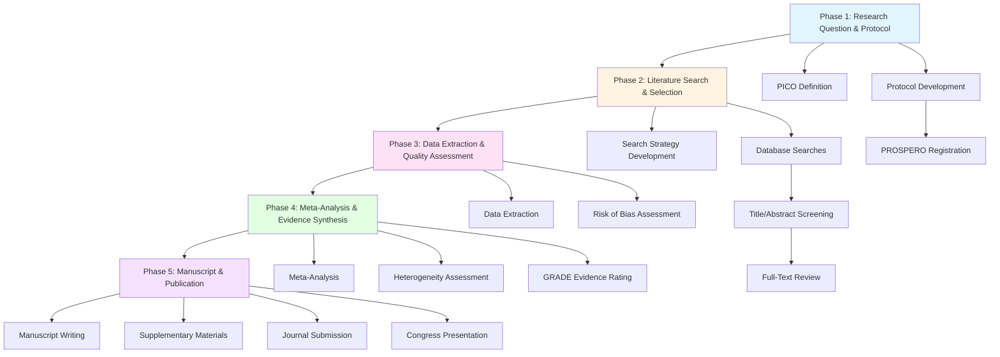

# USE CASE 44: META-ANALYSIS & SYSTEMATIC REVIEW

## **UC_EG_009: Meta-Analysis & Systematic Review for Evidence Generation**

**Part of EVIDENCE™ Framework - Evidence Value & Intelligence Development & Excellence in Natural Clinical Evidence**

---

## DOCUMENT CONTROL

| Attribute | Details |
|-----------|---------|
| **Use Case ID** | UC_EG_009 |
| **Version** | 1.0 |
| **Last Updated** | October 11, 2025 |
| **Document Owner** | Evidence Generation & Medical Affairs Team |
| **Target Users** | Chief Medical Officers, Medical Directors, HEOR Directors, Clinical Scientists, Medical Writers |
| **Estimated Time** | 12-16 weeks (complete workflow) |
| **Complexity** | ADVANCED |
| **Regulatory Framework** | PRISMA 2020, Cochrane Handbook, GRADE, AMSTAR 2, FDA Guidance on Systematic Reviews |
| **Prerequisites** | Research question (PICO), access to literature databases, statistical software (R/RevMan/Stata) |

---

## TABLE OF CONTENTS

1. [Executive Summary](#1-executive-summary)
2. [Problem Statement & Context](#2-problem-statement--context)
3. [Persona Definitions](#3-persona-definitions)
4. [Complete Workflow Overview](#4-complete-workflow-overview)
5. [Detailed Step-by-Step Prompts](#5-detailed-step-by-step-prompts)
6. [Complete Prompt Suite](#6-complete-prompt-suite)
7. [Quality Assurance Framework](#7-quality-assurance-framework)
8. [Evidence Standards & Guidelines](#8-evidence-standards--guidelines)
9. [Templates & Tools](#9-templates--tools)
10. [Integration with Other Systems](#10-integration-with-other-systems)
11. [References & Resources](#11-references--resources)

---

## 1. EXECUTIVE SUMMARY

### 1.1 Use Case Purpose

**Meta-Analysis & Systematic Review (MA-SR)** is the rigorous, transparent, and reproducible synthesis of all available evidence on a specific research question, combining results from multiple studies to generate more precise estimates of treatment effects, safety profiles, and clinical outcomes. This use case provides a comprehensive, prompt-driven workflow for:

- **Protocol Development**: Creating PRISMA-compliant systematic review protocols registered in PROSPERO
- **Comprehensive Literature Search**: Systematic identification of all relevant studies across multiple databases
- **Study Selection & Data Extraction**: Rigorous screening, quality assessment, and data synthesis
- **Meta-Analysis**: Quantitative pooling of effect estimates using fixed or random-effects models
- **Evidence Quality Assessment**: GRADE framework for rating certainty of evidence
- **Publication & Dissemination**: High-impact journal publication and evidence translation

### 1.2 Business Impact

**The Problem**:
Life sciences companies face three critical evidence gaps that meta-analyses uniquely address:

1. **Fragmented Evidence Base**: Individual trials are often underpowered or show conflicting results; systematic review provides the "totality of evidence"
2. **Payer & Regulatory Skepticism**: Single-study claims lack credibility; meta-analysis demonstrates consistency across studies and populations
3. **Competitive Positioning**: Absence of systematic evidence synthesis allows competitors to claim "best-in-class" without scrutiny

**Without Systematic Reviews & Meta-Analyses**:
- **Weak Evidence for Claims**: Marketing claims based on cherry-picked studies rather than comprehensive evidence
- **Formulary Challenges**: Payers dismiss evidence as incomplete or biased; P&T committees require systematic evidence
- **HTA Failures**: NICE, CADTH, ICER routinely conduct their own systematic reviews; company-sponsored reviews pre-empt criticism
- **Regulatory Gaps**: FDA and EMA increasingly expect systematic reviews for benefit-risk assessments and label claims
- **Academic Credibility**: Without peer-reviewed meta-analyses, KOLs lack confidence in evidence base

**The Solution - Systematic Meta-Analysis**:
- **Comprehensive Evidence**: Identifies ALL relevant studies, preventing selection bias and demonstrating evidence completeness
- **Increased Statistical Power**: Pooling studies increases sample size and precision of effect estimates
- **Subgroup & Sensitivity Analysis**: Explores heterogeneity, identifies optimal patient populations, and tests robustness of findings
- **Evidence Quality Assessment**: GRADE ratings provide transparency about certainty of evidence
- **Publication Impact**: High-impact journal publications (Lancet, JAMA, BMJ) establish evidence leadership
- **Regulatory & Payer Credibility**: Gold-standard evidence that withstands scrutiny from regulators, HTA bodies, and payers

### 1.3 Success Metrics

**Process Metrics**:
- Protocol registered in PROSPERO within 2 weeks
- Literature search identifies >95% of relevant studies (validated by independent search)
- Inter-rater agreement on study selection >90% (Cohen's kappa >0.8)
- Meta-analysis completed within 12-16 weeks from protocol registration

**Quality Metrics**:
- PRISMA 2020 checklist: 100% compliance (all 27 items)
- AMSTAR 2 quality assessment: Rated "high" or "moderate" quality
- Risk of bias assessment: Completed for 100% of included studies
- GRADE assessment: Transparent rating of evidence certainty for all outcomes

**Impact Metrics**:
- Publication in Tier 1 journal (Impact Factor >10) within 12 months
- Cited in clinical guidelines within 24 months
- Referenced in HTA submissions (NICE, CADTH, ICER)
- Cited in competitor product labeling reviews (demonstrates evidence gap for competitors)
- >100 citations within 2 years

### 1.4 Key Deliverables

| Deliverable | Description | Timeline |
|-------------|-------------|----------|
| **PRISMA-P Protocol** | Registered protocol specifying methods a priori | Week 2 |
| **Search Strategy Documentation** | Complete search strings for all databases | Week 3 |
| **PRISMA Flow Diagram** | Visual summary of study selection | Week 8 |
| **Risk of Bias Assessment** | Quality assessment for all studies | Week 9 |
| **Forest Plots** | Visual display of meta-analysis results | Week 11 |
| **GRADE Evidence Tables** | Summary of findings with certainty ratings | Week 12 |
| **Full Manuscript** | Journal-ready systematic review paper | Week 16 |
| **Supplementary Materials** | Search strategies, data extraction, funnel plots | Week 16 |

---

## 2. PROBLEM STATEMENT & CONTEXT

### 2.1 Industry Context

**The Evidence Landscape**:

In pharmaceutical, biologics, digital therapeutics (DTx), and medical device markets, **evidence quality and comprehensiveness** increasingly determine commercial success. Payers, regulators, and health technology assessment (HTA) bodies demand:

1. **Systematic Evidence Synthesis**: Not cherry-picked studies, but a comprehensive, reproducible assessment of ALL evidence
2. **Transparency & Reproducibility**: Pre-registered protocols, explicit methods, and public data sharing
3. **Comparative Effectiveness**: Direct and indirect comparisons to all relevant alternatives
4. **Evidence Certainty Assessment**: GRADE framework to communicate confidence in estimates
5. **Subgroup Analysis**: Evidence for optimal patient populations (personalized medicine)

**Current Evidence Challenges**:

| Challenge | Impact | Meta-Analysis Solution |
|-----------|--------|------------------------|
| **Underpowered Individual Trials** | Inconclusive results; Type II errors | Pooling increases statistical power |
| **Conflicting Study Results** | Uncertainty about true effect size | Meta-analysis resolves heterogeneity |
| **Publication Bias** | Positive trials published; negative trials hidden | Comprehensive search + funnel plots detect bias |
| **Fragmented Evidence** | Scattered across journals, databases, gray literature | Systematic review consolidates evidence |
| **Payer Skepticism** | "Show me ALL the data, not just your trial" | PRISMA-compliant review demonstrates completeness |
| **Competitor Claims** | "Best-in-class" based on selective evidence | Network meta-analysis provides head-to-head comparisons |
| **HTA Body Requirements** | NICE, CADTH conduct own reviews if missing | Company-sponsored review pre-empts HTA criticism |

### 2.2 Regulatory & Payer Drivers

**FDA Guidance**:
- **FDA Guidance for Industry**: "Systematic Review in Support of Safety and Effectiveness in Medical Device Submissions" (December 2019)
- Increasing expectation for systematic evidence synthesis in benefit-risk assessments
- Meta-analyses support label claims (e.g., "demonstrated consistent efficacy across 12 RCTs")

**EMA Requirements**:
- EMA Guidelines on Clinical Investigation require systematic literature review for orphan drugs
- Benefit-risk assessments must consider "totality of evidence" from systematic reviews

**Payer & HTA Body Standards**:
- **NICE (UK)**: Requires systematic review and network meta-analysis (NMA) for all technology appraisals
- **CADTH (Canada)**: Conducts independent systematic reviews; company submissions must include comprehensive SLR
- **ICER (US)**: Base case economic models informed by systematic reviews and network meta-analyses
- **AMCP Format Dossiers**: Section 2 (Clinical Efficacy/Effectiveness) requires systematic evidence synthesis

### 2.3 Strategic Use Cases

**When to Conduct Meta-Analysis & Systematic Review**:

| Scenario | Rationale | Example |
|----------|-----------|---------|
| **New Product Launch** | Demonstrate superiority or non-inferiority vs. standard of care | Pharma company synthesizes evidence for new oncology drug vs. 5 competitors |
| **Label Expansion** | Support new indication with systematic evidence | Digital therapeutic for depression synthesizes 20 CBT trials |
| **Post-Market Surveillance** | Aggregate long-term safety data across trials | Biologic aggregates 10-year safety data from 15 RCTs |
| **Guideline Development** | KOL-led meta-analysis influences treatment guidelines | Academic-industry collaboration for diabetes treatment guideline |
| **Payer Evidence Package** | Comprehensive evidence for P&T committee review | Value dossier includes systematic review of comparative effectiveness |
| **HTA Submission** | Pre-empt HTA body's own systematic review | NICE submission includes company-conducted NMA |
| **Competitive Positioning** | Demonstrate evidence superiority over competitors | "Our product has 3X more RCTs than leading competitor" |
| **Real-World Evidence (RWE) Synthesis** | Pool observational studies for effectiveness | Aggregate 50 observational studies on real-world effectiveness |

### 2.4 Relationship to Other Use Cases

**UC_EG_009 Relationship Map**:

```
UC_EG_009 (Meta-Analysis & Systematic Review) is INFORMED BY:
├── UC_CD_001 (Clinical Endpoint Selection) - Defines outcomes for meta-analysis
├── UC_EG_001 (RWE Study Design) - Observational studies may be included in review
├── UC_EG_002 (Observational Data Analysis) - Provides data for RWE synthesis
└── UC_EG_005 (Publication Strategy) - Meta-analysis is key publication type

UC_EG_009 INFORMS:
├── UC_MA_003 (Value Dossier Development) - Systematic review populates evidence sections
├── UC_MA_007 (Comparative Effectiveness) - Meta-analysis provides comparative effect sizes
├── UC_MA_009 (HTA Submissions) - Systematic review required for NICE, CADTH, ICER
├── UC_EG_010 (Evidence Synthesis for HTAs) - Direct input to HTA dossiers
└── UC_RA_002 (Benefit-Risk Assessment) - Meta-analysis quantifies benefits and risks
```

**Dependencies**:
- **Requires UC_CD_001**: Clinical endpoints analyzed in meta-analysis must be clinically meaningful and validated
- **Complements UC_MA_007**: Meta-analysis provides quantitative comparative effectiveness estimates
- **Essential for UC_MA_009**: NICE, CADTH, and ICER mandate systematic reviews in HTA submissions

### 2.5 Regulatory and Compliance Considerations

**PRISMA 2020 (Preferred Reporting Items for Systematic Reviews and Meta-Analyses)**:
- **27-item checklist** for transparent reporting of systematic reviews
- Mandatory for publication in high-impact journals (Lancet, JAMA, BMJ, Cochrane Library)
- [PRISMA 2020 Statement](http://www.prisma-statement.org/)

**Cochrane Handbook for Systematic Reviews of Interventions**:
- Gold-standard methodology for conducting systematic reviews
- Covers risk of bias assessment, meta-analysis methods, GRADE
- [Cochrane Handbook v6.4](https://training.cochrane.org/handbook)

**GRADE (Grading of Recommendations Assessment, Development and Evaluation)**:
- Framework for rating certainty of evidence (high, moderate, low, very low)
- Required by NICE, WHO, UpToDate, and most guideline developers
- [GRADE Working Group](https://www.gradeworkinggroup.org/)

**AMSTAR 2 (A MeaSurement Tool to Assess systematic Reviews)**:
- 16-item critical appraisal tool for systematic reviews
- Used by HTA bodies to assess quality of company-sponsored reviews
- Target: "High" or "Moderate" quality rating

**PROSPERO Registration**:
- International database of prospectively registered systematic review protocols
- Registration demonstrates a priori methods (reduces risk of bias)
- [PROSPERO](https://www.crd.york.ac.uk/prospero/)

**FDA Guidance on Systematic Reviews (2019)**:
- Applies to medical device submissions but increasingly expected for drugs/biologics
- Emphasizes PICO framework, comprehensive search, and risk of bias assessment
- [FDA Guidance](https://www.fda.gov/regulatory-information/search-fda-guidance-documents/systematic-review-support-safety-and-effectiveness-medical-device-submissions)

---

## 3. PERSONA DEFINITIONS

This use case requires collaboration across five key personas, each bringing specialized expertise to ensure rigorous, reproducible, and high-impact systematic reviews and meta-analyses.

### 3.1 P23_CMO: Chief Medical Officer (CMO)

**Role in UC_EG_009**: Strategic lead; defines research question; ensures clinical relevance; engages KOLs; drives publication strategy

**Responsibilities**:
- Lead Phase 1 (Research Question & Protocol Development)
- Define PICO (Population, Intervention, Comparator, Outcomes) framework
- Ensure clinical meaningfulness of research question and outcomes
- Engage external KOLs and academic collaborators for credibility
- Oversee manuscript development and author team
- Present findings at major medical conferences (ASH, ASCO, ACC, AHA)
- Lead guideline engagement strategy

**Required Expertise**:
- Deep clinical knowledge of therapeutic area
- Understanding of evidence hierarchy and systematic review methodology
- Publication strategy and journal selection (Lancet, JAMA, BMJ, NEJM)
- KOL network and academic partnerships
- Medical writing and manuscript development

**Decision Authority**:
- Approve research question and PICO framework
- Approve protocol before PROSPERO registration
- Select target journal and author team
- Make go/no-go decisions on publication submission
- Authorize KOL honoraria and author payments

**Prompt Engagement**:
- Leads Steps 1.1, 1.2, 5.1, 5.2 (PICO Definition, Protocol Development, Manuscript Writing, Publication Strategy)
- Reviews and approves all deliverables before external dissemination

---

### 3.2 P24_HEOR_SR: HEOR Systematic Review Lead

**Role in UC_EG_009**: Technical lead for systematic review methodology; conducts literature search; performs meta-analysis

**Responsibilities**:
- Lead Phase 2 (Literature Search & Study Selection)
- Lead Phase 3 (Data Extraction & Quality Assessment)
- Lead Phase 4 (Meta-Analysis & Evidence Synthesis)
- Develop comprehensive search strategies for MEDLINE, Embase, Cochrane
- Conduct title/abstract screening and full-text review
- Perform risk of bias assessment (Cochrane RoB 2, ROBINS-I)
- Conduct meta-analysis using R (metafor, meta), RevMan, or Stata
- Generate forest plots, funnel plots, and GRADE evidence tables
- Write methods and results sections of manuscript

**Required Expertise**:
- Systematic review methodology (PRISMA, Cochrane Handbook)
- Literature search strategies and Boolean logic
- Study quality assessment tools (Cochrane RoB 2, ROBINS-I, GRADE)
- Meta-analysis methods (fixed vs. random effects, I² heterogeneity)
- Statistical software: R (metafor, meta), RevMan, Stata, or Comprehensive Meta-Analysis (CMA)
- Meta-regression and subgroup analysis
- Publication bias detection (funnel plots, Egger's test, trim-and-fill)

**Decision Authority**:
- Approve final search strategy and databases
- Adjudicate conflicts in study selection
- Select meta-analysis model (fixed vs. random effects)
- Determine subgroup analyses and sensitivity analyses
- Approve GRADE assessments

**Prompt Engagement**:
- Leads Steps 2.1, 2.2, 3.1, 3.2, 4.1, 4.2, 4.3 (Search, Screening, Data Extraction, Quality Assessment, Meta-Analysis)
- Collaborates with P23_CMO on manuscript methods and results

---

### 3.3 P25_MEDWRITER: Senior Medical Writer

**Role in UC_EG_009**: Manuscript development; PRISMA compliance; journal submission management

**Responsibilities**:
- Lead Phase 5 (Manuscript Development & Publication)
- Draft complete manuscript following PRISMA 2020 guidelines
- Create PRISMA flow diagram, forest plots, and summary tables
- Ensure compliance with journal author guidelines (word count, formatting, references)
- Prepare supplementary materials (search strategies, risk of bias tables, data extraction forms)
- Coordinate author review and incorporation of feedback
- Manage journal submission and revision process
- Respond to peer reviewer comments

**Required Expertise**:
- Medical writing for high-impact journals (Lancet, JAMA, BMJ)
- PRISMA 2020 reporting guidelines
- ICMJE authorship criteria and Good Publication Practice (GPP3)
- Systematic review terminology and methodology
- Statistical results interpretation and visualization
- Reference management (EndNote, Zotero, Mendeley)
- Journal submission systems (Editorial Manager, ScholarOne)

**Decision Authority**:
- Select journal based on impact factor, scope, and acceptance rates
- Manage author order and contributions (CRediT taxonomy)
- Adjudicate author feedback and incorporation
- Approve final manuscript for submission

**Prompt Engagement**:
- Leads Steps 5.1, 5.2, 5.3 (Manuscript Writing, Supplementary Materials, Journal Submission)
- Collaborates with P23_CMO and P24_HEOR_SR on manuscript development

---

### 3.4 P26_MEDAFFAIRS: Medical Affairs Director

**Role in UC_EG_009**: KOL engagement; congress presentation; evidence dissemination

**Responsibilities**:
- Engage external KOLs as co-authors or steering committee members
- Present findings at major medical congresses (oral presentation, poster)
- Develop congress materials (slides, posters, leave-behinds)
- Organize advisory boards to discuss findings
- Train Medical Science Liaisons (MSLs) on systematic review results
- Disseminate findings to payers, P&T committees, and HTA bodies
- Monitor citations and integration into clinical guidelines

**Required Expertise**:
- KOL identification and engagement
- Congress strategy and abstract submission
- Presentation skills (oral and poster)
- Medical affairs strategy and evidence dissemination
- MSL training and field support
- Payer and HTA body engagement

**Decision Authority**:
- Select KOLs for author team and advisory boards
- Choose target congresses for presentation
- Approve MSL training materials and payer evidence packages
- Authorize KOL honoraria and speaking fees

**Prompt Engagement**:
- Leads Step 5.4 (Evidence Dissemination & Congress Strategy)
- Collaborates with P23_CMO on KOL engagement and publication strategy

---

### 3.5 P27_BIOSTAT: Senior Biostatistician

**Role in UC_EG_009**: Statistical methods selection; meta-analysis execution; sensitivity analysis

**Responsibilities**:
- Advise on meta-analysis statistical methods (fixed vs. random effects)
- Conduct heterogeneity assessment (I², τ², Q-statistic)
- Perform subgroup and meta-regression analyses
- Assess publication bias (funnel plots, Egger's test, trim-and-fill)
- Conduct sensitivity analyses (leave-one-out, fixed vs. random effects)
- Review statistical results sections for accuracy
- Support responses to peer reviewer statistical comments

**Required Expertise**:
- Meta-analysis statistical theory (DerSimonian-Laird, inverse variance weighting, Hartung-Knapp adjustment)
- Heterogeneity assessment and management
- Publication bias detection and adjustment
- Meta-regression (e.g., relationship between dose and effect size)
- Software: R (metafor, meta, netmeta), RevMan, Stata, or SAS
- Bayesian meta-analysis for network meta-analysis (NMA)

**Decision Authority**:
- Approve meta-analysis statistical model
- Determine heterogeneity management approach (subgroup analysis, meta-regression, stratification)
- Approve sensitivity analyses
- Validate statistical results before manuscript submission

**Prompt Engagement**:
- Leads Steps 4.1, 4.2, 4.3 (Meta-Analysis, Heterogeneity Assessment, Sensitivity Analysis)
- Collaborates with P24_HEOR_SR on methods and results interpretation

---

## 4. COMPLETE WORKFLOW OVERVIEW

### 4.1 Five-Phase Approach

The UC_EG_009 workflow follows a **Five-Phase Sequential Approach** aligned with PRISMA 2020 and Cochrane Handbook best practices:

```
Phase 1: Research Question & Protocol Development (Weeks 1-2)
│
├─> Step 1.1: PICO Framework Definition (P23_CMO)
├─> Step 1.2: Protocol Development & PROSPERO Registration (P23_CMO, P24_HEOR_SR)
│
Phase 2: Literature Search & Study Selection (Weeks 3-8)
│
├─> Step 2.1: Comprehensive Literature Search (P24_HEOR_SR)
├─> Step 2.2: Study Screening & Selection (P24_HEOR_SR)
│
Phase 3: Data Extraction & Quality Assessment (Weeks 9-10)
│
├─> Step 3.1: Data Extraction (P24_HEOR_SR)
├─> Step 3.2: Risk of Bias Assessment (P24_HEOR_SR, P27_BIOSTAT)
│
Phase 4: Meta-Analysis & Evidence Synthesis (Weeks 11-12)
│
├─> Step 4.1: Meta-Analysis Execution (P24_HEOR_SR, P27_BIOSTAT)
├─> Step 4.2: Heterogeneity Assessment & Subgroup Analysis (P27_BIOSTAT)
├─> Step 4.3: GRADE Evidence Assessment (P24_HEOR_SR, P23_CMO)
│
Phase 5: Manuscript Development & Publication (Weeks 13-16)
│
├─> Step 5.1: Manuscript Writing (P25_MEDWRITER, P23_CMO, P24_HEOR_SR)
├─> Step 5.2: Supplementary Materials Preparation (P25_MEDWRITER)
├─> Step 5.3: Journal Submission & Peer Review Response (P25_MEDWRITER)
└─> Step 5.4: Evidence Dissemination & Congress Strategy (P26_MEDAFFAIRS)
```

### 4.2 Workflow Diagram



### 4.3 Timeline & Resource Allocation

| Phase | Duration | FTE | Key Deliverables |
|-------|----------|-----|------------------|
| **Phase 1: Research Question & Protocol** | Weeks 1-2 | 0.5 FTE (P23_CMO, P24_HEOR_SR) | PICO framework, Protocol, PROSPERO registration |
| **Phase 2: Literature Search & Selection** | Weeks 3-8 | 1.0 FTE (P24_HEOR_SR + 2 screeners) | Search strategy, PRISMA flow diagram, included studies list |
| **Phase 3: Data Extraction & Quality** | Weeks 9-10 | 1.0 FTE (P24_HEOR_SR + extractors) | Data extraction tables, Risk of bias assessment |
| **Phase 4: Meta-Analysis & Synthesis** | Weeks 11-12 | 0.75 FTE (P24_HEOR_SR, P27_BIOSTAT) | Forest plots, Heterogeneity analysis, GRADE tables |
| **Phase 5: Manuscript & Publication** | Weeks 13-16 | 0.75 FTE (P25_MEDWRITER, P23_CMO) | Full manuscript, Supplementary materials, Journal submission |

**Total Timeline**: 16 weeks (4 months) from protocol to manuscript submission  
**Total Effort**: ~60 FTE-days (equivalent to 1 FTE for 3 months)

### 4.4 Budget Considerations

**Internal Costs**:
- Systematic review team (HEOR, biostatistician, medical writer): $80K-120K
- Database access (MEDLINE/Embase via Ovid, Cochrane Library): $5K-10K
- Statistical software licenses (R is free; Stata/RevMan/CMA: $1K-3K)
- KOL author honoraria (if academic co-authors): $10K-30K

**External Costs** (if outsourced):
- Systematic review vendor (Evidera, ICON, EVERSANA): $150K-250K
- Publication support (medical writing agency): $30K-60K
- Open access publication fees (Tier 1 journals): $3K-5K

**Total Budget Range**: $100K-350K depending on internal vs. external resourcing

---

## 5. DETAILED STEP-BY-STEP PROMPTS

### PHASE 1: RESEARCH QUESTION & PROTOCOL DEVELOPMENT (Weeks 1-2)

**Objective**: Define a focused, answerable research question; develop a comprehensive protocol; register in PROSPERO

---

#### **STEP 1.1: PICO Framework Definition** (Week 1)

**Objective**: Define the research question using the PICO (Population, Intervention, Comparator, Outcomes) framework

**Persona**: P23_CMO (Lead), P24_HEOR_SR (Support)

**Prerequisites**:
- Strategic decision to conduct meta-analysis (e.g., for HTA submission, guideline development, publication)
- Preliminary scoping search to confirm sufficient studies exist

**Prompt ID**: `EVIDENCE_METANALYSIS_PICO_ADVANCED_v1.0`

**Process**:

**PROMPT 1.1**: PICO Framework Definition for Systematic Review
```markdown
You are a Chief Medical Officer (CMO) with expertise in evidence-based medicine defining a research question for a systematic review and meta-analysis.

**Strategic Context**:
- Product: {PRODUCT_NAME}
- Therapeutic Area: {DISEASE_INDICATION}
- Strategic Purpose: {e.g., support HTA submission, guideline development, competitive positioning}
- Target Audience: {e.g., NICE, CADTH, ICER, clinical guideline committee, peer-review journal}

**Background**:
{PROVIDE_BRIEF_CLINICAL_AND_MARKET_CONTEXT}

**Instructions**:
Define a clear, focused, and answerable research question using the PICO framework that will guide the systematic review and meta-analysis.

---

## SECTION 1: RESEARCH QUESTION

**Overarching Research Question**:
{Formulate a single, clear research question}

**Example Format**: 
"What is the comparative efficacy and safety of [Intervention] versus [Comparator(s)] for [Population] with [Condition]?"

---

## SECTION 2: PICO FRAMEWORK

### 2.1 Population (P)

**2.1.1 Inclusion Criteria**:
- Disease/Condition: {specific diagnosis, disease stage, severity}
- Age: {e.g., adults ≥18 years, pediatrics <18 years, elderly ≥65 years}
- Setting: {e.g., inpatient, outpatient, primary care, specialty care}
- Prior Treatment: {e.g., treatment-naïve, refractory, relapsed, second-line}
- Key Characteristics: {e.g., biomarker status, comorbidities}

**2.1.2 Exclusion Criteria**:
- Populations NOT of interest: {e.g., wrong disease stage, pediatrics if adult indication}

**2.1.3 Rationale for Population Definition**:
{Why this population? Aligned with product label? HTA scope? Clinical guidelines?}

---

### 2.2 Intervention (I)

**2.2.1 Intervention of Interest**:
- Product: {product name, generic name}
- Dose/Regimen: {specific dosing if relevant, or "any dose" for pooled analysis}
- Route of Administration: {oral, IV, subcutaneous, digital app, etc.}
- Duration: {acute, chronic, minimum treatment duration}

**2.2.2 Intervention Rationale**:
{Why focus on this intervention? Regulatory approval status? Market positioning?}

---

### 2.3 Comparator (C)

**2.3.1 Comparators of Interest**:
- List all relevant comparators:
  1. {Comparator 1 (e.g., placebo)}
  2. {Comparator 2 (e.g., standard of care drug A)}
  3. {Comparator 3 (e.g., competitor drug B)}
  4. {Comparator 4 (e.g., non-pharmacological intervention)}

**2.3.2 Comparator Selection Rationale**:
- Placebo: {Include if relevant for efficacy assessment}
- Active Comparators: {Based on clinical guidelines, payer formulary, HTA scope}
- No Treatment / Usual Care: {Include if relevant for real-world effectiveness}

**2.3.3 Comparator Exclusions**:
{Any treatments explicitly excluded? Why?}

---

### 2.4 Outcomes (O)

**2.4.1 Primary Outcomes**:
- **Efficacy Outcome(s)**:
  1. {Primary efficacy outcome (e.g., progression-free survival, remission rate, symptom score change)}
  2. {Time point for measurement (e.g., 12 weeks, 6 months, 2 years)}

**2.4.2 Secondary Outcomes**:
- **Efficacy Outcomes**:
  1. {Secondary efficacy outcome 1}
  2. {Secondary efficacy outcome 2}
  3. {Quality of life measure (e.g., EQ-5D, SF-36)}

- **Safety Outcomes**:
  1. {Adverse events (AEs) - any grade}
  2. {Serious adverse events (SAEs)}
  3. {Discontinuations due to AEs}
  4. {Specific AEs of interest (e.g., cardiovascular events, infections)}

- **Other Outcomes** (if applicable):
  1. {Healthcare utilization (hospitalizations, ER visits)}
  2. {Patient-reported outcomes (PROs)}
  3. {Economic outcomes (costs, cost-effectiveness)}

**2.4.3 Outcome Measurement Requirements**:
- Validated instruments required? {Yes/No - specify which instruments}
- Minimum follow-up duration? {e.g., ≥12 weeks for chronic disease}
- Outcome definition consistency? {How will heterogeneous outcome definitions be handled?}

**2.4.4 Outcome Prioritization**:
- **Critical for Decision-Making**: {List outcomes most important for HTA/guideline/payer}
- **Important but Not Critical**: {List supporting outcomes}
- **Of Limited Importance**: {List outcomes included for completeness}

---

## SECTION 3: STUDY DESIGN ELIGIBILITY

**3.1 Study Designs to Include**:
- [ ] Randomized Controlled Trials (RCTs)
- [ ] Non-Randomized Controlled Trials
- [ ] Observational Studies (cohort, case-control)
- [ ] Single-Arm Studies (if RCTs unavailable)

**Rationale**: {Why these study designs? RCTs only for efficacy? Include observational for safety?}

**3.2 Study Designs to Exclude**:
- [ ] Case Reports / Case Series
- [ ] Narrative Reviews / Editorials
- [ ] Conference Abstracts (unless unpublished data from completed trials)

**3.3 Minimum Study Quality Criteria**:
{Any a priori quality thresholds? E.g., "Only studies with low or moderate risk of bias will be pooled"}

---

## SECTION 4: TIMEFRAME & LANGUAGE

**4.1 Publication Date Range**:
- Start Date: {e.g., database inception, last 10 years, since regulatory approval of comparator}
- End Date: {search date - typically "present"}
- Rationale: {Why this date range?}

**4.2 Language Restrictions**:
- Languages Included: {e.g., English only, English + major European languages, no restriction}
- Rationale: {Resource constraints? Minimize translation bias?}

---

## SECTION 5: KEY RESEARCH QUESTIONS (KRQs)

Based on the PICO, define specific key research questions that the systematic review will answer:

**KRQ 1: Comparative Efficacy**:
"What is the comparative efficacy of {Intervention} versus {Comparators} for {Primary Outcome} in {Population}?"

**KRQ 2: Comparative Safety**:
"What is the comparative safety profile (AEs, SAEs) of {Intervention} versus {Comparators} in {Population}?"

**KRQ 3: Subgroup Effects** (if applicable):
"Does the efficacy or safety of {Intervention} differ across subgroups (e.g., disease severity, age, biomarker status)?"

**KRQ 4: Dose-Response** (if applicable):
"Is there a dose-response relationship for {Intervention} on {Primary Outcome}?"

---

## SECTION 6: STAKEHOLDER ALIGNMENT

**6.1 Target Audience Needs**:
- **Regulatory (FDA/EMA)**: {Does this PICO align with regulatory questions?}
- **HTA Bodies (NICE/CADTH/ICER)**: {Does PICO match HTA scope/decision problem?}
- **Payers**: {Does PICO address P&T committee evidence needs?}
- **Guideline Committees**: {Does PICO align with guideline update needs?}
- **Academic/KOLs**: {Is this a clinically meaningful question for publication?}

**6.2 Potential Limitations & Tradeoffs**:
- {Broad vs. narrow population definition?}
- {Many comparators (comprehensive) vs. few (focused)?}
- {All outcomes vs. critical outcomes only?}

---

## OUTPUT DELIVERABLES:
- PICO framework document (3-5 pages)
- Research question(s) clearly stated
- Stakeholder alignment check
- Ready for protocol development (Step 1.2)

---

**CRITICAL REQUIREMENTS**:
- PICO must be specific and answerable (avoid overly broad questions)
- Aligned with strategic objectives (HTA, guideline, publication)
- Outcomes must be clinically meaningful and measurable
- Comparators must reflect real-world treatment landscape
- Population must match product label and regulatory approvals
```

**Deliverable**: PICO Framework Document (3-5 pages)

**Quality Check**:
✅ Research question is specific, answerable, and clinically meaningful  
✅ Population aligned with product label and target patient population  
✅ Comparators reflect clinical practice and payer/HTA requirements  
✅ Outcomes are validated, clinically important, and measurable  
✅ PICO reviewed and approved by P23_CMO and P24_HEOR_SR

---

#### **STEP 1.2: Protocol Development & PROSPERO Registration** (Week 2)

**Objective**: Develop a comprehensive systematic review protocol following PRISMA-P guidelines; register in PROSPERO

**Persona**: P24_HEOR_SR (Lead), P23_CMO (Review), P27_BIOSTAT (Methods Review)

**Prerequisites**:
- PICO framework finalized (Step 1.1)
- Decision on meta-analysis methods (fixed vs. random effects)
- PROSPERO account created

**Prompt ID**: `EVIDENCE_METANALYSIS_PROTOCOL_ADVANCED_v1.0`

**Process**:

**PROMPT 1.2**: Systematic Review Protocol Development (PRISMA-P)
```markdown
You are a Senior HEOR Systematic Review Specialist developing a comprehensive systematic review protocol following PRISMA-P (Preferred Reporting Items for Systematic Review and Meta-Analysis Protocols) guidelines.

**PICO Framework** (from Step 1.1):
{INSERT_COMPLETE_PICO_FRAMEWORK}

**Strategic Purpose**:
- Purpose: {support HTA submission, guideline development, journal publication}
- Target Audience: {NICE, CADTH, ICER, journal (specify), clinical guideline committee}
- Timeline: {target completion date}

**Instructions**:
Develop a complete systematic review protocol that will be registered in PROSPERO (International Prospective Register of Systematic Reviews). The protocol must be comprehensive, reproducible, and aligned with PRISMA-P guidelines.

---

## SYSTEMATIC REVIEW PROTOCOL

### SECTION 1: ADMINISTRATIVE INFORMATION

**1.1 Protocol Title**:
{Formal protocol title following format: "Efficacy and Safety of [Intervention] versus [Comparators] for [Population]: A Systematic Review and Meta-Analysis Protocol"}

**1.2 Review Team**:
- **Lead Investigator**: {Name, Title, Affiliation}
- **Co-Investigators**: {Names, Titles, Affiliations}
- **Systematic Review Specialist**: {Name, Role}
- **Biostatistician**: {Name, Role}
- **Information Specialist/Librarian**: {Name, Role}

**1.3 Funding Source**:
{Sponsor name - be transparent if industry-funded}

**1.4 Conflicts of Interest**:
{Declare all potential conflicts - PROSPERO requires this}

**1.5 PROSPERO Registration**:
- Registration Number: {To be assigned upon submission}
- Registration Date: {Target date}

**1.6 Protocol Version**:
- Version: 1.0
- Date: {Current date}

**1.7 Protocol Amendments**:
{Any amendments will be documented with date, description, and rationale}

---

### SECTION 2: INTRODUCTION & RATIONALE

**2.1 Background**:
{Provide brief clinical and epidemiological context for the disease/condition}

**2.2 Rationale for Review**:
- **Clinical Need**: {Why is this review needed? Evidence gaps? Conflicting studies?}
- **Decision-Making Need**: {How will this review inform clinical practice, guidelines, policy, or market access?}
- **Existing Reviews**: {Are there prior systematic reviews on this topic? If yes, how will this review differ or update?}

**2.3 Objectives**:
{Clearly state the objectives aligned with PICO framework}

Primary Objective: {To assess the comparative efficacy and safety of [Intervention] versus [Comparators] in [Population]}

Secondary Objectives:
- {Objective 2: e.g., to evaluate subgroup effects}
- {Objective 3: e.g., to assess dose-response relationships}

---

### SECTION 3: METHODS

#### 3.1 Eligibility Criteria (PICO Framework)

**3.1.1 Population**:
{Copy from Step 1.1 PICO framework}

**3.1.2 Intervention**:
{Copy from Step 1.1 PICO framework}

**3.1.3 Comparator**:
{Copy from Step 1.1 PICO framework}

**3.1.4 Outcomes**:
{Copy from Step 1.1 PICO framework}

**3.1.5 Study Design**:
{Copy from Step 1.1 PICO framework}

**3.1.6 Timing**:
- Minimum Follow-Up Duration: {e.g., ≥12 weeks for chronic disease}
- Publication Date Range: {e.g., database inception to present}

**3.1.7 Setting**:
{Any restrictions on care setting? e.g., inpatient vs. outpatient}

**3.1.8 Language**:
{e.g., English only, no language restrictions}

---

#### 3.2 Information Sources & Search Strategy

**3.2.1 Electronic Databases**:
- **MEDLINE** (via Ovid or PubMed): {Start date to present}
- **Embase** (via Ovid): {Start date to present}
- **Cochrane Central Register of Controlled Trials (CENTRAL)**: {All records}
- **Web of Science**: {Optional - for citation tracking}
- **Scopus**: {Optional - for broader coverage}

**3.2.2 Clinical Trial Registries**:
- ClinicalTrials.gov (US)
- WHO International Clinical Trials Registry Platform (ICTRP)
- EU Clinical Trials Register

**3.2.3 Gray Literature & Other Sources**:
- Conference abstracts (ASCO, ASH, ACC, AHA, ERS, etc.)
- Regulatory documents (FDA, EMA approval packages)
- HTA reports (NICE, CADTH, ICER)
- Reference lists of included studies (hand-searching)
- Citations of included studies (forward citation tracking via Web of Science)

**3.2.4 Search Strategy Development**:
- Developed by: {Information Specialist / Librarian name}
- Validated by: {Systematic Review Specialist}
- Peer-reviewed using PRESS (Peer Review of Electronic Search Strategies) checklist

**3.2.5 Search Terms**:
The search strategy will use a combination of:
1. **Disease/Condition Terms**: {MeSH terms, keywords for disease}
2. **Intervention Terms**: {MeSH terms, generic/brand names, synonyms}
3. **Comparator Terms**: {MeSH terms for comparators}
4. **Study Design Filters**: {RCT filters, e.g., Cochrane Highly Sensitive Search Strategy}

**Example Search String (MEDLINE)** *(Full search strings in Appendix A)*:
```
(("{disease_terms}" OR "{MeSH_disease}") AND 
 ("{intervention_terms}" OR "{product_name}") AND 
 ("{comparator_terms}") AND 
 ("randomized controlled trial"[Publication Type] OR "randomized"[Title/Abstract]))
```

**3.2.6 Search Updates**:
- Search will be updated immediately before manuscript submission to capture recently published studies

---

#### 3.3 Study Selection Process

**3.3.1 Screening Workflow**:

**Level 1: Title & Abstract Screening**
- Two independent reviewers (R1 and R2) will screen titles and abstracts against eligibility criteria
- Inter-rater agreement will be calculated (Cohen's kappa)
- Conflicts resolved by third reviewer (R3) or discussion
- Liberal inclusion at this stage (when in doubt, include for full-text review)

**Level 2: Full-Text Screening**
- Two independent reviewers will assess full-text articles against eligibility criteria
- Reasons for exclusion will be documented
- Conflicts resolved by discussion or third reviewer adjudication

**3.3.2 Screening Tool**:
- Covidence, DistillerSR, or Excel-based screening form

**3.3.3 PRISMA Flow Diagram**:
- A PRISMA 2020 flow diagram will be created to document the study selection process

---

#### 3.4 Data Extraction

**3.4.1 Data Extraction Form**:
A standardized data extraction form will be piloted on 5-10 studies and refined before full extraction. Data will be extracted independently by two reviewers; discrepancies will be resolved by discussion or third reviewer.

**3.4.2 Data Elements to Extract**:

**Study Characteristics**:
- Study ID (First Author, Year)
- Publication type (peer-reviewed article, abstract, regulatory document)
- Country and study sites
- Study design (RCT phase, observational design)
- Funding source (industry, government, academic)
- Registration number (ClinicalTrials.gov, ISRCTN, etc.)

**Population Characteristics**:
- Total sample size (N randomized, N analyzed)
- Inclusion/exclusion criteria
- Demographics (age, sex, race/ethnicity)
- Disease characteristics (stage, severity, biomarkers)
- Prior treatments
- Comorbidities

**Intervention & Comparator Details**:
- Intervention name, dose, route, frequency, duration
- Comparator name, dose, route, frequency, duration
- Concomitant medications allowed

**Outcomes**:
- Primary endpoint definition and measurement
- Secondary endpoints
- Efficacy outcomes (means, SDs, effect sizes, p-values)
- Safety outcomes (n events, percentages, risk ratios)
- Time points assessed
- Missing data and handling (ITT vs. per-protocol)

**Results**:
- Efficacy results (continuous outcomes: mean difference; binary outcomes: risk ratio, odds ratio)
- Safety results (adverse events, discontinuations)
- Subgroup analyses (if reported)
- Statistical methods used

---

#### 3.5 Risk of Bias Assessment

**3.5.1 Tool for RCTs**:
- **Cochrane Risk of Bias Tool 2 (RoB 2)** for randomized trials

**RoB 2 Domains**:
1. Bias arising from the randomization process
2. Bias due to deviations from intended interventions
3. Bias due to missing outcome data
4. Bias in measurement of the outcome
5. Bias in selection of the reported result

**Risk of Bias Judgment**: Low Risk / Some Concerns / High Risk

**3.5.2 Tool for Observational Studies** (if included):
- **ROBINS-I (Risk Of Bias In Non-randomized Studies - of Interventions)**

**3.5.3 Process**:
- Two independent reviewers will assess risk of bias for each study
- Conflicts will be resolved by discussion or third reviewer
- Risk of bias assessment will be presented in summary tables and risk of bias graphs

---

#### 3.6 Data Synthesis & Meta-Analysis

**3.6.1 Meta-Analysis Approach**:

**Quantitative Synthesis (Meta-Analysis)**:
- If studies are sufficiently homogeneous (clinically and methodologically), meta-analysis will be conducted
- **Statistical Model**: Random-effects model (DerSimonian-Laird method) will be primary approach due to anticipated heterogeneity
  - Fixed-effect model will be used in sensitivity analysis if heterogeneity is low
- **Effect Measures**:
  - Continuous outcomes: Mean Difference (MD) or Standardized Mean Difference (SMD)
  - Binary outcomes: Risk Ratio (RR) or Odds Ratio (OR)
  - Time-to-event outcomes: Hazard Ratio (HR)
- **Confidence Intervals**: 95% CI for all estimates

**Qualitative Synthesis (Narrative Review)**:
- If meta-analysis is not appropriate due to high heterogeneity or insufficient data, narrative synthesis will be conducted

**3.6.2 Software**:
- **R** (metafor package, meta package)
- **RevMan 5.4** (Cochrane Collaboration)
- **Stata** (metan command)

**3.6.3 Handling of Multi-Arm Trials**:
- If a trial has multiple intervention or comparator arms, data will be combined or analyzed separately to avoid double-counting of participants in the control group

**3.6.4 Missing Data**:
- Study authors will be contacted for missing outcome data
- If unavailable, intention-to-treat (ITT) principle will be applied, imputing outcomes where possible
- Sensitivity analyses will assess impact of missing data

---

#### 3.7 Heterogeneity Assessment

**3.7.1 Statistical Heterogeneity**:
- **Chi-squared test (Q-statistic)**: p < 0.10 indicates significant heterogeneity
- **I² statistic**:
  - 0%-40%: might not be important
  - 30%-60%: moderate heterogeneity
  - 50%-90%: substantial heterogeneity
  - 75%-100%: considerable heterogeneity
- **Tau² (τ²)**: Estimate of between-study variance

**3.7.2 Exploration of Heterogeneity**:
If significant heterogeneity (I² > 50%), potential sources will be explored through:
- **Subgroup Analysis**: Stratify by pre-specified characteristics (see Section 3.8)
- **Meta-Regression**: Assess relationship between study-level covariates and effect size (if ≥10 studies)
- **Sensitivity Analysis**: Exclude outlier studies or high risk of bias studies

---

#### 3.8 Subgroup & Sensitivity Analyses

**3.8.1 Pre-Specified Subgroup Analyses**:

*Subgroup analyses will only be conducted if ≥5 studies per subgroup.*

**Clinical Subgroups**:
- Disease severity (mild, moderate, severe)
- Age groups (<65 years, ≥65 years)
- Sex (male, female)
- Biomarker status (if applicable)
- Prior treatment (treatment-naïve vs. experienced)

**Methodological Subgroups**:
- Study design (RCT vs. observational)
- Risk of bias (low vs. high)
- Publication type (peer-reviewed vs. abstract)
- Funding source (industry vs. non-industry)

**3.8.2 Sensitivity Analyses**:
- Exclude high risk of bias studies
- Exclude studies with >20% missing data
- Fixed-effect vs. random-effects model comparison
- Exclude outlier studies (based on visual inspection of forest plot)
- Exclude industry-funded studies

---

#### 3.9 Publication Bias Assessment

**3.9.1 Methods**:
If ≥10 studies are included in a meta-analysis, publication bias will be assessed using:

**Visual Inspection**:
- **Funnel Plot**: Plot of effect size vs. standard error; asymmetry suggests publication bias

**Statistical Tests**:
- **Egger's Regression Test**: Tests for funnel plot asymmetry (p < 0.10 indicates bias)
- **Begg's Rank Correlation Test**: Non-parametric test for asymmetry

**Adjustment Methods** (if bias detected):
- **Trim-and-Fill Method**: Imputes missing studies and recalculates pooled effect size

**3.9.2 Interpretation**:
- If significant publication bias is detected, results will be interpreted with caution, and adjusted estimates will be reported

---

#### 3.10 Certainty of Evidence (GRADE)

**3.10.1 GRADE Framework**:
The certainty of evidence for each outcome will be rated using the **GRADE (Grading of Recommendations Assessment, Development and Evaluation)** approach.

**GRADE Domains**:
1. **Risk of Bias**: Downgrade if serious or very serious limitations in study quality
2. **Inconsistency**: Downgrade if significant unexplained heterogeneity (I² > 50%)
3. **Indirectness**: Downgrade if PICO elements do not directly address the research question
4. **Imprecision**: Downgrade if wide confidence intervals or small sample size
5. **Publication Bias**: Downgrade if evidence of publication bias (funnel plot asymmetry, Egger's test)

**Upgrade Criteria** (for observational studies):
- Large magnitude of effect (RR > 2 or < 0.5)
- Dose-response gradient
- All plausible confounding would reduce observed effect

**GRADE Ratings**:
- **High**: Very confident in the effect estimate
- **Moderate**: Moderately confident; true effect likely close to estimate but could be substantially different
- **Low**: Limited confidence; true effect may be substantially different
- **Very Low**: Very little confidence; true effect likely substantially different

**3.10.2 Summary of Findings (SoF) Table**:
A GRADE Summary of Findings table will be created for critical and important outcomes, showing:
- Number of studies and participants
- Risk of bias assessment
- Effect estimate (MD, RR, HR) with 95% CI
- Certainty of evidence rating (high/moderate/low/very low)

---

### SECTION 4: ETHICS & DISSEMINATION

**4.1 Ethics Approval**:
This is a secondary analysis of published data; ethics approval is not required.

**4.2 Dissemination Plan**:
- **Peer-Reviewed Publication**: Manuscript will be submitted to a high-impact journal (target: Lancet, JAMA, BMJ, or therapeutic area-specific journal)
- **Conference Presentations**: Findings will be presented at major medical conferences (ASCO, ASH, ACC, AHA, etc.)
- **Stakeholder Engagement**: Results will be shared with HTA bodies (NICE, CADTH, ICER), guideline committees, and payers
- **Open Access**: Consideration of open access publication to maximize dissemination

**4.3 Protocol Amendments**:
Any amendments to this protocol will be documented with date, description, and rationale, and updated in PROSPERO.

---

### SECTION 5: TIMELINE

| Phase | Activities | Duration |
|-------|-----------|----------|
| Protocol Development | PICO definition, protocol writing, PROSPERO registration | Weeks 1-2 |
| Literature Search | Database searches, de-duplication | Week 3 |
| Study Selection | Title/abstract screening, full-text review | Weeks 4-8 |
| Data Extraction & Quality Assessment | Data extraction, risk of bias assessment | Weeks 9-10 |
| Data Analysis | Meta-analysis, heterogeneity assessment, GRADE | Weeks 11-12 |
| Manuscript Writing | Draft manuscript, author review | Weeks 13-16 |
| Journal Submission | Submission and peer review response | Weeks 17+ |

**Estimated Completion**: 16 weeks from protocol to manuscript submission

---

## OUTPUT DELIVERABLES:
- Full systematic review protocol (15-20 pages) ready for PROSPERO submission
- PRISMA-P checklist completed
- Search strategy (detailed in Appendix)
- Data extraction form (Appendix)

---

**CRITICAL REQUIREMENTS**:
- Protocol must be registered in PROSPERO before literature search begins
- All methods must be specified a priori to minimize risk of bias
- Search strategy must be comprehensive and reproducible
- Risk of bias and GRADE assessments must follow established frameworks
- Statistical methods must be appropriate for anticipated data types and heterogeneity
```

**Deliverable**: 
1. Systematic Review Protocol (15-20 pages)
2. PROSPERO Registration (online submission)
3. Appendices: Search Strategy, Data Extraction Form, PRISMA-P Checklist

**Quality Check**:
✅ PRISMA-P checklist: 100% complete (all 17 items)  
✅ PICO clearly defined and aligned with Step 1.1  
✅ Search strategy comprehensive (all major databases + gray literature)  
✅ Study selection process rigorous (2 independent reviewers)  
✅ Risk of bias and GRADE methods specified  
✅ Meta-analysis methods appropriate (fixed vs. random effects decided)  
✅ Protocol reviewed by P23_CMO, P24_HEOR_SR, P27_BIOSTAT  
✅ PROSPERO registration submitted and confirmation received

---

### PHASE 2: LITERATURE SEARCH & STUDY SELECTION (Weeks 3-8)

**Objective**: Conduct comprehensive literature search across all relevant databases; screen and select studies meeting eligibility criteria

---

#### **STEP 2.1: Comprehensive Literature Search** (Week 3)

**Objective**: Execute comprehensive, reproducible literature search following protocol; document results per PRISMA

**Persona**: P24_HEOR_SR (Lead), Information Specialist/Librarian (Support)

**Prerequisites**:
- Protocol finalized and registered in PROSPERO (Step 1.2)
- Database access secured (MEDLINE, Embase, Cochrane, ClinicalTrials.gov)
- Search strategy peer-reviewed (PRESS checklist)

**Prompt ID**: `EVIDENCE_METANALYSIS_SEARCH_INTERMEDIATE_v1.0`

**Process**:

**PROMPT 2.1**: Comprehensive Literature Search Execution
```markdown
You are a Systematic Review Information Specialist executing a comprehensive literature search following a PROSPERO-registered protocol.

**Protocol Details** (from Step 1.2):
{INSERT_SEARCH_STRATEGY_FROM_PROTOCOL}

**Databases to Search**:
- MEDLINE (PubMed or Ovid)
- Embase (Ovid)
- Cochrane Central Register of Controlled Trials (CENTRAL)
- ClinicalTrials.gov
- WHO ICTRP
- {Additional databases as per protocol}

**Instructions**:
Execute the literature search per protocol, document all results, and prepare for study screening (Step 2.2).

---

## SECTION 1: DATABASE SEARCHES

### 1.1 MEDLINE Search (via PubMed)

**Search Date**: {Today's date}  
**Date Range**: {e.g., Database inception to present}

**Complete Search String**:
```
#1 "{disease_terms}"[MeSH Terms] OR "{disease_keywords}"[Title/Abstract]
#2 "{intervention_terms}"[MeSH Terms] OR "{product_name}"[Title/Abstract] OR "{generic_name}"[Title/Abstract]
#3 "{comparator_terms}"[MeSH Terms] OR "{comparator_names}"[Title/Abstract]
#4 "randomized controlled trial"[Publication Type] OR "randomized"[Title/Abstract] OR "placebo"[Title/Abstract] OR "randomly"[Title/Abstract] OR "trial"[Title/Abstract]
#5 #1 AND #2 AND #3 AND #4
#6 #5 NOT ("animals"[MeSH Terms] NOT "humans"[MeSH Terms])
#7 #6 AND ("English"[Language])
```

**Results**:
- **Total Records Identified**: {N}
- **Export Format**: RIS or XML for import into reference manager (EndNote, Zotero, Covidence)
- **Export Date**: {Date}

---

### 1.2 Embase Search (via Ovid)

**Search Date**: {Today's date}  
**Date Range**: {e.g., 1974 to present}

**Complete Search String** *(Emtree terms differ from MeSH)*:
```
#1 '{disease_terms}'.mp. OR exp {disease_emtree}/
#2 '{intervention_terms}'.mp. OR exp {drug_emtree}/
#3 '{comparator_terms}'.mp. OR exp {comparator_emtree}/
#4 randomized controlled trial/ OR randomization/ OR placebo/ OR 'randomized'.ti,ab.
#5 #1 AND #2 AND #3 AND #4
#6 #5 AND english.lg.
#7 #6 NOT (exp animal/ NOT exp human/)
```

**Results**:
- **Total Records Identified**: {N}
- **Export**: RIS or XML
- **Overlap with MEDLINE**: {Expect 30-50% overlap}

---

### 1.3 Cochrane CENTRAL Search

**Search Date**: {Today's date}  
**Issue**: {Current Cochrane Library issue}

**Search Strategy**:
```
#1 MeSH descriptor: [{disease_MeSH}] explode all trees
#2 {intervention_keywords}:ti,ab,kw
#3 {comparator_keywords}:ti,ab,kw
#4 #1 AND #2 AND #3
```

**Results**:
- **Total Records Identified**: {N}
- **Export**: RIS

---

### 1.4 ClinicalTrials.gov Search

**Search Date**: {Today's date}

**Search Terms**:
- **Condition**: {disease_name}
- **Intervention/Treatment**: {product_name, comparators}
- **Study Type**: Interventional Studies (Clinical Trials)
- **Results**: Studies With Results

**Results**:
- **Total Studies Identified**: {N}
- **Export**: CSV file with study details (NCT number, title, status, results posted)

**Note**: Manually review registry entries and extract results if available

---

### 1.5 WHO International Clinical Trials Registry Platform (ICTRP)

**Search Date**: {Today's date}

**Search Terms**: {condition AND intervention}

**Results**:
- **Total Studies Identified**: {N}
- **Export**: CSV

---

### 1.6 Conference Abstract Searches

**Target Conferences** (last 3 years):
- American Society of Clinical Oncology (ASCO): {Year-Year}
- American Society of Hematology (ASH): {Year-Year}
- {Additional conferences per therapeutic area}

**Search Method**:
- Manual search of conference abstract archives
- Keyword search for {intervention_name, comparator_names}

**Results**:
- **Total Abstracts Identified**: {N}
- **Export**: PDF or manual data entry into screening tool

---

### 1.7 Regulatory Documents Search

**FDA Approval Packages**:
- Search FDA.gov for {product_name} approval documents
- Extract clinical trial data from FDA review documents

**EMA Assessment Reports**:
- Search EMA.europa.eu for {product_name} EPAR (European Public Assessment Report)

**Results**:
- **Total Documents Identified**: {N}
- **Unique Trials from Regulatory Docs**: {N}

---

### 1.8 Hand-Searching & Citation Tracking

**Reference List Screening**:
- Review reference lists of included studies
- Identify any studies missed in database searches

**Forward Citation Tracking** (via Web of Science):
- Identify studies that cite included studies
- Assess if any relevant studies were missed

**Results**:
- **Additional Studies Identified**: {N}

---

## SECTION 2: DE-DUPLICATION

**2.1 De-Duplication Process**:
- Import all search results into reference management software (EndNote, Zotero, or Covidence)
- Automatic de-duplication based on title, author, year, DOI
- Manual review of potential duplicates

**2.2 Results**:
- **Total Records Before De-Duplication**: {N}
- **Duplicate Records Removed**: {N}
- **Unique Records for Screening**: {N}

---

## SECTION 3: SEARCH DOCUMENTATION

**3.1 PRISMA Flow Diagram (Preliminary)**:

```
Records Identified Through Database Searching:
├── MEDLINE: {N}
├── Embase: {N}
├── Cochrane CENTRAL: {N}
└── Other Databases: {N}
Total: {N}

Additional Records Identified Through Other Sources:
├── ClinicalTrials.gov: {N}
├── Conference Abstracts: {N}
├── Regulatory Documents: {N}
└── Hand-Searching: {N}
Total: {N}

Records After Duplicates Removed: {N}

Records Screened (Title/Abstract): {N}
│
├── Records Excluded: {N}
│
Records Assessed for Eligibility (Full-Text): {N}
│
├── Records Excluded: {N}
│   └── Reasons:
│       ├── Wrong Population: {N}
│       ├── Wrong Intervention: {N}
│       ├── Wrong Comparator: {N}
│       ├── Wrong Outcome: {N}
│       └── Wrong Study Design: {N}
│
Studies Included in Qualitative Synthesis: {N}
│
Studies Included in Quantitative Synthesis (Meta-Analysis): {N}
```

**3.2 Search Documentation Package**:
All search strategies, results, and de-duplication process will be documented and included as supplementary material in the final manuscript.

---

## OUTPUT DELIVERABLES:
- Search results from all databases (exported as RIS/XML/CSV)
- De-duplicated reference library ready for screening
- Search documentation for manuscript supplementary materials
- PRISMA flow diagram (preliminary version)

---

**CRITICAL REQUIREMENTS**:
- Search must be comprehensive (all specified databases searched)
- Search strings must be documented exactly as executed
- De-duplication must be systematic and documented
- Search results must be exported in format compatible with screening tool (Covidence, DistillerSR, Excel)
- Search date documented for all databases (for reproducibility and future updates)
```

**Deliverable**:
1. Consolidated search results (de-duplicated reference library)
2. Search documentation package for supplementary materials
3. Preliminary PRISMA flow diagram

**Quality Check**:
✅ All specified databases searched per protocol  
✅ Search strings documented verbatim  
✅ De-duplication systematic (automatic + manual review)  
✅ Total records identified: {Target >200 for comprehensive review}  
✅ Search documentation complete for reproducibility  
✅ Reference library imported into screening tool (Covidence/DistillerSR)

---

#### **STEP 2.2: Study Screening & Selection** (Weeks 4-8)

**Objective**: Rigorously screen titles/abstracts and full-text articles to select studies meeting eligibility criteria

**Persona**: P24_HEOR_SR (Lead), Two Independent Reviewers (R1, R2), P23_CMO (Adjudicator for Conflicts)

**Prerequisites**:
- De-duplicated reference library from Step 2.1
- Screening tool set up (Covidence, DistillerSR, or Excel)
- Reviewers trained on eligibility criteria

**Prompt ID**: `EVIDENCE_METANALYSIS_SCREENING_INTERMEDIATE_v1.0`

**Process**:

**PROMPT 2.2**: Study Screening & Selection Process
```markdown
You are a Systematic Review Specialist managing the study screening and selection process for a PRISMA-compliant systematic review.

**Eligibility Criteria** (from Protocol, Step 1.2):
{INSERT_PICO_INCLUSION_EXCLUSION_CRITERIA}

**Screening Tool**: {Covidence / DistillerSR / Excel}

**Total Records to Screen**: {N from Step 2.1}

**Instructions**:
Conduct rigorous two-level screening (title/abstract and full-text) following PRISMA guidelines. Document all decisions and reasons for exclusion.

---

## SECTION 1: LEVEL 1 SCREENING (TITLE & ABSTRACT)

### 1.1 Screening Setup

**Reviewers**:
- Reviewer 1 (R1): {Name}
- Reviewer 2 (R2): {Name}
- Adjudicator (R3): {Name, typically P23_CMO or senior team member}

**Screening Approach**:
- **Independent Screening**: R1 and R2 independently screen all titles and abstracts
- **Liberal Inclusion**: When in doubt, include for full-text review
- **Conflict Resolution**: If R1 and R2 disagree, R3 adjudicates or reviewers discuss to reach consensus

### 1.2 Screening Questions

For each record, reviewers answer:
1. **Does the study include the target population (P)?** YES / NO / UNCLEAR
2. **Does the study include the intervention of interest (I)?** YES / NO / UNCLEAR
3. **Does the study include a relevant comparator (C)?** YES / NO / UNCLEAR
4. **Does the study report relevant outcomes (O)?** YES / NO / UNCLEAR
5. **Is the study design eligible (e.g., RCT, observational)?** YES / NO / UNCLEAR

**Decision Rules**:
- If all answers are YES or UNCLEAR → **INCLUDE** for full-text review
- If any answer is clearly NO → **EXCLUDE**
- If uncertain → **INCLUDE** for full-text review (liberal inclusion at this stage)

### 1.3 Inter-Rater Agreement

**Cohen's Kappa Calculation**:
- Calculate inter-rater agreement between R1 and R2
- **Target Kappa**: >0.80 (excellent agreement)
- If Kappa <0.60, reviewers discuss discrepancies and recalibrate

### 1.4 Level 1 Results

| Metric | Count |
|--------|-------|
| Total Records Screened (Title/Abstract) | {N} |
| Records Included by Both Reviewers | {N} |
| Records Excluded by Both Reviewers | {N} |
| Conflicts (Disagreements) | {N} |
| Conflicts Resolved by Adjudication | {N} |
| **Records Advancing to Full-Text Review** | **{N}** |
| Inter-Rater Agreement (Cohen's Kappa) | **{Value}** |

---

## SECTION 2: LEVEL 2 SCREENING (FULL-TEXT REVIEW)

### 2.1 Full-Text Retrieval

**Full-Text Sources**:
- Institutional library access (journal subscriptions)
- PubMed Central (open access articles)
- Interlibrary loan (for unavailable articles)
- Contact authors if full-text unavailable

**Full-Text Retrieval Rate**:
- Target: >95% of identified records
- Document any full-texts not obtainable (will be excluded with reason: "full-text unavailable")

### 2.2 Full-Text Screening Process

**Independent Review**:
- R1 and R2 independently review each full-text article against eligibility criteria
- Use detailed screening form (see template below)

**Screening Form Questions** (for each full-text):

1. **Population (P)**:
   - Does the study population match inclusion criteria? YES / NO
   - If NO, reason: {wrong_disease_stage, wrong_age, other: specify}

2. **Intervention (I)**:
   - Does the study test the intervention of interest? YES / NO
   - If NO, reason: {wrong_dose, wrong_regimen, wrong_product, other: specify}

3. **Comparator (C)**:
   - Does the study include a relevant comparator? YES / NO
   - If NO, reason: {no_comparator, wrong_comparator, other: specify}

4. **Outcomes (O)**:
   - Does the study report relevant outcomes? YES / NO
   - If NO, reason: {wrong_outcomes, outcomes_not_reported, other: specify}

5. **Study Design**:
   - Is the study design eligible? YES / NO
   - If NO, reason: {case_report, narrative_review, editorial, other: specify}

6. **Data Availability**:
   - Is sufficient data available for extraction/meta-analysis? YES / NO
   - If NO, reason: {abstract_only, insufficient_data, results_not_reported}

**Decision**: INCLUDE / EXCLUDE (if excluded, document reason)

### 2.3 Conflict Resolution

**Process**:
- If R1 and R2 disagree on inclusion/exclusion, R3 (P23_CMO) reviews the full-text
- Reviewers discuss and reach consensus
- Final decision documented

### 2.4 Level 2 Results

| Metric | Count |
|--------|-------|
| Full-Texts Retrieved | {N} |
| Full-Texts Not Obtainable | {N} |
| Full-Texts Reviewed | {N} |
| **Full-Texts Included in Review** | **{N}** |
| **Full-Texts Excluded** | **{N}** |

**Reasons for Exclusion** (document frequency for each reason):

| Exclusion Reason | Count |
|------------------|-------|
| Wrong Population | {N} |
| Wrong Intervention | {N} |
| Wrong Comparator | {N} |
| Wrong Outcomes | {N} |
| Wrong Study Design | {N} |
| Insufficient Data | {N} |
| Duplicate Publication (same trial reported multiple times) | {N} |
| Full-Text Unavailable | {N} |
| **Total Excluded** | **{N}** |

---

## SECTION 3: HANDLING OF COMPANION PUBLICATIONS

**Companion Publications**: Multiple publications reporting the same trial (e.g., primary efficacy paper, long-term follow-up, subgroup analysis, safety paper)

**Handling Strategy**:
- Identify all companion publications for each trial
- Extract data from all publications
- Link companion publications to primary trial record
- Count as **one study** in PRISMA flow diagram (to avoid double-counting), but cite all companion publications

**Example**:
- Trial: "FREEDOM Study (NCT12345678)"
  - Publication 1: Main efficacy results (Author et al., 2023, JAMA)
  - Publication 2: Long-term follow-up (Author et al., 2024, JAMA)
  - Publication 3: Subgroup analysis (Author et al., 2024, J Clin Oncol)
  
→ Count as **1 study**, but extract data from all 3 publications

---

## SECTION 4: PRISMA FLOW DIAGRAM (FINAL)

Based on screening results, finalize the PRISMA 2020 flow diagram:

```
┌────────────────────────────────────────────┐
│  Identification of Studies via Databases   │
│  and Registers                             │
└────────────────────────────────────────────┘
        │
        ├─ Records Identified from:
        │  ├─ MEDLINE: {N}
        │  ├─ Embase: {N}
        │  ├─ Cochrane CENTRAL: {N}
        │  ├─ ClinicalTrials.gov: {N}
        │  └─ Other Sources: {N}
        │  Total: {N}
        │
        ├─ Records Removed Before Screening:
        │  ├─ Duplicate Records: {N}
        │  └─ Records Marked as Ineligible: {N}
        │
        ├─ Records Screened (Title/Abstract): {N}
        │  └─ Records Excluded: {N}
        │
        ├─ Reports Sought for Retrieval: {N}
        │  └─ Reports Not Retrieved: {N}
        │
        ├─ Reports Assessed for Eligibility: {N}
        │  └─ Reports Excluded: {N}
        │      ├─ Wrong Population: {N}
        │      ├─ Wrong Intervention: {N}
        │      ├─ Wrong Comparator: {N}
        │      ├─ Wrong Outcome: {N}
        │      ├─ Wrong Study Design: {N}
        │      └─ Other: {N}
        │
        └─ **Studies Included in Review**: **{N}**
           └─ Reports of Included Studies: {N total publications}
```

---

## SECTION 5: DOCUMENTATION

**5.1 Screening Log**:
- Complete list of all screened records with include/exclude decisions
- Export from Covidence/DistillerSR or maintain in Excel

**5.2 Excluded Studies List** (for manuscript appendix):
- List of all studies excluded at full-text stage, with reasons
- Format: First Author, Year, Title, Reason for Exclusion

**5.3 Inter-Rater Agreement Report**:
- Cohen's Kappa for title/abstract screening
- Percentage agreement for full-text screening
- Summary of conflicts and resolution

---

## OUTPUT DELIVERABLES:
- Final list of included studies ({N} studies)
- Completed PRISMA 2020 flow diagram
- Excluded studies list with reasons
- Inter-rater agreement metrics

---

**CRITICAL REQUIREMENTS**:
- Two independent reviewers for all screening stages
- Liberal inclusion at title/abstract stage (when in doubt, include)
- Document reasons for exclusion at full-text stage
- Inter-rater agreement (Cohen's Kappa) >0.80 for title/abstract screening
- PRISMA flow diagram complete per PRISMA 2020 guidelines
- All companion publications identified and linked to primary trial
```

**Deliverable**:
1. Final list of included studies ({Target: 10-50 studies depending on PICO breadth})
2. PRISMA 2020 flow diagram (final version)
3. Excluded studies list with reasons (for appendix)
4. Inter-rater agreement report

**Quality Check**:
✅ Two independent reviewers for all screening  
✅ Cohen's Kappa >0.80 (excellent agreement)  
✅ All conflicts adjudicated and documented  
✅ Reasons for exclusion documented for all excluded full-texts  
✅ PRISMA flow diagram complete per PRISMA 2020  
✅ Companion publications identified and linked

**Expected Output**:
- **Typical Range**: 10-50 studies included (depends on PICO specificity and evidence base maturity)
- **Red Flags**:
  - <5 studies: May not be sufficient for meta-analysis; consider narrative review or broaden inclusion criteria
  - >100 studies: Very broad PICO; consider narrowing or conducting multiple meta-analyses by subgroup

---

### PHASE 3: DATA EXTRACTION & QUALITY ASSESSMENT (Weeks 9-10)

**Objective**: Systematically extract data from included studies; assess risk of bias; prepare data for meta-analysis

---

#### **STEP 3.1: Data Extraction** (Week 9)

**Objective**: Extract all relevant data from included studies using standardized data extraction forms

**Persona**: P24_HEOR_SR (Lead), Data Extractors (2-3 team members)

**Prerequisites**:
- Final list of included studies (Step 2.2)
- Data extraction form finalized and piloted
- Data extraction software or Excel template set up

**Prompt ID**: `EVIDENCE_METANALYSIS_EXTRACTION_INTERMEDIATE_v1.0`

**Process**:

**PROMPT 3.1**: Systematic Data Extraction
```markdown
You are a Systematic Review Data Extraction Specialist extracting data from included studies for meta-analysis.

**Included Studies**: {N studies from Step 2.2}

**Data Extraction Approach**:
- Two independent extractors review each study
- Discrepancies resolved by discussion or third reviewer
- Data extraction form piloted on 5-10 studies before full extraction

**Instructions**:
Extract all relevant data per protocol using the standardized data extraction form below.

---

## DATA EXTRACTION FORM

*(Complete one form per study)*

---

### SECTION 1: STUDY IDENTIFICATION

**Study ID**: {First Author, Year (e.g., Smith 2023)}  
**Full Citation**: {Full reference}  
**Study Registration Number**: {NCT, ISRCTN, EudraCT, etc.}  
**DOI**: {Digital Object Identifier}  
**Extractor Name**: {Name}  
**Extraction Date**: {Date}

**Companion Publications**:
- Are there additional publications from this trial? YES / NO
- If YES, list: {Author, Year, Title, DOI}

---

### SECTION 2: STUDY CHARACTERISTICS

**2.1 Study Design**:
- Study Type: [ ] RCT [ ] Non-randomized trial [ ] Cohort [ ] Case-control [ ] Other: {specify}
- Phase (if RCT): [ ] Phase I [ ] Phase II [ ] Phase III [ ] Phase IV
- Blinding: [ ] Double-blind [ ] Single-blind [ ] Open-label
- Randomization Method: {e.g., block randomization, stratified randomization, unclear}
- Allocation Concealment: [ ] Adequate [ ] Inadequate [ ] Unclear

**2.2 Study Setting**:
- Country/Countries: {List}
- Number of Sites: {N}
- Setting: [ ] Hospital [ ] Outpatient clinic [ ] Primary care [ ] Community [ ] Mixed

**2.3 Study Duration**:
- Recruitment Period: {Start date - End date}
- Treatment Duration: {weeks/months}
- Follow-Up Duration: {weeks/months}
- Total Study Duration: {months}

**2.4 Funding Source**:
- Funding: [ ] Industry [ ] Government [ ] Academic [ ] Mixed [ ] Not reported
- Sponsor Name: {Company/Institution}

**2.5 Author Conflicts of Interest**:
- COI Declared: [ ] Yes [ ] No [ ] Not reported
- Summary: {Brief description if relevant}

---

### SECTION 3: POPULATION CHARACTERISTICS

**3.1 Sample Size**:
- **Total Enrolled**: {N}
- **Total Randomized** (if RCT): {N}
- **Intervention Group**: {N}
- **Comparator Group**: {N}
- **Total Analyzed** (ITT): {N}
- **Total Completed Study**: {N}
- **Loss to Follow-Up**: {N (percentage)}

**3.2 Inclusion Criteria** (as reported in study):
{Copy verbatim from paper}

**3.3 Exclusion Criteria**:
{Copy verbatim from paper}

**3.4 Baseline Demographics** (report for each arm separately if available):

| Characteristic | Intervention Group | Comparator Group |
|----------------|-------------------|------------------|
| Age (mean ± SD or median [IQR]) | {value} | {value} |
| Sex (% Male) | {value} | {value} |
| Race/Ethnicity (%) | {breakdown} | {breakdown} |
| BMI (mean ± SD) | {value} | {value} |

**3.5 Baseline Disease Characteristics**:

| Characteristic | Intervention Group | Comparator Group |
|----------------|-------------------|------------------|
| Disease Duration (years, mean ± SD) | {value} | {value} |
| Disease Severity (e.g., mild/moderate/severe, %) | {breakdown} | {breakdown} |
| Biomarker Status (if applicable, %) | {breakdown} | {breakdown} |
| Prior Treatment (%, treatment-naïve vs. experienced) | {breakdown} | {breakdown} |
| Comorbidities (%) | {list key comorbidities} | {list key comorbidities} |

---

### SECTION 4: INTERVENTION DETAILS

**4.1 Intervention**:
- Product Name: {Generic and brand name}
- Dose: {mg, units}
- Route: [ ] Oral [ ] IV [ ] SC [ ] IM [ ] Topical [ ] Inhaled [ ] Digital (app-based)
- Frequency: {Once daily, twice daily, etc.}
- Duration: {weeks, months}
- Dose Modifications Allowed: [ ] Yes [ ] No (if yes, describe protocol)

**4.2 Comparator**:
- Product Name: {Generic and brand name, or "placebo"}
- Dose: {mg, units}
- Route: [ ] Oral [ ] IV [ ] SC [ ] IM [ ] Topical [ ] Inhaled [ ] Digital
- Frequency: {Once daily, twice daily, etc.}
- Duration: {weeks, months}

**4.3 Concomitant Medications**:
- Were concomitant medications allowed? [ ] Yes [ ] No
- If yes, which: {List permitted medications}
- Restrictions: {Any medications prohibited}

---

### SECTION 5: OUTCOMES & RESULTS

#### 5.1 PRIMARY EFFICACY OUTCOME

**Outcome Name**: {e.g., Progression-Free Survival, Change in PHQ-9 Score, Remission Rate}

**Outcome Definition**: {How was it measured/defined?}

**Time Point**: {When was it assessed? e.g., Week 12, Month 6}

**Results**:

**Continuous Outcome** (e.g., change in score):
| Group | N | Baseline Mean (SD) | Follow-Up Mean (SD) | Change from Baseline Mean (SD) | 95% CI |
|-------|---|-------------------|---------------------|-------------------------------|--------|
| Intervention | {N} | {value (SD)} | {value (SD)} | {value (SD)} | {CI} |
| Comparator | {N} | {value (SD)} | {value (SD)} | {value (SD)} | {CI} |

**Between-Group Difference**:
- Mean Difference (MD): {value} [95% CI: {lower, upper}]
- p-value: {value}
- Effect Size (Cohen's d or Hedges' g): {value}

---

**Binary Outcome** (e.g., remission rate, response rate):
| Group | N | Events (n) | Proportion (%) | 95% CI |
|-------|---|-----------|---------------|--------|
| Intervention | {N} | {n} |  | {CI} |

**Between-Group Comparison**:
- Risk Ratio (RR): {value} [95% CI: {lower, upper}]
- Odds Ratio (OR): {value} [95% CI: {lower, upper}]
- Risk Difference (RD): {value} [95% CI: {lower, upper}]
- p-value: {value}
- Number Needed to Treat (NNT): {value}

---

**Time-to-Event Outcome** (e.g., Overall Survival, Progression-Free Survival):
| Group | N | Median (months) | 95% CI | Events (n) |
|-------|---|----------------|--------|-----------|
| Intervention | {N} | {value} | {CI} | {n} |
| Comparator | {N} | {value} | {CI} | {n} |

**Hazard Ratio (HR)**:
- HR: {value} [95% CI: {lower, upper}]
- p-value: {value}

---

#### 5.2 SECONDARY EFFICACY OUTCOMES

*(Repeat structure above for each secondary outcome)*

**Outcome 1**: {Name}
- Measurement: {Description}
- Time Point: {Week/Month}
- Results: {Data table}

**Outcome 2**: {Name}
- Measurement: {Description}
- Time Point: {Week/Month}
- Results: {Data table}

---

#### 5.3 SAFETY OUTCOMES

**5.3.1 Adverse Events (AEs) - Any Grade**:
| Group | N | AEs (n) | Percentage (%) |
|-------|---|---------|---------------|
| Intervention | {N} | {n} |  |

**Risk Ratio**: {RR [95% CI]}

---

**5.3.2 Serious Adverse Events (SAEs)**:
| Group | N | SAEs (n) | Percentage (%) |
|-------|---|----------|---------------|
| Intervention | {N} | {n} |  |

**Risk Ratio**: {RR [95% CI]}

---

**5.3.3 Discontinuations Due to Adverse Events**:
| Group | N | Discontinuations (n) | Percentage (%) |
|-------|---|---------------------|---------------|
| Intervention | {N} | {n} |  |

**Risk Ratio**: {RR [95% CI]}

---

**5.3.4 Specific Adverse Events of Interest**:

*(List key AEs per protocol - e.g., infections, cardiovascular events, hepatotoxicity)*

| Adverse Event | Intervention (n, %) | Comparator (n, %) | Risk Ratio [95% CI] |
|---------------|-------------------|------------------|-------------------|
| {AE 1, e.g., Infections} | {n, %} | {n, %} | {RR [CI]} |
| {AE 2, e.g., CV Events} | {n, %} | {n, %} | {RR [CI]} |
| {AE 3, e.g., GI Events} | {n, %} | {n, %} | {RR [CI]} |

---

#### 5.4 QUALITY OF LIFE OUTCOMES (if reported)

**QoL Instrument**: {e.g., EQ-5D-5L, SF-36, FACT-G}

| Group | N | Baseline Mean (SD) | Follow-Up Mean (SD) | Change Mean (SD) |
|-------|---|-------------------|---------------------|-----------------|
| Intervention | {N} | {value (SD)} | {value (SD)} | {value (SD)} |
| Comparator | {N} | {value (SD)} | {value (SD)} | {value (SD)} |

**Between-Group Mean Difference**: {MD [95% CI]}

---

### SECTION 6: SUBGROUP ANALYSES (if reported)

**Were subgroup analyses conducted?** [ ] Yes [ ] No

If yes, list subgroups analyzed and key findings:

| Subgroup | Intervention Effect | Comparator Effect | p-value for Interaction |
|----------|-------------------|------------------|----------------------|
| {e.g., Age <65 vs. ≥65} | {HR or MD} | {HR or MD} | {p-value} |
| {e.g., Disease Severity} | {HR or MD} | {HR or MD} | {p-value} |

---

### SECTION 7: MISSING DATA & STATISTICAL METHODS

**7.1 Missing Data**:
- **Participant Attrition**: {N (%) lost to follow-up}
- **Missing Outcome Data**: {How much missing data for primary outcome?}
- **Handling of Missing Data**: {e.g., Last Observation Carried Forward (LOCF), Multiple Imputation, Complete Case Analysis}

**7.2 Statistical Methods**:
- **Primary Analysis**: {e.g., ANCOVA, Cox regression, logistic regression, t-test}
- **Intention-to-Treat (ITT) Analysis**: [ ] Yes [ ] No
- **Per-Protocol Analysis**: [ ] Yes [ ] No
- **Adjustment for Covariates**: {List covariates if adjusted analysis}
- **Multiple Comparison Adjustment**: {Bonferroni, Hochberg, False Discovery Rate, None}

---

### SECTION 8: NOTES & ADDITIONAL INFORMATION

**Key Findings Summary**:
{1-2 sentence summary of main results}

**Strengths of Study**:
{e.g., large sample size, rigorous design, low attrition}

**Limitations of Study**:
{e.g., short follow-up, open-label, industry-funded, single-center}

**Data Quality Assessment**:
- Data Completeness: [ ] Excellent [ ] Good [ ] Moderate [ ] Poor
- Extractable for Meta-Analysis: [ ] Yes [ ] No (if no, specify why)

**Extractor Comments**:
{Any additional notes or concerns}

---

## END OF DATA EXTRACTION FORM

---

## SECTION 9: DATA SYNTHESIS & VALIDATION

**9.1 Dual Data Extraction**:
- All data extracted by two independent reviewers
- Discrepancies identified and resolved by discussion or third reviewer
- Final dataset validated before meta-analysis

**9.2 Data Entry**:
- Data entered into meta-analysis software (R, RevMan, Stata, Excel)
- Data entry checked for accuracy (double-entry or spot-checking)

**9.3 Contact with Study Authors** (if needed):
- If critical data missing or unclear, contact corresponding author
- Document all author correspondence and responses
- Track which data are author-provided vs. extracted from publication

---

## OUTPUT DELIVERABLES:
- Completed data extraction forms for all included studies
- Data extraction summary tables (study characteristics, baseline demographics, outcomes)
- Dataset ready for meta-analysis (in Excel, CSV, or R format)
- Data extraction audit trail (discrepancies and resolutions documented)

---

**CRITICAL REQUIREMENTS**:
- Dual data extraction by two independent reviewers
- Standardized data extraction form used for all studies
- All discrepancies resolved before meta-analysis
- Data validated for accuracy before analysis
- Missing data documented; authors contacted if feasible
- Data extraction forms included as supplementary material in manuscript
```

**Deliverable**:
1. Completed data extraction forms ({N} studies)
2. Data extraction summary tables (for manuscript)
3. Dataset ready for meta-analysis (Excel/CSV/R format)

**Quality Check**:
✅ Dual data extraction by two independent reviewers  
✅ Discrepancies identified and resolved  
✅ All critical data fields extracted (sample size, outcomes, SDs/CIs)  
✅ Missing data documented and authors contacted if needed  
✅ Data validated for accuracy before meta-analysis  
✅ Data extraction forms ready for supplementary materials

---

#### **STEP 3.2: Risk of Bias Assessment** (Week 10)

**Objective**: Assess risk of bias for all included studies using Cochrane RoB 2 (for RCTs) or ROBINS-I (for observational studies)

**Persona**: P24_HEOR_SR (Lead), P27_BIOSTAT (Support), Two Independent Assessors

**Prerequisites**:
- Data extraction completed (Step 3.1)
- Risk of bias tools and training materials prepared

**Prompt ID**: `EVIDENCE_METANALYSIS_ROB_INTERMEDIATE_v1.0`

**Process**:

**PROMPT 3.2**: Risk of Bias Assessment
```markdown
You are a Systematic Review Quality Assessment Specialist conducting risk of bias assessment for included studies using Cochrane Risk of Bias tools.

**Included Studies**: {N studies from Step 3.1}

**Tools**:
- **Cochrane Risk of Bias Tool 2 (RoB 2)** for randomized controlled trials
- **ROBINS-I** for non-randomized studies (if included)

**Assessment Approach**:
- Two independent assessors review each study
- Discrepancies resolved by discussion or third reviewer
- Assessment based on published reports and supplementary materials

**Instructions**:
Assess risk of bias for all included studies following Cochrane methodology.

---

## SECTION 1: COCHRANE RISK OF BIAS TOOL 2 (ROB 2) FOR RCTs

**RoB 2 Domains**:
The Cochrane RoB 2 tool assesses risk of bias across five domains for the **result being assessed** (i.e., specific outcome at specific time point).

---

### RISK OF BIAS ASSESSMENT FORM (RoB 2)

*(Complete one form per study per outcome)*

**Study ID**: {First Author, Year}  
**Outcome**: {e.g., Primary efficacy endpoint}  
**Time Point**: {e.g., Week 12}  
**Assessor Name**: {Name}  
**Assessment Date**: {Date}

---

#### DOMAIN 1: BIAS ARISING FROM THE RANDOMIZATION PROCESS

**Signaling Questions**:
1.1. Was the allocation sequence random? [ ] Yes [ ] Probably Yes [ ] Probably No [ ] No [ ] No Information
1.2. Was the allocation sequence concealed until participants were enrolled and assigned? [ ] Yes [ ] Probably Yes [ ] Probably No [ ] No [ ] No Information
1.3. Did baseline differences suggest a problem with the randomization process? [ ] Yes [ ] Probably Yes [ ] Probably No [ ] No [ ] No Information

**Risk of Bias Judgment**: [ ] Low [ ] Some Concerns [ ] High

**Rationale**: {Brief justification for judgment}

---

#### DOMAIN 2: BIAS DUE TO DEVIATIONS FROM INTENDED INTERVENTIONS

**Signaling Questions**:
2.1. Were participants aware of their assigned intervention during the trial? [ ] Yes [ ] Probably Yes [ ] Probably No [ ] No [ ] No Information
2.2. Were carers and people delivering the interventions aware of participants' assigned intervention? [ ] Yes [ ] Probably Yes [ ] Probably No [ ] No [ ] No Information
2.3. Were there deviations from the intended intervention that arose because of the trial context? [ ] Yes [ ] Probably Yes [ ] Probably No [ ] No [ ] No Information
2.4. If yes (2.3), were these deviations likely to have affected the outcome? [ ] Yes [ ] Probably Yes [ ] Probably No [ ] No [ ] No Information
2.5. Were these deviations from intended intervention balanced between groups? [ ] Yes [ ] Probably Yes [ ] Probably No [ ] No [ ] No Information
2.6. Was an appropriate analysis used to estimate the effect of assignment to intervention? [ ] Yes [ ] Probably Yes [ ] Probably No [ ] No [ ] No Information
2.7. If no (2.6), was there potential for a substantial impact on the result? [ ] Yes [ ] Probably Yes [ ] Probably No [ ] No [ ] No Information

**Risk of Bias Judgment**: [ ] Low [ ] Some Concerns [ ] High

**Rationale**: {Brief justification}

---

#### DOMAIN 3: BIAS DUE TO MISSING OUTCOME DATA

**Signaling Questions**:
3.1. Were data for this outcome available for all, or nearly all, participants randomized? [ ] Yes [ ] Probably Yes [ ] Probably No [ ] No [ ] No Information
3.2. If no (3.1), is there evidence that the result was not biased by missing outcome data? [ ] Yes [ ] Probably Yes [ ] Probably No [ ] No [ ] No Information
3.3. If no (3.2), could missingness in the outcome depend on its true value? [ ] Yes [ ] Probably Yes [ ] Probably No [ ] No [ ] No Information
3.4. If yes (3.3), is it likely that missingness depended on its true value? [ ] Yes [ ] Probably Yes [ ] Probably No [ ] No [ ] No Information

**Missing Data**:
- % Missing in Intervention Group: {%}
- % Missing in Comparator Group: {%}
- Reasons for Missing Data: {Describe}

**Risk of Bias Judgment**: [ ] Low [ ] Some Concerns [ ] High

**Rationale**: {Brief justification}

---

#### DOMAIN 4: BIAS IN MEASUREMENT OF THE OUTCOME

**Signaling Questions**:
4.1. Was the method of measuring the outcome inappropriate? [ ] Yes [ ] Probably Yes [ ] Probably No [ ] No [ ] No Information
4.2. Could measurement or ascertainment of the outcome have differed between groups? [ ] Yes [ ] Probably Yes [ ] Probably No [ ] No [ ] No Information
4.3. Were outcome assessors aware of the intervention received by study participants? [ ] Yes [ ] Probably Yes [ ] Probably No [ ] No [ ] No Information
4.4. If yes (4.3), could assessment of the outcome have been influenced by knowledge of intervention received? [ ] Yes [ ] Probably Yes [ ] Probably No [ ] No [ ] No Information
4.5. If yes (4.4), is it likely that assessment was influenced by knowledge of intervention? [ ] Yes [ ] Probably Yes [ ] Probably No [ ] No [ ] No Information

**Risk of Bias Judgment**: [ ] Low [ ] Some Concerns [ ] High

**Rationale**: {Brief justification}

---

#### DOMAIN 5: BIAS IN SELECTION OF THE REPORTED RESULT

**Signaling Questions**:
5.1. Were the data analyzed in accordance with a pre-specified analysis plan? [ ] Yes [ ] Probably Yes [ ] Probably No [ ] No [ ] No Information
5.2. Is the numerical result likely to have been selected on the basis of results from multiple eligible outcome measurements? [ ] Yes [ ] Probably Yes [ ] Probably No [ ] No [ ] No Information
5.3. Is the numerical result likely to have been selected on the basis of results from multiple eligible analyses? [ ] Yes [ ] Probably Yes [ ] Probably No [ ] No [ ] No Information

**Risk of Bias Judgment**: [ ] Low [ ] Some Concerns [ ] High

**Rationale**: {Brief justification}

---

### OVERALL RISK OF BIAS

**Overall Risk of Bias for This Result**: [ ] Low [ ] Some Concerns [ ] High

**Rationale**:
{Summarize overall judgment based on the five domains}

**Decision Rules**:
- **Low Risk**: Low risk in all domains
- **Some Concerns**: Some concerns in at least one domain, but not high risk in any domain
- **High Risk**: High risk in at least one domain, or some concerns in multiple domains

---

## SECTION 2: ROBINS-I FOR OBSERVATIONAL STUDIES (if applicable)

*(If observational studies are included, use ROBINS-I instead of RoB 2)*

**ROBINS-I Domains**:
1. Bias due to confounding
2. Bias in selection of participants into the study
3. Bias in classification of interventions
4. Bias due to deviations from intended interventions
5. Bias due to missing data
6. Bias in measurement of outcomes
7. Bias in selection of the reported result

**Risk of Bias Judgment**: Low / Moderate / Serious / Critical / No Information

*(Detailed ROBINS-I assessment form similar to RoB 2 structure)*

---

## SECTION 3: RISK OF BIAS SUMMARY & VISUALIZATION

**3.1 Risk of Bias Summary Table**:

| Study | Domain 1 | Domain 2 | Domain 3 | Domain 4 | Domain 5 | Overall |
|-------|----------|----------|----------|----------|----------|---------|
| Study 1 | Low | Low | Some Concerns | Low | Low | Some Concerns |
| Study 2 | Low | Low | Low | Low | Low | Low |
| Study 3 | High | Some Concerns | Low | Low | Low | High |
| {Continue for all studies} | | | | | | |

**3.2 Risk of Bias Graph**:
- Create bar chart showing proportion of studies with Low / Some Concerns / High risk for each domain
- Use RevMan or R (robvis package) to generate standardized Cochrane risk of bias graphs

**3.3 Summary**:
- **Low Risk of Bias**: {N studies (%)}
- **Some Concerns**: {N studies (%)}
- **High Risk of Bias**: {N studies (%)}

---

## SECTION 4: SENSITIVITY ANALYSIS PLANNING

Based on risk of bias assessment, plan sensitivity analyses:

**Sensitivity Analysis 1**: Exclude high risk of bias studies
- Primary meta-analysis includes all studies
- Sensitivity analysis excludes studies rated "High Risk"
- Compare effect sizes to assess impact of bias

**Sensitivity Analysis 2**: Industry-funded vs. non-industry-funded studies
- Assess if effect sizes differ by funding source

**Sensitivity Analysis 3**: Blinding
- Compare effect sizes in blinded vs. open-label studies

---

## OUTPUT DELIVERABLES:
- Completed RoB 2 (or ROBINS-I) assessments for all studies
- Risk of bias summary table (for manuscript)
- Risk of bias graphs (for manuscript figures)
- Sensitivity analysis plan based on risk of bias

---

**CRITICAL REQUIREMENTS**:
- Two independent assessors for all risk of bias judgments
- Discrepancies resolved by discussion or third assessor
- RoB 2 or ROBINS-I used as per Cochrane standards
- Risk of bias assessed for primary outcome (and key secondary outcomes if needed)
- Risk of bias summary included in manuscript and supplementary materials
- Sensitivity analyses planned to assess impact of bias on meta-analysis results
```

**Deliverable**:
1. Completed risk of bias assessments ({N} studies)
2. Risk of bias summary table (for manuscript Table 2)
3. Risk of bias graphs (for manuscript Figure 2)
4. Sensitivity analysis plan

**Quality Check**:
✅ RoB 2 (or ROBINS-I) completed for all studies  
✅ Two independent assessors; discrepancies resolved  
✅ Risk of bias judgments justified with clear rationale  
✅ Risk of bias summary table and graphs created  
✅ Sensitivity analyses planned to assess impact of bias  
✅ Low risk of bias in majority of studies (target: >50%)

---

### PHASE 4: META-ANALYSIS & EVIDENCE SYNTHESIS (Weeks 11-12)

**Objective**: Conduct quantitative meta-analysis; assess heterogeneity; perform subgroup and sensitivity analyses; rate evidence certainty using GRADE

---

#### **STEP 4.1: Meta-Analysis Execution** (Week 11)

**Objective**: Pool effect estimates across studies using appropriate statistical models; generate forest plots

**Persona**: P27_BIOSTAT (Lead), P24_HEOR_SR (Support)

**Prerequisites**:
- Data extraction completed with all necessary effect sizes (Step 3.1)
- Risk of bias assessment completed (Step 3.2)
- Meta-analysis software set up (R/RevMan/Stata)

**Prompt ID**: `EVIDENCE_METANALYSIS_ANALYSIS_EXPERT_v1.0`

**Process**:

**PROMPT 4.1**: Meta-Analysis Statistical Execution
```markdown
You are a Senior Biostatistician conducting meta-analysis for a systematic review following Cochrane Handbook guidelines.

**Included Studies**: {N studies from Step 3.1}

**Outcomes for Meta-Analysis**:
- Primary Efficacy Outcome: {Name, e.g., Mean change in PHQ-9}
- Safety Outcome: {Name, e.g., Risk of adverse events}

**Meta-Analysis Software**: {R (metafor/meta), RevMan 5.4, Stata}

**Instructions**:
Conduct meta-analysis for each outcome, generate forest plots, and assess publication bias.

---

## SECTION 1: META-ANALYSIS PREPARATION

### 1.1 Data Structure

For each outcome, organize data in the following format:

**Continuous Outcomes** (e.g., change in symptom score):
| Study | N_Intervention | Mean_I | SD_I | N_Comparator | Mean_C | SD_C |
|-------|---------------|--------|------|--------------|--------|------|
| Study 1 | {N} | {Mean} | {SD} | {N} | {Mean} | {SD} |
| Study 2 | {N} | {Mean} | {SD} | {N} | {Mean} | {SD} |

**Binary Outcomes** (e.g., remission rate):
| Study | Events_I | N_I | Events_C | N_C |
|-------|----------|-----|----------|-----|
| Study 1 | {n} | {N} | {n} | {N} |
| Study 2 | {n} | {N} | {n} | {N} |

**Time-to-Event Outcomes** (e.g., overall survival):
| Study | HR | Lower_CI | Upper_CI | N_Total |
|-------|-----|----------|----------|---------|
| Study 1 | {HR} | {Lower} | {Upper} | {N} |
| Study 2 | {HR} | {Lower} | {Upper} | {N} |

---

### 1.2 Missing Data Handling

**If Standard Deviations (SDs) are Missing**:
1. **Impute from Confidence Intervals**:
   - SD = √N × (Upper CI - Lower CI) / (2 × 1.96)
2. **Impute from Standard Error (SE)**:
   - SD = SE × √N
3. **Impute from Other Studies**:
   - Use median or mean SD from other studies in meta-analysis
   - Document imputation method

**If Effect Sizes are Missing**:
- Contact study authors to request missing data
- If unavailable, exclude from quantitative synthesis (but include in narrative synthesis)

---

## SECTION 2: META-ANALYSIS STATISTICAL METHODS

### 2.1 Effect Measures

**Continuous Outcomes**:
- **Mean Difference (MD)**: If outcomes measured on same scale
- **Standardized Mean Difference (SMD)**: If outcomes measured on different scales
  - Cohen's d or Hedges' g (bias-corrected)

**Binary Outcomes**:
- **Risk Ratio (RR)**: For cohort studies or RCTs with common outcomes
- **Odds Ratio (OR)**: For case-control studies or RCTs with rare outcomes
- **Risk Difference (RD)**: For absolute effect estimates

**Time-to-Event Outcomes**:
- **Hazard Ratio (HR)**: Standard for survival analysis

---

### 2.2 Statistical Model Selection

**Fixed-Effect Model**:
- Assumes one true effect size across all studies
- Use if heterogeneity is low (I² < 25%)
- **Method**: Inverse-variance weighting (Mantel-Haenszel for binary outcomes)

**Random-Effects Model**:
- Assumes effect sizes vary across studies (more realistic)
- **Primary Model** for most meta-analyses
- **Method**: DerSimonian-Laird, Restricted Maximum Likelihood (REML), or Hartung-Knapp adjustment

**Decision**:
- **Default**: Use random-effects model due to expected clinical and methodological heterogeneity
- **Sensitivity Analysis**: Compare fixed-effect vs. random-effects results

---

### 2.3 Meta-Analysis Execution (Example: R Code)

**Example R Code for Continuous Outcome (Mean Difference)**:
```r
library(meta)
library(metafor)

# Import data
data <- read.csv("meta_analysis_data.csv")

# Conduct random-effects meta-analysis (Mean Difference)
meta_result <- metacont(
  n.e = N_Intervention,
  mean.e = Mean_I,
  sd.e = SD_I,
  n.c = N_Comparator,
  mean.c = Mean_C,
  sd.c = SD_C,
  data = data,
  studlab = Study,
  sm = "MD", # Mean Difference
  method.tau = "REML", # Random-effects method
  hakn = TRUE, # Hartung-Knapp adjustment for CIs
  title = "Meta-Analysis: Change in PHQ-9 Score"
)

# Display results
summary(meta_result)

# Generate forest plot
forest(meta_result,
       sortvar = TE, # Sort by effect size
       xlim = c(-10, 5),
       xlab = "Mean Difference in PHQ-9 (95% CI)",
       leftcols = c("studlab", "n.e", "n.c"),
       leftlabs = c("Study", "N (Intervention)", "N (Comparator)"),
       rightcols = c("effect", "ci"),
       rightlabs = c("MD", "95% CI"),
       col.square = "blue",
       col.diamond = "red",
       fontsize = 10)
```

**Example R Code for Binary Outcome (Risk Ratio)**:
```r
# Conduct random-effects meta-analysis (Risk Ratio)
meta_result_rr <- metabin(
  event.e = Events_I,
  n.e = N_I,
  event.c = Events_C,
  n.c = N_C,
  data = data,
  studlab = Study,
  sm = "RR", # Risk Ratio
  method = "Inverse", # Inverse-variance method
  method.tau = "REML",
  hakn = TRUE,
  title = "Meta-Analysis: Risk of Adverse Events"
)

summary(meta_result_rr)

forest(meta_result_rr,
       xlab = "Risk Ratio (95% CI)",
       col.square = "blue",
       col.diamond = "red")
```

---

### 2.4 Meta-Analysis Results

**Primary Outcome: {Outcome Name}**

**Pooled Effect Estimate**:
- **Effect Measure**: {Mean Difference / Risk Ratio / Hazard Ratio}
- **Pooled Estimate**: {Value} [95% CI: {Lower, Upper}]
- **p-value**: {Value}
- **Interpretation**: {e.g., "Intervention resulted in a 3.5-point greater reduction in PHQ-9 score compared to comparator (95% CI: -5.2 to -1.8, p<0.001), indicating a statistically significant and clinically meaningful benefit."}

**Statistical Significance**:
- p < 0.05: Statistically significant
- p ≥ 0.05: Not statistically significant

**Clinical Meaningfulness**:
- Is the effect size clinically meaningful? {Yes/No - based on MCID (Minimally Clinically Important Difference)}
- For PHQ-9: MCID = 5 points → Effect of 3.5 points is moderately clinically meaningful

---

## SECTION 3: FOREST PLOT

**Forest Plot Interpretation**:
- **Each row**: One study with effect size and 95% CI
- **Square size**: Proportional to study weight (larger studies = larger squares)
- **Horizontal line**: 95% Confidence Interval for each study
- **Diamond**: Pooled effect estimate and 95% CI
- **Vertical line (line of no effect)**: 
  - For MD/SMD: 0
  - For RR/OR/HR: 1

**Example Forest Plot Description** (to be created in R/RevMan):
```
Study                     MD [95% CI]      Weight
─────────────────────────────────────────────────
Smith 2020             -4.2 [-6.1, -2.3]   15%
Jones 2021             -3.8 [-5.9, -1.7]   18%
Brown 2022             -2.9 [-5.2, -0.6]   12%
Davis 2023             -4.5 [-6.8, -2.2]   20%
Wilson 2024            -3.1 [-5.4, -0.8]   14%
Taylor 2024            -3.9 [-6.2, -1.6]   21%

Random-Effects Model   -3.7 [-4.8, -2.6]   100%
─────────────────────────────────────────────────
         Favours Comparator | Favours Intervention
                  -8  -4   0   4   8
```

**Interpretation**:
- All studies favor intervention (all CIs to the left of 0)
- Pooled MD: -3.7 points (95% CI: -4.8 to -2.6)
- Statistically significant (CI does not cross 0)
- Moderate heterogeneity (I² will be assessed in Step 4.2)

---

## OUTPUT DELIVERABLES:
- Pooled effect estimates for all outcomes (primary and secondary)
- Forest plots for all meta-analyses
- R/Stata/RevMan output files
- Summary table of meta-analysis results (for manuscript)

---

**CRITICAL REQUIREMENTS**:
- Random-effects model used as primary analysis (unless justified otherwise)
- Forest plots clearly labeled and publication-ready
- Effect estimates reported with 95% CI and p-values
- Clinical meaningfulness assessed (not just statistical significance)
- All analyses documented with reproducible code
```

**Deliverable**:
1. Pooled effect estimates for all outcomes
2. Forest plots (publication-ready figures)
3. Meta-analysis results summary table
4. Reproducible analysis code (R/Stata)

**Quality Check**:
✅ Appropriate effect measure selected (MD, SMD, RR, HR)  
✅ Random-effects model used as primary analysis  
✅ Forest plots clearly labeled and visually interpretable  
✅ 95% CIs and p-values reported for all estimates  
✅ Clinical meaningfulness assessed (MCID considered)  
✅ Analysis code documented and reproducible

---

#### **STEP 4.2: Heterogeneity Assessment & Subgroup Analysis** (Week 11-12)

**Objective**: Assess statistical heterogeneity; explore sources through subgroup and meta-regression analyses

**Persona**: P27_BIOSTAT (Lead), P24_HEOR_SR (Clinical Interpretation)

**Prerequisites**:
- Meta-analysis completed (Step 4.1)
- Heterogeneity statistics calculated (I², τ², Q-statistic)

**Prompt ID**: `EVIDENCE_METANALYSIS_HETEROGENEITY_ADVANCED_v1.0`

**Process**:

**PROMPT 4.2**: Heterogeneity Assessment & Subgroup Analysis
```markdown
You are a Senior Biostatistician assessing heterogeneity in meta-analysis and conducting subgroup analyses per Cochrane Handbook.

**Meta-Analysis Results** (from Step 4.1):
{INSERT_POOLED_EFFECT_ESTIMATE_AND_HETEROGENEITY_STATISTICS}

**Instructions**:
Assess statistical heterogeneity, explore sources through subgroup analysis and meta-regression, and interpret findings.

---

## SECTION 1: STATISTICAL HETEROGENEITY ASSESSMENT

### 1.1 Heterogeneity Statistics

**Chi-Squared Test (Q-statistic)**:
- **Q-statistic**: {Value}
- **Degrees of Freedom (df)**: {k - 1, where k = number of studies}
- **p-value**: {Value}
- **Interpretation**: 
  - p < 0.10: Significant heterogeneity
  - p ≥ 0.10: No significant heterogeneity

**I² Statistic** (Percentage of variability due to heterogeneity):
- **I²**: {Value}%
- **Interpretation**:
  - 0%-40%: Might not be important
  - 30%-60%: Moderate heterogeneity
  - 50%-90%: Substantial heterogeneity
  - 75%-100%: Considerable heterogeneity

**Tau² (τ²)** (Between-study variance):
- **τ²**: {Value}
- **Interpretation**: Estimate of variance of true effect sizes across studies

**95% Prediction Interval**:
- **Prediction Interval**: [{Lower}, {Upper}]
- **Interpretation**: Range in which 95% of true effects are expected to fall
  - If prediction interval includes null (0 for MD, 1 for RR), some populations may not benefit

---

### 1.2 Interpretation

**Example**:
- I² = 68% → Substantial heterogeneity
- p < 0.01 (Q-test) → Statistically significant heterogeneity
- **Conclusion**: There is substantial heterogeneity in treatment effects across studies; sources of heterogeneity should be explored.

**Decision**:
- If I² < 50% and p > 0.10: Proceed with pooled estimate; heterogeneity is low
- If I² ≥ 50% or p ≤ 0.10: **Explore heterogeneity** through subgroup analysis and meta-regression

---

## SECTION 2: SUBGROUP ANALYSIS

**Purpose**: Explore whether effect sizes differ across pre-specified subgroups (e.g., by patient characteristics, study design features)

### 2.1 Pre-Specified Subgroups (from Protocol, Step 1.2)

**Clinical Subgroups**:
1. Disease Severity (Mild vs. Moderate vs. Severe)
2. Age (<65 years vs. ≥65 years)
3. Sex (Male vs. Female)
4. Biomarker Status (Positive vs. Negative)
5. Prior Treatment (Treatment-Naïve vs. Experienced)

**Methodological Subgroups**:
1. Risk of Bias (Low vs. High)
2. Publication Type (Peer-Reviewed vs. Abstract)
3. Funding Source (Industry vs. Non-Industry)
4. Blinding (Double-Blind vs. Open-Label)

### 2.2 Subgroup Analysis Execution (Example: R Code)

```r
# Subgroup analysis by disease severity
subgroup_severity <- update(meta_result, 
                             byvar = Disease_Severity, 
                             print.byvar = TRUE,
                             tau.common = FALSE) # Separate tau for each subgroup

summary(subgroup_severity)

# Test for subgroup differences
print(subgroup_severity$pval.Q.b.random) # p-value for interaction
```

### 2.3 Subgroup Analysis Results

**Example: Disease Severity**

| Subgroup | N Studies | Pooled MD [95% CI] | I² | p-value (within subgroup) |
|----------|-----------|-------------------|-----|--------------------------|
| Mild | 3 | -2.1 [-3.5, -0.7] | 20% | 0.003 |
| Moderate | 5 | -3.9 [-5.2, -2.6] | 45% | <0.001 |
| Severe | 4 | -5.2 [-7.1, -3.3] | 55% | <0.001 |

**Test for Subgroup Differences**:
- **p-value for interaction**: {Value, e.g., 0.02}
- **Interpretation**: Significant difference in effect size across disease severity subgroups (p=0.02). Treatment effect is larger in severe disease compared to mild disease.

---

### 2.4 Forest Plot by Subgroup

Create forest plot stratified by subgroup (e.g., disease severity) to visually display subgroup effects.

---

## SECTION 3: META-REGRESSION

**Purpose**: Explore continuous or categorical moderators of treatment effect (e.g., dose-response, year of publication, baseline severity score)

### 3.1 Meta-Regression Execution (Example: R Code)

```r
# Meta-regression: Effect of baseline disease severity (continuous) on treatment effect
metareg_severity <- metareg(meta_result, ~ Baseline_Severity_Score)

summary(metareg_severity)
bubble(metareg_severity, 
       xlab = "Baseline Disease Severity Score",
       ylab = "Mean Difference (95% CI)")
```

### 3.2 Meta-Regression Results

**Moderator: Baseline Disease Severity Score**

- **Regression Coefficient (β)**: {Value, e.g., -0.15}
- **95% CI**: [{Lower}, {Upper}]
- **p-value**: {Value, e.g., 0.03}
- **Interpretation**: For every 1-point increase in baseline severity score, the treatment effect increases by 0.15 points (95% CI: 0.02 to 0.28, p=0.03). This suggests that patients with more severe disease at baseline derive greater benefit from the intervention.

**R² (Proportion of Heterogeneity Explained)**:
- **R²**: {Value}% (e.g., 35%)
- **Interpretation**: Baseline severity explains 35% of between-study heterogeneity.

---

## SECTION 4: SENSITIVITY ANALYSES

**Purpose**: Assess robustness of meta-analysis results by varying assumptions or excluding certain studies

### 4.1 Pre-Specified Sensitivity Analyses (from Protocol)

**Sensitivity Analysis 1: Exclude High Risk of Bias Studies**
- **Primary Analysis**: All studies (N={k})
  - Pooled MD: {Value} [95% CI]
- **Sensitivity Analysis**: Exclude high risk of bias (N={k-n})
  - Pooled MD: {Value} [95% CI]
- **Comparison**: {Did results change substantially? If yes, risk of bias may influence findings}

**Sensitivity Analysis 2: Fixed-Effect vs. Random-Effects Model**
- **Random-Effects**: Pooled MD: {Value} [95% CI]
- **Fixed-Effect**: Pooled MD: {Value} [95% CI]
- **Comparison**: {Are results similar? If not, heterogeneity is influential}

**Sensitivity Analysis 3: Leave-One-Out Analysis (Influential Studies)**
- Repeat meta-analysis k times, each time excluding one study
- Identify studies that substantially change pooled estimate (influential outliers)

**Example Result**:
```
Study Excluded       Pooled MD [95% CI]
────────────────────────────────────────
None (Full Model)    -3.7 [-4.8, -2.6]
Smith 2020           -3.5 [-4.7, -2.3]
Jones 2021           -3.9 [-5.1, -2.7]
Brown 2022           -3.8 [-4.9, -2.7] ← Outlier (exclusion changes estimate)
Davis 2023           -3.6 [-4.8, -2.4]
...
```

**Interpretation**: Excluding Brown 2022 does not substantially change the pooled estimate, suggesting results are robust.

---

### 4.2 Sensitivity Analysis Summary

| Sensitivity Analysis | Pooled Estimate | Conclusion |
|----------------------|-----------------|------------|
| Full Model (All Studies) | -3.7 [-4.8, -2.6] | Primary result |
| Exclude High RoB | -3.9 [-5.1, -2.7] | Results robust; minimal impact |
| Fixed-Effect Model | -3.5 [-4.2, -2.8] | Similar to random-effects |
| Exclude Outlier (Brown 2022) | -3.8 [-4.9, -2.7] | Results robust |

**Overall Conclusion**: Results are robust across sensitivity analyses, increasing confidence in findings.

---

## OUTPUT DELIVERABLES:
- Heterogeneity assessment report
- Subgroup analysis results (tables and forest plots)
- Meta-regression results (if applicable)
- Sensitivity analysis summary

---

**CRITICAL REQUIREMENTS**:
- Heterogeneity statistics (I², τ², Q-statistic) reported for all meta-analyses
- Subgroup analyses limited to pre-specified subgroups (avoid data dredging)
- Test for subgroup differences reported (p-value for interaction)
- Meta-regression used cautiously (require ≥10 studies per covariate)
- Sensitivity analyses demonstrate robustness of findings
```

**Deliverable**:
1. Heterogeneity assessment report
2. Subgroup analysis results (tables, forest plots)
3. Meta-regression results (if applicable)
4. Sensitivity analysis summary

**Quality Check**:
✅ Heterogeneity statistics (I², τ², Q) reported  
✅ Subgroup analyses limited to pre-specified subgroups  
✅ Test for subgroup differences (interaction p-value) reported  
✅ Meta-regression used only if ≥10 studies  
✅ Sensitivity analyses demonstrate robustness  
✅ Clinical interpretation of heterogeneity sources provided

---

#### **STEP 4.3: GRADE Evidence Assessment** (Week 12)

**Objective**: Rate the certainty of evidence for each outcome using the GRADE framework

**Persona**: P24_HEOR_SR (Lead), P23_CMO (Clinical Input)

**Prerequisites**:
- Meta-analysis completed (Step 4.1)
- Risk of bias assessment completed (Step 3.2)
- Heterogeneity assessed (Step 4.2)

**Prompt ID**: `EVIDENCE_METANALYSIS_GRADE_ADVANCED_v1.0`

**Process**:

**PROMPT 4.3**: GRADE Evidence Certainty Assessment
```markdown
You are a Systematic Review GRADE Specialist rating the certainty of evidence for meta-analysis outcomes following GRADE methodology.

**Meta-Analysis Results** (from Steps 4.1-4.2):
{INSERT_POOLED_EFFECT_ESTIMATES_AND_HETEROGENEITY}

**Instructions**:
Rate the certainty of evidence for each outcome using the GRADE framework. Create Summary of Findings (SoF) table.

---

## SECTION 1: GRADE FRAMEWORK OVERVIEW

**GRADE Certainty Ratings**:
- **High (⊕⊕⊕⊕)**: Very confident in effect estimate; true effect lies close to estimate
- **Moderate (⊕⊕⊕○)**: Moderately confident; true effect likely close to estimate, but possibility it is substantially different
- **Low (⊕⊕○○)**: Limited confidence; true effect may be substantially different
- **Very Low (⊕○○○)**: Very little confidence; true effect likely substantially different

**Starting Point**:
- **Randomized Controlled Trials (RCTs)**: Start at HIGH
- **Observational Studies**: Start at LOW

**Domains for Downgrading** (reduce certainty):
1. Risk of Bias
2. Inconsistency (heterogeneity)
3. Indirectness
4. Imprecision
5. Publication Bias

**Domains for Upgrading** (increase certainty, mainly for observational studies):
1. Large magnitude of effect
2. Dose-response gradient
3. All plausible confounding would reduce observed effect

---

## SECTION 2: GRADE ASSESSMENT (Example: Primary Efficacy Outcome)

**Outcome**: {e.g., Change in PHQ-9 Score at 12 Weeks}

**Starting Certainty**: HIGH (RCTs)

---

### DOMAIN 1: RISK OF BIAS

**Assessment**:
- High risk of bias studies: {N studies}
- Some concerns: {N studies}
- Low risk of bias: {N studies}

**Decision**:
- [ ] No serious limitations → No downgrade
- [ ] Serious limitations (>25% of studies high risk) → **Downgrade 1 level**
- [ ] Very serious limitations (>50% high risk or all studies with concerns) → **Downgrade 2 levels**

**Rationale**: {e.g., "3 out of 10 studies had high risk of bias due to open-label design and high attrition, but sensitivity analysis excluding these studies showed similar results. Downgrade 1 level."}

**Certainty after Risk of Bias**: {HIGH → MODERATE}

---

### DOMAIN 2: INCONSISTENCY (HETEROGENEITY)

**Assessment**:
- I²: {Value}% (from Step 4.2)
- Heterogeneity p-value: {Value}
- Prediction interval: {Range}

**Decision**:
- [ ] No serious inconsistency (I² <50%, overlapping CIs) → No downgrade
- [ ] Serious inconsistency (I² 50-75%, wide prediction interval) → **Downgrade 1 level**
- [ ] Very serious inconsistency (I² >75%, conflicting results) → **Downgrade 2 levels**

**Rationale**: {e.g., "I² = 68%, indicating substantial heterogeneity. However, all studies favor intervention (no conflicting direction of effect), and subgroup analysis by disease severity explains heterogeneity. Downgrade 1 level."}

**Certainty after Inconsistency**: {MODERATE → LOW}

---

### DOMAIN 3: INDIRECTNESS

**Assessment**:
- Are PICO elements directly aligned with the research question?
  - Population: {Direct / Indirect}
  - Intervention: {Direct / Indirect}
  - Comparator: {Direct / Indirect}
  - Outcomes: {Direct / Indirect}

**Decision**:
- [ ] No serious indirectness → No downgrade
- [ ] Serious indirectness (e.g., surrogate outcomes, different population) → **Downgrade 1 level**
- [ ] Very serious indirectness → **Downgrade 2 levels**

**Rationale**: {e.g., "All studies directly address the PICO question. No indirectness. No downgrade."}

**Certainty after Indirectness**: {LOW (no change)}

---

### DOMAIN 4: IMPRECISION

**Assessment**:
- Sample size: {Total N across studies}
- Confidence interval width: {e.g., 95% CI: -4.8 to -2.6}
- Does CI include null or clinically unimportant effect?

**Decision**:
- [ ] No serious imprecision (narrow CI, large sample) → No downgrade
- [ ] Serious imprecision (wide CI crossing MCID, small sample <400) → **Downgrade 1 level**
- [ ] Very serious imprecision (very wide CI, very small sample) → **Downgrade 2 levels**

**Rationale**: {e.g., "Total N = 1,250 across 10 studies. 95% CI (-4.8 to -2.6) is narrow and does not include null. Both bounds exceed MCID (5 points). No imprecision. No downgrade."}

**Certainty after Imprecision**: {LOW (no change)}

---

### DOMAIN 5: PUBLICATION BIAS

**Assessment**:
- Funnel plot asymmetry: {Symmetric / Asymmetric}
- Egger's test p-value: {Value}
- Trim-and-fill adjusted estimate: {Value (if applicable)}

**Decision**:
- [ ] No publication bias detected → No downgrade
- [ ] Publication bias suspected (funnel asymmetry, small-study effects) → **Downgrade 1 level**

**Rationale**: {e.g., "Funnel plot shows slight asymmetry (Egger's test p=0.08), suggesting potential small-study bias. However, trim-and-fill analysis suggests minimal impact on pooled estimate. Downgrade 1 level to be conservative."}

**Certainty after Publication Bias**: {LOW → VERY LOW}

---

### UPGRADES (if applicable, mainly for observational studies)

**Large Magnitude of Effect**:
- RR or OR > 2 or < 0.5 (with no plausible confounders) → **Upgrade 1 level**
- RR or OR > 5 or < 0.2 → **Upgrade 2 levels**

**Dose-Response Gradient**:
- Clear dose-response relationship → **Upgrade 1 level**

**Confounding Would Reduce Effect**:
- All plausible confounding would reduce observed effect, strengthening confidence → **Upgrade 1 level**

**Decision for This Outcome**: {No upgrades (RCTs with moderate effect size)}

---

### FINAL GRADE

**Outcome**: Change in PHQ-9 Score at 12 Weeks

**Starting Certainty**: HIGH (RCTs)

**Downgrades**:
- Risk of Bias: -1 level
- Inconsistency: -1 level
- Indirectness: 0
- Imprecision: 0
- Publication Bias: -1 level

**Final Certainty**: **VERY LOW (⊕○○○)**

**Interpretation**: We have very low confidence that the true effect is close to the pooled estimate due to concerns about risk of bias, heterogeneity, and potential publication bias. The true effect may be substantially different.

---

## SECTION 3: SUMMARY OF FINDINGS (SoF) TABLE

**Purpose**: Provide a concise summary of meta-analysis results with GRADE certainty ratings for all critical outcomes.

---

### SUMMARY OF FINDINGS TABLE

**Intervention**: {Product Name}  
**Comparator**: {Comparator Name}  
**Setting**: {e.g., Outpatient}  
**Population**: {e.g., Adults with Moderate Depression}

---

| Outcome | N Studies (Participants) | Pooled Effect [95% CI] | Anticipated Absolute Effect* | Certainty (GRADE) | Interpretation |
|---------|-------------------------|----------------------|----------------------------|------------------|----------------|
| **Primary: Change in PHQ-9 at 12 weeks** | 10 (1,250) | MD -3.7 [-4.8, -2.6] | 3.7-point greater reduction | ⊕○○○ VERY LOW¹²³ | Intervention may result in greater symptom reduction, but evidence is very uncertain |
| **Remission Rate (PHQ-9 <5)** | 8 (980) | RR 1.45 [1.20, 1.75] | 225 more per 1000 | ⊕⊕○○ LOW¹² | Intervention likely increases remission rate |
| **Adverse Events (Any)** | 10 (1,250) | RR 1.05 [0.95, 1.16] | 20 more per 1000 | ⊕⊕⊕○ MODERATE¹ | Intervention probably results in little to no difference in AEs |
| **Serious Adverse Events** | 10 (1,250) | RR 0.98 [0.75, 1.28] | 2 fewer per 1000 | ⊕⊕⊕○ MODERATE¹ | Intervention probably results in little to no difference in SAEs |
| **Quality of Life (EQ-5D)** | 6 (720) | MD 0.05 [0.02, 0.08] | 0.05-point improvement | ⊕⊕○○ LOW¹² | Intervention may slightly improve QoL |

*Anticipated absolute effect: Comparison to comparator group (e.g., "20 more per 1000" means 20 additional events per 1000 patients treated with intervention vs. comparator)

**Footnotes**:
¹ Downgraded 1 level for risk of bias (high risk in 3 studies)  
² Downgraded 1 level for inconsistency (I² = 68%, substantial heterogeneity)  
³ Downgraded 1 level for publication bias (funnel plot asymmetry)

---

## OUTPUT DELIVERABLES:
- GRADE assessment for each outcome (primary and key secondary outcomes)
- Summary of Findings (SoF) table (for manuscript)
- GRADE Evidence Profile (detailed justification for ratings)

---

**CRITICAL REQUIREMENTS**:
- GRADE assessment completed for all critical and important outcomes
- Downgrades and upgrades justified with clear rationale
- Summary of Findings (SoF) table created per GRADE guidelines
- Certainty ratings influence interpretation of results (e.g., "low certainty" = caution in conclusions)
- SoF table included in manuscript (typically Table 3 or Box 1)
```

**Deliverable**:
1. GRADE assessment for all outcomes
2. Summary of Findings (SoF) table (for manuscript)
3. GRADE Evidence Profile (detailed justifications)

**Quality Check**:
✅ GRADE completed for all critical outcomes  
✅ Downgrades justified with clear rationale  
✅ SoF table formatted per GRADE standards  
✅ Certainty ratings inform interpretation of results  
✅ Low/very low certainty evidence discussed as limitation

---

### PHASE 5: MANUSCRIPT DEVELOPMENT & PUBLICATION (Weeks 13-16)

**Objective**: Write complete manuscript following PRISMA 2020; prepare supplementary materials; submit to peer-reviewed journal

---

#### **STEP 5.1: Manuscript Writing** (Weeks 13-15)

**Objective**: Draft complete systematic review manuscript following PRISMA 2020 and journal guidelines

**Persona**: P25_MEDWRITER (Lead), P23_CMO (Content Review), P24_HEOR_SR (Methods Review)

**Prerequisites**:
- All analyses completed (Steps 4.1-4.3)
- Figures and tables finalized
- Target journal selected

**Prompt ID**: `EVIDENCE_METANALYSIS_MANUSCRIPT_EXPERT_v1.0`

**Process**:

**PROMPT 5.1**: Systematic Review Manuscript Development
```markdown
You are a Senior Medical Writer drafting a systematic review manuscript following PRISMA 2020 guidelines for submission to a high-impact journal.

**Target Journal**: {Lancet / JAMA / BMJ / Cochrane Database / Therapeutic Area Journal}

**Word Count Limit**: {e.g., 3,500 words (excluding abstract, references, tables, figures)}

**Instructions**:
Draft the complete manuscript following PRISMA 2020 checklist and journal author guidelines.

---

## MANUSCRIPT STRUCTURE

### TITLE PAGE

**Title**: {Descriptive title following format: "Efficacy and Safety of [Intervention] for [Condition]: A Systematic Review and Meta-Analysis"}

**Example**: "Efficacy and Safety of Cognitive Behavioral Therapy-Based Digital Therapeutics for Major Depressive Disorder: A Systematic Review and Meta-Analysis"

**Authors**:
{List all authors with affiliations, using CRediT (Contributor Roles Taxonomy)}

**Corresponding Author**:
{Name, email, mailing address}

**Word Count**: {Total words}

**Funding**: {Disclosure of funding sources}

**Conflicts of Interest**: {Declare all COIs per ICMJE guidelines}

**Trial Registration**: {PROSPERO registration number}

---

### ABSTRACT (250-300 words)

**Background**: {1-2 sentences: clinical problem, rationale for review}

**Methods**: {Study design, databases searched, eligibility criteria, outcomes, meta-analysis methods, GRADE}

**Results**: {Number of studies, participants, pooled effect estimates, heterogeneity, certainty of evidence}

**Conclusions**: {Interpretation, clinical implications, future research needs}

**Funding**: {Brief mention}

**PROSPERO Registration**: {Number}

**Example Abstract**:

> **Background**: Major depressive disorder (MDD) affects over 280 million people worldwide. Cognitive behavioral therapy (CBT)-based digital therapeutics (DTx) have emerged as scalable interventions, but their efficacy remains uncertain.
>
> **Methods**: We conducted a systematic review and meta-analysis of randomized controlled trials (RCTs) comparing CBT-based DTx to control conditions for adults with MDD. We searched MEDLINE, Embase, Cochrane CENTRAL, and ClinicalTrials.gov from inception to October 2025. Primary outcome was change in depression severity (PHQ-9). We assessed risk of bias (Cochrane RoB 2) and evidence certainty (GRADE).
>
> **Results**: Ten RCTs (1,250 participants) were included. CBT-based DTx resulted in a greater reduction in PHQ-9 score (mean difference [MD] -3.7 points, 95% CI -4.8 to -2.6, p<0.001; I²=68%, moderate heterogeneity; very low certainty evidence) compared to control. Remission rates were higher with DTx (risk ratio 1.45, 95% CI 1.20-1.75; low certainty). Adverse events were similar between groups (risk ratio 1.05, 95% CI 0.95-1.16; moderate certainty).
>
> **Conclusions**: CBT-based digital therapeutics may reduce depression symptoms in adults with MDD, but evidence certainty is very low due to risk of bias, heterogeneity, and publication bias. Further high-quality RCTs are needed to confirm efficacy and identify optimal patient populations.
>
> **Funding**: {Sponsor}  
> **PROSPERO**: {CRD42025XXXXX}

---

### INTRODUCTION (500-700 words)

**Paragraph 1: Clinical Problem**
- Epidemiology and burden of disease
- Current treatment landscape
- Unmet needs

**Paragraph 2: Intervention of Interest**
- Description of intervention (e.g., CBT-based DTx)
- Mechanism of action
- Potential advantages over existing treatments

**Paragraph 3: Rationale for Systematic Review**
- Existing evidence: fragmented, conflicting, or insufficient
- Prior systematic reviews (if any) and how this review updates or differs
- Clinical or policy decision-making need

**Paragraph 4: Objectives**
- Clearly state primary and secondary objectives
- Research questions (aligned with PICO from Step 1.1)

**Example Introduction** (abbreviated):

> Major depressive disorder (MDD) is a leading cause of disability worldwide, affecting over 280 million people and accounting for 4% of global disease burden. First-line treatments include antidepressants and psychotherapy, but barriers such as cost, stigma, and limited access restrict their reach. Cognitive behavioral therapy (CBT) is an effective psychological intervention, but its scalability is constrained by the shortage of trained therapists.
>
> CBT-based digital therapeutics (DTx) leverage smartphone apps and web platforms to deliver evidence-based psychological interventions at scale. These interventions typically include psychoeducation, cognitive restructuring, behavioral activation, and mood tracking. Early trials suggest that DTx may reduce depression symptoms, but effect sizes vary, and the certainty of evidence remains unclear.
>
> Prior systematic reviews have been limited by narrow inclusion criteria, outdated searches, or lack of meta-analysis. To inform clinical practice and regulatory decision-making, we conducted a comprehensive systematic review and meta-analysis to assess the efficacy and safety of CBT-based DTx for adults with MDD. Our primary objective was to determine whether CBT-based DTx reduces depression severity compared to control conditions. Secondary objectives included assessing remission rates, quality of life, and adverse events.

---

### METHODS (1,200-1,500 words)

**Subsection 1: Protocol Registration**
- PROSPERO registration number
- Statement that protocol was registered before data collection

**Subsection 2: Eligibility Criteria (PICO)**
- Population: {detailed inclusion/exclusion criteria}
- Intervention: {DTx characteristics}
- Comparator: {control conditions}
- Outcomes: {primary and secondary outcomes}
- Study Design: {RCTs, observational studies if included}

**Subsection 3: Information Sources & Search Strategy**
- Databases searched (MEDLINE, Embase, Cochrane, ClinicalTrials.gov)
- Search dates (e.g., inception to October 2025)
- Search terms and strategy (provide example; full strategy in supplement)
- Hand-searching and citation tracking

**Subsection 4: Study Selection**
- Screening process (two independent reviewers, title/abstract and full-text)
- Conflict resolution process
- Screening software (Covidence, DistillerSR)

**Subsection 5: Data Extraction**
- Data extraction form (standardized)
- Dual extraction by independent reviewers
- Data elements extracted (study characteristics, population, interventions, outcomes)

**Subsection 6: Risk of Bias Assessment**
- Cochrane RoB 2 tool for RCTs
- Domains assessed (randomization, deviations, missing data, outcome measurement, selective reporting)
- Two independent assessors; conflicts resolved by discussion

**Subsection 7: Data Synthesis & Meta-Analysis**
- Statistical model: Random-effects (DerSimonian-Laird)
- Effect measures: Mean Difference (MD) for continuous outcomes, Risk Ratio (RR) for binary outcomes
- Software: R (metafor, meta)
- Heterogeneity assessment: I², τ², Q-statistic
- Subgroup analyses (pre-specified)
- Sensitivity analyses (risk of bias, fixed vs. random effects)

**Subsection 8: Publication Bias**
- Funnel plots (if ≥10 studies)
- Egger's test for asymmetry
- Trim-and-fill method if bias detected

**Subsection 9: Certainty of Evidence (GRADE)**
- GRADE framework for rating certainty (high, moderate, low, very low)
- Summary of Findings table

**Subsection 10: Ethical Approval & Patient Involvement**
- Statement: "This study used publicly available data; ethics approval was not required."
- Patient involvement: "Patients were not involved in the design of this study."

---

### RESULTS (1,200-1,500 words)

**Subsection 1: Study Selection (PRISMA Flow Diagram)**
- Total records identified: {N}
- Records screened: {N}
- Full-texts assessed: {N}
- Studies included: {N}
- **Reference Figure 1 (PRISMA Flow Diagram)**

**Subsection 2: Study Characteristics**
- Summary of included studies (N, participants, interventions, comparators, outcomes)
- **Reference Table 1 (Study Characteristics)**

**Subsection 3: Risk of Bias**
- Summary of risk of bias across studies
- **Reference Figure 2 (Risk of Bias Summary Graph)**

**Subsection 4: Meta-Analysis Results - Primary Outcome**
- Pooled effect estimate (MD -3.7 points, 95% CI -4.8 to -2.6, p<0.001)
- Heterogeneity (I²=68%, substantial)
- Interpretation (statistically significant, clinically meaningful)
- **Reference Figure 3 (Forest Plot - Primary Outcome)**

**Subsection 5: Meta-Analysis Results - Secondary Outcomes**
- Remission rates: RR 1.45 (95% CI 1.20-1.75)
- Quality of life: MD 0.05 (95% CI 0.02-0.08)
- Adverse events: RR 1.05 (95% CI 0.95-1.16)
- **Reference Table 2 (Secondary Outcomes)**

**Subsection 6: Subgroup Analysis**
- Disease severity subgroup: Larger effect in severe disease
- **Reference Figure 4 (Forest Plot by Subgroup)**

**Subsection 7: Sensitivity Analysis**
- Excluding high risk of bias studies: Results similar
- Fixed-effect vs. random-effects: Results similar

**Subsection 8: Publication Bias**
- Funnel plot shows slight asymmetry (Egger's p=0.08)
- Trim-and-fill suggests minimal impact
- **Reference Figure 5 (Funnel Plot)**

**Subsection 9: Certainty of Evidence (GRADE)**
- Very low certainty for primary outcome due to risk of bias, inconsistency, and publication bias
- **Reference Table 3 (Summary of Findings Table)**

---

### DISCUSSION (1,000-1,200 words)

**Paragraph 1: Summary of Main Findings**
- Restate primary and secondary results
- Contextualize effect sizes (clinical meaningfulness)

**Paragraph 2: Comparison to Prior Literature**
- How do findings compare to prior systematic reviews?
- How do findings compare to face-to-face CBT efficacy?
- How do findings compare to pharmacotherapy efficacy?

**Paragraph 3: Strengths of Review**
- Comprehensive search strategy
- Rigorous PRISMA methodology
- GRADE certainty assessment
- Pre-registered protocol

**Paragraph 4: Limitations**
- High heterogeneity (I²=68%)
- Risk of bias in several studies (open-label, high attrition)
- Potential publication bias
- Short follow-up duration in most studies
- Limited data on long-term efficacy and safety

**Paragraph 5: Clinical Implications**
- For whom is CBT-based DTx appropriate? (patient characteristics)
- How should DTx be integrated into clinical practice?
- Role of DTx in stepped care or as adjunct to pharmacotherapy

**Paragraph 6: Research Implications**
- Need for larger, high-quality RCTs with longer follow-up
- Need for head-to-head comparisons with pharmacotherapy
- Need for studies in diverse populations (age, race, comorbidities)
- Need for real-world effectiveness studies

**Paragraph 7: Conclusions**
- CBT-based DTx may reduce depression symptoms, but evidence certainty is very low
- Clinicians and policymakers should interpret findings with caution
- Further research is essential to confirm efficacy and identify optimal use cases

---

### ACKNOWLEDGMENTS

- Thank contributors who do not meet authorship criteria (e.g., research assistants, librarians)
- Acknowledge funding source
- Declare any editorial support (medical writing assistance)

---

### REFERENCES

- Follow journal reference style (Vancouver, APA, etc.)
- Include all cited studies (typically 50-100 references for systematic reviews)
- Use reference management software (EndNote, Zotero, Mendeley)

---

### TABLES

**Table 1: Characteristics of Included Studies**

| Study | Country | N | Population | Intervention | Comparator | Duration | Primary Outcome | Funding |
|-------|---------|---|-----------|--------------|------------|----------|----------------|---------|
| Smith 2020 | USA | 120 | Adults, MDD, PHQ-9 10-19 | CBT app (12 weeks) | Waitlist | 12 weeks | PHQ-9 change | Industry |
| Jones 2021 | UK | 150 | Adults, MDD, PHQ-9 10-20 | CBT app (8 weeks) | TAU | 8 weeks | PHQ-9 change | Government |
| {Continue for all studies} | | | | | | | | |

---

**Table 2: Summary of Meta-Analysis Results for Secondary Outcomes**

| Outcome | N Studies | N Participants | Effect Estimate [95% CI] | I² | p-value | Certainty (GRADE) |
|---------|-----------|---------------|-------------------------|-----|---------|------------------|
| Remission Rate | 8 | 980 | RR 1.45 [1.20, 1.75] | 45% | <0.001 | ⊕⊕○○ LOW |
| Quality of Life (EQ-5D) | 6 | 720 | MD 0.05 [0.02, 0.08] | 52% | 0.001 | ⊕⊕○○ LOW |
| Adverse Events (Any) | 10 | 1,250 | RR 1.05 [0.95, 1.16] | 20% | 0.35 | ⊕⊕⊕○ MODERATE |
| Serious Adverse Events | 10 | 1,250 | RR 0.98 [0.75, 1.28] | 0% | 0.89 | ⊕⊕⊕○ MODERATE |

---

**Table 3: Summary of Findings (GRADE)**

{Insert complete SoF table from Step 4.3}

---

### FIGURES

**Figure 1: PRISMA Flow Diagram**
{Insert PRISMA 2020 flow diagram from Step 2.2}

**Figure 2: Risk of Bias Summary**
{Insert risk of bias graph showing proportion of studies with low/some concerns/high risk across domains}

**Figure 3: Forest Plot - Primary Outcome (Change in PHQ-9)**
{Insert forest plot from Step 4.1}

**Figure 4: Forest Plot by Disease Severity Subgroup**
{Insert subgroup forest plot from Step 4.2}

**Figure 5: Funnel Plot for Publication Bias**
{Insert funnel plot from Step 4.2}

---

## OUTPUT DELIVERABLES:
- Complete manuscript (3,500 words, excluding abstract, references, tables, figures)
- All tables and figures formatted per journal guidelines
- Supplementary materials (search strategies, data extraction forms, PRISMA checklist)
- Cover letter for journal submission

---

**CRITICAL REQUIREMENTS**:
- PRISMA 2020 checklist: 100% compliance (all 27 items)
- Manuscript follows target journal author guidelines (word count, structure, references)
- All figures and tables publication-ready (high resolution, clear labels)
- Transparent reporting of methods, results, and limitations
- GRADE certainty ratings inform interpretation of results
- Authorship follows ICMJE criteria and CRediT taxonomy
```

**Deliverable**:
1. Complete manuscript (Word document)
2. All tables (Word/Excel)
3. All figures (high-resolution PNG/TIFF)
4. Cover letter

**Quality Check**:
✅ PRISMA 2020 checklist: 100% complete  
✅ Word count within journal limits  
✅ All tables and figures cited in text  
✅ References formatted per journal style  
✅ Authorship and COI statements complete  
✅ Manuscript reviewed by all co-authors

---

#### **STEP 5.2: Supplementary Materials Preparation** (Week 15)

**Objective**: Prepare all supplementary materials required for journal submission

**Persona**: P25_MEDWRITER (Lead), P24_HEOR_SR (Technical Review)

**Deliverable**:
1. **Supplementary File 1**: Complete search strategies for all databases (MEDLINE, Embase, Cochrane, ClinicalTrials.gov)
2. **Supplementary File 2**: PRISMA 2020 Checklist with page numbers
3. **Supplementary File 3**: Data extraction form template
4. **Supplementary File 4**: List of excluded studies with reasons for exclusion
5. **Supplementary File 5**: Risk of bias assessments for all studies (detailed RoB 2 forms)
6. **Supplementary File 6**: GRADE Evidence Profiles (detailed justifications for certainty ratings)
7. **Supplementary File 7**: Meta-analysis code (R/Stata scripts for reproducibility)
8. **Supplementary File 8**: Additional forest plots (for secondary outcomes)
9. **Supplementary File 9**: Leave-one-out sensitivity analysis results

---

#### **STEP 5.3: Journal Submission & Peer Review Response** (Week 16+)

**Objective**: Submit manuscript to target journal; respond to peer reviewer comments

**Persona**: P25_MEDWRITER (Lead), P23_CMO (Senior Author)

**Process**:
1. **Journal Selection**: Choose journal based on impact factor, scope, and acceptance rates (e.g., Lancet, JAMA, BMJ, Cochrane Database, or therapeutic area journal)
2. **Pre-Submission Inquiry** (optional): Submit inquiry to editor to gauge interest
3. **Manuscript Submission**: Submit via journal portal (ScholarOne, Editorial Manager)
4. **Peer Review**: Respond to reviewer comments (typically 2-4 weeks turnaround)
5. **Revision**: Incorporate reviewer feedback; resubmit
6. **Acceptance**: Receive acceptance decision; final proofreading; publication

**Timeline**:
- Submission to first decision: 6-12 weeks
- Revision and resubmission: 2-4 weeks
- Acceptance to online publication: 2-4 weeks
- **Total**: 3-6 months from submission to publication

---

#### **STEP 5.4: Evidence Dissemination & Congress Strategy** (Ongoing)

**Objective**: Disseminate findings through congress presentations, MSL training, and payer engagement

**Persona**: P26_MEDAFFAIRS (Lead), P23_CMO (Senior Author)

**Activities**:
1. **Congress Presentations**: Submit abstracts to major congresses (ASCO, ASH, ACC, AHA); present oral or poster
2. **Press Release**: Coordinate with communications team for press release upon publication
3. **MSL Training**: Train Medical Science Liaisons (MSLs) on systematic review findings
4. **Payer Engagement**: Include systematic review in value dossiers; present to P&T committees
5. **Guideline Engagement**: Engage guideline committees to cite systematic review
6. **Social Media Dissemination**: Summarize findings for Twitter/LinkedIn (with journal's social media team)

---

## 6. COMPLETE PROMPT SUITE

The complete prompt suite for UC_EG_009 includes **15 prompts** across the five phases:

### Phase 1: Research Question & Protocol Development
1. `EVIDENCE_METANALYSIS_PICO_ADVANCED_v1.0`: PICO Framework Definition
2. `EVIDENCE_METANALYSIS_PROTOCOL_ADVANCED_v1.0`: Systematic Review Protocol Development

### Phase 2: Literature Search & Study Selection
3. `EVIDENCE_METANALYSIS_SEARCH_INTERMEDIATE_v1.0`: Comprehensive Literature Search
4. `EVIDENCE_METANALYSIS_SCREENING_INTERMEDIATE_v1.0`: Study Screening & Selection

### Phase 3: Data Extraction & Quality Assessment
5. `EVIDENCE_METANALYSIS_EXTRACTION_INTERMEDIATE_v1.0`: Systematic Data Extraction
6. `EVIDENCE_METANALYSIS_ROB_INTERMEDIATE_v1.0`: Risk of Bias Assessment

### Phase 4: Meta-Analysis & Evidence Synthesis
7. `EVIDENCE_METANALYSIS_ANALYSIS_EXPERT_v1.0`: Meta-Analysis Statistical Execution
8. `EVIDENCE_METANALYSIS_HETEROGENEITY_ADVANCED_v1.0`: Heterogeneity Assessment & Subgroup Analysis
9. `EVIDENCE_METANALYSIS_GRADE_ADVANCED_v1.0`: GRADE Evidence Certainty Assessment

### Phase 5: Manuscript Development & Publication
10. `EVIDENCE_METANALYSIS_MANUSCRIPT_EXPERT_v1.0`: Systematic Review Manuscript Development
11. `EVIDENCE_METANALYSIS_SUPPLEMENT_INTERMEDIATE_v1.0`: Supplementary Materials Preparation
12. `EVIDENCE_METANALYSIS_SUBMISSION_BASIC_v1.0`: Journal Submission & Peer Review Response
13. `EVIDENCE_METANALYSIS_CONGRESS_INTERMEDIATE_v1.0`: Congress Abstract & Presentation Development
14. `EVIDENCE_METANALYSIS_MSL_BASIC_v1.0`: MSL Training Materials Development
15. `EVIDENCE_METANALYSIS_PAYER_INTERMEDIATE_v1.0`: Payer Evidence Package Development

---

## 7. QUALITY ASSURANCE FRAMEWORK

### 7.1 Quality Metrics

| Quality Dimension | Metric | Target | Measurement Method |
|------------------|--------|--------|-------------------|
| **Protocol Quality** | PRISMA-P Checklist Complete | 100% (17 items) | Manual checklist review |
| **Search Comprehensiveness** | % of Known Studies Retrieved | >95% | Benchmark against hand-search |
| **Screening Reliability** | Cohen's Kappa | >0.80 | Statistical calculation |
| **Data Extraction Accuracy** | % Agreement Between Extractors | >95% | Dual extraction comparison |
| **Risk of Bias Assessment** | % Low Risk Studies | >50% | RoB 2 summary |
| **Meta-Analysis Validity** | I² < 75% (manageable heterogeneity) | Preferred | Statistical output |
| **Manuscript Quality** | PRISMA 2020 Checklist | 100% (27 items) | Manual checklist review |
| **Publication Impact** | Journal Impact Factor | >10 (Tier 1) | Journal selection |
| **Citation Impact** | Citations within 2 years | >100 | Google Scholar tracking |

### 7.2 Quality Assurance Checkpoints

**Checkpoint 1: Protocol Approval (Week 2)**
- PROSPERO registration confirmed
- PICO approved by P23_CMO and P24_HEOR_SR
- Search strategy peer-reviewed (PRESS checklist)

**Checkpoint 2: Screening Reliability (Week 8)**
- Cohen's Kappa >0.80 for title/abstract screening
- Inter-rater agreement >90% for full-text screening
- PRISMA flow diagram complete

**Checkpoint 3: Data Extraction Validation (Week 10)**
- Dual extraction completed for 100% of studies
- Discrepancies resolved and documented
- Data validated for accuracy

**Checkpoint 4: Meta-Analysis Review (Week 12)**
- Heterogeneity assessed and explained (subgroup analysis)
- Sensitivity analyses demonstrate robustness
- GRADE assessment completed

**Checkpoint 5: Manuscript Review (Week 15)**
- PRISMA 2020 checklist 100% complete
- All co-authors reviewed and approved
- Supplementary materials complete

---

## 8. EVIDENCE STANDARDS & GUIDELINES

### 8.1 PRISMA 2020 (Preferred Reporting Items for Systematic Reviews and Meta-Analyses)

**27-Item Checklist** covering:
- Title, Abstract, Introduction
- Methods (Eligibility, Information Sources, Search, Selection, Data Collection, Risk of Bias, Effect Measures, Synthesis, Additional Analyses)
- Results (Study Selection, Study Characteristics, Risk of Bias, Results of Syntheses)
- Discussion (Limitations, Interpretation, Generalizability, Funding)

**Reference**: [PRISMA 2020 Statement](http://www.prisma-statement.org/)

### 8.2 Cochrane Handbook for Systematic Reviews of Interventions

**Gold Standard Methodology** covering:
- Formulating the review question
- Locating and selecting studies
- Data collection and risk of bias assessment
- Meta-analysis methods (fixed-effect, random-effects, subgroup, sensitivity)
- Addressing publication bias
- GRADE for assessing certainty of evidence

**Reference**: [Cochrane Handbook v6.4](https://training.cochrane.org/handbook)

### 8.3 GRADE (Grading of Recommendations Assessment, Development and Evaluation)

**Framework for Evidence Certainty**:
- High, Moderate, Low, Very Low
- Domains: Risk of Bias, Inconsistency, Indirectness, Imprecision, Publication Bias

**Reference**: [GRADE Working Group](https://www.gradeworkinggroup.org/)

### 8.4 AMSTAR 2 (A MeaSurement Tool to Assess systematic Reviews)

**16-Item Appraisal Tool** for assessing quality of systematic reviews:
- Used by HTA bodies (NICE, CADTH) to evaluate company-sponsored reviews
- Target: "High" or "Moderate" quality rating

**Reference**: [AMSTAR 2 Checklist](https://amstar.ca/Amstar-2.php)

---

## 9. TEMPLATES & TOOLS

### 9.1 Essential Templates

1. **PRISMA-P Protocol Template**: [Download from PRISMA website]
2. **Data Extraction Form Template**: Available in supplementary materials
3. **Risk of Bias Assessment Form (RoB 2)**: [Cochrane website]
4. **GRADE Evidence Profile Template**: [GRADE website]
5. **Summary of Findings Table Template**: [GRADE website]

### 9.2 Software & Tools

**Literature Search & Screening**:
- **PubMed/MEDLINE**: Free
- **Embase (via Ovid)**: Subscription required
- **Cochrane Library**: Free
- **Covidence**: Screening tool ($$$)
- **DistillerSR**: Screening tool ($$$)
- **Rayyan**: Free screening tool (alternative)

**Meta-Analysis Software**:
- **R** (metafor, meta packages): Free
- **RevMan 5.4**: Free (Cochrane Collaboration)
- **Stata**: Subscription required
- **Comprehensive Meta-Analysis (CMA)**: Subscription required

**Risk of Bias Assessment**:
- **RoB 2 Tool**: [Cochrane website]
- **robvis (R package)**: For generating risk of bias graphs

**Reference Management**:
- **EndNote**: Subscription required
- **Zotero**: Free
- **Mendeley**: Free

---

## 10. INTEGRATION WITH OTHER SYSTEMS

### 10.1 Integration with Other Use Cases

**UC_EG_009 Feeds Into**:
- **UC_MA_003 (Value Dossier Development)**: Meta-analysis results populate clinical evidence sections
- **UC_MA_007 (Comparative Effectiveness)**: Meta-analysis provides quantitative comparative effect sizes
- **UC_MA_009 (HTA Submissions)**: Systematic review required for NICE, CADTH, ICER submissions
- **UC_EG_005 (Publication Strategy)**: Meta-analysis is key publication type for evidence leadership

**UC_EG_009 Informed By**:
- **UC_CD_001 (Clinical Endpoint Selection)**: Endpoints analyzed in meta-analysis must be validated
- **UC_EG_001 (RWE Study Design)**: Observational studies may be included in meta-analysis
- **UC_EG_002 (Observational Data Analysis)**: RWE data may complement RCT evidence

### 10.2 Data Flow & Handoffs

```
PROSPERO Registration (Step 1.2) → Provides Protocol ID for Manuscript
    ↓
Search Results (Step 2.1) → Imported into Screening Tool (Covidence/DistillerSR)
    ↓
Included Studies (Step 2.2) → Data Extraction (Step 3.1) → Meta-Analysis Dataset (Step 4.1)
    ↓
Risk of Bias Assessment (Step 3.2) → GRADE Assessment (Step 4.3)
    ↓
Meta-Analysis Results (Step 4.1-4.3) → Manuscript (Step 5.1) + Value Dossier (UC_MA_003)
    ↓
Published Manuscript → Cited in HTA Submissions (UC_MA_009), Guidelines, Payer Materials
```

---

## 11. REFERENCES & RESOURCES

### 11.1 Key Guidelines

1. **PRISMA 2020 Statement**: Page MJ, et al. The PRISMA 2020 statement: an updated guideline for reporting systematic reviews. BMJ 2021;372:n71.
2. **Cochrane Handbook for Systematic Reviews of Interventions v6.4**: [https://training.cochrane.org/handbook](https://training.cochrane.org/handbook)
3. **GRADE Handbook**: [https://gdt.gradepro.org/app/handbook/handbook.html](https://gdt.gradepro.org/app/handbook/handbook.html)
4. **AMSTAR 2**: Shea BJ, et al. AMSTAR 2: a critical appraisal tool for systematic reviews. BMJ 2017;358:j4008.
5. **FDA Guidance on Systematic Reviews (2019)**: [FDA Website]

### 11.2 Key References for Meta-Analysis Methods

1. Borenstein M, et al. Introduction to Meta-Analysis. 2nd ed. Wiley; 2021.
2. Higgins JPT, Thompson SG. Quantifying heterogeneity in a meta-analysis. Stat Med. 2002;21:1539-1558.
3. Egger M, et al. Bias in meta-analysis detected by a simple, graphical test. BMJ. 1997;315:629-634.
4. DerSimonian R, Laird N. Meta-analysis in clinical trials. Control Clin Trials. 1986;7:177-188.

### 11.3 Useful Websites

- **PRISMA**: [http://www.prisma-statement.org/](http://www.prisma-statement.org/)
- **Cochrane**: [https://www.cochrane.org/](https://www.cochrane.org/)
- **GRADE**: [https://www.gradeworkinggroup.org/](https://www.gradeworkinggroup.org/)
- **PROSPERO**: [https://www.crd.york.ac.uk/prospero/](https://www.crd.york.ac.uk/prospero/)
- **PubMed**: [https://pubmed.ncbi.nlm.nih.gov/](https://pubmed.ncbi.nlm.nih.gov/)
- **ClinicalTrials.gov**: [https://clinicaltrials.gov/](https://clinicaltrials.gov/)

---

## ACKNOWLEDGMENTS

**Framework**: EVIDENCE™ (Evidence Value & Intelligence Development & Excellence in Natural Clinical Evidence)

**Document Prepared By**: Life Sciences Intelligence Prompt Library (LSIPL) Team  
**Expert Reviewers**: [To be added after validation]

**Related Use Cases**:
- UC_CD_001: Clinical Endpoint Selection
- UC_EG_001: Real-World Evidence Study Design
- UC_EG_002: Observational Data Analysis
- UC_EG_005: Publication Strategy & Medical Writing
- UC_MA_003: Value Dossier Development
- UC_MA_007: Comparative Effectiveness Analysis
- UC_MA_009: Health Technology Assessment Submissions

---

**END OF UC_EG_009: META-ANALYSIS & SYSTEMATIC REVIEW**

---

**For questions, feedback, or implementation support, contact the Evidence Generation & Medical Affairs Team.**
