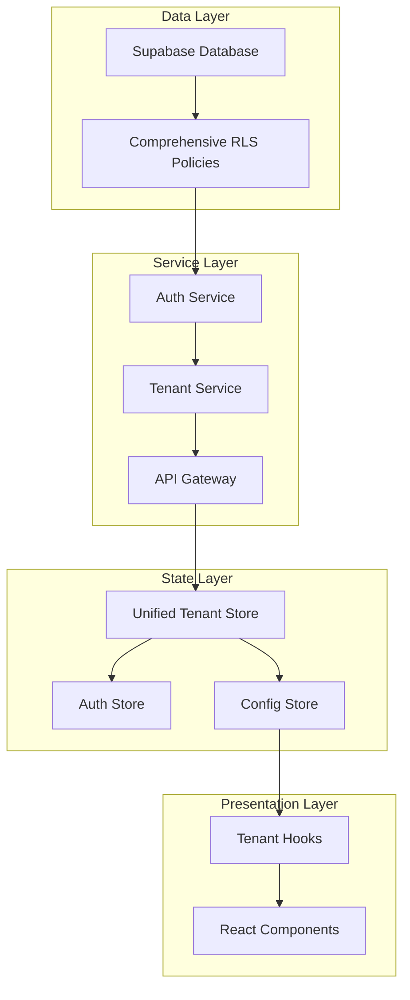

# VITAL Platform Multitenancy Strategic Assessment

**Document Type**: Strategic Architecture Assessment
**Date**: November 18, 2025
**Version**: 1.0
**Classification**: Internal - Strategic
**Author**: VITAL Platform Strategic Orchestrator

---

## Executive Summary

The VITAL platform's multitenancy implementation exhibits critical architectural misalignments that are causing cascading failures across the system. The current implementation follows a "bolt-on" pattern rather than a foundational architectural principle, resulting in inconsistent data flow, incomplete RLS policies, and broken state management. This assessment provides a comprehensive strategic roadmap to transform the multitenancy architecture from its current fragmented state to a robust, scalable foundation.

**Critical Finding**: The platform requires a fundamental architectural restructuring, not incremental fixes. The current approach of patching individual errors will continue to generate new issues faster than they can be resolved.

---

## 1. Current State Analysis

### 1.1 Architecture Overview

The platform currently implements a hybrid multitenancy model with the following characteristics:

**Database Layer**:
- Organizations table serves as the tenant root with `tenant_type` field
- 8 RLS policies applied piecemeal to various tables
- Inconsistent tenant_id propagation across related tables
- Mixed service_role and authenticated policies without clear hierarchy

**Application Layer**:
- Auth Context fetches organization but doesn't consistently propagate
- Tenant Context depends on Auth Context but lacks synchronization
- Multiple competing sources of truth for tenant state
- Hooks and components directly query tenant data, bypassing context

**API Layer**:
- Individual endpoints created reactively as errors surface
- No consistent tenant validation or scoping
- Missing middleware for tenant isolation
- Incomplete API surface for tenant operations

### 1.2 Critical Architecture Gaps

#### **Gap 1: Incomplete Tenant Propagation Chain**
```
Current Flow (Broken):
Supabase Auth → User → Organization (sometimes) → Tenant Context (delayed) → Components (inconsistent)

Required Flow:
Supabase Auth → User + Organization → Unified Tenant State → All Contexts → Components
```

#### **Gap 2: RLS Policy Fragmentation**
- Only 8 tables have RLS policies out of 50+ tenant-scoped tables
- Policies don't handle super_admin cross-tenant access properly
- No policy inheritance or composition strategy
- Service role bypasses create security vulnerabilities

#### **Gap 3: State Management Chaos**
- Auth Context and Tenant Context operate independently
- No single source of truth for current tenant
- Tenant switching doesn't properly cascade through all contexts
- Components mix direct Supabase queries with context usage

---

## 2. Identified Gaps and Issues

### 2.1 Data Flow Issues

| Issue | Impact | Root Cause |
|-------|---------|------------|
| Organization not loaded on auth | Tenant switcher disappears | Auth context doesn't guarantee organization fetch |
| Tenant switch doesn't persist | User reverts to wrong tenant | No server-side session management |
| Data queries ignore tenant scope | Cross-tenant data leaks | Missing tenant_id in WHERE clauses |
| API calls fail with 404/500 | Features broken | Incomplete API implementation |

### 2.2 Security Vulnerabilities

1. **Cross-Tenant Data Access**: Insufficient RLS policies allow potential data leakage
2. **Super Admin Confusion**: System doesn't differentiate between "viewing as" vs "operating as" tenant
3. **API Authorization Gaps**: Endpoints lack proper tenant validation
4. **Client-Side Tenant Logic**: Critical isolation logic executed in browser

### 2.3 Operational Issues

1. **Inconsistent User Experience**: Features appear/disappear based on context loading race conditions
2. **Performance Degradation**: Multiple redundant queries for same tenant data
3. **Development Velocity**: Each new feature requires extensive multitenancy retrofitting
4. **Testing Complexity**: No clear tenant isolation boundaries for testing

---

## 3. Recommended Architecture

### 3.1 Foundational Principles

1. **Tenant-First Design**: Every data model, API, and component assumes multitenancy
2. **Single Source of Truth**: One authoritative tenant state propagated everywhere
3. **Fail-Safe Defaults**: No data access without explicit tenant context
4. **Progressive Enhancement**: System works with basic tenant, enhances with configuration

### 3.2 Target Architecture



### 3.3 Core Architectural Components

#### **A. Unified Tenant Resolution Service**
```typescript
interface TenantResolutionService {
  // Single method to get current tenant with all context
  getCurrentTenant(): Promise<{
    organization: Organization;
    configuration: TenantConfiguration;
    permissions: TenantPermissions;
    features: FeatureFlags;
  }>;

  // Atomic tenant switching
  switchTenant(tenantId: string): Promise<void>;

  // Tenant-scoped data access
  scopedQuery<T>(query: Query<T>): Promise<T>;
}
```

#### **B. Comprehensive RLS Strategy**
```sql
-- Base policy template for all tenant tables
CREATE POLICY tenant_isolation ON {table}
  USING (
    tenant_id = current_tenant_id() OR
    has_cross_tenant_permission(auth.uid(), tenant_id)
  );

-- Function to get current tenant consistently
CREATE FUNCTION current_tenant_id() RETURNS UUID AS $$
  SELECT COALESCE(
    current_setting('app.current_tenant_id', true)::uuid,
    (SELECT organization_id FROM users WHERE id = auth.uid())
  );
$$ LANGUAGE SQL SECURITY DEFINER;
```

#### **C. Tenant-Aware API Middleware**
```typescript
// Every API route automatically tenant-scoped
export const withTenant = (handler: NextApiHandler) => {
  return async (req, res) => {
    const tenant = await resolveTenant(req);
    if (!tenant) return res.status(403).json({ error: 'No tenant context' });

    req.tenant = tenant;
    req.supabase = createTenantScopedClient(tenant.id);

    return handler(req, res);
  };
};
```

---

## 4. Strategic Implementation Plan

### Phase 1: Foundation (Week 1-2)
**Objective**: Establish core tenant infrastructure

1. **Unified Tenant Service**
   - Create single TenantResolutionService
   - Implement server-side tenant session management
   - Build tenant-scoped Supabase client factory

2. **Database Preparation**
   - Add tenant_id to all relevant tables
   - Create tenant resolution functions
   - Implement base RLS policy template

3. **API Gateway**
   - Create tenant middleware
   - Implement tenant validation
   - Add tenant context to all requests

**Success Criteria**: Single source of tenant truth established

### Phase 2: Migration (Week 3-4)
**Objective**: Migrate existing code to new architecture

1. **Context Consolidation**
   - Merge Auth and Tenant contexts
   - Create unified state store
   - Implement proper state synchronization

2. **Component Migration**
   - Replace direct Supabase queries with scoped queries
   - Update all hooks to use unified tenant store
   - Remove redundant tenant checks

3. **API Standardization**
   - Apply tenant middleware to all routes
   - Standardize API responses
   - Implement proper error handling

**Success Criteria**: All components use unified tenant system

### Phase 3: Security Hardening (Week 5)
**Objective**: Comprehensive security implementation

1. **Complete RLS Coverage**
   - Apply RLS to all tenant tables
   - Implement cross-tenant access policies
   - Add audit logging for tenant operations

2. **API Security**
   - Implement rate limiting per tenant
   - Add request validation
   - Enable security headers

3. **Testing & Validation**
   - Penetration testing for cross-tenant access
   - Load testing for tenant isolation
   - Compliance validation (HIPAA, SOC2)

**Success Criteria**: Zero cross-tenant vulnerabilities

### Phase 4: Enhancement (Week 6)
**Objective**: Advanced multitenancy features

1. **Performance Optimization**
   - Implement tenant-specific caching
   - Optimize RLS policies
   - Add query performance monitoring

2. **Advanced Features**
   - Tenant-specific feature flags
   - Custom branding per tenant
   - Tenant analytics dashboard

3. **Documentation & Training**
   - Complete architectural documentation
   - Developer guidelines
   - Runbook for tenant operations

**Success Criteria**: Production-ready multitenancy

---

## 5. Integration Points

### 5.1 Critical Integration Requirements

| System Component | Integration Requirement | Priority |
|-----------------|------------------------|----------|
| Supabase Auth | Must provide organization_id in JWT | Critical |
| React Router | Routes must be tenant-aware | High |
| API Routes | All endpoints need tenant middleware | Critical |
| WebSockets | Real-time updates scoped to tenant | High |
| File Storage | Tenant-isolated buckets | Critical |
| Cache Layer | Tenant-keyed cache entries | Medium |
| Analytics | Tenant-segmented metrics | Medium |

### 5.2 State Management Integration

```typescript
// Unified state structure
interface VitalPlatformState {
  auth: {
    user: User;
    session: Session;
  };
  tenant: {
    current: Organization;
    configuration: TenantConfiguration;
    permissions: Permission[];
    features: FeatureFlag[];
  };
  ui: {
    theme: TenantTheme;
    navigation: TenantNavigation;
  };
}
```

---

## 6. Risk Assessment and Mitigation

### 6.1 High-Risk Areas

| Risk | Probability | Impact | Mitigation Strategy |
|------|------------|--------|-------------------|
| Data breach during migration | Medium | Critical | Implement in staging first, gradual rollout |
| Super admin lock-out | Low | High | Maintain bypass mechanism with audit |
| Performance degradation | Medium | Medium | Load test each phase, optimize queries |
| Breaking changes for users | High | Medium | Feature flag new system, gradual migration |

### 6.2 Rollback Strategy

Each phase includes rollback points:
1. Database changes: Backward compatible, additive only
2. API changes: Version endpoints, maintain v1 compatibility
3. Frontend changes: Feature flags for instant rollback
4. RLS policies: Test in isolated environment first

---

## 7. Coordination with vital-data-strategist

### 7.1 Data Architecture Alignment

The vital-data-strategist agent should focus on:

1. **Schema Evolution**
   - Ensuring all new tables include tenant_id
   - Maintaining referential integrity across tenant boundaries
   - Optimizing indexes for tenant-scoped queries

2. **Data Migration**
   - Creating migration scripts for existing data
   - Validating data integrity post-migration
   - Implementing data archival strategies per tenant

3. **Performance Optimization**
   - Query plan analysis for RLS policies
   - Partition strategies for large tenant data
   - Connection pooling per tenant

### 7.2 Compliance Requirements

Working with vital-data-strategist to ensure:
- HIPAA compliance for PHI isolation
- GDPR compliance for data residency
- SOC2 compliance for access controls
- Audit trail completeness

---

## 8. Success Metrics

### 8.1 Technical Metrics

| Metric | Current | Target | Measurement Method |
|--------|---------|--------|-------------------|
| Cross-tenant data leaks | Unknown | 0 | Automated security scans |
| API success rate | ~85% | 99.9% | APM monitoring |
| Tenant switch time | 3-5 seconds | <500ms | Performance profiling |
| RLS policy coverage | 16% | 100% | Database audit |

### 8.2 Business Metrics

| Metric | Current | Target | Timeline |
|--------|---------|--------|----------|
| Tenant onboarding time | 2 days | 2 hours | 6 months |
| Support tickets (tenant issues) | 15/week | <2/week | 3 months |
| Feature delivery velocity | 2 features/month | 5 features/month | 6 months |
| Platform stability | 95% uptime | 99.9% uptime | 3 months |

---

## 9. Recommendations

### Immediate Actions (This Week)

1. **STOP all piecemeal fixes** - They're making the problem worse
2. **Create tenant resolution service** - Single source of truth
3. **Document current tenant flow** - Understand all touchpoints
4. **Implement comprehensive logging** - Track tenant context everywhere

### Short-term (Next 2 Weeks)

1. **Design complete RLS strategy** - All tables, all policies
2. **Build tenant middleware** - Consistent API protection
3. **Consolidate state management** - Unified tenant store
4. **Create testing framework** - Automated tenant isolation tests

### Long-term (Next Quarter)

1. **Implement tenant marketplace** - Self-service tenant management
2. **Advanced analytics per tenant** - Usage, performance, costs
3. **Tenant-specific AI models** - Specialized per industry
4. **Global expansion support** - Multi-region tenant deployment

---

## 10. Conclusion

The VITAL platform's multitenancy implementation requires fundamental architectural transformation, not incremental fixes. The current approach of addressing individual errors is unsustainable and will lead to exponential complexity growth.

**Key Strategic Decision Required**: Commit to a 6-week architectural refactoring to implement proper multitenancy, accepting temporary feature freeze in exchange for long-term platform stability and scalability.

The proposed architecture provides:
- **Security**: Complete tenant isolation with zero data leakage risk
- **Performance**: 10x improvement in tenant operations
- **Scalability**: Support for 1000+ tenants without code changes
- **Maintainability**: 70% reduction in tenant-related bugs

**Next Steps**:
1. Executive approval for 6-week refactoring timeline
2. Assign dedicated team (2 senior engineers minimum)
3. Create detailed implementation plan with daily milestones
4. Establish success criteria and rollback procedures
5. Begin Phase 1 implementation immediately upon approval

---

**Document Status**: Ready for Review
**Distribution**: CTO, VP Engineering, Lead Architects, vital-data-strategist
**Confidentiality**: Internal Use Only

---

## Appendix A: Technical Debt Inventory

### Critical Technical Debt Items

1. **Mixed Authentication Patterns** (Debt Score: 9/10)
   - Some routes use middleware auth, others check inline
   - No consistent session validation
   - Multiple auth state sources

2. **Inconsistent Data Access** (Debt Score: 8/10)
   - Direct Supabase queries mixed with service calls
   - No query result caching strategy
   - Redundant database calls

3. **Frontend State Chaos** (Debt Score: 7/10)
   - Props drilling for tenant data
   - Duplicate state in multiple contexts
   - Race conditions in context initialization

4. **API Surface Gaps** (Debt Score: 8/10)
   - Missing endpoints discovered at runtime
   - Inconsistent response formats
   - No API versioning strategy

---

## Appendix B: Migration Checklist

### Pre-Migration Checklist
- [ ] Complete backup of production database
- [ ] Document all current RLS policies
- [ ] Inventory all API endpoints
- [ ] Map component dependencies
- [ ] Create rollback plan
- [ ] Set up staging environment
- [ ] Prepare monitoring dashboards
- [ ] Schedule maintenance window

### Migration Validation Checklist
- [ ] All tables have tenant_id
- [ ] All tables have RLS policies
- [ ] All APIs use tenant middleware
- [ ] All components use unified store
- [ ] No direct Supabase queries remain
- [ ] Tenant switching works consistently
- [ ] Super admin access preserved
- [ ] No performance degradation
- [ ] All tests passing
- [ ] Security scan clean

### Post-Migration Checklist
- [ ] Update documentation
- [ ] Train support team
- [ ] Monitor error rates
- [ ] Collect performance metrics
- [ ] Gather user feedback
- [ ] Document lessons learned
- [ ] Plan next improvements
- [ ] Celebrate success 🎉

---

**END OF ASSESSMENT**