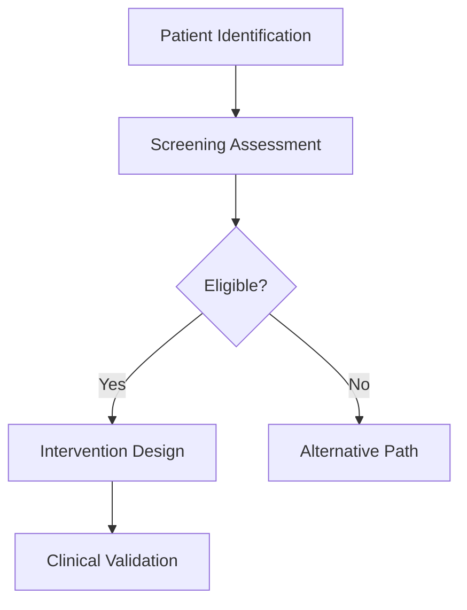
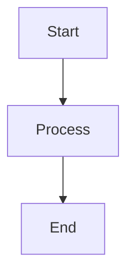
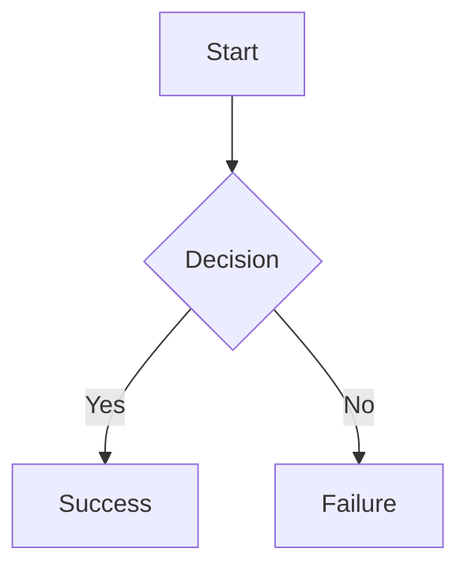
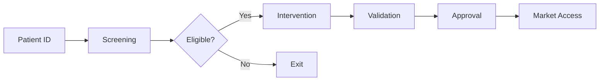

# 🔧 **Mermaid "Syntax Error" Fix Guide**

**Date**: 2025-11-06 14:45 UTC  
**Status**: ⚠️ **DEBUGGING IN PROGRESS**

---

## **🐛 Problem**

User is getting "Syntax error in graph, mermaid version 8.14.0" when AI generates Mermaid diagrams.

---

## **🔍 Root Causes**

### **Cause 1: Packages Not Installed** ✅ **FIXED**
- `mermaid` and `react-mermaid2` were in `package.json` but not installed
- **Fix**: Ran `pnpm install`

### **Cause 2: react-mermaid2 Version Mismatch** ⚠️ **CHECKING**
- `react-mermaid2` v0.1.4 uses old Mermaid v8.14.0
- We installed `mermaid` v11.12.1 (latest)
- **Conflict**: react-mermaid2 might not be compatible with Mermaid v11

### **Cause 3: Invalid Mermaid Syntax** ⚠️ **POSSIBLE**
- LLM might be generating invalid Mermaid syntax
- Common errors:
  - Missing graph type declaration
  - Invalid node syntax
  - Special characters not escaped

---

## **🔧 Solution 1: Use Native Mermaid (Recommended)**

Replace `react-mermaid2` with native `mermaid` library:

**File**: `apps/digital-health-startup/src/components/ai/response.tsx`

**Changes**:
```typescript
// Remove react-mermaid2 import
// import Mermaid from "react-mermaid2"

// Add mermaid import
import mermaid from "mermaid"

// In component, replace Mermaid component with useEffect
if (!inline && (language === "mermaid" || language === "mmd")) {
  return <MermaidDiagram code={code} />
}

// Add new component
function MermaidDiagram({ code }: { code: string }) {
  const ref = React.useRef<HTMLDivElement>(null)
  const [error, setError] = React.useState<string | null>(null)
  
  React.useEffect(() => {
    if (ref.current) {
      // Initialize mermaid
      mermaid.initialize({
        startOnLoad: false,
        theme: 'default',
        securityLevel: 'loose',
      })
      
      // Render diagram
      const id = `mermaid-${Math.random().toString(36).substr(2, 9)}`
      mermaid.render(id, code)
        .then((result) => {
          if (ref.current) {
            ref.current.innerHTML = result.svg
          }
        })
        .catch((err) => {
          console.error("Mermaid error:", err)
          setError(err.message)
        })
    }
  }, [code])
  
  if (error) {
    return (
      <div className="my-4 p-4 border border-red-300 rounded-lg bg-red-50">
        <p className="text-sm text-red-600 mb-2">Mermaid diagram error</p>
        <pre className="text-xs overflow-auto">{error}</pre>
        <pre className="text-xs overflow-auto mt-2">{code}</pre>
      </div>
    )
  }
  
  return (
    <div 
      ref={ref} 
      className="my-4 p-4 border rounded-lg bg-white dark:bg-gray-900"
    />
  )
}
```

---

## **🔧 Solution 2: Upgrade react-mermaid2 (Alternative)**

**Problem**: `react-mermaid2` v0.1.4 is outdated (last updated 2019)

**Alternative package**: `@mermaid-js/react-mermaid`

**Install**:
```bash
pnpm remove react-mermaid2
pnpm add @mermaid-js/react-mermaid
```

**Usage**:
```typescript
import { Mermaid } from '@mermaid-js/react-mermaid'

<Mermaid chart={code} />
```

---

## **🔧 Solution 3: Fix LLM Mermaid Syntax**

Update agent system prompts to generate valid Mermaid syntax:

**File**: `services/ai-engine/src/langgraph_workflows/mode1_manual_workflow.py`

**Add to system prompt**:
```python
## Mermaid Diagram Guidelines:
- ALWAYS start with graph type: `graph TD` or `graph LR`
- Node format: `A[Label]` for boxes, `A(Label)` for rounded
- Escape special characters: use `A["Label with 'quotes'"]`
- Use simple connections: `A --> B` or `A -->|text| B`
- Avoid complex syntax like subgraphs in first iteration
- Test syntax: ensure no unclosed brackets or quotes

**Valid Example**:


**Invalid Example (will fail)**:
```mermaid
graph
    A[Patient's Assessment] --> B  # Missing graph type, special char issue
```
```

---

## **🧪 Test Cases**

### **Test 1: Simple Flowchart**


### **Test 2: Decision Flow**


### **Test 3: Complex Flow**


---

## **📋 Quick Checklist**

When you see "Syntax error in graph":

1. ✅ Check browser console for actual error message
2. ✅ Verify Mermaid packages are installed
3. ✅ Check Mermaid code starts with `graph TD` or `graph LR`
4. ✅ Check for unclosed brackets `[`, `]`, `{`, `}`
5. ✅ Check for special characters (quotes, apostrophes)
6. ✅ Try simple diagram first
7. ✅ Validate syntax at https://mermaid.live

---

## **🚀 Recommended Action**

**Option A: Quick Fix (5 min)**
1. Use native Mermaid instead of react-mermaid2
2. Update `response.tsx` with MermaidDiagram component
3. Test with simple diagram

**Option B: Better Package (10 min)**
1. Remove `react-mermaid2`
2. Install `@mermaid-js/react-mermaid` (official, maintained)
3. Update imports
4. Test

**Option C: Fix LLM Output (15 min)**
1. Update agent system prompts
2. Add Mermaid syntax validation
3. Test with multiple agents

---

**I recommend Option A (native Mermaid) for fastest fix!**

**Shall I implement Option A now?**

