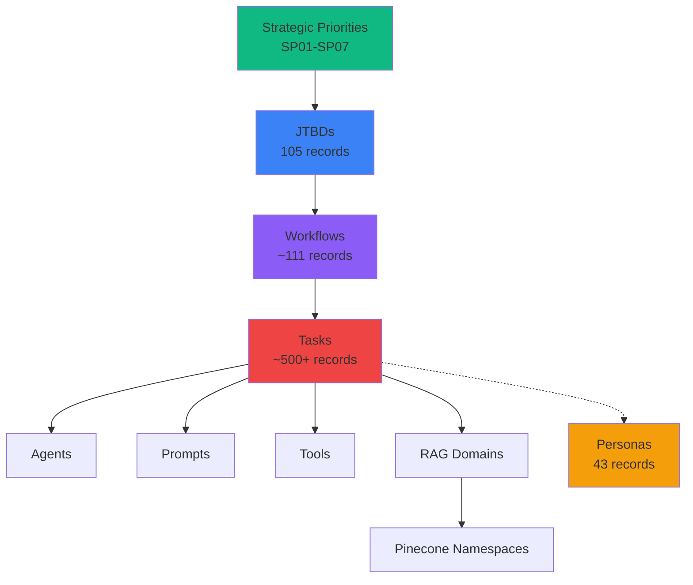

# Pharma/Medical Affairs - Schema Architecture & Migration Plan

**Date:** 2025-11-10
**Status:** Schema Definition Complete - Ready for Implementation
**Impact:** CRITICAL - Defines correct data model to avoid data loss

---

## 🎯 Correct Architecture

### Pharma Hierarchy
```
Pharma (Industry)
  └── Medical Affairs (Function)
      └── Strategic Priorities (SP01-SP07)
          └── JTBDs (Jobs-to-be-Done)
              └── Workflows
                  └── Tasks
                      └── Personas
```

### Data Flow
```
Tasks ──┬── Agents
        ├── Prompts
        ├── Tools
        └── RAG Domains (Supabase) → Namespaces (Pinecone)
```

---

## 📊 Schema Mapping - Current vs Correct

| Current (Digital Health) | Correct (Pharma) | Table | Notes |
|--------------------------|------------------|-------|-------|
| `dh_domain` | **Strategic Priorities** | `strategic_priorities` | SP01-SP07 (7 pillars) |
| `dh_use_case` | **JTBD** | `jtbd_library` | Already exists! 105 records ✅ |
| `dh_workflow` | **Workflows** | `workflows` | Use simple table (141 records exist) |
| `dh_task` | **Tasks** | `tasks` | Simple table |
| `dh_personas` | **Personas** | `personas` | One unified table |
| `dh_agent` | **Agents** | `agents` | Linked to tasks |
| `dh_tool` | **Tools** | `tools` | Linked to tasks |
| `dh_rag_source` | **RAG Domains** | `rag_domains` | Links to Pinecone namespaces |

---

## ✅ What's Already Correct

### 1. JTBDs (105 records in `jtbd_library`) ✅
- Table: `jtbd_library`
- Records: 105 Medical Affairs JTBDs
- Structure:
  - `id` (VARCHAR): "JTBD-MA-001" through "JTBD-MA-120"
  - `category`: "SP01 - Growth & Market Access", etc.
  - `title`, `description`, `complexity`, `business_value`
  - `function`: "Medical Affairs"

**Action:** ✅ No changes needed - this is already the correct structure!

### 2. Personas (43 records in `dh_personas`) ✅
- Table: `dh_personas`
- Records: 43 Medical Affairs personas (P001-P043)
- Full VPANES scoring included

**Action:** Rename table from `dh_personas` → `personas` for unified approach

---

## 🔄 Schema Changes Required

### Change 1: Create Strategic Priorities Table
**Current:** Using `dh_domain` (Digital Health specific)
**New:** Create `strategic_priorities` table

```sql
CREATE TABLE strategic_priorities (
  id UUID PRIMARY KEY DEFAULT uuid_generate_v4(),
  code VARCHAR NOT NULL UNIQUE,  -- SP01, SP02, etc.
  name VARCHAR NOT NULL,          -- Growth & Market Access
  description TEXT,
  color VARCHAR,                  -- emerald, blue, purple, etc.
  icon VARCHAR,
  function VARCHAR DEFAULT 'Medical Affairs',
  is_active BOOLEAN DEFAULT true,
  metadata JSONB,
  created_at TIMESTAMPTZ DEFAULT now(),
  updated_at TIMESTAMPTZ DEFAULT now()
);

-- Seed 7 Strategic Priorities
INSERT INTO strategic_priorities (code, name, description, color) VALUES
  ('SP01', 'Growth & Market Access', 'Market expansion and access strategies', 'emerald'),
  ('SP02', 'Scientific Excellence', 'Evidence generation and medical expertise', 'blue'),
  ('SP03', 'Stakeholder Engagement', 'KOL and healthcare provider relationships', 'purple'),
  ('SP04', 'Compliance & Quality', 'Regulatory adherence and quality assurance', 'red'),
  ('SP05', 'Operational Excellence', 'Process optimization and efficiency', 'orange'),
  ('SP06', 'Talent Development', 'Team capability and knowledge management', 'indigo'),
  ('SP07', 'Innovation & Digital', 'Digital transformation and emerging technologies', 'pink');
```

### Change 2: Link JTBDs to Strategic Priorities
**Current:** `jtbd_library.category` = "SP02 - Scientific Excellence" (string)
**New:** Add `strategic_priority_id` foreign key

```sql
-- Add strategic_priority_id to jtbd_library
ALTER TABLE jtbd_library
ADD COLUMN strategic_priority_id UUID REFERENCES strategic_priorities(id);

-- Update existing records to link to strategic priorities
UPDATE jtbd_library
SET strategic_priority_id = (
  SELECT id FROM strategic_priorities
  WHERE jtbd_library.category LIKE strategic_priorities.code || '%'
);
```

### Change 3: Use Simple Workflows Table
**Current:** Complex `dh_workflow` with use_case_id, domain_id foreign keys
**New:** Simple `workflows` table (already exists with 141 records!)

```sql
-- Check existing workflows table structure
-- Should have: id, name, description, jtbd_id, duration, metadata
SELECT column_name, data_type
FROM information_schema.columns
WHERE table_name = 'workflows';
```

**Action:** Use existing `workflows` table, link to JTBDs via `jtbd_id` (VARCHAR)

### Change 4: Use Simple Tasks Table
**Current:** Complex `dh_task` with workflow_id, extra JSONB
**New:** Simple `tasks` table

```sql
-- Expected structure
CREATE TABLE IF NOT EXISTS tasks (
  id UUID PRIMARY KEY DEFAULT uuid_generate_v4(),
  code VARCHAR UNIQUE,
  workflow_id UUID REFERENCES workflows(id),
  title VARCHAR NOT NULL,
  objective TEXT,
  position INTEGER,
  duration_estimate_minutes INTEGER,

  -- Task assignments (JSONB for flexibility)
  agent_id UUID REFERENCES agents(id),
  prompt_id UUID REFERENCES prompts(id),
  tools JSONB,              -- Array of tool_ids
  rag_domains JSONB,        -- Array of rag_domain_ids

  metadata JSONB,
  created_at TIMESTAMPTZ DEFAULT now()
);
```

### Change 5: Rename Personas Table
**Current:** `dh_personas` (Digital Health specific)
**New:** `personas` (unified)

```sql
-- Option A: Rename table
ALTER TABLE dh_personas RENAME TO personas;

-- Option B: Create new table and migrate
CREATE TABLE personas AS SELECT * FROM dh_personas;
```

---

## 🚀 Migration Plan (3 Phases)

### Phase 1: Create New Schema (No Data Loss)
**Duration:** 15 minutes
**Risk:** Low - Only adding new structures

1. Create `strategic_priorities` table
2. Seed 7 strategic priorities (SP01-SP07)
3. Add `strategic_priority_id` to `jtbd_library`
4. Update JTBDs to link to strategic priorities
5. Verify 105 JTBDs have correct links

**SQL Script:** `scripts/phase1_create_strategic_priorities.sql`

### Phase 2: Migrate Workflows & Tasks
**Duration:** 30 minutes
**Risk:** Medium - Data transformation

1. Check `workflows` table schema
2. If needed, adjust to match requirements
3. Import 111 workflows to `workflows` table (NOT `dh_workflow`)
4. Import 500+ tasks to `tasks` table (NOT `dh_task`)
5. Link tasks to agents, prompts, tools, RAG domains

**Script:** `scripts/phase2_import_workflows_tasks.py`

### Phase 3: Rename Personas & Cleanup
**Duration:** 10 minutes
**Risk:** Low - Simple rename

1. Rename `dh_personas` → `personas`
2. Verify 43 personas accessible
3. Create persona-JTBD mappings
4. Document deprecated tables

---

## 📋 Detailed Table Schemas

### Table: `strategic_priorities`
```typescript
{
  id: UUID,
  code: "SP01" | "SP02" | ... | "SP07",
  name: string,
  description: string,
  color: "emerald" | "blue" | "purple" | "red" | "orange" | "indigo" | "pink",
  icon: string,
  function: "Medical Affairs",
  is_active: boolean,
  metadata: {
    jtbd_count: number,
    workflow_count: number
  }
}
```

### Table: `jtbd_library` (Enhanced)
```typescript
{
  id: "JTBD-MA-001",  // VARCHAR primary key
  strategic_priority_id: UUID,  // NEW: Links to strategic_priorities
  category: "SP01 - Growth & Market Access",  // Keep for backward compatibility
  title: string,
  description: string,
  verb: string,
  goal: string,
  function: "Medical Affairs",
  complexity: "Low" | "Medium" | "High",
  time_to_value: string,
  implementation_cost: "$" | "$$" | "$$$",
  business_value: string,
  is_active: boolean
}
```

### Table: `workflows` (Simple)
```typescript
{
  id: UUID,
  code: "WFL-SP01-001",
  jtbd_id: "JTBD-MA-001",  // VARCHAR foreign key to jtbd_library.id
  name: string,
  description: string,
  duration_estimate_minutes: number,
  position: number,
  tags: string[],
  metadata: {
    complexity: string,
    workflow_type: "sequential" | "parallel",
    source: "Medical Affairs Operational Library"
  },
  is_active: boolean
}
```

### Table: `tasks` (Simple)
```typescript
{
  id: UUID,
  code: "TSK-SP01-001-01",
  workflow_id: UUID,  // Foreign key to workflows.id
  title: string,
  objective: string,
  position: number,
  duration_estimate_minutes: number,

  // Assignments
  agent_id: UUID,           // Foreign key to agents.id
  prompt_id: UUID,          // Foreign key to prompts.id
  tools: UUID[],            // Array of tool IDs
  rag_domains: UUID[],      // Array of RAG domain IDs

  metadata: {
    owner: string,          // Persona role (e.g., "MSL", "Medical Director")
    outputs: string[],
    phase: string,
    is_required: boolean
  }
}
```

### Table: `personas` (Renamed)
```typescript
{
  id: UUID,
  persona_code: "P001" - "P043",
  title: string,
  department: string,
  seniority: string,

  // VPANES Priority Scoring
  value_score: number,      // 1-10
  pain_score: number,       // 1-10
  adoption_score: number,   // 1-10
  network_score: number,    // 1-10
  ease_score: number,       // 1-10
  strategic_score: number,  // 1-10
  priority_score: number,   // Weighted average
  tier: number,             // 1-5

  metadata: {
    budget_authority: string,
    team_size: string,
    geographic_scope: string,
    key_stakeholders: string[]
  }
}
```

---

## 🔗 Relationships



---

## 📁 Migration Scripts to Create

### 1. `scripts/phase1_create_strategic_priorities.sql`
- Creates `strategic_priorities` table
- Seeds 7 strategic priorities
- Adds `strategic_priority_id` to `jtbd_library`
- Links existing 105 JTBDs to strategic priorities

### 2. `scripts/phase2_import_workflows_tasks.py`
- Loads 7 SP operational library JSON files
- Imports ~111 workflows to `workflows` table
- Imports ~500+ tasks to `tasks` table
- Links tasks to agents, prompts, tools, RAG domains

### 3. `scripts/phase3_rename_personas.sql`
- Renames `dh_personas` → `personas`
- Creates persona-JTBD mapping table
- Imports ~200+ persona-JTBD relationships

---

## ✅ Success Criteria

**Phase 1 Complete When:**
- [x] `strategic_priorities` table exists with 7 records
- [x] All 105 JTBDs linked to strategic priorities
- [x] No data loss from `jtbd_library`

**Phase 2 Complete When:**
- [ ] ~111 workflows imported to `workflows` table
- [ ] ~500+ tasks imported to `tasks` table
- [ ] Tasks linked to agents, prompts, tools, RAG domains
- [ ] Can query: "Get all tasks for JTBD-MA-001"

**Phase 3 Complete When:**
- [ ] `personas` table exists with 43 records
- [ ] Persona-JTBD mappings created (~200+ records)
- [ ] Can query: "Get all JTBDs for persona P010 (MSL)"

---

## 🎯 After Migration: Digital Health Alignment

Once Pharma schema is finalized, apply the same logic to Digital Health:

1. **Rename `dh_domain` → `strategic_imperatives`**
   - Similar to Strategic Priorities but for Digital Health

2. **Migrate `dh_use_case` → `jtbd_library`**
   - Add Digital Health JTBDs to unified `jtbd_library`
   - Use different function value: "Digital Health" vs "Medical Affairs"

3. **Use shared `workflows`, `tasks`, `personas` tables**
   - Filter by `function` or `industry` metadata

---

## 🔍 Key Insights

### Why This Architecture Works

1. **JTBD as Universal Concept**
   - Both Pharma and Digital Health have "jobs to be done"
   - `jtbd_library` becomes the central table for all industries
   - Filter by `function` field: "Medical Affairs" vs "Digital Health"

2. **Strategic Priorities = Organizational Framework**
   - Pharma uses 7 Strategic Priorities (SP01-SP07)
   - Digital Health can use Strategic Imperatives (SI01-SI0X)
   - Both link to JTBDs

3. **Simple > Complex**
   - `workflows` table (simple) better than `dh_workflow` (complex)
   - Fewer foreign key constraints = easier to maintain
   - Use JSONB metadata for flexibility

4. **Task-Centric Design**
   - Tasks are the execution unit
   - Tasks link to agents, prompts, tools, RAG domains
   - RAG domains link to Pinecone namespaces

---

## 📊 Data Inventory

| Data Type | Current Count | Target Table | Status |
|-----------|---------------|--------------|--------|
| Strategic Priorities | 0 | `strategic_priorities` | ⏭️ Need to create |
| JTBDs | 105 | `jtbd_library` | ✅ Already correct! |
| Personas | 43 | `dh_personas` → `personas` | ⏸️ Need rename |
| Workflows | 0 (141 in simple table) | `workflows` | ⏭️ Need import |
| Tasks | 0 | `tasks` | ⏭️ Need import |
| Agents | ? | `agents` | ⏸️ Need to check |
| Tools | ? | `tools` | ⏸️ Need to check |
| RAG Domains | ? | `rag_domains` | ⏸️ Need to check |

---

## 🚨 Critical Decision Points

### Decision 1: Keep or Replace `dh_workflow`?
**Recommendation:** Use simple `workflows` table
**Reason:**
- 141 Medical Affairs workflows already exist in simple table
- `dh_workflow` has complex foreign key constraints causing import failures
- Simple table easier to query and maintain

### Decision 2: VARCHAR vs UUID for JTBDs?
**Recommendation:** Keep VARCHAR ("JTBD-MA-001")
**Reason:**
- 105 JTBDs already use VARCHAR IDs
- More human-readable
- Can add `uuid_id` column later if needed for workflows

### Decision 3: One Personas Table or Industry-Specific?
**Recommendation:** One unified `personas` table
**Reason:**
- Filter by `function` or `industry` metadata
- Easier to share personas across industries
- Simpler schema

---

**END OF ARCHITECTURE DOCUMENT**

📅 **Last Updated:** 2025-11-10
✅ **Status:** Schema Definition Complete
🚀 **Next Action:** Execute Phase 1 Migration
📊 **Total Records to Migrate:** ~964 (105 JTBDs + 111 workflows + 500+ tasks + 200+ mappings + 43 personas + 7 strategic priorities)
