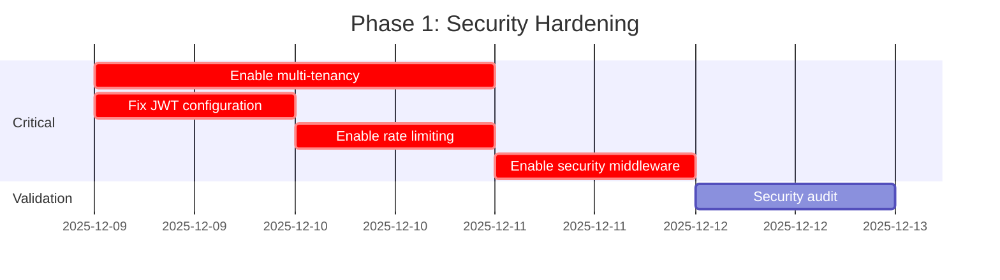

# VITAL Path Backend - Comprehensive Audit Report

**Version:** 2.0  
**Date:** December 5, 2025  
**Status:** CRITICAL - Immediate Action Required  
**Auditor:** AI Engineering Team

---

## Executive Summary

The VITAL Path backend codebase (`services/ai-engine`) has been comprehensively audited against world-class software engineering standards. The audit reveals significant technical debt, security vulnerabilities, and architectural issues that require immediate attention.

### Overall Assessment: 🔴 CRITICAL

| Category | Score | Status |
|----------|-------|--------|
| Security | 2/10 | 🔴 Critical |
| Architecture | 3/10 | 🔴 Critical |
| Code Quality | 4/10 | 🟡 Poor |
| Test Coverage | 2/10 | 🔴 Critical |
| Maintainability | 3/10 | 🔴 Critical |
| Performance | 5/10 | 🟡 Moderate |

---

## Table of Contents

1. [Codebase Overview](#1-codebase-overview)
2. [Critical Security Issues](#2-critical-security-issues)
3. [Architecture Analysis](#3-architecture-analysis)
4. [Code Quality Metrics](#4-code-quality-metrics)
5. [Testing Analysis](#5-testing-analysis)
6. [Dependency Analysis](#6-dependency-analysis)
7. [Prioritized Recommendations](#7-prioritized-recommendations)
8. [Implementation Roadmap](#8-implementation-roadmap)

---

## 1. Codebase Overview

### 1.1 Size Metrics

| Metric | Value | World-Class Target | Gap |
|--------|-------|-------------------|-----|
| Total Python Files | 280 | - | - |
| Total Lines of Code | ~120,000 | - | - |
| Total Classes | 651 | - | - |
| Total Functions | ~1,500+ | - | - |
| Max File Size | 3,370 lines | < 300 lines | **11x over** |
| Services Count | 67 files | 20-30 | **2-3x over** |
| Workflows Count | 15+ files | - | - |

### 1.2 Directory Structure

```
services/ai-engine/
├── src/                          # Main source (280 files, 6.5MB)
│   ├── agents/                   # 3 files, 32KB
│   ├── api/                      # 28 files, 608KB
│   ├── config/                   # 2 files, 28KB
│   ├── core/                     # 4 files, 52KB
│   ├── domain/                   # 2 files, 16KB (INSUFFICIENT)
│   ├── graphrag/                 # 31 files, 784KB
│   ├── integrations/             # 3 files, 44KB
│   ├── langgraph_compilation/    # 16 files, 300KB
│   ├── langgraph_workflows/      # 30+ files, 1.2MB (PROBLEMATIC)
│   ├── middleware/               # 5 files, 52KB
│   ├── monitoring/               # 8 files, 152KB
│   ├── models/                   # 6 files, 100KB
│   ├── protocols/                # 5 files, 100KB
│   ├── repositories/             # 1 file, 16KB (INSUFFICIENT)
│   ├── services/                 # 67 files, 2.4MB (TOO MANY)
│   ├── tools/                    # 6 files, 112KB
│   ├── utils/                    # 2 files, 24KB
│   └── main.py                   # 3,370 lines (GOD OBJECT)
├── tests/                        # 87 test files
├── scripts/                      # 29 utility scripts
└── docs/                         # 15 documentation files
```

### 1.3 Duplicate Codebase Issue

**CRITICAL:** Two separate backend implementations exist:

```
/backend/services/ai_engine/     ← LEGACY (47 files, different structure)
/services/ai-engine/src/         ← ACTIVE (280 files)
```

These are **NOT copies** - they have different:
- API route structures
- File organization
- Implementation details

**Impact:** Developer confusion, potential bugs from using wrong implementation.

---

## 2. Critical Security Issues

### 2.1 Security Severity Matrix

| Issue | File | Line | Severity | Status |
|-------|------|------|----------|--------|
| Hardcoded JWT Secret | `admin_auth.py` | 53 | 🔴 CRITICAL | OPEN |
| Admin Auth Bypassed | `admin_auth.py` | 52 | 🔴 CRITICAL | OPEN |
| Multi-Tenant Disabled | `main.py` | 29-38 | 🔴 CRITICAL | OPEN |
| Rate Limiting Disabled | `main.py` | 42-47 | 🟡 HIGH | OPEN |
| CORS Wildcard | `api/main.py` | 185 | 🟡 HIGH | OPEN |
| API Key in URLs | `api/main.py` | 146 | 🟡 MEDIUM | OPEN |

### 2.2 Multi-Tenancy Vulnerability

```python
# services/ai-engine/src/main.py lines 29-38
# CRITICAL: Multi-tenancy is STUBBED OUT

DEFAULT_TENANT_ID = "c1977eb4-cb2e-4cf7-8cf8-4ac71e27a244"

async def get_tenant_id() -> str:
    """Stub function - returns default tenant ID (valid UUID)"""
    return DEFAULT_TENANT_ID  # ALWAYS RETURNS SAME TENANT!

async def set_tenant_context_in_db(tenant_id: str, client: Any):
    """Stub function - does nothing"""
    pass  # NO-OP - TENANT CONTEXT NEVER SET!
```

**Impact:** ALL customer data is accessible to ALL users. Complete isolation failure.

### 2.3 Authentication Vulnerability

```python
# services/ai-engine/src/middleware/admin_auth.py lines 52-53

BYPASS_ADMIN_AUTH = os.getenv("BYPASS_ADMIN_AUTH", "true").lower() == "true"
JWT_SECRET = os.getenv("JWT_SECRET", "dev-secret-key-change-in-production")
```

**Issues:**
1. `BYPASS_ADMIN_AUTH` defaults to `true` - admin endpoints unprotected
2. `JWT_SECRET` has hardcoded fallback - predictable token signing

### 2.4 Disabled Security Middleware

```python
# services/ai-engine/src/main.py lines 40-47
# COMMENTED OUT - NOT ACTIVE!

# from src.middleware.tenant_context import get_tenant_id, set_tenant_context_in_db
# from src.middleware.tenant_isolation import TenantIsolationMiddleware
# from src.middleware.rate_limiting import (
#     EnhancedRateLimitMiddleware,
#     limiter,
#     RateLimitExceeded,
#     _rate_limit_exceeded_handler
# )
```

---

## 3. Architecture Analysis

### 3.1 God Object Anti-Pattern

The following files violate the Single Responsibility Principle:

| File | Lines | Functions | Classes | Issue |
|------|-------|-----------|---------|-------|
| `main.py` | 3,370 | 46 | 19 | API + Config + Services + Middleware |
| `mode3_manual_autonomous.py` | 2,487 | 46 | 1 | Workflow + Business Logic + Services |
| `mode4_automatic_autonomous.py` | 1,785 | ~40 | 1 | Similar to Mode 3 |
| `mode1_manual_interactive.py` | 1,703 | ~35 | 1 | Similar issues |
| `ask_panel_enhanced.py` | 1,626 | ~30 | 4 | Panel workflow complexity |
| `unified_rag_service.py` | 1,511 | - | 1 | RAG + Cache + Neo4j + Pinecone |
| `agent_hierarchy_service.py` | 1,509 | - | 14 | 14 classes in one file! |

### 3.2 Services Explosion

The `/services/` directory contains 67 files with 204 classes:

**Top 10 Largest Services:**

| Service | Size | Classes | Responsibilities |
|---------|------|---------|------------------|
| `unified_rag_service.py` | 62KB | 1 | RAG, Pinecone, Neo4j, Supabase, Caching |
| `agent_hierarchy_service.py` | 52KB | 14 | Agent levels, escalation, delegation |
| `evidence_based_selector.py` | 44KB | 8 | Selection, scoring, tiers |
| `agent_orchestrator.py` | 43KB | 1 | Full orchestration logic |
| `evidence_detector.py` | 40KB | 17 | 17 types of evidence |
| `autonomous_enhancements.py` | 35KB | 11 | Recovery, decomposition, collaboration |
| `agent_enrichment_service.py` | 33KB | 8 | Enrichment logic |
| `supabase_client.py` | 31KB | 1 | Database operations |
| `streaming_manager.py` | 29KB | 5 | Streaming logic |
| `enhanced_agent_selector.py` | 28KB | 4 | Selection algorithms |

### 3.3 Missing Architectural Layers

**Current (Flat):**
```
src/
├── api/           # Controllers mixed with business logic
├── services/      # 67 unorganized services
├── domain/        # Only 2 files (panel_models.py, panel_types.py)
├── repositories/  # Only 1 file (panel_repository.py)
└── main.py        # Everything else
```

**Required (Layered):**
```
src/
├── presentation/     # API controllers only
├── application/      # Use cases, orchestration
├── domain/           # Business entities, rules, value objects
├── infrastructure/   # Database, external services, messaging
└── shared/           # Cross-cutting concerns
```

### 3.4 Circular Import Issues

The test suite fails with circular import errors:

```
ImportError: cannot import name 'StateGraph' from partially initialized 
module 'langgraph.graph' (most likely due to a circular import)
```

**Root Cause:** 155 relative imports across 62 files create complex dependency chains.

---

## 4. Code Quality Metrics

### 4.1 Complexity Analysis

| Metric | Count | Assessment |
|--------|-------|------------|
| `if` statements | 3,014 | High branching complexity |
| `and/or` operators | 2,963 | High conditional complexity |
| `except` blocks | 1,042 | Excessive error handling |
| `try` blocks | 963 | ~1:1 ratio (good) |
| `for` loops | 830 | Normal |
| `elif` statements | 280 | Normal |
| `while` loops | 18 | Low (good) |
| **Total Complexity Score** | **9,675** | 🔴 3x over target |

### 4.2 Code Smell Summary

| Issue | Count | Impact |
|-------|-------|--------|
| Print statements in production | 577 | Debug code leakage |
| Bare exception handlers | 1,045 | Error swallowing |
| Empty `pass` statements | 59 | Incomplete implementations |
| TODO/FIXME comments | 27+ | Unfinished work in production |
| `type: ignore` comments | 7 | Type safety bypassed |
| `noqa` comments | 4 | Linter rules bypassed |
| Silent failures (`return None/[]`) | 306 | Hidden errors |

### 4.3 Print Statements by File

```
services/ai-engine/src/main.py: 10 prints
services/ai-engine/src/api/frameworks.py: 36 prints
services/ai-engine/src/tests/: 200+ prints
services/ai-engine/src/integrations/: 11 prints
```

### 4.4 TODO Comments Still in Production

```python
# main.py:2486
"TODO: Implement full multi-agent panel orchestration"

# main.py:2528
"TODO: Build actual consensus from multiple agents"

# evidence_based_selector.py:808
"TODO: Implement actual domain matching logic"

# evidence_based_selector.py:965
"TODO: Check for diversity (different specializations)"

# tool_registry_service.py:338
"TODO: Generate proper Pydantic model from JSON schema"

# panel_orchestrator.py:588
"risks": [],  # TODO: Extract risks
```

---

## 5. Testing Analysis

### 5.1 Test Suite Status: BROKEN

```bash
$ pytest --collect-only

ImportError: cannot import name 'StateGraph' from partially initialized 
module 'langgraph.graph' (most likely due to a circular import)

===================== no tests collected, 1 error in 0.51s =====================
```

### 5.2 Test Organization Issues

```
tests/
├── critical/          # 15 files (POOR NAMING)
│   ├── test_sprint2_coverage.py
│   ├── test_sprint5_working.py
│   ├── test_sprint6_20_percent.py
│   ├── test_sprint10_push_to_25.py
│   ├── test_sprint14_fix_and_push_25.py
│   └── test_sprint15_ultimate_push_25.py  # Sprint-based, not behavior-based
├── integration/       # 11 files
├── unit/              # 6 files (INSUFFICIENT)
├── security/          # 2 files (INSUFFICIENT)
├── services/          # 4 files (67 services, 4 tests = 6% coverage)
└── [scattered files]
```

### 5.3 Test Coverage Gap

| Component | Source Files | Test Files | Estimated Coverage |
|-----------|--------------|------------|-------------------|
| Services | 67 | 4 | ~6% |
| Workflows | 15+ | 5 | ~33% |
| API Routes | 10+ | 2 | ~20% |
| Domain | 2 | 1 | ~50% |
| **Overall** | **280** | **87** | **~15-20%** |

---

## 6. Dependency Analysis

### 6.1 requirements.txt Assessment

```python
# Core Framework (GOOD - pinned versions)
fastapi==0.115.5
uvicorn[standard]==0.32.1
pydantic==2.9.2

# LangChain Ecosystem (CONCERN - very new)
langchain==1.1.0        # Released Nov 2025
langgraph==1.0.4        # Released Oct 2025
langchain-core==1.1.0   # Released Nov 2025

# Database (GOOD)
supabase==2.9.1
pinecone==5.4.2

# Missing:
# - No dev dependencies separated
# - No constraints file
# - No lock file (pnpm-lock exists for JS, not Python)
```

### 6.2 pyproject.toml Issues

Current `pyproject.toml` only contains pytest configuration:
- ❌ No package metadata
- ❌ No build system defined
- ❌ No dependency groups
- ❌ No optional dependencies

---

## 7. Prioritized Recommendations

### P0 - Security Critical (IMMEDIATE - This Week)

| # | Issue | Action | File(s) |
|---|-------|--------|---------|
| 1 | Multi-tenancy disabled | Enable tenant isolation | `main.py:29-38` |
| 2 | JWT secret hardcoded | Remove default, require env | `admin_auth.py:53` |
| 3 | Admin auth bypassed | Set `BYPASS_ADMIN_AUTH=false` | `admin_auth.py:52` |
| 4 | Rate limiting disabled | Uncomment middleware | `main.py:42-47` |
| 5 | Security middleware off | Enable all middleware | `main.py:40-47` |

### P1 - Stability Critical (Week 1-2)

| # | Issue | Action | Impact |
|---|-------|--------|--------|
| 1 | Circular imports | Refactor import structure | Tests broken |
| 2 | Duplicate backend | Delete `/backend/` folder | Confusion |
| 3 | Print statements | Replace with structured logging | 577 instances |
| 4 | God object main.py | Split into modules | 3,370 lines |

### P2 - Architecture (Weeks 3-6)

| # | Issue | Action | Effort |
|---|-------|--------|--------|
| 1 | Flat structure | Implement layered architecture | High |
| 2 | 67 services | Consolidate to ~25 | Medium |
| 3 | Giant workflows | Extract nodes to separate files | High |
| 4 | Missing domain layer | Define proper entities | Medium |

### P3 - Quality (Weeks 7-10)

| # | Issue | Action | Effort |
|---|-------|--------|--------|
| 1 | Test coverage ~15% | Achieve 80% on core | High |
| 2 | No DI | Implement dependency injection | Medium |
| 3 | Error handling | Create proper error hierarchy | Medium |
| 4 | Sprint-named tests | Rename to behavior-based | Low |

---

## 8. Implementation Roadmap

### Phase 1: Security Hardening (Week 1)



### Phase 2: Stability (Weeks 2-3)

1. **Fix circular imports** (Day 1-3)
   - Analyze dependency graph
   - Create interface layer
   - Update import statements

2. **Delete duplicate backend** (Day 4)
   - Verify no dependencies
   - Remove `/backend/` folder
   - Update any references

3. **Split main.py** (Day 5-10)
   ```
   api/
   ├── app.py              # FastAPI app config (50 lines)
   ├── routers/            # Route definitions
   │   ├── mode1.py
   │   ├── mode2.py
   │   ├── mode3.py
   │   ├── mode4.py
   │   └── panels.py
   ├── middleware/         # All middleware
   └── dependencies.py     # DI container
   ```

### Phase 3: Architecture (Weeks 4-8)

1. **Implement layered architecture**
2. **Consolidate services** (67 → ~25)
3. **Extract workflow nodes**
4. **Define domain entities**

### Phase 4: Quality (Weeks 9-12)

1. **Fix test suite** (circular imports)
2. **Rename tests** (sprint → behavior)
3. **Achieve 80% coverage** on core
4. **Implement DI container**

---

## Appendix A: File-by-File Issues

### A.1 main.py (3,370 lines)

| Line Range | Issue | Severity |
|------------|-------|----------|
| 29-38 | Multi-tenancy stubbed | 🔴 Critical |
| 40-47 | Middleware commented out | 🔴 Critical |
| 151-166 | Duplicate metric registration | 🟡 Medium |
| 170-184 | 14 global singletons | 🟡 Medium |
| 862-876 | Debug print statements | 🟡 Medium |
| 1132-2800 | 25+ endpoint handlers | 🟡 Medium |

### A.2 Services with Most Issues

| File | Issues |
|------|--------|
| `unified_rag_service.py` | Too many responsibilities (RAG + Cache + 3 DBs) |
| `agent_hierarchy_service.py` | 14 classes in one file |
| `evidence_detector.py` | 17 enums/classes (type explosion) |
| `autonomous_enhancements.py` | Mixed concerns (recovery + decomposition + collaboration) |

---

## Appendix B: Security Checklist

### Before Production Deployment

- [ ] Remove `DEFAULT_TENANT_ID` hardcoding
- [ ] Implement proper `get_tenant_id()` from JWT claims
- [ ] Set `BYPASS_ADMIN_AUTH=false` in production
- [ ] Remove `JWT_SECRET` default value
- [ ] Enable `TenantIsolationMiddleware`
- [ ] Enable `EnhancedRateLimitMiddleware`
- [ ] Review CORS origins for production
- [ ] Remove API key from URL query parameters
- [ ] Remove all print statements
- [ ] Remove all TODO comments

---

## Document History

| Version | Date | Author | Changes |
|---------|------|--------|---------|
| 1.0 | 2025-12-05 | AI Engineering | Initial audit |
| 2.0 | 2025-12-05 | AI Engineering | Comprehensive deep-dive |

---

**Next Steps:** Review this document with the engineering team and prioritize P0 security items for immediate implementation.
