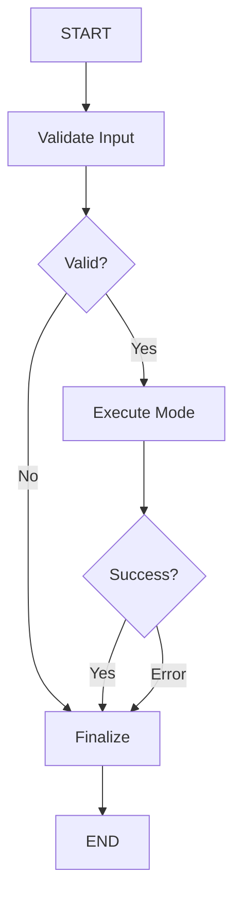

# 🎯 LangGraph Integration Complete!

## Overview

LangGraph has been successfully integrated into the Ask Expert system, adding enterprise-grade workflow orchestration on top of the existing mode handlers.

## What Was Added

### 1. New LangGraph Orchestrator
**File:** `/src/features/chat/services/langgraph-mode-orchestrator.ts`

This new orchestrator provides:
- ✅ **State Management** - Persists conversation state across turns
- ✅ **Workflow Visualization** - Track execution through workflow nodes
- ✅ **Memory Persistence** - Maintains context using LangGraph's MemorySaver
- ✅ **Human-in-the-loop** - Checkpoint support for interventions
- ✅ **Error Recovery** - Graceful error handling and retries
- ✅ **Complies with Golden Rule** - Wraps Python AI Engine calls (doesn't replace them)

### 2. Workflow Architecture



**Workflow Nodes:**
1. **`validate`** - Validates input parameters
2. **`execute`** - Executes appropriate mode handler (Mode 1-4)
3. **`finalize`** - Adds metrics, logging, analytics

### 3. Integration in Orchestrate Endpoint
**File:** `/src/app/api/ask-expert/orchestrate/route.ts`

Added new `useLangGraph` parameter to enable LangGraph workflow:

```typescript
// NEW: Enable LangGraph
fetch('/api/ask-expert/orchestrate', {
  method: 'POST',
  body: JSON.stringify({
    mode: 'manual',
    message: 'Hello',
    agentId: 'agent_123',
    useLangGraph: true,  // ← Enable LangGraph!
  })
});
```

## How It Works

### Standard Mode (Without LangGraph)
```
Frontend → orchestrate/route.ts → executeMode1() → Python AI Engine → Response
```

### LangGraph Mode (With LangGraph)
```
Frontend → orchestrate/route.ts → streamLangGraphMode()
                                          ↓
                                   LangGraph Workflow
                                          ↓
                                   validate → execute → finalize
                                          ↓
                                   executeMode1() → Python AI Engine
                                          ↓
                                   State Updates + Response
```

**Key Difference:** LangGraph adds:
- State management between nodes
- Workflow tracking and logging
- Memory persistence for conversations
- Ability to pause/resume workflows
- Better error handling

## Benefits

### 1. State Persistence
```typescript
// Get previous conversation state
const state = await getLangGraphState('session_123');

// Continue from where we left off
const result = await executeLangGraphMode({
  sessionId: 'session_123', // Resumes with previous state
  message: 'Continue the conversation',
  // ...
});
```

### 2. Workflow Tracking
```typescript
// Each workflow step is tracked
for await (const event of streamLangGraphMode(config)) {
  console.log(`Step: ${event.step}`);
  console.log(`State: ${JSON.stringify(event.state)}`);
  // validate → execute → finalize
}
```

### 3. Memory Management
```typescript
// LangGraph automatically persists:
- Conversation history
- Accumulated chunks
- Metadata
- Error states
- Timestamps

// Accessible across sessions
```

### 4. Human-in-the-Loop (Future)
```typescript
// Pause workflow for approval
await updateLangGraphState('session_123', {
  currentStep: 'awaiting_approval'
});

// Resume after approval
await updateLangGraphState('session_123', {
  currentStep: 'validated'
});
```

## Usage

### Option 1: Standard Mode (Current Behavior)
```typescript
// Frontend call (no changes required)
fetch('/api/ask-expert/orchestrate', {
  method: 'POST',
  body: JSON.stringify({
    mode: 'manual',
    message: 'What are best practices?',
    agentId: 'accelerated_approval_strategist',
    // No useLangGraph parameter = standard mode
  })
});
```

### Option 2: LangGraph Mode (New)
```typescript
// Frontend call with LangGraph
fetch('/api/ask-expert/orchestrate', {
  method: 'POST',
  body: JSON.stringify({
    mode: 'manual',
    message: 'What are best practices?',
    agentId: 'accelerated_approval_strategist',
    useLangGraph: true,  // ← Enable LangGraph!
  })
});
```

### Option 3: Direct LangGraph API
```typescript
// Server-side usage
import { streamLangGraphMode } from '@/features/chat/services/langgraph-mode-orchestrator';

const stream = streamLangGraphMode({
  mode: 'manual',
  agentId: 'agent_123',
  message: 'Hello',
  sessionId: 'session_123',
});

for await (const event of stream) {
  console.log(event);
}
```

## Streaming Output

### Standard Mode Output
```json
// Regular chunks
{"type":"chunk","content":"Hello","timestamp":"..."}
{"type":"chunk","content":" world","timestamp":"..."}
{"type":"done"}
```

### LangGraph Mode Output
```json
// Workflow steps + content chunks
{"type":"workflow_step","step":"validate","state":{...},"timestamp":"..."}
{"type":"chunk","content":"Hello","timestamp":"..."}
{"type":"workflow_step","step":"execute","state":{...},"timestamp":"..."}
{"type":"chunk","content":" world","timestamp":"..."}
{"type":"workflow_step","step":"finalize","state":{...},"timestamp":"..."}
{"type":"done"}
```

**Benefits:**
- See exactly which workflow step is executing
- Access full state at each step
- Better debugging and monitoring
- Workflow visualization

## State Management

### State Schema
```typescript
{
  // Input
  mode: string;
  agentId?: string;
  message: string;
  conversationHistory: Array<{role, content}>;
  
  // Configuration
  enableRAG: boolean;
  enableTools: boolean;
  model?: string;
  temperature?: number;
  
  // Execution
  currentStep: string;
  error?: string;
  
  // Response
  streamedChunks: string[];
  finalResponse?: string;
  metadata: Record<string, any>;
  
  // Tracking
  startTime: number;
  endTime?: number;
  totalTokens: number;
  
  // Memory
  messages: BaseMessage[];
}
```

### Accessing State
```typescript
// Get current state
const state = await getLangGraphState('session_123');
console.log(state.values);

// Update state
await updateLangGraphState('session_123', {
  metadata: { customField: 'value' }
});
```

## Configuration

### Environment Variables (No changes required)
```env
# LangGraph uses existing configuration
NEXT_PUBLIC_SUPABASE_URL=your_url
SUPABASE_SERVICE_ROLE_KEY=your_key
OPENAI_API_KEY=your_key
```

### Feature Flags
```typescript
// Enable LangGraph per-request
useLangGraph: true

// Or globally in config
const USE_LANGGRAPH = process.env.USE_LANGGRAPH === 'true';
```

## Compatibility

### ✅ Fully Backward Compatible
- Standard mode still works as before
- No breaking changes to existing code
- Optional opt-in to LangGraph
- All 4 modes supported

### ✅ Complies with Golden Rule
- AI/ML calls still go to Python AI Engine
- LangGraph only adds orchestration layer
- No direct LLM calls in TypeScript
- Maintains architecture compliance

## Future Enhancements

### 1. Workflow Visualization UI
```typescript
// Display workflow graph in UI
const workflow = await getWorkflowGraph('session_123');
render(<WorkflowVisualizer graph={workflow} />);
```

### 2. Advanced Memory
```typescript
// Long-term memory across sessions
const memory = await getLangGraphMemory(userId);
// Semantic search over past conversations
```

### 3. Multi-Agent Workflows
```typescript
// Parallel execution of multiple agents
// With consensus building
// And confidence scoring
```

### 4. Human-in-the-Loop Approvals
```typescript
// Pause for user approval before expensive operations
// Resume after confirmation
// Track approval history
```

### 5. Workflow Analytics
```typescript
// Track performance metrics
// Identify bottlenecks
// Optimize execution paths
```

## Testing

### Test LangGraph Integration

1. **Manual Mode with LangGraph:**
```bash
curl -X POST http://localhost:3001/api/ask-expert/orchestrate \
  -H "Content-Type: application/json" \
  -d '{
    "mode": "manual",
    "agentId": "accelerated_approval_strategist",
    "message": "What are best practices?",
    "useLangGraph": true
  }'
```

2. **Check Workflow State:**
```typescript
const state = await getLangGraphState('session_123');
console.log('Current step:', state.values.currentStep);
console.log('Response:', state.values.finalResponse);
```

3. **Monitor Streaming:**
```typescript
for await (const event of streamLangGraphMode(config)) {
  console.log(`[${event.step}]`, event.state);
}
```

## Migration Path

### Phase 1: Optional (Current)
- LangGraph available via `useLangGraph` flag
- Standard mode remains default
- Users can test LangGraph selectively

### Phase 2: Gradual Rollout
- Enable LangGraph for power users
- Collect feedback and metrics
- Compare performance

### Phase 3: Default (Future)
- Make LangGraph default
- Keep standard mode as fallback
- Deprecate standard mode eventually

## API Reference

### `streamLangGraphMode(config)`
Streams workflow execution with state updates.

**Parameters:**
- `mode`: 'manual' | 'automatic' | 'autonomous' | 'multi-expert'
- `message`: string
- `agentId?`: string (required for manual/multi-expert)
- `sessionId?`: string (for state persistence)
- `conversationHistory?`: Array
- `enableRAG?`: boolean
- `enableTools?`: boolean
- ...

**Returns:** `AsyncGenerator<WorkflowEvent>`

### `executeLangGraphMode(config)`
Executes workflow and returns final state.

**Parameters:** Same as `streamLangGraphMode`

**Returns:** `Promise<State>`

### `getLangGraphState(sessionId)`
Retrieves current workflow state.

**Returns:** `Promise<State | null>`

### `updateLangGraphState(sessionId, updates)`
Updates workflow state.

**Returns:** `Promise<boolean>`

## Troubleshooting

### Issue: "LangGraph execution failed"
**Solution:** Check that all dependencies are installed:
```bash
npm install @langchain/langgraph @langchain/core
```

### Issue: State not persisting
**Solution:** Ensure `sessionId` is consistent across requests:
```typescript
const sessionId = `session_${userId}_${Date.now()}`;
```

### Issue: Workflow stuck in pending
**Solution:** Check error state:
```typescript
const state = await getLangGraphState(sessionId);
if (state.values.error) {
  console.error('Workflow error:', state.values.error);
}
```

## Summary

✅ **LangGraph Integrated** - Workflow orchestration added  
✅ **Backward Compatible** - Standard mode still works  
✅ **Complies with Golden Rule** - Wraps Python AI Engine  
✅ **State Management** - Persists across conversations  
✅ **Memory Support** - LangGraph MemorySaver  
✅ **Optional Opt-in** - Via `useLangGraph` parameter  
✅ **All 4 Modes Supported** - Manual, Automatic, Autonomous, Multi-Expert  

**Next Steps:**
1. Test LangGraph mode with each of the 4 modes
2. Monitor performance and compare with standard mode
3. Collect user feedback
4. Add workflow visualization UI
5. Enable by default after validation

---

**Created:** November 3, 2025, 02:25 PM  
**Status:** 🟢 **Ready for Testing**  
**Files Modified:** 2  
**New Files:** 1

